# FreeCAD Plus toolbar governance and visual reference

## Authority and maintenance

This is the governing command-placement reference for Classic versus Plus toolbars. The [UI specification](../../UI_UX_SPEC.md#toolbar-ui-styles) owns shared interaction and sizing rules. Change this reference whenever a toolbar command, section, dropdown or caption changes; preserve command IDs and native action behavior. Do not silently remove a function when consolidating buttons.

Common actions use large buttons (**L**); secondary actions use small icons (**S**) in three rows; related/rare variants use dropdowns (**▼**). Icons below identify commands; these Markdown tables show membership and order, not exact ribbon pixel layout. Plus and Classic are mutually exclusive. Default UI is Plus; explicit saved Classic choices remain valid.

Snapshot: 2026-10-02. Fork source `d32c3542384c`; recorded upstream FreeCAD/main `b9609745048b`. Upstream means that local source snapshot, not a claim that the remote has no later commits. Native action metadata/icons were read from the fork executable at application source `52495b0cb2bd`; Plus grouping/projection was read from current source. Pending source ribbon changes are not yet incorporated in the owner's 10/2 build. Runtime export is an inventory check, not functional acceptance of every command.

For every toolbar change, review placement, native command identity, retained functionality, icon/caption, large/small/dropdown priority, enabled/checked states and accessibility. Record new implementations and build/acceptance status in the existing roadmap/WORK_STATE, rather than treating this catalog as a release record.

Classic tables list upstream definitions, including context-dependent/edit-only groups. They do not claim all groups are visible simultaneously. Compound toolbar buttons keep native choices; the final catalog expands those choices. Separators are shown as dots.

To refresh: run [ExportToolbarReference.FCMacro](../../../tools/ExportToolbarReference.FCMacro) with isolated preferences against this fork, then `python tools/GenerateToolbarReference.py <inventory.json> <recorded-upstream-ref>`. Review upstream-specific differences and source-only entries before accepting generated changes. PNG icons are native action renders of the existing FreeCAD artwork; original licensing remains in [LICENSE](../../../LICENSE) and the corresponding source resource folders.

## Navigation

- [Shared desktop toolbars](#shared-desktop-toolbars)
- [Part Design](#workbench-partdesignworkbench)
- [Part](#workbench-partworkbench)
- [Sketcher](#workbench-sketcherworkbench)
- [Surface](#workbench-surfaceworkbench)
- [Mesh](#workbench-meshworkbench)
- [Draft](#workbench-draftworkbench)
- [Assembly](#workbench-assemblyworkbench)
- [CAM](#workbench-camworkbench)
- [TechDraw](#workbench-techdrawworkbench)
- [FEM](#workbench-femworkbench)
- [Spreadsheet](#workbench-spreadsheetworkbench)
- [Material](#workbench-materialworkbench)
- [MeshPart](#workbench-meshpartworkbench)
- [Points](#workbench-pointsworkbench)
- [Robot](#workbench-robotworkbench)
- [ReverseEngineering](#workbench-reverseengineeringworkbench)
- [Inspection](#workbench-inspectionworkbench)
- [BIM](#workbench-bimworkbench)
- [OpenSCAD](#workbench-openscadworkbench)
- [Test Framework](#workbench-testworkbench)
- [Complete button/function catalog](#complete-toolbar-buttonfunction-catalog)

## Shared desktop toolbars

### Classic upstream groups

The shared list includes Part's upstream toolbar manipulator additions: Datums in Structure and the native selection filter in View, once PartGui is loaded. The Classic Workbench control is a selector, not an Assembly operation button.

| Section / toolbar group | Buttons in display order |
| --- | --- |
| File |  [New Document](#button-std_new);  [Open…](#button-std_open); 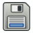 [Save](#button-std_save) |
| Edit |  [Undo](#button-std_undo);  [Redo](#button-std_redo);  · ;  [Recompute](#button-std_refresh) |
| Clipboard |  [Cut](#button-std_cut);  [Copy](#button-std_copy);  [Paste](#button-std_paste) |
| Workbench |  [Assembly](#button-std_workbench) |
| Macro |  [Record Macro](#button-std_dlgmacrorecord);  [Macros](#button-std_dlgmacroexecute);  [Execute Macro](#button-std_dlgmacroexecutedirect) |
| View |  [Fit All](#button-std_viewfitall);  [Fit Selection](#button-std_viewfitselection);  [Isometric](#button-std_viewgroup);  [Align to Selection](#button-std_aligntoselection);  · ; 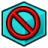 [As Is](#button-std_drawstyle);  [Vertex Selection](#button-part_selectfilter);  · ;  [Measure](#button-std_measure);  [Mass Properties](#button-std_massproperties) |
| Individual Views |  [Isometric](#button-std_viewisometric);  [Front](#button-std_viewfront);  [Top](#button-std_viewtop);  [Right](#button-std_viewright);  [Rear](#button-std_viewrear);  [Bottom](#button-std_viewbottom);  [Left](#button-std_viewleft) |
| Structure |  [New Part](#button-std_part);  [Coordinate System](#button-part_datums);  [New Group](#button-std_group);  [Make Link](#button-std_linkactions);  [Variable Set](#button-std_varset) |
| Help |  [What's This?](#button-std_whatsthis) |

### Changes in Plus

- The Workbench selector is replaced visually by the mode dropdown (Design, Draft, CAM, etc.).
- File adds Save As, Import and Export; New uses the document icon and caption **New File**, with the component-document workflow. Native command identity remains `Std_New`.
- Edit adds Delete and Preferences. Clipboard remains its native section.
- Home Structure uses Components, Add part, Group, Link Actions and Add Reference Object. The audit correction restores native Datums as one dropdown and Variable Set as a small button. Coordinate System/Datum Plane creation is also exposed through the idle component Tasks pane.
- View and Individual Views move to the View tab; Display adds selection filters, toolbar menu, dock menu and status-bar toggle.
- Help and Macro each use one compact dropdown; record, macro manager and direct execution retain native states. The audit correction restores Macro ribbon access.
- Iconless native actions get a ribbon-only icon from existing artwork. Their native QAction icons, states and menu identities remain unchanged. Native compound-menu separators are omitted from button-choice lists.
- Home common Tools adds Command Search, Measure and Mass Properties in Design. Workbenches retain their native menu/shortcut commands even where the ribbon omits a toolbar button.

### Plus shared sections

| Section / toolbar group | Buttons in display order |
| --- | --- |
| File |  [New File](#button-std_new) **L**;  [Open…](#button-std_open) **L**;  [Save](#button-std_save) **L**; 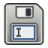 [Save As…](#button-std_saveas) **S**;  [Import…](#button-std_import) **S**;  [Export…](#button-std_export) **S** |
| Edit |  [Undo](#button-std_undo) **S**;  [Redo](#button-std_redo) **S**;  [Delete](#button-std_delete) **S**;  [Recompute](#button-std_refresh) **S**;  [Preferences](#button-std_dlgpreferences) **S** |
| Clipboard |  [Cut](#button-std_cut) **S**;  [Copy](#button-std_copy) **S**;  [Paste](#button-std_paste) **S** |
| Structure |  [Components](#button-std_componentstructure) **S**;  [Add part](#button-std_part) **L**;  [Coordinate System](#button-part_datums) **S** **▼**;  [New Group](#button-std_group) **S**;  [Make Link](#button-std_linkactions) **S** **▼**;  [Variable Set](#button-std_varset) **S**;  [Add Reference Object](#button-partdesign_addreferenceobject) **S** |
| Sketch |  [New Sketch](#button-partdesign_newsketch) **L**;  [Attach Sketch](#button-sketcher_mapsketch) **S**;  [Edit Sketch](#button-sketcher_editsketch) **L**;  [Validate Sketch](#button-sketcher_validatesketch) **S** |
| Tools |  [Command search...](#button-std_commandsearch) **S**;  [Measure](#button-std_measure) **S**;  [Mass Properties](#button-std_massproperties) **S** |
| Help | Help dropdown →  [What's This?](#button-std_whatsthis) |
| Macro | Macro dropdown →  [Record Macro](#button-std_dlgmacrorecord);  [Macros](#button-std_dlgmacroexecute);  [Execute Macro](#button-std_dlgmacroexecutedirect) |

**View tab** (shared projection of each active workbench's native View / Individual Views groups):

| Section / toolbar group | Buttons in display order |
| --- | --- |
| View |  [Fit All](#button-std_viewfitall) **L**;  [Fit Selection](#button-std_viewfitselection) **S**;  [Isometric](#button-std_viewgroup) **S** **▼**;  [Align to Selection](#button-std_aligntoselection) **S**;  [As Is](#button-std_drawstyle) **S** **▼**;  [Vertex Selection](#button-part_selectfilter) **S** **▼**;  [Measure](#button-std_measure) **S**;  [Mass Properties](#button-std_massproperties) **S** |
| Individual Views |  [Isometric](#button-std_viewisometric) **S**;  [Front](#button-std_viewfront) **S**;  [Top](#button-std_viewtop) **S**;  [Right](#button-std_viewright) **S**;  [Rear](#button-std_viewrear) **S**;  [Bottom](#button-std_viewbottom) **S**;  [Left](#button-std_viewleft) **S** |
| Display |  [Selection filters…](#button-std_entityselectionfilter) **S**;  [Toolbars](#button-std_toolbarmenu) **S**;  [Panels](#button-std_dockviewmenu) **S**;  [Status Bar](#button-std_viewstatusbar) **S** |

## Workbench comparisons

Design tabs are **Home → Modeling → Surface → Sketch → Mesh → View**. Part Design supplies Home/Modeling; Surface, Sketcher and Mesh supply their namesake tabs. Other registered modes use **Home → Tools → View**. Part is a separate mode with its native operation groups under Tools; it is not a separate Design tab.

### Part Design (`PartDesignWorkbench`)

Definition: [`src/Mod/PartDesign/Gui/Workbench.cpp`](../../../src/Mod/PartDesign/Gui/Workbench.cpp). Shared Classic groups are listed once above.

#### Classic upstream toolbar groups

| Section / toolbar group | Buttons in display order |
| --- | --- |
| Part Design Helper Features |  [New Body](#button-partdesign_body);  [New Sketch](#button-partdesign_compsketches);  [Validate Sketch](#button-sketcher_validatesketch);  [Check Geometry](#button-part_checkgeometry); 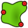 [Sub-Shape Binder](#button-partdesign_subshapebinder);  [Clone](#button-partdesign_clone) |
| Part Design Modeling Features |  [Pad](#button-partdesign_pad);  [Revolve](#button-partdesign_revolution);  [Additive Loft](#button-partdesign_additiveloft);  [Additive Pipe](#button-partdesign_additivepipe);  [Additive Helix](#button-partdesign_additivehelix);  [Additive Box](#button-partdesign_compprimitiveadditive);  · ;  [Pocket](#button-partdesign_pocket);  [Hole](#button-partdesign_hole);  [Groove](#button-partdesign_groove);  [Subtractive Loft](#button-partdesign_subtractiveloft);  [Subtractive Pipe](#button-partdesign_subtractivepipe); 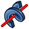 [Subtractive Helix](#button-partdesign_subtractivehelix);  [Subtractive Box](#button-partdesign_compprimitivesubtractive);  · ;  [Boolean Operation](#button-partdesign_boolean) |
| Part Design Dress-Up Features |  [Fillet](#button-partdesign_fillet);  [Chamfer](#button-partdesign_chamfer);  [Draft](#button-partdesign_draft);  [Thickness](#button-partdesign_thickness);  [Defeaturing](#button-partdesign_defeaturing) |
| Part Design Transformation Features |  [Mirror](#button-partdesign_mirrored);  [Linear Pattern](#button-partdesign_linearpattern);  [Polar Pattern](#button-partdesign_polarpattern);  [Circular Pattern](#button-partdesign_circularpattern);  [Path Pattern](#button-partdesign_pathpattern);  [Point Pattern](#button-partdesign_pointpattern);  [Multi-Transform](#button-partdesign_multitransform) |

#### Changes made / buttons consolidated or omitted

-  [Pad](#button-partdesign_pad) +  [Pocket](#button-partdesign_pocket) →  [Extrude](#button-partdesign_extrude). Add/Subtract is selected in the task pane; the component workflow also supports separate background solid results.
-  [Linear Pattern](#button-partdesign_linearpattern),  [Polar Pattern](#button-partdesign_polarpattern),  [Circular Pattern](#button-partdesign_circularpattern),  [Path Pattern](#button-partdesign_pathpattern),  [Point Pattern](#button-partdesign_pointpattern) share  [Pattern](#button-partdesign_pattern) as the primary ribbon entry. The unified task offers linear/circular patterns; the dropdown adds native concentric Circular, Path and Point tasks. The audit correction restores their upstream commands and view providers in source, without changing geometry. Those three bindings remain pending native rebuild/GUI validation in the inspected executable. Classic exposes their individual native buttons; Mirrored and MultiTransform remain separate buttons.
- Additive/Subtractive Loft, Pipe and Helix each share one dropdown. Both variants remain selectable.
- Added to native toolbar definitions:  [Add Reference Object](#button-partdesign_addreferenceobject);  [Extrude](#button-partdesign_extrude);  [Pattern](#button-partdesign_pattern);  [Isocline Curve](#button-part_isoclinecurve);  [Trim Body](#button-part_trimbody).

#### Plus UI tabs and sections

**Home:** shared sections above.

**Design → Modeling**

| Section / toolbar group | Buttons in display order |
| --- | --- |
| Part Design Modeling Features |  [Extrude](#button-partdesign_extrude) **L**;  [Add Reference Object](#button-partdesign_addreferenceobject) **S**;  [Revolve](#button-partdesign_revolution) **L**;  [Additive Loft](#button-partdesign_additiveloft) **S** **▼** { [Additive Loft](#button-partdesign_additiveloft);  [Subtractive Loft](#button-partdesign_subtractiveloft)};  [Additive Pipe](#button-partdesign_additivepipe) **S** **▼** { [Additive Pipe](#button-partdesign_additivepipe);  [Subtractive Pipe](#button-partdesign_subtractivepipe)};  [Additive Helix](#button-partdesign_additivehelix) **S** **▼** { [Additive Helix](#button-partdesign_additivehelix);  [Subtractive Helix](#button-partdesign_subtractivehelix)};  [Additive Box](#button-partdesign_compprimitiveadditive) **S** **▼**;  [Hole](#button-partdesign_hole) **S**;  [Groove](#button-partdesign_groove) **S**;  [Subtractive Box](#button-partdesign_compprimitivesubtractive) **S** **▼**;  [Boolean Operation](#button-partdesign_boolean) **S**;  [Isocline Curve](#button-part_isoclinecurve) **S**;  [Trim Body](#button-part_trimbody) **S** |
| Part Design Transformation Features |  [Mirror](#button-partdesign_mirrored) **S**;  [Pattern](#button-partdesign_pattern) **L** **▼** { [Pattern](#button-partdesign_pattern);  [Circular Pattern](#button-partdesign_circularpattern);  [Path Pattern](#button-partdesign_pathpattern);  [Point Pattern](#button-partdesign_pointpattern)};  [Multi-Transform](#button-partdesign_multitransform) **S** |
| Part Design Dress-Up Features |  [Fillet](#button-partdesign_fillet) **L**;  [Chamfer](#button-partdesign_chamfer) **S**;  [Draft](#button-partdesign_draft) **S**;  [Thickness](#button-partdesign_thickness) **S**;  [Defeaturing](#button-partdesign_defeaturing) **S** |
| Part Design Helper Features |  [New Body](#button-partdesign_body) **S**;  [New Sketch](#button-partdesign_compsketches) **S** **▼**;  [Validate Sketch](#button-sketcher_validatesketch) **S**;  [Check Geometry](#button-part_checkgeometry) **S**;  [Sub-Shape Binder](#button-partdesign_subshapebinder) **S**;  [Clone](#button-partdesign_clone) **S** |

**View:** shared sections above.

### Part (`PartWorkbench`)

Definition: [`src/Mod/Part/Gui/Workbench.cpp`](../../../src/Mod/Part/Gui/Workbench.cpp). Shared Classic groups are listed once above.

#### Classic upstream toolbar groups

| Section / toolbar group | Buttons in display order |
| --- | --- |
| Solids |  [Cube](#button-part_box);  [Cylinder](#button-part_cylinder);  [Sphere](#button-part_sphere); 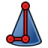 [Cone](#button-part_cone);  [Torus](#button-part_torus);  [Tube](#button-part_tube); 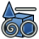 [Primitive](#button-part_primitives);  [Shape Builder](#button-part_builder) |
| Part Tools |  [New Sketch](#button-sketcher_newsketch);  [Extrude](#button-part_extrude);  [Revolve](#button-part_revolve);  [Mirror](#button-part_mirror); 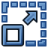 [Scale](#button-part_scale);  [Fillet](#button-part_fillet);  [Chamfer](#button-part_chamfer);  [Face From Wires](#button-part_makeface);  [Ruled Surface](#button-part_ruledsurface);  [Loft](#button-part_loft);  [Sweep](#button-part_sweep);  [Section](#button-part_section);  [Cross-Sections](#button-part_crosssections);  [3D Offset](#button-part_compoffset);  [Thickness](#button-part_thickness);  [Project on Surface](#button-part_projectiononsurface);  [Appearance per Face](#button-part_colorperface) |
| Boolean Tools |  [Compound](#button-part_compcompoundtools);  [Boolean Operation](#button-part_boolean);  [Cut](#button-part_cut);  [Union](#button-part_fuse);  [Intersection](#button-part_common);  [Connect Shapes](#button-part_compjoinfeatures);  [Boolean Fragments](#button-part_compsplitfeatures);  [Check Geometry](#button-part_checkgeometry);  [Defeaturing](#button-part_defeaturing) |

#### Changes made / buttons consolidated or omitted

- Added to native toolbar definitions:  [Add Reference Object](#button-partdesign_addreferenceobject);  [Isocline Curve](#button-part_isoclinecurve);  [Trim Body](#button-part_trimbody).

#### Plus UI tabs and sections

**Home:** shared sections above; Home excludes the Design-only Sketch and Tools sections.

**Part → Tools**

| Section / toolbar group | Buttons in display order |
| --- | --- |
| Solids |  [Cube](#button-part_box) **S**;  [Cylinder](#button-part_cylinder) **S**;  [Sphere](#button-part_sphere) **S**;  [Cone](#button-part_cone) **S**;  [Torus](#button-part_torus) **S**;  [Tube](#button-part_tube) **S**;  [Primitive](#button-part_primitives) **S**;  [Shape Builder](#button-part_builder) **S** |
| Part Tools |  [New Sketch](#button-sketcher_newsketch) **L**;  [Extrude](#button-part_extrude) **S**;  [Add Reference Object](#button-partdesign_addreferenceobject) **S**;  [Revolve](#button-part_revolve) **S**;  [Mirror](#button-part_mirror) **S**;  [Scale](#button-part_scale) **S**;  [Fillet](#button-part_fillet) **S**;  [Chamfer](#button-part_chamfer) **S**;  [Face From Wires](#button-part_makeface) **S**;  [Ruled Surface](#button-part_ruledsurface) **S**;  [Loft](#button-part_loft) **S**;  [Sweep](#button-part_sweep) **S**;  [Section](#button-part_section) **S**;  [Cross-Sections](#button-part_crosssections) **S**;  [3D Offset](#button-part_compoffset) **S** **▼**;  [Thickness](#button-part_thickness) **S**;  [Project on Surface](#button-part_projectiononsurface) **S**;  [Isocline Curve](#button-part_isoclinecurve) **S**;  [Appearance per Face](#button-part_colorperface) **S** |
| Boolean Tools |  [Compound](#button-part_compcompoundtools) **S** **▼**;  [Boolean Operation](#button-part_boolean) **S**;  [Cut](#button-part_cut) **S**;  [Union](#button-part_fuse) **S**;  [Intersection](#button-part_common) **S**;  [Trim Body](#button-part_trimbody) **S**;  [Connect Shapes](#button-part_compjoinfeatures) **S** **▼**;  [Boolean Fragments](#button-part_compsplitfeatures) **S** **▼**;  [Check Geometry](#button-part_checkgeometry) **S**;  [Defeaturing](#button-part_defeaturing) **S** |

**View:** shared sections above.

### Sketcher (`SketcherWorkbench`)

Definition: [`src/Mod/Sketcher/Gui/Workbench.cpp`](../../../src/Mod/Sketcher/Gui/Workbench.cpp). Shared Classic groups are listed once above.

#### Classic upstream toolbar groups

| Section / toolbar group | Buttons in display order |
| --- | --- |
| Sketcher |  [New Sketch](#button-sketcher_newsketch);  [Edit Sketch](#button-sketcher_editsketch);  [Attach Sketch](#button-sketcher_mapsketch);  [Reorient Sketch](#button-sketcher_reorientsketch);  [Validate Sketch](#button-sketcher_validatesketch);  [Merge Sketches](#button-sketcher_mergesketches);  [Mirror Sketch](#button-sketcher_mirrorsketch) |
| Edit Mode |  [Leave Sketch](#button-sketcher_leavesketch);  [Align View to Sketch](#button-sketcher_viewsketch);  [Toggle Section View](#button-sketcher_viewsection) |
| Geometries |  [Point](#button-sketcher_createpoint);  [Polyline](#button-sketcher_compline); 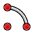 [Arc From Center](#button-sketcher_compcreatearc);  [Circle From Center](#button-sketcher_compcreateconic);  [Rectangle](#button-sketcher_compcreaterectangles);  [Triangle](#button-sketcher_compcreateregularpolygon);  [Slot](#button-sketcher_compslot);  [B-Spline](#button-sketcher_compcreatebspline);  [Text (Experimental)](#button-sketcher_createtext);  · ;  [Toggle Construction Geometry](#button-sketcher_toggleconstruction) |
| Constraints |  [Dimension](#button-sketcher_compdimensiontools);  · ; 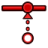 [Coincident Constraint](#button-sketcher_constraincoincidentunified);  [Horizontal Constraint](#button-sketcher_comphorver);  [Parallel Constraint](#button-sketcher_constrainparallel);  [Perpendicular Constraint](#button-sketcher_constrainperpendicular);  [Tangent/Collinear Constraint](#button-sketcher_constraintangent);  [Equal Constraint](#button-sketcher_constrainequal);  [Symmetric Constraint](#button-sketcher_constrainsymmetric);  [Block Constraint](#button-sketcher_constrainblock);  [Group Constraint (Development preview)](#button-sketcher_constraingroup);  · ;  [Toggle Driving/Reference Constraints](#button-sketcher_comptoggleconstraints) |
| Sketcher Tools | 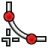 [Fillet](#button-sketcher_compcreatefillets);  [Trim Edge](#button-sketcher_compcurveedition);  [External Projection](#button-sketcher_compexternal);  [Carbon Copy](#button-sketcher_carboncopy);  · ; 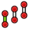 [Move / Array Transform](#button-sketcher_translate);  [Rotate / Polar Transform](#button-sketcher_rotate);  [Scale](#button-sketcher_scale);  [Offset](#button-sketcher_offset); 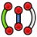 [Mirror](#button-sketcher_symmetry); 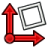 [Remove Axes Alignment](#button-sketcher_removeaxesalignment) |
| B-Spline Tools |  [Geometry to B-Spline](#button-sketcher_bsplineconverttonurbs);  [Increase B-Spline Degree](#button-sketcher_bsplineincreasedegree);  [Decrease B-Spline Degree](#button-sketcher_bsplinedecreasedegree);  [Increase knot multiplicity](#button-sketcher_compmodifyknotmultiplicity);  [Insert Knot](#button-sketcher_bsplineinsertknot);  [Join Curves](#button-sketcher_joincurves) |
| Visual Helpers |  [Select Associated Constraints](#button-sketcher_selectconstraints);  [Select Associated Geometry](#button-sketcher_selectelementsassociatedwithconstraints);  · ;  [Toggle Circular Helper for Arcs](#button-sketcher_arcoverlay);  [Toggle B-Spline Degree](#button-sketcher_compbsplineshowhidegeometryinformation);  [Toggle Internal Geometry](#button-sketcher_restoreinternalalignmentgeometry);  [Switch Virtual Space](#button-sketcher_switchvirtualspace) |

#### Changes made / buttons consolidated or omitted

- Dimension buttons are consolidated under large Auto Dimension, with vertical, horizontal, angle, radius, diameter, distance, radius/diameter, lock and Snell's-law choices. Native geometry/B-spline/constraint compound dropdowns remain native.
- Sketch support review, reusable copy and constraint-repair review are menu additions, not new buttons in the upstream Sketcher toolbar groups.
- No workbench-specific toolbar command removal found in the compared definitions; Plus changes presentation/routing and applies the shared Home/View rules above.

#### Plus UI tabs and sections

**Design → Sketch**

| Section / toolbar group | Buttons in display order |
| --- | --- |
| Sketcher |  [New Sketch](#button-sketcher_newsketch) **L**;  [Edit Sketch](#button-sketcher_editsketch) **L**;  [Attach Sketch](#button-sketcher_mapsketch) **S**;  [Reorient Sketch](#button-sketcher_reorientsketch) **S**;  [Validate Sketch](#button-sketcher_validatesketch) **S**;  [Merge Sketches](#button-sketcher_mergesketches) **S**;  [Mirror Sketch](#button-sketcher_mirrorsketch) **S** |
| Edit Mode |  [Leave Sketch](#button-sketcher_leavesketch) **S**;  [Align View to Sketch](#button-sketcher_viewsketch) **S**;  [Toggle Section View](#button-sketcher_viewsection) **S** |
| Geometries |  [Point](#button-sketcher_createpoint) **S**;  [Polyline](#button-sketcher_compline) **L** **▼**;  [Arc From Center](#button-sketcher_compcreatearc) **S** **▼**;  [Circle From Center](#button-sketcher_compcreateconic) **S** **▼**;  [Rectangle](#button-sketcher_compcreaterectangles) **L** **▼**;  [Triangle](#button-sketcher_compcreateregularpolygon) **S** **▼**;  [Slot](#button-sketcher_compslot) **S** **▼**;  [B-Spline](#button-sketcher_compcreatebspline) **S** **▼**;  [Text (Experimental)](#button-sketcher_createtext) **S**;  [Toggle Construction Geometry](#button-sketcher_toggleconstruction) **S** |
| Constraints | 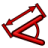 [Auto Dimension](#button-sketcher_dimension) **L** **▼** { [Auto Dimension](#button-sketcher_dimension);  [Vertical Dimension](#button-sketcher_constraindistancey); 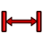 [Horizontal Dimension](#button-sketcher_constraindistancex);  [Angle Dimension](#button-sketcher_constrainangle);  [Radius Dimension](#button-sketcher_constrainradius);  [Diameter Dimension](#button-sketcher_constraindiameter); 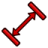 [Distance Dimension](#button-sketcher_constraindistance);  [Radius/Diameter Dimension](#button-sketcher_constrainradiam);  [Lock Position](#button-sketcher_constrainlock);  [Refraction Constraint](#button-sketcher_constrainsnellslaw)};  [Coincident Constraint](#button-sketcher_constraincoincidentunified) **S**;  [Horizontal Constraint](#button-sketcher_comphorver) **S** **▼**;  [Parallel Constraint](#button-sketcher_constrainparallel) **S**;  [Perpendicular Constraint](#button-sketcher_constrainperpendicular) **S**;  [Tangent/Collinear Constraint](#button-sketcher_constraintangent) **S**;  [Equal Constraint](#button-sketcher_constrainequal) **S**;  [Symmetric Constraint](#button-sketcher_constrainsymmetric) **S**;  [Block Constraint](#button-sketcher_constrainblock) **S**;  [Group Constraint (Development preview)](#button-sketcher_constraingroup) **S**;  [Toggle Driving/Reference Constraints](#button-sketcher_comptoggleconstraints) **S** **▼** |
| Sketcher Tools |  [Fillet](#button-sketcher_compcreatefillets) **S** **▼**;  [Trim Edge](#button-sketcher_compcurveedition) **S** **▼**;  [External Projection](#button-sketcher_compexternal) **S** **▼**;  [Carbon Copy](#button-sketcher_carboncopy) **S**;  [Move / Array Transform](#button-sketcher_translate) **S**;  [Rotate / Polar Transform](#button-sketcher_rotate) **S**;  [Scale](#button-sketcher_scale) **S**;  [Offset](#button-sketcher_offset) **S**;  [Mirror](#button-sketcher_symmetry) **S**;  [Remove Axes Alignment](#button-sketcher_removeaxesalignment) **S** |
| B-Spline Tools |  [Geometry to B-Spline](#button-sketcher_bsplineconverttonurbs) **S**;  [Increase B-Spline Degree](#button-sketcher_bsplineincreasedegree) **S**;  [Decrease B-Spline Degree](#button-sketcher_bsplinedecreasedegree) **S**;  [Increase knot multiplicity](#button-sketcher_compmodifyknotmultiplicity) **S** **▼**;  [Insert Knot](#button-sketcher_bsplineinsertknot) **S**;  [Join Curves](#button-sketcher_joincurves) **S** |
| Visual Helpers |  [Select Associated Constraints](#button-sketcher_selectconstraints) **S**;  [Select Associated Geometry](#button-sketcher_selectelementsassociatedwithconstraints) **S**;  [Toggle Circular Helper for Arcs](#button-sketcher_arcoverlay) **S**;  [Toggle B-Spline Degree](#button-sketcher_compbsplineshowhidegeometryinformation) **S** **▼**;  [Toggle Internal Geometry](#button-sketcher_restoreinternalalignmentgeometry) **S**;  [Switch Virtual Space](#button-sketcher_switchvirtualspace) **S** |

### Surface (`SurfaceWorkbench`)

Definition: [`src/Mod/Surface/Gui/Workbench.cpp`](../../../src/Mod/Surface/Gui/Workbench.cpp). Shared Classic groups are listed once above.

#### Classic upstream toolbar groups

| Section / toolbar group | Buttons in display order |
| --- | --- |
| Surface |  [Filling](#button-surface_filling);  [Fill Boundary Curves](#button-surface_geomfillsurface);  [Sections](#button-surface_sections);  [Extend Face](#button-surface_extendface);  [Curve on Mesh](#button-surface_curveonmesh);  [Blend Curve](#button-surface_blendcurve) |

#### Changes made / buttons consolidated or omitted

- No workbench-specific toolbar command removal found in the compared definitions; Plus changes presentation/routing and applies the shared Home/View rules above.

#### Plus UI tabs and sections

**Design → Surface**

| Section / toolbar group | Buttons in display order |
| --- | --- |
| Surface |  [Filling](#button-surface_filling) **S**;  [Fill Boundary Curves](#button-surface_geomfillsurface) **S**;  [Sections](#button-surface_sections) **S**;  [Extend Face](#button-surface_extendface) **L**;  [Curve on Mesh](#button-surface_curveonmesh) **S**;  [Blend Curve](#button-surface_blendcurve) **S** |

### Mesh (`MeshWorkbench`)

Definition: [`src/Mod/Mesh/Gui/Workbench.cpp`](../../../src/Mod/Mesh/Gui/Workbench.cpp). Shared Classic groups are listed once above.

#### Classic upstream toolbar groups

| Section / toolbar group | Buttons in display order |
| --- | --- |
| Mesh Tools |  [Import Mesh…](#button-mesh_import);  [Export Mesh…](#button-mesh_export); 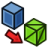 [Mesh From Shape](#button-mesh_frompartshape);  [Regular Solid](#button-mesh_buildregularsolid) |
| Mesh Modify |  [Harmonize Normals](#button-mesh_harmonizenormals);  [Flip Normals](#button-mesh_flipnormals);  [Fill Holes](#button-mesh_fillupholes);  [Close Hole](#button-mesh_fillinteractivehole);  [Add Triangle](#button-mesh_addfacet);  [Remove Components](#button-mesh_removecomponents);  [Smooth](#button-mesh_smoothing); 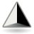 [Refinement](#button-mesh_remeshgmsh);  [Decimate](#button-mesh_decimating);  [Scale](#button-mesh_scale) |
| Mesh Boolean |  [Union](#button-mesh_union);  [Intersection](#button-mesh_intersection);  [Difference](#button-mesh_difference) |
| Mesh Cutting |  [Cut](#button-mesh_polycut);  [Trim](#button-mesh_polytrim);  [Trim With Plane](#button-mesh_trimbyplane);  [Section From Plane](#button-mesh_sectionbyplane);  [Cross-Sections](#button-mesh_crosssections) |
| Mesh Segmentation |  [Merge](#button-mesh_merge);  [Split by Components](#button-mesh_splitcomponents);  [Segmentation](#button-mesh_segmentation);  [Segmentation From Best-Fit Surfaces](#button-mesh_segmentationbestfit) |
| Mesh Analyze |  [Evaluate and Repair](#button-mesh_evaluation);  [Face Info](#button-mesh_evaluatefacet); 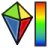 [Curvature Plot](#button-mesh_vertexcurvature);  [Curvature Info](#button-mesh_curvatureinfo);  [Evaluate Solid](#button-mesh_evaluatesolid); 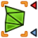 [Bounding Box Info](#button-mesh_boundingbox) |

#### Changes made / buttons consolidated or omitted

- No workbench-specific toolbar command removal found in the compared definitions; Plus changes presentation/routing and applies the shared Home/View rules above.

#### Plus UI tabs and sections

**Design → Mesh**

| Section / toolbar group | Buttons in display order |
| --- | --- |
| Mesh Tools |  [Import Mesh…](#button-mesh_import) **L**;  [Export Mesh…](#button-mesh_export) **S**;  [Mesh From Shape](#button-mesh_frompartshape) **S**;  [Regular Solid](#button-mesh_buildregularsolid) **S** |
| Mesh Modify |  [Harmonize Normals](#button-mesh_harmonizenormals) **S**;  [Flip Normals](#button-mesh_flipnormals) **S**;  [Fill Holes](#button-mesh_fillupholes) **S**;  [Close Hole](#button-mesh_fillinteractivehole) **S**;  [Add Triangle](#button-mesh_addfacet) **S**;  [Remove Components](#button-mesh_removecomponents) **S**;  [Smooth](#button-mesh_smoothing) **S**;  [Refinement](#button-mesh_remeshgmsh) **S**;  [Decimate](#button-mesh_decimating) **S**;  [Scale](#button-mesh_scale) **S** |
| Mesh Boolean |  [Union](#button-mesh_union) **S**;  [Intersection](#button-mesh_intersection) **S**;  [Difference](#button-mesh_difference) **S** |
| Mesh Cutting |  [Cut](#button-mesh_polycut) **S**;  [Trim](#button-mesh_polytrim) **S**;  [Trim With Plane](#button-mesh_trimbyplane) **S**;  [Section From Plane](#button-mesh_sectionbyplane) **S**;  [Cross-Sections](#button-mesh_crosssections) **S** |
| Mesh Segmentation |  [Merge](#button-mesh_merge) **S**;  [Split by Components](#button-mesh_splitcomponents) **S**;  [Segmentation](#button-mesh_segmentation) **S**;  [Segmentation From Best-Fit Surfaces](#button-mesh_segmentationbestfit) **S** |
| Mesh Analyze |  [Evaluate and Repair](#button-mesh_evaluation) **S**;  [Face Info](#button-mesh_evaluatefacet) **S**;  [Curvature Plot](#button-mesh_vertexcurvature) **S**;  [Curvature Info](#button-mesh_curvatureinfo) **S**;  [Evaluate Solid](#button-mesh_evaluatesolid) **S**;  [Bounding Box Info](#button-mesh_boundingbox) **S** |

### Draft (`DraftWorkbench`)

Definition: [`src/Mod/Draft/InitGui.py`](../../../src/Mod/Draft/InitGui.py). Shared Classic groups are listed once above.

#### Classic upstream toolbar groups

| Section / toolbar group | Buttons in display order |
| --- | --- |
| Draft Creation | 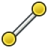 [Line](#button-draft_line);  [Polyline](#button-draft_wire);  [Fillet](#button-draft_fillet);  [Arc](#button-draft_arctools);  [Circle](#button-draft_circle);  [Ellipse](#button-draft_ellipse);  [Rectangle](#button-draft_rectangle);  [Polygon](#button-draft_polygon);  [B-Spline](#button-draft_bspline);  [Cubic Bézier Curve](#button-draft_beziertools);  [Point](#button-draft_point);  [Facebinder](#button-draft_facebinder);  [Shape From Text](#button-draft_shapestring);  [Hatch](#button-draft_hatch) |
| Draft Annotation |  [Text](#button-draft_text);  [Dimension](#button-draft_dimension);  [Label](#button-draft_label);  [Annotation Styles](#button-draft_annotationstyleeditor) |
| Draft Modification |  [Move](#button-draft_move);  [Rotate](#button-draft_rotate);  [Scale](#button-draft_scale);  [Mirror](#button-draft_mirror);  [Offset](#button-draft_offset);  [Trimex](#button-draft_trimex);  [Stretch](#button-draft_stretch);  · ;  [Clone](#button-draft_clone);  [Array](#button-draft_arraytools);  · ;  [Edit](#button-draft_edit); 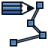 [Highlight Subelements](#button-draft_subelementhighlight);  · ;  [Join](#button-draft_join);  [Split](#button-draft_split);  [Upgrade](#button-draft_upgrade);  [Downgrade](#button-draft_downgrade);  · ;  [Convert Wire/B-Spline](#button-draft_wiretobspline);  [Draft to Sketch](#button-draft_draft2sketch);  [Set Slope](#button-draft_slope);  [Flip Dimension](#button-draft_flipdimension);  · ;  [Shape 2D View](#button-draft_shape2dview) |
| Draft Utility |  [Manage Layers](#button-draft_layermanager);  [New Named Group](#button-draft_addnamedgroup);  [Select Group](#button-draft_selectgroup);  [Add to Layer](#button-draft_addtolayer);  [Add to Group](#button-draft_addtogroup);  [Add to Construction Group](#button-draft_addconstruction);  [Toggle Wireframe](#button-draft_toggledisplaymode);  [Working Plane Proxy](#button-draft_workingplaneproxy) |
| Draft Snap |  [Snap Lock](#button-draft_snap_lock);  [Snap Endpoint](#button-draft_snap_endpoint);  [Snap Midpoint](#button-draft_snap_midpoint);  [Snap Center](#button-draft_snap_center);  [Snap Angle](#button-draft_snap_angle);  [Snap Intersection](#button-draft_snap_intersection);  [Snap Perpendicular](#button-draft_snap_perpendicular);  [Snap Extension](#button-draft_snap_extension);  [Snap Parallel](#button-draft_snap_parallel);  [Snap Special](#button-draft_snap_special);  [Snap Near](#button-draft_snap_near);  [Snap Ortho](#button-draft_snap_ortho);  [Snap Grid](#button-draft_snap_grid);  [Snap Working Plane](#button-draft_snap_workingplane);  [Snap Dimensions](#button-draft_snap_dimensions);  · ;  [Toggle Grid](#button-draft_togglegrid) |

#### Changes made / buttons consolidated or omitted

- No workbench-specific toolbar command removal found in the compared definitions; Plus changes presentation/routing and applies the shared Home/View rules above.

#### Plus UI tabs and sections

**Home:** shared sections above; Home excludes the Design-only Sketch and Tools sections.

**Draft → Tools**

| Section / toolbar group | Buttons in display order |
| --- | --- |
| Draft Creation |  [Line](#button-draft_line) **L**;  [Polyline](#button-draft_wire) **L**;  [Fillet](#button-draft_fillet) **S**;  [Arc](#button-draft_arctools) **S** **▼**;  [Circle](#button-draft_circle) **S**;  [Ellipse](#button-draft_ellipse) **S**;  [Rectangle](#button-draft_rectangle) **S**;  [Polygon](#button-draft_polygon) **S**;  [B-Spline](#button-draft_bspline) **S**;  [Cubic Bézier Curve](#button-draft_beziertools) **S** **▼**;  [Point](#button-draft_point) **S**;  [Facebinder](#button-draft_facebinder) **S**;  [Shape From Text](#button-draft_shapestring) **S**;  [Hatch](#button-draft_hatch) **S** |
| Draft Annotation |  [Text](#button-draft_text) **S**;  [Dimension](#button-draft_dimension) **S**;  [Label](#button-draft_label) **S**;  [Annotation Styles](#button-draft_annotationstyleeditor) **S** |
| Draft Modification |  [Move](#button-draft_move) **S**;  [Rotate](#button-draft_rotate) **S**;  [Scale](#button-draft_scale) **S**;  [Mirror](#button-draft_mirror) **S**;  [Offset](#button-draft_offset) **S**;  [Trimex](#button-draft_trimex) **S**;  [Stretch](#button-draft_stretch) **S**;  [Clone](#button-draft_clone) **S**;  [Array](#button-draft_arraytools) **S** **▼**;  [Edit](#button-draft_edit) **S**;  [Highlight Subelements](#button-draft_subelementhighlight) **S**;  [Join](#button-draft_join) **S**;  [Split](#button-draft_split) **S**;  [Upgrade](#button-draft_upgrade) **S**;  [Downgrade](#button-draft_downgrade) **S**;  [Convert Wire/B-Spline](#button-draft_wiretobspline) **S**;  [Draft to Sketch](#button-draft_draft2sketch) **S**;  [Set Slope](#button-draft_slope) **S**;  [Flip Dimension](#button-draft_flipdimension) **S**;  [Shape 2D View](#button-draft_shape2dview) **S** |
| Draft Utility |  [Manage Layers](#button-draft_layermanager) **S**;  [New Named Group](#button-draft_addnamedgroup) **S**;  [Select Group](#button-draft_selectgroup) **S**;  [Add to Layer](#button-draft_addtolayer) **S**;  [Add to Group](#button-draft_addtogroup) **S**;  [Add to Construction Group](#button-draft_addconstruction) **S**;  [Toggle Wireframe](#button-draft_toggledisplaymode) **S**;  [Working Plane Proxy](#button-draft_workingplaneproxy) **S** |
| Draft Snap |  [Snap Lock](#button-draft_snap_lock) **S**;  [Snap Endpoint](#button-draft_snap_endpoint) **S**;  [Snap Midpoint](#button-draft_snap_midpoint) **S**;  [Snap Center](#button-draft_snap_center) **S**;  [Snap Angle](#button-draft_snap_angle) **S**;  [Snap Intersection](#button-draft_snap_intersection) **S**;  [Snap Perpendicular](#button-draft_snap_perpendicular) **S**;  [Snap Extension](#button-draft_snap_extension) **S**;  [Snap Parallel](#button-draft_snap_parallel) **S**;  [Snap Special](#button-draft_snap_special) **S**;  [Snap Near](#button-draft_snap_near) **S**;  [Snap Ortho](#button-draft_snap_ortho) **S**;  [Snap Grid](#button-draft_snap_grid) **S**;  [Snap Working Plane](#button-draft_snap_workingplane) **S**;  [Snap Dimensions](#button-draft_snap_dimensions) **S**;  [Toggle Grid](#button-draft_togglegrid) **S** |

**View:** shared sections above.

### Assembly (`AssemblyWorkbench`)

Definition: [`src/Mod/Assembly/InitGui.py`](../../../src/Mod/Assembly/InitGui.py). Shared Classic groups are listed once above.

#### Classic upstream toolbar groups

| Section / toolbar group | Buttons in display order |
| --- | --- |
| Assembly |  [New Assembly](#button-assembly_createassembly);  [Insert Component](#button-assembly_insert);  [Circular Link Array](#button-part_linkarrays);  [Solve Assembly](#button-assembly_solveassembly);  [Exploded View](#button-assembly_createview);  [Snapshot](#button-assembly_createsnapshot);  [Simulation](#button-assembly_createsimulation);  [Bill of Materials](#button-assembly_createbom) |
| Assembly Joints |  [Toggle Grounded](#button-assembly_togglegrounded); 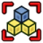 [Create Rigid Group](#button-assembly_createjointrigidgroup);  · ;  [Fixed Joint](#button-assembly_createjointfixed);  [Revolute Joint](#button-assembly_createjointrevolute); 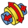 [Cylindrical Joint](#button-assembly_createjointcylindrical);  [Slider Joint](#button-assembly_createjointslider);  [Ball Joint](#button-assembly_createjointball);  · ;  [Distance Joint](#button-assembly_createjointdistance);  [Parallel Joint](#button-assembly_createjointparallel);  [Perpendicular Joint](#button-assembly_createjointperpendicular);  [Angle Joint](#button-assembly_createjointangle);  · ;  [Rack and Pinion Joint](#button-assembly_createjointrackpinion);  [Screw Joint](#button-assembly_createjointscrew);  [Gears Joint](#button-assembly_createjointgearbelt) |

#### Changes made / buttons consolidated or omitted

- No workbench-specific toolbar command removal found in the compared definitions; Plus changes presentation/routing and applies the shared Home/View rules above.

#### Plus UI tabs and sections

**Home:** shared sections above; Home excludes the Design-only Sketch and Tools sections.

**Assembly → Tools**

| Section / toolbar group | Buttons in display order |
| --- | --- |
| Assembly |  [New Assembly](#button-assembly_createassembly) **S**;  [Insert Component](#button-assembly_insert) **S** **▼**;  [Circular Link Array](#button-part_linkarrays) **S** **▼**;  [Solve Assembly](#button-assembly_solveassembly) **S**;  [Exploded View](#button-assembly_createview) **S**;  [Snapshot](#button-assembly_createsnapshot) **S**;  [Simulation](#button-assembly_createsimulation) **S**;  [Bill of Materials](#button-assembly_createbom) **S** |
| Assembly Joints |  [Toggle Grounded](#button-assembly_togglegrounded) **S**;  [Create Rigid Group](#button-assembly_createjointrigidgroup) **S**;  [Fixed Joint](#button-assembly_createjointfixed) **S**;  [Revolute Joint](#button-assembly_createjointrevolute) **S**;  [Cylindrical Joint](#button-assembly_createjointcylindrical) **S**;  [Slider Joint](#button-assembly_createjointslider) **S**;  [Ball Joint](#button-assembly_createjointball) **S**;  [Distance Joint](#button-assembly_createjointdistance) **S**;  [Parallel Joint](#button-assembly_createjointparallel) **S**;  [Perpendicular Joint](#button-assembly_createjointperpendicular) **S**;  [Angle Joint](#button-assembly_createjointangle) **S**;  [Rack and Pinion Joint](#button-assembly_createjointrackpinion) **S**;  [Screw Joint](#button-assembly_createjointscrew) **S**;  [Gears Joint](#button-assembly_createjointgearbelt) **S** **▼** |

**View:** shared sections above.

### CAM (`CAMWorkbench`)

Definition: [`src/Mod/CAM/InitGui.py`](../../../src/Mod/CAM/InitGui.py). Shared Classic groups are listed once above.

#### Classic upstream toolbar groups

| Section / toolbar group | Buttons in display order |
| --- | --- |
| Project Setup |  [New Job](#button-cam_job);  [Work Plane](#button-cam_workplane);  [Sanity Check](#button-cam_sanity);  [Post Process](#button-cam_posttools) |
| Tool Commands |  [CAM Simulator](#button-cam_simtools);  [Inspect Toolpath](#button-cam_inspect);  [Finish Selecting Loop](#button-cam_selectloop);  [Toggle Operation](#button-cam_opactivetoggle);  [Add Toolbit…](#button-cam_toolbitdock) |
| New Operations |  [Profile](#button-cam_profile);  [Pocket Shape](#button-cam_pocket_shape);  [Mill Facing](#button-cam_millfacing);  [Helix](#button-cam_helix);  [Adaptive](#button-cam_adaptive);  [Slot](#button-cam_slot);  [Drilling](#button-cam_drillingtools);  [Engrave](#button-cam_engravetools) |
| Path Modification |  [Copy Operation](#button-cam_operationcopy);  [Array](#button-cam_array); 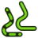 [Simple Copy](#button-cam_simplecopy); 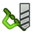 [Array](#button-cam_dressuptools) |

#### Changes made / buttons consolidated or omitted

- Project Setup adds Mesh Preparation, Holding Tabs and Indexed Setup.
- New Operations exposes Parallel / Waterline (`CAM_PlanarSurface`) with OpenCAMLib. Stock upstream makes advanced 3D operations conditional; grouping can change when the advanced setting is enabled.
- Added to native toolbar definitions:  [Holding Tab](#button-cam_holdingtab);  [Indexed Setup](#button-cam_indexedsetup);  [Review CAM mesh...](#button-cam_meshpreparation);  [Parallel / Waterline](#button-cam_planarsurface).

#### Plus UI tabs and sections

**Home:** shared sections above; Home excludes the Design-only Sketch and Tools sections.

**CAM → Tools**

| Section / toolbar group | Buttons in display order |
| --- | --- |
| Project Setup |  [New Job](#button-cam_job) **L**;  [Review CAM mesh...](#button-cam_meshpreparation) **S**;  [Work Plane](#button-cam_workplane) **S**;  [Holding Tab](#button-cam_holdingtab) **S**;  [Indexed Setup](#button-cam_indexedsetup) **S**;  [Sanity Check](#button-cam_sanity) **S**;  [Post Process](#button-cam_posttools) **S** **▼** |
| Tool Commands |  [CAM Simulator](#button-cam_simtools) **S** **▼**;  [Inspect Toolpath](#button-cam_inspect) **S**;  [Finish Selecting Loop](#button-cam_selectloop) **S**;  [Toggle Operation](#button-cam_opactivetoggle) **S**;  [Add Toolbit…](#button-cam_toolbitdock) **S** |
| New Operations |  [Profile](#button-cam_profile) **S**;  [Pocket Shape](#button-cam_pocket_shape) **S**;  [Mill Facing](#button-cam_millfacing) **S**;  [Helix](#button-cam_helix) **S**;  [Adaptive](#button-cam_adaptive) **S**;  [Slot](#button-cam_slot) **S**;  [Drilling](#button-cam_drillingtools) **S** **▼**;  [Engrave](#button-cam_engravetools) **S** **▼**;  [Parallel / Waterline](#button-cam_planarsurface) **S** |
| Path Modification |  [Copy Operation](#button-cam_operationcopy) **S**;  [Array](#button-cam_array) **S**;  [Simple Copy](#button-cam_simplecopy) **S**;  [Array](#button-cam_dressuptools) **S** **▼** |

**View:** shared sections above.

### TechDraw (`TechDrawWorkbench`)

Definition: [`src/Mod/TechDraw/Gui/Workbench.cpp`](../../../src/Mod/TechDraw/Gui/Workbench.cpp). Shared Classic groups are listed once above.

#### Classic upstream toolbar groups

| Section / toolbar group | Buttons in display order |
| --- | --- |
| TechDraw Pages |  [New Page](#button-techdraw_pagedefault);  [New Page From Template](#button-techdraw_pagetemplate);  [Update Template Fields](#button-techdraw_filltemplatefields);  [Redraw Page](#button-techdraw_redrawpage);  [Print All Pages](#button-techdraw_printall) |
| TechDraw Views |  [New View](#button-techdraw_view);  [Broken View](#button-techdraw_brokenview);  [Active View](#button-techdraw_activeview);  [Section View](#button-techdraw_sectiongroup);  [Detail View](#button-techdraw_detailview);  [Draft View](#button-techdraw_draftview);  [Spreadsheet View](#button-techdraw_spreadsheetview);  [Clip Group](#button-techdraw_clipgroup) |
| TechDraw Stacking |  [Stack Top](#button-techdraw_stackgroup) |
| TechDraw Dimensions |  [Dimension](#button-techdraw_dimension);  [Dimension](#button-techdraw_compdimensiontools);  [Length Dimension](#button-techdraw_lengthdimension);  [Horizontal Length Dimension](#button-techdraw_horizontaldimension);  [Vertical Length Dimension](#button-techdraw_verticaldimension);  [Radius Dimension](#button-techdraw_radiusdimension);  [Diameter Dimension](#button-techdraw_diameterdimension);  [Angle Dimension](#button-techdraw_angledimension);  [Angle Dimension From 3 Points](#button-techdraw_3ptangledimension);  [Area Annotation](#button-techdraw_areadimension);  [Horizontal extent](#button-techdraw_extentgroup);  [Balloon Annotation](#button-techdraw_balloon);  [Axonometric Length Dimension](#button-techdraw_axolengthdimension);  [Repair Dimension References](#button-techdraw_dimensionrepair) |
| TechDraw Attributes |  [Select Line Attributes, Cascade Spacing and Delta Distance](#button-techdraw_extensionselectlineattributes);  [Change Line Attributes](#button-techdraw_extensionchangelineattributes);  [Extend Line](#button-techdraw_extensionextendshortenlinegroup);  [Toggle View Lock](#button-techdraw_extensionlockunlockview);  [Position Section View](#button-techdraw_extensionpositionsectionview);  [Area Annotation](#button-techdraw_extensionareaannotation);  [Arc Length Annotation](#button-techdraw_extensionarclengthannotation);  [Customize Format Label](#button-techdraw_extensioncustomizeformat) |
| TechDraw Centerlines |  [Circle Centerlines](#button-techdraw_extensioncirclecenterlinesgroup);  [Cosmetic Thread Hole Side View](#button-techdraw_extensionthreadsgroup);  [Cosmetic Intersection Vertices](#button-techdraw_commandvertexcreationgroup);  [Cosmetic 1 Point Circle](#button-techdraw_extensiondrawcirclesgroup); 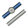 [Cosmetic Parallel Line](#button-techdraw_extensionlineppgroup) |
| TechDraw Extend Dimensions |  [Horizontal Chain Dimension](#button-techdraw_extensioncreatechaindimensiongroup);  [Horizontal Coordinate Dimension](#button-techdraw_extensioncreatecoorddimensiongroup);  [Horizontal Chamfer Dimension](#button-techdraw_extensionchamferdimensiongroup);  [Arc Length Dimension](#button-techdraw_extensioncreatelengtharc);  [Insert '⌀' Prefix](#button-techdraw_extensioninsertprefixgroup);  [Increase Decimal Places](#button-techdraw_extensionincreasedecreasegroup) |
| TechDraw File Access |  [Export Page as SVG](#button-techdraw_exportpagesvg);  [Export Page as DXF](#button-techdraw_exportpagedxf) |
| TechDraw Decoration | 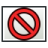 [Toggle View Frames](#button-techdraw_toggleframe);  [Image Hatch](#button-techdraw_hatch);  [Geometric Hatch](#button-techdraw_geometrichatch) |
| TechDraw Annotation |  [Rich Text Annotation](#button-techdraw_richtextannotation);  [Leader Line](#button-techdraw_leaderline);  [Cosmetic Vertex](#button-techdraw_cosmeticvertexgroup);  [Centerline on Face](#button-techdraw_centerlinegroup);  [Cosmetic Line Through 2 Points](#button-techdraw_2pointcosmeticline);  [Edit Line Appearance](#button-techdraw_decorateline);  [Toggle Edge Visibility](#button-techdraw_showall);  [Weld Symbol](#button-techdraw_weldsymbol);  [Surface Finish Symbol](#button-techdraw_surfacefinishsymbols);  [Hole/Shaft Fit](#button-techdraw_holeshaftfit) |

#### Changes made / buttons consolidated or omitted

- Removed from native toolbar definitions:  [Angle Dimension From 3 Points](#button-techdraw_3ptangledimension);  [Angle Dimension](#button-techdraw_angledimension);  [Area Annotation](#button-techdraw_areadimension);  [Diameter Dimension](#button-techdraw_diameterdimension);  [Dimension](#button-techdraw_dimension);  [Arc Length Annotation](#button-techdraw_extensionarclengthannotation);  [Area Annotation](#button-techdraw_extensionareaannotation);  [Horizontal Chamfer Dimension](#button-techdraw_extensionchamferdimensiongroup);  [Horizontal Chain Dimension](#button-techdraw_extensioncreatechaindimensiongroup);  [Horizontal Coordinate Dimension](#button-techdraw_extensioncreatecoorddimensiongroup);  [Arc Length Dimension](#button-techdraw_extensioncreatelengtharc);  [Horizontal extent](#button-techdraw_extentgroup);  [Horizontal Length Dimension](#button-techdraw_horizontaldimension);  [Length Dimension](#button-techdraw_lengthdimension);  [Radius Dimension](#button-techdraw_radiusdimension);  [Vertical Length Dimension](#button-techdraw_verticaldimension).

#### Plus UI tabs and sections

**Home:** shared sections above; Home excludes the Design-only Sketch and Tools sections.

**TechDraw → Tools**

| Section / toolbar group | Buttons in display order |
| --- | --- |
| TechDraw Pages |  [New Page](#button-techdraw_pagedefault) **L**;  [New Page From Template](#button-techdraw_pagetemplate) **S**;  [Update Template Fields](#button-techdraw_filltemplatefields) **S**;  [Redraw Page](#button-techdraw_redrawpage) **S**;  [Print All Pages](#button-techdraw_printall) **S** |
| TechDraw Views |  [New View](#button-techdraw_view) **S**;  [Broken View](#button-techdraw_brokenview) **S**;  [Active View](#button-techdraw_activeview) **S**;  [Section View](#button-techdraw_sectiongroup) **S** **▼**;  [Detail View](#button-techdraw_detailview) **S**;  [Draft View](#button-techdraw_draftview) **S**;  [Spreadsheet View](#button-techdraw_spreadsheetview) **S**;  [Clip Group](#button-techdraw_clipgroup) **S** |
| TechDraw Stacking |  [Stack Top](#button-techdraw_stackgroup) **S** **▼** |
| TechDraw Dimensions |  [Dimension](#button-techdraw_compdimensiontools) **S** **▼**;  [Balloon Annotation](#button-techdraw_balloon) **S**;  [Axonometric Length Dimension](#button-techdraw_axolengthdimension) **S**;  [Repair Dimension References](#button-techdraw_dimensionrepair) **S** |
| TechDraw Attributes |  [Select Line Attributes, Cascade Spacing and Delta Distance](#button-techdraw_extensionselectlineattributes) **S**;  [Change Line Attributes](#button-techdraw_extensionchangelineattributes) **S**;  [Extend Line](#button-techdraw_extensionextendshortenlinegroup) **S** **▼**;  [Toggle View Lock](#button-techdraw_extensionlockunlockview) **S**;  [Position Section View](#button-techdraw_extensionpositionsectionview) **S**;  [Customize Format Label](#button-techdraw_extensioncustomizeformat) **S** |
| TechDraw Centerlines |  [Circle Centerlines](#button-techdraw_extensioncirclecenterlinesgroup) **S** **▼**;  [Cosmetic Thread Hole Side View](#button-techdraw_extensionthreadsgroup) **S** **▼**;  [Cosmetic Intersection Vertices](#button-techdraw_commandvertexcreationgroup) **S** **▼**;  [Cosmetic 1 Point Circle](#button-techdraw_extensiondrawcirclesgroup) **S** **▼**;  [Cosmetic Parallel Line](#button-techdraw_extensionlineppgroup) **S** **▼** |
| TechDraw Extend Dimensions |  [Insert '⌀' Prefix](#button-techdraw_extensioninsertprefixgroup) **S** **▼**;  [Increase Decimal Places](#button-techdraw_extensionincreasedecreasegroup) **S** **▼** |
| TechDraw File Access |  [Export Page as SVG](#button-techdraw_exportpagesvg) **S**;  [Export Page as DXF](#button-techdraw_exportpagedxf) **S** |
| TechDraw Decoration |  [Toggle View Frames](#button-techdraw_toggleframe) **S**;  [Image Hatch](#button-techdraw_hatch) **S**;  [Geometric Hatch](#button-techdraw_geometrichatch) **S** |
| TechDraw Annotation |  [Rich Text Annotation](#button-techdraw_richtextannotation) **S**;  [Leader Line](#button-techdraw_leaderline) **S**;  [Cosmetic Vertex](#button-techdraw_cosmeticvertexgroup) **S** **▼**;  [Centerline on Face](#button-techdraw_centerlinegroup) **S** **▼**;  [Cosmetic Line Through 2 Points](#button-techdraw_2pointcosmeticline) **S**;  [Edit Line Appearance](#button-techdraw_decorateline) **S**;  [Toggle Edge Visibility](#button-techdraw_showall) **S**;  [Weld Symbol](#button-techdraw_weldsymbol) **S**;  [Surface Finish Symbol](#button-techdraw_surfacefinishsymbols) **S**;  [Hole/Shaft Fit](#button-techdraw_holeshaftfit) **S** |

**View:** shared sections above.

### FEM (`FemWorkbench`)

Definition: [`src/Mod/Fem/Gui/Workbench.cpp`](../../../src/Mod/Fem/Gui/Workbench.cpp). Shared Classic groups are listed once above.

**Source-only / not packaged in the inspected build.** These toolbar definitions exist in source. When the workbench is installed and registered, its Plus mode uses shared Home/View and these native groups in Tools. No executable/icon-menu acceptance is claimed for this workbench.

#### Classic upstream toolbar groups

| Section / toolbar group | Buttons in display order |
| --- | --- |
| Model |  [New Analysis](#button-fem_analysis);  · ;  [Solid Material](#button-fem_materialsolid);  [Fluid Material](#button-fem_materialfluid);  [Non-Linear Mechanical Material](#button-fem_materialmechanicalnonlinear);  [Reinforced Material (Concrete)](#button-fem_materialreinforced);  [Material Editor](#button-fem_materialeditor);  · ;  [Beam Cross Section](#button-fem_elementgeometry1d);  [Beam Rotation](#button-fem_elementrotation1d);  [Shell Plate Thickness](#button-fem_elementgeometry2d);  [Fluid Section for 1D Flow](#button-fem_elementfluid1d) |
| Electromagnetic Boundary Conditions | — [Electromagnetic Boundary Conditions](#button-fem_compemconstraints) |
| Fluid Boundary Conditions |  [Initial Flow Velocity Condition](#button-fem_constraintinitialflowvelocity);  [Initial Pressure Condition](#button-fem_constraintinitialpressure);  · ;  [Flow Velocity Boundary Condition](#button-fem_constraintflowvelocity) |
| Geometrical Analysis Features |  [Plane Multi-Point Constraint](#button-fem_constraintplanerotation);  [Section Print Feature](#button-fem_constraintsectionprint);  [Local Coordinate System](#button-fem_constrainttransform) |
| Mechanical Boundary Conditions and Loads |  [Fixed Boundary Condition](#button-fem_constraintfixed);  [Rigid Body Constraint](#button-fem_constraintrigidbody);  [Displacement Boundary Condition](#button-fem_constraintdisplacement);  [Contact Constraint](#button-fem_constraintcontact);  [Tie Constraint](#button-fem_constrainttie);  [Spring Boundary Condition](#button-fem_constraintspring);  · ;  [Force Load](#button-fem_constraintforce);  [Pressure Load](#button-fem_constraintpressure);  [Centrifugal Load](#button-fem_constraintcentrif);  [Gravity Load](#button-fem_constraintselfweight) |
| Thermal Boundary Conditions and Loads |  [Initial Temperature](#button-fem_constraintinitialtemperature);  · ;  [Heat Flux Load](#button-fem_constraintheatflux);  [Temperature Boundary Condition](#button-fem_constrainttemperature);  [Body Heat Source](#button-fem_constraintbodyheatsource) |
| Mesh |  [Mesh From Shape by Netgen](#button-fem_meshnetgenfromshape);  [Mesh From Shape by Gmsh](#button-fem_meshgmshfromshape);  · ;  [Mesh Refinement](#button-fem_meshregion);  [Mesh Group](#button-fem_meshgroup); — [GMSH Refinements](#button-fem_meshgmshrefinement);  · ;  [FEM Mesh to Mesh](#button-fem_femmesh2mesh) |
| Solve | — [Solvers](#button-fem_compsolvers);  · ; — [Mechanical Equations](#button-fem_compmechequations); — [Electromagnetic Equations](#button-fem_compemequations);  [Flow Equation](#button-fem_equationflow);  [Flux Equation](#button-fem_equationflux);  [Heat Equation](#button-fem_equationheat);  · ;  [Solver Job Control](#button-fem_solvercontrol);  [Run Solver](#button-fem_solverrun) |
| Results |  [Purge Results](#button-fem_resultspurge);  [Show Result](#button-fem_resultshow);  · ;  [Apply Changes to Pipeline](#button-fem_postapplychanges);  [Post Pipeline From Result](#button-fem_postpipelinefromresult);  [Pipeline Branch](#button-fem_postbranchfilter);  · ;  [Warp Filter](#button-fem_postfilterwarp);  [Scalar Clip Filter](#button-fem_postfilterclipscalar);  [Function Cut Filter](#button-fem_postfiltercutfunction);  [Region Clip Filter](#button-fem_postfilterclipregion);  [Contours Filter](#button-fem_postfiltercontours);  [Glyph Filter](#button-fem_postfilterglyph);  [Line Clip Filter](#button-fem_postfilterdataalongline);  [Stress Linearization Plot](#button-fem_postfilterlinearizedstresses);  [Data at Point Clip Filter](#button-fem_postfilterdataatpoint);  [Calculator Filter](#button-fem_postfiltercalculator);  · ; — [Filter Functions](#button-fem_postcreatefunctions); — [Data Visualizations](#button-fem_postvisualization) |
| Utilities |  [Clipping Plane on Face](#button-fem_clippingplaneadd);  [Remove All Clipping Planes](#button-fem_clippingplaneremoveall);  [FEM Examples](#button-fem_examples) |

#### Changes made / buttons consolidated or omitted

- No workbench-specific toolbar command removal found in the compared definitions; Plus changes presentation/routing and applies the shared Home/View rules above.

#### Plus UI tabs and sections

**FEM → Tools**

| Section / toolbar group | Buttons in display order |
| --- | --- |
| Model |  [New Analysis](#button-fem_analysis) **S**;  [Solid Material](#button-fem_materialsolid) **S**;  [Fluid Material](#button-fem_materialfluid) **S**;  [Non-Linear Mechanical Material](#button-fem_materialmechanicalnonlinear) **S**;  [Reinforced Material (Concrete)](#button-fem_materialreinforced) **S**;  [Material Editor](#button-fem_materialeditor) **S**;  [Beam Cross Section](#button-fem_elementgeometry1d) **S**;  [Beam Rotation](#button-fem_elementrotation1d) **S**;  [Shell Plate Thickness](#button-fem_elementgeometry2d) **S**;  [Fluid Section for 1D Flow](#button-fem_elementfluid1d) **S** |
| Electromagnetic Boundary Conditions | — [Electromagnetic Boundary Conditions](#button-fem_compemconstraints) **S** |
| Fluid Boundary Conditions |  [Initial Flow Velocity Condition](#button-fem_constraintinitialflowvelocity) **S**;  [Initial Pressure Condition](#button-fem_constraintinitialpressure) **S**;  [Flow Velocity Boundary Condition](#button-fem_constraintflowvelocity) **S** |
| Geometrical Analysis Features |  [Plane Multi-Point Constraint](#button-fem_constraintplanerotation) **S**;  [Section Print Feature](#button-fem_constraintsectionprint) **S**;  [Local Coordinate System](#button-fem_constrainttransform) **S** |
| Mechanical Boundary Conditions and Loads |  [Fixed Boundary Condition](#button-fem_constraintfixed) **S**;  [Rigid Body Constraint](#button-fem_constraintrigidbody) **S**;  [Displacement Boundary Condition](#button-fem_constraintdisplacement) **S**;  [Contact Constraint](#button-fem_constraintcontact) **S**;  [Tie Constraint](#button-fem_constrainttie) **S**;  [Spring Boundary Condition](#button-fem_constraintspring) **S**;  [Force Load](#button-fem_constraintforce) **S**;  [Pressure Load](#button-fem_constraintpressure) **S**;  [Centrifugal Load](#button-fem_constraintcentrif) **S**;  [Gravity Load](#button-fem_constraintselfweight) **S** |
| Thermal Boundary Conditions and Loads |  [Initial Temperature](#button-fem_constraintinitialtemperature) **S**;  [Heat Flux Load](#button-fem_constraintheatflux) **S**;  [Temperature Boundary Condition](#button-fem_constrainttemperature) **S**;  [Body Heat Source](#button-fem_constraintbodyheatsource) **S** |
| Mesh |  [Mesh From Shape by Netgen](#button-fem_meshnetgenfromshape) **S**;  [Mesh From Shape by Gmsh](#button-fem_meshgmshfromshape) **S**;  [Mesh Refinement](#button-fem_meshregion) **S**;  [Mesh Group](#button-fem_meshgroup) **S**; — [GMSH Refinements](#button-fem_meshgmshrefinement) **S**;  [FEM Mesh to Mesh](#button-fem_femmesh2mesh) **S** |
| Solve | — [Solvers](#button-fem_compsolvers) **S**; — [Mechanical Equations](#button-fem_compmechequations) **S**; — [Electromagnetic Equations](#button-fem_compemequations) **S**;  [Flow Equation](#button-fem_equationflow) **S**;  [Flux Equation](#button-fem_equationflux) **S**;  [Heat Equation](#button-fem_equationheat) **S**;  [Solver Job Control](#button-fem_solvercontrol) **S**;  [Run Solver](#button-fem_solverrun) **S** |
| Results |  [Purge Results](#button-fem_resultspurge) **S**;  [Show Result](#button-fem_resultshow) **S**;  [Apply Changes to Pipeline](#button-fem_postapplychanges) **S**;  [Post Pipeline From Result](#button-fem_postpipelinefromresult) **S**;  [Pipeline Branch](#button-fem_postbranchfilter) **S**;  [Warp Filter](#button-fem_postfilterwarp) **S**;  [Scalar Clip Filter](#button-fem_postfilterclipscalar) **S**;  [Function Cut Filter](#button-fem_postfiltercutfunction) **S**;  [Region Clip Filter](#button-fem_postfilterclipregion) **S**;  [Contours Filter](#button-fem_postfiltercontours) **S**;  [Glyph Filter](#button-fem_postfilterglyph) **S**;  [Line Clip Filter](#button-fem_postfilterdataalongline) **S**;  [Stress Linearization Plot](#button-fem_postfilterlinearizedstresses) **S**;  [Data at Point Clip Filter](#button-fem_postfilterdataatpoint) **S**;  [Calculator Filter](#button-fem_postfiltercalculator) **S**; — [Filter Functions](#button-fem_postcreatefunctions) **S**; — [Data Visualizations](#button-fem_postvisualization) **S** |
| Utilities |  [Clipping Plane on Face](#button-fem_clippingplaneadd) **S**;  [Remove All Clipping Planes](#button-fem_clippingplaneremoveall) **S**;  [FEM Examples](#button-fem_examples) **S** |

### Spreadsheet (`SpreadsheetWorkbench`)

Definition: [`src/Mod/Spreadsheet/Gui/Workbench.cpp`](../../../src/Mod/Spreadsheet/Gui/Workbench.cpp). Shared Classic groups are listed once above.

#### Classic upstream toolbar groups

| Section / toolbar group | Buttons in display order |
| --- | --- |
| Spreadsheet |  [New Spreadsheet](#button-spreadsheet_createsheet);  · ;  [Import Spreadsheet](#button-spreadsheet_import);  [Export Spreadsheet](#button-spreadsheet_export);  · ;  [Merge Cells](#button-spreadsheet_mergecells);  [Split Cell](#button-spreadsheet_splitcell);  · ;  [Align Left](#button-spreadsheet_alignleft);  [Align Horizontal Center](#button-spreadsheet_aligncenter);  [Align Right](#button-spreadsheet_alignright);  [Align Top](#button-spreadsheet_aligntop);  [Align Vertical Center](#button-spreadsheet_alignvcenter);  [Align Bottom](#button-spreadsheet_alignbottom);  · ;  [Bold Text](#button-spreadsheet_stylebold);  [Italic Text](#button-spreadsheet_styleitalic);  [Underline Text](#button-spreadsheet_styleunderline);  · ;  [Set Alias](#button-spreadsheet_setalias);  ·  |

#### Changes made / buttons consolidated or omitted

- No workbench-specific toolbar command removal found in the compared definitions; Plus changes presentation/routing and applies the shared Home/View rules above.

#### Plus UI tabs and sections

**Home:** shared sections above; Home excludes the Design-only Sketch and Tools sections.

**Spreadsheet → Tools**

| Section / toolbar group | Buttons in display order |
| --- | --- |
| Spreadsheet |  [New Spreadsheet](#button-spreadsheet_createsheet) **S**;  [Import Spreadsheet](#button-spreadsheet_import) **S**;  [Export Spreadsheet](#button-spreadsheet_export) **S**;  [Merge Cells](#button-spreadsheet_mergecells) **S**;  [Split Cell](#button-spreadsheet_splitcell) **S**;  [Align Left](#button-spreadsheet_alignleft) **S**;  [Align Horizontal Center](#button-spreadsheet_aligncenter) **S**;  [Align Right](#button-spreadsheet_alignright) **S**;  [Align Top](#button-spreadsheet_aligntop) **S**;  [Align Vertical Center](#button-spreadsheet_alignvcenter) **S**;  [Align Bottom](#button-spreadsheet_alignbottom) **S**;  [Bold Text](#button-spreadsheet_stylebold) **S**;  [Italic Text](#button-spreadsheet_styleitalic) **S**;  [Underline Text](#button-spreadsheet_styleunderline) **S**;  [Set Alias](#button-spreadsheet_setalias) **S** |

**View:** shared sections above.

### Material (`MaterialWorkbench`)

Definition: [`src/Mod/Material/Gui/Workbench.cpp`](../../../src/Mod/Material/Gui/Workbench.cpp). Shared Classic groups are listed once above.

#### Classic upstream toolbar groups

| Section / toolbar group | Buttons in display order |
| --- | --- |
| Material |  [Edit](#button-material_edit) |

#### Changes made / buttons consolidated or omitted

- No workbench-specific toolbar command removal found in the compared definitions; Plus changes presentation/routing and applies the shared Home/View rules above.

#### Plus UI tabs and sections

**Home:** shared sections above; Home excludes the Design-only Sketch and Tools sections.

**Material → Tools**

| Section / toolbar group | Buttons in display order |
| --- | --- |
| Material |  [Edit](#button-material_edit) **S** |

**View:** shared sections above.

### MeshPart (`MeshPartWorkbench`)

Definition: [`src/Mod/MeshPart/Gui/Workbench.cpp`](../../../src/Mod/MeshPart/Gui/Workbench.cpp). Shared Classic groups are listed once above.

**Source-only / not packaged in the inspected build.** These toolbar definitions exist in source. When the workbench is installed and registered, its Plus mode uses shared Home/View and these native groups in Tools. No executable/icon-menu acceptance is claimed for this workbench.

#### Classic upstream toolbar groups

| Section / toolbar group | Buttons in display order |
| --- | --- |
| MeshPart |  [Mesh From Shape](#button-meshpart_mesher) |

#### Changes made / buttons consolidated or omitted

- No workbench-specific toolbar command removal found in the compared definitions; Plus changes presentation/routing and applies the shared Home/View rules above.

#### Plus UI tabs and sections

**MeshPart → Tools**

| Section / toolbar group | Buttons in display order |
| --- | --- |
| MeshPart |  [Mesh From Shape](#button-meshpart_mesher) **S** |

### Points (`PointsWorkbench`)

Definition: [`src/Mod/Points/Gui/Workbench.cpp`](../../../src/Mod/Points/Gui/Workbench.cpp). Shared Classic groups are listed once above.

**Source-only / not packaged in the inspected build.** These toolbar definitions exist in source. When the workbench is installed and registered, its Plus mode uses shared Home/View and these native groups in Tools. No executable/icon-menu acceptance is claimed for this workbench.

#### Classic upstream toolbar groups

| Section / toolbar group | Buttons in display order |
| --- | --- |
| Points Tools |  [Import Points…](#button-points_import);  [Export Points…](#button-points_export);  · ;  [Convert to Points](#button-points_convert);  [Structured Point Cloud](#button-points_structure);  [Merge Point Clouds](#button-points_merge);  [Cut Point Cloud](#button-points_polycut) |

#### Changes made / buttons consolidated or omitted

- No workbench-specific toolbar command removal found in the compared definitions; Plus changes presentation/routing and applies the shared Home/View rules above.

#### Plus UI tabs and sections

**Points → Tools**

| Section / toolbar group | Buttons in display order |
| --- | --- |
| Points Tools |  [Import Points…](#button-points_import) **S**;  [Export Points…](#button-points_export) **S**;  [Convert to Points](#button-points_convert) **S**;  [Structured Point Cloud](#button-points_structure) **S**;  [Merge Point Clouds](#button-points_merge) **S**;  [Cut Point Cloud](#button-points_polycut) **S** |

### Robot (`RobotWorkbench`)

Definition: [`src/Mod/Robot/Gui/Workbench.cpp`](../../../src/Mod/Robot/Gui/Workbench.cpp). Shared Classic groups are listed once above.

**Source-only / not packaged in the inspected build.** These toolbar definitions exist in source. When the workbench is installed and registered, its Plus mode uses shared Home/View and these native groups in Tools. No executable/icon-menu acceptance is claimed for this workbench.

#### Classic upstream toolbar groups

| Section / toolbar group | Buttons in display order |
| --- | --- |
| Robot |  [Place Robot](#button-robot_create);  · ;  [Trajectory](#button-robot_createtrajectory);  [Insert in Trajectory](#button-robot_insertwaypoint);  [Insert in Trajectory](#button-robot_insertwaypointpreselect);  · ;  [Edge to Trajectory](#button-robot_edge2trac);  [Dress-Up Trajectory](#button-robot_trajectorydressup);  [Trajectory Compound](#button-robot_trajectorycompound);  · ;  [Set Home Position](#button-robot_sethomepos);  [Move to Home](#button-robot_restorehomepos);  · ;  [Simulate Trajectory](#button-robot_simulate) |

#### Changes made / buttons consolidated or omitted

- No workbench-specific toolbar command removal found in the compared definitions; Plus changes presentation/routing and applies the shared Home/View rules above.

#### Plus UI tabs and sections

**Robot → Tools**

| Section / toolbar group | Buttons in display order |
| --- | --- |
| Robot |  [Place Robot](#button-robot_create) **S**;  [Trajectory](#button-robot_createtrajectory) **S**;  [Insert in Trajectory](#button-robot_insertwaypoint) **S**;  [Insert in Trajectory](#button-robot_insertwaypointpreselect) **S**;  [Edge to Trajectory](#button-robot_edge2trac) **S**;  [Dress-Up Trajectory](#button-robot_trajectorydressup) **S**;  [Trajectory Compound](#button-robot_trajectorycompound) **S**;  [Set Home Position](#button-robot_sethomepos) **S**;  [Move to Home](#button-robot_restorehomepos) **S**;  [Simulate Trajectory](#button-robot_simulate) **S** |

### ReverseEngineering (`ReverseEngineeringWorkbench`)

Definition: [`src/Mod/ReverseEngineering/Gui/Workbench.cpp`](../../../src/Mod/ReverseEngineering/Gui/Workbench.cpp). Shared Classic groups are listed once above.

**Source-only / not packaged in the inspected build.** These toolbar definitions exist in source. When the workbench is installed and registered, its Plus mode uses shared Home/View and these native groups in Tools. No executable/icon-menu acceptance is claimed for this workbench.

#### Classic upstream toolbar groups

| Section / toolbar group | Buttons in display order |
| --- | --- |
| Reverse Engineering |  [Approximate B-Spline Surface…](#button-reen_approxsurface) |

#### Changes made / buttons consolidated or omitted

- No workbench-specific toolbar command removal found in the compared definitions; Plus changes presentation/routing and applies the shared Home/View rules above.

#### Plus UI tabs and sections

**ReverseEngineering → Tools**

| Section / toolbar group | Buttons in display order |
| --- | --- |
| Reverse Engineering |  [Approximate B-Spline Surface…](#button-reen_approxsurface) **S** |

### Inspection (`InspectionWorkbench`)

Definition: [`src/Mod/Inspection/Gui/Workbench.cpp`](../../../src/Mod/Inspection/Gui/Workbench.cpp). Shared Classic groups are listed once above.

**Source-only / not packaged in the inspected build.** These toolbar definitions exist in source. When the workbench is installed and registered, its Plus mode uses shared Home/View and these native groups in Tools. No executable/icon-menu acceptance is claimed for this workbench.

#### Classic upstream toolbar groups

| Section / toolbar group | Buttons in display order |
| --- | --- |
| Inspection |  [Visual Inspection](#button-inspection_visualinspection);  [Inspection…](#button-inspection_inspectelement) |

#### Changes made / buttons consolidated or omitted

- No workbench-specific toolbar command removal found in the compared definitions; Plus changes presentation/routing and applies the shared Home/View rules above.

#### Plus UI tabs and sections

**Inspection → Tools**

| Section / toolbar group | Buttons in display order |
| --- | --- |
| Inspection |  [Visual Inspection](#button-inspection_visualinspection) **S**;  [Inspection…](#button-inspection_inspectelement) **S** |

### BIM (`BIMWorkbench`)

Definition: [`src/Mod/BIM/InitGui.py`](../../../src/Mod/BIM/InitGui.py). Shared Classic groups are listed once above.

**Source-only / not packaged in the inspected build.** These toolbar definitions exist in source. When the workbench is installed and registered, its Plus mode uses shared Home/View and these native groups in Tools. No executable/icon-menu acceptance is claimed for this workbench.

#### Classic upstream toolbar groups

| Section / toolbar group | Buttons in display order |
| --- | --- |
| Drafting Tools |  [New Sketch](#button-bim_sketch);  [Line](#button-draft_line);  [Polyline](#button-draft_wire);  [Rectangle](#button-draft_rectangle);  [Arc Tools](#button-bim_arctools);  [Circle](#button-draft_circle);  [Ellipse](#button-draft_ellipse);  [Polygon](#button-draft_polygon);  [Spline Tools](#button-bim_splinetools);  [Point](#button-draft_point);  [Fillet](#button-draft_fillet) |
| Draft Snap |  [Snap Lock](#button-draft_snap_lock);  [Snap Endpoint](#button-draft_snap_endpoint);  [Snap Midpoint](#button-draft_snap_midpoint);  [Snap Center](#button-draft_snap_center);  [Snap Angle](#button-draft_snap_angle);  [Snap Intersection](#button-draft_snap_intersection);  [Snap Perpendicular](#button-draft_snap_perpendicular);  [Snap Extension](#button-draft_snap_extension);  [Snap Parallel](#button-draft_snap_parallel);  [Snap Special](#button-draft_snap_special);  [Snap Near](#button-draft_snap_near);  [Snap Ortho](#button-draft_snap_ortho);  [Snap Grid](#button-draft_snap_grid);  [Snap Working Plane](#button-draft_snap_workingplane);  [Snap Dimensions](#button-draft_snap_dimensions);  · ;  [Toggle Grid](#button-draft_togglegrid) |
| 3D/BIM Tools |  [Site](#button-arch_site);  [Building](#button-arch_building);  [Level](#button-arch_level);  [Space](#button-arch_space);  · ;  [Wall](#button-arch_wall);  [Curtain Wall](#button-arch_curtainwall);  [Column](#button-bim_column);  [Beam](#button-bim_beam);  [Slab](#button-bim_slab);  [Door](#button-bim_door);  [Window](#button-arch_window);  [Covering](#button-bim_covering);  [Pipe](#button-arch_pipe);  [Connector](#button-arch_pipeconnector);  [Stairs](#button-arch_stairs);  [Roof](#button-arch_roof);  [Panel](#button-arch_panel);  [Frame](#button-arch_frame);  [Fence](#button-arch_fence);  [Truss](#button-arch_truss);  [Equipment](#button-arch_equipment);  [Custom Rebar](#button-arch_rebar);  [Generic 3D Tools](#button-bim_generictools) |
| Annotation Tools |  [Aligned Dimension](#button-bim_dimensionaligned);  [Horizontal Dimension](#button-bim_dimensionhorizontal);  [Vertical Dimension](#button-bim_dimensionvertical);  [Text](#button-bim_text);  [Leader](#button-bim_leader);  [Label](#button-draft_label);  [Hatch](#button-draft_hatch);  [Axis Tools](#button-bim_axistools);  [Grid](#button-arch_grid);  [Section Plane](#button-arch_sectionplane); — [Create 2D Views](#button-bim_create2dviews);  [New Page](#button-bim_tdpage);  [New View](#button-bim_tdview) |
| General Tools |  [Move](#button-draft_move);  [Rotate](#button-draft_rotate);  [Scale](#button-draft_scale);  [Mirror](#button-draft_mirror);  [Cloning Tools](#button-bim_clonetools);  [Copy](#button-bim_copy);  [Simple Copy](#button-bim_simplecopy);  [Compound](#button-bim_compound) |
| 2D Tools | — [Offset Tools](#button-bim_offsettools);  [Trimex](#button-bim_trimex);  [Join](#button-draft_join);  [Split](#button-draft_split);  [Stretch](#button-draft_stretch);  [Draft to Sketch](#button-draft_draft2sketch);  [Edit](#button-draft_edit) |
| Object Tools |  [Upgrade](#button-draft_upgrade);  [Downgrade](#button-draft_downgrade);  [Add Component](#button-arch_add);  [Remove Component](#button-arch_remove) |
| 3D Tools |  [Array Tools](#button-bim_arraytools);  [Cut With Plane](#button-arch_cutplane);  [Extrude](#button-bim_extrude);  [Extrude Face](#button-bim_extrudeface); — [Boolean Tools](#button-bim_booleantools) |
| Manage Tools |  [BIM Setup](#button-bim_setup);  [Setup Project](#button-bim_projectmanager);  [Manage Doors and Windows](#button-bim_windows);  [IFC Management](#button-bim_ifcmanagetools);  [Manage Layers](#button-bim_layers);  [Material](#button-bim_material);  [Report Tools](#button-bim_reporttools);  [Preflight Checks](#button-bim_preflight);  [Annotation Styles](#button-draft_annotationstyleeditor) |

#### Changes made / buttons consolidated or omitted

- Optional Reinforcement addons replace Rebar with their own dropdown; other addon menus depend on installation. The lists below cover built-in commands, not an invented addon inventory.
- No workbench-specific toolbar command removal found in the compared definitions; Plus changes presentation/routing and applies the shared Home/View rules above.

#### Plus UI tabs and sections

**BIM → Tools**

| Section / toolbar group | Buttons in display order |
| --- | --- |
| Drafting Tools |  [New Sketch](#button-bim_sketch) **S**;  [Line](#button-draft_line) **L**;  [Polyline](#button-draft_wire) **L**;  [Rectangle](#button-draft_rectangle) **S**;  [Arc Tools](#button-bim_arctools) **S**;  [Circle](#button-draft_circle) **S**;  [Ellipse](#button-draft_ellipse) **S**;  [Polygon](#button-draft_polygon) **S**;  [Spline Tools](#button-bim_splinetools) **S**;  [Point](#button-draft_point) **S**;  [Fillet](#button-draft_fillet) **S** |
| Draft Snap |  [Snap Lock](#button-draft_snap_lock) **S**;  [Snap Endpoint](#button-draft_snap_endpoint) **S**;  [Snap Midpoint](#button-draft_snap_midpoint) **S**;  [Snap Center](#button-draft_snap_center) **S**;  [Snap Angle](#button-draft_snap_angle) **S**;  [Snap Intersection](#button-draft_snap_intersection) **S**;  [Snap Perpendicular](#button-draft_snap_perpendicular) **S**;  [Snap Extension](#button-draft_snap_extension) **S**;  [Snap Parallel](#button-draft_snap_parallel) **S**;  [Snap Special](#button-draft_snap_special) **S**;  [Snap Near](#button-draft_snap_near) **S**;  [Snap Ortho](#button-draft_snap_ortho) **S**;  [Snap Grid](#button-draft_snap_grid) **S**;  [Snap Working Plane](#button-draft_snap_workingplane) **S**;  [Snap Dimensions](#button-draft_snap_dimensions) **S**;  [Toggle Grid](#button-draft_togglegrid) **S** |
| 3D/BIM Tools |  [Site](#button-arch_site) **S**;  [Building](#button-arch_building) **S**;  [Level](#button-arch_level) **S**;  [Space](#button-arch_space) **S**;  [Wall](#button-arch_wall) **S**;  [Curtain Wall](#button-arch_curtainwall) **S**;  [Column](#button-bim_column) **S**;  [Beam](#button-bim_beam) **S**;  [Slab](#button-bim_slab) **S**;  [Door](#button-bim_door) **S**;  [Window](#button-arch_window) **S**;  [Covering](#button-bim_covering) **S**;  [Pipe](#button-arch_pipe) **S**;  [Connector](#button-arch_pipeconnector) **S**;  [Stairs](#button-arch_stairs) **S**;  [Roof](#button-arch_roof) **S**;  [Panel](#button-arch_panel) **S**;  [Frame](#button-arch_frame) **S**;  [Fence](#button-arch_fence) **S**;  [Truss](#button-arch_truss) **S**;  [Equipment](#button-arch_equipment) **S**;  [Custom Rebar](#button-arch_rebar) **S**;  [Generic 3D Tools](#button-bim_generictools) **S** |
| Annotation Tools |  [Aligned Dimension](#button-bim_dimensionaligned) **S**;  [Horizontal Dimension](#button-bim_dimensionhorizontal) **S**;  [Vertical Dimension](#button-bim_dimensionvertical) **S**;  [Text](#button-bim_text) **S**;  [Leader](#button-bim_leader) **S**;  [Label](#button-draft_label) **S**;  [Hatch](#button-draft_hatch) **S**;  [Axis Tools](#button-bim_axistools) **S**;  [Grid](#button-arch_grid) **S**;  [Section Plane](#button-arch_sectionplane) **S**; — [Create 2D Views](#button-bim_create2dviews) **S**;  [New Page](#button-bim_tdpage) **S**;  [New View](#button-bim_tdview) **S** |
| General Tools |  [Move](#button-draft_move) **S**;  [Rotate](#button-draft_rotate) **S**;  [Scale](#button-draft_scale) **S**;  [Mirror](#button-draft_mirror) **S**;  [Cloning Tools](#button-bim_clonetools) **S**;  [Copy](#button-bim_copy) **S**;  [Simple Copy](#button-bim_simplecopy) **S**;  [Compound](#button-bim_compound) **S** |
| 2D Tools | — [Offset Tools](#button-bim_offsettools) **S**;  [Trimex](#button-bim_trimex) **S**;  [Join](#button-draft_join) **S**;  [Split](#button-draft_split) **S**;  [Stretch](#button-draft_stretch) **S**;  [Draft to Sketch](#button-draft_draft2sketch) **S**;  [Edit](#button-draft_edit) **S** |
| Object Tools |  [Upgrade](#button-draft_upgrade) **S**;  [Downgrade](#button-draft_downgrade) **S**;  [Add Component](#button-arch_add) **S**;  [Remove Component](#button-arch_remove) **S** |
| 3D Tools |  [Array Tools](#button-bim_arraytools) **S**;  [Cut With Plane](#button-arch_cutplane) **S**;  [Extrude](#button-bim_extrude) **S**;  [Extrude Face](#button-bim_extrudeface) **S**; — [Boolean Tools](#button-bim_booleantools) **S** |
| Manage Tools |  [BIM Setup](#button-bim_setup) **S**;  [Setup Project](#button-bim_projectmanager) **S**;  [Manage Doors and Windows](#button-bim_windows) **S**;  [IFC Management](#button-bim_ifcmanagetools) **S**;  [Manage Layers](#button-bim_layers) **S**;  [Material](#button-bim_material) **S**;  [Report Tools](#button-bim_reporttools) **S**;  [Preflight Checks](#button-bim_preflight) **S**;  [Annotation Styles](#button-draft_annotationstyleeditor) **S** |

### OpenSCAD (`OpenSCADWorkbench`)

Definition: [`src/Mod/OpenSCAD/InitGui.py`](../../../src/Mod/OpenSCAD/InitGui.py). Shared Classic groups are listed once above.

**Source-only / not packaged in the inspected build.** These toolbar definitions exist in source. When the workbench is installed and registered, its Plus mode uses shared Home/View and these native groups in Tools. No executable/icon-menu acceptance is claimed for this workbench.

#### Classic upstream toolbar groups

| Section / toolbar group | Buttons in display order |
| --- | --- |
| OpenSCAD Tools |  [Replace Object](#button-openscad_replaceobject);  [Remove Objects and Children](#button-openscad_removesubtree);  [Explode Group](#button-openscad_explodegroup);  [Refine Shape Feature](#button-openscad_refineshapefeature);  [Increase Tolerance Feature](#button-openscad_increasetolerancefeature);  [Add OpenSCAD Element](#button-openscad_addopenscadelement);  [Mesh Boolean](#button-openscad_meshboolean);  [Hull](#button-openscad_hull);  [Minkowski Sum](#button-openscad_minkowski) |
| Frequently-used Part WB tools |  [Check Geometry](#button-part_checkgeometry);  [Primitive](#button-part_primitives);  [Shape Builder](#button-part_builder);  [Cut](#button-part_cut);  [Union](#button-part_fuse);  [Intersection](#button-part_common);  [Extrude](#button-part_extrude);  [Revolve](#button-part_revolve) |

#### Changes made / buttons consolidated or omitted

- The final four OpenSCAD Tools choices (Add OpenSCAD Element, Mesh Boolean, Hull and Minkowski) require a configured external OpenSCAD executable. They are shown as conditional source choices.
- No workbench-specific toolbar command removal found in the compared definitions; Plus changes presentation/routing and applies the shared Home/View rules above.

#### Plus UI tabs and sections

**OpenSCAD → Tools**

| Section / toolbar group | Buttons in display order |
| --- | --- |
| OpenSCAD Tools |  [Replace Object](#button-openscad_replaceobject) **S**;  [Remove Objects and Children](#button-openscad_removesubtree) **S**;  [Explode Group](#button-openscad_explodegroup) **S**;  [Refine Shape Feature](#button-openscad_refineshapefeature) **S**;  [Increase Tolerance Feature](#button-openscad_increasetolerancefeature) **S**;  [Add OpenSCAD Element](#button-openscad_addopenscadelement) **S**;  [Mesh Boolean](#button-openscad_meshboolean) **S**;  [Hull](#button-openscad_hull) **S**;  [Minkowski Sum](#button-openscad_minkowski) **S** |
| Frequently-used Part WB tools |  [Check Geometry](#button-part_checkgeometry) **S**;  [Primitive](#button-part_primitives) **S**;  [Shape Builder](#button-part_builder) **S**;  [Cut](#button-part_cut) **S**;  [Union](#button-part_fuse) **S**;  [Intersection](#button-part_common) **S**;  [Extrude](#button-part_extrude) **S**;  [Revolve](#button-part_revolve) **S** |

### Test Framework (`TestWorkbench`)

Definition: [`src/Mod/Test/InitGui.py`](../../../src/Mod/Test/InitGui.py). Shared Classic groups are listed once above.

#### Classic upstream toolbar groups

| Section / toolbar group | Buttons in display order |
| --- | --- |
| TestTools |  [Self-test...](#button-test_test);  [Test all](#button-test_testall);  [Test Document](#button-test_testdoc);  [Test base](#button-test_testbase) |

#### Changes made / buttons consolidated or omitted

- No workbench-specific toolbar command removal found in the compared definitions; Plus changes presentation/routing and applies the shared Home/View rules above.

#### Plus UI tabs and sections

**Home:** shared sections above; Home excludes the Design-only Sketch and Tools sections.

**Test Framework → Tools**

| Section / toolbar group | Buttons in display order |
| --- | --- |
| TestTools |  [Self-test...](#button-test_test) **S**;  [Test all](#button-test_testall) **S**;  [Test Document](#button-test_testdoc) **S**;  [Test base](#button-test_testbase) **S** |

**View:** shared sections above.

### Other bundled and addon workbenches

BIM and OpenSCAD are not registered in the inspected build. Their source-defined toolbars are listed below; when registered, Plus would project their workbench groups into Tools. 3D printing is an addon mode only when an installed workbench registers it; this checkout has no authoritative addon button inventory.

**BIM:** Drafting Tools; Draft Snap; 3D/BIM Tools; Annotation Tools; 2D Tools; Manage Tools; General Tools; Object Tools; 3D Tools; &2D Drafting; &3D/BIM; &Reinforcement Tools; &Annotation; &Snapping; M&odify; Ma&nage; &IFC; &Flamingo. See [native definition](../../../src/Mod/BIM/InitGui.py) for conditional button lists. No Plus-specific toolbar change is recorded for this workbench.

**OpenSCAD:** OpenSCAD Tools; Frequently-used Part WB tools. See [native definition](../../../src/Mod/OpenSCAD/InitGui.py) for conditional button lists. No Plus-specific toolbar change is recorded for this workbench.

## Complete toolbar button/function catalog

This catalog contains every command referenced by the Classic/Plus tables above, plus every native compound-button choice. A compound command's first action is its current/default choice; it may change after the user selects another choice. Menu-only fork additions are not relabeled as toolbar buttons. Descriptions come from native status/help text or source GetResources. Command IDs disambiguate identically named buttons.

### Add Component — `Arch_Add`

| Icon | Button / dropdown choice | Function |
| --- | --- | --- |
|  | Add Component | Adds the selected components to the active object |

### Axis — `Arch_Axis`

| Icon | Button / dropdown choice | Function |
| --- | --- | --- |
|  | Axis | Creates a set of axes |

### Axis System — `Arch_AxisSystem`

| Icon | Button / dropdown choice | Function |
| --- | --- | --- |
|  | Axis System | Creates an axis system from a set of axes |

### Building — `Arch_Building`

| Icon | Button / dropdown choice | Function |
| --- | --- | --- |
|  | Building | Creates a building object |

### Component — `Arch_Component`

| Icon | Button / dropdown choice | Function |
| --- | --- | --- |
|  | Component | Creates an undefined architectural component |

### Curtain Wall — `Arch_CurtainWall`

| Icon | Button / dropdown choice | Function |
| --- | --- | --- |
|  | Curtain Wall | Creates a curtain wall object from selected line or from scratch |

### Cut With Plane — `Arch_CutPlane`

| Icon | Button / dropdown choice | Function |
| --- | --- | --- |
|  | Cut With Plane | Cuts an object with a plane |

### Equipment — `Arch_Equipment`

| Icon | Button / dropdown choice | Function |
| --- | --- | --- |
|  | Equipment | Creates an equipment from a selected object (Part or Mesh) |

### Fence — `Arch_Fence`

| Icon | Button / dropdown choice | Function |
| --- | --- | --- |
|  | Fence | Creates a fence object from a selected section, post and path |

### Frame — `Arch_Frame`

| Icon | Button / dropdown choice | Function |
| --- | --- | --- |
|  | Frame | Creates a frame object from a planar 2D object (the extrusion path(s)) and a profile. Make sure objects are selected in that order. |

### Grid — `Arch_Grid`

| Icon | Button / dropdown choice | Function |
| --- | --- | --- |
|  | Grid | Creates a customizable grid object |

### Level — `Arch_Level`

| Icon | Button / dropdown choice | Function |
| --- | --- | --- |
|  | Level | Creates a building part object that represents a level |

### Panel — `Arch_Panel`

| Icon | Button / dropdown choice | Function |
| --- | --- | --- |
|  | Panel | Creates a panel object from scratch or from a selected object (sketch, wire, face or solid) |

### Pipe — `Arch_Pipe`

| Icon | Button / dropdown choice | Function |
| --- | --- | --- |
|  | Pipe | Creates a pipe object from a given wire or line |

### Connector — `Arch_PipeConnector`

| Icon | Button / dropdown choice | Function |
| --- | --- | --- |
|  | Connector | Creates a connector between 2 or 3 selected pipes |

### Profile — `Arch_Profile`

| Icon | Button / dropdown choice | Function |
| --- | --- | --- |
|  | Profile | Creates a profile |

### Custom Rebar — `Arch_Rebar`

| Icon | Button / dropdown choice | Function |
| --- | --- | --- |
|  | Custom Rebar | Creates a reinforcement bar from the selected face of solid object and/or a sketch |

### External Reference — `Arch_Reference`

| Icon | Button / dropdown choice | Function |
| --- | --- | --- |
|  | External Reference | Creates an external reference object |

### Remove Component — `Arch_Remove`

| Icon | Button / dropdown choice | Function |
| --- | --- | --- |
|  | Remove Component | Removes the selected components from their parents, or creates a hole in a component |

### Roof — `Arch_Roof`

| Icon | Button / dropdown choice | Function |
| --- | --- | --- |
|  | Roof | Creates a roof object from the selected wire. |

### Schedule — `Arch_Schedule`

| Icon | Button / dropdown choice | Function |
| --- | --- | --- |
|  | Schedule | Creates a schedule to collect data from the model |

### Section Plane — `Arch_SectionPlane`

| Icon | Button / dropdown choice | Function |
| --- | --- | --- |
|  | Section Plane | Creates a section plane object, including the selected objects |

### Site — `Arch_Site`

| Icon | Button / dropdown choice | Function |
| --- | --- | --- |
|  | Site | Creates a site including selected objects |

### Space — `Arch_Space`

| Icon | Button / dropdown choice | Function |
| --- | --- | --- |
|  | Space | Creates a space object from selected boundary objects |

### Stairs — `Arch_Stairs`

| Icon | Button / dropdown choice | Function |
| --- | --- | --- |
|  | Stairs | Creates a flight of stairs |

### Survey — `Arch_Survey`

| Icon | Button / dropdown choice | Function |
| --- | --- | --- |
|  | Survey | Starts survey |

### Truss — `Arch_Truss`

| Icon | Button / dropdown choice | Function |
| --- | --- | --- |
|  | Truss | Creates a truss object from the selected line or from scratch |

### Wall — `Arch_Wall`

| Icon | Button / dropdown choice | Function |
| --- | --- | --- |
|  | Wall | Creates a wall object from scratch or from a selected object (wire, face or solid) |

### Window — `Arch_Window`

| Icon | Button / dropdown choice | Function |
| --- | --- | --- |
|  | Window | Creates a window object from a selected object (wire, rectangle or sketch) |

### New Assembly — `Assembly_CreateAssembly`

| Icon | Button / dropdown choice | Function |
| --- | --- | --- |
|  | New Assembly | Creates an assembly object in the current document, or in the current active assembly (if any). Limit of one root assembly per file. |

### Bill of Materials — `Assembly_CreateBom`

| Icon | Button / dropdown choice | Function |
| --- | --- | --- |
|  | Bill of Materials | Creates a bill of materials of the current assembly. If an assembly is active, it will be a BOM of this assembly. Else it will be a BOM of the whole document. The BOM object is a document object that stores the settings of your BOM. It is also a spreadsheet object so you can easily visualize the BOM. If you do not need the BOM object to be saved as a document object, you can simply export and cancel the task. The columns 'Index', 'Name', 'File Name' and 'Quantity' are automatically generated on recompute. The 'Description' and custom columns are not overwritten. |

### Angle Joint — `Assembly_CreateJointAngle`

| Icon | Button / dropdown choice | Function |
| --- | --- | --- |
|  | Angle Joint | Creates an angle joint that fixes the angle between the Z-axis of the selected coordinate systems |

### Ball Joint — `Assembly_CreateJointBall`

| Icon | Button / dropdown choice | Function |
| --- | --- | --- |
|  | Ball Joint | Creates a ball joint that connects parts at a point, allowing unrestricted movement as long as the connection points remain in contact |

### Belt Joint — `Assembly_CreateJointBelt`

| Icon | Button / dropdown choice | Function |
| --- | --- | --- |
|  | Belt Joint | Creates a belt joint that links 2 rotating objects together. They will have the same rotation direction. Select the same coordinate systems as the revolute joints. |

### Cylindrical Joint — `Assembly_CreateJointCylindrical`

| Icon | Button / dropdown choice | Function |
| --- | --- | --- |
|  | Cylindrical Joint | Creates a cylindrical joint that allows rotation around and translation along a single axis between assembled parts |

### Distance Joint — `Assembly_CreateJointDistance`

| Icon | Button / dropdown choice | Function |
| --- | --- | --- |
|  | Distance Joint | Creates a distance joint that fixes the distance between the selected objects Creates one of several different joints based on the selection. For example, a distance of 0 between a plane and a cylinder creates a tangent joint. A distance of 0 between planes will make them co-planar. |

### Fixed Joint — `Assembly_CreateJointFixed`

| Icon | Button / dropdown choice | Function |
| --- | --- | --- |
|  | Fixed Joint | 1 - If an assembly is active : Creates a joint statically locking two parts together, preventing any movement or rotation 2 - If a part is active: Positions sub-parts by matching selected coordinate systems. The second part selected will move. |

### Gears Joint — `Assembly_CreateJointGearBelt`

| Icon | Button / dropdown choice | Function |
| --- | --- | --- |
|  | Gears Joint | Creates a gears joint that links 2 rotating gears together. They will have inverse rotation direction. Select the same coordinate systems as the revolute joints. |
|  | Belt Joint | Creates a belt joint that links 2 rotating objects together. They will have the same rotation direction. Select the same coordinate systems as the revolute joints. |

### Gears Joint — `Assembly_CreateJointGears`

| Icon | Button / dropdown choice | Function |
| --- | --- | --- |
|  | Gears Joint | Creates a gears joint that links 2 rotating gears together. They will have inverse rotation direction. Select the same coordinate systems as the revolute joints. |

### Parallel Joint — `Assembly_CreateJointParallel`

| Icon | Button / dropdown choice | Function |
| --- | --- | --- |
|  | Parallel Joint | Creates a parallel joint that makes the Z-axis of the selected coordinate systems parallel |

### Perpendicular Joint — `Assembly_CreateJointPerpendicular`

| Icon | Button / dropdown choice | Function |
| --- | --- | --- |
|  | Perpendicular Joint | Creates a perpendicular joint that makes the Z-axis of the selected coordinate systems perpendicular |

### Rack and Pinion Joint — `Assembly_CreateJointRackPinion`

| Icon | Button / dropdown choice | Function |
| --- | --- | --- |
|  | Rack and Pinion Joint | Creates a rack and pinion joint that links a part with a slider joint to a part with a revolute joint Select the same coordinate systems as the revolute and slider joints. The pitch radius defines the movement ratio between the rack and the pinion. |

### Revolute Joint — `Assembly_CreateJointRevolute`

| Icon | Button / dropdown choice | Function |
| --- | --- | --- |
|  | Revolute Joint | Creates a revolute joint allowing rotation around a single axis between selected parts |

### Create Rigid Group — `Assembly_CreateJointRigidGroup`

| Icon | Button / dropdown choice | Function |
| --- | --- | --- |
|  | Create Rigid Group | Create a rigid group. Creates a rigid group that permanently locks the selected components together. |

### Screw Joint — `Assembly_CreateJointScrew`

| Icon | Button / dropdown choice | Function |
| --- | --- | --- |
|  | Screw Joint | Creates a screw joint that links a part with a slider joint to a part with a revolute joint Select the same coordinate systems as the revolute and slider joints. The pitch radius defines the movement ratio between the rotating screw and the sliding part. |

### Slider Joint — `Assembly_CreateJointSlider`

| Icon | Button / dropdown choice | Function |
| --- | --- | --- |
|  | Slider Joint | Creates a slider joint that allows linear movement along a single axis, but restricts rotation between selected parts |

### Simulation — `Assembly_CreateSimulation`

| Icon | Button / dropdown choice | Function |
| --- | --- | --- |
|  | Simulation | Creates a new simulation of the current assembly |

### Snapshot — `Assembly_CreateSnapshot`

| Icon | Button / dropdown choice | Function |
| --- | --- | --- |
|  | Snapshot | Captures the current assembly state (placements and visibility). Double-clicking the Snapshot object restores the assembly to that state. |

### Exploded View — `Assembly_CreateView`

| Icon | Button / dropdown choice | Function |
| --- | --- | --- |
|  | Exploded View | Creates an exploded view of the current assembly |

### Insert Component — `Assembly_Insert`

| Icon | Button / dropdown choice | Function |
| --- | --- | --- |
|  | Insert Component | Inserts a component into the active assembly. This will create dynamic links to parts, bodies, primitives, and assemblies. To insert external components, make sure that the file is open in the current session Insert by left clicking items in the list. Remove by right clicking items in the list. Press shift to add several instances of the component while clicking on the view. |
|  | Add Component | Adds a component to the active component or assembly. |

### Insert Component — `Assembly_InsertLink`

| Icon | Button / dropdown choice | Function |
| --- | --- | --- |
|  | Insert Component | Inserts a component into the active assembly. This will create dynamic links to parts, bodies, primitives, and assemblies. To insert external components, make sure that the file is open in the current session Insert by left clicking items in the list. Remove by right clicking items in the list. Press shift to add several instances of the component while clicking on the view. |

### Add Component — `Assembly_InsertNewPart`

| Icon | Button / dropdown choice | Function |
| --- | --- | --- |
|  | Add Component | Adds a component to the active component or assembly. |

### Solve Assembly — `Assembly_SolveAssembly`

| Icon | Button / dropdown choice | Function |
| --- | --- | --- |
|  | Solve Assembly | Solves the currently active assembly. |

### Toggle Grounded — `Assembly_ToggleGrounded`

| Icon | Button / dropdown choice | Function |
| --- | --- | --- |
|  | Toggle Grounded | Toggles the grounding of a part. Grounding a part permanently locks its position in the assembly, preventing any movement or rotation. |

### Arc Tools — `BIM_ArcTools`

| Icon | Button / dropdown choice | Function |
| --- | --- | --- |
|  | Arc Tools | Arc Tools |

Source-defined dropdown choices:  [Arc](#button-draft_arc);  [Arc From 3 Points](#button-draft_arc_3points).

### Array Tools — `BIM_ArrayTools`

| Icon | Button / dropdown choice | Function |
| --- | --- | --- |
|  | Array Tools | Array Tools |

Source-defined dropdown choices:  [Array](#button-draft_orthoarray);  [Path Link Array](#button-draft_pathlinkarray);  [Polar Array](#button-draft_polararray);  [Point Link Array](#button-draft_pointlinkarray).

### Axis Tools — `BIM_AxisTools`

| Icon | Button / dropdown choice | Function |
| --- | --- | --- |
|  | Axis Tools | Axis Tools |

Source-defined dropdown choices:  [Axis](#button-arch_axis);  [Axis System](#button-arch_axissystem).

### Beam — `BIM_Beam`

| Icon | Button / dropdown choice | Function |
| --- | --- | --- |
|  | Beam | Creates a beam between two points |

### Boolean Tools — `BIM_BooleanTools`

| Icon | Button / dropdown choice | Function |
| --- | --- | --- |
| — | Boolean Tools | Boolean Tools |

Source-defined dropdown choices:  [Union](#button-bim_fuse);  [Difference](#button-bim_cut);  [Intersection](#button-bim_common).

### Box — `BIM_Box`

| Icon | Button / dropdown choice | Function |
| --- | --- | --- |
|  | Box | Graphically creates a generic box in the current document |

### Shape Builder — `BIM_Builder`

| Icon | Button / dropdown choice | Function |
| --- | --- | --- |
|  | Shape Builder | Advanced utility to create shapes |

### Manage Classification — `BIM_Classification`

| Icon | Button / dropdown choice | Function |
| --- | --- | --- |
|  | Manage Classification | Manages classification systems and apply classification to objects |

### Clone — `BIM_Clone`

| Icon | Button / dropdown choice | Function |
| --- | --- | --- |
|  | Clone | Clones selected objects to another location |

### Cloning Tools — `BIM_CloneTools`

| Icon | Button / dropdown choice | Function |
| --- | --- | --- |
|  | Cloning Tools | Cloning Tools |

Source-defined dropdown choices:  [Clone](#button-bim_clone);  [Make Link](#button-bim_linkmake);  [Unclone](#button-bim_unclone).

### Column — `BIM_Column`

| Icon | Button / dropdown choice | Function |
| --- | --- | --- |
|  | Column | Creates a column at a specified location |

### Intersection — `BIM_Common`

| Icon | Button / dropdown choice | Function |
| --- | --- | --- |
|  | Intersection | Creates an intersection of two shapes |

### Compound — `BIM_Compound`

| Icon | Button / dropdown choice | Function |
| --- | --- | --- |
|  | Compound | Creates a compound of several shapes |

### Copy — `BIM_Copy`

| Icon | Button / dropdown choice | Function |
| --- | --- | --- |
|  | Copy | Copies selected objects to another location |

### Covering — `BIM_Covering`

| Icon | Button / dropdown choice | Function |
| --- | --- | --- |
|  | Covering | Creates a covering (floor finish, cladding) on a selected face |

### Create 2D Views — `BIM_Create2DViews`

| Icon | Button / dropdown choice | Function |
| --- | --- | --- |
| — | Create 2D Views | Create 2D Views |

Source-defined dropdown choices:  [2D Drawing](#button-bim_drawingview);  [Section View](#button-bim_shape2dview);  [Section Cut](#button-bim_shape2dcut);  [Force 2D View Update](#button-draft_updateshape2dview).

### Difference — `BIM_Cut`

| Icon | Button / dropdown choice | Function |
| --- | --- | --- |
|  | Difference | Creates a difference between two shapes |

### Aligned Dimension — `BIM_DimensionAligned`

| Icon | Button / dropdown choice | Function |
| --- | --- | --- |
|  | Aligned Dimension | Creates an aligned dimension |

### Horizontal Dimension — `BIM_DimensionHorizontal`

| Icon | Button / dropdown choice | Function |
| --- | --- | --- |
|  | Horizontal Dimension | Creates an horizontal dimension |

### Vertical Dimension — `BIM_DimensionVertical`

| Icon | Button / dropdown choice | Function |
| --- | --- | --- |
|  | Vertical Dimension | Creates a vertical dimension |

### Door — `BIM_Door`

| Icon | Button / dropdown choice | Function |
| --- | --- | --- |
|  | Door | Places a door at a given location |

### 2D Drawing — `BIM_DrawingView`

| Icon | Button / dropdown choice | Function |
| --- | --- | --- |
|  | 2D Drawing | Creates a drawing container to contain elements of a 2D view |

### Extrude — `BIM_Extrude`

| Icon | Button / dropdown choice | Function |
| --- | --- | --- |
|  | Extrude | Extrudes a selected 2D shape |

### Extrude Face — `BIM_ExtrudeFace`

| Icon | Button / dropdown choice | Function |
| --- | --- | --- |
|  | Extrude Face | Extrudes a selected face into a solid |

### Union — `BIM_Fuse`

| Icon | Button / dropdown choice | Function |
| --- | --- | --- |
|  | Union | Creates a union of several shapes |

### Generic 3D Tools — `BIM_GenericTools`

| Icon | Button / dropdown choice | Function |
| --- | --- | --- |
|  | Generic 3D Tools | Generic 3D Tools |

Source-defined dropdown choices:  [Profile](#button-arch_profile);  [Box](#button-bim_box);  [Shape Builder](#button-bim_builder);  [Facebinder](#button-draft_facebinder);  [Objects Library](#button-bim_library);  [Component](#button-arch_component);  [External Reference](#button-arch_reference).

### Manage IFC Elements — `BIM_IfcElements`

| Icon | Button / dropdown choice | Function |
| --- | --- | --- |
|  | Manage IFC Elements | Manages how the different elements of the BIM project will be exported to IFC |

### IFC Management — `BIM_IfcManageTools`

| Icon | Button / dropdown choice | Function |
| --- | --- | --- |
|  | IFC Management | IFC Management |

Source-defined dropdown choices:  [Manage IFC Elements](#button-bim_ifcelements);  [Manage IFC Quantities](#button-bim_ifcquantities);  [Manage IFC Properties](#button-bim_ifcproperties);  [Manage Classification](#button-bim_classification).

### Manage IFC Properties — `BIM_IfcProperties`

| Icon | Button / dropdown choice | Function |
| --- | --- | --- |
|  | Manage IFC Properties | Manages the different IFC properties of the BIM objects |

### Manage IFC Quantities — `BIM_IfcQuantities`

| Icon | Button / dropdown choice | Function |
| --- | --- | --- |
|  | Manage IFC Quantities | Manages how the quantities of different elements of the BIM project will be exported to IFC |

### Manage Layers — `BIM_Layers`

| Icon | Button / dropdown choice | Function |
| --- | --- | --- |
|  | Manage Layers | Sets/modifies the different layers of your BIM project |

### Leader — `BIM_Leader`

| Icon | Button / dropdown choice | Function |
| --- | --- | --- |
|  | Leader | Creates a polyline with an arrow at its endpoint |

### Objects Library — `BIM_Library`

| Icon | Button / dropdown choice | Function |
| --- | --- | --- |
|  | Objects Library | Opens the objects library |

### Make Link — `BIM_LinkMake`

| Icon | Button / dropdown choice | Function |
| --- | --- | --- |
|  | Make Link | Creates a Link to the selected object and immediately enables moving it |

### Material — `BIM_Material`

| Icon | Button / dropdown choice | Function |
| --- | --- | --- |
|  | Material | Sets or creates a material for selected objects |

### 2D Offset — `BIM_Offset2D`

| Icon | Button / dropdown choice | Function |
| --- | --- | --- |
|  | 2D Offset | Utility to offset planar shapes |

### Offset Tools — `BIM_OffsetTools`

| Icon | Button / dropdown choice | Function |
| --- | --- | --- |
| — | Offset Tools | Offset Tools |

Source-defined dropdown choices:  [2D Offset](#button-bim_offset2d);  [Offset](#button-draft_offset).

### Preflight Checks — `BIM_Preflight`

| Icon | Button / dropdown choice | Function |
| --- | --- | --- |
|  | Preflight Checks | Checks several characteristics of this model before exporting to IFC |

### Setup Project — `BIM_ProjectManager`

| Icon | Button / dropdown choice | Function |
| --- | --- | --- |
|  | Setup Project | Creates or manages a BIM project |

### Report — `BIM_Report`

| Icon | Button / dropdown choice | Function |
| --- | --- | --- |
|  | Report | Create a new BIM Report to query model data with SQL |

### Report Tools — `BIM_ReportTools`

| Icon | Button / dropdown choice | Function |
| --- | --- | --- |
|  | Report Tools | Report Tools |

Source-defined dropdown choices:  [Report](#button-bim_report);  [Schedule](#button-arch_schedule);  [Survey](#button-arch_survey).

### BIM Setup — `BIM_Setup`

| Icon | Button / dropdown choice | Function |
| --- | --- | --- |
|  | BIM Setup | Sets common FreeCAD preferences for a BIM workflow |

### Section Cut — `BIM_Shape2DCut`

| Icon | Button / dropdown choice | Function |
| --- | --- | --- |
|  | Section Cut | Creates a 2D projection of only the intersecting faces of the selected objects on the XY-plane. |

### Section View — `BIM_Shape2DView`

| Icon | Button / dropdown choice | Function |
| --- | --- | --- |
|  | Section View | Creates a 2D projection of the selected objects on the XY-plane. The initial projection direction is the opposite of the current active view direction. |

### Simple Copy — `BIM_SimpleCopy`

| Icon | Button / dropdown choice | Function |
| --- | --- | --- |
|  | Simple Copy | Creates a simple non-parametric copy |

### New Sketch — `BIM_Sketch`

| Icon | Button / dropdown choice | Function |
| --- | --- | --- |
|  | New Sketch | Creates a new sketch in the current working plane |

### Slab — `BIM_Slab`

| Icon | Button / dropdown choice | Function |
| --- | --- | --- |
|  | Slab | Creates a slab from a planar shape |

### Spline Tools — `BIM_SplineTools`

| Icon | Button / dropdown choice | Function |
| --- | --- | --- |
|  | Spline Tools | Spline Tools |

Source-defined dropdown choices:  [B-Spline](#button-draft_bspline);  [Bézier Curve](#button-draft_bezcurve);  [Cubic Bézier Curve](#button-draft_cubicbezcurve).

### New Page — `BIM_TDPage`

| Icon | Button / dropdown choice | Function |
| --- | --- | --- |
|  | New Page | Creates a new TechDraw page from a template |

### New View — `BIM_TDView`

| Icon | Button / dropdown choice | Function |
| --- | --- | --- |
|  | New View | Inserts a drawing view on a page. To choose where to insert the view when multiple pages are available, select both the view and the page before executing the command. |

### Text — `BIM_Text`

| Icon | Button / dropdown choice | Function |
| --- | --- | --- |
|  | Text | Create a text in the current 3D view or TechDraw page |

### Trimex — `BIM_Trimex`

| Icon | Button / dropdown choice | Function |
| --- | --- | --- |
|  | Trimex | Trims or extends the selected object |

### Unclone — `BIM_Unclone`

| Icon | Button / dropdown choice | Function |
| --- | --- | --- |
|  | Unclone | Creates a selected clone object independent from its original |

### Manage Doors and Windows — `BIM_Windows`

| Icon | Button / dropdown choice | Function |
| --- | --- | --- |
|  | Manage Doors and Windows | Manages the different doors and windows of the BIM project |

### Adaptive — `CAM_Adaptive`

| Icon | Button / dropdown choice | Function |
| --- | --- | --- |
|  | Adaptive | Adaptive clearing and profiling |

### Array — `CAM_Array`

| Icon | Button / dropdown choice | Function |
| --- | --- | --- |
|  | Array | Creates an array from selected toolpaths |

### Array — `CAM_DressupTools`

| Icon | Button / dropdown choice | Function |
| --- | --- | --- |
|  | Array | Creates an array from a selected toolpath |
|  | Axis Map | Remaps one axis to another |
|  | Boundary | Creates a boundary dress-up from a selected toolpath |
|  | Boundary2 | Creates a boundary dress-up from a selected toolpath |
|  | Dogbone | Creates a dogbone dress-up object from a selected toolpath |
|  | Drag Knife | Modifies a toolpath to add dragknife corner actions |
|  | Lead In/Out | Creates entry and exit motions for a selected path |
|  | Mirror | Creates mirror of a selected path |
|  | Plunge Milling | Creates plunge milling for a selected path |
|  | Ramp Entry | Creates a ramp entry dress-up object from a selected toolpath |
|  | Tag | Creates a tag dress-up object from a selected toolpath |
|  | Z Depth Correction | Corrects Z depth using a probe map |

### Drilling — `CAM_DrillingTools`

| Icon | Button / dropdown choice | Function |
| --- | --- | --- |
|  | Drilling | Creates a Drilling toolpath from the features of a base object |
|  | Thread Milling | Creates a Thread Milling toolpath from features of a base object |

### Engrave — `CAM_EngraveTools`

| Icon | Button / dropdown choice | Function |
| --- | --- | --- |
|  | Engrave | Creates an Engraving toolpath around a Draft ShapeString |
|  | Deburr | Creates a Deburr toolpath along Edges or around Faces |
|  | Vcarve | Creates a medial line engraving toolpath |

### Helix — `CAM_Helix`

| Icon | Button / dropdown choice | Function |
| --- | --- | --- |
|  | Helix | Creates a Helical toolpath from the features of a base object |

### Holding Tab — `CAM_HoldingTab`

| Icon | Button / dropdown choice | Function |
| --- | --- | --- |
|  | Holding Tab | Creates a stock bridge preserved by Parallel and Waterline paths |

### Indexed Setup — `CAM_IndexedSetup`

| Icon | Button / dropdown choice | Function |
| --- | --- | --- |
|  | Indexed Setup | Creates another manually indexed side of a Job, including its stock and tabs |

### Inspect Toolpath — `CAM_Inspect`

| Icon | Button / dropdown choice | Function |
| --- | --- | --- |
|  | Inspect Toolpath | Inspects the contents of a toolpath object |

### New Job — `CAM_Job`

| Icon | Button / dropdown choice | Function |
| --- | --- | --- |
|  | New Job | Creates a CAM job |

### Review CAM mesh... — `CAM_MeshPreparation`

| Icon | Button / dropdown choice | Function |
| --- | --- | --- |
|  | Review CAM mesh... | Inspect an imported mesh and optionally create an independent reversed-normal copy |

### Mill Facing — `CAM_MillFacing`

| Icon | Button / dropdown choice | Function |
| --- | --- | --- |
|  | Mill Facing | Create a Mill Facing Operation to machine the top surface of stock |

### Toggle Operation — `CAM_OpActiveToggle`

| Icon | Button / dropdown choice | Function |
| --- | --- | --- |
|  | Toggle Operation | Toggles the active state of the operation |

### Copy Operation — `CAM_OperationCopy`

| Icon | Button / dropdown choice | Function |
| --- | --- | --- |
|  | Copy Operation | Copies the operation in the job |

### Parallel / Waterline — `CAM_PlanarSurface`

| Icon | Button / dropdown choice | Function |
| --- | --- | --- |
|  | Parallel / Waterline | Machines an STL or CAD model with Parallel or Waterline paths |

### Pocket Shape — `CAM_Pocket_Shape`

| Icon | Button / dropdown choice | Function |
| --- | --- | --- |
|  | Pocket Shape | Creates a pocket toolpath from a face or faces |

### Post Process — `CAM_PostTools`

| Icon | Button / dropdown choice | Function |
| --- | --- | --- |
|  | Post Process | Post Processes the selected Job |
| 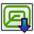 | Post Process Selected | Post Processes the selected operations |

### Profile — `CAM_Profile`

| Icon | Button / dropdown choice | Function |
| --- | --- | --- |
|  | Profile | Profile entire model, selected face(s) or selected edge(s) |

### Sanity Check — `CAM_Sanity`

| Icon | Button / dropdown choice | Function |
| --- | --- | --- |
|  | Sanity Check | Checks the CAM job for common errors |

### Finish Selecting Loop — `CAM_SelectLoop`

| Icon | Button / dropdown choice | Function |
| --- | --- | --- |
|  | Finish Selecting Loop | Completes the selection of edges or faces that forms a loop. Works in described sequence, but can be forced by modifier key. Face selection: Vertical face: searching loops faces which forms the walls or vertical faces with same center height (SHIFT). Horizontal face: searching inner edges of the face (CTRL), outer edges of the face (CTRL + ALT) or horizontal faces at the same height (SHIFT). Otherwise select all edges of the face (ALT). Edge selection: One edge: searching loop edges in horizontal plane. Two edges: searching loop edges in wires of the shape or tangent edges (CTRL). Otherwise searching horizontal wires which contain selected edges (ALT). Without sub selection: Select all edges, faces (ALT) or vertexes (CTRL) of the model. |

### CAM Simulator — `CAM_SimTools`

| Icon | Button / dropdown choice | Function |
| --- | --- | --- |
|  | CAM Simulator | Simulates G-code on stock |
|  | Legacy CAM Simulator | Simulates G-code on stock |

### Simple Copy — `CAM_SimpleCopy`

| Icon | Button / dropdown choice | Function |
| --- | --- | --- |
|  | Simple Copy | Creates a non-parametric copy of another toolpath Several operations can be used with identical tool controller and coolant mode |

### Slot — `CAM_Slot`

| Icon | Button / dropdown choice | Function |
| --- | --- | --- |
|  | Slot | Create a single horizontal slot between two points. Points can be specified through selected geometry or custom points. Allowed selection only from one model: - two vertexes, - one or two edges, - one horizontal or vertical face, - one or two vertical faces. |

### Add Toolbit… — `CAM_ToolBitDock`

| Icon | Button / dropdown choice | Function |
| --- | --- | --- |
|  | Add Toolbit… | Opens the toolbit selection dialog |

### Work Plane — `CAM_Workplane`

| Icon | Button / dropdown choice | Function |
| --- | --- | --- |
|  | Work Plane | Create a named work plane on the Job, from a selected planar face or at the Job origin. Operations can share one work plane. |

### Add to Construction Group — `Draft_AddConstruction`

| Icon | Button / dropdown choice | Function |
| --- | --- | --- |
|  | Add to Construction Group | Adds the selected objects to the construction group, and changes their appearance to the construction style. The construction group is created if it does not exist. |

### New Named Group — `Draft_AddNamedGroup`

| Icon | Button / dropdown choice | Function |
| --- | --- | --- |
|  | New Named Group | Adds a group with a given name |

### Add to Group — `Draft_AddToGroup`

| Icon | Button / dropdown choice | Function |
| --- | --- | --- |
|  | Add to Group | Adds selected objects to a group, or removes them from any group |

### Add to Layer — `Draft_AddToLayer`

| Icon | Button / dropdown choice | Function |
| --- | --- | --- |
|  | Add to Layer | Adds selected objects to a layer, or removes them from any layer |

### Annotation Styles — `Draft_AnnotationStyleEditor`

| Icon | Button / dropdown choice | Function |
| --- | --- | --- |
|  | Annotation Styles | Opens an editor to manage or create annotation styles |

### Arc — `Draft_Arc`

| Icon | Button / dropdown choice | Function |
| --- | --- | --- |
|  | Arc | Creates a circular arc from a center point and a radius |

### Arc — `Draft_ArcTools`

| Icon | Button / dropdown choice | Function |
| --- | --- | --- |
|  | Arc | Creates a circular arc from a center point and a radius |
|  | Arc From 3 Points | Creates a circular arc from 3 points |

### Arc From 3 Points — `Draft_Arc_3Points`

| Icon | Button / dropdown choice | Function |
| --- | --- | --- |
|  | Arc From 3 Points | Creates a circular arc from 3 points |

### Array — `Draft_ArrayTools`

| Icon | Button / dropdown choice | Function |
| --- | --- | --- |
|  | Array | Creates copies of the selected object in an orthogonal pattern |
|  | Polar Array | Creates copies of the selected object in a polar pattern |
|  | Circular Array | Creates copies of the selected object in a radial pattern with 1 or more circular layers |
|  | Path Array | Creates copies of the selected object along a selected path |
|  | Path Link Array | Creates linked copies of the selected object along a selected path |
| 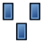 | Point Array | Creates copies of the selected object at the points of a point object |
|  | Point Link Array | Creates linked copies of the selected object at the points of a point object |
|  | Twisted Path Array | Creates twisted copies of the selected object along a selected path |
|  | Twisted Path Link Array | Creates twisted linked copies of the selected object along a selected path |

### B-Spline — `Draft_BSpline`

| Icon | Button / dropdown choice | Function |
| --- | --- | --- |
|  | B-Spline | Creates a multiple-point B-spline |

### Bézier Curve — `Draft_BezCurve`

| Icon | Button / dropdown choice | Function |
| --- | --- | --- |
|  | Bézier Curve | Creates an n-degree Bézier curve. The more points, the higher the degree. |

### Cubic Bézier Curve — `Draft_BezierTools`

| Icon | Button / dropdown choice | Function |
| --- | --- | --- |
|  | Cubic Bézier Curve | Creates a Bézier curve made of 2nd degree (quadratic) and 3rd degree (cubic) segments. Clicking and dragging allows to define segments. Control points and properties of each knot can be edited after creation. |
|  | Bézier Curve | Creates an n-degree Bézier curve. The more points, the higher the degree. |

### Circle — `Draft_Circle`

| Icon | Button / dropdown choice | Function |
| --- | --- | --- |
|  | Circle | Creates a circle (full circular arc) |

### Circular Array — `Draft_CircularArray`

| Icon | Button / dropdown choice | Function |
| --- | --- | --- |
|  | Circular Array | Creates copies of the selected object in a radial pattern with 1 or more circular layers |

### Clone — `Draft_Clone`

| Icon | Button / dropdown choice | Function |
| --- | --- | --- |
|  | Clone | Creates a clone of the selected objects |

### Cubic Bézier Curve — `Draft_CubicBezCurve`

| Icon | Button / dropdown choice | Function |
| --- | --- | --- |
|  | Cubic Bézier Curve | Creates a Bézier curve made of 2nd degree (quadratic) and 3rd degree (cubic) segments. Clicking and dragging allows to define segments. Control points and properties of each knot can be edited after creation. |

### Dimension — `Draft_Dimension`

| Icon | Button / dropdown choice | Function |
| --- | --- | --- |
|  | Dimension | Creates a linear dimension for a straight edge, a circular edge, or 2 picked points, or an angular dimension for 2 straight edges |

### Downgrade — `Draft_Downgrade`

| Icon | Button / dropdown choice | Function |
| --- | --- | --- |
|  | Downgrade | Downgrades the selected objects into simpler shapes. The result of the operation depends on the types of objects, which may be downgraded several times in a row. For example, a 3D solid is deconstructed into separate faces, wires, and then edges. Faces can also be subtracted. |

### Draft to Sketch — `Draft_Draft2Sketch`

| Icon | Button / dropdown choice | Function |
| --- | --- | --- |
|  | Draft to Sketch | Converts bidirectionally between Draft objects and sketches. Multiple selected Draft objects are converted into a single sketch. However, a single sketch with disconnected traces is converted into several individual Draft objects. |

### Edit — `Draft_Edit`

| Icon | Button / dropdown choice | Function |
| --- | --- | --- |
|  | Edit | Edits the active object |

### Ellipse — `Draft_Ellipse`

| Icon | Button / dropdown choice | Function |
| --- | --- | --- |
|  | Ellipse | Creates an ellipse |

### Facebinder — `Draft_Facebinder`

| Icon | Button / dropdown choice | Function |
| --- | --- | --- |
|  | Facebinder | Creates a facebinder from the selected faces |

### Fillet — `Draft_Fillet`

| Icon | Button / dropdown choice | Function |
| --- | --- | --- |
|  | Fillet | Creates a fillet between 2 selected edges |

### Flip Dimension — `Draft_FlipDimension`

| Icon | Button / dropdown choice | Function |
| --- | --- | --- |
|  | Flip Dimension | Flips the normal direction of the selected dimensions (linear, radial, angular). If other objects are selected they are ignored. |

### Hatch — `Draft_Hatch`

| Icon | Button / dropdown choice | Function |
| --- | --- | --- |
|  | Hatch | Creates hatches on the faces of a selected object |

### Join — `Draft_Join`

| Icon | Button / dropdown choice | Function |
| --- | --- | --- |
|  | Join | Joins the selected lines or polylines into a single object. The lines must share a common point at the start or at the end. |

### Label — `Draft_Label`

| Icon | Button / dropdown choice | Function |
| --- | --- | --- |
|  | Label | Creates a label, optionally attached to a selected object or subelement |

### Manage Layers — `Draft_LayerManager`

| Icon | Button / dropdown choice | Function |
| --- | --- | --- |
|  | Manage Layers | Allows to modify the layers |

### Line — `Draft_Line`

| Icon | Button / dropdown choice | Function |
| --- | --- | --- |
|  | Line | Creates a 2-point line |

### Mirror — `Draft_Mirror`

| Icon | Button / dropdown choice | Function |
| --- | --- | --- |
|  | Mirror | Mirrors the selected objects along a line defined by 2 points |

### Move — `Draft_Move`

| Icon | Button / dropdown choice | Function |
| --- | --- | --- |
|  | Move | Moves the selected objects. If the "Copy" option is active, it creates displaced copies. |

### Offset — `Draft_Offset`

| Icon | Button / dropdown choice | Function |
| --- | --- | --- |
|  | Offset | Offsets the selected object. It can also create an offset copy of the original object. |

### Array — `Draft_OrthoArray`

| Icon | Button / dropdown choice | Function |
| --- | --- | --- |
|  | Array | Creates copies of the selected object in an orthogonal pattern |

### Path Array — `Draft_PathArray`

| Icon | Button / dropdown choice | Function |
| --- | --- | --- |
|  | Path Array | Creates copies of the selected object along a selected path |

### Path Link Array — `Draft_PathLinkArray`

| Icon | Button / dropdown choice | Function |
| --- | --- | --- |
|  | Path Link Array | Creates linked copies of the selected object along a selected path |

### Twisted Path Array — `Draft_PathTwistedArray`

| Icon | Button / dropdown choice | Function |
| --- | --- | --- |
|  | Twisted Path Array | Creates twisted copies of the selected object along a selected path |

### Twisted Path Link Array — `Draft_PathTwistedLinkArray`

| Icon | Button / dropdown choice | Function |
| --- | --- | --- |
|  | Twisted Path Link Array | Creates twisted linked copies of the selected object along a selected path |

### Point — `Draft_Point`

| Icon | Button / dropdown choice | Function |
| --- | --- | --- |
|  | Point | Creates a point |

### Point Array — `Draft_PointArray`

| Icon | Button / dropdown choice | Function |
| --- | --- | --- |
|  | Point Array | Creates copies of the selected object at the points of a point object |

### Point Link Array — `Draft_PointLinkArray`

| Icon | Button / dropdown choice | Function |
| --- | --- | --- |
|  | Point Link Array | Creates linked copies of the selected object at the points of a point object |

### Polar Array — `Draft_PolarArray`

| Icon | Button / dropdown choice | Function |
| --- | --- | --- |
|  | Polar Array | Creates copies of the selected object in a polar pattern |

### Polygon — `Draft_Polygon`

| Icon | Button / dropdown choice | Function |
| --- | --- | --- |
|  | Polygon | Creates a regular polygon (triangle, square, pentagon…) |

### Rectangle — `Draft_Rectangle`

| Icon | Button / dropdown choice | Function |
| --- | --- | --- |
|  | Rectangle | Creates a 2-point rectangle |

### Rotate — `Draft_Rotate`

| Icon | Button / dropdown choice | Function |
| --- | --- | --- |
|  | Rotate | Rotates the selected objects. If the "Copy" option is active, it will create rotated copies. |

### Scale — `Draft_Scale`

| Icon | Button / dropdown choice | Function |
| --- | --- | --- |
|  | Scale | Scales the selected objects from a base point |

### Select Group — `Draft_SelectGroup`

| Icon | Button / dropdown choice | Function |
| --- | --- | --- |
|  | Select Group | Selects the contents of selected groups. For selected non-group objects, the contents of the group they are in are selected. |

### Shape 2D View — `Draft_Shape2DView`

| Icon | Button / dropdown choice | Function |
| --- | --- | --- |
|  | Shape 2D View | Creates a 2D projection of the selected objects on the XY-plane. The initial projection direction is the opposite of the current active view direction. |

### Shape From Text — `Draft_ShapeString`

| Icon | Button / dropdown choice | Function |
| --- | --- | --- |
|  | Shape From Text | Creates a shape from a text string and a specified font |

### Set Slope — `Draft_Slope`

| Icon | Button / dropdown choice | Function |
| --- | --- | --- |
|  | Set Slope | Sets the slope of the selected line by changing the value of the Z value of one of its points. If a polyline is selected, it will apply the slope transformation to each of its segments. The slope will always change the Z value, therefore this command only works well for straight Draft lines that are drawn on the XY-plane. |

### Snap Angle — `Draft_Snap_Angle`

| Icon | Button / dropdown choice | Function |
| --- | --- | --- |
|  | Snap Angle | Snaps to the special cardinal points on circular edges, at multiples of 30° and 45° |

### Snap Center — `Draft_Snap_Center`

| Icon | Button / dropdown choice | Function |
| --- | --- | --- |
|  | Snap Center | Snaps to the center point of faces and circular edges, and to the placement point of working plane proxies and building parts |

### Snap Dimensions — `Draft_Snap_Dimensions`

| Icon | Button / dropdown choice | Function |
| --- | --- | --- |
|  | Snap Dimensions | Shows temporary X and Y dimensions |

### Snap Endpoint — `Draft_Snap_Endpoint`

| Icon | Button / dropdown choice | Function |
| --- | --- | --- |
|  | Snap Endpoint | Snaps to the endpoints of edges |

### Snap Extension — `Draft_Snap_Extension`

| Icon | Button / dropdown choice | Function |
| --- | --- | --- |
|  | Snap Extension | Snaps to an imaginary line that extends beyond the endpoints of straight edges |

### Snap Grid — `Draft_Snap_Grid`

| Icon | Button / dropdown choice | Function |
| --- | --- | --- |
|  | Snap Grid | Snaps to the intersections of grid lines |

### Snap Intersection — `Draft_Snap_Intersection`

| Icon | Button / dropdown choice | Function |
| --- | --- | --- |
|  | Snap Intersection | Snaps to the intersection of 2 edges, and the intersection of a face and an edge |

### Snap Lock — `Draft_Snap_Lock`

| Icon | Button / dropdown choice | Function |
| --- | --- | --- |
|  | Snap Lock | Enables or disables snapping globally |

### Snap Midpoint — `Draft_Snap_Midpoint`

| Icon | Button / dropdown choice | Function |
| --- | --- | --- |
|  | Snap Midpoint | Snaps to the midpoint of edges |

### Snap Near — `Draft_Snap_Near`

| Icon | Button / dropdown choice | Function |
| --- | --- | --- |
|  | Snap Near | Snaps to the nearest point on faces and edges |

### Snap Ortho — `Draft_Snap_Ortho`

| Icon | Button / dropdown choice | Function |
| --- | --- | --- |
|  | Snap Ortho | Snaps to imaginary lines that cross the previous point at multiples of 45° |

### Snap Parallel — `Draft_Snap_Parallel`

| Icon | Button / dropdown choice | Function |
| --- | --- | --- |
|  | Snap Parallel | Snaps to an imaginary line parallel to straight edges |

### Snap Perpendicular — `Draft_Snap_Perpendicular`

| Icon | Button / dropdown choice | Function |
| --- | --- | --- |
|  | Snap Perpendicular | Snaps to the perpendicular points on faces and edges |

### Snap Special — `Draft_Snap_Special`

| Icon | Button / dropdown choice | Function |
| --- | --- | --- |
|  | Snap Special | Snaps to special points defined by the object |

### Snap Working Plane — `Draft_Snap_WorkingPlane`

| Icon | Button / dropdown choice | Function |
| --- | --- | --- |
|  | Snap Working Plane | Projects snap points onto the current working plane |

### Split — `Draft_Split`

| Icon | Button / dropdown choice | Function |
| --- | --- | --- |
|  | Split | Splits the selected line or polyline at a specified point |

### Stretch — `Draft_Stretch`

| Icon | Button / dropdown choice | Function |
| --- | --- | --- |
|  | Stretch | Stretches the selected objects |

### Highlight Subelements — `Draft_SubelementHighlight`

| Icon | Button / dropdown choice | Function |
| --- | --- | --- |
|  | Highlight Subelements | Highlights the subelements of the selected objects, to be able to move, rotate, and scale them |

### Text — `Draft_Text`

| Icon | Button / dropdown choice | Function |
| --- | --- | --- |
|  | Text | Creates a multi-line annotation |

### Toggle Wireframe — `Draft_ToggleDisplayMode`

| Icon | Button / dropdown choice | Function |
| --- | --- | --- |
|  | Toggle Wireframe | Switches the view style of the selected objects from Flat Lines to Wireframe and back |

### Toggle Grid — `Draft_ToggleGrid`

| Icon | Button / dropdown choice | Function |
| --- | --- | --- |
|  | Toggle Grid | Toggles the visibility of the Draft grid |

### Trimex — `Draft_Trimex`

| Icon | Button / dropdown choice | Function |
| --- | --- | --- |
|  | Trimex | Trims or extends the selected object |

### Force 2D View Update — `Draft_UpdateShape2DView`

| Icon | Button / dropdown choice | Function |
| --- | --- | --- |
|  | Force 2D View Update | Forces an update of the selected 2D Views or all 2D Views in the document. The 'Auto Update' property of the views is ignored. |

### Upgrade — `Draft_Upgrade`

| Icon | Button / dropdown choice | Function |
| --- | --- | --- |
|  | Upgrade | Upgrades the selected objects into more complex shapes. The result of the operation depends on the types of objects, which may be able to be upgraded several times in a row. For example, it can join the selected objects into one, convert simple edges into parametric polylines, convert closed edges into filled faces and parametric polygons, and merge faces into a single face. |

### Polyline — `Draft_Wire`

| Icon | Button / dropdown choice | Function |
| --- | --- | --- |
|  | Polyline | Creates a polyline |

### Convert Wire/B-Spline — `Draft_WireToBSpline`

| Icon | Button / dropdown choice | Function |
| --- | --- | --- |
|  | Convert Wire/B-Spline | Converts the selected polyline to a B-spline, or the selected B-spline to a polyline |

### Working Plane Proxy — `Draft_WorkingPlaneProxy`

| Icon | Button / dropdown choice | Function |
| --- | --- | --- |
|  | Working Plane Proxy | Creates a proxy object from the current working plane that allows to restore the camera position and visibility of objects |

### New Analysis — `FEM_Analysis`

| Icon | Button / dropdown choice | Function |
| --- | --- | --- |
|  | New Analysis | Creates an analysis container with default solver |

### Clipping Plane on Face — `FEM_ClippingPlaneAdd`

| Icon | Button / dropdown choice | Function |
| --- | --- | --- |
|  | Clipping Plane on Face | Adds a clipping plane on a selected face |

### Remove All Clipping Planes — `FEM_ClippingPlaneRemoveAll`

| Icon | Button / dropdown choice | Function |
| --- | --- | --- |
|  | Remove All Clipping Planes | Removes all clipping planes |

### Electromagnetic Boundary Conditions — `FEM_CompEmConstraints`

| Icon | Button / dropdown choice | Function |
| --- | --- | --- |
| — | Electromagnetic Boundary Conditions | Electromagnetic boundary conditions |

Source-defined dropdown choices:  [Electromagnetic Boundary Condition](#button-fem_constraintelectromagnetic);  [Current Density Boundary Condition](#button-fem_constraintcurrentdensity);  [Magnetization Boundary Condition](#button-fem_constraintmagnetization);  [Electric Charge Density](#button-fem_constraintelectricchargedensity).

### Electromagnetic Equations — `FEM_CompEmEquations`

| Icon | Button / dropdown choice | Function |
| --- | --- | --- |
| — | Electromagnetic Equations | Electromagnetic equations for the Elmer solver |

Source-defined dropdown choices:  [Electrostatic Equation](#button-fem_equationelectrostatic);  [Electricforce Equation](#button-fem_equationelectricforce);  [Magnetodynamic Equation](#button-fem_equationmagnetodynamic);  [Magnetodynamic 2D Equation](#button-fem_equationmagnetodynamic2d);  [Static Current Equation](#button-fem_equationstaticcurrent).

### Mechanical Equations — `FEM_CompMechEquations`

| Icon | Button / dropdown choice | Function |
| --- | --- | --- |
| — | Mechanical Equations | Mechanical equations for the Elmer solver |

Source-defined dropdown choices:  [Elasticity Equation](#button-fem_equationelasticity);  [Deformation Equation](#button-fem_equationdeformation).

### Solvers — `FEM_CompSolvers`

| Icon | Button / dropdown choice | Function |
| --- | --- | --- |
| — | Solvers | Creates a FEM solver |

Source-defined dropdown choices:  [Solver CalculiX](#button-fem_solvercalculix);  [Solver Elmer](#button-fem_solverelmer);  [Solver Mystran](#button-fem_solvermystran);  [Solver Z88](#button-fem_solverz88).

### Body Heat Source — `FEM_ConstraintBodyHeatSource`

| Icon | Button / dropdown choice | Function |
| --- | --- | --- |
|  | Body Heat Source | Creates a body heat source |

### Centrifugal Load — `FEM_ConstraintCentrif`

| Icon | Button / dropdown choice | Function |
| --- | --- | --- |
|  | Centrifugal Load | Creates a centrifugal load |

### Contact Constraint — `FEM_ConstraintContact`

| Icon | Button / dropdown choice | Function |
| --- | --- | --- |
|  | Contact Constraint | Creates a contact constraint between faces |

### Current Density Boundary Condition — `FEM_ConstraintCurrentDensity`

| Icon | Button / dropdown choice | Function |
| --- | --- | --- |
|  | Current Density Boundary Condition | Creates a current density boundary condition |

### Displacement Boundary Condition — `FEM_ConstraintDisplacement`

| Icon | Button / dropdown choice | Function |
| --- | --- | --- |
|  | Displacement Boundary Condition | Creates a displacement boundary condition for a geometric entity |

### Electric Charge Density — `FEM_ConstraintElectricChargeDensity`

| Icon | Button / dropdown choice | Function |
| --- | --- | --- |
|  | Electric Charge Density | Creates an electric charge density |

### Electromagnetic Boundary Condition — `FEM_ConstraintElectromagnetic`

| Icon | Button / dropdown choice | Function |
| --- | --- | --- |
|  | Electromagnetic Boundary Condition | Creates an electromagnetic boundary condition |

### Fixed Boundary Condition — `FEM_ConstraintFixed`

| Icon | Button / dropdown choice | Function |
| --- | --- | --- |
|  | Fixed Boundary Condition | Creates a fixed boundary condition for a geometric entity |

### Flow Velocity Boundary Condition — `FEM_ConstraintFlowVelocity`

| Icon | Button / dropdown choice | Function |
| --- | --- | --- |
|  | Flow Velocity Boundary Condition | Creates a flow velocity boundary condition |

### Force Load — `FEM_ConstraintForce`

| Icon | Button / dropdown choice | Function |
| --- | --- | --- |
|  | Force Load | Creates a force load applied to a geometric entity |

### Heat Flux Load — `FEM_ConstraintHeatflux`

| Icon | Button / dropdown choice | Function |
| --- | --- | --- |
|  | Heat Flux Load | Creates a heat flux load acting on a face |

### Initial Flow Velocity Condition — `FEM_ConstraintInitialFlowVelocity`

| Icon | Button / dropdown choice | Function |
| --- | --- | --- |
|  | Initial Flow Velocity Condition | Creates an initial flow velocity condition |

### Initial Pressure Condition — `FEM_ConstraintInitialPressure`

| Icon | Button / dropdown choice | Function |
| --- | --- | --- |
|  | Initial Pressure Condition | Creates an initial pressure condition |

### Initial Temperature — `FEM_ConstraintInitialTemperature`

| Icon | Button / dropdown choice | Function |
| --- | --- | --- |
|  | Initial Temperature | Creates an initial temperature acting on a body |

### Magnetization Boundary Condition — `FEM_ConstraintMagnetization`

| Icon | Button / dropdown choice | Function |
| --- | --- | --- |
|  | Magnetization Boundary Condition | Creates a magnetization boundary condition |

### Plane Multi-Point Constraint — `FEM_ConstraintPlaneRotation`

| Icon | Button / dropdown choice | Function |
| --- | --- | --- |
|  | Plane Multi-Point Constraint | Creates a plane multi-point constraint for a face |

### Pressure Load — `FEM_ConstraintPressure`

| Icon | Button / dropdown choice | Function |
| --- | --- | --- |
|  | Pressure Load | Creates a pressure load acting on a face |

### Rigid Body Constraint — `FEM_ConstraintRigidBody`

| Icon | Button / dropdown choice | Function |
| --- | --- | --- |
|  | Rigid Body Constraint | Creates a rigid body constraint for a geometric entity |

### Section Print Feature — `FEM_ConstraintSectionPrint`

| Icon | Button / dropdown choice | Function |
| --- | --- | --- |
|  | Section Print Feature | Creates a section print feature |

### Gravity Load — `FEM_ConstraintSelfWeight`

| Icon | Button / dropdown choice | Function |
| --- | --- | --- |
|  | Gravity Load | Creates a gravity load |

### Spring Boundary Condition — `FEM_ConstraintSpring`

| Icon | Button / dropdown choice | Function |
| --- | --- | --- |
|  | Spring Boundary Condition | Creates a spring boundary condition on a face |

### Temperature Boundary Condition — `FEM_ConstraintTemperature`

| Icon | Button / dropdown choice | Function |
| --- | --- | --- |
|  | Temperature Boundary Condition | Creates a temperature/concentrated heat flux load acting on a face |

### Tie Constraint — `FEM_ConstraintTie`

| Icon | Button / dropdown choice | Function |
| --- | --- | --- |
|  | Tie Constraint | Creates a tie constraint |

### Local Coordinate System — `FEM_ConstraintTransform`

| Icon | Button / dropdown choice | Function |
| --- | --- | --- |
|  | Local Coordinate System | Creates a local coordinate system on a face |

### Fluid Section for 1D Flow — `FEM_ElementFluid1D`

| Icon | Button / dropdown choice | Function |
| --- | --- | --- |
|  | Fluid Section for 1D Flow | Creates a fluid section for 1D flow |

### Beam Cross Section — `FEM_ElementGeometry1D`

| Icon | Button / dropdown choice | Function |
| --- | --- | --- |
|  | Beam Cross Section | Creates a beam cross section |

### Shell Plate Thickness — `FEM_ElementGeometry2D`

| Icon | Button / dropdown choice | Function |
| --- | --- | --- |
|  | Shell Plate Thickness | Creates a shell plate thickness |

### Beam Rotation — `FEM_ElementRotation1D`

| Icon | Button / dropdown choice | Function |
| --- | --- | --- |
|  | Beam Rotation | Creates a beam rotation |

### Deformation Equation — `FEM_EquationDeformation`

| Icon | Button / dropdown choice | Function |
| --- | --- | --- |
|  | Deformation Equation | Creates an equation for deformation (nonlinear elasticity) |

### Elasticity Equation — `FEM_EquationElasticity`

| Icon | Button / dropdown choice | Function |
| --- | --- | --- |
|  | Elasticity Equation | Creates an equation for elasticity (stress) |

### Electricforce Equation — `FEM_EquationElectricforce`

| Icon | Button / dropdown choice | Function |
| --- | --- | --- |
|  | Electricforce Equation | Creates an equation for electric forces |

### Electrostatic Equation — `FEM_EquationElectrostatic`

| Icon | Button / dropdown choice | Function |
| --- | --- | --- |
|  | Electrostatic Equation | Creates an equation for electrostatic |

### Flow Equation — `FEM_EquationFlow`

| Icon | Button / dropdown choice | Function |
| --- | --- | --- |
|  | Flow Equation | Creates an equation for flow |

### Flux Equation — `FEM_EquationFlux`

| Icon | Button / dropdown choice | Function |
| --- | --- | --- |
|  | Flux Equation | Creates an equation for flux |

### Heat Equation — `FEM_EquationHeat`

| Icon | Button / dropdown choice | Function |
| --- | --- | --- |
|  | Heat Equation | Creates an equation for heat |

### Magnetodynamic Equation — `FEM_EquationMagnetodynamic`

| Icon | Button / dropdown choice | Function |
| --- | --- | --- |
|  | Magnetodynamic Equation | Creates an equation for magnetodynamic forces |

### Magnetodynamic 2D Equation — `FEM_EquationMagnetodynamic2D`

| Icon | Button / dropdown choice | Function |
| --- | --- | --- |
|  | Magnetodynamic 2D Equation | Creates an equation for 2D magnetodynamic forces |

### Static Current Equation — `FEM_EquationStaticCurrent`

| Icon | Button / dropdown choice | Function |
| --- | --- | --- |
|  | Static Current Equation | Creates an equation for static current |

### FEM Examples — `FEM_Examples`

| Icon | Button / dropdown choice | Function |
| --- | --- | --- |
|  | FEM Examples | Opens the FEM examples |

### FEM Mesh to Mesh — `FEM_FEMMesh2Mesh`

| Icon | Button / dropdown choice | Function |
| --- | --- | --- |
|  | FEM Mesh to Mesh | Converts the surface of a FEM mesh to a mesh |

### Material Editor — `FEM_MaterialEditor`

| Icon | Button / dropdown choice | Function |
| --- | --- | --- |
|  | Material Editor | Opens the FreeCAD material editor |

### Fluid Material — `FEM_MaterialFluid`

| Icon | Button / dropdown choice | Function |
| --- | --- | --- |
|  | Fluid Material | Creates a fluid material |

### Non-Linear Mechanical Material — `FEM_MaterialMechanicalNonlinear`

| Icon | Button / dropdown choice | Function |
| --- | --- | --- |
|  | Non-Linear Mechanical Material | Add non-linear mechanical properties to material |

### Reinforced Material (Concrete) — `FEM_MaterialReinforced`

| Icon | Button / dropdown choice | Function |
| --- | --- | --- |
|  | Reinforced Material (Concrete) | Creates a material for reinforced matrix material such as concrete |

### Solid Material — `FEM_MaterialSolid`

| Icon | Button / dropdown choice | Function |
| --- | --- | --- |
|  | Solid Material | Creates a solid material |

### Advanced Refinement Types — `FEM_MeshAdvanced`

| Icon | Button / dropdown choice | Function |
| --- | --- | --- |
|  | Advanced Refinement Types | Allows to define the mesh size by various advanced means |

### 2D Boundary Layer — `FEM_MeshBoundaryLayer`

| Icon | Button / dropdown choice | Function |
| --- | --- | --- |
|  | 2D Boundary Layer | Adds a structured layer of mesh elements on 2D model boundaries |

### Distance-Based Refinement — `FEM_MeshDistance`

| Icon | Button / dropdown choice | Function |
| --- | --- | --- |
|  | Distance-Based Refinement | Sets mesh size based on the distance to vertices, edges, and faces |

### GMSH Refinements — `FEM_MeshGMSHRefinement`

| Icon | Button / dropdown choice | Function |
| --- | --- | --- |
| — | GMSH Refinements | Mesh refinements for the GMSH mesh generation |

Source-defined dropdown choices:  [Distance-Based Refinement](#button-fem_meshdistance);  [2D Boundary Layer](#button-fem_meshboundarylayer);  [Shape-Based Refinement](#button-fem_meshshape);  [Manipulate Refinement](#button-fem_meshmanipulate);  [Advanced Refinement Types](#button-fem_meshadvanced);  [Structured Transfinite Curve](#button-fem_meshtransfinitecurve);  [Structured Transfinite Surface](#button-fem_meshtransfinitesurface);  [Structured Transfinite Volume](#button-fem_meshtransfinitevolume).

### Mesh From Shape by Gmsh — `FEM_MeshGmshFromShape`

| Icon | Button / dropdown choice | Function |
| --- | --- | --- |
|  | Mesh From Shape by Gmsh | Creates a FEM mesh from a shape by Gmsh mesher |

### Mesh Group — `FEM_MeshGroup`

| Icon | Button / dropdown choice | Function |
| --- | --- | --- |
|  | Mesh Group | Creates a mesh group |

### Manipulate Refinement — `FEM_MeshManipulate`

| Icon | Button / dropdown choice | Function |
| --- | --- | --- |
|  | Manipulate Refinement | Allows to manipulate the output of a refinement in various ways |

### Mesh From Shape by Netgen — `FEM_MeshNetgenFromShape`

| Icon | Button / dropdown choice | Function |
| --- | --- | --- |
|  | Mesh From Shape by Netgen | Creates a FEM mesh from a solid or face shape by Netgen internal mesher |

### Mesh Refinement — `FEM_MeshRegion`

| Icon | Button / dropdown choice | Function |
| --- | --- | --- |
|  | Mesh Refinement | Creates a FEM mesh refinement |

### Shape-Based Refinement — `FEM_MeshShape`

| Icon | Button / dropdown choice | Function |
| --- | --- | --- |
|  | Shape-Based Refinement | Sets mesh size within and outside of a geometric shape (box, sphere, cylinder) |

### Structured Transfinite Curve — `FEM_MeshTransfiniteCurve`

| Icon | Button / dropdown choice | Function |
| --- | --- | --- |
|  | Structured Transfinite Curve | Creates a fixed number of nodes on an edge with a structured algorithm |

### Structured Transfinite Surface — `FEM_MeshTransfiniteSurface`

| Icon | Button / dropdown choice | Function |
| --- | --- | --- |
|  | Structured Transfinite Surface | Creates a structured mesh on a face |

### Structured Transfinite Volume — `FEM_MeshTransfiniteVolume`

| Icon | Button / dropdown choice | Function |
| --- | --- | --- |
|  | Structured Transfinite Volume | Creates a structured mesh in a 4- or 5-sided volume bounded by transfinite surfaces |

### Apply Changes to Pipeline — `FEM_PostApplyChanges`

| Icon | Button / dropdown choice | Function |
| --- | --- | --- |
|  | Apply Changes to Pipeline | Applies changes to parameters directly and not on recompute only |

### Pipeline Branch — `FEM_PostBranchFilter`

| Icon | Button / dropdown choice | Function |
| --- | --- | --- |
|  | Pipeline Branch | Branches the pipeline into a new path |

### Filter Functions — `FEM_PostCreateFunctions`

| Icon | Button / dropdown choice | Function |
| --- | --- | --- |
| — | Filter Functions | Functions for use in postprocessing filter |

### Calculator Filter — `FEM_PostFilterCalculator`

| Icon | Button / dropdown choice | Function |
| --- | --- | --- |
|  | Calculator Filter | Creates a new field from current data |

### Region Clip Filter — `FEM_PostFilterClipRegion`

| Icon | Button / dropdown choice | Function |
| --- | --- | --- |
|  | Region Clip Filter | Defines a clip filter which uses functions to define the clipped region |

### Scalar Clip Filter — `FEM_PostFilterClipScalar`

| Icon | Button / dropdown choice | Function |
| --- | --- | --- |
|  | Scalar Clip Filter | Defines a clip filter which clips a field with a scalar value |

### Contours Filter — `FEM_PostFilterContours`

| Icon | Button / dropdown choice | Function |
| --- | --- | --- |
|  | Contours Filter | Defines a contours filter that displays iso contours |

### Function Cut Filter — `FEM_PostFilterCutFunction`

| Icon | Button / dropdown choice | Function |
| --- | --- | --- |
|  | Function Cut Filter | Cuts the data along an implicit function |

### Line Clip Filter — `FEM_PostFilterDataAlongLine`

| Icon | Button / dropdown choice | Function |
| --- | --- | --- |
|  | Line Clip Filter | Defines a clip filter which clips a field along a line |

### Data at Point Clip Filter — `FEM_PostFilterDataAtPoint`

| Icon | Button / dropdown choice | Function |
| --- | --- | --- |
|  | Data at Point Clip Filter | Defines a clip filter which clips a field data at point |

### Glyph Filter — `FEM_PostFilterGlyph`

| Icon | Button / dropdown choice | Function |
| --- | --- | --- |
|  | Glyph Filter | Adds a post-processing filter that adds glyphs to the mesh vertices for vertex data visualization |

### Stress Linearization Plot — `FEM_PostFilterLinearizedStresses`

| Icon | Button / dropdown choice | Function |
| --- | --- | --- |
|  | Stress Linearization Plot | Defines a stress linearization plot |

### Warp Filter — `FEM_PostFilterWarp`

| Icon | Button / dropdown choice | Function |
| --- | --- | --- |
|  | Warp Filter | Warps the geometry along a vector field by a certain factor |

### Post Pipeline From Result — `FEM_PostPipelineFromResult`

| Icon | Button / dropdown choice | Function |
| --- | --- | --- |
|  | Post Pipeline From Result | Creates a post processing pipeline from a result object |

### Data Visualizations — `FEM_PostVisualization`

| Icon | Button / dropdown choice | Function |
| --- | --- | --- |
| — | Data Visualizations | Different visualizations to show post processing data in |

### Show Result — `FEM_ResultShow`

| Icon | Button / dropdown choice | Function |
| --- | --- | --- |
|  | Show Result | Shows and visualizes the selected result data |

### Purge Results — `FEM_ResultsPurge`

| Icon | Button / dropdown choice | Function |
| --- | --- | --- |
|  | Purge Results | Purges all results from the active analysis |

### Solver CalculiX — `FEM_SolverCalculiX`

| Icon | Button / dropdown choice | Function |
| --- | --- | --- |
|  | Solver CalculiX | Creates a FEM solver CalculiX |

### Solver Job Control — `FEM_SolverControl`

| Icon | Button / dropdown choice | Function |
| --- | --- | --- |
|  | Solver Job Control | Changes solver attributes and runs the calculations for the selected solver |

### Solver Elmer — `FEM_SolverElmer`

| Icon | Button / dropdown choice | Function |
| --- | --- | --- |
|  | Solver Elmer | Creates a FEM solver Elmer |

### Solver Mystran — `FEM_SolverMystran`

| Icon | Button / dropdown choice | Function |
| --- | --- | --- |
|  | Solver Mystran | Creates a FEM solver Mystran |

### Run Solver — `FEM_SolverRun`

| Icon | Button / dropdown choice | Function |
| --- | --- | --- |
|  | Run Solver | Runs the calculations for the selected solver |

### Solver Z88 — `FEM_SolverZ88`

| Icon | Button / dropdown choice | Function |
| --- | --- | --- |
|  | Solver Z88 | Creates a FEM solver Z88 |

### Inspection… — `Inspection_InspectElement`

| Icon | Button / dropdown choice | Function |
| --- | --- | --- |
|  | Inspection… | Inspects distance information |

### Visual Inspection — `Inspection_VisualInspection`

| Icon | Button / dropdown choice | Function |
| --- | --- | --- |
|  | Visual Inspection | Inspects the objects visually |

### Edit — `Material_Edit`

| Icon | Button / dropdown choice | Function |
| --- | --- | --- |
|  | Edit | Edits material properties |

### Mesh From Shape — `MeshPart_Mesher`

| Icon | Button / dropdown choice | Function |
| --- | --- | --- |
|  | Mesh From Shape | Tessellate shape |

### Add Triangle — `Mesh_AddFacet`

| Icon | Button / dropdown choice | Function |
| --- | --- | --- |
|  | Add Triangle | Adds a triangle manually to a mesh |

### Bounding Box Info — `Mesh_BoundingBox`

| Icon | Button / dropdown choice | Function |
| --- | --- | --- |
|  | Bounding Box Info | Shows the bounding box coordinates of the selected mesh |

### Regular Solid — `Mesh_BuildRegularSolid`

| Icon | Button / dropdown choice | Function |
| --- | --- | --- |
|  | Regular Solid | Builds a regular solid |

### Cross-Sections — `Mesh_CrossSections`

| Icon | Button / dropdown choice | Function |
| --- | --- | --- |
|  | Cross-Sections | Creates cross-sections of the mesh |

### Curvature Info — `Mesh_CurvatureInfo`

| Icon | Button / dropdown choice | Function |
| --- | --- | --- |
|  | Curvature Info | Displays information about the curvature |

### Decimate — `Mesh_Decimating`

| Icon | Button / dropdown choice | Function |
| --- | --- | --- |
|  | Decimate | Decimates a mesh |

### Difference — `Mesh_Difference`

| Icon | Button / dropdown choice | Function |
| --- | --- | --- |
|  | Difference | Creates a boolean difference of the selected meshes |

### Face Info — `Mesh_EvaluateFacet`

| Icon | Button / dropdown choice | Function |
| --- | --- | --- |
|  | Face Info | Displays information about the selected faces |

### Evaluate Solid — `Mesh_EvaluateSolid`

| Icon | Button / dropdown choice | Function |
| --- | --- | --- |
|  | Evaluate Solid | Checks whether the mesh is a solid |

### Evaluate and Repair — `Mesh_Evaluation`

| Icon | Button / dropdown choice | Function |
| --- | --- | --- |
|  | Evaluate and Repair | Opens a dialog to analyze and repair a mesh |

### Export Mesh… — `Mesh_Export`

| Icon | Button / dropdown choice | Function |
| --- | --- | --- |
|  | Export Mesh… | Exports a mesh to a file |

### Close Hole — `Mesh_FillInteractiveHole`

| Icon | Button / dropdown choice | Function |
| --- | --- | --- |
|  | Close Hole | Closes a hole interactively in the mesh |

### Fill Holes — `Mesh_FillupHoles`

| Icon | Button / dropdown choice | Function |
| --- | --- | --- |
|  | Fill Holes | Fills holes in the mesh |

### Flip Normals — `Mesh_FlipNormals`

| Icon | Button / dropdown choice | Function |
| --- | --- | --- |
|  | Flip Normals | Flips the normals of the selected mesh |

### Mesh From Shape — `Mesh_FromPartShape`

| Icon | Button / dropdown choice | Function |
| --- | --- | --- |
|  | Mesh From Shape | Tessellates the selected shape to a mesh |

### Harmonize Normals — `Mesh_HarmonizeNormals`

| Icon | Button / dropdown choice | Function |
| --- | --- | --- |
|  | Harmonize Normals | Harmonizes the normals of the mesh |

### Import Mesh… — `Mesh_Import`

| Icon | Button / dropdown choice | Function |
| --- | --- | --- |
|  | Import Mesh… | Imports a mesh from a file |

### Intersection — `Mesh_Intersection`

| Icon | Button / dropdown choice | Function |
| --- | --- | --- |
|  | Intersection | Creates a boolean intersection from the selected meshes |

### Merge — `Mesh_Merge`

| Icon | Button / dropdown choice | Function |
| --- | --- | --- |
|  | Merge | Merges selected meshes into one |

### Cut — `Mesh_PolyCut`

| Icon | Button / dropdown choice | Function |
| --- | --- | --- |
|  | Cut | Cuts the mesh with a selected polygon |

### Trim — `Mesh_PolyTrim`

| Icon | Button / dropdown choice | Function |
| --- | --- | --- |
|  | Trim | Trims a mesh with a picked polygon |

### Refinement — `Mesh_RemeshGmsh`

| Icon | Button / dropdown choice | Function |
| --- | --- | --- |
|  | Refinement | Refines an existing mesh |

### Remove Components — `Mesh_RemoveComponents`

| Icon | Button / dropdown choice | Function |
| --- | --- | --- |
|  | Remove Components | Removes topologically independent components from the mesh |

### Scale — `Mesh_Scale`

| Icon | Button / dropdown choice | Function |
| --- | --- | --- |
|  | Scale | Scales the selected mesh objects |

### Section From Plane — `Mesh_SectionByPlane`

| Icon | Button / dropdown choice | Function |
| --- | --- | --- |
|  | Section From Plane | Sections the mesh with the selected plane |

### Segmentation — `Mesh_Segmentation`

| Icon | Button / dropdown choice | Function |
| --- | --- | --- |
|  | Segmentation | Creates new mesh segments from the mesh |

### Segmentation From Best-Fit Surfaces — `Mesh_SegmentationBestFit`

| Icon | Button / dropdown choice | Function |
| --- | --- | --- |
|  | Segmentation From Best-Fit Surfaces | Creates new mesh segments from the best-fit surfaces |

### Smooth — `Mesh_Smoothing`

| Icon | Button / dropdown choice | Function |
| --- | --- | --- |
|  | Smooth | Smoothes the selected meshes |

### Split by Components — `Mesh_SplitComponents`

| Icon | Button / dropdown choice | Function |
| --- | --- | --- |
|  | Split by Components | Splits the selected mesh into its components |

### Trim With Plane — `Mesh_TrimByPlane`

| Icon | Button / dropdown choice | Function |
| --- | --- | --- |
|  | Trim With Plane | Trims a mesh by removing faces on one side of a selected plane |

### Union — `Mesh_Union`

| Icon | Button / dropdown choice | Function |
| --- | --- | --- |
|  | Union | Unifies the selected meshes |

### Curvature Plot — `Mesh_VertexCurvature`

| Icon | Button / dropdown choice | Function |
| --- | --- | --- |
|  | Curvature Plot | Calculates the curvature of the vertices of a mesh |

### Add OpenSCAD Element — `OpenSCAD_AddOpenSCADElement`

| Icon | Button / dropdown choice | Function |
| --- | --- | --- |
|  | Add OpenSCAD Element | Adds an OpenSCAD element based on entered OpenSCAD code using the OpenSCAD binary |

### Explode Group — `OpenSCAD_ExplodeGroup`

| Icon | Button / dropdown choice | Function |
| --- | --- | --- |
|  | Explode Group | Explodes a fusion or compound and applies random colors |

### Hull — `OpenSCAD_Hull`

| Icon | Button / dropdown choice | Function |
| --- | --- | --- |
|  | Hull | Creates a hull |

### Increase Tolerance Feature — `OpenSCAD_IncreaseToleranceFeature`

| Icon | Button / dropdown choice | Function |
| --- | --- | --- |
|  | Increase Tolerance Feature | Creates a feature to increase the tolerance |

### Mesh Boolean — `OpenSCAD_MeshBoolean`

| Icon | Button / dropdown choice | Function |
| --- | --- | --- |
|  | Mesh Boolean | Performs a boolean operation using the OpenSCAD binary |

### Minkowski Sum — `OpenSCAD_Minkowski`

| Icon | Button / dropdown choice | Function |
| --- | --- | --- |
|  | Minkowski Sum | Creates a Minkowski sum |

### Refine Shape Feature — `OpenSCAD_RefineShapeFeature`

| Icon | Button / dropdown choice | Function |
| --- | --- | --- |
|  | Refine Shape Feature | Creates a refined shape |

### Remove Objects and Children — `OpenSCAD_RemoveSubtree`

| Icon | Button / dropdown choice | Function |
| --- | --- | --- |
|  | Remove Objects and Children | Removes the selected objects and all children that are not referenced by other objects |

### Replace Object — `OpenSCAD_ReplaceObject`

| Icon | Button / dropdown choice | Function |
| --- | --- | --- |
|  | Replace Object | Replaces an object in the Tree View |

### Add Reference Object — `PartDesign_AddReferenceObject`

| Icon | Button / dropdown choice | Function |
| --- | --- | --- |
|  | Add Reference Object | Reference evaluated geometry from a direct child of the active component |

### Additive Helix — `PartDesign_AdditiveHelix`

| Icon | Button / dropdown choice | Function |
| --- | --- | --- |
|  | Additive Helix | Sweeps the selected sketch or profile along a helix and adds it to the body |

### Additive Loft — `PartDesign_AdditiveLoft`

| Icon | Button / dropdown choice | Function |
| --- | --- | --- |
|  | Additive Loft | Lofts the selected sketch or profile through one or more sections and adds it to the body |

### Additive Pipe — `PartDesign_AdditivePipe`

| Icon | Button / dropdown choice | Function |
| --- | --- | --- |
|  | Additive Pipe | Sweeps the selected sketch or profile along a path and adds it to the body |

### New Body — `PartDesign_Body`

| Icon | Button / dropdown choice | Function |
| --- | --- | --- |
|  | New Body | Creates a new body and activates it |

### Boolean Operation — `PartDesign_Boolean`

| Icon | Button / dropdown choice | Function |
| --- | --- | --- |
|  | Boolean Operation | Applies boolean operations with the selected objects and the active body |

### Chamfer — `PartDesign_Chamfer`

| Icon | Button / dropdown choice | Function |
| --- | --- | --- |
|  | Chamfer | Applies a chamfer to the selected edges or faces |

### Circular Pattern — `PartDesign_CircularPattern`

| Icon | Button / dropdown choice | Function |
| --- | --- | --- |
|  | Circular Pattern | Duplicates the selected features or the active body in concentric circular patterns |

### Clone — `PartDesign_Clone`

| Icon | Button / dropdown choice | Function |
| --- | --- | --- |
|  | Clone | Copies a solid object parametrically as the base feature of a new body |

### Additive Box — `PartDesign_CompPrimitiveAdditive`

| Icon | Button / dropdown choice | Function |
| --- | --- | --- |
|  | Additive Box | Creates an additive box by its width, height, and length |
|  | Additive Cylinder | Creates an additive cylinder by its radius, height, and angle |
|  | Additive Sphere | Creates an additive sphere by its radius and various angles |
| 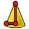 | Additive Cone | Creates an additive cone |
|  | Additive Ellipsoid | Creates an additive ellipsoid |
|  | Additive Torus | Creates an additive torus |
|  | Additive Prism | Creates an additive prism |
|  | Additive Wedge | Creates an additive wedge |

### Subtractive Box — `PartDesign_CompPrimitiveSubtractive`

| Icon | Button / dropdown choice | Function |
| --- | --- | --- |
|  | Subtractive Box | Creates a subtractive box by its width, height and length |
|  | Subtractive Cylinder | Creates a subtractive cylinder by its radius, height and angle |
|  | Subtractive Sphere | Creates a subtractive sphere by its radius and various angles |
|  | Subtractive Cone | Creates a subtractive cone |
|  | Subtractive Ellipsoid | Creates a subtractive ellipsoid |
|  | Subtractive Torus | Creates a subtractive torus |
|  | Subtractive Prism | Creates a subtractive prism |
|  | Subtractive Wedge | Creates a subtractive wedge |

### New Sketch — `PartDesign_CompSketches`

| Icon | Button / dropdown choice | Function |
| --- | --- | --- |
|  | New Sketch | Creates a new sketch |
|  | Attach Sketch | Attaches a sketch to the selected geometry element |
|  | Edit Sketch | Opens the selected sketch for editing |

### Defeaturing — `PartDesign_Defeaturing`

| Icon | Button / dropdown choice | Function |
| --- | --- | --- |
|  | Defeaturing | Removes selected faces from a solid |

### Draft — `PartDesign_Draft`

| Icon | Button / dropdown choice | Function |
| --- | --- | --- |
|  | Draft | Applies a draft to the selected faces |

### Extrude — `PartDesign_Extrude`

| Icon | Button / dropdown choice | Function |
| --- | --- | --- |
|  | Extrude | Extrudes a profile with Add or Subtract selected in the task panel |

### Fillet — `PartDesign_Fillet`

| Icon | Button / dropdown choice | Function |
| --- | --- | --- |
|  | Fillet | Applies a fillet to the selected edges or faces |

### Groove — `PartDesign_Groove`

| Icon | Button / dropdown choice | Function |
| --- | --- | --- |
|  | Groove | Revolves the sketch or profile around a line or axis and removes it from the body |

### Hole — `PartDesign_Hole`

| Icon | Button / dropdown choice | Function |
| --- | --- | --- |
|  | Hole | Creates holes in the active body at the center points of circles or arcs of the selected sketch or profile |

### Linear Pattern — `PartDesign_LinearPattern`

| Icon | Button / dropdown choice | Function |
| --- | --- | --- |
|  | Linear Pattern | Duplicates the selected features or the active body in a linear pattern |

### Mirror — `PartDesign_Mirrored`

| Icon | Button / dropdown choice | Function |
| --- | --- | --- |
|  | Mirror | Mirrors the selected features or active body |

### Multi-Transform — `PartDesign_MultiTransform`

| Icon | Button / dropdown choice | Function |
| --- | --- | --- |
|  | Multi-Transform | Applies multiple transformations to the selected features or active body |

### New Sketch — `PartDesign_NewSketch`

| Icon | Button / dropdown choice | Function |
| --- | --- | --- |
|  | New Sketch | Creates a new sketch |

### Pad — `PartDesign_Pad`

| Icon | Button / dropdown choice | Function |
| --- | --- | --- |
|  | Pad | Extrudes a sketch or profile selected before or within the task panel and adds it to the body |

### Path Pattern — `PartDesign_PathPattern`

| Icon | Button / dropdown choice | Function |
| --- | --- | --- |
|  | Path Pattern | Duplicates the selected features or the active body along a path |

### Pattern — `PartDesign_Pattern`

| Icon | Button / dropdown choice | Function |
| --- | --- | --- |
|  | Pattern | Creates a linear or circular pattern; select the type and features in the task pane |

### Pocket — `PartDesign_Pocket`

| Icon | Button / dropdown choice | Function |
| --- | --- | --- |
|  | Pocket | Extrudes the selected sketch or profile and removes it from the body |

### Point Pattern — `PartDesign_PointPattern`

| Icon | Button / dropdown choice | Function |
| --- | --- | --- |
|  | Point Pattern | Duplicates the selected features or the active body at points from a shape |

### Polar Pattern — `PartDesign_PolarPattern`

| Icon | Button / dropdown choice | Function |
| --- | --- | --- |
|  | Polar Pattern | Duplicates the selected features or the active body in a circular pattern |

### Revolve — `PartDesign_Revolution`

| Icon | Button / dropdown choice | Function |
| --- | --- | --- |
|  | Revolve | Revolves the selected sketch or profile around a line or axis and adds it to the body |

### Sub-Shape Binder — `PartDesign_SubShapeBinder`

| Icon | Button / dropdown choice | Function |
| --- | --- | --- |
|  | Sub-Shape Binder | Creates a reference to geometry from one or more objects, allowing it to be used inside or outside a body. It tracks relative placements, supports multiple geometry types (solids, faces, edges, vertices), and can work with objects in the same or external documents. |

### Subtractive Helix — `PartDesign_SubtractiveHelix`

| Icon | Button / dropdown choice | Function |
| --- | --- | --- |
|  | Subtractive Helix | Sweeps the selected sketch or profile along a helix and removes it from the body |

### Subtractive Loft — `PartDesign_SubtractiveLoft`

| Icon | Button / dropdown choice | Function |
| --- | --- | --- |
|  | Subtractive Loft | Lofts the selected sketch or profile through one or more sections and removes it from the body |

### Subtractive Pipe — `PartDesign_SubtractivePipe`

| Icon | Button / dropdown choice | Function |
| --- | --- | --- |
|  | Subtractive Pipe | Sweeps the selected sketch or profile along a path and removes it from the body |

### Thickness — `PartDesign_Thickness`

| Icon | Button / dropdown choice | Function |
| --- | --- | --- |
|  | Thickness | Applies thickness and removes the selected faces |

### Boolean Operation — `Part_Boolean`

| Icon | Button / dropdown choice | Function |
| --- | --- | --- |
|  | Boolean Operation | Applies a boolean operation with the selected shapes |

### Boolean Fragments — `Part_BooleanFragments`

| Icon | Button / dropdown choice | Function |
| --- | --- | --- |
|  | Boolean Fragments | Creates a boolean union which is sliced at the intersections of the selected shapes |

### Cube — `Part_Box`

| Icon | Button / dropdown choice | Function |
| --- | --- | --- |
|  | Cube | Creates a solid cube |

### Shape Builder — `Part_Builder`

| Icon | Button / dropdown choice | Function |
| --- | --- | --- |
|  | Shape Builder | Advanced utility to create shapes |

### Chamfer — `Part_Chamfer`

| Icon | Button / dropdown choice | Function |
| --- | --- | --- |
|  | Chamfer | Chamfers the selected edges of a shape |

### Check Geometry — `Part_CheckGeometry`

| Icon | Button / dropdown choice | Function |
| --- | --- | --- |
|  | Check Geometry | Analyzes the selected shapes for errors |

### Appearance per Face — `Part_ColorPerFace`

| Icon | Button / dropdown choice | Function |
| --- | --- | --- |
|  | Appearance per Face | Sets the appearance of individual faces of the selected object |

### Intersection — `Part_Common`

| Icon | Button / dropdown choice | Function |
| --- | --- | --- |
|  | Intersection | Intersects the selected shapes |

### Compound — `Part_CompCompoundTools`

| Icon | Button / dropdown choice | Function |
| --- | --- | --- |
|  | Compound | Compounds the selected shapes |
|  | Explode Compound | Splits up a compound of shapes into separate objects, creating a compound filter for each shape |
|  | Compound Filter | Filters out objects from the selected compound by characteristics like volume, area, or length, or by choosing specific items. If a second object is selected, it will be used as reference, for example, for collision or distance filtering. |

### Connect Shapes — `Part_CompJoinFeatures`

| Icon | Button / dropdown choice | Function |
| --- | --- | --- |
|  | Connect Shapes | Fuses shapes, taking care to preserve voids |
|  | Embed Shapes | Fuses one shape into another, taking care to preserve voids |
|  | Cutout Shape | Creates a cutout in the selected shape to fit another shape |

### 3D Offset — `Part_CompOffset`

| Icon | Button / dropdown choice | Function |
| --- | --- | --- |
|  | 3D Offset | Offsets shapes in 3D |
|  | 2D Offset | Offsets planar shapes in 2D |

### Boolean Fragments — `Part_CompSplitFeatures`

| Icon | Button / dropdown choice | Function |
| --- | --- | --- |
|  | Boolean Fragments | Creates a boolean union which is sliced at the intersections of the selected shapes |
|  | Slice Apart | Slices the selected object by other objects, and splits it apart, creating a compound filter for each slide |
|  | Slice to Compound | Slices the selected object by using other objects as cutting tools and storing the results in one compound |
|  | Boolean XOR | Performs an 'exclusive OR' boolean operation with two or more selected objects, or with the shapes inside a compound. Overlapping volumes of the shapes will be removed. |

### Compound — `Part_Compound`

| Icon | Button / dropdown choice | Function |
| --- | --- | --- |
|  | Compound | Compounds the selected shapes |

### Compound Filter — `Part_CompoundFilter`

| Icon | Button / dropdown choice | Function |
| --- | --- | --- |
|  | Compound Filter | Filters out objects from the selected compound by characteristics like volume, area, or length, or by choosing specific items. If a second object is selected, it will be used as reference, for example, for collision or distance filtering. |

### Cone — `Part_Cone`

| Icon | Button / dropdown choice | Function |
| --- | --- | --- |
|  | Cone | Creates a solid cone |

### Cross-Sections — `Part_CrossSections`

| Icon | Button / dropdown choice | Function |
| --- | --- | --- |
|  | Cross-Sections | Creates cross-sections |

### Cut — `Part_Cut`

| Icon | Button / dropdown choice | Function |
| --- | --- | --- |
|  | Cut | Cuts 2 selected shapes |

### Cylinder — `Part_Cylinder`

| Icon | Button / dropdown choice | Function |
| --- | --- | --- |
|  | Cylinder | Creates a solid cylinder |

### Coordinate System — `Part_Datums`

| Icon | Button / dropdown choice | Function |
| --- | --- | --- |
|  | Coordinate System | Creates a coordinate system that can be attached to other objects |
| 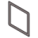 | Datum Plane | Creates a datum plane that can be attached to other objects |
| 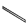 | Datum Line | Creates a datum line that can be attached to other objects |
|  | Datum Point | Creates a datum point that can be attached to other objects |

### Defeaturing — `Part_Defeaturing`

| Icon | Button / dropdown choice | Function |
| --- | --- | --- |
|  | Defeaturing | Removes the selected features from a shape |

### Explode Compound — `Part_ExplodeCompound`

| Icon | Button / dropdown choice | Function |
| --- | --- | --- |
|  | Explode Compound | Splits up a compound of shapes into separate objects, creating a compound filter for each shape |

### Extrude — `Part_Extrude`

| Icon | Button / dropdown choice | Function |
| --- | --- | --- |
|  | Extrude | Extrudes the selected sketch or profile |

### Fillet — `Part_Fillet`

| Icon | Button / dropdown choice | Function |
| --- | --- | --- |
|  | Fillet | Fillets the selected edges of a shape |

### Union — `Part_Fuse`

| Icon | Button / dropdown choice | Function |
| --- | --- | --- |
|  | Union | Unites the selected shapes |

### Isocline Curve — `Part_IsoclineCurve`

| Icon | Button / dropdown choice | Function |
| --- | --- | --- |
|  | Isocline Curve | Create associative draft-angle curves on selected faces |

### Connect Shapes — `Part_JoinConnect`

| Icon | Button / dropdown choice | Function |
| --- | --- | --- |
|  | Connect Shapes | Fuses shapes, taking care to preserve voids |

### Cutout Shape — `Part_JoinCutout`

| Icon | Button / dropdown choice | Function |
| --- | --- | --- |
|  | Cutout Shape | Creates a cutout in the selected shape to fit another shape |

### Embed Shapes — `Part_JoinEmbed`

| Icon | Button / dropdown choice | Function |
| --- | --- | --- |
|  | Embed Shapes | Fuses one shape into another, taking care to preserve voids |

### Circular Link Array — `Part_LinkArrays`

| Icon | Button / dropdown choice | Function |
| --- | --- | --- |
|  | Circular Link Array | Creates a concentric circular array of linked objects |
|  | Linear Link Array | Creates a linear array of linked objects |
|  | Path Link Array | Creates an array of linked objects along a path |
|  | Point Link Array | Creates an array of linked objects at each point of a sketch or shape |
|  | Polar Link Array | Creates a polar array of linked objects |

### Loft — `Part_Loft`

| Icon | Button / dropdown choice | Function |
| --- | --- | --- |
|  | Loft | Lofts the selected profiles |

### Face From Wires — `Part_MakeFace`

| Icon | Button / dropdown choice | Function |
| --- | --- | --- |
|  | Face From Wires | Creates a face from the selected wires (e.g. from a sketch) |

### Mirror — `Part_Mirror`

| Icon | Button / dropdown choice | Function |
| --- | --- | --- |
|  | Mirror | Mirrors the selected shape |

### 3D Offset — `Part_Offset`

| Icon | Button / dropdown choice | Function |
| --- | --- | --- |
|  | 3D Offset | Offsets shapes in 3D |

### 2D Offset — `Part_Offset2D`

| Icon | Button / dropdown choice | Function |
| --- | --- | --- |
|  | 2D Offset | Offsets planar shapes in 2D |

### Primitive — `Part_Primitives`

| Icon | Button / dropdown choice | Function |
| --- | --- | --- |
|  | Primitive | Creates solid geometric primitives parametrically |

### Project on Surface — `Part_ProjectionOnSurface`

| Icon | Button / dropdown choice | Function |
| --- | --- | --- |
|  | Project on Surface | Projects edges, wires, or faces of one shape onto a face of another shape. The camera view determines the direction of the projection. |

### Revolve — `Part_Revolve`

| Icon | Button / dropdown choice | Function |
| --- | --- | --- |
|  | Revolve | Revolves the selected shape |

### Ruled Surface — `Part_RuledSurface`

| Icon | Button / dropdown choice | Function |
| --- | --- | --- |
|  | Ruled Surface | Creates a ruled surface between 2 selected wires |

### Scale — `Part_Scale`

| Icon | Button / dropdown choice | Function |
| --- | --- | --- |
|  | Scale | Scales the selected shape |

### Section — `Part_Section`

| Icon | Button / dropdown choice | Function |
| --- | --- | --- |
|  | Section | Sections 2 selected shapes |

### Vertex Selection — `Part_SelectFilter`

| Icon | Button / dropdown choice | Function |
| --- | --- | --- |
|  | Vertex Selection | Only allows the selection of vertices |
|  | Edge Selection | Only allows the selection of edges |
|  | Face Selection | Only allows the selection of faces |
|  | No Selection Filters | Clears all selection filters |

### Slice to Compound — `Part_Slice`

| Icon | Button / dropdown choice | Function |
| --- | --- | --- |
|  | Slice to Compound | Slices the selected object by using other objects as cutting tools and storing the results in one compound |

### Slice Apart — `Part_SliceApart`

| Icon | Button / dropdown choice | Function |
| --- | --- | --- |
|  | Slice Apart | Slices the selected object by other objects, and splits it apart, creating a compound filter for each slide |

### Sphere — `Part_Sphere`

| Icon | Button / dropdown choice | Function |
| --- | --- | --- |
|  | Sphere | Creates a solid sphere |

### Sweep — `Part_Sweep`

| Icon | Button / dropdown choice | Function |
| --- | --- | --- |
|  | Sweep | Sweeps profiles along a wire |

### Thickness — `Part_Thickness`

| Icon | Button / dropdown choice | Function |
| --- | --- | --- |
|  | Thickness | Removes the selected faces and offsets the remaining shape outward to add thickness |

### Torus — `Part_Torus`

| Icon | Button / dropdown choice | Function |
| --- | --- | --- |
|  | Torus | Creates a solid torus |

### Trim Body — `Part_TrimBody`

| Icon | Button / dropdown choice | Function |
| --- | --- | --- |
|  | Trim Body | Trim a solid or sheet with a plane, face, or sheet and choose the side to keep |

### Tube — `Part_Tube`

| Icon | Button / dropdown choice | Function |
| --- | --- | --- |
|  | Tube | Creates a tube |

### Boolean XOR — `Part_XOR`

| Icon | Button / dropdown choice | Function |
| --- | --- | --- |
|  | Boolean XOR | Performs an 'exclusive OR' boolean operation with two or more selected objects, or with the shapes inside a compound. Overlapping volumes of the shapes will be removed. |

### Convert to Points — `Points_Convert`

| Icon | Button / dropdown choice | Function |
| --- | --- | --- |
|  | Convert to Points | Converts to points |

### Export Points… — `Points_Export`

| Icon | Button / dropdown choice | Function |
| --- | --- | --- |
|  | Export Points… | Exports a point cloud |

### Import Points… — `Points_Import`

| Icon | Button / dropdown choice | Function |
| --- | --- | --- |
|  | Import Points… | Imports a point cloud |

### Merge Point Clouds — `Points_Merge`

| Icon | Button / dropdown choice | Function |
| --- | --- | --- |
|  | Merge Point Clouds | Merges several point clouds into one |

### Cut Point Cloud — `Points_PolyCut`

| Icon | Button / dropdown choice | Function |
| --- | --- | --- |
|  | Cut Point Cloud | Cuts a point cloud with a selected polygon |

### Structured Point Cloud — `Points_Structure`

| Icon | Button / dropdown choice | Function |
| --- | --- | --- |
|  | Structured Point Cloud | Converts points to a structured point cloud |

### Approximate B-Spline Surface… — `Reen_ApproxSurface`

| Icon | Button / dropdown choice | Function |
| --- | --- | --- |
|  | Approximate B-Spline Surface… | Approximates a B-spline surface |

### Place Robot — `Robot_Create`

| Icon | Button / dropdown choice | Function |
| --- | --- | --- |
|  | Place Robot | Places a robot in the scene |

### Trajectory — `Robot_CreateTrajectory`

| Icon | Button / dropdown choice | Function |
| --- | --- | --- |
|  | Trajectory | Creates a new empty trajectory |

### Edge to Trajectory — `Robot_Edge2Trac`

| Icon | Button / dropdown choice | Function |
| --- | --- | --- |
|  | Edge to Trajectory | Generates a trajectory from the selected edges |

### Insert in Trajectory — `Robot_InsertWaypoint`

| Icon | Button / dropdown choice | Function |
| --- | --- | --- |
|  | Insert in Trajectory | Inserts the robot tool location into the trajectory |

### Insert in Trajectory — `Robot_InsertWaypointPreselect`

| Icon | Button / dropdown choice | Function |
| --- | --- | --- |
|  | Insert in Trajectory | Inserts the preselection position into the trajectory (W) |

### Move to Home — `Robot_RestoreHomePos`

| Icon | Button / dropdown choice | Function |
| --- | --- | --- |
|  | Move to Home | Moves to the home position |

### Set Home Position — `Robot_SetHomePos`

| Icon | Button / dropdown choice | Function |
| --- | --- | --- |
|  | Set Home Position | Sets the home position |

### Simulate Trajectory — `Robot_Simulate`

| Icon | Button / dropdown choice | Function |
| --- | --- | --- |
|  | Simulate Trajectory | Simulates robot movement along a selected trajectory |

### Trajectory Compound — `Robot_TrajectoryCompound`

| Icon | Button / dropdown choice | Function |
| --- | --- | --- |
|  | Trajectory Compound | Groups and connects multiple trajectories into one |

### Dress-Up Trajectory — `Robot_TrajectoryDressUp`

| Icon | Button / dropdown choice | Function |
| --- | --- | --- |
|  | Dress-Up Trajectory | Creates a dress-up object that overrides aspects of a trajectory |

### Toggle Circular Helper for Arcs — `Sketcher_ArcOverlay`

| Icon | Button / dropdown choice | Function |
| --- | --- | --- |
|  | Toggle Circular Helper for Arcs | Toggles the visibility of the circular helpers for all arcs |

### Geometry to B-Spline — `Sketcher_BSplineConvertToNURBS`

| Icon | Button / dropdown choice | Function |
| --- | --- | --- |
|  | Geometry to B-Spline | Converts the selected geometry to B-splines |

### Decrease B-Spline Degree — `Sketcher_BSplineDecreaseDegree`

| Icon | Button / dropdown choice | Function |
| --- | --- | --- |
|  | Decrease B-Spline Degree | Decreases the degree of the B-spline |

### Increase B-Spline Degree — `Sketcher_BSplineIncreaseDegree`

| Icon | Button / dropdown choice | Function |
| --- | --- | --- |
|  | Increase B-Spline Degree | Increases the degree of the B-spline |

### Insert Knot — `Sketcher_BSplineInsertKnot`

| Icon | Button / dropdown choice | Function |
| --- | --- | --- |
|  | Insert Knot | Inserts a knot at a given parameter. If a knot already exists at that parameter, its multiplicity is increased by 1. |

### Carbon Copy — `Sketcher_CarbonCopy`

| Icon | Button / dropdown choice | Function |
| --- | --- | --- |
|  | Carbon Copy | Copies the geometry of another sketch |

### Toggle B-Spline Degree — `Sketcher_CompBSplineShowHideGeometryInformation`

| Icon | Button / dropdown choice | Function |
| --- | --- | --- |
|  | Toggle B-Spline Degree | Toggles the visibility of the degree for all B-splines |
|  | Toggle B-Spline Control Polygon | Toggles the visibility of the control polygons for all B-splines |
|  | Toggle B-Spline Curvature Comb | Toggles the visibility of the curvature comb for all B-splines |
|  | Toggle B-Spline Knot Multiplicity | Toggles the visibility of the knot multiplicity for all B-splines |
|  | Toggle B-Spline Control Point Weight | Toggles the visibility of the control point weight for all B-splines |

### Arc From Center — `Sketcher_CompCreateArc`

| Icon | Button / dropdown choice | Function |
| --- | --- | --- |
|  | Arc From Center | Creates an arc defined by a center point and an end point |
|  | Arc From 3 Points | Creates an arc defined by 2 end points and 1 point on the arc |
|  | Elliptical Arc | Creates an elliptical arc |
| 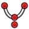 | Hyperbolic Arc | Creates a hyperbolic arc |
|  | Parabolic Arc | Creates a parabolic arc |

### B-Spline — `Sketcher_CompCreateBSpline`

| Icon | Button / dropdown choice | Function |
| --- | --- | --- |
|  | B-Spline | Creates a B-spline curve defined by control points |
|  | Periodic B-Spline | Creates a periodic B-spline curve defined by control points |
|  | B-Spline From Knots | Creates a B-spline from knots, i.e. from interpolation |
|  | Periodic B-Spline From Knots | Creates a periodic B-spline defined by knots using interpolation |

### Circle From Center — `Sketcher_CompCreateConic`

| Icon | Button / dropdown choice | Function |
| --- | --- | --- |
|  | Circle From Center | Creates a circle from a center and rim point |
|  | Circle From 3 Points | Creates a circle from 3 perimeter points |
|  | Ellipse From Center | Creates an ellipse from a center and rim point |
|  | Ellipse From 3 Points | Creates an ellipse from 3 points on its perimeter |

### Fillet — `Sketcher_CompCreateFillets`

| Icon | Button / dropdown choice | Function |
| --- | --- | --- |
|  | Fillet | Creates a fillet between 2 selected curves or at coincident points |
| 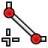 | Chamfer | Creates a chamfer between 2 selected curves or at coincident points |

### Rectangle — `Sketcher_CompCreateRectangles`

| Icon | Button / dropdown choice | Function |
| --- | --- | --- |
|  | Rectangle | Creates a rectangle from 2 corner points |
|  | Centered Rectangle | Creates a centered rectangle from a center and a corner point |
|  | Rounded Rectangle | Creates a rounded rectangle from 2 corner points |

### Triangle — `Sketcher_CompCreateRegularPolygon`

| Icon | Button / dropdown choice | Function |
| --- | --- | --- |
|  | Triangle | Creates an equilateral triangle from a center and corner point |
|  | Square | Creates a square from a center and corner point |
|  | Pentagon | Creates a pentagon from a center and corner point |
|  | Hexagon | Creates a hexagon from a center and corner point |
|  | Heptagon | Creates a heptagon from a center and corner point |
|  | Octagon | Creates an octagon from a center and corner point |
|  | Polygon | Creates a regular polygon from a center and corner point |

### Trim Edge — `Sketcher_CompCurveEdition`

| Icon | Button / dropdown choice | Function |
| --- | --- | --- |
|  | Trim Edge | Trims an edge with respect to the selected position |
| 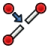 | Split Edge | Splits an edge into 2 segments while preserving constraints |
| 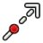 | Extend Edge | Extends an edge with respect to the selected position |

### Dimension — `Sketcher_CompDimensionTools`

| Icon | Button / dropdown choice | Function |
| --- | --- | --- |
|  | Dimension | Constrains contextually based on the selection. The type can be changed with the M key. |
|  | Horizontal Dimension | Constrains the horizontal distance between two points, or from a point to the origin if only one is selected |
|  | Vertical Dimension | Constrains the vertical distance between two points, or from a point to the origin if only one is selected |
|  | Distance Dimension | Constrains the vertical distance between two points, or from a point to the origin if one is selected |
|  | Radius/Diameter Dimension | Constrains the radius of the selected arc or the diameter of the selected circle |
|  | Radius Dimension | Constrains the radius of the selected circle or arc |
|  | Diameter Dimension | Constrains the diameter of the selected circle or arc |
|  | Angle Dimension | Constrains the angle between two straight lines or between one line and the X-axis of the sketch if only one is selected |
|  | Lock Position | Constrains the selected vertices by adding horizontal and vertical distance constraints |

### External Projection — `Sketcher_CompExternal`

| Icon | Button / dropdown choice | Function |
| --- | --- | --- |
|  | External Projection | Creates the projection of external geometry in the sketch plane |
|  | External Intersection | Creates the intersection of external geometry with the sketch plane |

### Horizontal Constraint — `Sketcher_CompHorVer`

| Icon | Button / dropdown choice | Function |
| --- | --- | --- |
|  | Horizontal Constraint | Constrains the selected elements horizontally |
|  | Vertical Constraint | Constrains the selected elements vertically |

### Polyline — `Sketcher_CompLine`

| Icon | Button / dropdown choice | Function |
| --- | --- | --- |
|  | Polyline | Creates a polyline in the sketch. M key cycles through segment modes. |
| 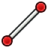 | Line | Creates a line |

### Increase knot multiplicity — `Sketcher_CompModifyKnotMultiplicity`

| Icon | Button / dropdown choice | Function |
| --- | --- | --- |
|  | Increase knot multiplicity | Increases the multiplicity of the selected knot of a B-spline |
| 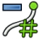 | Decrease knot multiplicity | Decreases the multiplicity of the selected knot of a B-spline |

### Slot — `Sketcher_CompSlot`

| Icon | Button / dropdown choice | Function |
| --- | --- | --- |
|  | Slot | Creates a slot |
|  | Arc Slot | Creates an arc slot |

### Toggle Driving/Reference Constraints — `Sketcher_CompToggleConstraints`

| Icon | Button / dropdown choice | Function |
| --- | --- | --- |
|  | Toggle Driving/Reference Constraints | Toggles between driving and reference mode of the selected constraints and commands |
|  | Toggle Constraints | Toggles the state of the selected constraints |

### Angle Dimension — `Sketcher_ConstrainAngle`

| Icon | Button / dropdown choice | Function |
| --- | --- | --- |
|  | Angle Dimension | Constrains the angle between two straight lines or between one line and the X-axis of the sketch if only one is selected |

### Block Constraint — `Sketcher_ConstrainBlock`

| Icon | Button / dropdown choice | Function |
| --- | --- | --- |
|  | Block Constraint | Constrains the selected edges as fixed |

### Coincident Constraint — `Sketcher_ConstrainCoincidentUnified`

| Icon | Button / dropdown choice | Function |
| --- | --- | --- |
|  | Coincident Constraint | Constrains the selected elements to be coincident |

### Diameter Dimension — `Sketcher_ConstrainDiameter`

| Icon | Button / dropdown choice | Function |
| --- | --- | --- |
|  | Diameter Dimension | Constrains the diameter of the selected circle or arc |

### Distance Dimension — `Sketcher_ConstrainDistance`

| Icon | Button / dropdown choice | Function |
| --- | --- | --- |
|  | Distance Dimension | Constrains the vertical distance between two points, or from a point to the origin if one is selected |

### Horizontal Dimension — `Sketcher_ConstrainDistanceX`

| Icon | Button / dropdown choice | Function |
| --- | --- | --- |
|  | Horizontal Dimension | Constrains the horizontal distance between two points, or from a point to the origin if only one is selected |

### Vertical Dimension — `Sketcher_ConstrainDistanceY`

| Icon | Button / dropdown choice | Function |
| --- | --- | --- |
|  | Vertical Dimension | Constrains the vertical distance between two points, or from a point to the origin if only one is selected |

### Equal Constraint — `Sketcher_ConstrainEqual`

| Icon | Button / dropdown choice | Function |
| --- | --- | --- |
|  | Equal Constraint | Constrains the selected edges or circles to be equal |

### Group Constraint (Development preview) — `Sketcher_ConstrainGroup`

| Icon | Button / dropdown choice | Function |
| --- | --- | --- |
|  | Group Constraint (Development preview) | Constrains the selected geometries together as a single entity.The position and size of the grouped geometries can be defined by constraining the construction line that is generated.Constraints applied to grouped edges are ignored as long as the Group constraint is here. |

### Lock Position — `Sketcher_ConstrainLock`

| Icon | Button / dropdown choice | Function |
| --- | --- | --- |
|  | Lock Position | Constrains the selected vertices by adding horizontal and vertical distance constraints |

### Parallel Constraint — `Sketcher_ConstrainParallel`

| Icon | Button / dropdown choice | Function |
| --- | --- | --- |
|  | Parallel Constraint | Constrains the selected lines to be parallel |

### Perpendicular Constraint — `Sketcher_ConstrainPerpendicular`

| Icon | Button / dropdown choice | Function |
| --- | --- | --- |
|  | Perpendicular Constraint | Constrains the selected lines to be perpendicular |

### Radius/Diameter Dimension — `Sketcher_ConstrainRadiam`

| Icon | Button / dropdown choice | Function |
| --- | --- | --- |
|  | Radius/Diameter Dimension | Constrains the radius of the selected arc or the diameter of the selected circle |

### Radius Dimension — `Sketcher_ConstrainRadius`

| Icon | Button / dropdown choice | Function |
| --- | --- | --- |
|  | Radius Dimension | Constrains the radius of the selected circle or arc |

### Refraction Constraint — `Sketcher_ConstrainSnellsLaw`

| Icon | Button / dropdown choice | Function |
| --- | --- | --- |
|  | Refraction Constraint | Constrains the selected elements based on the refraction law (Snell's Law) |

### Symmetric Constraint — `Sketcher_ConstrainSymmetric`

| Icon | Button / dropdown choice | Function |
| --- | --- | --- |
|  | Symmetric Constraint | Constrains the selected elements to be symmetric |

### Tangent/Collinear Constraint — `Sketcher_ConstrainTangent`

| Icon | Button / dropdown choice | Function |
| --- | --- | --- |
|  | Tangent/Collinear Constraint | Constrains the selected elements to be tangent or collinear |

### Point — `Sketcher_CreatePoint`

| Icon | Button / dropdown choice | Function |
| --- | --- | --- |
|  | Point | Creates a point |

### Text (Experimental) — `Sketcher_CreateText`

| Icon | Button / dropdown choice | Function |
| --- | --- | --- |
|  | Text (Experimental) | Creates text geometries controlled by a Text constraint. To Edit: Double-click the Text constraint to change the text content and font. To Position/Size: Apply constraints to the group's construction line. Note: While the Text constraint is active, any constraints applied directly to the text geometries will be ignored. |

### Auto Dimension — `Sketcher_Dimension`

| Icon | Button / dropdown choice | Function |
| --- | --- | --- |
|  | Dimension | Constrains contextually based on the selection. The type can be changed with the M key. |

### Edit Sketch — `Sketcher_EditSketch`

| Icon | Button / dropdown choice | Function |
| --- | --- | --- |
|  | Edit Sketch | Opens the selected sketch for editing |

### Join Curves — `Sketcher_JoinCurves`

| Icon | Button / dropdown choice | Function |
| --- | --- | --- |
|  | Join Curves | Joins 2 curves at selected end points |

### Leave Sketch — `Sketcher_LeaveSketch`

| Icon | Button / dropdown choice | Function |
| --- | --- | --- |
|  | Leave Sketch | Finishes editing the active sketch. Press Escape to exit. |

### Attach Sketch — `Sketcher_MapSketch`

| Icon | Button / dropdown choice | Function |
| --- | --- | --- |
|  | Attach Sketch | Attaches a sketch to the selected geometry element |

### Merge Sketches — `Sketcher_MergeSketches`

| Icon | Button / dropdown choice | Function |
| --- | --- | --- |
|  | Merge Sketches | Creates a new sketch by merging at least 2 selected sketches |

### Mirror Sketch — `Sketcher_MirrorSketch`

| Icon | Button / dropdown choice | Function |
| --- | --- | --- |
|  | Mirror Sketch | Creates a new mirrored sketch for each selected sketch by using the X or Y axes, or the origin point, as mirroring reference |

### New Sketch — `Sketcher_NewSketch`

| Icon | Button / dropdown choice | Function |
| --- | --- | --- |
|  | New Sketch | Creates a new sketch |

### Offset — `Sketcher_Offset`

| Icon | Button / dropdown choice | Function |
| --- | --- | --- |
|  | Offset | Adds an equidistant closed contour around selected geometry: positive values offset outward, negative values inward |

### Remove Axes Alignment — `Sketcher_RemoveAxesAlignment`

| Icon | Button / dropdown choice | Function |
| --- | --- | --- |
|  | Remove Axes Alignment | Modifies the constraints to remove axes alignment while trying to preserve the constraint relationship of the selection |

### Reorient Sketch — `Sketcher_ReorientSketch`

| Icon | Button / dropdown choice | Function |
| --- | --- | --- |
|  | Reorient Sketch | Places the selected sketch on one of the global coordinate planes. This will clear the AttachmentSupport property. |

### Toggle Internal Geometry — `Sketcher_RestoreInternalAlignmentGeometry`

| Icon | Button / dropdown choice | Function |
| --- | --- | --- |
|  | Toggle Internal Geometry | Toggles the visibility of all internal geometry |

### Rotate / Polar Transform — `Sketcher_Rotate`

| Icon | Button / dropdown choice | Function |
| --- | --- | --- |
|  | Rotate / Polar Transform | Rotates the selected geometry by creating 'n' total elements, enabling circular pattern creation |

### Scale — `Sketcher_Scale`

| Icon | Button / dropdown choice | Function |
| --- | --- | --- |
|  | Scale | Scales the selected geometries |

### Select Associated Constraints — `Sketcher_SelectConstraints`

| Icon | Button / dropdown choice | Function |
| --- | --- | --- |
|  | Select Associated Constraints | Selects the constraints associated with the selected geometrical elements |

### Select Associated Geometry — `Sketcher_SelectElementsAssociatedWithConstraints`

| Icon | Button / dropdown choice | Function |
| --- | --- | --- |
|  | Select Associated Geometry | Selects the geometrical elements associated with the selected constraints |

### Switch Virtual Space — `Sketcher_SwitchVirtualSpace`

| Icon | Button / dropdown choice | Function |
| --- | --- | --- |
|  | Switch Virtual Space | Switches the selected constraints or the view to the other virtual space |

### Mirror — `Sketcher_Symmetry`

| Icon | Button / dropdown choice | Function |
| --- | --- | --- |
|  | Mirror | Creates a mirrored copy of the selected geometry |

### Toggle Construction Geometry — `Sketcher_ToggleConstruction`

| Icon | Button / dropdown choice | Function |
| --- | --- | --- |
|  | Toggle Construction Geometry | Toggles between defining geometry and construction geometry modes |

### Move / Array Transform — `Sketcher_Translate`

| Icon | Button / dropdown choice | Function |
| --- | --- | --- |
|  | Move / Array Transform | Translates the selected geometries and enables the creation of 'i' * 'j' total elements |

### Validate Sketch — `Sketcher_ValidateSketch`

| Icon | Button / dropdown choice | Function |
| --- | --- | --- |
|  | Validate Sketch | Validates a sketch by checking for missing coincidences, invalid constraints, and degenerate geometry |

### Toggle Section View — `Sketcher_ViewSection`

| Icon | Button / dropdown choice | Function |
| --- | --- | --- |
|  | Toggle Section View | Toggles between section view and full view |

### Align View to Sketch — `Sketcher_ViewSketch`

| Icon | Button / dropdown choice | Function |
| --- | --- | --- |
|  | Align View to Sketch | Aligns the camera orientation perpendicular to the active sketch plane |

### Align Bottom — `Spreadsheet_AlignBottom`

| Icon | Button / dropdown choice | Function |
| --- | --- | --- |
|  | Align Bottom | Aligns cell contents to the bottom |

### Align Horizontal Center — `Spreadsheet_AlignCenter`

| Icon | Button / dropdown choice | Function |
| --- | --- | --- |
|  | Align Horizontal Center | Aligns cell contents to the horizontal center |

### Align Left — `Spreadsheet_AlignLeft`

| Icon | Button / dropdown choice | Function |
| --- | --- | --- |
|  | Align Left | Aligns cell contents to the left |

### Align Right — `Spreadsheet_AlignRight`

| Icon | Button / dropdown choice | Function |
| --- | --- | --- |
|  | Align Right | Aligns cell contents to the right |

### Align Top — `Spreadsheet_AlignTop`

| Icon | Button / dropdown choice | Function |
| --- | --- | --- |
|  | Align Top | Aligns cell contents to the top |

### Align Vertical Center — `Spreadsheet_AlignVCenter`

| Icon | Button / dropdown choice | Function |
| --- | --- | --- |
|  | Align Vertical Center | Aligns cell contents to the vertical center |

### New Spreadsheet — `Spreadsheet_CreateSheet`

| Icon | Button / dropdown choice | Function |
| --- | --- | --- |
|  | New Spreadsheet | Creates a new spreadsheet |

### Export Spreadsheet — `Spreadsheet_Export`

| Icon | Button / dropdown choice | Function |
| --- | --- | --- |
|  | Export Spreadsheet | Exports the spreadsheet to a CSV file |

### Import Spreadsheet — `Spreadsheet_Import`

| Icon | Button / dropdown choice | Function |
| --- | --- | --- |
|  | Import Spreadsheet | Imports a CSV file into a new spreadsheet |

### Merge Cells — `Spreadsheet_MergeCells`

| Icon | Button / dropdown choice | Function |
| --- | --- | --- |
|  | Merge Cells | Merges the selected cells |

### Set Alias — `Spreadsheet_SetAlias`

| Icon | Button / dropdown choice | Function |
| --- | --- | --- |
|  | Set Alias | Sets an alias for the selected cell |

### Split Cell — `Spreadsheet_SplitCell`

| Icon | Button / dropdown choice | Function |
| --- | --- | --- |
|  | Split Cell | Splits a previously merged cell |

### Bold Text — `Spreadsheet_StyleBold`

| Icon | Button / dropdown choice | Function |
| --- | --- | --- |
|  | Bold Text | Sets the text in the selected cells bold |

### Italic Text — `Spreadsheet_StyleItalic`

| Icon | Button / dropdown choice | Function |
| --- | --- | --- |
|  | Italic Text | Sets the text in the selected cells italic |

### Underline Text — `Spreadsheet_StyleUnderline`

| Icon | Button / dropdown choice | Function |
| --- | --- | --- |
|  | Underline Text | Underlines the text in the selected cells |

### Align to Selection — `Std_AlignToSelection`

| Icon | Button / dropdown choice | Function |
| --- | --- | --- |
|  | Align to Selection | Aligns the camera view to the selected elements in the 3D view |

### Command search... — `Std_CommandSearch`

| Icon | Button / dropdown choice | Function |
| --- | --- | --- |
|  | Command search... | Find commands by name, familiar alias or shortcut |

### Components — `Std_ComponentStructure`

| Icon | Button / dropdown choice | Function |
| --- | --- | --- |
|  | Components | Show Models, Part Tree and History |

### Copy — `Std_Copy`

| Icon | Button / dropdown choice | Function |
| --- | --- | --- |
|  | Copy | Copies the selection to the clipboard |

### Cut — `Std_Cut`

| Icon | Button / dropdown choice | Function |
| --- | --- | --- |
|  | Cut | Removes the selection and copies it to the clipboard |

### Delete — `Std_Delete`

| Icon | Button / dropdown choice | Function |
| --- | --- | --- |
|  | Delete | Deletes the selected objects |

### Macros — `Std_DlgMacroExecute`

| Icon | Button / dropdown choice | Function |
| --- | --- | --- |
|  | Macros | Opens a dialog to execute a recorded macro |

### Execute Macro — `Std_DlgMacroExecuteDirect`

| Icon | Button / dropdown choice | Function |
| --- | --- | --- |
|  | Execute Macro | Executes the macro in the editor |

### Record Macro — `Std_DlgMacroRecord`

| Icon | Button / dropdown choice | Function |
| --- | --- | --- |
|  | Record Macro | Opens a dialog to record a macro |

### Preferences — `Std_DlgPreferences`

| Icon | Button / dropdown choice | Function |
| --- | --- | --- |
|  | Preferences | Opens a dialog to edit the preferences |

### Panels — `Std_DockViewMenu`

| Icon | Button / dropdown choice | Function |
| --- | --- | --- |
|  | Panels | Lists available dock panels |

### As Is — `Std_DrawStyle`

| Icon | Button / dropdown choice | Function |
| --- | --- | --- |
|  | As Is | Normal mode |
|  | Points | Points mode |
|  | Wireframe | Wireframe mode |
|  | Hidden Line | Hidden line mode |
|  | No Shading | No shading mode |
|  | Shaded | Shaded mode |
|  | Flat Lines | Flat lines mode |

### Selection filters… — `Std_EntitySelectionFilter`

| Icon | Button / dropdown choice | Function |
| --- | --- | --- |
|  | Selection filters… | Restrict new picks to vertices, edges, faces or whole objects |

### Export… — `Std_Export`

| Icon | Button / dropdown choice | Function |
| --- | --- | --- |
|  | Export… | Exports an object in the active document |

### New Group — `Std_Group`

| Icon | Button / dropdown choice | Function |
| --- | --- | --- |
|  | New Group | Creates a group, which is a general-purpose container to group objects in the tree view, regardless of their data type. It is a simple folder to organize the objects in a model. |

### Import… — `Std_Import`

| Icon | Button / dropdown choice | Function |
| --- | --- | --- |
|  | Import… | Imports a file into the active document |

### Make Link — `Std_LinkActions`

| Icon | Button / dropdown choice | Function |
| --- | --- | --- |
|  | Make Link | A link is an object that references another object, either within the same or in another document. Unlike clones, links reference the original shape directly, making them more memory-efficient, which helps with the creation of complex assemblies. |
|  | Make Sub-Link | Creates a sub-object or sub-element link |
|  | Replace With Link | Replaces the selected objects with links |
|  | Unlink | Unlinks the object by placing it directly in the container |
|  | Import Links | Imports selected external links |
|  | Import All Links | Imports all links of the active document |

### Mass Properties — `Std_MassProperties`

| Icon | Button / dropdown choice | Function |
| --- | --- | --- |
|  | Mass Properties | Calculates mass properties of selected objects |

### Measure — `Std_Measure`

| Icon | Button / dropdown choice | Function |
| --- | --- | --- |
|  | Measure | Measures a feature |

### New File — `Std_New`

| Icon | Button / dropdown choice | Function |
| --- | --- | --- |
|  | New Document | Creates a new empty document |

### Open… — `Std_Open`

| Icon | Button / dropdown choice | Function |
| --- | --- | --- |
|  | Open… | Opens a document or imports files |

### Add part — `Std_Part`

| Icon | Button / dropdown choice | Function |
| --- | --- | --- |
|  | Add Component | Adds a component to the active component. |

### Paste — `Std_Paste`

| Icon | Button / dropdown choice | Function |
| --- | --- | --- |
|  | Paste | Pastes the contents of the clipboard |

### Redo — `Std_Redo`

| Icon | Button / dropdown choice | Function |
| --- | --- | --- |
|  | Redo | Redoes a previously undone action |

### Recompute — `Std_Refresh`

| Icon | Button / dropdown choice | Function |
| --- | --- | --- |
|  | Recompute | Recomputes the active document |

### Save — `Std_Save`

| Icon | Button / dropdown choice | Function |
| --- | --- | --- |
|  | Save | Saves the active document |

### Save As… — `Std_SaveAs`

| Icon | Button / dropdown choice | Function |
| --- | --- | --- |
|  | Save As… | Saves the active document under a new file name |

### Toolbars — `Std_ToolBarMenu`

| Icon | Button / dropdown choice | Function |
| --- | --- | --- |
|  | Toolbars | Toggles this window |

### Undo — `Std_Undo`

| Icon | Button / dropdown choice | Function |
| --- | --- | --- |
|  | Undo | Undoes the previous action |

### Variable Set — `Std_VarSet`

| Icon | Button / dropdown choice | Function |
| --- | --- | --- |
|  | Variable Set | Creates a variable set, which is an object that maintains a set of properties to be used as variables |

### Bottom — `Std_ViewBottom`

| Icon | Button / dropdown choice | Function |
| --- | --- | --- |
|  | Bottom | Sets the camera to the bottom view |

### Fit All — `Std_ViewFitAll`

| Icon | Button / dropdown choice | Function |
| --- | --- | --- |
|  | Fit All | Fits all content into the 3D view |

### Fit Selection — `Std_ViewFitSelection`

| Icon | Button / dropdown choice | Function |
| --- | --- | --- |
|  | Fit Selection | Fits the selected content into the 3D view |

### Front — `Std_ViewFront`

| Icon | Button / dropdown choice | Function |
| --- | --- | --- |
|  | Front | Sets the camera to the front view |

### Isometric — `Std_ViewGroup`

| Icon | Button / dropdown choice | Function |
| --- | --- | --- |
|  | Isometric | Sets the camera to the isometric view |
|  | Front | Sets the camera to the front view |
|  | Top | Sets the camera to the top view |
|  | Right | Sets the camera to the right view |
| 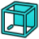 | Rear | Sets the camera to the rear view |
|  | Bottom | Sets the camera to the bottom view |
|  | Left | Sets the camera to the left view |

### Isometric — `Std_ViewIsometric`

| Icon | Button / dropdown choice | Function |
| --- | --- | --- |
|  | Isometric | Sets the camera to the isometric view |

### Left — `Std_ViewLeft`

| Icon | Button / dropdown choice | Function |
| --- | --- | --- |
|  | Left | Sets the camera to the left view |

### Rear — `Std_ViewRear`

| Icon | Button / dropdown choice | Function |
| --- | --- | --- |
|  | Rear | Sets the camera to the rear view |

### Right — `Std_ViewRight`

| Icon | Button / dropdown choice | Function |
| --- | --- | --- |
|  | Right | Sets the camera to the right view |

### Status Bar — `Std_ViewStatusBar`

| Icon | Button / dropdown choice | Function |
| --- | --- | --- |
|  | Status Bar | Toggles the status bar |

### Top — `Std_ViewTop`

| Icon | Button / dropdown choice | Function |
| --- | --- | --- |
|  | Top | Sets the camera to the top view |

### What's This? — `Std_WhatsThis`

| Icon | Button / dropdown choice | Function |
| --- | --- | --- |
|  | What's This? | Opens the documentation for the selected command |

### Assembly — `Std_Workbench`

| Icon | Button / dropdown choice | Function |
| --- | --- | --- |
|  | Assembly | Selects the 'Assembly' workbench |
|  | CAM | Selects the 'CAM' workbench |
| 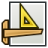 | Draft | Selects the 'Draft' workbench |
|  | Material | Selects the 'Material' workbench |
|  | Mesh | Selects the 'Mesh' workbench |
|  | Part Design | Selects the 'Part Design' workbench |
|  | Part | Selects the 'Part' workbench |
|  | Sketcher | Selects the 'Sketcher' workbench |
| 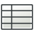 | Spreadsheet | Selects the 'Spreadsheet' workbench |
|  | Surface | Selects the 'Surface' workbench |
|  | TechDraw | Selects the 'TechDraw' workbench |
|  |  | Select the ' ' workbench |
|  | Test Framework | Select the 'Test Framework' workbench |

### Blend Curve — `Surface_BlendCurve`

| Icon | Button / dropdown choice | Function |
| --- | --- | --- |
|  | Blend Curve | Joins 2 edges with continuity |

### Curve on Mesh — `Surface_CurveOnMesh`

| Icon | Button / dropdown choice | Function |
| --- | --- | --- |
|  | Curve on Mesh | Creates an approximated curve on top of a mesh. This command only works with a mesh object. |

### Extend Face — `Surface_ExtendFace`

| Icon | Button / dropdown choice | Function |
| --- | --- | --- |
|  | Extend Face | Extrapolates the selected face or surface at its boundaries with its local U and V parameters |

### Filling — `Surface_Filling`

| Icon | Button / dropdown choice | Function |
| --- | --- | --- |
|  | Filling | Creates a surface from a series of selected boundary edges. Additionally, the surface may be constrained by edges and vertices that are not on the boundary. |

### Fill Boundary Curves — `Surface_GeomFillSurface`

| Icon | Button / dropdown choice | Function |
| --- | --- | --- |
|  | Fill Boundary Curves | Creates a surface from 2, 3, or 4 boundary edges |

### Sections — `Surface_Sections`

| Icon | Button / dropdown choice | Function |
| --- | --- | --- |
|  | Sections | Creates a surface from a series of sectional edges |

### Cosmetic Line Through 2 Points — `TechDraw_2PointCosmeticLine`

| Icon | Button / dropdown choice | Function |
| --- | --- | --- |
|  | Cosmetic Line Through 2 Points | Adds a cosmetic line that passes through 2 selected points |

### Angle Dimension From 3 Points — `TechDraw_3PtAngleDimension`

| Icon | Button / dropdown choice | Function |
| --- | --- | --- |
|  | Angle Dimension From 3 Points | Inserts an angle dimension between 3 selected points |

### Active View — `TechDraw_ActiveView`

| Icon | Button / dropdown choice | Function |
| --- | --- | --- |
|  | Active View | Inserts an image of the open 3D view in the current page. If multiple 3D views are open, a selection dialog will be shown. |

### Angle Dimension — `TechDraw_AngleDimension`

| Icon | Button / dropdown choice | Function |
| --- | --- | --- |
|  | Angle Dimension | Inserts an angle dimension between two edges |

### Area Annotation — `TechDraw_AreaDimension`

| Icon | Button / dropdown choice | Function |
| --- | --- | --- |
|  | Area Annotation | Inserts an annotation showing the area of a selected face |

### Axonometric Length Dimension — `TechDraw_AxoLengthDimension`

| Icon | Button / dropdown choice | Function |
| --- | --- | --- |
|  | Axonometric Length Dimension | Creates a length dimension in with axonometric view, using selected edges or vertex pairs to define direction and measurement |

### Balloon Annotation — `TechDraw_Balloon`

| Icon | Button / dropdown choice | Function |
| --- | --- | --- |
|  | Balloon Annotation | Inserts a new balloon annotation in the selected view |

### Broken View — `TechDraw_BrokenView`

| Icon | Button / dropdown choice | Function |
| --- | --- | --- |
|  | Broken View | Inserts a new broken view for the selected objects or base view and break definition objects |

### Centerline on Face — `TechDraw_CenterLineGroup`

| Icon | Button / dropdown choice | Function |
| --- | --- | --- |
|  | Centerline on Face | Adds a centerline to selected faces |
| 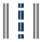 | Centerline Between 2 Lines | Adds a centerline between 2 selected lines |
|  | Centerline Between 2 Points | Adds a centerline between 2 selected points |

### Clip Group — `TechDraw_ClipGroup`

| Icon | Button / dropdown choice | Function |
| --- | --- | --- |
|  | Clip Group | Inserts a new clip group for the selected view |

### Offset Vertex — `TechDraw_CommandAddOffsetVertex`

| Icon | Button / dropdown choice | Function |
| --- | --- | --- |
| 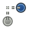 | Offset Vertex | Creates an offset from one selected vertex |

### Cosmetic Intersection Vertices — `TechDraw_CommandVertexCreationGroup`

| Icon | Button / dropdown choice | Function |
| --- | --- | --- |
|  | Cosmetic Intersection Vertices | Cosmetic Intersection Vertices |
|  | Offset Vertex | Creates an offset from one selected vertex |

### Dimension — `TechDraw_CompDimensionTools`

| Icon | Button / dropdown choice | Function |
| --- | --- | --- |
|  | Dimension | Inserts new contextual dimensions to the selection. Depending on your selection you might have several dimensions available. You can cycle through them using the M key. Left clicking on empty space will validate the current dimension. Right clicking or pressing Esc will cancel. |
|  | Length Dimension | Inserts a length dimension of an edge or distance between two points |
|  | Horizontal Length Dimension | Inserts a horizontal length dimension of an edge or distance between two points |
|  | Vertical Length Dimension | Inserts a vertical length dimension of an edge or distance between two points |
|  | Radius Dimension | Inserts a radius dimension of a circular edge or arc |
|  | Diameter Dimension | Inserts a diameter dimension of a circular edge or arc |
|  | Angle Dimension | Inserts an angle dimension between two edges |
|  | Angle Dimension From 3 Points | Inserts an angle dimension between 3 selected points |
|  | Area Annotation | Inserts an annotation showing the area of a selected face |
|  | Arc Length Dimension | Arc Length Dimension |
|  | Horizontal Extent Dimension | Inserts a dimension showing the horizontal extent (overall length) of an object or feature |
|  | Vertical Extent Dimension | Inserts a dimension showing the vertical extent (overall length) of an object or feature |
|  | Horizontal Chain Dimension | Horizontal Chain Dimension |
| 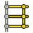 | Vertical Chain Dimension | Vertical Chain Dimension |
|  | Oblique Chain Dimension | Oblique Chain Dimension |
| 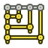 | Horizontal Coordinate Dimension | Horizontal Coordinate Dimension |
|  | Vertical Coordinate Dimension | Vertical Coordinate Dimension |
|  | Oblique Coordinate Dimension | Oblique Coordinate Dimension |
|  | Horizontal Chamfer Dimension | Horizontal Chamfer Dimension |
| 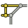 | Vertical Chamfer Dimension | Vertical Chamfer Dimension |

### Cosmetic Vertex — `TechDraw_CosmeticVertexGroup`

| Icon | Button / dropdown choice | Function |
| --- | --- | --- |
|  | Cosmetic Vertex | Inserts a cosmetic vertex into a view |
| 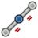 | Midpoint Vertices | Inserts cosmetic vertices at the midpoint of the selected edges |
|  | Quadrant Vertices | Inserts cosmetic vertices at the quadrant points of the selected circles |

### Edit Line Appearance — `TechDraw_DecorateLine`

| Icon | Button / dropdown choice | Function |
| --- | --- | --- |
|  | Edit Line Appearance | Opens the 'Line decoration' dialog to edit the selected lines |

### Detail View — `TechDraw_DetailView`

| Icon | Button / dropdown choice | Function |
| --- | --- | --- |
|  | Detail View | Inserts a new detail view based on the selected view in the current page |

### Diameter Dimension — `TechDraw_DiameterDimension`

| Icon | Button / dropdown choice | Function |
| --- | --- | --- |
|  | Diameter Dimension | Inserts a diameter dimension of a circular edge or arc |

### Dimension — `TechDraw_Dimension`

| Icon | Button / dropdown choice | Function |
| --- | --- | --- |
|  | Dimension | Inserts new contextual dimensions to the selection. Depending on your selection you might have several dimensions available. You can cycle through them using the M key. Left clicking on empty space will validate the current dimension. Right clicking or pressing Esc will cancel. |

### Repair Dimension References — `TechDraw_DimensionRepair`

| Icon | Button / dropdown choice | Function |
| --- | --- | --- |
|  | Repair Dimension References | Repairs broken or incorrect dimension references |

### Draft View — `TechDraw_DraftView`

| Icon | Button / dropdown choice | Function |
| --- | --- | --- |
|  | Draft View | Inserts a view of a Draft object |

### Export Page as DXF — `TechDraw_ExportPageDXF`

| Icon | Button / dropdown choice | Function |
| --- | --- | --- |
|  | Export Page as DXF | Exports the current page as a DXF |

### Export Page as SVG — `TechDraw_ExportPageSVG`

| Icon | Button / dropdown choice | Function |
| --- | --- | --- |
|  | Export Page as SVG | Exports the current page as an SVG |

### Arc Length Annotation — `TechDraw_ExtensionArcLengthAnnotation`

| Icon | Button / dropdown choice | Function |
| --- | --- | --- |
|  | Arc Length Annotation | Inserts an annotation with the calculated arc length of the selected edges |

### Area Annotation — `TechDraw_ExtensionAreaAnnotation`

| Icon | Button / dropdown choice | Function |
| --- | --- | --- |
|  | Area Annotation | Calculates the area of multiple selected faces |

### Horizontal Chamfer Dimension — `TechDraw_ExtensionChamferDimensionGroup`

| Icon | Button / dropdown choice | Function |
| --- | --- | --- |
|  | Horizontal Chamfer Dimension | Horizontal Chamfer Dimension |
|  | Vertical Chamfer Dimension | Vertical Chamfer Dimension |

### Change Line Attributes — `TechDraw_ExtensionChangeLineAttributes`

| Icon | Button / dropdown choice | Function |
| --- | --- | --- |
|  | Change Line Attributes | Change Line Attributes |

### Circle Centerlines — `TechDraw_ExtensionCircleCenterLinesGroup`

| Icon | Button / dropdown choice | Function |
| --- | --- | --- |
|  | Circle Centerlines | Circle Centerlines |
| 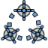 | Bolt Circle Centerlines | Bolt Circle Centerlines |

### Horizontal Chain Dimension — `TechDraw_ExtensionCreateChainDimensionGroup`

| Icon | Button / dropdown choice | Function |
| --- | --- | --- |
|  | Horizontal Chain Dimension | Horizontal Chain Dimension |
|  | Vertical Chain Dimension | Vertical Chain Dimension |
|  | Oblique Chain Dimension | Oblique Chain Dimension |

### Horizontal Coordinate Dimension — `TechDraw_ExtensionCreateCoordDimensionGroup`

| Icon | Button / dropdown choice | Function |
| --- | --- | --- |
|  | Horizontal Coordinate Dimension | Horizontal Coordinate Dimension |
|  | Vertical Coordinate Dimension | Vertical Coordinate Dimension |
|  | Oblique Coordinate Dimension | Oblique Coordinate Dimension |

### Arc Length Dimension — `TechDraw_ExtensionCreateLengthArc`

| Icon | Button / dropdown choice | Function |
| --- | --- | --- |
|  | Arc Length Dimension | Arc Length Dimension |

### Customize Format Label — `TechDraw_ExtensionCustomizeFormat`

| Icon | Button / dropdown choice | Function |
| --- | --- | --- |
|  | Customize Format Label | Customizes the format label of a selected dimension or balloon |

### Cosmetic 1 Point Circle — `TechDraw_ExtensionDrawCirclesGroup`

| Icon | Button / dropdown choice | Function |
| --- | --- | --- |
|  | Cosmetic 1 Point Circle | Cosmetic 1 Point Circle |
|  | Cosmetic 2 Point Circle | Cosmetic 2 Point Circle |
|  | Cosmetic 3 Point Circle | Cosmetic 3 Point Circle |
|  | Cosmetic Arc | Cosmetic Arc |

### Extend Line — `TechDraw_ExtensionExtendShortenLineGroup`

| Icon | Button / dropdown choice | Function |
| --- | --- | --- |
|  | Extend Line | Extend Line |
|  | Shorten Line | Shorten Line |

### Increase Decimal Places — `TechDraw_ExtensionIncreaseDecreaseGroup`

| Icon | Button / dropdown choice | Function |
| --- | --- | --- |
|  | Increase Decimal Places | Increase Decimal Places |
|  | Decrease Decimal Places | Decrease Decimal Places |

### Insert '⌀' Prefix — `TechDraw_ExtensionInsertPrefixGroup`

| Icon | Button / dropdown choice | Function |
| --- | --- | --- |
|  | Insert '⌀' Prefix | Insert '⌀' Prefix |
|  | Insert '□' Prefix | Insert '□' Prefix |
|  | Insert 'n×' Prefix | Insert 'n×' Prefix |
|  | Remove Prefix | Remove Prefix |

### Cosmetic Parallel Line — `TechDraw_ExtensionLinePPGroup`

| Icon | Button / dropdown choice | Function |
| --- | --- | --- |
|  | Cosmetic Parallel Line | Cosmetic Parallel Line |
|  | Cosmetic Perpendicular Line | Cosmetic Perpendicular Line |

### Toggle View Lock — `TechDraw_ExtensionLockUnlockView`

| Icon | Button / dropdown choice | Function |
| --- | --- | --- |
|  | Toggle View Lock | Toggle View Lock |

### Position Section View — `TechDraw_ExtensionPositionSectionView`

| Icon | Button / dropdown choice | Function |
| --- | --- | --- |
|  | Position Section View | Aligns the selected section view with its source view orthogonally or the selected edge in the section view to the selected vertex in the base view |

### Select Line Attributes, Cascade Spacing and Delta Distance — `TechDraw_ExtensionSelectLineAttributes`

| Icon | Button / dropdown choice | Function |
| --- | --- | --- |
|  | Select Line Attributes, Cascade Spacing and Delta Distance | Select Line Attributes, Cascade Spacing and Delta Distance |

### Cosmetic Thread Hole Side View — `TechDraw_ExtensionThreadsGroup`

| Icon | Button / dropdown choice | Function |
| --- | --- | --- |
|  | Cosmetic Thread Hole Side View | Cosmetic Thread Hole Side View |
|  | Cosmetic Thread Hole Bottom View | Cosmetic Thread Hole Bottom View |
|  | Cosmetic Thread Bolt Side View | Cosmetic Thread Bolt Side View |
|  | Cosmetic Thread Bolt Bottom View | Cosmetic Thread Bolt Bottom View |

### Cosmetic Intersection Vertices — `TechDraw_ExtensionVertexAtIntersection`

| Icon | Button / dropdown choice | Function |
| --- | --- | --- |
|  | Cosmetic Intersection Vertices | Cosmetic Intersection Vertices |

### Horizontal extent — `TechDraw_ExtentGroup`

| Icon | Button / dropdown choice | Function |
| --- | --- | --- |
|  | Horizontal extent | Insert horizontal extent dimension |
|  | Vertical extent | Insert vertical extent dimension |

### Update Template Fields — `TechDraw_FillTemplateFields`

| Icon | Button / dropdown choice | Function |
| --- | --- | --- |
|  | Update Template Fields | Uses document info to populate the template fields |

### Geometric Hatch — `TechDraw_GeometricHatch`

| Icon | Button / dropdown choice | Function |
| --- | --- | --- |
|  | Geometric Hatch | Applies a geometric hatch pattern to the selected faces |

### Image Hatch — `TechDraw_Hatch`

| Icon | Button / dropdown choice | Function |
| --- | --- | --- |
|  | Image Hatch | Applies a hatch pattern to the selected faces using an image file |

### Hole/Shaft Fit — `TechDraw_HoleShaftFit`

| Icon | Button / dropdown choice | Function |
| --- | --- | --- |
|  | Hole/Shaft Fit | Adds a hole or shaft fit to a selected length or diameter dimension |

### Horizontal Length Dimension — `TechDraw_HorizontalDimension`

| Icon | Button / dropdown choice | Function |
| --- | --- | --- |
|  | Horizontal Length Dimension | Inserts a horizontal length dimension of an edge or distance between two points |

### Leader Line — `TechDraw_LeaderLine`

| Icon | Button / dropdown choice | Function |
| --- | --- | --- |
|  | Leader Line | Adds a leader line |

### Length Dimension — `TechDraw_LengthDimension`

| Icon | Button / dropdown choice | Function |
| --- | --- | --- |
|  | Length Dimension | Inserts a length dimension of an edge or distance between two points |

### New Page — `TechDraw_PageDefault`

| Icon | Button / dropdown choice | Function |
| --- | --- | --- |
|  | New Page | Creates a new page with the default template |

### New Page From Template — `TechDraw_PageTemplate`

| Icon | Button / dropdown choice | Function |
| --- | --- | --- |
|  | New Page From Template | Creates a new page from a custom template |

### Print All Pages — `TechDraw_PrintAll`

| Icon | Button / dropdown choice | Function |
| --- | --- | --- |
|  | Print All Pages | Prints all pages with the print dialog |

### Radius Dimension — `TechDraw_RadiusDimension`

| Icon | Button / dropdown choice | Function |
| --- | --- | --- |
|  | Radius Dimension | Inserts a radius dimension of a circular edge or arc |

### Redraw Page — `TechDraw_RedrawPage`

| Icon | Button / dropdown choice | Function |
| --- | --- | --- |
|  | Redraw Page | Redraws the current page |

### Rich Text Annotation — `TechDraw_RichTextAnnotation`

| Icon | Button / dropdown choice | Function |
| --- | --- | --- |
|  | Rich Text Annotation | Inserts a rich text annotation in the current page |

### Section View — `TechDraw_SectionGroup`

| Icon | Button / dropdown choice | Function |
| --- | --- | --- |
|  | Section View | Inserts a simple section view |
|  | Complex Section View | Inserts a complex section view |

### Toggle Edge Visibility — `TechDraw_ShowAll`

| Icon | Button / dropdown choice | Function |
| --- | --- | --- |
|  | Toggle Edge Visibility | Toggles the visibility of the selected edges |

### Spreadsheet View — `TechDraw_SpreadsheetView`

| Icon | Button / dropdown choice | Function |
| --- | --- | --- |
|  | Spreadsheet View | Inserts a view of a spreadsheet in the current page |

### Stack Top — `TechDraw_StackGroup`

| Icon | Button / dropdown choice | Function |
| --- | --- | --- |
|  | Stack Top | Moves the view to the top of the stack |
|  | Stack Bottom | Moves the view to the bottom of the stack |
|  | Stack Up | Moves the view up one level |
|  | Stack Down | Moves the view down one level |

### Surface Finish Symbol — `TechDraw_SurfaceFinishSymbols`

| Icon | Button / dropdown choice | Function |
| --- | --- | --- |
|  | Surface Finish Symbol | Adds a surface finish symbol in the selected view |

### Toggle View Frames — `TechDraw_ToggleFrame`

| Icon | Button / dropdown choice | Function |
| --- | --- | --- |
|  | Toggle View Frames | Toggles visibility of view frames and vertices |

### Vertical Length Dimension — `TechDraw_VerticalDimension`

| Icon | Button / dropdown choice | Function |
| --- | --- | --- |
|  | Vertical Length Dimension | Inserts a vertical length dimension of an edge or distance between two points |

### New View — `TechDraw_View`

| Icon | Button / dropdown choice | Function |
| --- | --- | --- |
|  | New View | Inserts a new view into the current page based on the selected object in the tree view or 3D view. If no object is selected, a file browser opens to select an SVG or image file. |

### Weld Symbol — `TechDraw_WeldSymbol`

| Icon | Button / dropdown choice | Function |
| --- | --- | --- |
|  | Weld Symbol | Adds welding information to the selected leader line |

### Self-test... — `Test_Test`

| Icon | Button / dropdown choice | Function |
| --- | --- | --- |
|  | Self-test... | Runs a self-test to check if the application works properly |

### Test all — `Test_TestAll`

| Icon | Button / dropdown choice | Function |
| --- | --- | --- |
|  | Test all | Runs all tests at once (can take very long!) |

### Test base — `Test_TestBase`

| Icon | Button / dropdown choice | Function |
| --- | --- | --- |
|  | Test base | Test the basic functions of FreeCAD |

### Test Document — `Test_TestDoc`

| Icon | Button / dropdown choice | Function |
| --- | --- | --- |
|  | Test Document | Test the document (creation, save, load and destruction) |
