# Toolbars and buttons

Status: owner-intent specification, reconstructed 2026-10-10. **Only the confirmed requirements are authoritative.** Material headed **Needs owner confirmation** is preserved for review and must not be treated as an approved change. The current application, agent-written specifications and implementation reports do not establish owner approval. Newer explicit owner decisions supersede older decisions on the same subject. See [evidence and unresolved decisions](EVIDENCE_AND_DECISIONS.md).

## Section 1 — FC Plus modes, tabs, groups and buttons

### Confirmed presentation rules

Use gray vertical dividers between groups on every tab. Allow complete labels on two lines where needed; never abbreviate or clip them. Medium and small buttons are icon-only. Increase medium icon size to use the button area; exact pixel dimensions require confirmation. The latest October 6 Modeling outline supersedes its earlier medium Edit/Attach cluster. [C06](EVIDENCE_AND_DECISIONS.md#c06)

### Confirmed Design Modeling tab

Groups run left to right in this order. Ordered clusters follow the owner's outline; the exact division of the four Transformation buttons into columns is not separately confirmed.

| Group | Buttons in order | Size / submenu |
| --- | --- | --- |
| Sketch | New Sketch; cluster of Edit Sketch, Attach Sketch, Coordinate System | New Sketch size unstated in the final prompt (DOCX says large); remaining cluster small. Coordinate System dropdown: Coordinate System (default), Plane, Axis, Point. |
| Modeling | Extrude; Revolve; Loft, Helix | Extrude/Revolve large; Loft/Helix medium cluster. |
| Dress-Up | Fillet and Chamfer; Draft, Shell/Thickness | Combined Fillet and Chamfer large; Draft/Shell medium cluster. Exact split/default behavior of the combined button needs confirmation. |
| Transformation | Mirror Feature, Linear Pattern, Circular Pattern, Multi Transform | Medium cluster. |
| Primitives | Box, Cylinder, Sphere, Cone, Ellipsoid, Torus, Prism, Wedge, Tab | Large dropdown; Box default. The owner included Tab; its absence from the implementation is not approval to remove it. |
| Other | Delete Face/Defeaturing, Add Reference Object | Medium cluster. |

Evidence: C06, October 6 at 13:26 Eastern. Pipe is absent from this specific outline; this does **not** establish that its functionality is removed. Preserve it in the full catalog; resolve its Plus placement separately.

### Selection toolbar

Show the Selection toolbar above the ribbon alongside Save/Edit, in Design mode. Its controls are Curve intent (**Single Curve, Connected Curves, Tangent Curves**), a category checkbox dropdown, **Directional Selection**, and **Persistent Selection**. Both toggles default on and remember changes. [R03](EVIDENCE_AND_DECISIONS.md#r03)

| Category | Intended selectable geometry |
| --- | --- |
| Planes | Reference planes |
| Bodies | Whole body geometry, without exposing backend ownership controls |
| Surfaces | Sheets not associated with bodies |
| Faces | Faces belonging to bodies |
| Edges | Edges belonging to bodies |
| Curves | Sketch drawing curves and standalone 3D curves such as isoclines |
| Points | Sketch/reference points and origins |
| Vertices | Body corners/vertices |

Enabled categories intersect with the current command's selection rules. Viewport click, box-selection and persistence behaviors are defined in [Model View Window](MODEL_VIEW_WINDOW.md#selection-behavior).

### Layers toolbar

Show Layers beside the other top toolbars in Design mode. Include **Layers**, **Move to Layer**, and **Change Active Layer**. The latter two are compact fixed-label buttons opening a full-button dropdown, not wide boxes displaying a current value or split default-action buttons. Move to Layer operates on eligible preselected objects and is disabled without them. Change Active Layer shows a check beside the active layer. The [Layers task](TASK_PANEL.md#layers) owns assignment rules. [R03](EVIDENCE_AND_DECISIONS.md#r03)

### Modes and other tabs — Needs owner confirmation

The DOCX records a mode selector at upper left, Design/Draft/CAM plus FEM/3D printing when available, and a common File/Edit/Clipboard toolbar. Accessible conversations do not confirm this entire mode list, its conditional exclusions, or every Home/Sketch/Surface/Assembly/Mesh/View placement. Preserve the complete outline below for review. **The original workbench list remains the inventory baseline; missing Plus placements never authorize workbench removal.** [Current owner direction](EVIDENCE_AND_DECISIONS.md#current)

## Transferred DOCX outline — Needs owner confirmation

These are source candidates, not instructions to implement. **Every entry below needs owner confirmation**, including exact values or restrictions added to otherwise confirmed behavior. D numbers identify paragraphs in the archived DOCX (zero-based body order); the [coverage record](archive/2026-10-10/docx-coverage.json) accounts for every source paragraph. Implementation reports remain archival evidence only.

**D28 — Needs owner confirmation:** Offer Plus UI and Classic UI through Edit > Preferences > General. Plus UI is the default. Show exactly one toolbar style at a time, including after startup, workbench changes and preference changes. Both styles retain the enhanced feature workflows; choosing Classic UI must not discard the fields specified below.

**D2260 — Needs owner confirmation:** Use a mode selector in the upper left of the toolbar section. Include Design, Draft and CAM, with FEM and 3D printing modes when those workbenches are available.

**D2261 — Needs owner confirmation:** Provide a common horizontal toolbar above the ribbon for all modes.

**D2262 — Needs owner confirmation:** File: New File, Open, Save and Save As, all small icons. New File uses the native New Document icon and the caption New File.

**D2263 — Needs owner confirmation:** Edit: Undo, Redo and Recompute, all small icons.

**D2264 — Needs owner confirmation:** Clipboard: Cut, Copy and Paste, all small icons.

**D2265 — Needs owner confirmation:** Apply the same button hierarchy to all future UI modifications.

**D2266 — Needs owner confirmation:** Full size: the most commonly used primary operations, such as Extrude and Revolve, in one row.

**D2267 — Needs owner confirmation:** Medium: 32 logical pixel ribbon icons in 42-pixel-high buttons, arranged in two rows with native tooltips and accessible names.

**D2268 — Needs owner confirmation:** Small: secondary actions without visible name text, arranged in three rows with as many columns as needed.

**D2269 — Needs owner confirmation:** Dropdown: uses same size icons as small icons and has extra width for the drop down arrow. less frequently used choices grouped behind a common action. Auto Dimension offers vertical, horizontal, angle, radius and diameter constraints.

**D2270 — Needs owner confirmation:** Use a consistent grid with gray vertical line dividers between adjacent groups on every tab. Show complete large-button and group captions on up to two lines as needed; grow width/height rather than abbreviating or cutting off text. Medium and small buttons show icons only, with native hover tooltips and accessible names retained.

**D2271 — Needs owner confirmation:** Keep TOOLBARS.md organized by Classic workbench and toolbar, then Plus mode, tab and section, with button sizes and consolidations recorded. Use one command per Classic row and small icon illustrations; retain the command-function catalog at the end.

### Design Mode

**D2273 — Needs owner confirmation:** Current Plus configuration: tabs and groups are listed left to right; button clusters are listed by column, top to bottom. Large buttons occupy a full column, medium clusters use two rows, and small clusters use three rows. File, Edit and Clipboard remain in the separate common toolbar. Native actions, enablement, shortcuts, Classic preferences and modeling behavior are retained. Tab in Primitives is disabled because it is not implemented. Medium and small buttons show icons only. Gray vertical dividers separate adjacent groups. Large-button and group captions retain their complete text on up to two lines; sizing grows as needed. Modeling follows the revised six-group outline below; Pipe remains a native command outside this tab.

### Home Tab

#### Main group

- Medium Button Cluster *(D2276)*
  - New Component *(D2277)*
  - Add Component *(D2278)*
#### Modeling group

- Extrude (Large Button) *(D2280)*
- Revolve (Large Button) *(D2281)*
- Medium Button Cluster *(D2282)*
  - Fillet/Chamfer (Medium Button Dropdown) *(D2283)*
    - Fillet *(D2284)*
    - Chamfer *(D2285)*
#### Sketch group

- Medium Button Cluster *(D2287)*
  - New Sketch *(D2288)*
  - Coordinate System (Medium Button Dropdown) *(D2289)*
    - Coordinate System *(D2290)*
    - Plane *(D2291)*
    - Axis *(D2292)*
    - Point *(D2293)*
### Surface Tab

#### Surface group

- Extend Face (Large Button) *(D2342)*
- Small Button Cluster *(D2343)*
  - Filling *(D2344)*
  - Fill Boundary Curves *(D2345)*
  - Sections *(D2346)*
- Small Button Cluster *(D2347)*
  - Curve on Mesh *(D2348)*
  - Blend Curve *(D2349)*
### Sketch Tab

#### Sketcher group

- New Sketch (Large Button) *(D2352)*
- Edit Sketch (Large Button) *(D2353)*
- Small Button Cluster *(D2354)*
  - Attach Sketch *(D2355)*
  - Reorient Sketch *(D2356)*
  - Validate Sketch *(D2357)*
- Small Button Cluster *(D2358)*
  - Merge Sketches *(D2359)*
  - Mirror Sketch *(D2360)*
#### Edit Mode group

- Small Button Cluster *(D2362)*
  - Leave Sketch *(D2363)*
  - Align View to Sketch *(D2364)*
  - Toggle Section View *(D2365)*
#### Geometries group

- Polyline (Large Button) *(D2367)*
- Small Button Cluster *(D2368)*
  - Point *(D2369)*
  - Text (Experimental) *(D2370)*
  - Toggle Construction Geometry *(D2371)*
- Small Button Cluster *(D2372)*
  - Line Tools (Small Button Dropdown) *(D2373)*
    - Polyline *(D2374)*
    - Line *(D2375)*
  - Line *(D2376)*
  - Arc Tools (Small Button Dropdown) *(D2377)*
    - Arc From Center *(D2378)*
    - Arc From 3 Points *(D2379)*
    - Elliptical Arc *(D2380)*
    - Hyperbolic Arc *(D2381)*
    - Parabolic Arc *(D2382)*
- Small Button Cluster *(D2383)*
  - Circle and Conic Tools (Small Button Dropdown) *(D2384)*
    - Circle From Center *(D2385)*
    - Circle From 3 Points *(D2386)*
    - Ellipse From Center *(D2387)*
    - Ellipse From 3 Points *(D2388)*
  - Rectangle Tools (Small Button Dropdown) *(D2389)*
    - Rectangle *(D2390)*
    - Centered Rectangle *(D2391)*
    - Rounded Rectangle *(D2392)*
  - Regular Polygon Tools (Small Button Dropdown) *(D2393)*
    - Triangle *(D2394)*
    - Square *(D2395)*
    - Pentagon *(D2396)*
    - Hexagon *(D2397)*
    - Heptagon *(D2398)*
    - Octagon *(D2399)*
    - Polygon *(D2400)*
- Small Button Cluster *(D2401)*
  - Slot Tools (Small Button Dropdown) *(D2402)*
    - Slot *(D2403)*
    - Arc Slot *(D2404)*
  - B-Spline Creation Tools (Small Button Dropdown) *(D2405)*
    - B-Spline *(D2406)*
    - Periodic B-Spline *(D2407)*
    - B-Spline From Knots *(D2408)*
    - Periodic B-Spline From Knots *(D2409)*
#### Constraints group

- Dimension Tools (Large Button Dropdown) *(D2411)*
  - Dimension *(D2412)*
  - Horizontal Dimension *(D2413)*
  - Vertical Dimension *(D2414)*
  - Distance Dimension *(D2415)*
  - Radius/Diameter Dimension *(D2416)*
  - Radius Dimension *(D2417)*
  - Diameter Dimension *(D2418)*
  - Angle Dimension *(D2419)*
  - Lock Position *(D2420)*
- Dimension (Large Button) *(D2421)*
- Small Button Cluster *(D2422)*
  - Horizontal Dimension *(D2423)*
  - Vertical Dimension *(D2424)*
  - Distance Dimension *(D2425)*
- Small Button Cluster *(D2426)*
  - Radius and Diameter Constraints (Small Button Dropdown) *(D2427)*
    - Constrain radius *(D2428)*
    - Constrain diameter *(D2429)*
    - Constrain auto radius/diameter *(D2430)*
  - Angle Dimension *(D2431)*
  - Lock Position *(D2432)*
- Small Button Cluster *(D2433)*
  - Coincident / Point-on-object *(D2434)*
  - Coincident Constraint *(D2435)*
  - Point-on-object Constraint *(D2436)*
- Small Button Cluster *(D2437)*
  - Horizontal and Vertical Constraints (Small Button Dropdown) *(D2438)*
    - Horizontal Constraint *(D2439)*
    - Vertical Constraint *(D2440)*
  - Horizontal Constraint *(D2441)*
  - Vertical Constraint *(D2442)*
- Small Button Cluster *(D2443)*
  - Parallel Constraint *(D2444)*
  - Perpendicular Constraint *(D2445)*
  - Tangent/Collinear Constraint *(D2446)*
- Small Button Cluster *(D2447)*
  - Equal Constraint *(D2448)*
  - Symmetric Constraint *(D2449)*
  - Block Constraint *(D2450)*
- Small Button Cluster *(D2451)*
  - Group Constraint (Development preview) *(D2452)*
  - Constraint State (Small Button Dropdown) *(D2453)*
    - Toggle Driving/Reference Constraints *(D2454)*
    - Toggle Constraints *(D2455)*
#### Tools group

- Small Button Cluster *(D2457)*
  - External Geometry (Small Button Dropdown) *(D2458)*
    - External Projection *(D2459)*
    - External Intersection *(D2460)*
  - Carbon Copy *(D2461)*
  - Move / Array Transform *(D2462)*
- Small Button Cluster *(D2463)*
  - Rotate / Polar Transform *(D2464)*
  - Scale *(D2465)*
  - Offset *(D2466)*
- Small Button Cluster *(D2467)*
  - Mirror *(D2468)*
  - Remove Axes Alignment *(D2469)*
  - Fillet and Chamfer Tools (Small Button Dropdown) *(D2470)*
    - Fillet *(D2471)*
    - Chamfer *(D2472)*
- Small Button Cluster *(D2473)*
  - Curve Editing Tools (Small Button Dropdown) *(D2474)*
    - Trim Edge *(D2475)*
    - Split Edge *(D2476)*
    - Extend Edge *(D2477)*
#### B-Spline group

- Small Button Cluster *(D2479)*
  - Geometry to B-Spline *(D2480)*
  - Increase B-Spline Degree *(D2481)*
  - Decrease B-Spline Degree *(D2482)*
- Small Button Cluster *(D2483)*
  - Knot Multiplicity (Small Button Dropdown) *(D2484)*
    - Increase knot multiplicity *(D2485)*
    - Decrease knot multiplicity *(D2486)*
  - Insert Knot *(D2487)*
  - Join Curves *(D2488)*
#### Helpers group

- Small Button Cluster *(D2490)*
  - Select Associated Constraints *(D2491)*
  - Select Associated Geometry *(D2492)*
  - Toggle Circular Helper for Arcs *(D2493)*
- Small Button Cluster *(D2494)*
  - B-Spline Geometry Information (Small Button Dropdown) *(D2495)*
    - Toggle B-Spline Degree *(D2496)*
    - Toggle B-Spline Control Polygon *(D2497)*
    - Toggle B-Spline Curvature Comb *(D2498)*
    - Toggle B-Spline Knot Multiplicity *(D2499)*
    - Toggle B-Spline Control Point Weight *(D2500)*
  - Toggle Internal Geometry *(D2501)*
  - Switch Virtual Space *(D2502)*
### Assembly Tab

#### Assembly group

- Create Assembly (Large Button) *(D2505)*
- Insert Component (Large Button Dropdown) *(D2506)*
  - Insert Component *(D2507)*
  - Insert New Part *(D2508)*
- Small Button Cluster *(D2509)*
  - Move Components *(D2510)*
  - Link Arrays (Small Button Dropdown) *(D2511)*
    - Circular Link Array *(D2512)*
    - Linear Link Array *(D2513)*
    - Path Link Array *(D2514)*
    - Point Link Array *(D2515)*
    - Polar Link Array *(D2516)*
  - Solve Assembly *(D2517)*
- Small Button Cluster *(D2518)*
  - Exploded View *(D2519)*
  - Snapshot *(D2520)*
  - Simulation *(D2521)*
- Small Button Cluster *(D2522)*
  - Bill of Materials *(D2523)*
#### Assembly Joints group

- Small Button Cluster *(D2525)*
  - Toggle Grounded *(D2526)*
  - Create Rigid Group *(D2527)*
  - Fixed Joint *(D2528)*
- Small Button Cluster *(D2529)*
  - Revolute Joint *(D2530)*
  - Cylindrical Joint *(D2531)*
  - Slider Joint *(D2532)*
- Small Button Cluster *(D2533)*
  - Ball Joint *(D2534)*
  - Distance Joint *(D2535)*
  - Parallel Joint *(D2536)*
- Small Button Cluster *(D2537)*
  - Perpendicular Joint *(D2538)*
  - Angle Joint *(D2539)*
  - Rack and Pinion Joint *(D2540)*
- Small Button Cluster *(D2541)*
  - Screw Joint *(D2542)*
  - Gears Joint (Small Button Dropdown) *(D2543)*
    - Gears Joint *(D2544)*
    - Belt Join *(D2545)*
### Mesh Tab

#### Mesh Tools group

- Import Mesh (Large Button) *(D2548)*
- Small Button Cluster *(D2549)*
  - Export Mesh *(D2550)*
  - Mesh From Shape *(D2551)*
  - Regular Solid *(D2552)*
#### Mesh Modify group

- Small Button Cluster *(D2554)*
  - Harmonize Normals *(D2555)*
  - Flip Normals *(D2556)*
  - Fill Holes *(D2557)*
- Small Button Cluster *(D2558)*
  - Close Hole *(D2559)*
  - Add Triangle *(D2560)*
  - Remove Components *(D2561)*
- Small Button Cluster *(D2562)*
  - Smooth *(D2563)*
  - Refinement *(D2564)*
  - Decimate *(D2565)*
- Small Button Cluster *(D2566)*
  - Scale *(D2567)*
#### Mesh Boolean group

- Small Button Cluster *(D2569)*
  - Union *(D2570)*
  - Intersection *(D2571)*
  - Difference *(D2572)*
#### Mesh Cutting group

- Small Button Cluster *(D2574)*
  - Cut *(D2575)*
  - Trim *(D2576)*
  - Trim With Plane *(D2577)*
- Small Button Cluster *(D2578)*
  - Section From Plane *(D2579)*
  - Cross-Sections *(D2580)*
#### Mesh Segmentation group

- Small Button Cluster *(D2582)*
  - Merge *(D2583)*
  - Split by Components *(D2584)*
  - Segmentation *(D2585)*
- Small Button Cluster *(D2586)*
  - Segmentation From Best-Fit Surfaces *(D2587)*
#### Mesh Analyze group

- Small Button Cluster *(D2589)*
  - Evaluate and Repair *(D2590)*
  - Face Info *(D2591)*
  - Curvature Plot *(D2592)*
- Small Button Cluster *(D2593)*
  - Curvature Info *(D2594)*
  - Evaluate Solid *(D2595)*
  - Bounding Box Info *(D2596)*
### View Tab

#### View group

- Fit All (Large Button) *(D2599)*
- Small Button Cluster *(D2600)*
  - Fit Selection *(D2601)*
  - Standard Views (Small Button Dropdown) *(D2602)*
    - Isometric *(D2603)*
    - Front *(D2604)*
    - Top *(D2605)*
    - Right *(D2606)*
    - Rear *(D2607)*
    - Bottom *(D2608)*
    - Left *(D2609)*
  - Align to Selection *(D2610)*
- Small Button Cluster *(D2611)*
  - Draw Style (Small Button Dropdown) *(D2612)*
    - As Is *(D2613)*
    - Points *(D2614)*
    - Wireframe *(D2615)*
    - Hidden Line *(D2616)*
    - No Shading *(D2617)*
    - Shaded *(D2618)*
    - Flat Lines *(D2619)*
  - Measure *(D2620)*
  - Mass Properties *(D2621)*
#### Individual Views group

- Small Button Cluster *(D2623)*
  - Isometric *(D2624)*
  - Front *(D2625)*
  - Top *(D2626)*
- Small Button Cluster *(D2627)*
  - Right *(D2628)*
  - Rear *(D2629)*
  - Bottom *(D2630)*
- Small Button Cluster *(D2631)*
  - Left *(D2632)*
### Drafting Mode (Drawing)

**D2634 — Needs owner confirmation:** This mode is intended for creating blueprints. Its outline includes Home, Tools and View tabs. Specific command placement has not yet been specified; retain this section without inventing additional controls.

### CAM Mode

**D2636 — Needs owner confirmation:** CAM remains a selectable mode. No additional CAM toolbar or task-field changes are specified in this outline.

## Section 2 — Legacy toolbars and FC Plus placement

Baseline: original FreeCAD source revision **b9609745048b**. The DOCX's complete Classic outline is retained below, with command identities resolved against original source. Its old “Missing”, “N/A” and owner-build placement claims are **not approval** to remove or relocate anything. Only placements supported by C06 are marked confirmed; all others remain **Unspecified — retain original access**. This is an intended-placement map, not a report of what the current UI exposes.

The catalog covers Assembly, BIM, CAM, Draft, FEM, Inspection, Material, Mesh, OpenSCAD, Part, Part Design, Points, Reverse Engineering, Robot, Sketcher, Spreadsheet, Surface, TechDraw and Test Framework, plus shared desktop commands. MeshPart's original class/toolbars are retained even though its addWorkbench call is commented out upstream. Python sandbox (TemplatePyMod) is an upstream development example. Import has a commented-out workbench registration. Start, Help, Measure, AddonManager, Plot, Show, Tux, Web and JtReader are original modules/services, not automatically separate registered workbenches at this revision. The **Draft workbench** and a proposed **Drafting/Drawing mode** are distinct; neither silently replaces the other.

Original source registration, not availability in this fork's build, determines this coverage. Optional dependencies and upstream conditional controls remain labeled as such; no owner-requested workbench removal has been established.

### Not Workbench Specific

#### File

| Original button / dropdown path | Original command | FC Plus destination and status |
| --- | --- | --- |
| New Document | [`Std_New`](#button-std_new) | Unspecified — retain original access; DOCX placement needs confirmation |
| Open… | [`Std_OpenGroup`](#button-std_opengroup) | Unspecified — retain original access; DOCX placement needs confirmation |
| Save | [`Std_Save`](#button-std_save) | Unspecified — retain original access; DOCX placement needs confirmation |

#### Edit

| Original button / dropdown path | Original command | FC Plus destination and status |
| --- | --- | --- |
| Undo | [`Std_Undo`](#button-std_undo) | Unspecified — retain original access; DOCX placement needs confirmation |
| Redo | [`Std_Redo`](#button-std_redo) | Unspecified — retain original access; DOCX placement needs confirmation |
| Recompute | [`Std_Refresh`](#button-std_refresh) | Unspecified — retain original access; DOCX placement needs confirmation |

#### Clipboard

| Original button / dropdown path | Original command | FC Plus destination and status |
| --- | --- | --- |
| Cut | [`Std_Cut`](#button-std_cut) | Unspecified — retain original access; DOCX placement needs confirmation |
| Copy | [`Std_Copy`](#button-std_copy) | Unspecified — retain original access; DOCX placement needs confirmation |
| Paste | [`Std_Paste`](#button-std_paste) | Unspecified — retain original access; DOCX placement needs confirmation |

#### Workbench

| Original button / dropdown path | Original command | FC Plus destination and status |
| --- | --- | --- |
| Workbench Selector | [`Std_Workbench`](#button-std_workbench) | Unspecified — retain original access; DOCX placement needs confirmation |

#### Macro

| Original button / dropdown path | Original command | FC Plus destination and status |
| --- | --- | --- |
| Record Macro | [`Std_DlgMacroRecord`](#button-std_dlgmacrorecord) | Unspecified — retain original access; DOCX placement needs confirmation |
| Macros | [`Std_DlgMacroExecute`](#button-std_dlgmacroexecute) | Unspecified — retain original access; DOCX placement needs confirmation |
| Execute Macro | [`Std_DlgMacroExecuteDirect`](#button-std_dlgmacroexecutedirect) | Unspecified — retain original access; DOCX placement needs confirmation |

#### View

| Original button / dropdown path | Original command | FC Plus destination and status |
| --- | --- | --- |
| Fit All | [`Std_ViewFitAll`](#button-std_viewfitall) | Unspecified — retain original access; DOCX placement needs confirmation |
| Fit Selection | [`Std_ViewFitSelection`](#button-std_viewfitselection) | Unspecified — retain original access; DOCX placement needs confirmation |
| Standard Views | [`Std_ViewGroup`](#button-std_viewgroup) | Unspecified — retain original access; DOCX placement needs confirmation |
| Standard Views > Isometric | [`Std_ViewIsometric`](#button-std_viewisometric) | Unspecified — retain original access; DOCX placement needs confirmation |
| Standard Views > Front | [`Std_ViewFront`](#button-std_viewfront) | Unspecified — retain original access; DOCX placement needs confirmation |
| Standard Views > Top | [`Std_ViewTop`](#button-std_viewtop) | Unspecified — retain original access; DOCX placement needs confirmation |
| Standard Views > Right | [`Std_ViewRight`](#button-std_viewright) | Unspecified — retain original access; DOCX placement needs confirmation |
| Standard Views > Rear | [`Std_ViewRear`](#button-std_viewrear) | Unspecified — retain original access; DOCX placement needs confirmation |
| Standard Views > Bottom | [`Std_ViewBottom`](#button-std_viewbottom) | Unspecified — retain original access; DOCX placement needs confirmation |
| Standard Views > Left | [`Std_ViewLeft`](#button-std_viewleft) | Unspecified — retain original access; DOCX placement needs confirmation |
| Align to Selection | [`Std_AlignToSelection`](#button-std_aligntoselection) | Unspecified — retain original access; DOCX placement needs confirmation |
| Draw Style | [`Std_DrawStyle`](#button-std_drawstyle) | Unspecified — retain original access; DOCX placement needs confirmation |
| Draw Style > As Is | [`Std_DrawStyle`](#button-std_drawstyle) | Unspecified — retain original access; DOCX placement needs confirmation |
| Draw Style > Points | Unresolved ID; retained DOCX item D279 | Unspecified — retain original access; DOCX placement needs confirmation |
| Draw Style > Wireframe | Unresolved ID; retained DOCX item D289 | Unspecified — retain original access; DOCX placement needs confirmation |
| Draw Style > Hidden Line | Unresolved ID; retained DOCX item D299 | Unspecified — retain original access; DOCX placement needs confirmation |
| Draw Style > No Shading | Unresolved ID; retained DOCX item D309 | Unspecified — retain original access; DOCX placement needs confirmation |
| Draw Style > Shaded | Unresolved ID; retained DOCX item D319 | Unspecified — retain original access; DOCX placement needs confirmation |
| Draw Style > Flat Lines | Unresolved ID; retained DOCX item D329 | Unspecified — retain original access; DOCX placement needs confirmation |
| Measure | [`Std_Measure`](#button-std_measure) | Unspecified — retain original access; DOCX placement needs confirmation |
| Mass Properties | [`Std_MassProperties`](#button-std_massproperties) | Unspecified — retain original access; DOCX placement needs confirmation |

#### Individual Views

| Original button / dropdown path | Original command | FC Plus destination and status |
| --- | --- | --- |
| Isometric | [`Std_ViewIsometric`](#button-std_viewisometric) | Unspecified — retain original access; DOCX placement needs confirmation |
| Front | [`Std_ViewFront`](#button-std_viewfront) | Unspecified — retain original access; DOCX placement needs confirmation |
| Top | [`Std_ViewTop`](#button-std_viewtop) | Unspecified — retain original access; DOCX placement needs confirmation |
| Right | [`Std_ViewRight`](#button-std_viewright) | Unspecified — retain original access; DOCX placement needs confirmation |
| Rear | [`Std_ViewRear`](#button-std_viewrear) | Unspecified — retain original access; DOCX placement needs confirmation |
| Bottom | [`Std_ViewBottom`](#button-std_viewbottom) | Unspecified — retain original access; DOCX placement needs confirmation |
| Left | [`Std_ViewLeft`](#button-std_viewleft) | Unspecified — retain original access; DOCX placement needs confirmation |

#### Structure

| Original button / dropdown path | Original command | FC Plus destination and status |
| --- | --- | --- |
| New Part | [`Std_Part`](#button-std_part) | Unspecified — retain original access; DOCX placement needs confirmation |
| New Group | [`Std_Group`](#button-std_group) | Unspecified — retain original access; DOCX placement needs confirmation |
| Link Actions | Unresolved ID; retained DOCX item D529 | Unspecified — retain original access; DOCX placement needs confirmation |
| Link Actions > Make Link | [`Std_LinkMake`](#button-std_linkmake) | Unspecified — retain original access; DOCX placement needs confirmation |
| Link Actions > Make Sub-Link | [`Std_LinkMakeRelative`](#button-std_linkmakerelative) | Unspecified — retain original access; DOCX placement needs confirmation |
| Link Actions > Replace With Link | [`Std_LinkReplace`](#button-std_linkreplace) | Unspecified — retain original access; DOCX placement needs confirmation |
| Link Actions > Unlink | [`Std_LinkUnlink`](#button-std_linkunlink) | Unspecified — retain original access; DOCX placement needs confirmation |
| Link Actions > Import Links | [`Std_LinkImport`](#button-std_linkimport) | Unspecified — retain original access; DOCX placement needs confirmation |
| Link Actions > Import All Links | [`Std_LinkImportAll`](#button-std_linkimportall) | Unspecified — retain original access; DOCX placement needs confirmation |
| Variable Set | [`Std_VarSet`](#button-std_varset) | Unspecified — retain original access; DOCX placement needs confirmation |

#### Help

| Original button / dropdown path | Original command | FC Plus destination and status |
| --- | --- | --- |
| What's This? | [`Std_WhatsThis`](#button-std_whatsthis) | Unspecified — retain original access; DOCX placement needs confirmation |

### Sketcher

#### Sketcher

| Original button / dropdown path | Original command | FC Plus destination and status |
| --- | --- | --- |
| New Sketch | [`Sketcher_NewSketch`](#button-sketcher_newsketch) | Design > Modeling > Sketch > New Sketch (size not confirmed) |
| Edit Sketch | [`Sketcher_EditSketch`](#button-sketcher_editsketch) | Design > Modeling > Sketch > small cluster |
| Attach Sketch | [`Sketcher_MapSketch`](#button-sketcher_mapsketch) | Design > Modeling > Sketch > small cluster |
| Reorient Sketch | [`Sketcher_ReorientSketch`](#button-sketcher_reorientsketch) | Unspecified — retain original access; DOCX placement needs confirmation |
| Validate Sketch | [`Sketcher_ValidateSketch`](#button-sketcher_validatesketch) | Unspecified — retain original access; DOCX placement needs confirmation |
| Merge Sketches | [`Sketcher_MergeSketches`](#button-sketcher_mergesketches) | Unspecified — retain original access; DOCX placement needs confirmation |
| Mirror Sketch | [`Sketcher_MirrorSketch`](#button-sketcher_mirrorsketch) | Unspecified — retain original access; DOCX placement needs confirmation |

#### Edit Mode

| Original button / dropdown path | Original command | FC Plus destination and status |
| --- | --- | --- |
| Leave Sketch | [`Sketcher_LeaveSketch`](#button-sketcher_leavesketch) | Unspecified — retain original access; DOCX placement needs confirmation |
| Align View to Sketch | [`Sketcher_ViewSketch`](#button-sketcher_viewsketch) | Unspecified — retain original access; DOCX placement needs confirmation |
| Toggle Section View | [`Sketcher_ViewSection`](#button-sketcher_viewsection) | Unspecified — retain original access; DOCX placement needs confirmation |

#### Geometries

| Original button / dropdown path | Original command | FC Plus destination and status |
| --- | --- | --- |
| Point | [`Sketcher_CreatePoint`](#button-sketcher_createpoint) | Unspecified — retain original access; DOCX placement needs confirmation |
| Text | [`Sketcher_CreateText`](#button-sketcher_createtext) | Unspecified — retain original access; DOCX placement needs confirmation |
| Toggle Construction Geometry | [`Sketcher_ToggleConstruction`](#button-sketcher_toggleconstruction) | Unspecified — retain original access; DOCX placement needs confirmation |
| Line Tools | [`Sketcher_CompLine`](#button-sketcher_compline) | Unspecified — retain original access; DOCX placement needs confirmation |
| Line Tools > Polyline | [`Sketcher_CreatePolylineLegacy`](#button-sketcher_createpolylinelegacy) | Unspecified — retain original access; DOCX placement needs confirmation |
| Line Tools > Line | [`Sketcher_CreateLine`](#button-sketcher_createline) | Unspecified — retain original access; DOCX placement needs confirmation |
| Polyline | [`Sketcher_CreatePolylineLegacy`](#button-sketcher_createpolylinelegacy) | Unspecified — retain original access; DOCX placement needs confirmation |
| Line | [`Sketcher_CreateLine`](#button-sketcher_createline) | Unspecified — retain original access; DOCX placement needs confirmation |
| Arc Tools | [`Sketcher_CompCreateArc`](#button-sketcher_compcreatearc) | Unspecified — retain original access; DOCX placement needs confirmation |
| Arc Tools > Arc From Center | [`Sketcher_CreateArc`](#button-sketcher_createarc) | Unspecified — retain original access; DOCX placement needs confirmation |
| Arc Tools > Arc From 3 Points | [`Sketcher_Create3PointArc`](#button-sketcher_create3pointarc) | Unspecified — retain original access; DOCX placement needs confirmation |
| Arc Tools > Elliptical Arc | [`Sketcher_CreateArcOfEllipse`](#button-sketcher_createarcofellipse) | Unspecified — retain original access; DOCX placement needs confirmation |
| Arc Tools > Hyperbolic Arc | [`Sketcher_CreateArcOfHyperbola`](#button-sketcher_createarcofhyperbola) | Unspecified — retain original access; DOCX placement needs confirmation |
| Arc Tools > Parabolic Arc | [`Sketcher_CreateArcOfParabola`](#button-sketcher_createarcofparabola) | Unspecified — retain original access; DOCX placement needs confirmation |
| Circle and Conic Tools | [`Sketcher_CompCreateConic`](#button-sketcher_compcreateconic) | Unspecified — retain original access; DOCX placement needs confirmation |
| Circle and Conic Tools > Circle From Center | [`Sketcher_CreateCircle`](#button-sketcher_createcircle) | Unspecified — retain original access; DOCX placement needs confirmation |
| Circle and Conic Tools > Circle From 3 Points | [`Sketcher_Create3PointCircle`](#button-sketcher_create3pointcircle) | Unspecified — retain original access; DOCX placement needs confirmation |
| Circle and Conic Tools > Ellipse From Center | [`Sketcher_CreateEllipseByCenter`](#button-sketcher_createellipsebycenter) | Unspecified — retain original access; DOCX placement needs confirmation |
| Circle and Conic Tools > Ellipse From 3 Points | [`Sketcher_CreateEllipseBy3Points`](#button-sketcher_createellipseby3points) | Unspecified — retain original access; DOCX placement needs confirmation |
| Rectangle Tools | [`Sketcher_CompCreateRectangles`](#button-sketcher_compcreaterectangles) | Unspecified — retain original access; DOCX placement needs confirmation |
| Rectangle Tools > Rectangle | [`Sketcher_CreateRectangle`](#button-sketcher_createrectangle) | Unspecified — retain original access; DOCX placement needs confirmation |
| Rectangle Tools > Centered Rectangle | [`Sketcher_CreateRectangle_Center`](#button-sketcher_createrectangle_center) | Unspecified — retain original access; DOCX placement needs confirmation |
| Rectangle Tools > Rounded Rectangle | [`Sketcher_CreateOblong`](#button-sketcher_createoblong) | Unspecified — retain original access; DOCX placement needs confirmation |
| Regular Polygon Tools | [`Sketcher_CompCreateRegularPolygon`](#button-sketcher_compcreateregularpolygon) | Unspecified — retain original access; DOCX placement needs confirmation |
| Regular Polygon Tools > Triangle | [`Sketcher_CreateTriangle`](#button-sketcher_createtriangle) | Unspecified — retain original access; DOCX placement needs confirmation |
| Regular Polygon Tools > Square | [`Sketcher_CreateSquare`](#button-sketcher_createsquare) | Unspecified — retain original access; DOCX placement needs confirmation |
| Regular Polygon Tools > Pentagon | [`Sketcher_CreatePentagon`](#button-sketcher_createpentagon) | Unspecified — retain original access; DOCX placement needs confirmation |
| Regular Polygon Tools > Hexagon | [`Sketcher_CreateHexagon`](#button-sketcher_createhexagon) | Unspecified — retain original access; DOCX placement needs confirmation |
| Regular Polygon Tools > Heptagon | [`Sketcher_CreateHeptagon`](#button-sketcher_createheptagon) | Unspecified — retain original access; DOCX placement needs confirmation |
| Regular Polygon Tools > Octagon | [`Sketcher_CreateOctagon`](#button-sketcher_createoctagon) | Unspecified — retain original access; DOCX placement needs confirmation |
| Regular Polygon Tools > Polygon | [`Sketcher_CreateRegularPolygon`](#button-sketcher_createregularpolygon) | Unspecified — retain original access; DOCX placement needs confirmation |
| Slot Tools | [`Sketcher_CompSlot`](#button-sketcher_compslot) | Unspecified — retain original access; DOCX placement needs confirmation |
| Slot Tools > Slot | [`Sketcher_CreateSlot`](#button-sketcher_createslot) | Unspecified — retain original access; DOCX placement needs confirmation |
| Slot Tools > Arc Slot | [`Sketcher_CreateArcSlot`](#button-sketcher_createarcslot) | Unspecified — retain original access; DOCX placement needs confirmation |
| B-Spline Creation Tools | [`Sketcher_CompCreateBSpline`](#button-sketcher_compcreatebspline) | Unspecified — retain original access; DOCX placement needs confirmation |
| B-Spline Creation Tools > B-Spline | [`Sketcher_CreateBSpline`](#button-sketcher_createbspline) | Unspecified — retain original access; DOCX placement needs confirmation |
| B-Spline Creation Tools > Periodic B-Spline | [`Sketcher_CreatePeriodicBSpline`](#button-sketcher_createperiodicbspline) | Unspecified — retain original access; DOCX placement needs confirmation |
| B-Spline Creation Tools > B-Spline From Knots | [`Sketcher_CreateBSplineByInterpolation`](#button-sketcher_createbsplinebyinterpolation) | Unspecified — retain original access; DOCX placement needs confirmation |
| B-Spline Creation Tools > Periodic B-Spline From Knots | [`Sketcher_CreatePeriodicBSplineByInterpolation`](#button-sketcher_createperiodicbsplinebyinterpolation) | Unspecified — retain original access; DOCX placement needs confirmation |

#### Constraints

| Original button / dropdown path | Original command | FC Plus destination and status |
| --- | --- | --- |
| Dimension Tools | [`Sketcher_CompDimensionTools`](#button-sketcher_compdimensiontools) | Unspecified — retain original access; DOCX placement needs confirmation |
| Dimension Tools > Dimension | [`Sketcher_Dimension`](#button-sketcher_dimension) | Unspecified — retain original access; DOCX placement needs confirmation |
| Dimension Tools > Horizontal Dimension | [`Sketcher_ConstrainDistanceX`](#button-sketcher_constraindistancex) | Unspecified — retain original access; DOCX placement needs confirmation |
| Dimension Tools > Vertical Dimension | [`Sketcher_ConstrainDistanceY`](#button-sketcher_constraindistancey) | Unspecified — retain original access; DOCX placement needs confirmation |
| Dimension Tools > Distance Dimension | [`Sketcher_ConstrainDistance`](#button-sketcher_constraindistance) | Unspecified — retain original access; DOCX placement needs confirmation |
| Dimension Tools > Radius/Diameter Dimension | [`Sketcher_CompConstrainRadDia`](#button-sketcher_compconstrainraddia) | Unspecified — retain original access; DOCX placement needs confirmation |
| Dimension Tools > Radius Dimension | [`Sketcher_ConstrainRadius`](#button-sketcher_constrainradius) | Unspecified — retain original access; DOCX placement needs confirmation |
| Dimension Tools > Diameter Dimension | [`Sketcher_ConstrainDiameter`](#button-sketcher_constraindiameter) | Unspecified — retain original access; DOCX placement needs confirmation |
| Dimension Tools > Angle Dimension | [`Sketcher_ConstrainAngle`](#button-sketcher_constrainangle) | Unspecified — retain original access; DOCX placement needs confirmation |
| Dimension Tools > Lock Position | [`Sketcher_ConstrainLock`](#button-sketcher_constrainlock) | Unspecified — retain original access; DOCX placement needs confirmation |
| Dimension | [`Sketcher_Dimension`](#button-sketcher_dimension) | Unspecified — retain original access; DOCX placement needs confirmation |
| Horizontal Dimension | [`Sketcher_ConstrainDistanceX`](#button-sketcher_constraindistancex) | Unspecified — retain original access; DOCX placement needs confirmation |
| Vertical Dimension | [`Sketcher_ConstrainDistanceY`](#button-sketcher_constraindistancey) | Unspecified — retain original access; DOCX placement needs confirmation |
| Distance Dimension | [`Sketcher_ConstrainDistance`](#button-sketcher_constraindistance) | Unspecified — retain original access; DOCX placement needs confirmation |
| Radius and Diameter Constraints | [`Sketcher_CompConstrainRadDia`](#button-sketcher_compconstrainraddia) | Unspecified — retain original access; DOCX placement needs confirmation |
| Radius and Diameter Constraints > Constrain radius | [`Sketcher_CompConstrainRadDia`](#button-sketcher_compconstrainraddia) | Unspecified — retain original access; DOCX placement needs confirmation |
| Radius and Diameter Constraints > Constrain diameter | Unresolved ID; retained DOCX item D769 | Unspecified — retain original access; DOCX placement needs confirmation |
| Radius and Diameter Constraints > Constrain auto radius/diameter | Unresolved ID; retained DOCX item D771 | Unspecified — retain original access; DOCX placement needs confirmation |
| Angle Dimension | [`Sketcher_ConstrainAngle`](#button-sketcher_constrainangle) | Unspecified — retain original access; DOCX placement needs confirmation |
| Lock Position | [`Sketcher_ConstrainLock`](#button-sketcher_constrainlock) | Unspecified — retain original access; DOCX placement needs confirmation |
| Coincident / Point-on-object | [`Sketcher_ConstrainCoincidentUnified`](#button-sketcher_constraincoincidentunified) | Unspecified — retain original access; DOCX placement needs confirmation |
| Coincident Constraint | [`Sketcher_ConstrainCoincident`](#button-sketcher_constraincoincident) | Unspecified — retain original access; DOCX placement needs confirmation |
| Point-on-object Constraint | [`Sketcher_ConstrainPointOnObject`](#button-sketcher_constrainpointonobject) | Unspecified — retain original access; DOCX placement needs confirmation |
| Horizontal and Vertical Constraints | [`Sketcher_CompHorVer`](#button-sketcher_comphorver) | Unspecified — retain original access; DOCX placement needs confirmation |
| Horizontal and Vertical Constraints > Horizontal Constraint | [`Sketcher_ConstrainHorizontal`](#button-sketcher_constrainhorizontal) | Unspecified — retain original access; DOCX placement needs confirmation |
| Horizontal and Vertical Constraints > Vertical Constraint | [`Sketcher_ConstrainVertical`](#button-sketcher_constrainvertical) | Unspecified — retain original access; DOCX placement needs confirmation |
| Horizontal Constraint | [`Sketcher_ConstrainHorizontal`](#button-sketcher_constrainhorizontal) | Unspecified — retain original access; DOCX placement needs confirmation |
| Vertical Constraint | [`Sketcher_ConstrainVertical`](#button-sketcher_constrainvertical) | Unspecified — retain original access; DOCX placement needs confirmation |
| Parallel Constraint | [`Sketcher_ConstrainParallel`](#button-sketcher_constrainparallel) | Unspecified — retain original access; DOCX placement needs confirmation |
| Perpendicular Constraint | [`Sketcher_ConstrainPerpendicular`](#button-sketcher_constrainperpendicular) | Unspecified — retain original access; DOCX placement needs confirmation |
| Tangent/Collinear Constraint | [`Sketcher_ConstrainTangent`](#button-sketcher_constraintangent) | Unspecified — retain original access; DOCX placement needs confirmation |
| Equal Constraint | [`Sketcher_ConstrainEqual`](#button-sketcher_constrainequal) | Unspecified — retain original access; DOCX placement needs confirmation |
| Symmetric Constraint | [`Sketcher_ConstrainSymmetric`](#button-sketcher_constrainsymmetric) | Unspecified — retain original access; DOCX placement needs confirmation |
| Block Constraint | [`Sketcher_ConstrainBlock`](#button-sketcher_constrainblock) | Unspecified — retain original access; DOCX placement needs confirmation |
| Group Constraint | [`Sketcher_ConstrainGroup`](#button-sketcher_constraingroup) | Unspecified — retain original access; DOCX placement needs confirmation |
| Constraint State | [`Sketcher_CompToggleConstraints`](#button-sketcher_comptoggleconstraints) | Unspecified — retain original access; DOCX placement needs confirmation |
| Constraint State > Toggle Driving/Reference Constraints | [`Sketcher_ToggleDrivingConstraint`](#button-sketcher_toggledrivingconstraint) | Unspecified — retain original access; DOCX placement needs confirmation |
| Constraint State > Toggle Constraints | [`Sketcher_ToggleActiveConstraint`](#button-sketcher_toggleactiveconstraint) | Unspecified — retain original access; DOCX placement needs confirmation |

#### Sketcher Tools

| Original button / dropdown path | Original command | FC Plus destination and status |
| --- | --- | --- |
| External Geometry | [`Sketcher_CompExternal`](#button-sketcher_compexternal) | Unspecified — retain original access; DOCX placement needs confirmation |
| External Geometry > External Projection | [`Sketcher_Projection`](#button-sketcher_projection) | Unspecified — retain original access; DOCX placement needs confirmation |
| External Geometry > External Intersection | [`Sketcher_Intersection`](#button-sketcher_intersection) | Unspecified — retain original access; DOCX placement needs confirmation |
| Carbon Copy | [`Sketcher_CarbonCopy`](#button-sketcher_carboncopy) | Unspecified — retain original access; DOCX placement needs confirmation |
| Move / Array Transform | [`Sketcher_Translate`](#button-sketcher_translate) | Unspecified — retain original access; DOCX placement needs confirmation |
| Rotate / Polar Transform | [`Sketcher_Rotate`](#button-sketcher_rotate) | Unspecified — retain original access; DOCX placement needs confirmation |
| Scale | [`Sketcher_Scale`](#button-sketcher_scale) | Unspecified — retain original access; DOCX placement needs confirmation |
| Offset | [`Sketcher_Offset`](#button-sketcher_offset) | Unspecified — retain original access; DOCX placement needs confirmation |
| Mirror | [`Sketcher_Symmetry`](#button-sketcher_symmetry) | Unspecified — retain original access; DOCX placement needs confirmation |
| Remove Axes Alignment | [`Sketcher_RemoveAxesAlignment`](#button-sketcher_removeaxesalignment) | Unspecified — retain original access; DOCX placement needs confirmation |
| Fillet and Chamfer Tools | [`Sketcher_CompCreateFillets`](#button-sketcher_compcreatefillets) | Unspecified — retain original access; DOCX placement needs confirmation |
| Fillet and Chamfer Tools > Fillet | [`Sketcher_CreateFillet`](#button-sketcher_createfillet) | Unspecified — retain original access; DOCX placement needs confirmation |
| Fillet and Chamfer Tools > Chamfer | [`Sketcher_CreateChamfer`](#button-sketcher_createchamfer) | Unspecified — retain original access; DOCX placement needs confirmation |
| Curve Editing Tools | [`Sketcher_CompCurveEdition`](#button-sketcher_compcurveedition) | Unspecified — retain original access; DOCX placement needs confirmation |
| Curve Editing Tools > Trim Edge | [`Sketcher_Trimming`](#button-sketcher_trimming) | Unspecified — retain original access; DOCX placement needs confirmation |
| Curve Editing Tools > Split Edge | [`Sketcher_Split`](#button-sketcher_split) | Unspecified — retain original access; DOCX placement needs confirmation |
| Curve Editing Tools > Extend Edge | [`Sketcher_Extend`](#button-sketcher_extend) | Unspecified — retain original access; DOCX placement needs confirmation |

#### B-Spline Tools

| Original button / dropdown path | Original command | FC Plus destination and status |
| --- | --- | --- |
| Geometry to B-Spline | [`Sketcher_BSplineConvertToNURBS`](#button-sketcher_bsplineconverttonurbs) | Unspecified — retain original access; DOCX placement needs confirmation |
| Increase B-Spline Degree | [`Sketcher_BSplineIncreaseDegree`](#button-sketcher_bsplineincreasedegree) | Unspecified — retain original access; DOCX placement needs confirmation |
| Decrease B-Spline Degree | [`Sketcher_BSplineDecreaseDegree`](#button-sketcher_bsplinedecreasedegree) | Unspecified — retain original access; DOCX placement needs confirmation |
| Knot Multiplicity | [`Sketcher_CompModifyKnotMultiplicity`](#button-sketcher_compmodifyknotmultiplicity) | Unspecified — retain original access; DOCX placement needs confirmation |
| Knot Multiplicity > Increase knot multiplicity | [`Sketcher_BSplineIncreaseKnotMultiplicity`](#button-sketcher_bsplineincreaseknotmultiplicity) | Unspecified — retain original access; DOCX placement needs confirmation |
| Knot Multiplicity > Decrease knot multiplicity | [`Sketcher_BSplineDecreaseKnotMultiplicity`](#button-sketcher_bsplinedecreaseknotmultiplicity) | Unspecified — retain original access; DOCX placement needs confirmation |
| Insert Knot | [`Sketcher_BSplineInsertKnot`](#button-sketcher_bsplineinsertknot) | Unspecified — retain original access; DOCX placement needs confirmation |
| Join Curves | [`Sketcher_JoinCurves`](#button-sketcher_joincurves) | Unspecified — retain original access; DOCX placement needs confirmation |

#### Visual Helpers

| Original button / dropdown path | Original command | FC Plus destination and status |
| --- | --- | --- |
| Select Associated Constraints | [`Sketcher_SelectConstraints`](#button-sketcher_selectconstraints) | Unspecified — retain original access; DOCX placement needs confirmation |
| Select Associated Geometry | [`Sketcher_SelectElementsAssociatedWithConstraints`](#button-sketcher_selectelementsassociatedwithconstraints) | Unspecified — retain original access; DOCX placement needs confirmation |
| Toggle Circular Helper for Arcs | [`Sketcher_ArcOverlay`](#button-sketcher_arcoverlay) | Unspecified — retain original access; DOCX placement needs confirmation |
| B-Spline Geometry Information | [`Sketcher_CompBSplineShowHideGeometryInformation`](#button-sketcher_compbsplineshowhidegeometryinformation) | Unspecified — retain original access; DOCX placement needs confirmation |
| B-Spline Geometry Information > Toggle B-Spline Degree | [`Sketcher_BSplineDegree`](#button-sketcher_bsplinedegree) | Unspecified — retain original access; DOCX placement needs confirmation |
| B-Spline Geometry Information > Toggle B-Spline Control Polygon | [`Sketcher_BSplinePolygon`](#button-sketcher_bsplinepolygon) | Unspecified — retain original access; DOCX placement needs confirmation |
| B-Spline Geometry Information > Toggle B-Spline Curvature Comb | [`Sketcher_BSplineComb`](#button-sketcher_bsplinecomb) | Unspecified — retain original access; DOCX placement needs confirmation |
| B-Spline Geometry Information > Toggle B-Spline Knot Multiplicity | [`Sketcher_BSplineKnotMultiplicity`](#button-sketcher_bsplineknotmultiplicity) | Unspecified — retain original access; DOCX placement needs confirmation |
| B-Spline Geometry Information > Toggle B-Spline Control Point Weight | [`Sketcher_BSplinePoleWeight`](#button-sketcher_bsplinepoleweight) | Unspecified — retain original access; DOCX placement needs confirmation |
| Toggle Internal Geometry | [`Sketcher_RestoreInternalAlignmentGeometry`](#button-sketcher_restoreinternalalignmentgeometry) | Unspecified — retain original access; DOCX placement needs confirmation |
| Switch Virtual Space | [`Sketcher_SwitchVirtualSpace`](#button-sketcher_switchvirtualspace) | Unspecified — retain original access; DOCX placement needs confirmation |

### Part Design

#### Part Design Helper Features

| Original button / dropdown path | Original command | FC Plus destination and status |
| --- | --- | --- |
| New Body | [`PartDesign_Body`](#button-partdesign_body) | Unspecified — retain original access; DOCX placement needs confirmation |
| Sketch Actions | Unresolved ID; retained DOCX item D897 | Unspecified — retain original access; DOCX placement needs confirmation |
| Sketch Actions > New Sketch | [`PartDesign_NewSketch`](#button-partdesign_newsketch) | Unspecified — retain original access; DOCX placement needs confirmation |
| Sketch Actions > Attach Sketch | [`Sketcher_MapSketch`](#button-sketcher_mapsketch) | Design > Modeling > Sketch > small cluster |
| Sketch Actions > Edit Sketch | [`Sketcher_EditSketch`](#button-sketcher_editsketch) | Design > Modeling > Sketch > small cluster |
| Validate Sketch | [`Sketcher_ValidateSketch`](#button-sketcher_validatesketch) | Unspecified — retain original access; DOCX placement needs confirmation |
| Check Geometry | [`Part_CheckGeometry`](#button-part_checkgeometry) | Unspecified — retain original access; DOCX placement needs confirmation |
| Sub-Shape Binder | [`PartDesign_SubShapeBinder`](#button-partdesign_subshapebinder) | Unspecified — retain original access; DOCX placement needs confirmation |
| Clone | [`PartDesign_Clone`](#button-partdesign_clone) | Unspecified — retain original access; DOCX placement needs confirmation |

#### Part Design Modeling Features

| Original button / dropdown path | Original command | FC Plus destination and status |
| --- | --- | --- |
| Pad | [`PartDesign_Pad`](#button-partdesign_pad) | Design > Modeling > Modeling > Extrude (large; exact alias preset needs confirmation) |
| Revolve | [`PartDesign_Revolution`](#button-partdesign_revolution) | Design > Modeling > Modeling > Revolve (large) |
| Additive Loft | [`PartDesign_AdditiveLoft`](#button-partdesign_additiveloft) | Design > Modeling > Modeling > Loft (medium) |
| Additive Pipe | [`PartDesign_AdditivePipe`](#button-partdesign_additivepipe) | Unspecified — retain original access; DOCX placement needs confirmation |
| Additive Helix | [`PartDesign_AdditiveHelix`](#button-partdesign_additivehelix) | Design > Modeling > Modeling > Helix (medium) |
| Additive Primitives | Unresolved ID; retained DOCX item D928 | Unspecified — retain original access; DOCX placement needs confirmation |
| Additive Primitives > Additive Box | [`PartDesign_CompPrimitiveAdditive`](#button-partdesign_compprimitiveadditive) | Unspecified — retain original access; DOCX placement needs confirmation |
| Additive Primitives > Additive Cylinder | Unresolved ID; retained DOCX item D934 | Unspecified — retain original access; DOCX placement needs confirmation |
| Additive Primitives > Additive Sphere | Unresolved ID; retained DOCX item D937 | Unspecified — retain original access; DOCX placement needs confirmation |
| Additive Primitives > Additive Cone | Unresolved ID; retained DOCX item D940 | Unspecified — retain original access; DOCX placement needs confirmation |
| Additive Primitives > Additive Ellipsoid | Unresolved ID; retained DOCX item D943 | Unspecified — retain original access; DOCX placement needs confirmation |
| Additive Primitives > Additive Torus | Unresolved ID; retained DOCX item D946 | Unspecified — retain original access; DOCX placement needs confirmation |
| Additive Primitives > Additive Prism | Unresolved ID; retained DOCX item D949 | Unspecified — retain original access; DOCX placement needs confirmation |
| Additive Primitives > Additive Wedge | Unresolved ID; retained DOCX item D952 | Unspecified — retain original access; DOCX placement needs confirmation |
| Pocket | [`PartDesign_Pocket`](#button-partdesign_pocket) | Design > Modeling > Modeling > Extrude (large; exact alias preset needs confirmation) |
| Hole | [`PartDesign_Hole`](#button-partdesign_hole) | Unspecified — retain original access; DOCX placement needs confirmation |
| Groove | [`PartDesign_Groove`](#button-partdesign_groove) | Design > Modeling > Modeling > Revolve (large; alias mapping needs confirmation) |
| Subtractive Loft | [`PartDesign_SubtractiveLoft`](#button-partdesign_subtractiveloft) | Design > Modeling > Modeling > Loft (medium; alias mapping needs confirmation) |
| Subtractive Pipe | [`PartDesign_SubtractivePipe`](#button-partdesign_subtractivepipe) | Unspecified — retain original access; DOCX placement needs confirmation |
| Subtractive Helix | [`PartDesign_SubtractiveHelix`](#button-partdesign_subtractivehelix) | Design > Modeling > Modeling > Helix (medium; alias mapping needs confirmation) |
| Subtractive Primitives | Unresolved ID; retained DOCX item D968 | Unspecified — retain original access; DOCX placement needs confirmation |
| Subtractive Primitives > Subtractive Box | [`PartDesign_CompPrimitiveSubtractive`](#button-partdesign_compprimitivesubtractive) | Unspecified — retain original access; DOCX placement needs confirmation |
| Subtractive Primitives > Subtractive Cylinder | Unresolved ID; retained DOCX item D974 | Unspecified — retain original access; DOCX placement needs confirmation |
| Subtractive Primitives > Subtractive Sphere | Unresolved ID; retained DOCX item D977 | Unspecified — retain original access; DOCX placement needs confirmation |
| Subtractive Primitives > Subtractive Cone | Unresolved ID; retained DOCX item D980 | Unspecified — retain original access; DOCX placement needs confirmation |
| Subtractive Primitives > Subtractive Ellipsoid | Unresolved ID; retained DOCX item D983 | Unspecified — retain original access; DOCX placement needs confirmation |
| Subtractive Primitives > Subtractive Torus | Unresolved ID; retained DOCX item D986 | Unspecified — retain original access; DOCX placement needs confirmation |
| Subtractive Primitives > Subtractive Prism | Unresolved ID; retained DOCX item D989 | Unspecified — retain original access; DOCX placement needs confirmation |
| Subtractive Primitives > Subtractive Wedge | Unresolved ID; retained DOCX item D992 | Unspecified — retain original access; DOCX placement needs confirmation |
| Boolean Operation | [`PartDesign_Boolean`](#button-partdesign_boolean) | Unspecified — retain original access; DOCX placement needs confirmation |

#### Part Design Dress-Up Features

| Original button / dropdown path | Original command | FC Plus destination and status |
| --- | --- | --- |
| Fillet | [`PartDesign_Fillet`](#button-partdesign_fillet) | Design > Modeling > Dress-Up > Fillet and Chamfer (large) |
| Chamfer | [`PartDesign_Chamfer`](#button-partdesign_chamfer) | Design > Modeling > Dress-Up > Fillet and Chamfer (large) |
| Draft | [`PartDesign_Draft`](#button-partdesign_draft) | Design > Modeling > Dress-Up > Draft (medium) |
| Thickness | [`PartDesign_Thickness`](#button-partdesign_thickness) | Design > Modeling > Dress-Up > Shell/Thickness (medium) |
| Defeaturing | [`PartDesign_Defeaturing`](#button-partdesign_defeaturing) | Design > Modeling > Other > Delete Face/Defeaturing (medium) |

#### Part Design Transformation Features

| Original button / dropdown path | Original command | FC Plus destination and status |
| --- | --- | --- |
| Mirror | [`PartDesign_Mirrored`](#button-partdesign_mirrored) | Design > Modeling > Transformation > Mirror Feature (medium) |
| Linear Pattern | [`PartDesign_LinearPattern`](#button-partdesign_linearpattern) | Design > Modeling > Transformation > Linear Pattern (medium) |
| Polar Pattern | [`PartDesign_PolarPattern`](#button-partdesign_polarpattern) | Unspecified — retain original access; DOCX placement needs confirmation |
| Circular Pattern | [`PartDesign_CircularPattern`](#button-partdesign_circularpattern) | Design > Modeling > Transformation > Circular Pattern (medium) |
| Path Pattern | [`PartDesign_PathPattern`](#button-partdesign_pathpattern) | Unspecified — retain original access; DOCX placement needs confirmation |
| Point Pattern | [`PartDesign_PointPattern`](#button-partdesign_pointpattern) | Unspecified — retain original access; DOCX placement needs confirmation |
| Multi-Transform | [`PartDesign_MultiTransform`](#button-partdesign_multitransform) | Design > Modeling > Transformation > Multi Transform (medium) |

### Part

#### Solids

| Original button / dropdown path | Original command | FC Plus destination and status |
| --- | --- | --- |
| Cube | [`Part_Box`](#button-part_box) | Unspecified — retain original access; DOCX placement needs confirmation |
| Cylinder | [`Part_Cylinder`](#button-part_cylinder) | Unspecified — retain original access; DOCX placement needs confirmation |
| Sphere | [`Part_Sphere`](#button-part_sphere) | Unspecified — retain original access; DOCX placement needs confirmation |
| Cone | [`Part_Cone`](#button-part_cone) | Unspecified — retain original access; DOCX placement needs confirmation |
| Torus | [`Part_Torus`](#button-part_torus) | Unspecified — retain original access; DOCX placement needs confirmation |
| Tube | [`Part_Tube`](#button-part_tube) | Unspecified — retain original access; DOCX placement needs confirmation |
| Primitive | [`Part_Primitives`](#button-part_primitives) | Unspecified — retain original access; DOCX placement needs confirmation |
| Shape Builder | [`Part_Builder`](#button-part_builder) | Unspecified — retain original access; DOCX placement needs confirmation |

#### Part Tools

| Original button / dropdown path | Original command | FC Plus destination and status |
| --- | --- | --- |
| New Sketch | Unresolved ID; retained DOCX item D1044 | Unspecified — retain original access; DOCX placement needs confirmation |
| Extrude | [`Part_Extrude`](#button-part_extrude) | Unspecified — retain original access; DOCX placement needs confirmation |
| Revolve | [`Part_Revolve`](#button-part_revolve) | Unspecified — retain original access; DOCX placement needs confirmation |
| Mirror | [`Part_Mirror`](#button-part_mirror) | Unspecified — retain original access; DOCX placement needs confirmation |
| Scale | [`Part_Scale`](#button-part_scale) | Unspecified — retain original access; DOCX placement needs confirmation |
| Fillet | [`Part_Fillet`](#button-part_fillet) | Unspecified — retain original access; DOCX placement needs confirmation |
| Chamfer | [`Part_Chamfer`](#button-part_chamfer) | Unspecified — retain original access; DOCX placement needs confirmation |
| Face From Wires | [`Part_MakeFace`](#button-part_makeface) | Unspecified — retain original access; DOCX placement needs confirmation |
| Ruled Surface | [`Part_RuledSurface`](#button-part_ruledsurface) | Unspecified — retain original access; DOCX placement needs confirmation |
| Loft | [`Part_Loft`](#button-part_loft) | Unspecified — retain original access; DOCX placement needs confirmation |
| Sweep | [`Part_Sweep`](#button-part_sweep) | Unspecified — retain original access; DOCX placement needs confirmation |
| Section | [`Part_Section`](#button-part_section) | Unspecified — retain original access; DOCX placement needs confirmation |
| Cross-Sections | [`Part_CrossSections`](#button-part_crosssections) | Unspecified — retain original access; DOCX placement needs confirmation |
| Offset Tools | Unresolved ID; retained DOCX item D1073 | Unspecified — retain original access; DOCX placement needs confirmation |
| Offset Tools > 3D Offset | [`Part_Offset`](#button-part_offset) | Unspecified — retain original access; DOCX placement needs confirmation |
| Offset Tools > 2D Offset | [`Part_Offset2D`](#button-part_offset2d) | Unspecified — retain original access; DOCX placement needs confirmation |
| Thickness | [`Part_Thickness`](#button-part_thickness) | Unspecified — retain original access; DOCX placement needs confirmation |
| Project on Surface | [`Part_ProjectionOnSurface`](#button-part_projectiononsurface) | Unspecified — retain original access; DOCX placement needs confirmation |
| Appearance per Face | [`Part_ColorPerFace`](#button-part_colorperface) | Unspecified — retain original access; DOCX placement needs confirmation |

#### Boolean Tools

| Original button / dropdown path | Original command | FC Plus destination and status |
| --- | --- | --- |
| Compound Tools | [`Part_CompCompoundTools`](#button-part_compcompoundtools) | Unspecified — retain original access; DOCX placement needs confirmation |
| Compound Tools > Compound | [`Part_Compound`](#button-part_compound) | Unspecified — retain original access; DOCX placement needs confirmation |
| Compound Tools > Explode Compound | [`Part_ExplodeCompound`](#button-part_explodecompound) | Unspecified — retain original access; DOCX placement needs confirmation |
| Compound Tools > Compound Filter | [`Part_CompoundFilter`](#button-part_compoundfilter) | Unspecified — retain original access; DOCX placement needs confirmation |
| Boolean Operation | [`Part_Boolean`](#button-part_boolean) | Unspecified — retain original access; DOCX placement needs confirmation |
| Cut | [`Part_Cut`](#button-part_cut) | Unspecified — retain original access; DOCX placement needs confirmation |
| Union | [`Part_Fuse`](#button-part_fuse) | Unspecified — retain original access; DOCX placement needs confirmation |
| Intersection | [`Part_Common`](#button-part_common) | Unspecified — retain original access; DOCX placement needs confirmation |
| Join Features | Unresolved ID; retained DOCX item D1102 | Unspecified — retain original access; DOCX placement needs confirmation |
| Join Features > Connect Shapes | [`Part_JoinConnect`](#button-part_joinconnect) | Unspecified — retain original access; DOCX placement needs confirmation |
| Join Features > Embed Shapes | [`Part_JoinEmbed`](#button-part_joinembed) | Unspecified — retain original access; DOCX placement needs confirmation |
| Join Features > Cutout Shape | [`Part_JoinCutout`](#button-part_joincutout) | Unspecified — retain original access; DOCX placement needs confirmation |
| Split Features | Unresolved ID; retained DOCX item D1110 | Unspecified — retain original access; DOCX placement needs confirmation |
| Split Features > Boolean Fragments | [`Part_BooleanFragments`](#button-part_booleanfragments) | Unspecified — retain original access; DOCX placement needs confirmation |
| Split Features > Slice Apart | [`Part_SliceApart`](#button-part_sliceapart) | Unspecified — retain original access; DOCX placement needs confirmation |
| Split Features > Slice to Compound | [`Part_Slice`](#button-part_slice) | Unspecified — retain original access; DOCX placement needs confirmation |
| Split Features > Boolean XOR | [`Part_XOR`](#button-part_xor) | Unspecified — retain original access; DOCX placement needs confirmation |
| Check Geometry | [`Part_CheckGeometry`](#button-part_checkgeometry) | Unspecified — retain original access; DOCX placement needs confirmation |
| Defeaturing | [`Part_Defeaturing`](#button-part_defeaturing) | Unspecified — retain original access; DOCX placement needs confirmation |

### Surface

#### Surface

| Original button / dropdown path | Original command | FC Plus destination and status |
| --- | --- | --- |
| Filling | [`Surface_Filling`](#button-surface_filling) | Unspecified — retain original access; DOCX placement needs confirmation |
| Fill Boundary Curves | [`Surface_GeomFillSurface`](#button-surface_geomfillsurface) | Unspecified — retain original access; DOCX placement needs confirmation |
| Sections | [`Surface_Sections`](#button-surface_sections) | Unspecified — retain original access; DOCX placement needs confirmation |
| Extend Face | [`Surface_ExtendFace`](#button-surface_extendface) | Unspecified — retain original access; DOCX placement needs confirmation |
| Curve on Mesh | [`Surface_CurveOnMesh`](#button-surface_curveonmesh) | Unspecified — retain original access; DOCX placement needs confirmation |
| Blend Curve | [`Surface_BlendCurve`](#button-surface_blendcurve) | Unspecified — retain original access; DOCX placement needs confirmation |

### Draft

#### Draft Creation

| Original button / dropdown path | Original command | FC Plus destination and status |
| --- | --- | --- |
| Line | [`Draft_Line`](#button-draft_line) | Unspecified — retain original access; DOCX placement needs confirmation |
| Polyline | [`Draft_Wire`](#button-draft_wire) | Unspecified — retain original access; DOCX placement needs confirmation |
| Fillet | [`Draft_Fillet`](#button-draft_fillet) | Unspecified — retain original access; DOCX placement needs confirmation |
| Arc Tools | [`Draft_ArcTools`](#button-draft_arctools) | Unspecified — retain original access; DOCX placement needs confirmation |
| Arc Tools > Arc | [`Draft_Arc`](#button-draft_arc) | Unspecified — retain original access; DOCX placement needs confirmation |
| Arc Tools > Arc From 3 Points | [`Draft_Arc_3Points`](#button-draft_arc_3points) | Unspecified — retain original access; DOCX placement needs confirmation |
| Circle | [`Draft_Circle`](#button-draft_circle) | Unspecified — retain original access; DOCX placement needs confirmation |
| Ellipse | [`Draft_Ellipse`](#button-draft_ellipse) | Unspecified — retain original access; DOCX placement needs confirmation |
| Rectangle | [`Draft_Rectangle`](#button-draft_rectangle) | Unspecified — retain original access; DOCX placement needs confirmation |
| Polygon | [`Draft_Polygon`](#button-draft_polygon) | Unspecified — retain original access; DOCX placement needs confirmation |
| B-Spline | [`Draft_BSpline`](#button-draft_bspline) | Unspecified — retain original access; DOCX placement needs confirmation |
| Bézier Tools | [`Draft_BezierTools`](#button-draft_beziertools) | Unspecified — retain original access; DOCX placement needs confirmation |
| Bézier Tools > Cubic Bézier Curve | [`Draft_CubicBezCurve`](#button-draft_cubicbezcurve) | Unspecified — retain original access; DOCX placement needs confirmation |
| Bézier Tools > Bézier Curve | [`Draft_BezCurve`](#button-draft_bezcurve) | Unspecified — retain original access; DOCX placement needs confirmation |
| Point | [`Draft_Point`](#button-draft_point) | Unspecified — retain original access; DOCX placement needs confirmation |
| Facebinder | [`Draft_Facebinder`](#button-draft_facebinder) | Unspecified — retain original access; DOCX placement needs confirmation |
| Shape From Text | [`Draft_ShapeString`](#button-draft_shapestring) | Unspecified — retain original access; DOCX placement needs confirmation |
| Hatch | [`Draft_Hatch`](#button-draft_hatch) | Unspecified — retain original access; DOCX placement needs confirmation |

#### Draft Annotation

| Original button / dropdown path | Original command | FC Plus destination and status |
| --- | --- | --- |
| Text | [`Draft_Text`](#button-draft_text) | Unspecified — retain original access; DOCX placement needs confirmation |
| Dimension | [`Draft_Dimension`](#button-draft_dimension) | Unspecified — retain original access; DOCX placement needs confirmation |
| Label | [`Draft_Label`](#button-draft_label) | Unspecified — retain original access; DOCX placement needs confirmation |
| Annotation Styles | [`Draft_AnnotationStyleEditor`](#button-draft_annotationstyleeditor) | Unspecified — retain original access; DOCX placement needs confirmation |

#### Draft Modification

| Original button / dropdown path | Original command | FC Plus destination and status |
| --- | --- | --- |
| Move | [`Draft_Move`](#button-draft_move) | Unspecified — retain original access; DOCX placement needs confirmation |
| Rotate | [`Draft_Rotate`](#button-draft_rotate) | Unspecified — retain original access; DOCX placement needs confirmation |
| Scale | [`Draft_Scale`](#button-draft_scale) | Unspecified — retain original access; DOCX placement needs confirmation |
| Mirror | [`Draft_Mirror`](#button-draft_mirror) | Unspecified — retain original access; DOCX placement needs confirmation |
| Offset | [`Draft_Offset`](#button-draft_offset) | Unspecified — retain original access; DOCX placement needs confirmation |
| Trimex | [`Draft_Trimex`](#button-draft_trimex) | Unspecified — retain original access; DOCX placement needs confirmation |
| Stretch | [`Draft_Stretch`](#button-draft_stretch) | Unspecified — retain original access; DOCX placement needs confirmation |
| Clone | [`Draft_Clone`](#button-draft_clone) | Unspecified — retain original access; DOCX placement needs confirmation |
| Array Tools | [`Draft_ArrayTools`](#button-draft_arraytools) | Unspecified — retain original access; DOCX placement needs confirmation |
| Array Tools > Array | [`Draft_OrthoArray`](#button-draft_orthoarray) | Unspecified — retain original access; DOCX placement needs confirmation |
| Array Tools > Polar Array | [`Draft_PolarArray`](#button-draft_polararray) | Unspecified — retain original access; DOCX placement needs confirmation |
| Array Tools > Circular Array | [`Draft_CircularArray`](#button-draft_circulararray) | Unspecified — retain original access; DOCX placement needs confirmation |
| Array Tools > Path Array | [`Draft_PathArray`](#button-draft_patharray) | Unspecified — retain original access; DOCX placement needs confirmation |
| Array Tools > Path Link Array | [`Draft_PathLinkArray`](#button-draft_pathlinkarray) | Unspecified — retain original access; DOCX placement needs confirmation |
| Array Tools > Point Array | [`Draft_PointArray`](#button-draft_pointarray) | Unspecified — retain original access; DOCX placement needs confirmation |
| Array Tools > Point Link Array | [`Draft_PointLinkArray`](#button-draft_pointlinkarray) | Unspecified — retain original access; DOCX placement needs confirmation |
| Array Tools > Twisted Path Array | [`Draft_PathTwistedArray`](#button-draft_pathtwistedarray) | Unspecified — retain original access; DOCX placement needs confirmation |
| Array Tools > Twisted Path Link Array | [`Draft_PathTwistedLinkArray`](#button-draft_pathtwistedlinkarray) | Unspecified — retain original access; DOCX placement needs confirmation |
| Edit | [`Draft_Edit`](#button-draft_edit) | Unspecified — retain original access; DOCX placement needs confirmation |
| Highlight Subelements | [`Draft_SubelementHighlight`](#button-draft_subelementhighlight) | Unspecified — retain original access; DOCX placement needs confirmation |
| Join | [`Draft_Join`](#button-draft_join) | Unspecified — retain original access; DOCX placement needs confirmation |
| Split | [`Draft_Split`](#button-draft_split) | Unspecified — retain original access; DOCX placement needs confirmation |
| Upgrade | [`Draft_Upgrade`](#button-draft_upgrade) | Unspecified — retain original access; DOCX placement needs confirmation |
| Downgrade | [`Draft_Downgrade`](#button-draft_downgrade) | Unspecified — retain original access; DOCX placement needs confirmation |
| Convert Wire/B-Spline | [`Draft_WireToBSpline`](#button-draft_wiretobspline) | Unspecified — retain original access; DOCX placement needs confirmation |
| Draft to Sketch | [`Draft_Draft2Sketch`](#button-draft_draft2sketch) | Unspecified — retain original access; DOCX placement needs confirmation |
| Set Slope | [`Draft_Slope`](#button-draft_slope) | Unspecified — retain original access; DOCX placement needs confirmation |
| Flip Dimension | [`Draft_FlipDimension`](#button-draft_flipdimension) | Unspecified — retain original access; DOCX placement needs confirmation |
| 2D View Tools | [`Draft_Shape2DViewTools`](#button-draft_shape2dviewtools) | Unspecified — retain original access; DOCX placement needs confirmation |
| 2D View Tools > Shape 2D View | [`Draft_Shape2DView`](#button-draft_shape2dview) | Unspecified — retain original access; DOCX placement needs confirmation |
| 2D View Tools > Update Shape 2D View | Unresolved ID; retained DOCX item D1248 | Unspecified — retain original access; DOCX placement needs confirmation |

#### Draft Utility

| Original button / dropdown path | Original command | FC Plus destination and status |
| --- | --- | --- |
| Manage Layers | [`Draft_LayerManager`](#button-draft_layermanager) | Unspecified — retain original access; DOCX placement needs confirmation |
| New Named Group | [`Draft_AddNamedGroup`](#button-draft_addnamedgroup) | Unspecified — retain original access; DOCX placement needs confirmation |
| Select Group | [`Draft_SelectGroup`](#button-draft_selectgroup) | Unspecified — retain original access; DOCX placement needs confirmation |
| Add to Layer | [`Draft_AddToLayer`](#button-draft_addtolayer) | Unspecified — retain original access; DOCX placement needs confirmation |
| Add to Group | [`Draft_AddToGroup`](#button-draft_addtogroup) | Unspecified — retain original access; DOCX placement needs confirmation |
| Add to Construction Group | [`Draft_AddConstruction`](#button-draft_addconstruction) | Unspecified — retain original access; DOCX placement needs confirmation |
| Toggle Wireframe | [`Draft_ToggleDisplayMode`](#button-draft_toggledisplaymode) | Unspecified — retain original access; DOCX placement needs confirmation |
| Working Plane Proxy | [`Draft_WorkingPlaneProxy`](#button-draft_workingplaneproxy) | Unspecified — retain original access; DOCX placement needs confirmation |

#### Draft Snap

| Original button / dropdown path | Original command | FC Plus destination and status |
| --- | --- | --- |
| Snap Lock | [`Draft_Snap_Lock`](#button-draft_snap_lock) | Unspecified — retain original access; DOCX placement needs confirmation |
| Snap Endpoint | [`Draft_Snap_Endpoint`](#button-draft_snap_endpoint) | Unspecified — retain original access; DOCX placement needs confirmation |
| Snap Midpoint | [`Draft_Snap_Midpoint`](#button-draft_snap_midpoint) | Unspecified — retain original access; DOCX placement needs confirmation |
| Snap Center | [`Draft_Snap_Center`](#button-draft_snap_center) | Unspecified — retain original access; DOCX placement needs confirmation |
| Snap Angle | [`Draft_Snap_Angle`](#button-draft_snap_angle) | Unspecified — retain original access; DOCX placement needs confirmation |
| Snap Intersection | [`Draft_Snap_Intersection`](#button-draft_snap_intersection) | Unspecified — retain original access; DOCX placement needs confirmation |
| Snap Perpendicular | [`Draft_Snap_Perpendicular`](#button-draft_snap_perpendicular) | Unspecified — retain original access; DOCX placement needs confirmation |
| Snap Extension | [`Draft_Snap_Extension`](#button-draft_snap_extension) | Unspecified — retain original access; DOCX placement needs confirmation |
| Snap Parallel | [`Draft_Snap_Parallel`](#button-draft_snap_parallel) | Unspecified — retain original access; DOCX placement needs confirmation |
| Snap Special | [`Draft_Snap_Special`](#button-draft_snap_special) | Unspecified — retain original access; DOCX placement needs confirmation |
| Snap Near | [`Draft_Snap_Near`](#button-draft_snap_near) | Unspecified — retain original access; DOCX placement needs confirmation |
| Snap Ortho | [`Draft_Snap_Ortho`](#button-draft_snap_ortho) | Unspecified — retain original access; DOCX placement needs confirmation |
| Snap Grid | [`Draft_Snap_Grid`](#button-draft_snap_grid) | Unspecified — retain original access; DOCX placement needs confirmation |
| Snap Working Plane | [`Draft_Snap_WorkingPlane`](#button-draft_snap_workingplane) | Unspecified — retain original access; DOCX placement needs confirmation |
| Snap Dimensions | [`Draft_Snap_Dimensions`](#button-draft_snap_dimensions) | Unspecified — retain original access; DOCX placement needs confirmation |
| Toggle Grid | [`Draft_ToggleGrid`](#button-draft_togglegrid) | Unspecified — retain original access; DOCX placement needs confirmation |

### Assembly

#### Assembly

| Original button / dropdown path | Original command | FC Plus destination and status |
| --- | --- | --- |
| Create Assembly | [`Assembly_CreateAssembly`](#button-assembly_createassembly) | Unspecified — retain original access; DOCX placement needs confirmation |
| Insert Component | [`Assembly_InsertLink`](#button-assembly_insertlink) | Unspecified — retain original access; DOCX placement needs confirmation |
| Insert Component > Insert Component | [`Assembly_InsertLink`](#button-assembly_insertlink) | Unspecified — retain original access; DOCX placement needs confirmation |
| Insert Component > Insert New Part | [`Assembly_InsertNewPart`](#button-assembly_insertnewpart) | Unspecified — retain original access; DOCX placement needs confirmation |
| Link Arrays | [`Part_LinkArrays`](#button-part_linkarrays) | Unspecified — retain original access; DOCX placement needs confirmation |
| Link Arrays > Circular Link Array | Unresolved ID; retained DOCX item D1321 | Unspecified — retain original access; DOCX placement needs confirmation |
| Link Arrays > Linear Link Array | [`Part_LinkArrayLinear`](#button-part_linkarraylinear) | Unspecified — retain original access; DOCX placement needs confirmation |
| Link Arrays > Path Link Array | Unresolved ID; retained DOCX item D1329 | Unspecified — retain original access; DOCX placement needs confirmation |
| Link Arrays > Point Link Array | Unresolved ID; retained DOCX item D1333 | Unspecified — retain original access; DOCX placement needs confirmation |
| Link Arrays > Polar Link Array | [`Part_LinkArrayPolar`](#button-part_linkarraypolar) | Unspecified — retain original access; DOCX placement needs confirmation |
| Solve Assembly | [`Assembly_SolveAssembly`](#button-assembly_solveassembly) | Unspecified — retain original access; DOCX placement needs confirmation |
| Exploded View | [`Assembly_CreateView`](#button-assembly_createview) | Unspecified — retain original access; DOCX placement needs confirmation |
| Snapshot | [`Assembly_CreateSnapshot`](#button-assembly_createsnapshot) | Unspecified — retain original access; DOCX placement needs confirmation |
| Simulation | [`Assembly_CreateSimulation`](#button-assembly_createsimulation) | Unspecified — retain original access; DOCX placement needs confirmation |
| Bill of Materials | [`Assembly_CreateBom`](#button-assembly_createbom) | Unspecified — retain original access; DOCX placement needs confirmation |

#### Assembly Joints

| Original button / dropdown path | Original command | FC Plus destination and status |
| --- | --- | --- |
| Toggle Grounded | [`Assembly_ToggleGrounded`](#button-assembly_togglegrounded) | Unspecified — retain original access; DOCX placement needs confirmation |
| Create Rigid Group | [`Assembly_CreateJointRigidGroup`](#button-assembly_createjointrigidgroup) | Unspecified — retain original access; DOCX placement needs confirmation |
| Fixed Joint | [`Assembly_CreateJointFixed`](#button-assembly_createjointfixed) | Unspecified — retain original access; DOCX placement needs confirmation |
| Revolute Joint | [`Assembly_CreateJointRevolute`](#button-assembly_createjointrevolute) | Unspecified — retain original access; DOCX placement needs confirmation |
| Cylindrical Joint | [`Assembly_CreateJointCylindrical`](#button-assembly_createjointcylindrical) | Unspecified — retain original access; DOCX placement needs confirmation |
| Slider Joint | [`Assembly_CreateJointSlider`](#button-assembly_createjointslider) | Unspecified — retain original access; DOCX placement needs confirmation |
| Ball Joint | [`Assembly_CreateJointBall`](#button-assembly_createjointball) | Unspecified — retain original access; DOCX placement needs confirmation |
| Distance Joint | [`Assembly_CreateJointDistance`](#button-assembly_createjointdistance) | Unspecified — retain original access; DOCX placement needs confirmation |
| Parallel Joint | [`Assembly_CreateJointParallel`](#button-assembly_createjointparallel) | Unspecified — retain original access; DOCX placement needs confirmation |
| Perpendicular Joint | [`Assembly_CreateJointPerpendicular`](#button-assembly_createjointperpendicular) | Unspecified — retain original access; DOCX placement needs confirmation |
| Angle Joint | [`Assembly_CreateJointAngle`](#button-assembly_createjointangle) | Unspecified — retain original access; DOCX placement needs confirmation |
| Rack and Pinion Joint | [`Assembly_CreateJointRackPinion`](#button-assembly_createjointrackpinion) | Unspecified — retain original access; DOCX placement needs confirmation |
| Screw Joint | [`Assembly_CreateJointScrew`](#button-assembly_createjointscrew) | Unspecified — retain original access; DOCX placement needs confirmation |
| Gears Joint | [`Assembly_CreateJointGears`](#button-assembly_createjointgears) | Unspecified — retain original access; DOCX placement needs confirmation |
| Gears Joint > Gears Joint | [`Assembly_CreateJointGears`](#button-assembly_createjointgears) | Unspecified — retain original access; DOCX placement needs confirmation |
| Gears Joint > Belt Joint | [`Assembly_CreateJointBelt`](#button-assembly_createjointbelt) | Unspecified — retain original access; DOCX placement needs confirmation |

### Mesh

#### Mesh Tools

| Original button / dropdown path | Original command | FC Plus destination and status |
| --- | --- | --- |
| Import Mesh… | [`Mesh_Import`](#button-mesh_import) | Unspecified — retain original access; DOCX placement needs confirmation |
| Export Mesh… | [`Mesh_Export`](#button-mesh_export) | Unspecified — retain original access; DOCX placement needs confirmation |
| Mesh From Shape | [`Mesh_FromPartShape`](#button-mesh_frompartshape) | Unspecified — retain original access; DOCX placement needs confirmation |
| Regular Solid | [`Mesh_BuildRegularSolid`](#button-mesh_buildregularsolid) | Unspecified — retain original access; DOCX placement needs confirmation |

#### Mesh Modify

| Original button / dropdown path | Original command | FC Plus destination and status |
| --- | --- | --- |
| Harmonize Normals | [`Mesh_HarmonizeNormals`](#button-mesh_harmonizenormals) | Unspecified — retain original access; DOCX placement needs confirmation |
| Flip Normals | [`Mesh_FlipNormals`](#button-mesh_flipnormals) | Unspecified — retain original access; DOCX placement needs confirmation |
| Fill Holes | [`Mesh_FillupHoles`](#button-mesh_fillupholes) | Unspecified — retain original access; DOCX placement needs confirmation |
| Close Hole | [`Mesh_FillInteractiveHole`](#button-mesh_fillinteractivehole) | Unspecified — retain original access; DOCX placement needs confirmation |
| Add Triangle | [`Mesh_AddFacet`](#button-mesh_addfacet) | Unspecified — retain original access; DOCX placement needs confirmation |
| Remove Components | [`Mesh_RemoveComponents`](#button-mesh_removecomponents) | Unspecified — retain original access; DOCX placement needs confirmation |
| Smooth | [`Mesh_Smoothing`](#button-mesh_smoothing) | Unspecified — retain original access; DOCX placement needs confirmation |
| Refinement | [`Mesh_RemeshGmsh`](#button-mesh_remeshgmsh) | Unspecified — retain original access; DOCX placement needs confirmation |
| Decimate | [`Mesh_Decimating`](#button-mesh_decimating) | Unspecified — retain original access; DOCX placement needs confirmation |
| Scale | [`Mesh_Scale`](#button-mesh_scale) | Unspecified — retain original access; DOCX placement needs confirmation |

#### Mesh Boolean

| Original button / dropdown path | Original command | FC Plus destination and status |
| --- | --- | --- |
| Union | [`Mesh_Union`](#button-mesh_union) | Unspecified — retain original access; DOCX placement needs confirmation |
| Intersection | [`Mesh_Intersection`](#button-mesh_intersection) | Unspecified — retain original access; DOCX placement needs confirmation |
| Difference | [`Mesh_Difference`](#button-mesh_difference) | Unspecified — retain original access; DOCX placement needs confirmation |

#### Mesh Cutting

| Original button / dropdown path | Original command | FC Plus destination and status |
| --- | --- | --- |
| Cut | [`Mesh_PolyCut`](#button-mesh_polycut) | Unspecified — retain original access; DOCX placement needs confirmation |
| Trim | [`Mesh_PolyTrim`](#button-mesh_polytrim) | Unspecified — retain original access; DOCX placement needs confirmation |
| Trim With Plane | [`Mesh_TrimByPlane`](#button-mesh_trimbyplane) | Unspecified — retain original access; DOCX placement needs confirmation |
| Section From Plane | [`Mesh_SectionByPlane`](#button-mesh_sectionbyplane) | Unspecified — retain original access; DOCX placement needs confirmation |
| Cross-Sections | [`Mesh_CrossSections`](#button-mesh_crosssections) | Unspecified — retain original access; DOCX placement needs confirmation |

#### Mesh Segmentation

| Original button / dropdown path | Original command | FC Plus destination and status |
| --- | --- | --- |
| Merge | [`Mesh_Merge`](#button-mesh_merge) | Unspecified — retain original access; DOCX placement needs confirmation |
| Split by Components | [`Mesh_SplitComponents`](#button-mesh_splitcomponents) | Unspecified — retain original access; DOCX placement needs confirmation |
| Segmentation | [`Mesh_Segmentation`](#button-mesh_segmentation) | Unspecified — retain original access; DOCX placement needs confirmation |
| Segmentation From Best-Fit Surfaces | [`Mesh_SegmentationBestFit`](#button-mesh_segmentationbestfit) | Unspecified — retain original access; DOCX placement needs confirmation |

#### Mesh Analyze

| Original button / dropdown path | Original command | FC Plus destination and status |
| --- | --- | --- |
| Evaluate and Repair | [`Mesh_Evaluation`](#button-mesh_evaluation) | Unspecified — retain original access; DOCX placement needs confirmation |
| Face Info | [`Mesh_EvaluateFacet`](#button-mesh_evaluatefacet) | Unspecified — retain original access; DOCX placement needs confirmation |
| Curvature Plot | [`Mesh_VertexCurvature`](#button-mesh_vertexcurvature) | Unspecified — retain original access; DOCX placement needs confirmation |
| Curvature Info | [`Mesh_CurvatureInfo`](#button-mesh_curvatureinfo) | Unspecified — retain original access; DOCX placement needs confirmation |
| Evaluate Solid | [`Mesh_EvaluateSolid`](#button-mesh_evaluatesolid) | Unspecified — retain original access; DOCX placement needs confirmation |
| Bounding Box Info | [`Mesh_BoundingBox`](#button-mesh_boundingbox) | Unspecified — retain original access; DOCX placement needs confirmation |

### CAM

#### Project Setup

| Original button / dropdown path | Original command | FC Plus destination and status |
| --- | --- | --- |
| New Job | [`CAM_Job`](#button-cam_job) | Unspecified — retain original access; DOCX placement needs confirmation |
| Work Plane | [`CAM_Workplane`](#button-cam_workplane) | Unspecified — retain original access; DOCX placement needs confirmation |
| Sanity Check | [`CAM_Sanity`](#button-cam_sanity) | Unspecified — retain original access; DOCX placement needs confirmation |
| Post-processing | Unresolved ID; retained DOCX item D1501 | Unspecified — retain original access; DOCX placement needs confirmation |
| Post-processing > Post Process | [`CAM_Post`](#button-cam_post) | Unspecified — retain original access; DOCX placement needs confirmation |
| Post-processing > Post Process Selected Operations | Unresolved ID; retained DOCX item D1505 | Unspecified — retain original access; DOCX placement needs confirmation |

#### Tool Commands

| Original button / dropdown path | Original command | FC Plus destination and status |
| --- | --- | --- |
| Simulators | Unresolved ID; retained DOCX item D1508 | Unspecified — retain original access; DOCX placement needs confirmation |
| Simulators > CAM Simulator | [`CAM_SimulatorGL`](#button-cam_simulatorgl) | Unspecified — retain original access; DOCX placement needs confirmation |
| Simulators > Legacy CAM Simulator | [`CAM_Simulator`](#button-cam_simulator) | Unspecified — retain original access; DOCX placement needs confirmation |
| Inspect Toolpath | [`CAM_Inspect`](#button-cam_inspect) | Unspecified — retain original access; DOCX placement needs confirmation |
| Finish Selecting Loop | [`CAM_SelectLoop`](#button-cam_selectloop) | Unspecified — retain original access; DOCX placement needs confirmation |
| Toggle Operation | [`CAM_OpActiveToggle`](#button-cam_opactivetoggle) | Unspecified — retain original access; DOCX placement needs confirmation |
| Add Toolbit… | [`CAM_ToolBitDock`](#button-cam_toolbitdock) | Unspecified — retain original access; DOCX placement needs confirmation |
| CAMotics Simulation | Unresolved ID; retained DOCX item D1522 | Unspecified — retain original access; DOCX placement needs confirmation |

#### New Operations

| Original button / dropdown path | Original command | FC Plus destination and status |
| --- | --- | --- |
| Profile | [`CAM_Profile`](#button-cam_profile) | Unspecified — retain original access; DOCX placement needs confirmation |
| Pocket Shape | [`CAM_Pocket_Shape`](#button-cam_pocket_shape) | Unspecified — retain original access; DOCX placement needs confirmation |
| Mill Facing | [`CAM_MillFacing`](#button-cam_millfacing) | Unspecified — retain original access; DOCX placement needs confirmation |
| Helix | [`CAM_Helix`](#button-cam_helix) | Unspecified — retain original access; DOCX placement needs confirmation |
| Adaptive | [`CAM_Adaptive`](#button-cam_adaptive) | Unspecified — retain original access; DOCX placement needs confirmation |
| Slot | [`CAM_Slot`](#button-cam_slot) | Unspecified — retain original access; DOCX placement needs confirmation |
| Drilling Operations | Unresolved ID; retained DOCX item D1536 | Unspecified — retain original access; DOCX placement needs confirmation |
| Drilling Operations > Drilling | [`CAM_DrillingTools`](#button-cam_drillingtools) | Unspecified — retain original access; DOCX placement needs confirmation |
| Drilling Operations > Thread Milling | Unresolved ID; retained DOCX item D1540 | Unspecified — retain original access; DOCX placement needs confirmation |
| Engraving Operations | Unresolved ID; retained DOCX item D1542 | Unspecified — retain original access; DOCX placement needs confirmation |
| Engraving Operations > Engrave | [`CAM_EngraveTools`](#button-cam_engravetools) | Unspecified — retain original access; DOCX placement needs confirmation |
| Engraving Operations > Deburr | Unresolved ID; retained DOCX item D1546 | Unspecified — retain original access; DOCX placement needs confirmation |
| Engraving Operations > V-Carve | Unresolved ID; retained DOCX item D1548 | Unspecified — retain original access; DOCX placement needs confirmation |
| Engraving Operations > Flute | Unresolved ID; retained DOCX item D1550 | Unspecified — retain original access; DOCX placement needs confirmation |
| 3D Operations | Unresolved ID; retained DOCX item D1551 | Unspecified — retain original access; DOCX placement needs confirmation |
| 3D Operations > 3D Pocket | Unresolved ID; retained DOCX item D1552 | Unspecified — retain original access; DOCX placement needs confirmation |
| 3D Operations > 3D Surface | Unresolved ID; retained DOCX item D1553 | Unspecified — retain original access; DOCX placement needs confirmation |
| 3D Operations > Waterline | Unresolved ID; retained DOCX item D1554 | Unspecified — retain original access; DOCX placement needs confirmation |
| 3D Operations > Planar Surface | Unresolved ID; retained DOCX item D1555 | Unspecified — retain original access; DOCX placement needs confirmation |
| 3D Operations > Rotary Surface | Unresolved ID; retained DOCX item D1557 | Unspecified — retain original access; DOCX placement needs confirmation |

#### Path Modification

| Original button / dropdown path | Original command | FC Plus destination and status |
| --- | --- | --- |
| Copy Operation | [`CAM_OperationCopy`](#button-cam_operationcopy) | Unspecified — retain original access; DOCX placement needs confirmation |
| Array | [`CAM_DressupArray`](#button-cam_dressuparray) | Unspecified — retain original access; DOCX placement needs confirmation |
| Simple Copy | [`CAM_SimpleCopy`](#button-cam_simplecopy) | Unspecified — retain original access; DOCX placement needs confirmation |
| Dress-up Operations | Unresolved ID; retained DOCX item D1565 | Unspecified — retain original access; DOCX placement needs confirmation |
| Dress-up Operations > Array Dress-up | Unresolved ID; retained DOCX item D1567 | Unspecified — retain original access; DOCX placement needs confirmation |
| Dress-up Operations > Axis Mapping Dress-up | Unresolved ID; retained DOCX item D1569 | Unspecified — retain original access; DOCX placement needs confirmation |
| Dress-up Operations > Boundary Dress-up | Unresolved ID; retained DOCX item D1571 | Unspecified — retain original access; DOCX placement needs confirmation |
| Dress-up Operations > Boundary Dress-up | Unresolved ID; retained DOCX item D1573 | Unspecified — retain original access; DOCX placement needs confirmation |
| Dress-up Operations > Dogbone Dress-up | Unresolved ID; retained DOCX item D1575 | Unspecified — retain original access; DOCX placement needs confirmation |
| Dress-up Operations > Drag Knife Dress-up | Unresolved ID; retained DOCX item D1577 | Unspecified — retain original access; DOCX placement needs confirmation |
| Dress-up Operations > Lead In/Out Dress-up | Unresolved ID; retained DOCX item D1579 | Unspecified — retain original access; DOCX placement needs confirmation |
| Dress-up Operations > Mirror Dress-up | Unresolved ID; retained DOCX item D1581 | Unspecified — retain original access; DOCX placement needs confirmation |
| Dress-up Operations > Plunge Milling Dress-up | Unresolved ID; retained DOCX item D1583 | Unspecified — retain original access; DOCX placement needs confirmation |
| Dress-up Operations > Ramp Entry Dress-up | Unresolved ID; retained DOCX item D1585 | Unspecified — retain original access; DOCX placement needs confirmation |
| Dress-up Operations > Holding Tags Dress-up | Unresolved ID; retained DOCX item D1587 | Unspecified — retain original access; DOCX placement needs confirmation |
| Dress-up Operations > Z Correction Dress-up | Unresolved ID; retained DOCX item D1589 | Unspecified — retain original access; DOCX placement needs confirmation |

#### Helpful Tools (experimental)

| Original button / dropdown path | Original command | FC Plus destination and status |
| --- | --- | --- |
| Area | [`CAM_Area`](#button-cam_area) | Unspecified — retain original access; DOCX placement needs confirmation |
| Area Workplane | [`CAM_Area_Workplane`](#button-cam_area_workplane) | Unspecified — retain original access; DOCX placement needs confirmation |

### BIM

#### Drafting Tools

| Original button / dropdown path | Original command | FC Plus destination and status |
| --- | --- | --- |
| New Sketch | [`BIM_Sketch`](#button-bim_sketch) | Unspecified — retain original access; DOCX placement needs confirmation |
| Line | Unresolved ID; retained DOCX item D1597 | Unspecified — retain original access; DOCX placement needs confirmation |
| Polyline | Unresolved ID; retained DOCX item D1600 | Unspecified — retain original access; DOCX placement needs confirmation |
| Rectangle | Unresolved ID; retained DOCX item D1603 | Unspecified — retain original access; DOCX placement needs confirmation |
| Arc Tools | Unresolved ID; retained DOCX item D1605 | Unspecified — retain original access; DOCX placement needs confirmation |
| Arc Tools > Arc | Unresolved ID; retained DOCX item D1606 | Unspecified — retain original access; DOCX placement needs confirmation |
| Arc Tools > Arc From 3 Points | Unresolved ID; retained DOCX item D1608 | Unspecified — retain original access; DOCX placement needs confirmation |
| Circle | [`Draft_Circle`](#button-draft_circle) | Unspecified — retain original access; DOCX placement needs confirmation |
| Ellipse | [`Draft_Ellipse`](#button-draft_ellipse) | Unspecified — retain original access; DOCX placement needs confirmation |
| Polygon | Unresolved ID; retained DOCX item D1614 | Unspecified — retain original access; DOCX placement needs confirmation |
| Spline Tools | Unresolved ID; retained DOCX item D1616 | Unspecified — retain original access; DOCX placement needs confirmation |
| Spline Tools > B-Spline | Unresolved ID; retained DOCX item D1617 | Unspecified — retain original access; DOCX placement needs confirmation |
| Spline Tools > Bézier Curve | [`Draft_BezCurve`](#button-draft_bezcurve) | Unspecified — retain original access; DOCX placement needs confirmation |
| Spline Tools > Cubic Bézier Curve | Unresolved ID; retained DOCX item D1621 | Unspecified — retain original access; DOCX placement needs confirmation |
| Point | Unresolved ID; retained DOCX item D1623 | Unspecified — retain original access; DOCX placement needs confirmation |
| Fillet | Unresolved ID; retained DOCX item D1625 | Unspecified — retain original access; DOCX placement needs confirmation |

#### Draft Snap

| Original button / dropdown path | Original command | FC Plus destination and status |
| --- | --- | --- |
| Snap Lock | [`Draft_Snap_Lock`](#button-draft_snap_lock) | Unspecified — retain original access; DOCX placement needs confirmation |
| Snap Endpoint | [`Draft_Snap_Endpoint`](#button-draft_snap_endpoint) | Unspecified — retain original access; DOCX placement needs confirmation |
| Snap Midpoint | [`Draft_Snap_Midpoint`](#button-draft_snap_midpoint) | Unspecified — retain original access; DOCX placement needs confirmation |
| Snap Center | [`Draft_Snap_Center`](#button-draft_snap_center) | Unspecified — retain original access; DOCX placement needs confirmation |
| Snap Angle | [`Draft_Snap_Angle`](#button-draft_snap_angle) | Unspecified — retain original access; DOCX placement needs confirmation |
| Snap Intersection | [`Draft_Snap_Intersection`](#button-draft_snap_intersection) | Unspecified — retain original access; DOCX placement needs confirmation |
| Snap Perpendicular | [`Draft_Snap_Perpendicular`](#button-draft_snap_perpendicular) | Unspecified — retain original access; DOCX placement needs confirmation |
| Snap Extension | [`Draft_Snap_Extension`](#button-draft_snap_extension) | Unspecified — retain original access; DOCX placement needs confirmation |
| Snap Parallel | [`Draft_Snap_Parallel`](#button-draft_snap_parallel) | Unspecified — retain original access; DOCX placement needs confirmation |
| Snap Special | [`Draft_Snap_Special`](#button-draft_snap_special) | Unspecified — retain original access; DOCX placement needs confirmation |
| Snap Near | [`Draft_Snap_Near`](#button-draft_snap_near) | Unspecified — retain original access; DOCX placement needs confirmation |
| Snap Ortho | [`Draft_Snap_Ortho`](#button-draft_snap_ortho) | Unspecified — retain original access; DOCX placement needs confirmation |
| Snap Grid | [`Draft_Snap_Grid`](#button-draft_snap_grid) | Unspecified — retain original access; DOCX placement needs confirmation |
| Snap Working Plane | [`Draft_Snap_WorkingPlane`](#button-draft_snap_workingplane) | Unspecified — retain original access; DOCX placement needs confirmation |
| Snap Dimensions | [`Draft_Snap_Dimensions`](#button-draft_snap_dimensions) | Unspecified — retain original access; DOCX placement needs confirmation |
| Toggle Grid | Unresolved ID; retained DOCX item D1659 | Unspecified — retain original access; DOCX placement needs confirmation |

#### 3D/BIM Tools

| Original button / dropdown path | Original command | FC Plus destination and status |
| --- | --- | --- |
| Site | [`Arch_Site`](#button-arch_site) | Unspecified — retain original access; DOCX placement needs confirmation |
| Building | [`Arch_Building`](#button-arch_building) | Unspecified — retain original access; DOCX placement needs confirmation |
| Level | Unresolved ID; retained DOCX item D1664 | Unspecified — retain original access; DOCX placement needs confirmation |
| Space | [`Arch_Space`](#button-arch_space) | Unspecified — retain original access; DOCX placement needs confirmation |
| Wall | [`Arch_Wall`](#button-arch_wall) | Unspecified — retain original access; DOCX placement needs confirmation |
| Curtain Wall | [`Arch_CurtainWall`](#button-arch_curtainwall) | Unspecified — retain original access; DOCX placement needs confirmation |
| Column | [`BIM_Column`](#button-bim_column) | Unspecified — retain original access; DOCX placement needs confirmation |
| Beam | [`BIM_Beam`](#button-bim_beam) | Unspecified — retain original access; DOCX placement needs confirmation |
| Slab | [`BIM_Slab`](#button-bim_slab) | Unspecified — retain original access; DOCX placement needs confirmation |
| Door | [`BIM_Door`](#button-bim_door) | Unspecified — retain original access; DOCX placement needs confirmation |
| Window | [`Arch_Window`](#button-arch_window) | Unspecified — retain original access; DOCX placement needs confirmation |
| Covering | [`BIM_Covering`](#button-bim_covering) | Unspecified — retain original access; DOCX placement needs confirmation |
| Pipe | [`Arch_Pipe`](#button-arch_pipe) | Unspecified — retain original access; DOCX placement needs confirmation |
| Connector | [`Arch_PipeConnector`](#button-arch_pipeconnector) | Unspecified — retain original access; DOCX placement needs confirmation |
| Stairs | [`Arch_Stairs`](#button-arch_stairs) | Unspecified — retain original access; DOCX placement needs confirmation |
| Roof | [`Arch_Roof`](#button-arch_roof) | Unspecified — retain original access; DOCX placement needs confirmation |
| Panel | [`Arch_Panel`](#button-arch_panel) | Unspecified — retain original access; DOCX placement needs confirmation |
| Frame | [`Arch_Frame`](#button-arch_frame) | Unspecified — retain original access; DOCX placement needs confirmation |
| Fence | [`Arch_Fence`](#button-arch_fence) | Unspecified — retain original access; DOCX placement needs confirmation |
| Truss | [`Arch_Truss`](#button-arch_truss) | Unspecified — retain original access; DOCX placement needs confirmation |
| Equipment | [`Arch_Equipment`](#button-arch_equipment) | Unspecified — retain original access; DOCX placement needs confirmation |
| Custom Rebar | [`Arch_Rebar`](#button-arch_rebar) | Unspecified — retain original access; DOCX placement needs confirmation |
| Generic 3D Tools | Unresolved ID; retained DOCX item D1684 | Unspecified — retain original access; DOCX placement needs confirmation |
| Generic 3D Tools > Profile | Unresolved ID; retained DOCX item D1685 | Unspecified — retain original access; DOCX placement needs confirmation |
| Generic 3D Tools > Box | [`BIM_Box`](#button-bim_box) | Unspecified — retain original access; DOCX placement needs confirmation |
| Generic 3D Tools > Shape Builder | [`BIM_Builder`](#button-bim_builder) | Unspecified — retain original access; DOCX placement needs confirmation |
| Generic 3D Tools > Facebinder | [`Draft_Facebinder`](#button-draft_facebinder) | Unspecified — retain original access; DOCX placement needs confirmation |
| Generic 3D Tools > Objects Library | [`BIM_Library`](#button-bim_library) | Unspecified — retain original access; DOCX placement needs confirmation |
| Generic 3D Tools > Component | [`Arch_Component`](#button-arch_component) | Unspecified — retain original access; DOCX placement needs confirmation |
| Generic 3D Tools > Reference | Unresolved ID; retained DOCX item D1692 | Unspecified — retain original access; DOCX placement needs confirmation |

#### Annotation Tools

| Original button / dropdown path | Original command | FC Plus destination and status |
| --- | --- | --- |
| Aligned Dimension | [`BIM_DimensionAligned`](#button-bim_dimensionaligned) | Unspecified — retain original access; DOCX placement needs confirmation |
| Horizontal Dimension | [`BIM_DimensionHorizontal`](#button-bim_dimensionhorizontal) | Unspecified — retain original access; DOCX placement needs confirmation |
| Vertical Dimension | [`BIM_DimensionVertical`](#button-bim_dimensionvertical) | Unspecified — retain original access; DOCX placement needs confirmation |
| Text | [`BIM_Text`](#button-bim_text) | Unspecified — retain original access; DOCX placement needs confirmation |
| Leader | [`BIM_Leader`](#button-bim_leader) | Unspecified — retain original access; DOCX placement needs confirmation |
| Label | [`Draft_Label`](#button-draft_label) | Unspecified — retain original access; DOCX placement needs confirmation |
| Hatch | [`Draft_Hatch`](#button-draft_hatch) | Unspecified — retain original access; DOCX placement needs confirmation |
| Axis Tools | [`Arch_AxisTools`](#button-arch_axistools) | Unspecified — retain original access; DOCX placement needs confirmation |
| Axis Tools > Axis | [`Arch_Axis`](#button-arch_axis) | Unspecified — retain original access; DOCX placement needs confirmation |
| Axis Tools > Axis System | [`Arch_AxisSystem`](#button-arch_axissystem) | Unspecified — retain original access; DOCX placement needs confirmation |
| Grid | [`Arch_Grid`](#button-arch_grid) | Unspecified — retain original access; DOCX placement needs confirmation |
| Section Plane | [`Arch_SectionPlane`](#button-arch_sectionplane) | Unspecified — retain original access; DOCX placement needs confirmation |
| Create 2D Views | Unresolved ID; retained DOCX item D1708 | Unspecified — retain original access; DOCX placement needs confirmation |
| Create 2D Views > 2D Drawing | [`BIM_DrawingView`](#button-bim_drawingview) | Unspecified — retain original access; DOCX placement needs confirmation |
| Create 2D Views > Section View | Unresolved ID; retained DOCX item D1710 | Unspecified — retain original access; DOCX placement needs confirmation |
| Create 2D Views > Section Cut | Unresolved ID; retained DOCX item D1711 | Unspecified — retain original access; DOCX placement needs confirmation |
| Create 2D Views > Update Shape 2D View | Unresolved ID; retained DOCX item D1712 | Unspecified — retain original access; DOCX placement needs confirmation |
| New Page | [`BIM_TDPage`](#button-bim_tdpage) | Unspecified — retain original access; DOCX placement needs confirmation |
| New View | [`BIM_TDView`](#button-bim_tdview) | Unspecified — retain original access; DOCX placement needs confirmation |

#### General Tools

| Original button / dropdown path | Original command | FC Plus destination and status |
| --- | --- | --- |
| Move | Unresolved ID; retained DOCX item D1716 | Unspecified — retain original access; DOCX placement needs confirmation |
| Rotate | [`Draft_Rotate`](#button-draft_rotate) | Unspecified — retain original access; DOCX placement needs confirmation |
| Scale | Unresolved ID; retained DOCX item D1720 | Unspecified — retain original access; DOCX placement needs confirmation |
| Mirror | Unresolved ID; retained DOCX item D1722 | Unspecified — retain original access; DOCX placement needs confirmation |
| Cloning Tools | Unresolved ID; retained DOCX item D1724 | Unspecified — retain original access; DOCX placement needs confirmation |
| Cloning Tools > Clone | [`BIM_Clone`](#button-bim_clone) | Unspecified — retain original access; DOCX placement needs confirmation |
| Cloning Tools > Make Link | [`BIM_LinkMake`](#button-bim_linkmake) | Unspecified — retain original access; DOCX placement needs confirmation |
| Cloning Tools > Unclone | [`BIM_Unclone`](#button-bim_unclone) | Unspecified — retain original access; DOCX placement needs confirmation |
| Copy | [`BIM_Copy`](#button-bim_copy) | Unspecified — retain original access; DOCX placement needs confirmation |
| Simple Copy | [`BIM_SimpleCopy`](#button-bim_simplecopy) | Unspecified — retain original access; DOCX placement needs confirmation |
| Compound | [`BIM_Compound`](#button-bim_compound) | Unspecified — retain original access; DOCX placement needs confirmation |

#### 2D Tools

| Original button / dropdown path | Original command | FC Plus destination and status |
| --- | --- | --- |
| Offset Tools | Unresolved ID; retained DOCX item D1732 | Unspecified — retain original access; DOCX placement needs confirmation |
| Offset Tools > 2D Offset | [`BIM_Offset2D`](#button-bim_offset2d) | Unspecified — retain original access; DOCX placement needs confirmation |
| Offset Tools > Offset | Unresolved ID; retained DOCX item D1734 | Unspecified — retain original access; DOCX placement needs confirmation |
| Trimex | [`Draft_Trimex`](#button-draft_trimex) | Unspecified — retain original access; DOCX placement needs confirmation |
| Join | [`Draft_Join`](#button-draft_join) | Unspecified — retain original access; DOCX placement needs confirmation |
| Split | Unresolved ID; retained DOCX item D1739 | Unspecified — retain original access; DOCX placement needs confirmation |
| Stretch | [`Draft_Stretch`](#button-draft_stretch) | Unspecified — retain original access; DOCX placement needs confirmation |
| Draft to Sketch | [`Draft_Draft2Sketch`](#button-draft_draft2sketch) | Unspecified — retain original access; DOCX placement needs confirmation |
| Edit | Unresolved ID; retained DOCX item D1745 | Unspecified — retain original access; DOCX placement needs confirmation |

#### Object Tools

| Original button / dropdown path | Original command | FC Plus destination and status |
| --- | --- | --- |
| Upgrade | [`Draft_Upgrade`](#button-draft_upgrade) | Unspecified — retain original access; DOCX placement needs confirmation |
| Downgrade | [`Draft_Downgrade`](#button-draft_downgrade) | Unspecified — retain original access; DOCX placement needs confirmation |
| Add Component | Unresolved ID; retained DOCX item D1752 | Unspecified — retain original access; DOCX placement needs confirmation |
| Remove Component | [`Arch_Remove`](#button-arch_remove) | Unspecified — retain original access; DOCX placement needs confirmation |

#### 3D Tools

| Original button / dropdown path | Original command | FC Plus destination and status |
| --- | --- | --- |
| Array Tools | [`Draft_ArrayTools`](#button-draft_arraytools) | Unspecified — retain original access; DOCX placement needs confirmation |
| Array Tools > Array | Unresolved ID; retained DOCX item D1756 | Unspecified — retain original access; DOCX placement needs confirmation |
| Array Tools > Path Link Array | Unresolved ID; retained DOCX item D1758 | Unspecified — retain original access; DOCX placement needs confirmation |
| Array Tools > Polar Array | [`Draft_PolarArray`](#button-draft_polararray) | Unspecified — retain original access; DOCX placement needs confirmation |
| Array Tools > Point Link Array | Unresolved ID; retained DOCX item D1762 | Unspecified — retain original access; DOCX placement needs confirmation |
| Cut With Plane | [`Arch_CutPlane`](#button-arch_cutplane) | Unspecified — retain original access; DOCX placement needs confirmation |
| Extrude | [`BIM_Extrude`](#button-bim_extrude) | Unspecified — retain original access; DOCX placement needs confirmation |
| Extrude Face | [`BIM_ExtrudeFace`](#button-bim_extrudeface) | Unspecified — retain original access; DOCX placement needs confirmation |
| Boolean Tools | Unresolved ID; retained DOCX item D1767 | Unspecified — retain original access; DOCX placement needs confirmation |
| Boolean Tools > Union | [`BIM_Fuse`](#button-bim_fuse) | Unspecified — retain original access; DOCX placement needs confirmation |
| Boolean Tools > Difference | [`BIM_Cut`](#button-bim_cut) | Unspecified — retain original access; DOCX placement needs confirmation |
| Boolean Tools > Intersection | [`BIM_Common`](#button-bim_common) | Unspecified — retain original access; DOCX placement needs confirmation |

#### Manage Tools

| Original button / dropdown path | Original command | FC Plus destination and status |
| --- | --- | --- |
| BIM Setup | [`BIM_Setup`](#button-bim_setup) | Unspecified — retain original access; DOCX placement needs confirmation |
| Setup Project | [`BIM_ProjectManager`](#button-bim_projectmanager) | Unspecified — retain original access; DOCX placement needs confirmation |
| Manage Doors and Windows | [`BIM_Windows`](#button-bim_windows) | Unspecified — retain original access; DOCX placement needs confirmation |
| IFC Management | Unresolved ID; retained DOCX item D1775 | Unspecified — retain original access; DOCX placement needs confirmation |
| IFC Management > IFC Elements | Unresolved ID; retained DOCX item D1776 | Unspecified — retain original access; DOCX placement needs confirmation |
| IFC Management > IFC Quantities | Unresolved ID; retained DOCX item D1777 | Unspecified — retain original access; DOCX placement needs confirmation |
| IFC Management > IFC Properties | Unresolved ID; retained DOCX item D1778 | Unspecified — retain original access; DOCX placement needs confirmation |
| IFC Management > Classification | Unresolved ID; retained DOCX item D1779 | Unspecified — retain original access; DOCX placement needs confirmation |
| Manage Layers | [`BIM_Layers`](#button-bim_layers) | Unspecified — retain original access; DOCX placement needs confirmation |
| Material | [`BIM_Material`](#button-bim_material) | Unspecified — retain original access; DOCX placement needs confirmation |
| Report Tools | Unresolved ID; retained DOCX item D1782 | Unspecified — retain original access; DOCX placement needs confirmation |
| Report Tools > Report | [`BIM_Report`](#button-bim_report) | Unspecified — retain original access; DOCX placement needs confirmation |
| Report Tools > Schedule | [`Arch_Schedule`](#button-arch_schedule) | Unspecified — retain original access; DOCX placement needs confirmation |
| Report Tools > Survey | [`Arch_Survey`](#button-arch_survey) | Unspecified — retain original access; DOCX placement needs confirmation |
| Preflight Checks | [`BIM_Preflight`](#button-bim_preflight) | Unspecified — retain original access; DOCX placement needs confirmation |
| Annotation Styles | [`Draft_AnnotationStyleEditor`](#button-draft_annotationstyleeditor) | Unspecified — retain original access; DOCX placement needs confirmation |

### FEM

#### Model

| Original button / dropdown path | Original command | FC Plus destination and status |
| --- | --- | --- |
| New Analysis | [`FEM_Analysis`](#button-fem_analysis) | Unspecified — retain original access; DOCX placement needs confirmation |
| Solid Material | [`FEM_MaterialSolid`](#button-fem_materialsolid) | Unspecified — retain original access; DOCX placement needs confirmation |
| Fluid Material | [`FEM_MaterialFluid`](#button-fem_materialfluid) | Unspecified — retain original access; DOCX placement needs confirmation |
| Non-Linear Mechanical Material | [`FEM_MaterialMechanicalNonlinear`](#button-fem_materialmechanicalnonlinear) | Unspecified — retain original access; DOCX placement needs confirmation |
| Reinforced Material | [`FEM_MaterialReinforced`](#button-fem_materialreinforced) | Unspecified — retain original access; DOCX placement needs confirmation |
| Material Editor | [`FEM_MaterialEditor`](#button-fem_materialeditor) | Unspecified — retain original access; DOCX placement needs confirmation |
| Beam Cross Section | [`FEM_ElementGeometry1D`](#button-fem_elementgeometry1d) | Unspecified — retain original access; DOCX placement needs confirmation |
| Beam Rotation | [`FEM_ElementRotation1D`](#button-fem_elementrotation1d) | Unspecified — retain original access; DOCX placement needs confirmation |
| Shell Plate Thickness | [`FEM_ElementGeometry2D`](#button-fem_elementgeometry2d) | Unspecified — retain original access; DOCX placement needs confirmation |
| Fluid Section for 1D Flow | [`FEM_ElementFluid1D`](#button-fem_elementfluid1d) | Unspecified — retain original access; DOCX placement needs confirmation |

#### Electromagnetic Boundary Conditions

| Original button / dropdown path | Original command | FC Plus destination and status |
| --- | --- | --- |
| Electromagnetic Constraints | Unresolved ID; retained DOCX item D1803 | Unspecified — retain original access; DOCX placement needs confirmation |
| Electromagnetic Constraints > Electromagnetic Boundary Condition | [`FEM_ConstraintElectromagnetic`](#button-fem_constraintelectromagnetic) | Unspecified — retain original access; DOCX placement needs confirmation |
| Electromagnetic Constraints > Current Density Boundary Condition | [`FEM_ConstraintCurrentDensity`](#button-fem_constraintcurrentdensity) | Unspecified — retain original access; DOCX placement needs confirmation |
| Electromagnetic Constraints > Magnetization Boundary Condition | [`FEM_ConstraintMagnetization`](#button-fem_constraintmagnetization) | Unspecified — retain original access; DOCX placement needs confirmation |
| Electromagnetic Constraints > Electric Charge Density | [`FEM_ConstraintElectricChargeDensity`](#button-fem_constraintelectricchargedensity) | Unspecified — retain original access; DOCX placement needs confirmation |

#### Fluid Boundary Conditions

| Original button / dropdown path | Original command | FC Plus destination and status |
| --- | --- | --- |
| Initial Flow Velocity Condition | [`FEM_ConstraintInitialFlowVelocity`](#button-fem_constraintinitialflowvelocity) | Unspecified — retain original access; DOCX placement needs confirmation |
| Initial Pressure Condition | [`FEM_ConstraintInitialPressure`](#button-fem_constraintinitialpressure) | Unspecified — retain original access; DOCX placement needs confirmation |
| Flow Velocity Boundary Condition | [`FEM_ConstraintFlowVelocity`](#button-fem_constraintflowvelocity) | Unspecified — retain original access; DOCX placement needs confirmation |

#### Geometrical Analysis Features

| Original button / dropdown path | Original command | FC Plus destination and status |
| --- | --- | --- |
| Plane Multi-Point Constraint | [`FEM_ConstraintPlaneRotation`](#button-fem_constraintplanerotation) | Unspecified — retain original access; DOCX placement needs confirmation |
| Section Print Feature | [`FEM_ConstraintSectionPrint`](#button-fem_constraintsectionprint) | Unspecified — retain original access; DOCX placement needs confirmation |
| Local Coordinate System | [`FEM_ConstraintTransform`](#button-fem_constrainttransform) | Unspecified — retain original access; DOCX placement needs confirmation |

#### Mechanical Boundary Conditions and Loads

| Original button / dropdown path | Original command | FC Plus destination and status |
| --- | --- | --- |
| Fixed Boundary Condition | [`FEM_ConstraintFixed`](#button-fem_constraintfixed) | Unspecified — retain original access; DOCX placement needs confirmation |
| Rigid Body Constraint | [`FEM_ConstraintRigidBody`](#button-fem_constraintrigidbody) | Unspecified — retain original access; DOCX placement needs confirmation |
| Displacement Boundary Condition | [`FEM_ConstraintDisplacement`](#button-fem_constraintdisplacement) | Unspecified — retain original access; DOCX placement needs confirmation |
| Contact Constraint | [`FEM_ConstraintContact`](#button-fem_constraintcontact) | Unspecified — retain original access; DOCX placement needs confirmation |
| Tie Constraint | [`FEM_ConstraintTie`](#button-fem_constrainttie) | Unspecified — retain original access; DOCX placement needs confirmation |
| Spring Boundary Condition | [`FEM_ConstraintSpring`](#button-fem_constraintspring) | Unspecified — retain original access; DOCX placement needs confirmation |
| Force Load | [`FEM_ConstraintForce`](#button-fem_constraintforce) | Unspecified — retain original access; DOCX placement needs confirmation |
| Pressure Load | [`FEM_ConstraintPressure`](#button-fem_constraintpressure) | Unspecified — retain original access; DOCX placement needs confirmation |
| Centrifugal Load | [`FEM_ConstraintCentrif`](#button-fem_constraintcentrif) | Unspecified — retain original access; DOCX placement needs confirmation |
| Gravity Load | [`FEM_ConstraintSelfWeight`](#button-fem_constraintselfweight) | Unspecified — retain original access; DOCX placement needs confirmation |

#### Thermal Boundary Conditions and Loads

| Original button / dropdown path | Original command | FC Plus destination and status |
| --- | --- | --- |
| Initial Temperature | [`FEM_ConstraintInitialTemperature`](#button-fem_constraintinitialtemperature) | Unspecified — retain original access; DOCX placement needs confirmation |
| Heat Flux Load | [`FEM_ConstraintHeatflux`](#button-fem_constraintheatflux) | Unspecified — retain original access; DOCX placement needs confirmation |
| Temperature Boundary Condition | [`FEM_ConstraintTemperature`](#button-fem_constrainttemperature) | Unspecified — retain original access; DOCX placement needs confirmation |
| Body Heat Source | [`FEM_ConstraintBodyHeatSource`](#button-fem_constraintbodyheatsource) | Unspecified — retain original access; DOCX placement needs confirmation |

#### Mesh

| Original button / dropdown path | Original command | FC Plus destination and status |
| --- | --- | --- |
| Mesh From Shape by Netgen | [`FEM_MeshNetgenFromShape`](#button-fem_meshnetgenfromshape) | Unspecified — retain original access; DOCX placement needs confirmation |
| Mesh From Shape by Gmsh | [`FEM_MeshGmshFromShape`](#button-fem_meshgmshfromshape) | Unspecified — retain original access; DOCX placement needs confirmation |
| Mesh Refinement | [`FEM_MeshRegion`](#button-fem_meshregion) | Unspecified — retain original access; DOCX placement needs confirmation |
| Mesh Group | [`FEM_MeshGroup`](#button-fem_meshgroup) | Unspecified — retain original access; DOCX placement needs confirmation |
| GMSH Refinements | [`FEM_MeshGMSHRefinement`](#button-fem_meshgmshrefinement) | Unspecified — retain original access; DOCX placement needs confirmation |
| FEM Mesh to Mesh | [`FEM_FEMMesh2Mesh`](#button-fem_femmesh2mesh) | Unspecified — retain original access; DOCX placement needs confirmation |

#### Solve

| Original button / dropdown path | Original command | FC Plus destination and status |
| --- | --- | --- |
| Solvers | [`FEM_CompSolvers`](#button-fem_compsolvers) | Unspecified — retain original access; DOCX placement needs confirmation |
| Solvers > CalculiX Solver | Unresolved ID; retained DOCX item D1841 | Unspecified — retain original access; DOCX placement needs confirmation |
| Solvers > Elmer Solver | Unresolved ID; retained DOCX item D1842 | Unspecified — retain original access; DOCX placement needs confirmation |
| Solvers > Mystran Solver | Unresolved ID; retained DOCX item D1843 | Unspecified — retain original access; DOCX placement needs confirmation |
| Solvers > Z88 Solver | Unresolved ID; retained DOCX item D1844 | Unspecified — retain original access; DOCX placement needs confirmation |
| Mechanical Equations | [`FEM_CompMechEquations`](#button-fem_compmechequations) | Unspecified — retain original access; DOCX placement needs confirmation |
| Mechanical Equations > Elasticity Equation | [`FEM_EquationElasticity`](#button-fem_equationelasticity) | Unspecified — retain original access; DOCX placement needs confirmation |
| Mechanical Equations > Deformation Equation | [`FEM_EquationDeformation`](#button-fem_equationdeformation) | Unspecified — retain original access; DOCX placement needs confirmation |
| Electromagnetic Equations | [`FEM_CompEmEquations`](#button-fem_compemequations) | Unspecified — retain original access; DOCX placement needs confirmation |
| Electromagnetic Equations > Electrostatic Equation | [`FEM_EquationElectrostatic`](#button-fem_equationelectrostatic) | Unspecified — retain original access; DOCX placement needs confirmation |
| Electromagnetic Equations > Electricforce Equation | [`FEM_EquationElectricforce`](#button-fem_equationelectricforce) | Unspecified — retain original access; DOCX placement needs confirmation |
| Electromagnetic Equations > Magnetodynamic Equation | [`FEM_EquationMagnetodynamic`](#button-fem_equationmagnetodynamic) | Unspecified — retain original access; DOCX placement needs confirmation |
| Electromagnetic Equations > Magnetodynamic 2D Equation | [`FEM_EquationMagnetodynamic2D`](#button-fem_equationmagnetodynamic2d) | Unspecified — retain original access; DOCX placement needs confirmation |
| Electromagnetic Equations > Static Current Equation | [`FEM_EquationStaticCurrent`](#button-fem_equationstaticcurrent) | Unspecified — retain original access; DOCX placement needs confirmation |
| Flow Equation | [`FEM_EquationFlow`](#button-fem_equationflow) | Unspecified — retain original access; DOCX placement needs confirmation |
| Flux Equation | [`FEM_EquationFlux`](#button-fem_equationflux) | Unspecified — retain original access; DOCX placement needs confirmation |
| Heat Equation | [`FEM_EquationHeat`](#button-fem_equationheat) | Unspecified — retain original access; DOCX placement needs confirmation |
| Solver Job Control | [`FEM_SolverControl`](#button-fem_solvercontrol) | Unspecified — retain original access; DOCX placement needs confirmation |
| Run Solver | [`FEM_SolverRun`](#button-fem_solverrun) | Unspecified — retain original access; DOCX placement needs confirmation |

#### Results

| Original button / dropdown path | Original command | FC Plus destination and status |
| --- | --- | --- |
| Purge Results | [`FEM_ResultsPurge`](#button-fem_resultspurge) | Unspecified — retain original access; DOCX placement needs confirmation |
| Show Result | [`FEM_ResultShow`](#button-fem_resultshow) | Unspecified — retain original access; DOCX placement needs confirmation |
| Apply Changes to Pipeline | [`FEM_PostApplyChanges`](#button-fem_postapplychanges) | Unspecified — retain original access; DOCX placement needs confirmation |
| Post Pipeline From Result | [`FEM_PostPipelineFromResult`](#button-fem_postpipelinefromresult) | Unspecified — retain original access; DOCX placement needs confirmation |
| Pipeline Branch | [`FEM_PostBranchFilter`](#button-fem_postbranchfilter) | Unspecified — retain original access; DOCX placement needs confirmation |
| Warp Filter | [`FEM_PostFilterWarp`](#button-fem_postfilterwarp) | Unspecified — retain original access; DOCX placement needs confirmation |
| Scalar Clip Filter | [`FEM_PostFilterClipScalar`](#button-fem_postfilterclipscalar) | Unspecified — retain original access; DOCX placement needs confirmation |
| Function Cut Filter | [`FEM_PostFilterCutFunction`](#button-fem_postfiltercutfunction) | Unspecified — retain original access; DOCX placement needs confirmation |
| Region Clip Filter | [`FEM_PostFilterClipRegion`](#button-fem_postfilterclipregion) | Unspecified — retain original access; DOCX placement needs confirmation |
| Contours Filter | [`FEM_PostFilterContours`](#button-fem_postfiltercontours) | Unspecified — retain original access; DOCX placement needs confirmation |
| Glyph Filter | [`FEM_PostFilterGlyph`](#button-fem_postfilterglyph) | Unspecified — retain original access; DOCX placement needs confirmation |
| Line Clip Filter | [`FEM_PostFilterDataAlongLine`](#button-fem_postfilterdataalongline) | Unspecified — retain original access; DOCX placement needs confirmation |
| Stress Linearization Plot | [`FEM_PostFilterLinearizedStresses`](#button-fem_postfilterlinearizedstresses) | Unspecified — retain original access; DOCX placement needs confirmation |
| Data at Point Clip Filter | [`FEM_PostFilterDataAtPoint`](#button-fem_postfilterdataatpoint) | Unspecified — retain original access; DOCX placement needs confirmation |
| Calculator Filter | [`FEM_PostFilterCalculator`](#button-fem_postfiltercalculator) | Unspecified — retain original access; DOCX placement needs confirmation |
| Filter Functions | [`FEM_PostCreateFunctions`](#button-fem_postcreatefunctions) | Unspecified — retain original access; DOCX placement needs confirmation |
| Filter Functions > Plane | [`Reen_ApproxPlane`](#button-reen_approxplane) | Unspecified — retain original access; DOCX placement needs confirmation |
| Filter Functions > Sphere | Unresolved ID; retained DOCX item D1877 | Unspecified — retain original access; DOCX placement needs confirmation |
| Filter Functions > Cylinder | Unresolved ID; retained DOCX item D1878 | Unspecified — retain original access; DOCX placement needs confirmation |
| Filter Functions > Box | [`BIM_Box`](#button-bim_box) | Unspecified — retain original access; DOCX placement needs confirmation |
| Data Visualizations | [`FEM_PostVisualization`](#button-fem_postvisualization) | Unspecified — retain original access; DOCX placement needs confirmation |
| Data Visualizations > Line Plot | Unresolved ID; retained DOCX item D1881 | Unspecified — retain original access; DOCX placement needs confirmation |
| Data Visualizations > Histogram | Unresolved ID; retained DOCX item D1882 | Unspecified — retain original access; DOCX placement needs confirmation |
| Data Visualizations > Data Table | Unresolved ID; retained DOCX item D1883 | Unspecified — retain original access; DOCX placement needs confirmation |

#### Utilities

| Original button / dropdown path | Original command | FC Plus destination and status |
| --- | --- | --- |
| Clipping Plane on Face | [`FEM_ClippingPlaneAdd`](#button-fem_clippingplaneadd) | Unspecified — retain original access; DOCX placement needs confirmation |
| Remove All Clipping Planes | [`FEM_ClippingPlaneRemoveAll`](#button-fem_clippingplaneremoveall) | Unspecified — retain original access; DOCX placement needs confirmation |
| FEM Examples | [`FEM_Examples`](#button-fem_examples) | Unspecified — retain original access; DOCX placement needs confirmation |

### Inspection

#### Inspection

| Original button / dropdown path | Original command | FC Plus destination and status |
| --- | --- | --- |
| Visual Inspection | [`Inspection_VisualInspection`](#button-inspection_visualinspection) | Unspecified — retain original access; DOCX placement needs confirmation |
| Inspection… | [`Inspection_InspectElement`](#button-inspection_inspectelement) | Unspecified — retain original access; DOCX placement needs confirmation |

### Material

#### Material

| Original button / dropdown path | Original command | FC Plus destination and status |
| --- | --- | --- |
| Edit | [`Material_Edit`](#button-material_edit) | Unspecified — retain original access; DOCX placement needs confirmation |

### OpenSCAD

#### OpenSCAD Tools

| Original button / dropdown path | Original command | FC Plus destination and status |
| --- | --- | --- |
| Replace Object | [`OpenSCAD_ReplaceObject`](#button-openscad_replaceobject) | Unspecified — retain original access; DOCX placement needs confirmation |
| Remove Objects and Children | [`OpenSCAD_RemoveSubtree`](#button-openscad_removesubtree) | Unspecified — retain original access; DOCX placement needs confirmation |
| Explode Group | [`OpenSCAD_ExplodeGroup`](#button-openscad_explodegroup) | Unspecified — retain original access; DOCX placement needs confirmation |
| Refine Shape Feature | [`OpenSCAD_RefineShapeFeature`](#button-openscad_refineshapefeature) | Unspecified — retain original access; DOCX placement needs confirmation |
| Increase Tolerance Feature | [`OpenSCAD_IncreaseToleranceFeature`](#button-openscad_increasetolerancefeature) | Unspecified — retain original access; DOCX placement needs confirmation |
| Add OpenSCAD Element | [`OpenSCAD_AddOpenSCADElement`](#button-openscad_addopenscadelement) | Unspecified — retain original access; DOCX placement needs confirmation |
| Mesh Boolean | [`OpenSCAD_MeshBoolean`](#button-openscad_meshboolean) | Unspecified — retain original access; DOCX placement needs confirmation |
| Hull | [`OpenSCAD_Hull`](#button-openscad_hull) | Unspecified — retain original access; DOCX placement needs confirmation |
| Minkowski Sum | [`OpenSCAD_Minkowski`](#button-openscad_minkowski) | Unspecified — retain original access; DOCX placement needs confirmation |

#### Frequently-used Part WB tools

| Original button / dropdown path | Original command | FC Plus destination and status |
| --- | --- | --- |
| Check Geometry | [`Part_CheckGeometry`](#button-part_checkgeometry) | Unspecified — retain original access; DOCX placement needs confirmation |
| Primitive | [`Part_Primitives`](#button-part_primitives) | Unspecified — retain original access; DOCX placement needs confirmation |
| Shape Builder | Unresolved ID; retained DOCX item D1914 | Unspecified — retain original access; DOCX placement needs confirmation |
| Cut | Unresolved ID; retained DOCX item D1916 | Unspecified — retain original access; DOCX placement needs confirmation |
| Union | Unresolved ID; retained DOCX item D1918 | Unspecified — retain original access; DOCX placement needs confirmation |
| Intersection | Unresolved ID; retained DOCX item D1920 | Unspecified — retain original access; DOCX placement needs confirmation |
| Extrude | Unresolved ID; retained DOCX item D1922 | Unspecified — retain original access; DOCX placement needs confirmation |
| Revolve | Unresolved ID; retained DOCX item D1924 | Unspecified — retain original access; DOCX placement needs confirmation |

### Points

#### Points Tools

| Original button / dropdown path | Original command | FC Plus destination and status |
| --- | --- | --- |
| Import Points… | [`Points_Import`](#button-points_import) | Unspecified — retain original access; DOCX placement needs confirmation |
| Export Points… | [`Points_Export`](#button-points_export) | Unspecified — retain original access; DOCX placement needs confirmation |
| Convert to Points | [`Points_Convert`](#button-points_convert) | Unspecified — retain original access; DOCX placement needs confirmation |
| Structured Point Cloud | [`Points_Structure`](#button-points_structure) | Unspecified — retain original access; DOCX placement needs confirmation |
| Merge Point Clouds | [`Points_Merge`](#button-points_merge) | Unspecified — retain original access; DOCX placement needs confirmation |
| Cut Point Cloud | [`Points_PolyCut`](#button-points_polycut) | Unspecified — retain original access; DOCX placement needs confirmation |

### Reverse Engineering

#### Reverse Engineering

| Original button / dropdown path | Original command | FC Plus destination and status |
| --- | --- | --- |
| Approximate B-Spline Surface… | [`Reen_ApproxSurface`](#button-reen_approxsurface) | Unspecified — retain original access; DOCX placement needs confirmation |

### Spreadsheet

#### Spreadsheet

| Original button / dropdown path | Original command | FC Plus destination and status |
| --- | --- | --- |
| New Spreadsheet | [`Spreadsheet_CreateSheet`](#button-spreadsheet_createsheet) | Unspecified — retain original access; DOCX placement needs confirmation |
| Import Spreadsheet | [`Spreadsheet_Import`](#button-spreadsheet_import) | Unspecified — retain original access; DOCX placement needs confirmation |
| Export Spreadsheet | [`Spreadsheet_Export`](#button-spreadsheet_export) | Unspecified — retain original access; DOCX placement needs confirmation |
| Merge Cells | [`Spreadsheet_MergeCells`](#button-spreadsheet_mergecells) | Unspecified — retain original access; DOCX placement needs confirmation |
| Split Cell | [`Spreadsheet_SplitCell`](#button-spreadsheet_splitcell) | Unspecified — retain original access; DOCX placement needs confirmation |
| Align Left | [`Spreadsheet_AlignLeft`](#button-spreadsheet_alignleft) | Unspecified — retain original access; DOCX placement needs confirmation |
| Align Horizontal Center | [`Spreadsheet_AlignCenter`](#button-spreadsheet_aligncenter) | Unspecified — retain original access; DOCX placement needs confirmation |
| Align Right | [`Spreadsheet_AlignRight`](#button-spreadsheet_alignright) | Unspecified — retain original access; DOCX placement needs confirmation |
| Align Top | [`Spreadsheet_AlignTop`](#button-spreadsheet_aligntop) | Unspecified — retain original access; DOCX placement needs confirmation |
| Align Vertical Center | [`Spreadsheet_AlignVCenter`](#button-spreadsheet_alignvcenter) | Unspecified — retain original access; DOCX placement needs confirmation |
| Align Bottom | [`Spreadsheet_AlignBottom`](#button-spreadsheet_alignbottom) | Unspecified — retain original access; DOCX placement needs confirmation |
| Bold Text | [`Spreadsheet_StyleBold`](#button-spreadsheet_stylebold) | Unspecified — retain original access; DOCX placement needs confirmation |
| Italic Text | [`Spreadsheet_StyleItalic`](#button-spreadsheet_styleitalic) | Unspecified — retain original access; DOCX placement needs confirmation |
| Underline Text | [`Spreadsheet_StyleUnderline`](#button-spreadsheet_styleunderline) | Unspecified — retain original access; DOCX placement needs confirmation |
| Set Alias | [`Spreadsheet_SetAlias`](#button-spreadsheet_setalias) | Unspecified — retain original access; DOCX placement needs confirmation |

### Tech Draw

#### TechDraw Pages

| Original button / dropdown path | Original command | FC Plus destination and status |
| --- | --- | --- |
| New Page | [`TechDraw_PageDefault`](#button-techdraw_pagedefault) | Unspecified — retain original access; DOCX placement needs confirmation |
| New Page From Template | [`TechDraw_PageTemplate`](#button-techdraw_pagetemplate) | Unspecified — retain original access; DOCX placement needs confirmation |
| Update Template Fields | [`TechDraw_FillTemplateFields`](#button-techdraw_filltemplatefields) | Unspecified — retain original access; DOCX placement needs confirmation |
| Redraw Page | [`TechDraw_RedrawPage`](#button-techdraw_redrawpage) | Unspecified — retain original access; DOCX placement needs confirmation |
| Print All Pages | [`TechDraw_PrintAll`](#button-techdraw_printall) | Unspecified — retain original access; DOCX placement needs confirmation |

#### TechDraw Views

| Original button / dropdown path | Original command | FC Plus destination and status |
| --- | --- | --- |
| New View | [`TechDraw_View`](#button-techdraw_view) | Unspecified — retain original access; DOCX placement needs confirmation |
| Broken View | [`TechDraw_BrokenView`](#button-techdraw_brokenview) | Unspecified — retain original access; DOCX placement needs confirmation |
| Active View | [`TechDraw_ActiveView`](#button-techdraw_activeview) | Unspecified — retain original access; DOCX placement needs confirmation |
| Section View | [`TechDraw_SectionView`](#button-techdraw_sectionview) | Unspecified — retain original access; DOCX placement needs confirmation |
| Section View > Section View | [`TechDraw_SectionView`](#button-techdraw_sectionview) | Unspecified — retain original access; DOCX placement needs confirmation |
| Section View > Complex Section View | [`TechDraw_ComplexSection`](#button-techdraw_complexsection) | Unspecified — retain original access; DOCX placement needs confirmation |
| Detail View | [`TechDraw_DetailView`](#button-techdraw_detailview) | Unspecified — retain original access; DOCX placement needs confirmation |
| Draft View | [`TechDraw_DraftView`](#button-techdraw_draftview) | Unspecified — retain original access; DOCX placement needs confirmation |
| Spreadsheet View | [`TechDraw_SpreadsheetView`](#button-techdraw_spreadsheetview) | Unspecified — retain original access; DOCX placement needs confirmation |
| Clip Group | [`TechDraw_ClipGroup`](#button-techdraw_clipgroup) | Unspecified — retain original access; DOCX placement needs confirmation |

#### TechDraw Stacking

| Original button / dropdown path | Original command | FC Plus destination and status |
| --- | --- | --- |
| Stack Top | [`TechDraw_StackTop`](#button-techdraw_stacktop) | Unspecified — retain original access; DOCX placement needs confirmation |
| Stack Top > Stack Top | [`TechDraw_StackTop`](#button-techdraw_stacktop) | Unspecified — retain original access; DOCX placement needs confirmation |
| Stack Top > Stack Bottom | [`TechDraw_StackBottom`](#button-techdraw_stackbottom) | Unspecified — retain original access; DOCX placement needs confirmation |
| Stack Top > Stack Up | [`TechDraw_StackUp`](#button-techdraw_stackup) | Unspecified — retain original access; DOCX placement needs confirmation |
| Stack Top > Stack Down | [`TechDraw_StackDown`](#button-techdraw_stackdown) | Unspecified — retain original access; DOCX placement needs confirmation |

#### TechDraw Dimensions

| Original button / dropdown path | Original command | FC Plus destination and status |
| --- | --- | --- |
| Dimension | [`TechDraw_Dimension`](#button-techdraw_dimension) | Unspecified — retain original access; DOCX placement needs confirmation |
| Dimension | [`TechDraw_Dimension`](#button-techdraw_dimension) | Unspecified — retain original access; DOCX placement needs confirmation |
| Dimension > Dimension | [`TechDraw_Dimension`](#button-techdraw_dimension) | Unspecified — retain original access; DOCX placement needs confirmation |
| Dimension > Length Dimension | [`TechDraw_LengthDimension`](#button-techdraw_lengthdimension) | Unspecified — retain original access; DOCX placement needs confirmation |
| Dimension > Horizontal Length Dimension | [`TechDraw_HorizontalDimension`](#button-techdraw_horizontaldimension) | Unspecified — retain original access; DOCX placement needs confirmation |
| Dimension > Vertical Length Dimension | [`TechDraw_VerticalDimension`](#button-techdraw_verticaldimension) | Unspecified — retain original access; DOCX placement needs confirmation |
| Dimension > Radius Dimension | [`TechDraw_RadiusDimension`](#button-techdraw_radiusdimension) | Unspecified — retain original access; DOCX placement needs confirmation |
| Dimension > Diameter Dimension | [`TechDraw_DiameterDimension`](#button-techdraw_diameterdimension) | Unspecified — retain original access; DOCX placement needs confirmation |
| Dimension > Angle Dimension | [`TechDraw_AngleDimension`](#button-techdraw_angledimension) | Unspecified — retain original access; DOCX placement needs confirmation |
| Dimension > Angle Dimension From 3 Points | [`TechDraw_3PtAngleDimension`](#button-techdraw_3ptangledimension) | Unspecified — retain original access; DOCX placement needs confirmation |
| Dimension > Area Annotation | [`TechDraw_AreaDimension`](#button-techdraw_areadimension) | Unspecified — retain original access; DOCX placement needs confirmation |
| Dimension > Arc Length Dimension | [`TechDraw_ExtensionCreateLengthArc`](#button-techdraw_extensioncreatelengtharc) | Unspecified — retain original access; DOCX placement needs confirmation |
| Dimension > Horizontal Extent Dimension | [`TechDraw_HorizontalExtentDimension`](#button-techdraw_horizontalextentdimension) | Unspecified — retain original access; DOCX placement needs confirmation |
| Dimension > Vertical Extent Dimension | [`TechDraw_VerticalExtentDimension`](#button-techdraw_verticalextentdimension) | Unspecified — retain original access; DOCX placement needs confirmation |
| Dimension > Horizontal Chain Dimension | [`TechDraw_ExtensionCreateHorizChainDimension`](#button-techdraw_extensioncreatehorizchaindimension) | Unspecified — retain original access; DOCX placement needs confirmation |
| Dimension > Vertical Chain Dimension | [`TechDraw_ExtensionCreateVertChainDimension`](#button-techdraw_extensioncreatevertchaindimension) | Unspecified — retain original access; DOCX placement needs confirmation |
| Dimension > Oblique Chain Dimension | [`TechDraw_ExtensionCreateObliqueChainDimension`](#button-techdraw_extensioncreateobliquechaindimension) | Unspecified — retain original access; DOCX placement needs confirmation |
| Dimension > Horizontal Coordinate Dimension | [`TechDraw_ExtensionCreateHorizCoordDimension`](#button-techdraw_extensioncreatehorizcoorddimension) | Unspecified — retain original access; DOCX placement needs confirmation |
| Dimension > Vertical Coordinate Dimension | [`TechDraw_ExtensionCreateVertCoordDimension`](#button-techdraw_extensioncreatevertcoorddimension) | Unspecified — retain original access; DOCX placement needs confirmation |
| Dimension > Oblique Coordinate Dimension | [`TechDraw_ExtensionCreateObliqueCoordDimension`](#button-techdraw_extensioncreateobliquecoorddimension) | Unspecified — retain original access; DOCX placement needs confirmation |
| Dimension > Horizontal Chamfer Dimension | [`TechDraw_ExtensionCreateHorizChamferDimension`](#button-techdraw_extensioncreatehorizchamferdimension) | Unspecified — retain original access; DOCX placement needs confirmation |
| Dimension > Vertical Chamfer Dimension | [`TechDraw_ExtensionCreateVertChamferDimension`](#button-techdraw_extensioncreatevertchamferdimension) | Unspecified — retain original access; DOCX placement needs confirmation |
| Length Dimension | [`TechDraw_LengthDimension`](#button-techdraw_lengthdimension) | Unspecified — retain original access; DOCX placement needs confirmation |
| Horizontal Length Dimension | [`TechDraw_HorizontalDimension`](#button-techdraw_horizontaldimension) | Unspecified — retain original access; DOCX placement needs confirmation |
| Vertical Length Dimension | [`TechDraw_VerticalDimension`](#button-techdraw_verticaldimension) | Unspecified — retain original access; DOCX placement needs confirmation |
| Radius Dimension | [`TechDraw_RadiusDimension`](#button-techdraw_radiusdimension) | Unspecified — retain original access; DOCX placement needs confirmation |
| Diameter Dimension | [`TechDraw_DiameterDimension`](#button-techdraw_diameterdimension) | Unspecified — retain original access; DOCX placement needs confirmation |
| Angle Dimension | [`TechDraw_AngleDimension`](#button-techdraw_angledimension) | Unspecified — retain original access; DOCX placement needs confirmation |
| Angle Dimension From 3 Points | [`TechDraw_3PtAngleDimension`](#button-techdraw_3ptangledimension) | Unspecified — retain original access; DOCX placement needs confirmation |
| Area Annotation | [`TechDraw_AreaDimension`](#button-techdraw_areadimension) | Unspecified — retain original access; DOCX placement needs confirmation |
| Horizontal extent | [`TechDraw_ExtentGroup`](#button-techdraw_extentgroup) | Unspecified — retain original access; DOCX placement needs confirmation |
| Horizontal extent > Horizontal extent | [`TechDraw_ExtentGroup`](#button-techdraw_extentgroup) | Unspecified — retain original access; DOCX placement needs confirmation |
| Horizontal extent > Vertical extent | Unresolved ID; retained DOCX item D2083 | Unspecified — retain original access; DOCX placement needs confirmation |
| Balloon Annotation | [`TechDraw_Balloon`](#button-techdraw_balloon) | Unspecified — retain original access; DOCX placement needs confirmation |
| Axonometric Length Dimension | [`TechDraw_AxoLengthDimension`](#button-techdraw_axolengthdimension) | Unspecified — retain original access; DOCX placement needs confirmation |
| Repair Dimension References | [`TechDraw_DimensionRepair`](#button-techdraw_dimensionrepair) | Unspecified — retain original access; DOCX placement needs confirmation |

#### TechDraw Attributes

| Original button / dropdown path | Original command | FC Plus destination and status |
| --- | --- | --- |
| Select Line Attributes, Cascade Spacing and Delta Distance | [`TechDraw_ExtensionSelectLineAttributes`](#button-techdraw_extensionselectlineattributes) | Unspecified — retain original access; DOCX placement needs confirmation |
| Change Line Attributes | [`TechDraw_ExtensionChangeLineAttributes`](#button-techdraw_extensionchangelineattributes) | Unspecified — retain original access; DOCX placement needs confirmation |
| Extend Line | [`TechDraw_ExtensionExtendLine`](#button-techdraw_extensionextendline) | Unspecified — retain original access; DOCX placement needs confirmation |
| Extend Line > Extend Line | [`TechDraw_ExtensionExtendLine`](#button-techdraw_extensionextendline) | Unspecified — retain original access; DOCX placement needs confirmation |
| Extend Line > Shorten Line | [`TechDraw_ExtensionShortenLine`](#button-techdraw_extensionshortenline) | Unspecified — retain original access; DOCX placement needs confirmation |
| Toggle View Lock | [`TechDraw_ExtensionLockUnlockView`](#button-techdraw_extensionlockunlockview) | Unspecified — retain original access; DOCX placement needs confirmation |
| Position Section View | [`TechDraw_ExtensionPositionSectionView`](#button-techdraw_extensionpositionsectionview) | Unspecified — retain original access; DOCX placement needs confirmation |
| Area Annotation | [`TechDraw_AreaDimension`](#button-techdraw_areadimension) | Unspecified — retain original access; DOCX placement needs confirmation |
| Arc Length Annotation | [`TechDraw_ExtensionArcLengthAnnotation`](#button-techdraw_extensionarclengthannotation) | Unspecified — retain original access; DOCX placement needs confirmation |
| Customize Format Label | [`TechDraw_ExtensionCustomizeFormat`](#button-techdraw_extensioncustomizeformat) | Unspecified — retain original access; DOCX placement needs confirmation |

#### TechDraw Centerlines

| Original button / dropdown path | Original command | FC Plus destination and status |
| --- | --- | --- |
| Circle Centerlines | [`TechDraw_ExtensionCircleCenterLines`](#button-techdraw_extensioncirclecenterlines) | Unspecified — retain original access; DOCX placement needs confirmation |
| Circle Centerlines > Circle Centerlines | [`TechDraw_ExtensionCircleCenterLines`](#button-techdraw_extensioncirclecenterlines) | Unspecified — retain original access; DOCX placement needs confirmation |
| Circle Centerlines > Bolt Circle Centerlines | [`TechDraw_ExtensionHoleCircle`](#button-techdraw_extensionholecircle) | Unspecified — retain original access; DOCX placement needs confirmation |
| Cosmetic Thread Hole Side View | [`TechDraw_ExtensionThreadHoleSide`](#button-techdraw_extensionthreadholeside) | Unspecified — retain original access; DOCX placement needs confirmation |
| Cosmetic Thread Hole Side View > Cosmetic Thread Hole Side View | [`TechDraw_ExtensionThreadHoleSide`](#button-techdraw_extensionthreadholeside) | Unspecified — retain original access; DOCX placement needs confirmation |
| Cosmetic Thread Hole Side View > Cosmetic Thread Hole Bottom View | [`TechDraw_ExtensionThreadHoleBottom`](#button-techdraw_extensionthreadholebottom) | Unspecified — retain original access; DOCX placement needs confirmation |
| Cosmetic Thread Hole Side View > Cosmetic Thread Bolt Side View | [`TechDraw_ExtensionThreadBoltSide`](#button-techdraw_extensionthreadboltside) | Unspecified — retain original access; DOCX placement needs confirmation |
| Cosmetic Thread Hole Side View > Cosmetic Thread Bolt Bottom View | [`TechDraw_ExtensionThreadBoltBottom`](#button-techdraw_extensionthreadboltbottom) | Unspecified — retain original access; DOCX placement needs confirmation |
| Cosmetic Intersection Vertices | [`TechDraw_ExtensionVertexAtIntersection`](#button-techdraw_extensionvertexatintersection) | Unspecified — retain original access; DOCX placement needs confirmation |
| Cosmetic Intersection Vertices > Cosmetic Intersection Vertices | [`TechDraw_ExtensionVertexAtIntersection`](#button-techdraw_extensionvertexatintersection) | Unspecified — retain original access; DOCX placement needs confirmation |
| Cosmetic Intersection Vertices > Offset Vertex | [`TechDraw_CommandAddOffsetVertex`](#button-techdraw_commandaddoffsetvertex) | Unspecified — retain original access; DOCX placement needs confirmation |
| Cosmetic 1 Point Circle | [`TechDraw_CosmeticCircle`](#button-techdraw_cosmeticcircle) | Unspecified — retain original access; DOCX placement needs confirmation |
| Cosmetic 1 Point Circle > Cosmetic 1 Point Circle | [`TechDraw_CosmeticCircle`](#button-techdraw_cosmeticcircle) | Unspecified — retain original access; DOCX placement needs confirmation |
| Cosmetic 1 Point Circle > Cosmetic 2 Point Circle | [`TechDraw_ExtensionDrawCosmCircle`](#button-techdraw_extensiondrawcosmcircle) | Unspecified — retain original access; DOCX placement needs confirmation |
| Cosmetic 1 Point Circle > Cosmetic 3 Point Circle | [`TechDraw_ExtensionDrawCosmCircle3Points`](#button-techdraw_extensiondrawcosmcircle3points) | Unspecified — retain original access; DOCX placement needs confirmation |
| Cosmetic 1 Point Circle > Cosmetic Arc | [`TechDraw_ExtensionDrawCosmArc`](#button-techdraw_extensiondrawcosmarc) | Unspecified — retain original access; DOCX placement needs confirmation |
| Cosmetic Parallel Line | [`TechDraw_ExtensionLineParallel`](#button-techdraw_extensionlineparallel) | Unspecified — retain original access; DOCX placement needs confirmation |
| Cosmetic Parallel Line > Cosmetic Parallel Line | [`TechDraw_ExtensionLineParallel`](#button-techdraw_extensionlineparallel) | Unspecified — retain original access; DOCX placement needs confirmation |
| Cosmetic Parallel Line > Cosmetic Perpendicular Line | [`TechDraw_ExtensionLinePerpendicular`](#button-techdraw_extensionlineperpendicular) | Unspecified — retain original access; DOCX placement needs confirmation |

#### TechDraw Extend Dimensions

| Original button / dropdown path | Original command | FC Plus destination and status |
| --- | --- | --- |
| Horizontal Chain Dimension | [`TechDraw_ExtensionCreateHorizChainDimension`](#button-techdraw_extensioncreatehorizchaindimension) | Unspecified — retain original access; DOCX placement needs confirmation |
| Horizontal Chain Dimension > Horizontal Chain Dimension | [`TechDraw_ExtensionCreateHorizChainDimension`](#button-techdraw_extensioncreatehorizchaindimension) | Unspecified — retain original access; DOCX placement needs confirmation |
| Horizontal Chain Dimension > Vertical Chain Dimension | [`TechDraw_ExtensionCreateVertChainDimension`](#button-techdraw_extensioncreatevertchaindimension) | Unspecified — retain original access; DOCX placement needs confirmation |
| Horizontal Chain Dimension > Oblique Chain Dimension | [`TechDraw_ExtensionCreateObliqueChainDimension`](#button-techdraw_extensioncreateobliquechaindimension) | Unspecified — retain original access; DOCX placement needs confirmation |
| Horizontal Coordinate Dimension | [`TechDraw_ExtensionCreateHorizCoordDimension`](#button-techdraw_extensioncreatehorizcoorddimension) | Unspecified — retain original access; DOCX placement needs confirmation |
| Horizontal Coordinate Dimension > Horizontal Coordinate Dimension | [`TechDraw_ExtensionCreateHorizCoordDimension`](#button-techdraw_extensioncreatehorizcoorddimension) | Unspecified — retain original access; DOCX placement needs confirmation |
| Horizontal Coordinate Dimension > Vertical Coordinate Dimension | [`TechDraw_ExtensionCreateVertCoordDimension`](#button-techdraw_extensioncreatevertcoorddimension) | Unspecified — retain original access; DOCX placement needs confirmation |
| Horizontal Coordinate Dimension > Oblique Coordinate Dimension | [`TechDraw_ExtensionCreateObliqueCoordDimension`](#button-techdraw_extensioncreateobliquecoorddimension) | Unspecified — retain original access; DOCX placement needs confirmation |
| Horizontal Chamfer Dimension | [`TechDraw_ExtensionCreateHorizChamferDimension`](#button-techdraw_extensioncreatehorizchamferdimension) | Unspecified — retain original access; DOCX placement needs confirmation |
| Horizontal Chamfer Dimension > Horizontal Chamfer Dimension | [`TechDraw_ExtensionCreateHorizChamferDimension`](#button-techdraw_extensioncreatehorizchamferdimension) | Unspecified — retain original access; DOCX placement needs confirmation |
| Horizontal Chamfer Dimension > Vertical Chamfer Dimension | [`TechDraw_ExtensionCreateVertChamferDimension`](#button-techdraw_extensioncreatevertchamferdimension) | Unspecified — retain original access; DOCX placement needs confirmation |
| Arc Length Dimension | [`TechDraw_ExtensionCreateLengthArc`](#button-techdraw_extensioncreatelengtharc) | Unspecified — retain original access; DOCX placement needs confirmation |
| Arc Length Dimension > Insert 'â–¡' Prefix | [`TechDraw_ExtensionInsertDiameter`](#button-techdraw_extensioninsertdiameter) | Unspecified — retain original access; DOCX placement needs confirmation |
| Arc Length Dimension > Insert 'n×' Prefix | [`TechDraw_ExtensionInsertRepetition`](#button-techdraw_extensioninsertrepetition) | Unspecified — retain original access; DOCX placement needs confirmation |
| Arc Length Dimension > Remove Prefix | [`TechDraw_ExtensionRemovePrefixChar`](#button-techdraw_extensionremoveprefixchar) | Unspecified — retain original access; DOCX placement needs confirmation |
| Increase Decimal Places | [`TechDraw_ExtensionIncreaseDecimal`](#button-techdraw_extensionincreasedecimal) | Unspecified — retain original access; DOCX placement needs confirmation |
| Increase Decimal Places > Increase Decimal Places | [`TechDraw_ExtensionIncreaseDecimal`](#button-techdraw_extensionincreasedecimal) | Unspecified — retain original access; DOCX placement needs confirmation |
| Increase Decimal Places > Decrease Decimal Places | [`TechDraw_ExtensionDecreaseDecimal`](#button-techdraw_extensiondecreasedecimal) | Unspecified — retain original access; DOCX placement needs confirmation |

#### TechDraw File Access

| Original button / dropdown path | Original command | FC Plus destination and status |
| --- | --- | --- |
| Export Page as SVG | [`TechDraw_ExportPageSVG`](#button-techdraw_exportpagesvg) | Unspecified — retain original access; DOCX placement needs confirmation |
| Export Page as DXF | [`TechDraw_ExportPageDXF`](#button-techdraw_exportpagedxf) | Unspecified — retain original access; DOCX placement needs confirmation |

#### TechDraw Decoration

| Original button / dropdown path | Original command | FC Plus destination and status |
| --- | --- | --- |
| Toggle View Frames | [`TechDraw_ToggleFrame`](#button-techdraw_toggleframe) | Unspecified — retain original access; DOCX placement needs confirmation |
| Image Hatch | [`TechDraw_Hatch`](#button-techdraw_hatch) | Unspecified — retain original access; DOCX placement needs confirmation |
| Geometric Hatch | [`TechDraw_GeometricHatch`](#button-techdraw_geometrichatch) | Unspecified — retain original access; DOCX placement needs confirmation |

#### TechDraw Annotation

| Original button / dropdown path | Original command | FC Plus destination and status |
| --- | --- | --- |
| Rich Text Annotation | [`TechDraw_RichTextAnnotation`](#button-techdraw_richtextannotation) | Unspecified — retain original access; DOCX placement needs confirmation |
| Leader Line | [`TechDraw_LeaderLine`](#button-techdraw_leaderline) | Unspecified — retain original access; DOCX placement needs confirmation |
| Cosmetic Vertex | [`TechDraw_CosmeticVertexGroup`](#button-techdraw_cosmeticvertexgroup) | Unspecified — retain original access; DOCX placement needs confirmation |
| Cosmetic Vertex > Cosmetic Vertex | [`TechDraw_CosmeticVertexGroup`](#button-techdraw_cosmeticvertexgroup) | Unspecified — retain original access; DOCX placement needs confirmation |
| Cosmetic Vertex > Midpoint Vertices | [`TechDraw_Midpoints`](#button-techdraw_midpoints) | Unspecified — retain original access; DOCX placement needs confirmation |
| Cosmetic Vertex > Quadrant Vertices | [`TechDraw_Quadrants`](#button-techdraw_quadrants) | Unspecified — retain original access; DOCX placement needs confirmation |
| Centerline on Face | [`TechDraw_FaceCenterLine`](#button-techdraw_facecenterline) | Unspecified — retain original access; DOCX placement needs confirmation |
| Centerline on Face > Centerline on Face | [`TechDraw_FaceCenterLine`](#button-techdraw_facecenterline) | Unspecified — retain original access; DOCX placement needs confirmation |
| Centerline on Face > Centerline Between 2 Lines | [`TechDraw_2LineCenterLine`](#button-techdraw_2linecenterline) | Unspecified — retain original access; DOCX placement needs confirmation |
| Centerline on Face > Centerline Between 2 Points | [`TechDraw_2PointCenterLine`](#button-techdraw_2pointcenterline) | Unspecified — retain original access; DOCX placement needs confirmation |
| Cosmetic Line Through 2 Points | [`TechDraw_2PointCosmeticLine`](#button-techdraw_2pointcosmeticline) | Unspecified — retain original access; DOCX placement needs confirmation |
| Edit Line Appearance | [`TechDraw_DecorateLine`](#button-techdraw_decorateline) | Unspecified — retain original access; DOCX placement needs confirmation |
| Toggle Edge Visibility | [`TechDraw_ShowAll`](#button-techdraw_showall) | Unspecified — retain original access; DOCX placement needs confirmation |
| Weld Symbol | [`TechDraw_WeldSymbol`](#button-techdraw_weldsymbol) | Unspecified — retain original access; DOCX placement needs confirmation |
| Surface Finish Symbol | [`TechDraw_SurfaceFinishSymbols`](#button-techdraw_surfacefinishsymbols) | Unspecified — retain original access; DOCX placement needs confirmation |
| Hole/Shaft Fit | [`TechDraw_HoleShaftFit`](#button-techdraw_holeshaftfit) | Unspecified — retain original access; DOCX placement needs confirmation |

### Test Framework

#### TestTools

| Original button / dropdown path | Original command | FC Plus destination and status |
| --- | --- | --- |
| Self-test... | [`Test_Test`](#button-test_test) | Unspecified — retain original access; DOCX placement needs confirmation |
| Test all | [`Test_TestAllText`](#button-test_testalltext) | Unspecified — retain original access; DOCX placement needs confirmation |
| Test Document | [`Test_TestDocText`](#button-test_testdoctext) | Unspecified — retain original access; DOCX placement needs confirmation |
| Test base | [`Test_TestBaseText`](#button-test_testbasetext) | Unspecified — retain original access; DOCX placement needs confirmation |

### MeshPart

#### MeshPart

| Original button / dropdown path | Original command | FC Plus destination and status |
| --- | --- | --- |
| Mesh From Shape | [`MeshPart_Mesher`](#button-meshpart_mesher) | Unspecified — retain original access; DOCX placement needs confirmation |

### Robot

#### Robot

| Original button / dropdown path | Original command | FC Plus destination and status |
| --- | --- | --- |
| Place Robot | [`Robot_Create`](#button-robot_create) | Unspecified — retain original access; DOCX placement needs confirmation |
| Trajectory | [`Robot_CreateTrajectory`](#button-robot_createtrajectory) | Unspecified — retain original access; DOCX placement needs confirmation |
| Insert in Trajectory | [`Robot_InsertWaypoint`](#button-robot_insertwaypoint) | Unspecified — retain original access; DOCX placement needs confirmation |
| Insert in Trajectory | [`Robot_InsertWaypoint`](#button-robot_insertwaypoint) | Unspecified — retain original access; DOCX placement needs confirmation |
| Edge to Trajectory | [`Robot_Edge2Trac`](#button-robot_edge2trac) | Unspecified — retain original access; DOCX placement needs confirmation |
| Dress-Up Trajectory | [`Robot_TrajectoryDressUp`](#button-robot_trajectorydressup) | Unspecified — retain original access; DOCX placement needs confirmation |
| Trajectory Compound | [`Robot_TrajectoryCompound`](#button-robot_trajectorycompound) | Unspecified — retain original access; DOCX placement needs confirmation |
| Set Home Position | [`Robot_SetHomePos`](#button-robot_sethomepos) | Unspecified — retain original access; DOCX placement needs confirmation |
| Move to Home | [`Robot_RestoreHomePos`](#button-robot_restorehomepos) | Unspecified — retain original access; DOCX placement needs confirmation |
| Simulate Trajectory | [`Robot_Simulate`](#button-robot_simulate) | Unspecified — retain original access; DOCX placement needs confirmation |

### Original-source coverage supplements

The original registration also includes the Python sandbox example toolbar `TemplateTools` (TemplatePyMod_Cmd1 through Cmd5). Its example actions do not establish an FC Plus mode. Original commands absent from the old DOCX toolbar outline remain in Section 3; a catalog entry is not a newly approved ribbon placement. Commands implemented through dynamic groups retain the native dropdown and conditional behavior rather than being flattened into a new FC Plus layout.

## Section 3 — Combined button catalog by original workbench

Each row gives a short original command description and its intended FC Plus placement if confirmed. Command identities are checked against original upstream source. Descriptions use original command resources where resolved; a few dynamic labels use the old inventory only as a locator, and unresolved descriptions are explicitly marked. Original LGPL licensing and attribution remain applicable; see the repository LICENSE and the linked source revision. Descriptions explain inherited commands; they do not supersede the component or task specifications.

### Not Workbench Specific

| Button / command | Short description | FC Plus placement |
| --- | --- | --- |
| Movable Navigation Cube — [`NaviCubeDraggableCmd`](https://github.com/FreeCAD/FreeCAD/blob/b9609745048b/src/Gui/NaviCube.cpp) | Drags and places the NaviCube | Unspecified; retain original access |
| About %1 — [`Std_About`](https://github.com/FreeCAD/FreeCAD/blob/b9609745048b/src/Gui/CommandStd.cpp) | Displays information about %1 | Unspecified; retain original access |
| About Qt — [`Std_AboutQt`](https://github.com/FreeCAD/FreeCAD/blob/b9609745048b/src/Gui/CommandStd.cpp) | Displays information about Qt | Unspecified; retain original access |
| Next — [`Std_ActivateNextWindow`](https://github.com/FreeCAD/FreeCAD/blob/b9609745048b/src/Gui/CommandWindow.cpp) | Activates the next window | Unspecified; retain original access |
| Previous — [`Std_ActivatePrevWindow`](https://github.com/FreeCAD/FreeCAD/blob/b9609745048b/src/Gui/CommandWindow.cpp) | Switches to the previously active window | Unspecified; retain original access |
|  Align to Selection — [`Std_AlignToSelection`](https://github.com/FreeCAD/FreeCAD/blob/b9609745048b/src/Gui/CommandView.cpp) | Aligns the camera view to the selected elements in the 3D view | Unspecified; retain original access |
| Align To… — [`Std_Alignment`](https://github.com/FreeCAD/FreeCAD/blob/b9609745048b/src/Gui/CommandDoc.cpp) | Aligns the selected objects | Unspecified; retain original access |
| Annotation Label — [`Std_AnnotationLabel`](https://github.com/FreeCAD/FreeCAD/blob/b9609745048b/src/Gui/CommandStd.cpp) | Creates a new annotation label at the picked location in the 3D view | Unspecified; retain original access |
| Toggle Axis Cross — [`Std_AxisCross`](https://github.com/FreeCAD/FreeCAD/blob/b9609745048b/src/Gui/CommandView.cpp) | Toggles the axis cross at the origin | Unspecified; retain original access |
| Box Element Selection — [`Std_BoxElementSelection`](https://github.com/FreeCAD/FreeCAD/blob/b9609745048b/src/Gui/CommandView.cpp) | Activates box element selection | Unspecified; retain original access |
| Box Selection — [`Std_BoxSelection`](https://github.com/FreeCAD/FreeCAD/blob/b9609745048b/src/Gui/CommandView.cpp) | Activates the box selection tool | Unspecified; retain original access |
| Cascade — [`Std_CascadeWindows`](https://github.com/FreeCAD/FreeCAD/blob/b9609745048b/src/Gui/CommandWindow.cpp) | Tiles pragmatic | Unspecified; retain original access |
| Clarify Selection — [`Std_ClarifySelection`](https://github.com/FreeCAD/FreeCAD/blob/b9609745048b/src/Gui/CommandView.cpp) | Displays a context menu at the mouse cursor to select overlapping or obstructed geometry in the 3D view. | Unspecified; retain original access |
| Close — [`Std_CloseActiveWindow`](https://github.com/FreeCAD/FreeCAD/blob/b9609745048b/src/Gui/CommandWindow.cpp) | Closes the active window | Unspecified; retain original access |
| Close All — [`Std_CloseAllWindows`](https://github.com/FreeCAD/FreeCAD/blob/b9609745048b/src/Gui/CommandWindow.cpp) | Closes all windows | Unspecified; retain original access |
| Command Line — [`Std_CommandLine`](https://github.com/FreeCAD/FreeCAD/blob/b9609745048b/src/Gui/CommandStd.cpp) | Opens a command line interface in the console | Unspecified; retain original access |
|  Copy — [`Std_Copy`](https://github.com/FreeCAD/FreeCAD/blob/b9609745048b/src/Gui/CommandDoc.cpp) | Copies the selection to the clipboard | Unspecified; retain original access |
|  Cut — [`Std_Cut`](https://github.com/FreeCAD/FreeCAD/blob/b9609745048b/src/Gui/CommandDoc.cpp) | Removes the selection and copies it to the clipboard | Unspecified; retain original access |
|  Delete — [`Std_Delete`](https://github.com/FreeCAD/FreeCAD/blob/b9609745048b/src/Gui/CommandDoc.cpp) | Deletes the selected objects | Unspecified; retain original access |
| View Turntable — [`Std_DemoMode`](https://github.com/FreeCAD/FreeCAD/blob/b9609745048b/src/Gui/CommandView.cpp) | Opens a turntable view | Unspecified; retain original access |
| Dependency Graph — [`Std_DependencyGraph`](https://github.com/FreeCAD/FreeCAD/blob/b9609745048b/src/Gui/CommandDoc.cpp) | Shows the dependency graph of the objects in the active document | Unspecified; retain original access |
| Description — [`Std_DescriptionMode`](https://github.com/FreeCAD/FreeCAD/blob/b9609745048b/src/Gui/WhatsThis.cpp) | Long description of commands | Unspecified; retain original access |
| Developers Handbook — [`Std_DevHandbook`](https://github.com/FreeCAD/FreeCAD/blob/b9609745048b/src/Gui/CommandStd.cpp) | Opens the FreeCAD developers handbook | Unspecified; retain original access |
| Customize — [`Std_DlgCustomize`](https://github.com/FreeCAD/FreeCAD/blob/b9609745048b/src/Gui/CommandStd.cpp) | Opens a dialog to edit toolbars, shortcuts, and macros | Unspecified; retain original access |
|  Macros — [`Std_DlgMacroExecute`](https://github.com/FreeCAD/FreeCAD/blob/b9609745048b/src/Gui/CommandMacro.cpp) | Opens a dialog to execute a recorded macro | Unspecified; retain original access |
|  Execute Macro — [`Std_DlgMacroExecuteDirect`](https://github.com/FreeCAD/FreeCAD/blob/b9609745048b/src/Gui/CommandMacro.cpp) | Executes the macro in the editor | Unspecified; retain original access |
|  Record Macro — [`Std_DlgMacroRecord`](https://github.com/FreeCAD/FreeCAD/blob/b9609745048b/src/Gui/CommandMacro.cpp) | Opens a dialog to record a macro | Unspecified; retain original access |
| Edit Parameters — [`Std_DlgParameter`](https://github.com/FreeCAD/FreeCAD/blob/b9609745048b/src/Gui/CommandStd.cpp) | Opens a dialog to edit the parameters | Unspecified; retain original access |
|  Preferences — [`Std_DlgPreferences`](https://github.com/FreeCAD/FreeCAD/blob/b9609745048b/src/Gui/CommandStd.cpp) | Opens a dialog to edit the preferences | Unspecified; retain original access |
| Toggle Overlay for All Panels — [`Std_DockOverlayAll`](https://github.com/FreeCAD/FreeCAD/blob/b9609745048b/src/Gui/CommandView.cpp) | Toggles overlay mode for all docked panels | Unspecified; retain original access |
| Bypass Mouse Events in Overlay Panels — [`Std_DockOverlayMouseTransparent`](https://github.com/FreeCAD/FreeCAD/blob/b9609745048b/src/Gui/CommandView.cpp) | Bypasses all mouse events in docked overlay panels | Unspecified; retain original access |
| Toggle Overlay — [`Std_DockOverlayToggle`](https://github.com/FreeCAD/FreeCAD/blob/b9609745048b/src/Gui/CommandView.cpp) | Toggles overlay mode for the docked window under the cursor | Unspecified; retain original access |
| Toggle Bottom — [`Std_DockOverlayToggleBottom`](https://github.com/FreeCAD/FreeCAD/blob/b9609745048b/src/Gui/CommandView.cpp) | Toggles the visibility of the bottom overlay panel | Unspecified; retain original access |
| Toggle Left — [`Std_DockOverlayToggleLeft`](https://github.com/FreeCAD/FreeCAD/blob/b9609745048b/src/Gui/CommandView.cpp) | Toggles the visibility of the left overlay panel | Unspecified; retain original access |
| Toggle Right — [`Std_DockOverlayToggleRight`](https://github.com/FreeCAD/FreeCAD/blob/b9609745048b/src/Gui/CommandView.cpp) | Toggles the visibility of the right overlay panel | Unspecified; retain original access |
| Toggle Top — [`Std_DockOverlayToggleTop`](https://github.com/FreeCAD/FreeCAD/blob/b9609745048b/src/Gui/CommandView.cpp) | Toggles the visibility of the top overlay panel | Unspecified; retain original access |
| Toggle Transparent Mode — [`Std_DockOverlayToggleTransparent`](https://github.com/FreeCAD/FreeCAD/blob/b9609745048b/src/Gui/CommandView.cpp) | Toggles transparent mode for the docked panel under cursor. This makes the docked panel stay transparent at all times. | Unspecified; retain original access |
| Toggle Transparent Panels — [`Std_DockOverlayTransparentAll`](https://github.com/FreeCAD/FreeCAD/blob/b9609745048b/src/Gui/CommandView.cpp) | Toggles transparent mode for all docked overlay panels. This makes the docked panels stay transparent at all times. | Unspecified; retain original access |
| Panels — [`Std_DockViewMenu`](https://github.com/FreeCAD/FreeCAD/blob/b9609745048b/src/Gui/CommandWindow.cpp) | Lists available dock panels | Unspecified; retain original access |
|  Draw Style — [`Std_DrawStyle`](https://github.com/FreeCAD/FreeCAD/blob/b9609745048b/src/Gui/CommandView.cpp) | Changes the draw style of the objects | Unspecified; retain original access |
| Duplicate Selection — [`Std_DuplicateSelection`](https://github.com/FreeCAD/FreeCAD/blob/b9609745048b/src/Gui/CommandDoc.cpp) | Duplicates the selected objects to the active document | Unspecified; retain original access |
| Toggle Edit Mode — [`Std_Edit`](https://github.com/FreeCAD/FreeCAD/blob/b9609745048b/src/Gui/CommandDoc.cpp) | Toggles the selected object's edit mode | Unspecified; retain original access |
|  Export… — [`Std_Export`](https://github.com/FreeCAD/FreeCAD/blob/b9609745048b/src/Gui/CommandDoc.cpp) | Exports an object in the active document | Unspecified; retain original access |
| Export Dependency Graph… — [`Std_ExportDependencyGraph`](https://github.com/FreeCAD/FreeCAD/blob/b9609745048b/src/Gui/CommandDoc.cpp) | Exports the dependency graph as a Graphviz (.gv) file | Unspecified; retain original access |
| Donate to FreeCAD — [`Std_FreeCADDonation`](https://github.com/FreeCAD/FreeCAD/blob/b9609745048b/src/Gui/CommandStd.cpp) | Opens the FreeCAD donation page | Unspecified; retain original access |
| FreeCAD Forum — [`Std_FreeCADForum`](https://github.com/FreeCAD/FreeCAD/blob/b9609745048b/src/Gui/CommandStd.cpp) | Opens the FreeCAD forum to find help from other users | Unspecified; retain original access |
| User Documentation — [`Std_FreeCADUserHub`](https://github.com/FreeCAD/FreeCAD/blob/b9609745048b/src/Gui/CommandStd.cpp) | Opens the documentation for users | Unspecified; retain original access |
| FreeCAD Website — [`Std_FreeCADWebsite`](https://github.com/FreeCAD/FreeCAD/blob/b9609745048b/src/Gui/CommandStd.cpp) | Navigates to the official FreeCAD website | Unspecified; retain original access |
| Freeze Display — [`Std_FreezeViews`](https://github.com/FreeCAD/FreeCAD/blob/b9609745048b/src/Gui/CommandView.cpp) | Freezes the current view position | Unspecified; retain original access |
|  New Group — [`Std_Group`](https://github.com/FreeCAD/FreeCAD/blob/b9609745048b/src/Gui/CommandStructure.cpp) | Creates a group, which is a general-purpose container to group objects in the tree view, regardless of their data type. It is a simple folder to organize the objects in a model. | Unspecified; retain original access |
| Hide All Objects — [`Std_HideObjects`](https://github.com/FreeCAD/FreeCAD/blob/b9609745048b/src/Gui/CommandView.cpp) | Hides all objects in the document | Unspecified; retain original access |
| Hide Selection — [`Std_HideSelection`](https://github.com/FreeCAD/FreeCAD/blob/b9609745048b/src/Gui/CommandView.cpp) | Hides all selected objects | Unspecified; retain original access |
|  Import… — [`Std_Import`](https://github.com/FreeCAD/FreeCAD/blob/b9609745048b/src/Gui/CommandDoc.cpp) | Imports a file into the active document | Unspecified; retain original access |
|  Make Link — [`Std_LinkActions`](https://github.com/FreeCAD/FreeCAD/blob/b9609745048b/src/Gui/CommandLink.cpp) | Native Make Link action; detailed behavior follows the original workbench help. | Unspecified; retain original access |
| Import Links — [`Std_LinkImport`](https://github.com/FreeCAD/FreeCAD/blob/b9609745048b/src/Gui/CommandLink.cpp) | Imports selected external links | Unspecified; retain original access |
| Import All Links — [`Std_LinkImportAll`](https://github.com/FreeCAD/FreeCAD/blob/b9609745048b/src/Gui/CommandLink.cpp) | Imports all links of the active document | Unspecified; retain original access |
| Make Link — [`Std_LinkMake`](https://github.com/FreeCAD/FreeCAD/blob/b9609745048b/src/Gui/CommandLink.cpp) | A link is an object that references another object, either within the same or in another document. Unlike clones, links reference the original shape directly, making them more memory-efficient, which helps with the creation of complex assemblies. | Unspecified; retain original access |
| Link Group — [`Std_LinkMakeGroup`](https://github.com/FreeCAD/FreeCAD/blob/b9609745048b/src/Gui/CommandLink.cpp) | Creates a group of links | Unspecified; retain original access |
| Make Sub-Link — [`Std_LinkMakeRelative`](https://github.com/FreeCAD/FreeCAD/blob/b9609745048b/src/Gui/CommandLink.cpp) | Creates a sub-object or sub-element link | Unspecified; retain original access |
| Replace With Link — [`Std_LinkReplace`](https://github.com/FreeCAD/FreeCAD/blob/b9609745048b/src/Gui/CommandLink.cpp) | Replaces the selected objects with links | Unspecified; retain original access |
| Select All Links — [`Std_LinkSelectAllLinks`](https://github.com/FreeCAD/FreeCAD/blob/b9609745048b/src/Gui/CommandLink.cpp) | Selects all links to the current selected object | Unspecified; retain original access |
| Go to Linked Object — [`Std_LinkSelectLinked`](https://github.com/FreeCAD/FreeCAD/blob/b9609745048b/src/Gui/CommandLink.cpp) | Selects the linked object and switches to its original document | Unspecified; retain original access |
| Go to Deepest Linked Object — [`Std_LinkSelectLinkedFinal`](https://github.com/FreeCAD/FreeCAD/blob/b9609745048b/src/Gui/CommandLink.cpp) | Selects the deepest linked object and switches to its original document | Unspecified; retain original access |
| Unlink — [`Std_LinkUnlink`](https://github.com/FreeCAD/FreeCAD/blob/b9609745048b/src/Gui/CommandLink.cpp) | Unlinks the object by placing it directly in the container | Unspecified; retain original access |
| Remove MDI 1 — [`Std_MDITest1`](https://github.com/FreeCAD/FreeCAD/blob/b9609745048b/src/Gui/CommandTest.cpp) | Remove MDI from main window | Unspecified; retain original access |
| Remove MDI 2 — [`Std_MDITest2`](https://github.com/FreeCAD/FreeCAD/blob/b9609745048b/src/Gui/CommandTest.cpp) | Remove view from MDI area | Unspecified; retain original access |
| Remove MDI 3 — [`Std_MDITest3`](https://github.com/FreeCAD/FreeCAD/blob/b9609745048b/src/Gui/CommandTest.cpp) | Unset parent and remove from main window | Unspecified; retain original access |
| Attach to Remote Debugger — [`Std_MacroAttachDebugger`](https://github.com/FreeCAD/FreeCAD/blob/b9609745048b/src/Gui/CommandMacro.cpp) | Attaches to a remotely running debugger | Unspecified; retain original access |
| Fullscreen — [`Std_MainFullscreen`](https://github.com/FreeCAD/FreeCAD/blob/b9609745048b/src/Gui/CommandView.cpp) | Displays the main window in fullscreen mode | Unspecified; retain original access |
| Merge Document — [`Std_MergeProjects`](https://github.com/FreeCAD/FreeCAD/blob/b9609745048b/src/Gui/CommandDoc.cpp) | Merges another FreeCAD document into the active one | Unspecified; retain original access |
|  New Document — [`Std_New`](https://github.com/FreeCAD/FreeCAD/blob/b9609745048b/src/Gui/CommandDoc.cpp) | Creates a new empty document | Unspecified; retain original access |
| Help — [`Std_OnlineHelp`](https://github.com/FreeCAD/FreeCAD/blob/b9609745048b/src/Gui/CommandStd.cpp) | Opens the Help documentation | Unspecified; retain original access |
| Help Website — [`Std_OnlineHelpWebsite`](https://github.com/FreeCAD/FreeCAD/blob/b9609745048b/src/Gui/CommandStd.cpp) | Opens the help documentation | Unspecified; retain original access |
|  Open… — [`Std_Open`](https://github.com/FreeCAD/FreeCAD/blob/b9609745048b/src/Gui/CommandDoc.cpp) | Opens a document or imports files | Unspecified; retain original access |
| Open… — [`Std_OpenGroup`](https://github.com/FreeCAD/FreeCAD/blob/b9609745048b/src/Gui/CommandDoc.cpp) | Opens a document or imports files | Unspecified; retain original access |
| Open Macro Folder — [`Std_OpenMacrosFolder`](https://github.com/FreeCAD/FreeCAD/blob/b9609745048b/src/Gui/CommandMacro.cpp) | Opens the macros folder in the system file manager | Unspecified; retain original access |
| Orthographic View — [`Std_OrthographicCamera`](https://github.com/FreeCAD/FreeCAD/blob/b9609745048b/src/Gui/CommandView.cpp) | Switches to orthographic view mode | Unspecified; retain original access |
|  New Part — [`Std_Part`](https://github.com/FreeCAD/FreeCAD/blob/b9609745048b/src/Gui/CommandStructure.cpp) | Creates a part, which is a general-purpose container to group objects so they act as a unit in the 3D view. It is intended to arrange objects that have a part TopoShape, like part primitives, Part Design bodies, and other parts. | Unspecified; retain original access |
|  Paste — [`Std_Paste`](https://github.com/FreeCAD/FreeCAD/blob/b9609745048b/src/Gui/CommandDoc.cpp) | Pastes the contents of the clipboard | Unspecified; retain original access |
| Perspective View — [`Std_PerspectiveCamera`](https://github.com/FreeCAD/FreeCAD/blob/b9609745048b/src/Gui/CommandView.cpp) | Switches to perspective view mode | Unspecified; retain original access |
| Placement — [`Std_Placement`](https://github.com/FreeCAD/FreeCAD/blob/b9609745048b/src/Gui/CommandDoc.cpp) | Opens the placement editor to adjust the placement of the selected object | Unspecified; retain original access |
| Print — [`Std_Print`](https://github.com/FreeCAD/FreeCAD/blob/b9609745048b/src/Gui/CommandDoc.cpp) | Prints the active document | Unspecified; retain original access |
| Export PDF — [`Std_PrintPdf`](https://github.com/FreeCAD/FreeCAD/blob/b9609745048b/src/Gui/CommandDoc.cpp) | Exports the active document as a PDF file | Unspecified; retain original access |
| Print Preview — [`Std_PrintPreview`](https://github.com/FreeCAD/FreeCAD/blob/b9609745048b/src/Gui/CommandDoc.cpp) | Previews the active document before printing | Unspecified; retain original access |
| Document Information — [`Std_ProjectInfo`](https://github.com/FreeCAD/FreeCAD/blob/b9609745048b/src/Gui/CommandDoc.cpp) | Shows information about the active document | Unspecified; retain original access |
| Document Utility — [`Std_ProjectUtil`](https://github.com/FreeCAD/FreeCAD/blob/b9609745048b/src/Gui/CommandDoc.cpp) | Extracts or creates document files | Unspecified; retain original access |
| Properties — [`Std_Properties`](https://github.com/FreeCAD/FreeCAD/blob/b9609745048b/src/Gui/CommandDoc.cpp) | Shows the property view, which displays the properties of the selected object. | Unspecified; retain original access |
| Python Modules Documentation — [`Std_PythonHelp`](https://github.com/FreeCAD/FreeCAD/blob/b9609745048b/src/Gui/OnlineDocumentation.cpp) | Opens the Python Modules documentation | Unspecified; retain original access |
| Exit — [`Std_Quit`](https://github.com/FreeCAD/FreeCAD/blob/b9609745048b/src/Gui/CommandDoc.cpp) | Quits the application | Unspecified; retain original access |
| Random Color — [`Std_RandomColor`](https://github.com/FreeCAD/FreeCAD/blob/b9609745048b/src/Gui/CommandFeat.cpp) | Assigns random diffuse colors for the selected objects | Unspecified; retain original access |
| Recall Working View — [`Std_RecallWorkingView`](https://github.com/FreeCAD/FreeCAD/blob/b9609745048b/src/Gui/CommandView.cpp) | Recalls a previously stored temporary working view | Unspecified; retain original access |
| Open Recent — [`Std_RecentFiles`](https://github.com/FreeCAD/FreeCAD/blob/b9609745048b/src/Gui/CommandStd.cpp) | Displays the list of recently opened files | Unspecified; retain original access |
| Recent Macros — [`Std_RecentMacros`](https://github.com/FreeCAD/FreeCAD/blob/b9609745048b/src/Gui/CommandStd.cpp) | Displays the list of recently used macros | Unspecified; retain original access |
| Recompute — [`Std_Recompute`](https://github.com/FreeCAD/FreeCAD/blob/b9609745048b/src/Gui/CommandFeat.cpp) | Recomputes a feature or document | Unspecified; retain original access |
|  Redo — [`Std_Redo`](https://github.com/FreeCAD/FreeCAD/blob/b9609745048b/src/Gui/CommandDoc.cpp) | Redoes a previously undone action | Unspecified; retain original access |
|  Recompute — [`Std_Refresh`](https://github.com/FreeCAD/FreeCAD/blob/b9609745048b/src/Gui/CommandDoc.cpp) | Recomputes the active document | Unspecified; retain original access |
| Reload Stylesheet — [`Std_ReloadStyleSheet`](https://github.com/FreeCAD/FreeCAD/blob/b9609745048b/src/Gui/CommandStd.cpp) | Reloads the current stylesheet | Unspecified; retain original access |
| Report an Issue — [`Std_ReportBug`](https://github.com/FreeCAD/FreeCAD/blob/b9609745048b/src/Gui/CommandStd.cpp) | Opens the bugtracker to report an issue | Unspecified; retain original access |
| Restart in Safe Mode — [`Std_RestartInSafeMode`](https://github.com/FreeCAD/FreeCAD/blob/b9609745048b/src/Gui/CommandStd.cpp) | Starts FreeCAD without any modules or plugins loaded | Unspecified; retain original access |
| Revert — [`Std_Revert`](https://github.com/FreeCAD/FreeCAD/blob/b9609745048b/src/Gui/CommandDoc.cpp) | Reverts to the saved version of this file | Unspecified; retain original access |
|  Save — [`Std_Save`](https://github.com/FreeCAD/FreeCAD/blob/b9609745048b/src/Gui/CommandDoc.cpp) | Saves the active document | Unspecified; retain original access |
| Save All — [`Std_SaveAll`](https://github.com/FreeCAD/FreeCAD/blob/b9609745048b/src/Gui/CommandDoc.cpp) | Saves all open documents | Unspecified; retain original access |
|  Save As… — [`Std_SaveAs`](https://github.com/FreeCAD/FreeCAD/blob/b9609745048b/src/Gui/CommandDoc.cpp) | Saves the active document under a new file name | Unspecified; retain original access |
| Save a Copy… — [`Std_SaveCopy`](https://github.com/FreeCAD/FreeCAD/blob/b9609745048b/src/Gui/CommandDoc.cpp) | Saves a copy of the active document under a new file name | Unspecified; retain original access |
| Scene Inspector — [`Std_SceneInspector`](https://github.com/FreeCAD/FreeCAD/blob/b9609745048b/src/Gui/CommandView.cpp) | Opens the scene inspector | Unspecified; retain original access |
| Selection Back — [`Std_SelBack`](https://github.com/FreeCAD/FreeCAD/blob/b9609745048b/src/Gui/CommandView.cpp) | Native Selection Back action; detailed behavior follows the original workbench help. | Unspecified; retain original access |
| Bounding Box — [`Std_SelBoundingBox`](https://github.com/FreeCAD/FreeCAD/blob/b9609745048b/src/Gui/CommandView.cpp) | Shows selection bounding box | Unspecified; retain original access |
| Selection Forward — [`Std_SelForward`](https://github.com/FreeCAD/FreeCAD/blob/b9609745048b/src/Gui/CommandView.cpp) | Native Selection Forward action; detailed behavior follows the original workbench help. | Unspecified; retain original access |
| Select All — [`Std_SelectAll`](https://github.com/FreeCAD/FreeCAD/blob/b9609745048b/src/Gui/CommandDoc.cpp) | Selects all objects in the active document | Unspecified; retain original access |
| Select Visible Objects — [`Std_SelectVisibleObjects`](https://github.com/FreeCAD/FreeCAD/blob/b9609745048b/src/Gui/CommandView.cpp) | Selects all visible objects in the active document | Unspecified; retain original access |
| Send to Python Console — [`Std_SendToPythonConsole`](https://github.com/FreeCAD/FreeCAD/blob/b9609745048b/src/Gui/CommandFeat.cpp) | Sends the selected objects to the Python console | Unspecified; retain original access |
| Show All Objects — [`Std_ShowObjects`](https://github.com/FreeCAD/FreeCAD/blob/b9609745048b/src/Gui/CommandView.cpp) | Shows all objects in the document | Unspecified; retain original access |
| Show Selection — [`Std_ShowSelection`](https://github.com/FreeCAD/FreeCAD/blob/b9609745048b/src/Gui/CommandView.cpp) | Shows all selected objects | Unspecified; retain original access |
| Store Working View — [`Std_StoreWorkingView`](https://github.com/FreeCAD/FreeCAD/blob/b9609745048b/src/Gui/CommandView.cpp) | Stores a temporary working view for the current document | Unspecified; retain original access |
| Test1 — [`Std_Test1`](https://github.com/FreeCAD/FreeCAD/blob/b9609745048b/src/Gui/CommandTest.cpp) | Test function 1 | Unspecified; retain original access |
| Test2 — [`Std_Test2`](https://github.com/FreeCAD/FreeCAD/blob/b9609745048b/src/Gui/CommandTest.cpp) | Test function 2 | Unspecified; retain original access |
| Test3 — [`Std_Test3`](https://github.com/FreeCAD/FreeCAD/blob/b9609745048b/src/Gui/CommandTest.cpp) | Test function 3 | Unspecified; retain original access |
| Test4 — [`Std_Test4`](https://github.com/FreeCAD/FreeCAD/blob/b9609745048b/src/Gui/CommandTest.cpp) | Test function 4 | Unspecified; retain original access |
| Test5 — [`Std_Test5`](https://github.com/FreeCAD/FreeCAD/blob/b9609745048b/src/Gui/CommandTest.cpp) | Test function 5 | Unspecified; retain original access |
| Test6 — [`Std_Test6`](https://github.com/FreeCAD/FreeCAD/blob/b9609745048b/src/Gui/CommandTest.cpp) | Test function 6 | Unspecified; retain original access |
| Test Functions — [`Std_TestCmdFuncs`](https://github.com/FreeCAD/FreeCAD/blob/b9609745048b/src/Gui/CommandTest.cpp) | Test functions | Unspecified; retain original access |
| Test Console Output — [`Std_TestConsoleOutput`](https://github.com/FreeCAD/FreeCAD/blob/b9609745048b/src/Gui/CommandTest.cpp) | Runs test cases to verify console messages | Unspecified; retain original access |
| Breakable Bar — [`Std_TestProgress1`](https://github.com/FreeCAD/FreeCAD/blob/b9609745048b/src/Gui/CommandTest.cpp) | Test a breakable progress bar | Unspecified; retain original access |
| Unbreakable Bar — [`Std_TestProgress2`](https://github.com/FreeCAD/FreeCAD/blob/b9609745048b/src/Gui/CommandTest.cpp) | Test a unbreakable progress bar | Unspecified; retain original access |
| Nested Progress Bar — [`Std_TestProgress3`](https://github.com/FreeCAD/FreeCAD/blob/b9609745048b/src/Gui/CommandTest.cpp) | Test nested progress bar | Unspecified; retain original access |
| Mixed Nested Bar — [`Std_TestProgress4`](https://github.com/FreeCAD/FreeCAD/blob/b9609745048b/src/Gui/CommandTest.cpp) | Test a mixed up nested progress bar | Unspecified; retain original access |
| From Thread — [`Std_TestProgress5`](https://github.com/FreeCAD/FreeCAD/blob/b9609745048b/src/Gui/CommandTest.cpp) | Test a progress bar from a thread | Unspecified; retain original access |
| Test Translation Files — [`Std_TestQM`](https://github.com/FreeCAD/FreeCAD/blob/b9609745048b/src/Gui/CommandTest.cpp) | Runs a test to verify .qm translation files | Unspecified; retain original access |
| Reload Translation Files — [`Std_TestReloadQM`](https://github.com/FreeCAD/FreeCAD/blob/b9609745048b/src/Gui/CommandTest.cpp) | Reloads the translation files | Unspecified; retain original access |
| Text Document — [`Std_TextDocument`](https://github.com/FreeCAD/FreeCAD/blob/b9609745048b/src/Gui/CommandStd.cpp) | Adds a text document to the active document | Unspecified; retain original access |
| Texture Mapping — [`Std_TextureMapping`](https://github.com/FreeCAD/FreeCAD/blob/b9609745048b/src/Gui/CommandView.cpp) | Maps textures to shapes | Unspecified; retain original access |
| Tile — [`Std_TileWindows`](https://github.com/FreeCAD/FreeCAD/blob/b9609745048b/src/Gui/CommandWindow.cpp) | Tiles the windows | Unspecified; retain original access |
| Toggle Bottom Panels — [`Std_ToggleBottomPanels`](https://github.com/FreeCAD/FreeCAD/blob/b9609745048b/src/Gui/CommandView.cpp) | Toggles the bottom dock panels | Unspecified; retain original access |
| Clipping View — [`Std_ToggleClipPlane`](https://github.com/FreeCAD/FreeCAD/blob/b9609745048b/src/Gui/CommandView.cpp) | Toggles clipping of the active view | Unspecified; retain original access |
| Toggle Freeze — [`Std_ToggleFreeze`](https://github.com/FreeCAD/FreeCAD/blob/b9609745048b/src/Gui/CommandFeat.cpp) | Native Toggle Freeze action; detailed behavior follows the original workbench help. | Unspecified; retain original access |
| Toggle Navigation/Edit Mode — [`Std_ToggleNavigation`](https://github.com/FreeCAD/FreeCAD/blob/b9609745048b/src/Gui/CommandView.cpp) | Toggles between navigation and edit mode | Unspecified; retain original access |
| Toggle All Objects — [`Std_ToggleObjects`](https://github.com/FreeCAD/FreeCAD/blob/b9609745048b/src/Gui/CommandView.cpp) | Toggles the visibility of all objects in the active document | Unspecified; retain original access |
| Toggle Selectability — [`Std_ToggleSelectability`](https://github.com/FreeCAD/FreeCAD/blob/b9609745048b/src/Gui/CommandView.cpp) | Toggles the property of the objects to get selected in the 3D view | Unspecified; retain original access |
| Skip Recomputes — [`Std_ToggleSkipRecompute`](https://github.com/FreeCAD/FreeCAD/blob/b9609745048b/src/Gui/CommandFeat.cpp) | Native Skip Recomputes action; detailed behavior follows the original workbench help. | Unspecified; retain original access |
| Toggle Suppressed — [`Std_ToggleSuppress`](https://github.com/FreeCAD/FreeCAD/blob/b9609745048b/src/Gui/CommandFeat.cpp) | Native Toggle Suppressed action; detailed behavior follows the original workbench help. | Unspecified; retain original access |
| Lock Toolbars — [`Std_ToggleToolBarLock`](https://github.com/FreeCAD/FreeCAD/blob/b9609745048b/src/Gui/CommandWindow.cpp) | Locks toolbars so they are no longer moveable | Unspecified; retain original access |
| Toggle Transparency — [`Std_ToggleTransparency`](https://github.com/FreeCAD/FreeCAD/blob/b9609745048b/src/Gui/CommandView.cpp) | Native Toggle Transparency action; detailed behavior follows the original workbench help. | Unspecified; retain original access |
| Toggle Visibility — [`Std_ToggleVisibility`](https://github.com/FreeCAD/FreeCAD/blob/b9609745048b/src/Gui/CommandView.cpp) | Toggles the visibility of the selection | Unspecified; retain original access |
| Toolbars — [`Std_ToolBarMenu`](https://github.com/FreeCAD/FreeCAD/blob/b9609745048b/src/Gui/CommandWindow.cpp) | Toggles this window | Unspecified; retain original access |
| Transform — [`Std_Transform`](https://github.com/FreeCAD/FreeCAD/blob/b9609745048b/src/Gui/CommandDoc.cpp) | Transforms the selected object | Unspecified; retain original access |
| Transform — [`Std_TransformManip`](https://github.com/FreeCAD/FreeCAD/blob/b9609745048b/src/Gui/CommandDoc.cpp) | Transforms the selected object in the 3D view | Unspecified; retain original access |
| Collapse Selected Items — [`Std_TreeCollapse`](https://github.com/FreeCAD/FreeCAD/blob/b9609745048b/src/Gui/CommandView.cpp) | Collapses the currently selected tree items | Unspecified; retain original access |
| Collapse/Expand — [`Std_TreeCollapseDocument`](https://github.com/FreeCAD/FreeCAD/blob/b9609745048b/src/Gui/CommandView.cpp) | Expands the active document and collapses all others | Unspecified; retain original access |
| Initiate Dragging — [`Std_TreeDrag`](https://github.com/FreeCAD/FreeCAD/blob/b9609745048b/src/Gui/CommandView.cpp) | Initiates dragging of the currently selected tree items | Unspecified; retain original access |
| Expand Selected Items — [`Std_TreeExpand`](https://github.com/FreeCAD/FreeCAD/blob/b9609745048b/src/Gui/CommandView.cpp) | Expands the currently selected tree items | Unspecified; retain original access |
| Multi Document — [`Std_TreeMultiDocument`](https://github.com/FreeCAD/FreeCAD/blob/b9609745048b/src/Gui/CommandView.cpp) | Displays all documents in the tree view | Unspecified; retain original access |
| Preselection — [`Std_TreePreSelection`](https://github.com/FreeCAD/FreeCAD/blob/b9609745048b/src/Gui/CommandView.cpp) | Preselects the object in 3D view when hovering the cursor over the tree item | Unspecified; retain original access |
| Record Selection — [`Std_TreeRecordSelection`](https://github.com/FreeCAD/FreeCAD/blob/b9609745048b/src/Gui/CommandView.cpp) | Records the selection in the tree view in order to go back/forward using the navigation buttons | Unspecified; retain original access |
| Select All Instances — [`Std_TreeSelectAllInstances`](https://github.com/FreeCAD/FreeCAD/blob/b9609745048b/src/Gui/CommandView.cpp) | Selects all instances of the currently selected object | Unspecified; retain original access |
| Go to Selection — [`Std_TreeSelection`](https://github.com/FreeCAD/FreeCAD/blob/b9609745048b/src/Gui/CommandView.cpp) | Scrolls to the first selected item | Unspecified; retain original access |
| Single Document — [`Std_TreeSingleDocument`](https://github.com/FreeCAD/FreeCAD/blob/b9609745048b/src/Gui/CommandView.cpp) | Displays only the active document in the tree view | Unspecified; retain original access |
| Sync Placement — [`Std_TreeSyncPlacement`](https://github.com/FreeCAD/FreeCAD/blob/b9609745048b/src/Gui/CommandView.cpp) | Adjusts the placement on drag-and-drop of objects across coordinate systems (e.g. in part containers) | Unspecified; retain original access |
| Sync Selection — [`Std_TreeSyncSelection`](https://github.com/FreeCAD/FreeCAD/blob/b9609745048b/src/Gui/CommandView.cpp) | Expands the tree item when the corresponding object is selected in the 3D view | Unspecified; retain original access |
| Sync View — [`Std_TreeSyncView`](https://github.com/FreeCAD/FreeCAD/blob/b9609745048b/src/Gui/CommandView.cpp) | Switches to the 3D view containing the selected item from the tree view | Unspecified; retain original access |
|  Undo — [`Std_Undo`](https://github.com/FreeCAD/FreeCAD/blob/b9609745048b/src/Gui/CommandDoc.cpp) | Undoes the previous action | Unspecified; retain original access |
| Units Converter — [`Std_UnitsCalculator`](https://github.com/FreeCAD/FreeCAD/blob/b9609745048b/src/Gui/CommandStd.cpp) | Starts the units converter | Unspecified; retain original access |
| Edit Mode — [`Std_UserEditMode`](https://github.com/FreeCAD/FreeCAD/blob/b9609745048b/src/Gui/CommandStd.cpp) | Defines behavior when editing an object from the tree view | Unspecified; retain original access |
| Dock Views — [`Std_UserInterface`](https://github.com/FreeCAD/FreeCAD/blob/b9609745048b/src/Gui/CommandWindow.cpp) | Docks all top-level views | Unspecified; retain original access |
|  Variable Set — [`Std_VarSet`](https://github.com/FreeCAD/FreeCAD/blob/b9609745048b/src/Gui/CommandStructure.cpp) | Creates a variable set, which is an object that maintains a set of properties to be used as variables | Unspecified; retain original access |
| 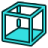 Bottom — [`Std_ViewBottom`](https://github.com/FreeCAD/FreeCAD/blob/b9609745048b/src/Gui/CommandView.cpp) | Sets the camera to the bottom view | Unspecified; retain original access |
| Box Zoom — [`Std_ViewBoxZoom`](https://github.com/FreeCAD/FreeCAD/blob/b9609745048b/src/Gui/CommandView.cpp) | Activates the box zoom tool | Unspecified; retain original access |
| New 3D View — [`Std_ViewCreate`](https://github.com/FreeCAD/FreeCAD/blob/b9609745048b/src/Gui/CommandView.cpp) | Opens a new 3D view window for the active document | Unspecified; retain original access |
| Dimetric — [`Std_ViewDimetric`](https://github.com/FreeCAD/FreeCAD/blob/b9609745048b/src/Gui/CommandView.cpp) | Sets the camera to the dimetric view | Unspecified; retain original access |
| Docked — [`Std_ViewDock`](https://github.com/FreeCAD/FreeCAD/blob/b9609745048b/src/Gui/CommandView.cpp) | Displays the active view either in fullscreen, undocked, or docked mode | Unspecified; retain original access |
| Document Window — [`Std_ViewDockUndockFullscreen`](https://github.com/FreeCAD/FreeCAD/blob/b9609745048b/src/Gui/CommandView.cpp) | Displays the active view either in fullscreen, undocked, or docked mode | Unspecified; retain original access |
| Inventor Example #1 — [`Std_ViewExample1`](https://github.com/FreeCAD/FreeCAD/blob/b9609745048b/src/Gui/CommandView.cpp) | Shows a 3D texture with manipulator | Unspecified; retain original access |
| Inventor Example #2 — [`Std_ViewExample2`](https://github.com/FreeCAD/FreeCAD/blob/b9609745048b/src/Gui/CommandView.cpp) | Shows spheres and drag-lights | Unspecified; retain original access |
| Inventor Example #3 — [`Std_ViewExample3`](https://github.com/FreeCAD/FreeCAD/blob/b9609745048b/src/Gui/CommandView.cpp) | Shows an animated texture | Unspecified; retain original access |
|  Fit All — [`Std_ViewFitAll`](https://github.com/FreeCAD/FreeCAD/blob/b9609745048b/src/Gui/CommandView.cpp) | Fits all content into the 3D view | Unspecified; retain original access |
|  Fit Selection — [`Std_ViewFitSelection`](https://github.com/FreeCAD/FreeCAD/blob/b9609745048b/src/Gui/CommandView.cpp) | Fits the selected content into the 3D view | Unspecified; retain original access |
|  Front — [`Std_ViewFront`](https://github.com/FreeCAD/FreeCAD/blob/b9609745048b/src/Gui/CommandView.cpp) | Sets the camera to the front view | Unspecified; retain original access |
| Fullscreen — [`Std_ViewFullscreen`](https://github.com/FreeCAD/FreeCAD/blob/b9609745048b/src/Gui/CommandView.cpp) | Displays the active view either in fullscreen, undocked, or docked mode | Unspecified; retain original access |
|  Isometric — [`Std_ViewGroup`](https://github.com/FreeCAD/FreeCAD/blob/b9609745048b/src/Gui/CommandView.cpp) | Native Isometric action; detailed behavior follows the original workbench help. | Unspecified; retain original access |
| Home — [`Std_ViewHome`](https://github.com/FreeCAD/FreeCAD/blob/b9609745048b/src/Gui/CommandView.cpp) | Sets the camera to the default home view | Unspecified; retain original access |
|  Isometric — [`Std_ViewIsometric`](https://github.com/FreeCAD/FreeCAD/blob/b9609745048b/src/Gui/CommandView.cpp) | Sets the camera to the isometric view | Unspecified; retain original access |
| Issue Camera Position — [`Std_ViewIvIssueCamPos`](https://github.com/FreeCAD/FreeCAD/blob/b9609745048b/src/Gui/CommandView.cpp) | Issues the camera position to the console and to a macro, to easily recall this position | Unspecified; retain original access |
|  Left — [`Std_ViewLeft`](https://github.com/FreeCAD/FreeCAD/blob/b9609745048b/src/Gui/CommandView.cpp) | Sets the camera to the left view | Unspecified; retain original access |
| Load Image… — [`Std_ViewLoadImage`](https://github.com/FreeCAD/FreeCAD/blob/b9609745048b/src/Gui/CommandView.cpp) | Loads an image | Unspecified; retain original access |
|  Rear — [`Std_ViewRear`](https://github.com/FreeCAD/FreeCAD/blob/b9609745048b/src/Gui/CommandView.cpp) | Sets the camera to the rear view | Unspecified; retain original access |
| Restore Saved Camera — [`Std_ViewRestoreCamera`](https://github.com/FreeCAD/FreeCAD/blob/b9609745048b/src/Gui/CommandView.cpp) | Restores the saved camera settings | Unspecified; retain original access |
|  Right — [`Std_ViewRight`](https://github.com/FreeCAD/FreeCAD/blob/b9609745048b/src/Gui/CommandView.cpp) | Sets the camera to the right view | Unspecified; retain original access |
| Rotate Left — [`Std_ViewRotateLeft`](https://github.com/FreeCAD/FreeCAD/blob/b9609745048b/src/Gui/CommandView.cpp) | Rotates the view by 90xc2xb0 counter-clockwise | Unspecified; retain original access |
| Rotates Right — [`Std_ViewRotateRight`](https://github.com/FreeCAD/FreeCAD/blob/b9609745048b/src/Gui/CommandView.cpp) | Rotates the view by 90xc2xb0 clockwise | Unspecified; retain original access |
| Save Current Camera — [`Std_ViewSaveCamera`](https://github.com/FreeCAD/FreeCAD/blob/b9609745048b/src/Gui/CommandView.cpp) | Saves the current camera settings | Unspecified; retain original access |
| Save Image… — [`Std_ViewScreenShot`](https://github.com/FreeCAD/FreeCAD/blob/b9609745048b/src/Gui/CommandView.cpp) | Creates a screenshot of the active view | Unspecified; retain original access |
| Status Bar — [`Std_ViewStatusBar`](https://github.com/FreeCAD/FreeCAD/blob/b9609745048b/src/Gui/CommandWindow.cpp) | Toggles the status bar | Unspecified; retain original access |
|  Top — [`Std_ViewTop`](https://github.com/FreeCAD/FreeCAD/blob/b9609745048b/src/Gui/CommandView.cpp) | Sets the camera to the top view | Unspecified; retain original access |
| Trimetric — [`Std_ViewTrimetric`](https://github.com/FreeCAD/FreeCAD/blob/b9609745048b/src/Gui/CommandView.cpp) | Sets the camera to the trimetric view | Unspecified; retain original access |
| Undocked — [`Std_ViewUndock`](https://github.com/FreeCAD/FreeCAD/blob/b9609745048b/src/Gui/CommandView.cpp) | Displays the active view either in fullscreen, undocked, or docked mode | Unspecified; retain original access |
| Zoom In — [`Std_ViewZoomIn`](https://github.com/FreeCAD/FreeCAD/blob/b9609745048b/src/Gui/CommandView.cpp) | Increases the zoom factor by a fixed amount | Unspecified; retain original access |
| Zoom Out — [`Std_ViewZoomOut`](https://github.com/FreeCAD/FreeCAD/blob/b9609745048b/src/Gui/CommandView.cpp) | Decreases the zoom factor by a fixed amount | Unspecified; retain original access |
|  What's This? — [`Std_WhatsThis`](https://github.com/FreeCAD/FreeCAD/blob/b9609745048b/src/Gui/CommandStd.cpp) | Opens the documentation for the selected command | Unspecified; retain original access |
| Choose Open Window — [`Std_Windows`](https://github.com/FreeCAD/FreeCAD/blob/b9609745048b/src/Gui/CommandWindow.cpp) | Displays the open windows | Unspecified; retain original access |
| Activate Window — [`Std_WindowsMenu`](https://github.com/FreeCAD/FreeCAD/blob/b9609745048b/src/Gui/CommandWindow.cpp) | Activates this window | Unspecified; retain original access |
|  Workbench — [`Std_Workbench`](https://github.com/FreeCAD/FreeCAD/blob/b9609745048b/src/Gui/CommandStd.cpp) | Switches between workbenches | Unspecified; retain original access |
### Assembly

| Button / command | Short description | FC Plus placement |
| --- | --- | --- |
| Activate Assembly — [`Assembly_ActivateAssembly`](https://github.com/FreeCAD/FreeCAD/blob/b9609745048b/src/Mod/Assembly/CommandCreateAssembly.py) | Sets an assembly as the active one for editing. | Unspecified; retain original access |
|  New Assembly — [`Assembly_CreateAssembly`](https://github.com/FreeCAD/FreeCAD/blob/b9609745048b/src/Mod/Assembly/CommandCreateAssembly.py) | Creates an assembly object in the current document, or in the current active assembly (if any). Limit of one root assembly per file. | Unspecified; retain original access |
|  Bill of Materials — [`Assembly_CreateBom`](https://github.com/FreeCAD/FreeCAD/blob/b9609745048b/src/Mod/Assembly/CommandCreateBom.py) | 
Creates a bill of materials of the current assembly. If an assembly is active, it will be a BOM of this assembly. Else it will be a BOM of the whole document.

The BOM object is a document object that stores the settings of your BOM. It is also a spreadsheet object so you can easily visualize the BOM. If you do not need the BOM object to be saved as a document object, you can simply export and cancel the task.

The columns 'Index', 'Name', 'File Name' and 'Quantity' are automatically generated on recompute. The 'Description' and custom columns are not overwritten.
 | Unspecified; retain original access |
|  Angle Joint — [`Assembly_CreateJointAngle`](https://github.com/FreeCAD/FreeCAD/blob/b9609745048b/src/Mod/Assembly/CommandCreateJoint.py) | Creates an angle joint that fixes the angle between the Z-axis of the selected coordinate systems | Unspecified; retain original access |
|  Ball Joint — [`Assembly_CreateJointBall`](https://github.com/FreeCAD/FreeCAD/blob/b9609745048b/src/Mod/Assembly/CommandCreateJoint.py) | Creates a ball joint that connects parts at a point, allowing unrestricted movement as long as the connection points remain in contact | Unspecified; retain original access |
|  Belt Joint — [`Assembly_CreateJointBelt`](https://github.com/FreeCAD/FreeCAD/blob/b9609745048b/src/Mod/Assembly/CommandCreateJoint.py) | 
Creates a belt joint that links 2 rotating objects together. They will have the same rotation direction.

Select the same coordinate systems as the revolute joints.
 | Unspecified; retain original access |
|  Cylindrical Joint — [`Assembly_CreateJointCylindrical`](https://github.com/FreeCAD/FreeCAD/blob/b9609745048b/src/Mod/Assembly/CommandCreateJoint.py) | Creates a cylindrical joint that allows rotation around and translation along a single axis between assembled parts | Unspecified; retain original access |
|  Distance Joint — [`Assembly_CreateJointDistance`](https://github.com/FreeCAD/FreeCAD/blob/b9609745048b/src/Mod/Assembly/CommandCreateJoint.py) | 
Creates a distance joint that fixes the distance between the selected objects

Creates one of several different joints based on the selection. For example, a distance of 0 between a plane and a cylinder creates a tangent joint. A distance of 0 between planes will make them co-planar.
 | Unspecified; retain original access |
|  Fixed Joint — [`Assembly_CreateJointFixed`](https://github.com/FreeCAD/FreeCAD/blob/b9609745048b/src/Mod/Assembly/CommandCreateJoint.py) | 
1 - If an assembly is active : Creates a joint statically locking two parts together, preventing any movement or rotation

2 - If a part is active: Positions sub-parts by matching selected coordinate systems. The second part selected will move.
 | Unspecified; retain original access |
|  Gears/Belt Joint — [`Assembly_CreateJointGearBelt`](https://github.com/FreeCAD/FreeCAD/blob/b9609745048b/src/Mod/Assembly/CommandCreateJoint.py) | 
Creates a gears or belt joint that links 2 rotating gears together

Select the same coordinate systems as the revolute joints.
 | Unspecified; retain original access |
|  Gears Joint — [`Assembly_CreateJointGears`](https://github.com/FreeCAD/FreeCAD/blob/b9609745048b/src/Mod/Assembly/CommandCreateJoint.py) | 
Creates a gears joint that links 2 rotating gears together. They will have inverse rotation direction.

Select the same coordinate systems as the revolute joints.
 | Unspecified; retain original access |
|  Parallel Joint — [`Assembly_CreateJointParallel`](https://github.com/FreeCAD/FreeCAD/blob/b9609745048b/src/Mod/Assembly/CommandCreateJoint.py) | Creates a parallel joint that makes the Z-axis of the selected coordinate systems parallel | Unspecified; retain original access |
|  Perpendicular Joint — [`Assembly_CreateJointPerpendicular`](https://github.com/FreeCAD/FreeCAD/blob/b9609745048b/src/Mod/Assembly/CommandCreateJoint.py) | Creates a perpendicular joint that makes the Z-axis of the selected coordinate systems perpendicular | Unspecified; retain original access |
|  Rack and Pinion Joint — [`Assembly_CreateJointRackPinion`](https://github.com/FreeCAD/FreeCAD/blob/b9609745048b/src/Mod/Assembly/CommandCreateJoint.py) | 
Creates a rack and pinion joint that links a part with a slider joint to a part with a revolute joint

Select the same coordinate systems as the revolute and slider joints. The pitch radius defines the movement ratio between the rack and the pinion.
 | Unspecified; retain original access |
|  Revolute Joint — [`Assembly_CreateJointRevolute`](https://github.com/FreeCAD/FreeCAD/blob/b9609745048b/src/Mod/Assembly/CommandCreateJoint.py) | Creates a revolute joint allowing rotation around a single axis between selected parts | Unspecified; retain original access |
|  Create Rigid Group — [`Assembly_CreateJointRigidGroup`](https://github.com/FreeCAD/FreeCAD/blob/b9609745048b/src/Mod/Assembly/CommandCreateJoint.py) | 
Create a rigid group.

Creates a rigid group that permanently locks the selected components together.
 | Unspecified; retain original access |
|  Screw Joint — [`Assembly_CreateJointScrew`](https://github.com/FreeCAD/FreeCAD/blob/b9609745048b/src/Mod/Assembly/CommandCreateJoint.py) | 
Creates a screw joint that links a part with a slider joint to a part with a revolute joint

Select the same coordinate systems as the revolute and slider joints. The pitch radius defines the movement ratio between the rotating screw and the sliding part.
 | Unspecified; retain original access |
|  Slider Joint — [`Assembly_CreateJointSlider`](https://github.com/FreeCAD/FreeCAD/blob/b9609745048b/src/Mod/Assembly/CommandCreateJoint.py) | Creates a slider joint that allows linear movement along a single axis, but restricts rotation between selected parts | Unspecified; retain original access |
|  Simulation — [`Assembly_CreateSimulation`](https://github.com/FreeCAD/FreeCAD/blob/b9609745048b/src/Mod/Assembly/CommandCreateSimulation.py) | Creates a new simulation of the current assembly | Unspecified; retain original access |
|  Snapshot — [`Assembly_CreateSnapshot`](https://github.com/FreeCAD/FreeCAD/blob/b9609745048b/src/Mod/Assembly/CommandCreateSnapshot.py) | Captures the current assembly state (placements and visibility). Double-clicking the Snapshot object restores the assembly to that state. | Unspecified; retain original access |
|  Exploded View — [`Assembly_CreateView`](https://github.com/FreeCAD/FreeCAD/blob/b9609745048b/src/Mod/Assembly/CommandCreateView.py) | Creates an exploded view of the current assembly | Unspecified; retain original access |
| Export ASMT File — [`Assembly_ExportASMT`](https://github.com/FreeCAD/FreeCAD/blob/b9609745048b/src/Mod/Assembly/CommandExportASMT.py) | Export currently active assembly as a ASMT file. | Unspecified; retain original access |
|  Insert Component — [`Assembly_Insert`](https://github.com/FreeCAD/FreeCAD/blob/b9609745048b/src/Mod/Assembly/CommandInsertLink.py) | Native Insert Component action; detailed behavior follows the original workbench help. | Unspecified; retain original access |
|  Insert Component — [`Assembly_InsertLink`](https://github.com/FreeCAD/FreeCAD/blob/b9609745048b/src/Mod/Assembly/CommandInsertLink.py) | Native Insert Component action; detailed behavior follows the original workbench help. | Unspecified; retain original access |
|  New Part — [`Assembly_InsertNewPart`](https://github.com/FreeCAD/FreeCAD/blob/b9609745048b/src/Mod/Assembly/CommandInsertNewPart.py) | Insert a new part into the active assembly. The new part's origin can be positioned in the assembly. | Unspecified; retain original access |
| Go to Linked Assembly — [`Assembly_LinkSelectLinked`](https://github.com/FreeCAD/FreeCAD/blob/b9609745048b/src/Mod/Assembly/Gui/Commands.cpp) | Selects the linked assembly and switches to its original document | Unspecified; retain original access |
| Select Components With DoFs — [`Assembly_SelectComponentsWithDoFs`](https://github.com/FreeCAD/FreeCAD/blob/b9609745048b/src/Mod/Assembly/Gui/Commands.cpp) | Selects unconstrained components in the active assembly | Unspecified; retain original access |
| Select Conflicting Constraints — [`Assembly_SelectConflictingConstraints`](https://github.com/FreeCAD/FreeCAD/blob/b9609745048b/src/Mod/Assembly/Gui/Commands.cpp) | Selects conflicting joints in the active assembly | Unspecified; retain original access |
| Select Component Joints — [`Assembly_SelectJointsOfComponent`](https://github.com/FreeCAD/FreeCAD/blob/b9609745048b/src/Mod/Assembly/Gui/Commands.cpp) | Selects all joints referencing the selected component | Unspecified; retain original access |
| Select Malformed Constraints — [`Assembly_SelectMalformedConstraints`](https://github.com/FreeCAD/FreeCAD/blob/b9609745048b/src/Mod/Assembly/Gui/Commands.cpp) | Selects malformed joints in the active assembly | Unspecified; retain original access |
| Select Redundant Constraints — [`Assembly_SelectRedundantConstraints`](https://github.com/FreeCAD/FreeCAD/blob/b9609745048b/src/Mod/Assembly/Gui/Commands.cpp) | Selects redundant joints in the active assembly | Unspecified; retain original access |
|  Solve Assembly — [`Assembly_SolveAssembly`](https://github.com/FreeCAD/FreeCAD/blob/b9609745048b/src/Mod/Assembly/CommandSolveAssembly.py) | Solves the currently active assembly. | Unspecified; retain original access |
|  Toggle Grounded — [`Assembly_ToggleGrounded`](https://github.com/FreeCAD/FreeCAD/blob/b9609745048b/src/Mod/Assembly/CommandCreateJoint.py) | 
Toggles the grounding of a part.

Grounding a part permanently locks its position in the assembly, preventing any movement or rotation. | Unspecified; retain original access |
|  Circular Link Array — [`Part_LinkArrays`](https://github.com/FreeCAD/FreeCAD/blob/b9609745048b/src/Mod/Assembly/InitGui.py) | Native Circular Link Array action; detailed behavior follows the original workbench help. | Unspecified; retain original access |
### BIM

| Button / command | Short description | FC Plus placement |
| --- | --- | --- |
| Add Component — [`Arch_Add`](https://github.com/FreeCAD/FreeCAD/blob/b9609745048b/src/Mod/BIM/bimcommands/BimArchUtils.py) | Adds the selected components to the active object | Unspecified; retain original access |
| Axis — [`Arch_Axis`](https://github.com/FreeCAD/FreeCAD/blob/b9609745048b/src/Mod/BIM/bimcommands/BimAxis.py) | Creates a set of axes | Unspecified; retain original access |
| Axis System — [`Arch_AxisSystem`](https://github.com/FreeCAD/FreeCAD/blob/b9609745048b/src/Mod/BIM/bimcommands/BimAxis.py) | Creates an axis system from a set of axes | Unspecified; retain original access |
| Axis Tools — [`Arch_AxisTools`](https://github.com/FreeCAD/FreeCAD/blob/b9609745048b/src/Mod/BIM/bimcommands/BimAxis.py) | Axis tools | Unspecified; retain original access |
| Building — [`Arch_Building`](https://github.com/FreeCAD/FreeCAD/blob/b9609745048b/src/Mod/BIM/bimcommands/BimBuildingPart.py) | Creates a building object | Unspecified; retain original access |
| Check — [`Arch_Check`](https://github.com/FreeCAD/FreeCAD/blob/b9609745048b/src/Mod/BIM/bimcommands/BimArchUtils.py) | Checks the selected objects for problems | Unspecified; retain original access |
| Clone Component — [`Arch_CloneComponent`](https://github.com/FreeCAD/FreeCAD/blob/b9609745048b/src/Mod/BIM/bimcommands/BimArchUtils.py) | Clones an object as an undefined architectural component | Unspecified; retain original access |
| Close Holes — [`Arch_CloseHoles`](https://github.com/FreeCAD/FreeCAD/blob/b9609745048b/src/Mod/BIM/bimcommands/BimArchUtils.py) | Closes holes in open shapes, turning them into solids | Unspecified; retain original access |
| Component — [`Arch_Component`](https://github.com/FreeCAD/FreeCAD/blob/b9609745048b/src/Mod/BIM/bimcommands/BimArchUtils.py) | Creates an undefined architectural component | Unspecified; retain original access |
| Curtain Wall — [`Arch_CurtainWall`](https://github.com/FreeCAD/FreeCAD/blob/b9609745048b/src/Mod/BIM/bimcommands/BimCurtainwall.py) | Creates a curtain wall object from selected line or from scratch | Unspecified; retain original access |
| Cut With Plane — [`Arch_CutPlane`](https://github.com/FreeCAD/FreeCAD/blob/b9609745048b/src/Mod/BIM/bimcommands/BimCutPlane.py) | Cuts an object with a plane | Unspecified; retain original access |
| Equipment — [`Arch_Equipment`](https://github.com/FreeCAD/FreeCAD/blob/b9609745048b/src/Mod/BIM/bimcommands/BimEquipment.py) | Creates an equipment from a selected object (Part or Mesh) | Unspecified; retain original access |
| Fence — [`Arch_Fence`](https://github.com/FreeCAD/FreeCAD/blob/b9609745048b/src/Mod/BIM/bimcommands/BimFence.py) | Creates a fence object from a selected section, post and path | Unspecified; retain original access |
| Level — [`Arch_Floor`](https://github.com/FreeCAD/FreeCAD/blob/b9609745048b/src/Mod/BIM/ArchFloor.py) | Creates a Building Part object that represents a level, including selected objects | Unspecified; retain original access |
| Frame — [`Arch_Frame`](https://github.com/FreeCAD/FreeCAD/blob/b9609745048b/src/Mod/BIM/bimcommands/BimFrame.py) | Creates a frame object from a planar 2D object (the extrusion path(s)) and a profile. Make sure objects are selected in that order. | Unspecified; retain original access |
| Grid — [`Arch_Grid`](https://github.com/FreeCAD/FreeCAD/blob/b9609745048b/src/Mod/BIM/bimcommands/BimAxis.py) | Creates a customizable grid object | Unspecified; retain original access |
| New IFC Spreadsheet — [`Arch_IfcSpreadsheet`](https://github.com/FreeCAD/FreeCAD/blob/b9609745048b/src/Mod/BIM/bimcommands/BimArchUtils.py) | Creates a spreadsheet to store IFC properties of an object | Unspecified; retain original access |
| Level — [`Arch_Level`](https://github.com/FreeCAD/FreeCAD/blob/b9609745048b/src/Mod/BIM/bimcommands/BimBuildingPart.py) | Creates a building part object that represents a level | Unspecified; retain original access |
| Material — [`Arch_Material`](https://github.com/FreeCAD/FreeCAD/blob/b9609745048b/src/Mod/BIM/bimcommands/BimMaterial.py) | Creates or edits the material definition of a selected object. | Unspecified; retain original access |
| Material Tools — [`Arch_MaterialTools`](https://github.com/FreeCAD/FreeCAD/blob/b9609745048b/src/Mod/BIM/bimcommands/BimMaterial.py) | Material tools | Unspecified; retain original access |
| Merge Walls — [`Arch_MergeWalls`](https://github.com/FreeCAD/FreeCAD/blob/b9609745048b/src/Mod/BIM/bimcommands/BimArchUtils.py) | Merges the selected walls, if possible | Unspecified; retain original access |
| Mesh to Shape — [`Arch_MeshToShape`](https://github.com/FreeCAD/FreeCAD/blob/b9609745048b/src/Mod/BIM/bimcommands/BimArchUtils.py) | Turns selected meshes into Part shape objects | Unspecified; retain original access |
| Multi-Material — [`Arch_MultiMaterial`](https://github.com/FreeCAD/FreeCAD/blob/b9609745048b/src/Mod/BIM/bimcommands/BimMaterial.py) | Creates or edits multi-materials | Unspecified; retain original access |
| Nest — [`Arch_Nest`](https://github.com/FreeCAD/FreeCAD/blob/b9609745048b/src/Mod/BIM/bimcommands/BimPanel.py) | Nests a series of selected shapes in a container | Unspecified; retain original access |
| Panel — [`Arch_Panel`](https://github.com/FreeCAD/FreeCAD/blob/b9609745048b/src/Mod/BIM/bimcommands/BimPanel.py) | Creates a panel object from scratch or from a selected object (sketch, wire, face or solid) | Unspecified; retain original access |
| Panel Tools — [`Arch_PanelTools`](https://github.com/FreeCAD/FreeCAD/blob/b9609745048b/src/Mod/BIM/bimcommands/BimPanel.py) | Panel tools | Unspecified; retain original access |
| Panel Cut — [`Arch_Panel_Cut`](https://github.com/FreeCAD/FreeCAD/blob/b9609745048b/src/Mod/BIM/bimcommands/BimPanel.py) | Creates 2D views of selected panels | Unspecified; retain original access |
| Panel Sheet — [`Arch_Panel_Sheet`](https://github.com/FreeCAD/FreeCAD/blob/b9609745048b/src/Mod/BIM/bimcommands/BimPanel.py) | Creates a 2D sheet which can contain panel cuts | Unspecified; retain original access |
| Pipe — [`Arch_Pipe`](https://github.com/FreeCAD/FreeCAD/blob/b9609745048b/src/Mod/BIM/bimcommands/BimPipe.py) | Creates a pipe object from a given wire or line | Unspecified; retain original access |
| Connector — [`Arch_PipeConnector`](https://github.com/FreeCAD/FreeCAD/blob/b9609745048b/src/Mod/BIM/bimcommands/BimPipe.py) | Creates a connector between 2 or 3 selected pipes | Unspecified; retain original access |
| Pipe Tools — [`Arch_PipeTools`](https://github.com/FreeCAD/FreeCAD/blob/b9609745048b/src/Mod/BIM/bimcommands/BimPipe.py) | Pipe tools | Unspecified; retain original access |
| Profile — [`Arch_Profile`](https://github.com/FreeCAD/FreeCAD/blob/b9609745048b/src/Mod/BIM/bimcommands/BimProfile.py) | Creates a profile | Unspecified; retain original access |
| Custom Rebar — [`Arch_Rebar`](https://github.com/FreeCAD/FreeCAD/blob/b9609745048b/src/Mod/BIM/bimcommands/BimRebar.py) | Creates a reinforcement bar from the selected face of solid object and/or a sketch | Unspecified; retain original access |
| Reinforcement Tools — [`Arch_RebarTools`](https://github.com/FreeCAD/FreeCAD/blob/b9609745048b/src/Mod/BIM/InitGui.py) | Reinforcement tools | Unspecified; retain original access |
| External Reference — [`Arch_Reference`](https://github.com/FreeCAD/FreeCAD/blob/b9609745048b/src/Mod/BIM/bimcommands/BimReference.py) | Creates an external reference object | Unspecified; retain original access |
| Remove Component — [`Arch_Remove`](https://github.com/FreeCAD/FreeCAD/blob/b9609745048b/src/Mod/BIM/bimcommands/BimArchUtils.py) | Removes the selected components from their parents, or creates a hole in a component | Unspecified; retain original access |
| Remove Shape From BIM — [`Arch_RemoveShape`](https://github.com/FreeCAD/FreeCAD/blob/b9609745048b/src/Mod/BIM/bimcommands/BimArchUtils.py) | Removes cubic shapes from BIM components | Unspecified; retain original access |
| Roof — [`Arch_Roof`](https://github.com/FreeCAD/FreeCAD/blob/b9609745048b/src/Mod/BIM/bimcommands/BimRoof.py) | Creates a roof object from the selected wire. | Unspecified; retain original access |
| Schedule — [`Arch_Schedule`](https://github.com/FreeCAD/FreeCAD/blob/b9609745048b/src/Mod/BIM/bimcommands/BimSchedule.py) | Creates a schedule to collect data from the model | Unspecified; retain original access |
| Section Plane — [`Arch_SectionPlane`](https://github.com/FreeCAD/FreeCAD/blob/b9609745048b/src/Mod/BIM/bimcommands/BimSectionPlane.py) | Creates a section plane object, including the selected objects | Unspecified; retain original access |
| Select Non-Manifold Meshes — [`Arch_SelectNonSolidMeshes`](https://github.com/FreeCAD/FreeCAD/blob/b9609745048b/src/Mod/BIM/bimcommands/BimArchUtils.py) | Selects all non-manifold meshes from the document or from the selected groups | Unspecified; retain original access |
| Site — [`Arch_Site`](https://github.com/FreeCAD/FreeCAD/blob/b9609745048b/src/Mod/BIM/bimcommands/BimSite.py) | Creates a site including selected objects | Unspecified; retain original access |
| Space — [`Arch_Space`](https://github.com/FreeCAD/FreeCAD/blob/b9609745048b/src/Mod/BIM/bimcommands/BimSpace.py) | Creates a space object from selected boundary objects | Unspecified; retain original access |
| Split Mesh — [`Arch_SplitMesh`](https://github.com/FreeCAD/FreeCAD/blob/b9609745048b/src/Mod/BIM/bimcommands/BimArchUtils.py) | Splits selected meshes into independent components | Unspecified; retain original access |
| Stairs — [`Arch_Stairs`](https://github.com/FreeCAD/FreeCAD/blob/b9609745048b/src/Mod/BIM/bimcommands/BimStairs.py) | Creates a flight of stairs | Unspecified; retain original access |
| Structural System — [`Arch_StructuralSystem`](https://github.com/FreeCAD/FreeCAD/blob/b9609745048b/src/Mod/BIM/ArchStructure.py) | Create a structural system from a selected structure and axis | Unspecified; retain original access |
| Structure Tools — [`Arch_StructureTools`](https://github.com/FreeCAD/FreeCAD/blob/b9609745048b/src/Mod/BIM/ArchStructure.py) | Structure tools | Unspecified; retain original access |
| Multiple Structures — [`Arch_StructuresFromSelection`](https://github.com/FreeCAD/FreeCAD/blob/b9609745048b/src/Mod/BIM/ArchStructure.py) | Creates multiple BIM Structures from a selected base, using each selected edge as an extrusion path | Unspecified; retain original access |
| Survey — [`Arch_Survey`](https://github.com/FreeCAD/FreeCAD/blob/b9609745048b/src/Mod/BIM/bimcommands/BimArchUtils.py) | Starts survey | Unspecified; retain original access |
| Toggle IFC B-Rep Flag — [`Arch_ToggleIfcBrepFlag`](https://github.com/FreeCAD/FreeCAD/blob/b9609745048b/src/Mod/BIM/bimcommands/BimArchUtils.py) | Forces an object to be exported as B-rep or not | Unspecified; retain original access |
| Toggle Subcomponents — [`Arch_ToggleSubs`](https://github.com/FreeCAD/FreeCAD/blob/b9609745048b/src/Mod/BIM/bimcommands/BimArchUtils.py) | Shows or hides the subcomponents of this object | Unspecified; retain original access |
| Truss — [`Arch_Truss`](https://github.com/FreeCAD/FreeCAD/blob/b9609745048b/src/Mod/BIM/bimcommands/BimTruss.py) | Creates a truss object from the selected line or from scratch | Unspecified; retain original access |
| Wall — [`Arch_Wall`](https://github.com/FreeCAD/FreeCAD/blob/b9609745048b/src/Mod/BIM/bimcommands/BimWall.py) | Creates a wall object from scratch or from a selected object (wire, face or solid) | Unspecified; retain original access |
| Window — [`Arch_Window`](https://github.com/FreeCAD/FreeCAD/blob/b9609745048b/src/Mod/BIM/bimcommands/BimWindow.py) | Creates a window object from a selected object (wire, rectangle or sketch) | Unspecified; retain original access |
| BIM_ArcTools — [`BIM_ArcTools`](https://github.com/FreeCAD/FreeCAD/blob/b9609745048b/src/Mod/BIM/InitGui.py) | Native BIM_ArcTools action; detailed behavior follows the original workbench help. | Unspecified; retain original access |
| BIM_ArrayTools — [`BIM_ArrayTools`](https://github.com/FreeCAD/FreeCAD/blob/b9609745048b/src/Mod/BIM/InitGui.py) | Native BIM_ArrayTools action; detailed behavior follows the original workbench help. | Unspecified; retain original access |
| BIM_AxisTools — [`BIM_AxisTools`](https://github.com/FreeCAD/FreeCAD/blob/b9609745048b/src/Mod/BIM/InitGui.py) | Native BIM_AxisTools action; detailed behavior follows the original workbench help. | Unspecified; retain original access |
| Toggle Background — [`BIM_Background`](https://github.com/FreeCAD/FreeCAD/blob/b9609745048b/src/Mod/BIM/bimcommands/BimBackground.py) | Toggles the 3D View background between simple and gradient | Unspecified; retain original access |
| Beam — [`BIM_Beam`](https://github.com/FreeCAD/FreeCAD/blob/b9609745048b/src/Mod/BIM/bimcommands/BimBeam.py) | Creates a beam between two points | Unspecified; retain original access |
| BIM_BooleanTools — [`BIM_BooleanTools`](https://github.com/FreeCAD/FreeCAD/blob/b9609745048b/src/Mod/BIM/InitGui.py) | Native BIM_BooleanTools action; detailed behavior follows the original workbench help. | Unspecified; retain original access |
| Box — [`BIM_Box`](https://github.com/FreeCAD/FreeCAD/blob/b9609745048b/src/Mod/BIM/bimcommands/BimBox.py) | Graphically creates a generic box in the current document | Unspecified; retain original access |
| Shape Builder — [`BIM_Builder`](https://github.com/FreeCAD/FreeCAD/blob/b9609745048b/src/Mod/BIM/bimcommands/BimBuilder.py) | Advanced utility to create shapes | Unspecified; retain original access |
| Manage Classification — [`BIM_Classification`](https://github.com/FreeCAD/FreeCAD/blob/b9609745048b/src/Mod/BIM/bimcommands/BimClassification.py) | Manages classification systems and apply classification to objects | Unspecified; retain original access |
| Clone — [`BIM_Clone`](https://github.com/FreeCAD/FreeCAD/blob/b9609745048b/src/Mod/BIM/bimcommands/BimClone.py) | Clones selected objects to another location | Unspecified; retain original access |
| BIM_CloneTools — [`BIM_CloneTools`](https://github.com/FreeCAD/FreeCAD/blob/b9609745048b/src/Mod/BIM/InitGui.py) | Native BIM_CloneTools action; detailed behavior follows the original workbench help. | Unspecified; retain original access |
| Column — [`BIM_Column`](https://github.com/FreeCAD/FreeCAD/blob/b9609745048b/src/Mod/BIM/bimcommands/BimColumn.py) | Creates a column at a specified location | Unspecified; retain original access |
| Intersection — [`BIM_Common`](https://github.com/FreeCAD/FreeCAD/blob/b9609745048b/src/Mod/BIM/bimcommands/BimCommon.py) | Creates an intersection of two shapes | Unspecified; retain original access |
| Compound — [`BIM_Compound`](https://github.com/FreeCAD/FreeCAD/blob/b9609745048b/src/Mod/BIM/bimcommands/BimCompound.py) | Creates a compound of several shapes | Unspecified; retain original access |
| Convert to BIM — [`BIM_Convert`](https://github.com/FreeCAD/FreeCAD/blob/b9609745048b/src/Mod/BIM/bimcommands/BimConvert.py) | Converts any object to a BIM component | Unspecified; retain original access |
| Copy — [`BIM_Copy`](https://github.com/FreeCAD/FreeCAD/blob/b9609745048b/src/Mod/BIM/bimcommands/BimCopy.py) | Copies selected objects to another location | Unspecified; retain original access |
| Covering — [`BIM_Covering`](https://github.com/FreeCAD/FreeCAD/blob/b9609745048b/src/Mod/BIM/bimcommands/BimCovering.py) | Creates a covering (floor finish, cladding) on a selected face | Unspecified; retain original access |
| BIM_Create2DViews — [`BIM_Create2DViews`](https://github.com/FreeCAD/FreeCAD/blob/b9609745048b/src/Mod/BIM/InitGui.py) | Native BIM_Create2DViews action; detailed behavior follows the original workbench help. | Unspecified; retain original access |
| Difference — [`BIM_Cut`](https://github.com/FreeCAD/FreeCAD/blob/b9609745048b/src/Mod/BIM/bimcommands/BimCut.py) | Creates a difference between two shapes | Unspecified; retain original access |
| IFC Shape Diff — [`BIM_Diff`](https://github.com/FreeCAD/FreeCAD/blob/b9609745048b/src/Mod/BIM/bimcommands/BimDiff.py) | Shows the difference between two IFC-based documents | Unspecified; retain original access |
| Aligned Dimension — [`BIM_DimensionAligned`](https://github.com/FreeCAD/FreeCAD/blob/b9609745048b/src/Mod/BIM/bimcommands/BimDimensions.py) | Creates an aligned dimension | Unspecified; retain original access |
| Horizontal Dimension — [`BIM_DimensionHorizontal`](https://github.com/FreeCAD/FreeCAD/blob/b9609745048b/src/Mod/BIM/bimcommands/BimDimensions.py) | Creates an horizontal dimension | Unspecified; retain original access |
| Vertical Dimension — [`BIM_DimensionVertical`](https://github.com/FreeCAD/FreeCAD/blob/b9609745048b/src/Mod/BIM/bimcommands/BimDimensions.py) | Creates a vertical dimension | Unspecified; retain original access |
| Door — [`BIM_Door`](https://github.com/FreeCAD/FreeCAD/blob/b9609745048b/src/Mod/BIM/bimcommands/BimDoor.py) | Places a door at a given location | Unspecified; retain original access |
| 2D Drawing — [`BIM_DrawingView`](https://github.com/FreeCAD/FreeCAD/blob/b9609745048b/src/Mod/BIM/bimcommands/BimDrawingView.py) | Creates a drawing container to contain elements of a 2D view | Unspecified; retain original access |
| Empty Trash — [`BIM_EmptyTrash`](https://github.com/FreeCAD/FreeCAD/blob/b9609745048b/src/Mod/BIM/bimcommands/BimEmptyTrash.py) | Deletes all objects from the trash bin that are not used by any other | Unspecified; retain original access |
| BIM Examples — [`BIM_Examples`](https://github.com/FreeCAD/FreeCAD/blob/b9609745048b/src/Mod/BIM/bimcommands/BimExamples.py) | Download examples of BIM files made with FreeCAD | Unspecified; retain original access |
| Extrude — [`BIM_Extrude`](https://github.com/FreeCAD/FreeCAD/blob/b9609745048b/src/Mod/BIM/bimcommands/BimExtrude.py) | Extrudes a selected 2D shape | Unspecified; retain original access |
| Extrude Face — [`BIM_ExtrudeFace`](https://github.com/FreeCAD/FreeCAD/blob/b9609745048b/src/Mod/BIM/bimcommands/BimExtrudeFace.py) | Extrudes a selected face into a solid | Unspecified; retain original access |
| Union — [`BIM_Fuse`](https://github.com/FreeCAD/FreeCAD/blob/b9609745048b/src/Mod/BIM/bimcommands/BimFuse.py) | Creates a union of several shapes | Unspecified; retain original access |
| BIM_GenericTools — [`BIM_GenericTools`](https://github.com/FreeCAD/FreeCAD/blob/b9609745048b/src/Mod/BIM/InitGui.py) | Native BIM_GenericTools action; detailed behavior follows the original workbench help. | Unspecified; retain original access |
| Glue — [`BIM_Glue`](https://github.com/FreeCAD/FreeCAD/blob/b9609745048b/src/Mod/BIM/bimcommands/BimGlue.py) | Joins selected shapes into one non-parametric shape | Unspecified; retain original access |
| BIM Help — [`BIM_Help`](https://github.com/FreeCAD/FreeCAD/blob/b9609745048b/src/Mod/BIM/bimcommands/BimHelp.py) | Opens the BIM help page on the FreeCAD documentation website | Unspecified; retain original access |
| Manage IFC Elements — [`BIM_IfcElements`](https://github.com/FreeCAD/FreeCAD/blob/b9609745048b/src/Mod/BIM/bimcommands/BimIfcElements.py) | Manages how the different elements of the BIM project will be exported to IFC | Unspecified; retain original access |
| IFC Explorer — [`BIM_IfcExplorer`](https://github.com/FreeCAD/FreeCAD/blob/b9609745048b/src/Mod/BIM/bimcommands/BimIfcExplorer.py) | Opens the IFC explorer utility | Unspecified; retain original access |
| BIM_IfcManageTools — [`BIM_IfcManageTools`](https://github.com/FreeCAD/FreeCAD/blob/b9609745048b/src/Mod/BIM/InitGui.py) | Native BIM_IfcManageTools action; detailed behavior follows the original workbench help. | Unspecified; retain original access |
| Manage IFC Properties — [`BIM_IfcProperties`](https://github.com/FreeCAD/FreeCAD/blob/b9609745048b/src/Mod/BIM/bimcommands/BimIfcProperties.py) | Manages the different IFC properties of the BIM objects | Unspecified; retain original access |
| Manage IFC Quantities — [`BIM_IfcQuantities`](https://github.com/FreeCAD/FreeCAD/blob/b9609745048b/src/Mod/BIM/bimcommands/BimIfcQuantities.py) | Manages how the quantities of different elements of the BIM project will be exported to IFC | Unspecified; retain original access |
| Image Plane — [`BIM_ImagePlane`](https://github.com/FreeCAD/FreeCAD/blob/b9609745048b/src/Mod/BIM/bimcommands/BimImagePlane.py) | Creates a plane from an image | Unspecified; retain original access |
| Manage Layers — [`BIM_Layers`](https://github.com/FreeCAD/FreeCAD/blob/b9609745048b/src/Mod/BIM/bimcommands/BimLayers.py) | Sets/modifies the different layers of your BIM project | Unspecified; retain original access |
| Leader — [`BIM_Leader`](https://github.com/FreeCAD/FreeCAD/blob/b9609745048b/src/Mod/BIM/bimcommands/BimLeader.py) | Creates a polyline with an arrow at its endpoint | Unspecified; retain original access |
| Objects Library — [`BIM_Library`](https://github.com/FreeCAD/FreeCAD/blob/b9609745048b/src/Mod/BIM/bimcommands/BimLibrary.py) | Opens the objects library | Unspecified; retain original access |
| Make Link — [`BIM_LinkMake`](https://github.com/FreeCAD/FreeCAD/blob/b9609745048b/src/Mod/BIM/bimcommands/BimLink.py) | Creates a Link to the selected object and immediately enables moving it | Unspecified; retain original access |
| Material — [`BIM_Material`](https://github.com/FreeCAD/FreeCAD/blob/b9609745048b/src/Mod/BIM/bimcommands/BimMaterial.py) | Sets or creates a material for selected objects | Unspecified; retain original access |
| Move View — [`BIM_MoveView`](https://github.com/FreeCAD/FreeCAD/blob/b9609745048b/src/Mod/BIM/bimcommands/BimMoveView.py) | Moves this view to an existing page | Unspecified; retain original access |
| Nudge Down — [`BIM_Nudge_Down`](https://github.com/FreeCAD/FreeCAD/blob/b9609745048b/src/Mod/BIM/bimcommands/BimNudge.py) | Native Nudge Down action; detailed behavior follows the original workbench help. | Unspecified; retain original access |
| Nudge Extend — [`BIM_Nudge_Extend`](https://github.com/FreeCAD/FreeCAD/blob/b9609745048b/src/Mod/BIM/bimcommands/BimNudge.py) | Native Nudge Extend action; detailed behavior follows the original workbench help. | Unspecified; retain original access |
| Nudge Left — [`BIM_Nudge_Left`](https://github.com/FreeCAD/FreeCAD/blob/b9609745048b/src/Mod/BIM/bimcommands/BimNudge.py) | Native Nudge Left action; detailed behavior follows the original workbench help. | Unspecified; retain original access |
| Nudge Right — [`BIM_Nudge_Right`](https://github.com/FreeCAD/FreeCAD/blob/b9609745048b/src/Mod/BIM/bimcommands/BimNudge.py) | Native Nudge Right action; detailed behavior follows the original workbench help. | Unspecified; retain original access |
| Nudge Rotate Left — [`BIM_Nudge_RotateLeft`](https://github.com/FreeCAD/FreeCAD/blob/b9609745048b/src/Mod/BIM/bimcommands/BimNudge.py) | Native Nudge Rotate Left action; detailed behavior follows the original workbench help. | Unspecified; retain original access |
| Nudge Rotate Right — [`BIM_Nudge_RotateRight`](https://github.com/FreeCAD/FreeCAD/blob/b9609745048b/src/Mod/BIM/bimcommands/BimNudge.py) | Native Nudge Rotate Right action; detailed behavior follows the original workbench help. | Unspecified; retain original access |
| Nudge Shrink — [`BIM_Nudge_Shrink`](https://github.com/FreeCAD/FreeCAD/blob/b9609745048b/src/Mod/BIM/bimcommands/BimNudge.py) | Native Nudge Shrink action; detailed behavior follows the original workbench help. | Unspecified; retain original access |
| Nudge Switch — [`BIM_Nudge_Switch`](https://github.com/FreeCAD/FreeCAD/blob/b9609745048b/src/Mod/BIM/bimcommands/BimNudge.py) | Native Nudge Switch action; detailed behavior follows the original workbench help. | Unspecified; retain original access |
| Nudge Up — [`BIM_Nudge_Up`](https://github.com/FreeCAD/FreeCAD/blob/b9609745048b/src/Mod/BIM/bimcommands/BimNudge.py) | Native Nudge Up action; detailed behavior follows the original workbench help. | Unspecified; retain original access |
| 2D Offset — [`BIM_Offset2D`](https://github.com/FreeCAD/FreeCAD/blob/b9609745048b/src/Mod/BIM/bimcommands/BimOffset.py) | Utility to offset planar shapes | Unspecified; retain original access |
| BIM_OffsetTools — [`BIM_OffsetTools`](https://github.com/FreeCAD/FreeCAD/blob/b9609745048b/src/Mod/BIM/InitGui.py) | Native BIM_OffsetTools action; detailed behavior follows the original workbench help. | Unspecified; retain original access |
| Preflight Checks — [`BIM_Preflight`](https://github.com/FreeCAD/FreeCAD/blob/b9609745048b/src/Mod/BIM/bimcommands/BimPreflight.py) | Checks several characteristics of this model before exporting to IFC | Unspecified; retain original access |
| IFC Project — [`BIM_Project`](https://github.com/FreeCAD/FreeCAD/blob/b9609745048b/src/Mod/BIM/bimcommands/BimProject.py) | Creates an empty NativeIFC project | Unspecified; retain original access |
| Setup Project — [`BIM_ProjectManager`](https://github.com/FreeCAD/FreeCAD/blob/b9609745048b/src/Mod/BIM/bimcommands/BimProjectManager.py) | Creates or manages a BIM project | Unspecified; retain original access |
| Re-Extrude — [`BIM_Reextrude`](https://github.com/FreeCAD/FreeCAD/blob/b9609745048b/src/Mod/BIM/bimcommands/BimReextrude.py) | Recreates an extruded structure from a selected face | Unspecified; retain original access |
| Reorder Children — [`BIM_Reorder`](https://github.com/FreeCAD/FreeCAD/blob/b9609745048b/src/Mod/BIM/bimcommands/BimReorder.py) | Reorders children of the selected object | Unspecified; retain original access |
| Report — [`BIM_Report`](https://github.com/FreeCAD/FreeCAD/blob/b9609745048b/src/Mod/BIM/bimcommands/BimReport.py) | Create a new BIM Report to query model data with SQL | Unspecified; retain original access |
| BIM_ReportTools — [`BIM_ReportTools`](https://github.com/FreeCAD/FreeCAD/blob/b9609745048b/src/Mod/BIM/InitGui.py) | Native BIM_ReportTools action; detailed behavior follows the original workbench help. | Unspecified; retain original access |
| Reset Colors — [`BIM_ResetCloneColors`](https://github.com/FreeCAD/FreeCAD/blob/b9609745048b/src/Mod/BIM/bimcommands/BimResetCloneColors.py) | Resets the colors of this object from its cloned original | Unspecified; retain original access |
| Rewire — [`BIM_Rewire`](https://github.com/FreeCAD/FreeCAD/blob/b9609745048b/src/Mod/BIM/bimcommands/BimRewire.py) | Recreates wires from selected objects | Unspecified; retain original access |
| Working Plane Front — [`BIM_SetWPFront`](https://github.com/FreeCAD/FreeCAD/blob/b9609745048b/src/Mod/BIM/bimcommands/BimWPCommands.py) | Sets the working plane to Front | Unspecified; retain original access |
| Working Plane Side — [`BIM_SetWPSide`](https://github.com/FreeCAD/FreeCAD/blob/b9609745048b/src/Mod/BIM/bimcommands/BimWPCommands.py) | Sets the working plane to Side | Unspecified; retain original access |
| Working Plane Top — [`BIM_SetWPTop`](https://github.com/FreeCAD/FreeCAD/blob/b9609745048b/src/Mod/BIM/bimcommands/BimWPCommands.py) | Sets the working plane to Top | Unspecified; retain original access |
| BIM Setup — [`BIM_Setup`](https://github.com/FreeCAD/FreeCAD/blob/b9609745048b/src/Mod/BIM/bimcommands/BimSetup.py) | Sets common FreeCAD preferences for a BIM workflow | Unspecified; retain original access |
| Simple Copy — [`BIM_SimpleCopy`](https://github.com/FreeCAD/FreeCAD/blob/b9609745048b/src/Mod/BIM/bimcommands/BimSimpleCopy.py) | Creates a simple non-parametric copy | Unspecified; retain original access |
| New Sketch — [`BIM_Sketch`](https://github.com/FreeCAD/FreeCAD/blob/b9609745048b/src/Mod/BIM/bimcommands/BimSketch.py) | Creates a new sketch in the current working plane | Unspecified; retain original access |
| Slab — [`BIM_Slab`](https://github.com/FreeCAD/FreeCAD/blob/b9609745048b/src/Mod/BIM/bimcommands/BimSlab.py) | Creates a slab from a planar shape | Unspecified; retain original access |
| BIM_SplineTools — [`BIM_SplineTools`](https://github.com/FreeCAD/FreeCAD/blob/b9609745048b/src/Mod/BIM/InitGui.py) | Native BIM_SplineTools action; detailed behavior follows the original workbench help. | Unspecified; retain original access |
| New Page — [`BIM_TDPage`](https://github.com/FreeCAD/FreeCAD/blob/b9609745048b/src/Mod/BIM/bimcommands/BimTDPage.py) | Creates a new TechDraw page from a template | Unspecified; retain original access |
| New View — [`BIM_TDView`](https://github.com/FreeCAD/FreeCAD/blob/b9609745048b/src/Mod/BIM/bimcommands/BimTDView.py) | Inserts a drawing view on a page. To choose where to insert the view when multiple pages are available, select both the view and the page before executing the command. | Unspecified; retain original access |
| Text — [`BIM_Text`](https://github.com/FreeCAD/FreeCAD/blob/b9609745048b/src/Mod/BIM/bimcommands/BimText.py) | Create a text in the current 3D view or TechDraw page | Unspecified; retain original access |
| Move to Trash — [`BIM_Trash`](https://github.com/FreeCAD/FreeCAD/blob/b9609745048b/src/Mod/BIM/bimcommands/BimTrash.py) | Moves the selected objects to the trash folder | Unspecified; retain original access |
| BIM Tutorial — [`BIM_Tutorial`](https://github.com/FreeCAD/FreeCAD/blob/b9609745048b/src/Mod/BIM/bimcommands/BimTutorial.py) | Starts or continues the BIM in-game tutorial | Unspecified; retain original access |
| Unclone — [`BIM_Unclone`](https://github.com/FreeCAD/FreeCAD/blob/b9609745048b/src/Mod/BIM/bimcommands/BimUnclone.py) | Creates a selected clone object independent from its original | Unspecified; retain original access |
| Remove From Group — [`BIM_Ungroup`](https://github.com/FreeCAD/FreeCAD/blob/b9609745048b/src/Mod/BIM/bimcommands/BimUngroup.py) | Removes this object from its parent group | Unspecified; retain original access |
| Views Manager — [`BIM_Views`](https://github.com/FreeCAD/FreeCAD/blob/b9609745048b/src/Mod/BIM/bimcommands/BimViews.py) | Shows or hides the views manager | Unspecified; retain original access |
| Working Plane View — [`BIM_WPView`](https://github.com/FreeCAD/FreeCAD/blob/b9609745048b/src/Mod/BIM/bimcommands/BimWPCommands.py) | Aligns the view to the current item in BIM Views Manager or to the current working plane | Unspecified; retain original access |
| BIM Welcome Screen — [`BIM_Welcome`](https://github.com/FreeCAD/FreeCAD/blob/b9609745048b/src/Mod/BIM/bimcommands/BimWelcome.py) | Shows the BIM workbench welcome screen | Unspecified; retain original access |
| Manage Doors and Windows — [`BIM_Windows`](https://github.com/FreeCAD/FreeCAD/blob/b9609745048b/src/Mod/BIM/bimcommands/BimWindows.py) | Manages the different doors and windows of the BIM project | Unspecified; retain original access |
| Convert Document — [`IFC_ConvertDocument`](https://github.com/FreeCAD/FreeCAD/blob/b9609745048b/src/Mod/BIM/nativeifc/ifc_commands.py) | Native Convert Document action; detailed behavior follows the original workbench help. | Unspecified; retain original access |
| IFC File Diff — [`IFC_Diff`](https://github.com/FreeCAD/FreeCAD/blob/b9609745048b/src/Mod/BIM/nativeifc/ifc_commands.py) | Native IFC File Diff action; detailed behavior follows the original workbench help. | Unspecified; retain original access |
| IFC Expand — [`IFC_Expand`](https://github.com/FreeCAD/FreeCAD/blob/b9609745048b/src/Mod/BIM/nativeifc/ifc_commands.py) | Native IFC Expand action; detailed behavior follows the original workbench help. | Unspecified; retain original access |
| Convert to IFC Project — [`IFC_MakeProject`](https://github.com/FreeCAD/FreeCAD/blob/b9609745048b/src/Mod/BIM/nativeifc/ifc_commands.py) | Native Convert to IFC Project action; detailed behavior follows the original workbench help. | Unspecified; retain original access |
| Save IFC File — [`IFC_Save`](https://github.com/FreeCAD/FreeCAD/blob/b9609745048b/src/Mod/BIM/nativeifc/ifc_commands.py) | Native Save IFC File action; detailed behavior follows the original workbench help. | Unspecified; retain original access |
| Save IFC File As… — [`IFC_SaveAs`](https://github.com/FreeCAD/FreeCAD/blob/b9609745048b/src/Mod/BIM/nativeifc/ifc_commands.py) | Native Save IFC File As… action; detailed behavior follows the original workbench help. | Unspecified; retain original access |
| IfcOpenShell Update — [`IFC_UpdateIOS`](https://github.com/FreeCAD/FreeCAD/blob/b9609745048b/src/Mod/BIM/nativeifc/ifc_openshell.py) | Native IfcOpenShell Update action; detailed behavior follows the original workbench help. | Unspecified; retain original access |
### CAM

| Button / command | Short description | FC Plus placement |
| --- | --- | --- |
| CAM_3dTools — [`CAM_3dTools`](https://github.com/FreeCAD/FreeCAD/blob/b9609745048b/src/Mod/CAM/InitGui.py) | Native CAM_3dTools action; detailed behavior follows the original workbench help. | Unspecified; retain original access |
|  Adaptive — [`CAM_Adaptive`](https://github.com/FreeCAD/FreeCAD/blob/b9609745048b/src/Mod/CAM/InitGui.py) | Native Adaptive action; detailed behavior follows the original workbench help. | Unspecified; retain original access |
| Area — [`CAM_Area`](https://github.com/FreeCAD/FreeCAD/blob/b9609745048b/src/Mod/CAM/Gui/Command.cpp) | Creates a feature area from the selected objects | Unspecified; retain original access |
| Area Workplane — [`CAM_Area_Workplane`](https://github.com/FreeCAD/FreeCAD/blob/b9609745048b/src/Mod/CAM/Gui/Command.cpp) | Selects a workplane for a feature area | Unspecified; retain original access |
|  Array — [`CAM_Array`](https://github.com/FreeCAD/FreeCAD/blob/b9609745048b/src/Mod/CAM/Path/Op/Gui/Array.py) | Creates an array from selected toolpaths | Unspecified; retain original access |
| CAMotics — [`CAM_Camotics`](https://github.com/FreeCAD/FreeCAD/blob/b9609745048b/src/Mod/CAM/Path/Main/Gui/Camotics.py) | Simulates using CAMotics | Unspecified; retain original access |
| Comment — [`CAM_Comment`](https://github.com/FreeCAD/FreeCAD/blob/b9609745048b/src/Mod/CAM/Path/Op/Gui/Comment.py) | Adds a Comment to the CNC program | Unspecified; retain original access |
| Compound — [`CAM_Compound`](https://github.com/FreeCAD/FreeCAD/blob/b9609745048b/src/Mod/CAM/Gui/Command.cpp) | Creates a compound from the selected toolpaths | Unspecified; retain original access |
| Copy — [`CAM_Copy`](https://github.com/FreeCAD/FreeCAD/blob/b9609745048b/src/Mod/CAM/Path/Op/Gui/Copy.py) | Creates a linked copy of another toolpath | Unspecified; retain original access |
| Array — [`CAM_DressupArray`](https://github.com/FreeCAD/FreeCAD/blob/b9609745048b/src/Mod/CAM/Path/Dressup/Gui/Array.py) | Creates an array from a selected toolpath | Unspecified; retain original access |
| Axis Map — [`CAM_DressupAxisMap`](https://github.com/FreeCAD/FreeCAD/blob/b9609745048b/src/Mod/CAM/Path/Dressup/Gui/AxisMap.py) | Remaps one axis to another | Unspecified; retain original access |
| Dogbone — [`CAM_DressupDogbone`](https://github.com/FreeCAD/FreeCAD/blob/b9609745048b/src/Mod/CAM/Path/Dressup/Gui/DogboneII.py) | Creates a dogbone dress-up object from a selected toolpath | Unspecified; retain original access |
| Drag Knife — [`CAM_DressupDragKnife`](https://github.com/FreeCAD/FreeCAD/blob/b9609745048b/src/Mod/CAM/Path/Dressup/Gui/Dragknife.py) | Modifies a toolpath to add dragknife corner actions | Unspecified; retain original access |
| Lead In/Out — [`CAM_DressupLeadInOut`](https://github.com/FreeCAD/FreeCAD/blob/b9609745048b/src/Mod/CAM/Path/Dressup/Gui/LeadInOut.py) | Creates entry and exit motions for a selected path | Unspecified; retain original access |
| Mirror — [`CAM_DressupMirror`](https://github.com/FreeCAD/FreeCAD/blob/b9609745048b/src/Mod/CAM/Path/Dressup/Gui/Mirror.py) | Creates mirror of a selected path | Unspecified; retain original access |
| Boundary — [`CAM_DressupPathBoundary`](https://github.com/FreeCAD/FreeCAD/blob/b9609745048b/src/Mod/CAM/Path/Dressup/Gui/Boundary.py) | Creates a boundary dress-up from a selected toolpath | Unspecified; retain original access |
| Boundary2 — [`CAM_DressupPathBoundary2`](https://github.com/FreeCAD/FreeCAD/blob/b9609745048b/src/Mod/CAM/Path/Dressup/Gui/Boundary2.py) | Creates a boundary dress-up from a selected toolpath | Unspecified; retain original access |
| Plunge Milling — [`CAM_DressupPlungeMilling`](https://github.com/FreeCAD/FreeCAD/blob/b9609745048b/src/Mod/CAM/Path/Dressup/Gui/PlungeMilling.py) | Creates plunge milling for a selected path | Unspecified; retain original access |
| Ramp Entry — [`CAM_DressupRampEntry`](https://github.com/FreeCAD/FreeCAD/blob/b9609745048b/src/Mod/CAM/Path/Dressup/Gui/RampEntry.py) | Creates a ramp entry dress-up object from a selected toolpath | Unspecified; retain original access |
| Tag — [`CAM_DressupTag`](https://github.com/FreeCAD/FreeCAD/blob/b9609745048b/src/Mod/CAM/Path/Dressup/Gui/Tags.py) | Creates a tag dress-up object from a selected toolpath | Unspecified; retain original access |
|  CAM_DressupTools — [`CAM_DressupTools`](https://github.com/FreeCAD/FreeCAD/blob/b9609745048b/src/Mod/CAM/InitGui.py) | Native CAM_DressupTools action; detailed behavior follows the original workbench help. | Unspecified; retain original access |
| Z Depth Correction — [`CAM_DressupZCorrect`](https://github.com/FreeCAD/FreeCAD/blob/b9609745048b/src/Mod/CAM/Path/Dressup/Gui/ZCorrect.py) | Corrects Z depth using a probe map | Unspecified; retain original access |
|  CAM_DrillingTools — [`CAM_DrillingTools`](https://github.com/FreeCAD/FreeCAD/blob/b9609745048b/src/Mod/CAM/InitGui.py) | Native CAM_DrillingTools action; detailed behavior follows the original workbench help. | Unspecified; retain original access |
|  CAM_EngraveTools — [`CAM_EngraveTools`](https://github.com/FreeCAD/FreeCAD/blob/b9609745048b/src/Mod/CAM/InitGui.py) | Native CAM_EngraveTools action; detailed behavior follows the original workbench help. | Unspecified; retain original access |
| Export Template — [`CAM_ExportTemplate`](https://github.com/FreeCAD/FreeCAD/blob/b9609745048b/src/Mod/CAM/Path/Main/Gui/JobCmd.py) | Exports the CAM job as a template to be used for other jobs | Unspecified; retain original access |
| Fixture — [`CAM_Fixture`](https://github.com/FreeCAD/FreeCAD/blob/b9609745048b/src/Mod/CAM/Path/Main/Gui/Fixture.py) | Creates a fixture offset | Unspecified; retain original access |
|  Helix — [`CAM_Helix`](https://github.com/FreeCAD/FreeCAD/blob/b9609745048b/src/Mod/CAM/InitGui.py) | Native Helix action; detailed behavior follows the original workbench help. | Unspecified; retain original access |
|  Inspect Toolpath — [`CAM_Inspect`](https://github.com/FreeCAD/FreeCAD/blob/b9609745048b/src/Mod/CAM/Path/Main/Gui/Inspect.py) | Inspects the contents of a toolpath object | Unspecified; retain original access |
|  New Job — [`CAM_Job`](https://github.com/FreeCAD/FreeCAD/blob/b9609745048b/src/Mod/CAM/Path/Main/Gui/JobCmd.py) | Creates a CAM job | Unspecified; retain original access |
|  Mill Facing — [`CAM_MillFacing`](https://github.com/FreeCAD/FreeCAD/blob/b9609745048b/src/Mod/CAM/InitGui.py) | Native Mill Facing action; detailed behavior follows the original workbench help. | Unspecified; retain original access |
|  Toggle Operation — [`CAM_OpActiveToggle`](https://github.com/FreeCAD/FreeCAD/blob/b9609745048b/src/Mod/CAM/PathCommands.py) | Toggles the active state of the operation | Unspecified; retain original access |
|  Copy Operation — [`CAM_OperationCopy`](https://github.com/FreeCAD/FreeCAD/blob/b9609745048b/src/Mod/CAM/PathCommands.py) | Copies the operation in the job | Unspecified; retain original access |
| Path from Shape — [`CAM_PathShape`](https://github.com/FreeCAD/FreeCAD/blob/b9609745048b/src/Mod/CAM/Path/Op/Gui/PathShape.py) | Creates path from selected shapes with tool controller | Unspecified; retain original access |
|  Parallel / Waterline — [`CAM_PlanarSurface`](https://github.com/FreeCAD/FreeCAD/blob/b9609745048b/src/Mod/CAM/InitGui.py) | Native Parallel / Waterline action; detailed behavior follows the original workbench help. | Unspecified; retain original access |
|  Pocket Shape — [`CAM_Pocket_Shape`](https://github.com/FreeCAD/FreeCAD/blob/b9609745048b/src/Mod/CAM/InitGui.py) | Native Pocket Shape action; detailed behavior follows the original workbench help. | Unspecified; retain original access |
| Post Process — [`CAM_Post`](https://github.com/FreeCAD/FreeCAD/blob/b9609745048b/src/Mod/CAM/Path/Post/Command.py) | Post Processes the selected Job | Unspecified; retain original access |
| Post Process Selected — [`CAM_PostSelected`](https://github.com/FreeCAD/FreeCAD/blob/b9609745048b/src/Mod/CAM/Path/Post/Command.py) | Post Processes the selected operations | Unspecified; retain original access |
|  CAM_PostTools — [`CAM_PostTools`](https://github.com/FreeCAD/FreeCAD/blob/b9609745048b/src/Mod/CAM/InitGui.py) | Native CAM_PostTools action; detailed behavior follows the original workbench help. | Unspecified; retain original access |
|  Profile — [`CAM_Profile`](https://github.com/FreeCAD/FreeCAD/blob/b9609745048b/src/Mod/CAM/InitGui.py) | Native Profile action; detailed behavior follows the original workbench help. | Unspecified; retain original access |
| Property Bag — [`CAM_PropertyBag`](https://github.com/FreeCAD/FreeCAD/blob/b9609745048b/src/Mod/CAM/Path/Base/Gui/PropertyBag.py) | Creates an object which can be used to store reference properties | Unspecified; retain original access |
| Quick Validate — [`CAM_QuickValidate`](https://github.com/FreeCAD/FreeCAD/blob/b9609745048b/src/Mod/CAM/Path/Main/Gui/SanityCmd.py) | Validates the CAM job for common issues without generating a full report | Unspecified; retain original access |
|  Sanity Check — [`CAM_Sanity`](https://github.com/FreeCAD/FreeCAD/blob/b9609745048b/src/Mod/CAM/Path/Main/Gui/SanityCmd.py) | Checks the CAM job for common errors | Unspecified; retain original access |
|  Finish Selecting Loop — [`CAM_SelectLoop`](https://github.com/FreeCAD/FreeCAD/blob/b9609745048b/src/Mod/CAM/PathCommands.py) | Completes the selection of edges or faces that forms a loop. Works in described sequence, but can be forced by modifier key. Face selection: Vertical face: searching loops faces which forms the walls or vertical faces with same center height (SHIFT). Horizontal face: searching inner edges of the face (CTRL), outer edges of the face (CTRL + ALT) or horizontal faces at the same height (SHIFT). Otherwise select all edges of the face (ALT). Edge selection: One edge: searching loop edges in horizontal plane. Two edges: searching loop edges in wires of the shape or tangent edges (CTRL). Otherwise searching horizontal wires which contain selected edges (ALT). Without sub selection: Select all edges, faces (ALT) or vertexes (CTRL) of the model. | Unspecified; retain original access |
| Start Point Selection — [`CAM_SetStartPoint`](https://github.com/FreeCAD/FreeCAD/blob/b9609745048b/src/Mod/CAM/Path/Op/Gui/Base.py) | Selects the start point | Unspecified; retain original access |
| From Shape — [`CAM_Shape`](https://github.com/FreeCAD/FreeCAD/blob/b9609745048b/src/Mod/CAM/Gui/Command.cpp) | Creates a toolpath from a selected shape | Unspecified; retain original access |
|  CAM_SimTools — [`CAM_SimTools`](https://github.com/FreeCAD/FreeCAD/blob/b9609745048b/src/Mod/CAM/InitGui.py) | Native CAM_SimTools action; detailed behavior follows the original workbench help. | Unspecified; retain original access |
|  Simple Copy — [`CAM_SimpleCopy`](https://github.com/FreeCAD/FreeCAD/blob/b9609745048b/src/Mod/CAM/Path/Op/Gui/SimpleCopy.py) | Creates a non-parametric copy of another toolpath Several operations can be used with identical tool controller and coolant mode | Unspecified; retain original access |
| Legacy CAM Simulator — [`CAM_Simulator`](https://github.com/FreeCAD/FreeCAD/blob/b9609745048b/src/Mod/CAM/Path/Main/Gui/Simulator.py) | Simulates G-code on stock | Unspecified; retain original access |
| CAM Simulator — [`CAM_SimulatorGL`](https://github.com/FreeCAD/FreeCAD/blob/b9609745048b/src/Mod/CAM/Path/Main/Gui/SimulatorGL.py) | Simulates G-code on stock | Unspecified; retain original access |
|  Slot — [`CAM_Slot`](https://github.com/FreeCAD/FreeCAD/blob/b9609745048b/src/Mod/CAM/InitGui.py) | Native Slot action; detailed behavior follows the original workbench help. | Unspecified; retain original access |
| Stop — [`CAM_Stop`](https://github.com/FreeCAD/FreeCAD/blob/b9609745048b/src/Mod/CAM/Path/Op/Gui/Stop.py) | Adds an optional or mandatory stop to the program | Unspecified; retain original access |
| New Toolbit — [`CAM_ToolBitCreate`](https://github.com/FreeCAD/FreeCAD/blob/b9609745048b/src/Mod/CAM/Path/Tool/toolbit/ui/cmd.py) | Creates a new toolbit object | Unspecified; retain original access |
| 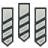 Add Toolbit… — [`CAM_ToolBitDock`](https://github.com/FreeCAD/FreeCAD/blob/b9609745048b/src/Mod/CAM/Path/Tool/library/ui/cmd.py) | Opens the toolbit selection dialog | Unspecified; retain original access |
| Toolbit Library Manager — [`CAM_ToolBitLibraryOpen`](https://github.com/FreeCAD/FreeCAD/blob/b9609745048b/src/Mod/CAM/Path/Tool/library/ui/cmd.py) | Opens an editor to manage toolbit libraries | Unspecified; retain original access |
| Load Tool — [`CAM_ToolBitLoad`](https://github.com/FreeCAD/FreeCAD/blob/b9609745048b/src/Mod/CAM/Path/Tool/toolbit/ui/cmd.py) | Loads an existing toolbit object from a file | Unspecified; retain original access |
| CAM_ToolBitSave — [`CAM_ToolBitSave`](https://github.com/FreeCAD/FreeCAD/blob/b9609745048b/src/Mod/CAM/Path/Tool/toolbit/ui/cmd.py) | Saves an existing toolbit object to a file | Unspecified; retain original access |
| CAM_ToolBitSaveAs — [`CAM_ToolBitSaveAs`](https://github.com/FreeCAD/FreeCAD/blob/b9609745048b/src/Mod/CAM/Path/Tool/toolbit/ui/cmd.py) | Saves an existing toolbit object to a file | Unspecified; retain original access |
| Tool Controller — [`CAM_ToolController`](https://github.com/FreeCAD/FreeCAD/blob/b9609745048b/src/Mod/CAM/Path/Tool/Gui/Controller.py) | Adds a new tool controller to the active job | Unspecified; retain original access |
|  Work Plane — [`CAM_Workplane`](https://github.com/FreeCAD/FreeCAD/blob/b9609745048b/src/Mod/CAM/Path/Main/Gui/WorkplaneCmd.py) | Create a named work plane on the Job, from a selected planar face or at the Job origin. Operations can share one work plane. | Unspecified; retain original access |
### Draft

| Button / command | Short description | FC Plus placement |
| --- | --- | --- |
|  Add to Construction Group — [`Draft_AddConstruction`](https://github.com/FreeCAD/FreeCAD/blob/b9609745048b/src/Mod/Draft/draftguitools/gui_groups.py) | Adds the selected objects to the construction group, and changes their appearance to the construction style. The construction group is created if it does not exist. | Unspecified; retain original access |
|  New Named Group — [`Draft_AddNamedGroup`](https://github.com/FreeCAD/FreeCAD/blob/b9609745048b/src/Mod/Draft/draftguitools/gui_groups.py) | Adds a group with a given name | Unspecified; retain original access |
|  Add to Group — [`Draft_AddToGroup`](https://github.com/FreeCAD/FreeCAD/blob/b9609745048b/src/Mod/Draft/draftguitools/gui_groups.py) | Adds selected objects to a group, or removes them from any group | Unspecified; retain original access |
|  Add to Layer — [`Draft_AddToLayer`](https://github.com/FreeCAD/FreeCAD/blob/b9609745048b/src/Mod/Draft/draftguitools/gui_layers.py) | Adds selected objects to a layer, or removes them from any layer | Unspecified; retain original access |
|  Annotation Styles — [`Draft_AnnotationStyleEditor`](https://github.com/FreeCAD/FreeCAD/blob/b9609745048b/src/Mod/Draft/draftguitools/gui_annotationstyleeditor.py) | Opens an editor to manage or create annotation styles | Unspecified; retain original access |
| Apply Current Style — [`Draft_ApplyStyle`](https://github.com/FreeCAD/FreeCAD/blob/b9609745048b/src/Mod/Draft/draftguitools/gui_styles.py) | Applies the current style to the selected objects and groups | Unspecified; retain original access |
|  Arc — [`Draft_Arc`](https://github.com/FreeCAD/FreeCAD/blob/b9609745048b/src/Mod/Draft/draftguitools/gui_arcs.py) | Creates a circular arc from a center point and a radius | Unspecified; retain original access |
|  Arc Tools — [`Draft_ArcTools`](https://github.com/FreeCAD/FreeCAD/blob/b9609745048b/src/Mod/Draft/draftguitools/gui_arcs.py) | Tools to create various types of circular arcs | Unspecified; retain original access |
|  Arc From 3 Points — [`Draft_Arc_3Points`](https://github.com/FreeCAD/FreeCAD/blob/b9609745048b/src/Mod/Draft/draftguitools/gui_arcs.py) | Creates a circular arc from 3 points | Unspecified; retain original access |
|  Array Tools — [`Draft_ArrayTools`](https://github.com/FreeCAD/FreeCAD/blob/b9609745048b/src/Mod/Draft/draftguitools/gui_arrays.py) | Tools to create various types of arrays, including rectangular, polar, circular, path, and point arrays | Unspecified; retain original access |
| Auto-Group — [`Draft_AutoGroup`](https://github.com/FreeCAD/FreeCAD/blob/b9609745048b/src/Mod/Draft/draftguitools/gui_groups.py) | Adds new Draft and BIM objects to the selected layer or group | Unspecified; retain original access |
|  B-Spline — [`Draft_BSpline`](https://github.com/FreeCAD/FreeCAD/blob/b9609745048b/src/Mod/Draft/draftguitools/gui_splines.py) | Creates a multiple-point B-spline | Unspecified; retain original access |
|  Bézier Curve — [`Draft_BezCurve`](https://github.com/FreeCAD/FreeCAD/blob/b9609745048b/src/Mod/Draft/draftguitools/gui_beziers.py) | Creates an n-degree Bézier curve. The more points, the higher the degree. | Unspecified; retain original access |
|  Bézier Tools — [`Draft_BezierTools`](https://github.com/FreeCAD/FreeCAD/blob/b9609745048b/src/Mod/Draft/draftguitools/gui_beziers.py) | Tools to create various types of Bézier curves | Unspecified; retain original access |
|  Circle — [`Draft_Circle`](https://github.com/FreeCAD/FreeCAD/blob/b9609745048b/src/Mod/Draft/draftguitools/gui_circles.py) | Creates a circle (full circular arc) | Unspecified; retain original access |
|  Circular Array — [`Draft_CircularArray`](https://github.com/FreeCAD/FreeCAD/blob/b9609745048b/src/Mod/Draft/draftguitools/gui_circulararray.py) | Creates copies of the selected object in a radial pattern with 1 or more circular layers | Unspecified; retain original access |
|  Clone — [`Draft_Clone`](https://github.com/FreeCAD/FreeCAD/blob/b9609745048b/src/Mod/Draft/draftguitools/gui_clone.py) | Creates a clone of the selected objects | Unspecified; retain original access |
|  Cubic Bézier Curve — [`Draft_CubicBezCurve`](https://github.com/FreeCAD/FreeCAD/blob/b9609745048b/src/Mod/Draft/draftguitools/gui_beziers.py) | Creates a Bézier curve made of 2nd degree (quadratic) and 3rd degree (cubic) segments. Clicking and dragging allows to define segments. Control points and properties of each knot can be edited after creation. | Unspecified; retain original access |
| 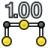 Dimension — [`Draft_Dimension`](https://github.com/FreeCAD/FreeCAD/blob/b9609745048b/src/Mod/Draft/draftguitools/gui_dimensions.py) | Creates a linear dimension for a straight edge, a circular edge, or 2 picked points, or an angular dimension for 2 straight edges | Unspecified; retain original access |
|  Downgrade — [`Draft_Downgrade`](https://github.com/FreeCAD/FreeCAD/blob/b9609745048b/src/Mod/Draft/draftguitools/gui_downgrade.py) | Downgrades the selected objects into simpler shapes. The result of the operation depends on the types of objects, which may be downgraded several times in a row. For example, a 3D solid is deconstructed into separate faces, wires, and then edges. Faces can also be subtracted. | Unspecified; retain original access |
|  Draft to Sketch — [`Draft_Draft2Sketch`](https://github.com/FreeCAD/FreeCAD/blob/b9609745048b/src/Mod/Draft/draftguitools/gui_draft2sketch.py) | Converts bidirectionally between Draft objects and sketches. Multiple selected Draft objects are converted into a single sketch. However, a single sketch with disconnected traces is converted into several individual Draft objects. | Unspecified; retain original access |
|  Edit — [`Draft_Edit`](https://github.com/FreeCAD/FreeCAD/blob/b9609745048b/src/Mod/Draft/draftguitools/gui_edit.py) | Edits the active object | Unspecified; retain original access |
|  Ellipse — [`Draft_Ellipse`](https://github.com/FreeCAD/FreeCAD/blob/b9609745048b/src/Mod/Draft/draftguitools/gui_ellipses.py) | Creates an ellipse | Unspecified; retain original access |
|  Facebinder — [`Draft_Facebinder`](https://github.com/FreeCAD/FreeCAD/blob/b9609745048b/src/Mod/Draft/draftguitools/gui_facebinders.py) | Creates a facebinder from the selected faces | Unspecified; retain original access |
| 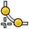 Fillet — [`Draft_Fillet`](https://github.com/FreeCAD/FreeCAD/blob/b9609745048b/src/Mod/Draft/draftguitools/gui_fillets.py) | Creates a fillet between 2 selected edges | Unspecified; retain original access |
|  Flip Dimension — [`Draft_FlipDimension`](https://github.com/FreeCAD/FreeCAD/blob/b9609745048b/src/Mod/Draft/draftguitools/gui_dimension_ops.py) | Flips the normal direction of the selected dimensions (linear, radial, angular). If other objects are selected they are ignored. | Unspecified; retain original access |
|  Hatch — [`Draft_Hatch`](https://github.com/FreeCAD/FreeCAD/blob/b9609745048b/src/Mod/Draft/draftguitools/gui_hatch.py) | Creates hatches on the faces of a selected object | Unspecified; retain original access |
| Heal — [`Draft_Heal`](https://github.com/FreeCAD/FreeCAD/blob/b9609745048b/src/Mod/Draft/draftguitools/gui_heal.py) | Heals faulty Draft objects saved with an earlier version of FreeCAD. If an object is selected it tries to heal only that object, otherwise it tries to heal all objects in the active document. | Unspecified; retain original access |
| Open Links — [`Draft_Hyperlink`](https://github.com/FreeCAD/FreeCAD/blob/b9609745048b/src/Mod/Draft/draftguitools/gui_hyperlink.py) | Opens linked documents | Unspecified; retain original access |
|  Join — [`Draft_Join`](https://github.com/FreeCAD/FreeCAD/blob/b9609745048b/src/Mod/Draft/draftguitools/gui_join.py) | Joins the selected lines or polylines into a single object. The lines must share a common point at the start or at the end. | Unspecified; retain original access |
|  Label — [`Draft_Label`](https://github.com/FreeCAD/FreeCAD/blob/b9609745048b/src/Mod/Draft/draftguitools/gui_labels.py) | Creates a label, optionally attached to a selected object or subelement | Unspecified; retain original access |
| New Layer — [`Draft_Layer`](https://github.com/FreeCAD/FreeCAD/blob/b9609745048b/src/Mod/Draft/draftguitools/gui_layers.py) | Adds a layer to the document. Objects added to this layer can share the same visual properties. | Unspecified; retain original access |
|  Manage Layers — [`Draft_LayerManager`](https://github.com/FreeCAD/FreeCAD/blob/b9609745048b/src/Mod/Draft/draftguitools/gui_layers.py) | Allows to modify the layers | Unspecified; retain original access |
|  Line — [`Draft_Line`](https://github.com/FreeCAD/FreeCAD/blob/b9609745048b/src/Mod/Draft/draftguitools/gui_lines.py) | Creates a 2-point line | Unspecified; retain original access |
|  Mirror — [`Draft_Mirror`](https://github.com/FreeCAD/FreeCAD/blob/b9609745048b/src/Mod/Draft/draftguitools/gui_mirror.py) | Mirrors the selected objects along a line defined by 2 points | Unspecified; retain original access |
|  Move — [`Draft_Move`](https://github.com/FreeCAD/FreeCAD/blob/b9609745048b/src/Mod/Draft/draftguitools/gui_move.py) | Moves the selected objects. If the "Copy" option is active, it creates displaced copies. | Unspecified; retain original access |
|  Offset — [`Draft_Offset`](https://github.com/FreeCAD/FreeCAD/blob/b9609745048b/src/Mod/Draft/draftguitools/gui_offset.py) | Offsets the selected object. It can also create an offset copy of the original object. | Unspecified; retain original access |
|  Array — [`Draft_OrthoArray`](https://github.com/FreeCAD/FreeCAD/blob/b9609745048b/src/Mod/Draft/draftguitools/gui_orthoarray.py) | Creates copies of the selected object in an orthogonal pattern | Unspecified; retain original access |
|  Path Array — [`Draft_PathArray`](https://github.com/FreeCAD/FreeCAD/blob/b9609745048b/src/Mod/Draft/draftguitools/gui_patharray.py) | Creates copies of the selected object along a selected path | Unspecified; retain original access |
|  Path Link Array — [`Draft_PathLinkArray`](https://github.com/FreeCAD/FreeCAD/blob/b9609745048b/src/Mod/Draft/draftguitools/gui_patharray.py) | Creates linked copies of the selected object along a selected path | Unspecified; retain original access |
|  Twisted Path Array — [`Draft_PathTwistedArray`](https://github.com/FreeCAD/FreeCAD/blob/b9609745048b/src/Mod/Draft/draftguitools/gui_pathtwistedarray.py) | Creates twisted copies of the selected object along a selected path | Unspecified; retain original access |
|  Twisted Path Link Array — [`Draft_PathTwistedLinkArray`](https://github.com/FreeCAD/FreeCAD/blob/b9609745048b/src/Mod/Draft/draftguitools/gui_pathtwistedarray.py) | Creates twisted linked copies of the selected object along a selected path | Unspecified; retain original access |
|  Point — [`Draft_Point`](https://github.com/FreeCAD/FreeCAD/blob/b9609745048b/src/Mod/Draft/draftguitools/gui_points.py) | Creates a point | Unspecified; retain original access |
|  Point Array — [`Draft_PointArray`](https://github.com/FreeCAD/FreeCAD/blob/b9609745048b/src/Mod/Draft/draftguitools/gui_pointarray.py) | Creates copies of the selected object at the points of a point object | Unspecified; retain original access |
|  Point Link Array — [`Draft_PointLinkArray`](https://github.com/FreeCAD/FreeCAD/blob/b9609745048b/src/Mod/Draft/draftguitools/gui_pointarray.py) | Creates linked copies of the selected object at the points of a point object | Unspecified; retain original access |
|  Polar Array — [`Draft_PolarArray`](https://github.com/FreeCAD/FreeCAD/blob/b9609745048b/src/Mod/Draft/draftguitools/gui_polararray.py) | Creates copies of the selected object in a polar pattern | Unspecified; retain original access |
|  Polygon — [`Draft_Polygon`](https://github.com/FreeCAD/FreeCAD/blob/b9609745048b/src/Mod/Draft/draftguitools/gui_polygons.py) | Creates a regular polygon (triangle, square, pentagon…) | Unspecified; retain original access |
|  Rectangle — [`Draft_Rectangle`](https://github.com/FreeCAD/FreeCAD/blob/b9609745048b/src/Mod/Draft/draftguitools/gui_rectangles.py) | Creates a 2-point rectangle | Unspecified; retain original access |
|  Rotate — [`Draft_Rotate`](https://github.com/FreeCAD/FreeCAD/blob/b9609745048b/src/Mod/Draft/draftguitools/gui_rotate.py) | Rotates the selected objects. If the "Copy" option is active, it will create rotated copies. | Unspecified; retain original access |
|  Scale — [`Draft_Scale`](https://github.com/FreeCAD/FreeCAD/blob/b9609745048b/src/Mod/Draft/draftguitools/gui_scale.py) | Scales the selected objects from a base point | Unspecified; retain original access |
|  Select Group — [`Draft_SelectGroup`](https://github.com/FreeCAD/FreeCAD/blob/b9609745048b/src/Mod/Draft/draftguitools/gui_groups.py) | Selects the contents of selected groups. For selected non-group objects, the contents of the group they are in are selected. | Unspecified; retain original access |
| Working Plane — [`Draft_SelectPlane`](https://github.com/FreeCAD/FreeCAD/blob/b9609745048b/src/Mod/Draft/draftguitools/gui_selectplane.py) | Defines the working plane from 3 vertices, 1 or more shapes, or an object | Unspecified; retain original access |
| Set Style — [`Draft_SetStyle`](https://github.com/FreeCAD/FreeCAD/blob/b9609745048b/src/Mod/Draft/draftguitools/gui_setstyle.py) | Sets the default style and can apply the style to objects | Unspecified; retain original access |
|  Shape 2D View — [`Draft_Shape2DView`](https://github.com/FreeCAD/FreeCAD/blob/b9609745048b/src/Mod/Draft/draftguitools/gui_shape2dview.py) | Creates a 2D projection of the selected objects on the XY-plane. The initial projection direction is the opposite of the current active view direction. | Unspecified; retain original access |
| 2D View Tools — [`Draft_Shape2DViewTools`](https://github.com/FreeCAD/FreeCAD/blob/b9609745048b/src/Mod/Draft/draftguitools/gui_shape2dview.py) | Tools to create and update 2D Views | Unspecified; retain original access |
|  Shape From Text — [`Draft_ShapeString`](https://github.com/FreeCAD/FreeCAD/blob/b9609745048b/src/Mod/Draft/draftguitools/gui_shapestrings.py) | Creates a shape from a text string and a specified font | Unspecified; retain original access |
| Show Snap Toolbar — [`Draft_ShowSnapBar`](https://github.com/FreeCAD/FreeCAD/blob/b9609745048b/src/Mod/Draft/draftguitools/gui_snaps.py) | Shows the snap toolbar if it is hidden | Unspecified; retain original access |
|  Set Slope — [`Draft_Slope`](https://github.com/FreeCAD/FreeCAD/blob/b9609745048b/src/Mod/Draft/draftguitools/gui_lineslope.py) | Sets the slope of the selected line by changing the value of the Z value of one of its points. If a polyline is selected, it will apply the slope transformation to each of its segments. The slope will always change the Z value, therefore this command only works well for straight Draft lines that are drawn on the XY-plane. | Unspecified; retain original access |
|  Snap Angle — [`Draft_Snap_Angle`](https://github.com/FreeCAD/FreeCAD/blob/b9609745048b/src/Mod/Draft/draftguitools/gui_snaps.py) | Snaps to the special cardinal points on circular edges, at multiples of 30° and 45° | Unspecified; retain original access |
|  Snap Center — [`Draft_Snap_Center`](https://github.com/FreeCAD/FreeCAD/blob/b9609745048b/src/Mod/Draft/draftguitools/gui_snaps.py) | Snaps to the center point of faces and circular edges, and to the placement point of working plane proxies and building parts | Unspecified; retain original access |
| 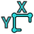 Snap Dimensions — [`Draft_Snap_Dimensions`](https://github.com/FreeCAD/FreeCAD/blob/b9609745048b/src/Mod/Draft/draftguitools/gui_snaps.py) | Shows temporary X and Y dimensions | Unspecified; retain original access |
|  Snap Endpoint — [`Draft_Snap_Endpoint`](https://github.com/FreeCAD/FreeCAD/blob/b9609745048b/src/Mod/Draft/draftguitools/gui_snaps.py) | Snaps to the endpoints of edges | Unspecified; retain original access |
|  Snap Extension — [`Draft_Snap_Extension`](https://github.com/FreeCAD/FreeCAD/blob/b9609745048b/src/Mod/Draft/draftguitools/gui_snaps.py) | Snaps to an imaginary line that extends beyond the endpoints of straight edges | Unspecified; retain original access |
|  Snap Grid — [`Draft_Snap_Grid`](https://github.com/FreeCAD/FreeCAD/blob/b9609745048b/src/Mod/Draft/draftguitools/gui_snaps.py) | Snaps to the intersections of grid lines | Unspecified; retain original access |
|  Snap Intersection — [`Draft_Snap_Intersection`](https://github.com/FreeCAD/FreeCAD/blob/b9609745048b/src/Mod/Draft/draftguitools/gui_snaps.py) | Snaps to the intersection of 2 edges, and the intersection of a face and an edge | Unspecified; retain original access |
|  Snap Lock — [`Draft_Snap_Lock`](https://github.com/FreeCAD/FreeCAD/blob/b9609745048b/src/Mod/Draft/draftguitools/gui_snaps.py) | Enables or disables snapping globally | Unspecified; retain original access |
|  Snap Midpoint — [`Draft_Snap_Midpoint`](https://github.com/FreeCAD/FreeCAD/blob/b9609745048b/src/Mod/Draft/draftguitools/gui_snaps.py) | Snaps to the midpoint of edges | Unspecified; retain original access |
|  Snap Near — [`Draft_Snap_Near`](https://github.com/FreeCAD/FreeCAD/blob/b9609745048b/src/Mod/Draft/draftguitools/gui_snaps.py) | Snaps to the nearest point on faces and edges | Unspecified; retain original access |
|  Snap Ortho — [`Draft_Snap_Ortho`](https://github.com/FreeCAD/FreeCAD/blob/b9609745048b/src/Mod/Draft/draftguitools/gui_snaps.py) | Snaps to imaginary lines that cross the previous point at multiples of 45° | Unspecified; retain original access |
|  Snap Parallel — [`Draft_Snap_Parallel`](https://github.com/FreeCAD/FreeCAD/blob/b9609745048b/src/Mod/Draft/draftguitools/gui_snaps.py) | Snaps to an imaginary line parallel to straight edges | Unspecified; retain original access |
|  Snap Perpendicular — [`Draft_Snap_Perpendicular`](https://github.com/FreeCAD/FreeCAD/blob/b9609745048b/src/Mod/Draft/draftguitools/gui_snaps.py) | Snaps to the perpendicular points on faces and edges | Unspecified; retain original access |
|  Snap Special — [`Draft_Snap_Special`](https://github.com/FreeCAD/FreeCAD/blob/b9609745048b/src/Mod/Draft/draftguitools/gui_snaps.py) | Snaps to special points defined by the object | Unspecified; retain original access |
|  Snap Working Plane — [`Draft_Snap_WorkingPlane`](https://github.com/FreeCAD/FreeCAD/blob/b9609745048b/src/Mod/Draft/draftguitools/gui_snaps.py) | Projects snap points onto the current working plane | Unspecified; retain original access |
|  Split — [`Draft_Split`](https://github.com/FreeCAD/FreeCAD/blob/b9609745048b/src/Mod/Draft/draftguitools/gui_split.py) | Splits the selected line or polyline at a specified point | Unspecified; retain original access |
|  Stretch — [`Draft_Stretch`](https://github.com/FreeCAD/FreeCAD/blob/b9609745048b/src/Mod/Draft/draftguitools/gui_stretch.py) | Stretches the selected objects | Unspecified; retain original access |
|  Highlight Subelements — [`Draft_SubelementHighlight`](https://github.com/FreeCAD/FreeCAD/blob/b9609745048b/src/Mod/Draft/draftguitools/gui_subelements.py) | Highlights the subelements of the selected objects, to be able to move, rotate, and scale them | Unspecified; retain original access |
|  Text — [`Draft_Text`](https://github.com/FreeCAD/FreeCAD/blob/b9609745048b/src/Mod/Draft/draftguitools/gui_texts.py) | Creates a multi-line annotation | Unspecified; retain original access |
| Toggle Construction Mode — [`Draft_ToggleConstructionMode`](https://github.com/FreeCAD/FreeCAD/blob/b9609745048b/src/Mod/Draft/draftguitools/gui_togglemodes.py) | Toggles the construction mode | Unspecified; retain original access |
|  Toggle Wireframe — [`Draft_ToggleDisplayMode`](https://github.com/FreeCAD/FreeCAD/blob/b9609745048b/src/Mod/Draft/draftguitools/gui_togglemodes.py) | Switches the view style of the selected objects from Flat Lines to Wireframe and back | Unspecified; retain original access |
|  Toggle Grid — [`Draft_ToggleGrid`](https://github.com/FreeCAD/FreeCAD/blob/b9609745048b/src/Mod/Draft/draftguitools/gui_grid.py) | Toggles the visibility of the Draft grid | Unspecified; retain original access |
|  Trimex — [`Draft_Trimex`](https://github.com/FreeCAD/FreeCAD/blob/b9609745048b/src/Mod/Draft/draftguitools/gui_trimex.py) | Trims or extends the selected object | Unspecified; retain original access |
|  Force 2D View Update — [`Draft_UpdateShape2DView`](https://github.com/FreeCAD/FreeCAD/blob/b9609745048b/src/Mod/Draft/draftguitools/gui_shape2dview.py) | Forces an update of the selected 2D Views or all 2D Views in the document. The 'Auto Update' property of the views is ignored. | Unspecified; retain original access |
|  Upgrade — [`Draft_Upgrade`](https://github.com/FreeCAD/FreeCAD/blob/b9609745048b/src/Mod/Draft/draftguitools/gui_upgrade.py) | Upgrades the selected objects into more complex shapes. The result of the operation depends on the types of objects, which may be able to be upgraded several times in a row. For example, it can join the selected objects into one, convert simple edges into parametric polylines, convert closed edges into filled faces and parametric polygons, and merge faces into a single face. | Unspecified; retain original access |
|  Polyline — [`Draft_Wire`](https://github.com/FreeCAD/FreeCAD/blob/b9609745048b/src/Mod/Draft/draftguitools/gui_lines.py) | Creates a polyline | Unspecified; retain original access |
|  Convert Wire/B-Spline — [`Draft_WireToBSpline`](https://github.com/FreeCAD/FreeCAD/blob/b9609745048b/src/Mod/Draft/draftguitools/gui_wire2spline.py) | Converts the selected polyline to a B-spline, or the selected B-spline to a polyline | Unspecified; retain original access |
|  Working Plane Proxy — [`Draft_WorkingPlaneProxy`](https://github.com/FreeCAD/FreeCAD/blob/b9609745048b/src/Mod/Draft/draftguitools/gui_planeproxy.py) | Creates a proxy object from the current working plane that allows to restore the camera position and visibility of objects | Unspecified; retain original access |
### FEM

| Button / command | Short description | FC Plus placement |
| --- | --- | --- |
| New Analysis — [`FEM_Analysis`](https://github.com/FreeCAD/FreeCAD/blob/b9609745048b/src/Mod/Fem/femcommands/commands.py) | Creates an analysis container with default solver | Unspecified; retain original access |
| Clipping Plane on Face — [`FEM_ClippingPlaneAdd`](https://github.com/FreeCAD/FreeCAD/blob/b9609745048b/src/Mod/Fem/femcommands/commands.py) | Adds a clipping plane on a selected face | Unspecified; retain original access |
| Remove All Clipping Planes — [`FEM_ClippingPlaneRemoveAll`](https://github.com/FreeCAD/FreeCAD/blob/b9609745048b/src/Mod/Fem/femcommands/commands.py) | Removes all clipping planes | Unspecified; retain original access |
| Electromagnetic Boundary Conditions — [`FEM_CompEmConstraints`](https://github.com/FreeCAD/FreeCAD/blob/b9609745048b/src/Mod/Fem/Gui/Command.cpp) | Electromagnetic boundary conditions | Unspecified; retain original access |
| Electromagnetic Equations — [`FEM_CompEmEquations`](https://github.com/FreeCAD/FreeCAD/blob/b9609745048b/src/Mod/Fem/Gui/Command.cpp) | Electromagnetic equations for the Elmer solver | Unspecified; retain original access |
| Mechanical Equations — [`FEM_CompMechEquations`](https://github.com/FreeCAD/FreeCAD/blob/b9609745048b/src/Mod/Fem/Gui/Command.cpp) | Mechanical equations for the Elmer solver | Unspecified; retain original access |
| Solvers — [`FEM_CompSolvers`](https://github.com/FreeCAD/FreeCAD/blob/b9609745048b/src/Mod/Fem/femcommands/commands.py) | Creates a FEM solver | Unspecified; retain original access |
| Constant Vacuum Permittivity — [`FEM_ConstantVacuumPermittivity`](https://github.com/FreeCAD/FreeCAD/blob/b9609745048b/src/Mod/Fem/femcommands/commands.py) | Creates a constant vacuum permittivity to overwrite standard value | Unspecified; retain original access |
| Bearing Constraint — [`FEM_ConstraintBearing`](https://github.com/FreeCAD/FreeCAD/blob/b9609745048b/src/Mod/Fem/Gui/Command.cpp) | Creates a bearing constraint | Unspecified; retain original access |
| Body Heat Source — [`FEM_ConstraintBodyHeatSource`](https://github.com/FreeCAD/FreeCAD/blob/b9609745048b/src/Mod/Fem/femcommands/commands.py) | Creates a body heat source | Unspecified; retain original access |
| Centrifugal Load — [`FEM_ConstraintCentrif`](https://github.com/FreeCAD/FreeCAD/blob/b9609745048b/src/Mod/Fem/femcommands/commands.py) | Creates a centrifugal load | Unspecified; retain original access |
| Contact Constraint — [`FEM_ConstraintContact`](https://github.com/FreeCAD/FreeCAD/blob/b9609745048b/src/Mod/Fem/Gui/Command.cpp) | Creates a contact constraint between faces | Unspecified; retain original access |
| Current Density Boundary Condition — [`FEM_ConstraintCurrentDensity`](https://github.com/FreeCAD/FreeCAD/blob/b9609745048b/src/Mod/Fem/femcommands/commands.py) | Creates a current density boundary condition | Unspecified; retain original access |
| Displacement Boundary Condition — [`FEM_ConstraintDisplacement`](https://github.com/FreeCAD/FreeCAD/blob/b9609745048b/src/Mod/Fem/Gui/Command.cpp) | Creates a displacement boundary condition for a geometric entity | Unspecified; retain original access |
| Electric Charge Density — [`FEM_ConstraintElectricChargeDensity`](https://github.com/FreeCAD/FreeCAD/blob/b9609745048b/src/Mod/Fem/femcommands/commands.py) | Creates an electric charge density | Unspecified; retain original access |
| Electromagnetic Boundary Condition — [`FEM_ConstraintElectromagnetic`](https://github.com/FreeCAD/FreeCAD/blob/b9609745048b/src/Mod/Fem/femcommands/commands.py) | Creates an electromagnetic boundary condition | Unspecified; retain original access |
| Fixed Boundary Condition — [`FEM_ConstraintFixed`](https://github.com/FreeCAD/FreeCAD/blob/b9609745048b/src/Mod/Fem/Gui/Command.cpp) | Creates a fixed boundary condition for a geometric entity | Unspecified; retain original access |
| Flow Velocity Boundary Condition — [`FEM_ConstraintFlowVelocity`](https://github.com/FreeCAD/FreeCAD/blob/b9609745048b/src/Mod/Fem/femcommands/commands.py) | Creates a flow velocity boundary condition | Unspecified; retain original access |
| Fluid Boundary Condition — [`FEM_ConstraintFluidBoundary`](https://github.com/FreeCAD/FreeCAD/blob/b9609745048b/src/Mod/Fem/Gui/Command.cpp) | Create fluid boundary condition on face entity for Computional Fluid Dynamics | Unspecified; retain original access |
| Force Load — [`FEM_ConstraintForce`](https://github.com/FreeCAD/FreeCAD/blob/b9609745048b/src/Mod/Fem/Gui/Command.cpp) | Creates a force load applied to a geometric entity | Unspecified; retain original access |
| Gear Constraint — [`FEM_ConstraintGear`](https://github.com/FreeCAD/FreeCAD/blob/b9609745048b/src/Mod/Fem/Gui/Command.cpp) | Creates a gear constraint | Unspecified; retain original access |
| Heat Flux Load — [`FEM_ConstraintHeatflux`](https://github.com/FreeCAD/FreeCAD/blob/b9609745048b/src/Mod/Fem/Gui/Command.cpp) | Creates a heat flux load acting on a face | Unspecified; retain original access |
| Initial Flow Velocity Condition — [`FEM_ConstraintInitialFlowVelocity`](https://github.com/FreeCAD/FreeCAD/blob/b9609745048b/src/Mod/Fem/femcommands/commands.py) | Creates an initial flow velocity condition | Unspecified; retain original access |
| Initial Pressure Condition — [`FEM_ConstraintInitialPressure`](https://github.com/FreeCAD/FreeCAD/blob/b9609745048b/src/Mod/Fem/femcommands/commands.py) | Creates an initial pressure condition | Unspecified; retain original access |
| Initial Temperature — [`FEM_ConstraintInitialTemperature`](https://github.com/FreeCAD/FreeCAD/blob/b9609745048b/src/Mod/Fem/Gui/Command.cpp) | Creates an initial temperature acting on a body | Unspecified; retain original access |
| Magnetization Boundary Condition — [`FEM_ConstraintMagnetization`](https://github.com/FreeCAD/FreeCAD/blob/b9609745048b/src/Mod/Fem/femcommands/commands.py) | Creates a magnetization boundary condition | Unspecified; retain original access |
| Plane Multi-Point Constraint — [`FEM_ConstraintPlaneRotation`](https://github.com/FreeCAD/FreeCAD/blob/b9609745048b/src/Mod/Fem/Gui/Command.cpp) | Creates a plane multi-point constraint for a face | Unspecified; retain original access |
| Pressure Load — [`FEM_ConstraintPressure`](https://github.com/FreeCAD/FreeCAD/blob/b9609745048b/src/Mod/Fem/Gui/Command.cpp) | Creates a pressure load acting on a face | Unspecified; retain original access |
| Pulley Constraint — [`FEM_ConstraintPulley`](https://github.com/FreeCAD/FreeCAD/blob/b9609745048b/src/Mod/Fem/Gui/Command.cpp) | Creates a pulley constraint | Unspecified; retain original access |
| Rigid Body Constraint — [`FEM_ConstraintRigidBody`](https://github.com/FreeCAD/FreeCAD/blob/b9609745048b/src/Mod/Fem/Gui/Command.cpp) | Creates a rigid body constraint for a geometric entity | Unspecified; retain original access |
| Section Print Feature — [`FEM_ConstraintSectionPrint`](https://github.com/FreeCAD/FreeCAD/blob/b9609745048b/src/Mod/Fem/femcommands/commands.py) | Creates a section print feature | Unspecified; retain original access |
| Gravity Load — [`FEM_ConstraintSelfWeight`](https://github.com/FreeCAD/FreeCAD/blob/b9609745048b/src/Mod/Fem/femcommands/commands.py) | Creates a gravity load | Unspecified; retain original access |
| Spring Boundary Condition — [`FEM_ConstraintSpring`](https://github.com/FreeCAD/FreeCAD/blob/b9609745048b/src/Mod/Fem/Gui/Command.cpp) | Creates a spring boundary condition on a face | Unspecified; retain original access |
| Temperature Boundary Condition — [`FEM_ConstraintTemperature`](https://github.com/FreeCAD/FreeCAD/blob/b9609745048b/src/Mod/Fem/Gui/Command.cpp) | Creates a temperature/concentrated heat flux load acting on a face | Unspecified; retain original access |
| Tie Constraint — [`FEM_ConstraintTie`](https://github.com/FreeCAD/FreeCAD/blob/b9609745048b/src/Mod/Fem/femcommands/commands.py) | Creates a tie constraint | Unspecified; retain original access |
| Local Coordinate System — [`FEM_ConstraintTransform`](https://github.com/FreeCAD/FreeCAD/blob/b9609745048b/src/Mod/Fem/Gui/Command.cpp) | Creates a local coordinate system on a face | Unspecified; retain original access |
| Erase Elements — [`FEM_CreateElementsSet`](https://github.com/FreeCAD/FreeCAD/blob/b9609745048b/src/Mod/Fem/Gui/Command.cpp) | Creates a FEM mesh elements set | Unspecified; retain original access |
| Nodes Set — [`FEM_CreateNodesSet`](https://github.com/FreeCAD/FreeCAD/blob/b9609745048b/src/Mod/Fem/Gui/Command.cpp) | Creates a FEM mesh nodes set | Unspecified; retain original access |
| Element Set From Polygon — [`FEM_DefineElementsSet`](https://github.com/FreeCAD/FreeCAD/blob/b9609745048b/src/Mod/Fem/Gui/Command.cpp) | Creates a collection of elements selected by a polygon | Unspecified; retain original access |
| Node Set by Polygon — [`FEM_DefineNodesSet`](https://github.com/FreeCAD/FreeCAD/blob/b9609745048b/src/Mod/Fem/Gui/Command.cpp) | Creates a node set by polygon selection | Unspecified; retain original access |
| Fluid Section for 1D Flow — [`FEM_ElementFluid1D`](https://github.com/FreeCAD/FreeCAD/blob/b9609745048b/src/Mod/Fem/femcommands/commands.py) | Creates a fluid section for 1D flow | Unspecified; retain original access |
| Beam Cross Section — [`FEM_ElementGeometry1D`](https://github.com/FreeCAD/FreeCAD/blob/b9609745048b/src/Mod/Fem/femcommands/commands.py) | Creates a beam cross section | Unspecified; retain original access |
| Shell Plate Thickness — [`FEM_ElementGeometry2D`](https://github.com/FreeCAD/FreeCAD/blob/b9609745048b/src/Mod/Fem/femcommands/commands.py) | Creates a shell plate thickness | Unspecified; retain original access |
| Beam Rotation — [`FEM_ElementRotation1D`](https://github.com/FreeCAD/FreeCAD/blob/b9609745048b/src/Mod/Fem/femcommands/commands.py) | Creates a beam rotation | Unspecified; retain original access |
| Deformation Equation — [`FEM_EquationDeformation`](https://github.com/FreeCAD/FreeCAD/blob/b9609745048b/src/Mod/Fem/femcommands/commands.py) | Creates an equation for deformation (nonlinear elasticity) | Unspecified; retain original access |
| Elasticity Equation — [`FEM_EquationElasticity`](https://github.com/FreeCAD/FreeCAD/blob/b9609745048b/src/Mod/Fem/femcommands/commands.py) | Creates an equation for elasticity (stress) | Unspecified; retain original access |
| Electricforce Equation — [`FEM_EquationElectricforce`](https://github.com/FreeCAD/FreeCAD/blob/b9609745048b/src/Mod/Fem/femcommands/commands.py) | Creates an equation for electric forces | Unspecified; retain original access |
| Electrostatic Equation — [`FEM_EquationElectrostatic`](https://github.com/FreeCAD/FreeCAD/blob/b9609745048b/src/Mod/Fem/femcommands/commands.py) | Creates an equation for electrostatic | Unspecified; retain original access |
| Flow Equation — [`FEM_EquationFlow`](https://github.com/FreeCAD/FreeCAD/blob/b9609745048b/src/Mod/Fem/femcommands/commands.py) | Creates an equation for flow | Unspecified; retain original access |
| Flux Equation — [`FEM_EquationFlux`](https://github.com/FreeCAD/FreeCAD/blob/b9609745048b/src/Mod/Fem/femcommands/commands.py) | Creates an equation for flux | Unspecified; retain original access |
| Heat Equation — [`FEM_EquationHeat`](https://github.com/FreeCAD/FreeCAD/blob/b9609745048b/src/Mod/Fem/femcommands/commands.py) | Creates an equation for heat | Unspecified; retain original access |
| Magnetodynamic Equation — [`FEM_EquationMagnetodynamic`](https://github.com/FreeCAD/FreeCAD/blob/b9609745048b/src/Mod/Fem/femcommands/commands.py) | Creates an equation for magnetodynamic forces | Unspecified; retain original access |
| Magnetodynamic 2D Equation — [`FEM_EquationMagnetodynamic2D`](https://github.com/FreeCAD/FreeCAD/blob/b9609745048b/src/Mod/Fem/femcommands/commands.py) | Creates an equation for 2D magnetodynamic forces | Unspecified; retain original access |
| Static Current Equation — [`FEM_EquationStaticCurrent`](https://github.com/FreeCAD/FreeCAD/blob/b9609745048b/src/Mod/Fem/femcommands/commands.py) | Creates an equation for static current | Unspecified; retain original access |
| FEM Examples — [`FEM_Examples`](https://github.com/FreeCAD/FreeCAD/blob/b9609745048b/src/Mod/Fem/femcommands/commands.py) | Opens the FEM examples | Unspecified; retain original access |
| FEM Mesh to Mesh — [`FEM_FEMMesh2Mesh`](https://github.com/FreeCAD/FreeCAD/blob/b9609745048b/src/Mod/Fem/femcommands/commands.py) | Converts the surface of a FEM mesh to a mesh | Unspecified; retain original access |
| Add Part to Analysis — [`FEM_FemAddPart`](https://github.com/FreeCAD/FreeCAD/blob/b9609745048b/src/Mod/Fem/Gui/Command.cpp) | Adds a part to the analysis | Unspecified; retain original access |
| Material Editor — [`FEM_MaterialEditor`](https://github.com/FreeCAD/FreeCAD/blob/b9609745048b/src/Mod/Fem/femcommands/commands.py) | Opens the FreeCAD material editor | Unspecified; retain original access |
| Fluid Material — [`FEM_MaterialFluid`](https://github.com/FreeCAD/FreeCAD/blob/b9609745048b/src/Mod/Fem/femcommands/commands.py) | Creates a fluid material | Unspecified; retain original access |
| Non-Linear Mechanical Material — [`FEM_MaterialMechanicalNonlinear`](https://github.com/FreeCAD/FreeCAD/blob/b9609745048b/src/Mod/Fem/femcommands/commands.py) | Add non-linear mechanical properties to material | Unspecified; retain original access |
| Reinforced Material (Concrete) — [`FEM_MaterialReinforced`](https://github.com/FreeCAD/FreeCAD/blob/b9609745048b/src/Mod/Fem/femcommands/commands.py) | Creates a material for reinforced matrix material such as concrete | Unspecified; retain original access |
| Solid Material — [`FEM_MaterialSolid`](https://github.com/FreeCAD/FreeCAD/blob/b9609745048b/src/Mod/Fem/femcommands/commands.py) | Creates a solid material | Unspecified; retain original access |
| Advanced Refinement Types — [`FEM_MeshAdvanced`](https://github.com/FreeCAD/FreeCAD/blob/b9609745048b/src/Mod/Fem/femcommands/commands.py) | Allows to define the mesh size by various advanced means | Unspecified; retain original access |
| 2D Boundary Layer — [`FEM_MeshBoundaryLayer`](https://github.com/FreeCAD/FreeCAD/blob/b9609745048b/src/Mod/Fem/femcommands/commands.py) | Adds a structured layer of mesh elements on 2D model boundaries | Unspecified; retain original access |
| Clear FEM Mesh — [`FEM_MeshClear`](https://github.com/FreeCAD/FreeCAD/blob/b9609745048b/src/Mod/Fem/femcommands/commands.py) | Clears the mesh of a FEM mesh object | Unspecified; retain original access |
| Clear Mesh Groups — [`FEM_MeshClearGroups`](https://github.com/FreeCAD/FreeCAD/blob/b9609745048b/src/Mod/Fem/femcommands/commands.py) | Remove groups from FEM mesh | Unspecified; retain original access |
| Display Mesh Info — [`FEM_MeshDisplayInfo`](https://github.com/FreeCAD/FreeCAD/blob/b9609745048b/src/Mod/Fem/femcommands/commands.py) | Displays FEM mesh information | Unspecified; retain original access |
| Distance-Based Refinement — [`FEM_MeshDistance`](https://github.com/FreeCAD/FreeCAD/blob/b9609745048b/src/Mod/Fem/femcommands/commands.py) | Sets mesh size based on the distance to vertices, edges, and faces | Unspecified; retain original access |
| GMSH Refinements — [`FEM_MeshGMSHRefinement`](https://github.com/FreeCAD/FreeCAD/blob/b9609745048b/src/Mod/Fem/femcommands/commands.py) | Mesh refinements for the GMSH mesh generation | Unspecified; retain original access |
| Mesh From Shape by Gmsh — [`FEM_MeshGmshFromShape`](https://github.com/FreeCAD/FreeCAD/blob/b9609745048b/src/Mod/Fem/femcommands/commands.py) | Creates a FEM mesh from a shape by Gmsh mesher | Unspecified; retain original access |
| Mesh Group — [`FEM_MeshGroup`](https://github.com/FreeCAD/FreeCAD/blob/b9609745048b/src/Mod/Fem/femcommands/commands.py) | Creates a mesh group | Unspecified; retain original access |
| Manipulate Refinement — [`FEM_MeshManipulate`](https://github.com/FreeCAD/FreeCAD/blob/b9609745048b/src/Mod/Fem/femcommands/commands.py) | Allows to manipulate the output of a refinement in various ways | Unspecified; retain original access |
| Mesh From Shape by Netgen — [`FEM_MeshNetgenFromShape`](https://github.com/FreeCAD/FreeCAD/blob/b9609745048b/src/Mod/Fem/femcommands/commands.py) | Creates a FEM mesh from a solid or face shape by Netgen internal mesher | Unspecified; retain original access |
| Mesh Refinement — [`FEM_MeshRegion`](https://github.com/FreeCAD/FreeCAD/blob/b9609745048b/src/Mod/Fem/femcommands/commands.py) | Creates a FEM mesh refinement | Unspecified; retain original access |
| Shape-Based Refinement — [`FEM_MeshShape`](https://github.com/FreeCAD/FreeCAD/blob/b9609745048b/src/Mod/Fem/femcommands/commands.py) | Sets mesh size within and outside of a geometric shape (box, sphere, cylinder) | Unspecified; retain original access |
| Structured Transfinite Curve — [`FEM_MeshTransfiniteCurve`](https://github.com/FreeCAD/FreeCAD/blob/b9609745048b/src/Mod/Fem/femcommands/commands.py) | Creates a fixed number of nodes on an edge with a structured algorithm | Unspecified; retain original access |
| Structured Transfinite Surface — [`FEM_MeshTransfiniteSurface`](https://github.com/FreeCAD/FreeCAD/blob/b9609745048b/src/Mod/Fem/femcommands/commands.py) | Creates a structured mesh on a face | Unspecified; retain original access |
| Structured Transfinite Volume — [`FEM_MeshTransfiniteVolume`](https://github.com/FreeCAD/FreeCAD/blob/b9609745048b/src/Mod/Fem/femcommands/commands.py) | Creates a structured mesh in a 4- or 5-sided volume bounded by transfinite surfaces | Unspecified; retain original access |
| Apply Changes to Pipeline — [`FEM_PostApplyChanges`](https://github.com/FreeCAD/FreeCAD/blob/b9609745048b/src/Mod/Fem/Gui/Command.cpp) | Applies changes to parameters directly and not on recompute only | Unspecified; retain original access |
| Pipeline Branch — [`FEM_PostBranchFilter`](https://github.com/FreeCAD/FreeCAD/blob/b9609745048b/src/Mod/Fem/Gui/Command.cpp) | Branches the pipeline into a new path | Unspecified; retain original access |
| Filter Functions — [`FEM_PostCreateFunctions`](https://github.com/FreeCAD/FreeCAD/blob/b9609745048b/src/Mod/Fem/Gui/Command.cpp) | Functions for use in postprocessing filter | Unspecified; retain original access |
| Calculator Filter — [`FEM_PostFilterCalculator`](https://github.com/FreeCAD/FreeCAD/blob/b9609745048b/src/Mod/Fem/Gui/Command.cpp) | Creates a new field from current data | Unspecified; retain original access |
| Region Clip Filter — [`FEM_PostFilterClipRegion`](https://github.com/FreeCAD/FreeCAD/blob/b9609745048b/src/Mod/Fem/Gui/Command.cpp) | Defines a clip filter which uses functions to define the clipped region | Unspecified; retain original access |
| Scalar Clip Filter — [`FEM_PostFilterClipScalar`](https://github.com/FreeCAD/FreeCAD/blob/b9609745048b/src/Mod/Fem/Gui/Command.cpp) | Defines a clip filter which clips a field with a scalar value | Unspecified; retain original access |
| Contours Filter — [`FEM_PostFilterContours`](https://github.com/FreeCAD/FreeCAD/blob/b9609745048b/src/Mod/Fem/Gui/Command.cpp) | Defines a contours filter that displays iso contours | Unspecified; retain original access |
| Function Cut Filter — [`FEM_PostFilterCutFunction`](https://github.com/FreeCAD/FreeCAD/blob/b9609745048b/src/Mod/Fem/Gui/Command.cpp) | Cuts the data along an implicit function | Unspecified; retain original access |
| Line Clip Filter — [`FEM_PostFilterDataAlongLine`](https://github.com/FreeCAD/FreeCAD/blob/b9609745048b/src/Mod/Fem/Gui/Command.cpp) | Defines a clip filter which clips a field along a line | Unspecified; retain original access |
| Data at Point Clip Filter — [`FEM_PostFilterDataAtPoint`](https://github.com/FreeCAD/FreeCAD/blob/b9609745048b/src/Mod/Fem/Gui/Command.cpp) | Defines a clip filter which clips a field data at point | Unspecified; retain original access |
| Glyph Filter — [`FEM_PostFilterGlyph`](https://github.com/FreeCAD/FreeCAD/blob/b9609745048b/src/Mod/Fem/femcommands/commands.py) | Adds a post-processing filter that adds glyphs to the mesh vertices for vertex data visualization | Unspecified; retain original access |
| Stress Linearization Plot — [`FEM_PostFilterLinearizedStresses`](https://github.com/FreeCAD/FreeCAD/blob/b9609745048b/src/Mod/Fem/Gui/Command.cpp) | Defines a stress linearization plot | Unspecified; retain original access |
| Warp Filter — [`FEM_PostFilterWarp`](https://github.com/FreeCAD/FreeCAD/blob/b9609745048b/src/Mod/Fem/Gui/Command.cpp) | Warps the geometry along a vector field by a certain factor | Unspecified; retain original access |
| Post Pipeline From Result — [`FEM_PostPipelineFromResult`](https://github.com/FreeCAD/FreeCAD/blob/b9609745048b/src/Mod/Fem/Gui/Command.cpp) | Creates a post processing pipeline from a result object | Unspecified; retain original access |
| Data Visualizations — [`FEM_PostVisualization`](https://github.com/FreeCAD/FreeCAD/blob/b9609745048b/src/Mod/Fem/femguiutils/post_visualization.py) | Different visualizations to show post processing data in | Unspecified; retain original access |
| Show Result — [`FEM_ResultShow`](https://github.com/FreeCAD/FreeCAD/blob/b9609745048b/src/Mod/Fem/femcommands/commands.py) | Shows and visualizes the selected result data | Unspecified; retain original access |
| Purge Results — [`FEM_ResultsPurge`](https://github.com/FreeCAD/FreeCAD/blob/b9609745048b/src/Mod/Fem/femcommands/commands.py) | Purges all results from the active analysis | Unspecified; retain original access |
| Solver Job Control — [`FEM_SolverControl`](https://github.com/FreeCAD/FreeCAD/blob/b9609745048b/src/Mod/Fem/femcommands/commands.py) | Changes solver attributes and runs the calculations for the selected solver | Unspecified; retain original access |
| Solver Elmer — [`FEM_SolverElmer`](https://github.com/FreeCAD/FreeCAD/blob/b9609745048b/src/Mod/Fem/femcommands/commands.py) | Creates a FEM solver Elmer | Unspecified; retain original access |
| Solver Mystran — [`FEM_SolverMystran`](https://github.com/FreeCAD/FreeCAD/blob/b9609745048b/src/Mod/Fem/femcommands/commands.py) | Creates a FEM solver Mystran | Unspecified; retain original access |
| Run Solver — [`FEM_SolverRun`](https://github.com/FreeCAD/FreeCAD/blob/b9609745048b/src/Mod/Fem/femcommands/commands.py) | Runs the calculations for the selected solver | Unspecified; retain original access |
| Solver CalculiX — [`FEM_SolverStandard`](https://github.com/FreeCAD/FreeCAD/blob/b9609745048b/src/Mod/Fem/femcommands/commands.py) | Creates a FEM solver CalculiX | Unspecified; retain original access |
| Solver Z88 — [`FEM_SolverZ88`](https://github.com/FreeCAD/FreeCAD/blob/b9609745048b/src/Mod/Fem/femcommands/commands.py) | Creates a FEM solver Z88 | Unspecified; retain original access |
### Import

| Button / command | Short description | FC Plus placement |
| --- | --- | --- |
| Import IGES — [`Import_Iges`](https://github.com/FreeCAD/FreeCAD/blob/b9609745048b/src/Mod/Import/Gui/Command.cpp) | Create or change a Import IGES feature | Unspecified; retain original access |
| Read BREP — [`Import_ReadBREP`](https://github.com/FreeCAD/FreeCAD/blob/b9609745048b/src/Mod/Import/Gui/Command.cpp) | Read a BREP file | Unspecified; retain original access |
| Import STEP — [`Part_ImportStep`](https://github.com/FreeCAD/FreeCAD/blob/b9609745048b/src/Mod/Import/Gui/Command.cpp) | Create or change a Import STEP feature | Unspecified; retain original access |
### Inspection

| Button / command | Short description | FC Plus placement |
| --- | --- | --- |
| Inspection… — [`Inspection_InspectElement`](https://github.com/FreeCAD/FreeCAD/blob/b9609745048b/src/Mod/Inspection/Gui/Command.cpp) | Inspects distance information | Unspecified; retain original access |
| Visual Inspection — [`Inspection_VisualInspection`](https://github.com/FreeCAD/FreeCAD/blob/b9609745048b/src/Mod/Inspection/Gui/Command.cpp) | Inspects the objects visually | Unspecified; retain original access |
### Material

| Button / command | Short description | FC Plus placement |
| --- | --- | --- |
|  Edit — [`Material_Edit`](https://github.com/FreeCAD/FreeCAD/blob/b9609745048b/src/Mod/Material/Gui/Command.cpp) | Edits material properties | Unspecified; retain original access |
| Inspect Appearance — [`Materials_InspectAppearance`](https://github.com/FreeCAD/FreeCAD/blob/b9609745048b/src/Mod/Material/Gui/Command.cpp) | Inspects the appearance properties of the selected object | Unspecified; retain original access |
| Inspect Material — [`Materials_InspectMaterial`](https://github.com/FreeCAD/FreeCAD/blob/b9609745048b/src/Mod/Material/Gui/Command.cpp) | Inspects the material properties of the selected object | Unspecified; retain original access |
| Migrate — [`Materials_MigrateToExternal`](https://github.com/FreeCAD/FreeCAD/blob/b9609745048b/src/Mod/Material/Gui/Command.cpp) | Migrates the materials to the external materials manager | Unspecified; retain original access |
| Appearance — [`Std_SetAppearance`](https://github.com/FreeCAD/FreeCAD/blob/b9609745048b/src/Mod/Material/Gui/Command.cpp) | Sets the display properties of the selected object | Unspecified; retain original access |
| Material — [`Std_SetMaterial`](https://github.com/FreeCAD/FreeCAD/blob/b9609745048b/src/Mod/Material/Gui/Command.cpp) | Sets the material of the selected object | Unspecified; retain original access |
### Measure

| Button / command | Short description | FC Plus placement |
| --- | --- | --- |
|  Mass Properties — [`Std_MassProperties`](https://github.com/FreeCAD/FreeCAD/blob/b9609745048b/src/Mod/Measure/Gui/Command.cpp) | Calculates mass properties of selected objects | Unspecified; retain original access |
|  Measure — [`Std_Measure`](https://github.com/FreeCAD/FreeCAD/blob/b9609745048b/src/Mod/Measure/Gui/Command.cpp) | Measures a feature | Unspecified; retain original access |
### Mesh

| Button / command | Short description | FC Plus placement |
| --- | --- | --- |
|  Add Triangle — [`Mesh_AddFacet`](https://github.com/FreeCAD/FreeCAD/blob/b9609745048b/src/Mod/Mesh/Gui/Command.cpp) | Adds a triangle manually to a mesh | Unspecified; retain original access |
|  Bounding Box Info — [`Mesh_BoundingBox`](https://github.com/FreeCAD/FreeCAD/blob/b9609745048b/src/Mod/Mesh/Gui/Command.cpp) | Shows the bounding box coordinates of the selected mesh | Unspecified; retain original access |
|  Regular Solid — [`Mesh_BuildRegularSolid`](https://github.com/FreeCAD/FreeCAD/blob/b9609745048b/src/Mod/Mesh/Gui/Command.cpp) | Builds a regular solid | Unspecified; retain original access |
|  Cross-Sections — [`Mesh_CrossSections`](https://github.com/FreeCAD/FreeCAD/blob/b9609745048b/src/Mod/Mesh/Gui/Command.cpp) | Creates cross-sections of the mesh | Unspecified; retain original access |
|  Curvature Info — [`Mesh_CurvatureInfo`](https://github.com/FreeCAD/FreeCAD/blob/b9609745048b/src/Mod/Mesh/Gui/Command.cpp) | Displays information about the curvature | Unspecified; retain original access |
|  Decimate — [`Mesh_Decimating`](https://github.com/FreeCAD/FreeCAD/blob/b9609745048b/src/Mod/Mesh/Gui/Command.cpp) | Decimates a mesh | Unspecified; retain original access |
|  Difference — [`Mesh_Difference`](https://github.com/FreeCAD/FreeCAD/blob/b9609745048b/src/Mod/Mesh/Gui/Command.cpp) | Creates a boolean difference of the selected meshes | Unspecified; retain original access |
|  Face Info — [`Mesh_EvaluateFacet`](https://github.com/FreeCAD/FreeCAD/blob/b9609745048b/src/Mod/Mesh/Gui/Command.cpp) | Displays information about the selected faces | Unspecified; retain original access |
|  Evaluate Solid — [`Mesh_EvaluateSolid`](https://github.com/FreeCAD/FreeCAD/blob/b9609745048b/src/Mod/Mesh/Gui/Command.cpp) | Checks whether the mesh is a solid | Unspecified; retain original access |
|  Evaluate and Repair — [`Mesh_Evaluation`](https://github.com/FreeCAD/FreeCAD/blob/b9609745048b/src/Mod/Mesh/Gui/Command.cpp) | Opens a dialog to analyze and repair a mesh | Unspecified; retain original access |
|  Export Mesh… — [`Mesh_Export`](https://github.com/FreeCAD/FreeCAD/blob/b9609745048b/src/Mod/Mesh/Gui/Command.cpp) | Exports a mesh to a file | Unspecified; retain original access |
|  Close Hole — [`Mesh_FillInteractiveHole`](https://github.com/FreeCAD/FreeCAD/blob/b9609745048b/src/Mod/Mesh/Gui/Command.cpp) | Closes a hole interactively in the mesh | Unspecified; retain original access |
|  Fill Holes — [`Mesh_FillupHoles`](https://github.com/FreeCAD/FreeCAD/blob/b9609745048b/src/Mod/Mesh/Gui/Command.cpp) | Fills holes in the mesh | Unspecified; retain original access |
|  Flip Normals — [`Mesh_FlipNormals`](https://github.com/FreeCAD/FreeCAD/blob/b9609745048b/src/Mod/Mesh/Gui/Command.cpp) | Flips the normals of the selected mesh | Unspecified; retain original access |
| Mesh From Geometry — [`Mesh_FromGeometry`](https://github.com/FreeCAD/FreeCAD/blob/b9609745048b/src/Mod/Mesh/Gui/Command.cpp) | Creates a mesh from the selected geometry | Unspecified; retain original access |
|  Mesh From Shape — [`Mesh_FromPartShape`](https://github.com/FreeCAD/FreeCAD/blob/b9609745048b/src/Mod/Mesh/Gui/Command.cpp) | Tessellates the selected shape to a mesh | Unspecified; retain original access |
|  Harmonize Normals — [`Mesh_HarmonizeNormals`](https://github.com/FreeCAD/FreeCAD/blob/b9609745048b/src/Mod/Mesh/Gui/Command.cpp) | Harmonizes the normals of the mesh | Unspecified; retain original access |
|  Import Mesh… — [`Mesh_Import`](https://github.com/FreeCAD/FreeCAD/blob/b9609745048b/src/Mod/Mesh/Gui/Command.cpp) | Imports a mesh from a file | Unspecified; retain original access |
|  Intersection — [`Mesh_Intersection`](https://github.com/FreeCAD/FreeCAD/blob/b9609745048b/src/Mod/Mesh/Gui/Command.cpp) | Creates a boolean intersection from the selected meshes | Unspecified; retain original access |
|  Merge — [`Mesh_Merge`](https://github.com/FreeCAD/FreeCAD/blob/b9609745048b/src/Mod/Mesh/Gui/Command.cpp) | Merges selected meshes into one | Unspecified; retain original access |
|  Cut — [`Mesh_PolyCut`](https://github.com/FreeCAD/FreeCAD/blob/b9609745048b/src/Mod/Mesh/Gui/Command.cpp) | Cuts the mesh with a selected polygon | Unspecified; retain original access |
| Segment — [`Mesh_PolySegm`](https://github.com/FreeCAD/FreeCAD/blob/b9609745048b/src/Mod/Mesh/Gui/Command.cpp) | Creates a mesh segment | Unspecified; retain original access |
| Split — [`Mesh_PolySplit`](https://github.com/FreeCAD/FreeCAD/blob/b9609745048b/src/Mod/Mesh/Gui/Command.cpp) | Splits a mesh into 2 meshes | Unspecified; retain original access |
|  Trim — [`Mesh_PolyTrim`](https://github.com/FreeCAD/FreeCAD/blob/b9609745048b/src/Mod/Mesh/Gui/Command.cpp) | Trims a mesh with a selected polygon | Unspecified; retain original access |
|  Refinement — [`Mesh_RemeshGmsh`](https://github.com/FreeCAD/FreeCAD/blob/b9609745048b/src/Mod/Mesh/Gui/Command.cpp) | Refines an existing mesh | Unspecified; retain original access |
| Remove Components Manually — [`Mesh_RemoveCompByHand`](https://github.com/FreeCAD/FreeCAD/blob/b9609745048b/src/Mod/Mesh/Gui/Command.cpp) | Marks a component to remove it from the mesh | Unspecified; retain original access |
|  Remove Components — [`Mesh_RemoveComponents`](https://github.com/FreeCAD/FreeCAD/blob/b9609745048b/src/Mod/Mesh/Gui/Command.cpp) | Removes topologically independent components from the mesh | Unspecified; retain original access |
|  Scale — [`Mesh_Scale`](https://github.com/FreeCAD/FreeCAD/blob/b9609745048b/src/Mod/Mesh/Gui/Command.cpp) | Scales the selected mesh objects | Unspecified; retain original access |
|  Section From Plane — [`Mesh_SectionByPlane`](https://github.com/FreeCAD/FreeCAD/blob/b9609745048b/src/Mod/Mesh/Gui/Command.cpp) | Sections the mesh with the selected plane | Unspecified; retain original access |
|  Segmentation — [`Mesh_Segmentation`](https://github.com/FreeCAD/FreeCAD/blob/b9609745048b/src/Mod/Mesh/Gui/Command.cpp) | Creates new mesh segments from the mesh | Unspecified; retain original access |
|  Segmentation From Best-Fit Surfaces — [`Mesh_SegmentationBestFit`](https://github.com/FreeCAD/FreeCAD/blob/b9609745048b/src/Mod/Mesh/Gui/Command.cpp) | Creates new mesh segments from the best-fit surfaces | Unspecified; retain original access |
|  Smooth — [`Mesh_Smoothing`](https://github.com/FreeCAD/FreeCAD/blob/b9609745048b/src/Mod/Mesh/Gui/Command.cpp) | Smoothes the selected meshes | Unspecified; retain original access |
|  Split by Components — [`Mesh_SplitComponents`](https://github.com/FreeCAD/FreeCAD/blob/b9609745048b/src/Mod/Mesh/Gui/Command.cpp) | Splits the selected mesh into its components | Unspecified; retain original access |
|  Trim With Plane — [`Mesh_TrimByPlane`](https://github.com/FreeCAD/FreeCAD/blob/b9609745048b/src/Mod/Mesh/Gui/Command.cpp) | Trims a mesh by removing faces on one side of a selected plane | Unspecified; retain original access |
|  Union — [`Mesh_Union`](https://github.com/FreeCAD/FreeCAD/blob/b9609745048b/src/Mod/Mesh/Gui/Command.cpp) | Unifies the selected meshes | Unspecified; retain original access |
|  Curvature Plot — [`Mesh_VertexCurvature`](https://github.com/FreeCAD/FreeCAD/blob/b9609745048b/src/Mod/Mesh/Gui/Command.cpp) | Calculates the curvature of the vertices of a mesh | Unspecified; retain original access |
### MeshPart

| Button / command | Short description | FC Plus placement |
| --- | --- | --- |
| Unwrap Face — [`MeshPart_CreateFlatFace`](https://github.com/FreeCAD/FreeCAD/blob/b9609745048b/src/Mod/MeshPart/Gui/MeshFlatteningCommand.py) | Finds a flat representation of a face | Unspecified; retain original access |
| Unwrap Mesh — [`MeshPart_CreateFlatMesh`](https://github.com/FreeCAD/FreeCAD/blob/b9609745048b/src/Mod/MeshPart/Gui/MeshFlatteningCommand.py) | Finds a flat representation of a mesh | Unspecified; retain original access |
| Cross-Sections — [`MeshPart_CrossSections`](https://github.com/FreeCAD/FreeCAD/blob/b9609745048b/src/Mod/MeshPart/Gui/Command.cpp) | Applies cross-sections to the mesh | Unspecified; retain original access |
| Curve on Mesh — [`MeshPart_CurveOnMesh`](https://github.com/FreeCAD/FreeCAD/blob/b9609745048b/src/Mod/MeshPart/Gui/Command.cpp) | Creates an approximated curve on top of a mesh object | Unspecified; retain original access |
| Mesh From Shape — [`MeshPart_Mesher`](https://github.com/FreeCAD/FreeCAD/blob/b9609745048b/src/Mod/MeshPart/Gui/Command.cpp) | Tessellate shape | Unspecified; retain original access |
| Section — [`MeshPart_SectionByPlane`](https://github.com/FreeCAD/FreeCAD/blob/b9609745048b/src/Mod/MeshPart/Gui/Command.cpp) | Creates a section from a mesh and plane | Unspecified; retain original access |
| Trim Mesh — [`MeshPart_TrimByPlane`](https://github.com/FreeCAD/FreeCAD/blob/b9609745048b/src/Mod/MeshPart/Gui/Command.cpp) | Trims a mesh with a plane | Unspecified; retain original access |
### OpenSCAD

| Button / command | Short description | FC Plus placement |
| --- | --- | --- |
| Add OpenSCAD Element — [`OpenSCAD_AddOpenSCADElement`](https://github.com/FreeCAD/FreeCAD/blob/b9609745048b/src/Mod/OpenSCAD/OpenSCADCommands.py) | Adds an OpenSCAD element based on entered OpenSCAD code using the OpenSCAD binary | Unspecified; retain original access |
| Color Shapes — [`OpenSCAD_ColorCodeShape`](https://github.com/FreeCAD/FreeCAD/blob/b9609745048b/src/Mod/OpenSCAD/OpenSCADCommands.py) | Colors shapes by validity and type | Unspecified; retain original access |
| Convert Edges to Faces — [`OpenSCAD_Edgestofaces`](https://github.com/FreeCAD/FreeCAD/blob/b9609745048b/src/Mod/OpenSCAD/OpenSCADCommands.py) | Converts edges to faces | Unspecified; retain original access |
| Expand Placements — [`OpenSCAD_ExpandPlacements`](https://github.com/FreeCAD/FreeCAD/blob/b9609745048b/src/Mod/OpenSCAD/OpenSCADCommands.py) | Expands all placements downwards in the Tree View | Unspecified; retain original access |
| Explode Group — [`OpenSCAD_ExplodeGroup`](https://github.com/FreeCAD/FreeCAD/blob/b9609745048b/src/Mod/OpenSCAD/OpenSCADCommands.py) | Explodes a fusion or compound and applies random colors | Unspecified; retain original access |
| Hull — [`OpenSCAD_Hull`](https://github.com/FreeCAD/FreeCAD/blob/b9609745048b/src/Mod/OpenSCAD/OpenSCADCommands.py) | Creates a hull | Unspecified; retain original access |
| Increase Tolerance Feature — [`OpenSCAD_IncreaseToleranceFeature`](https://github.com/FreeCAD/FreeCAD/blob/b9609745048b/src/Mod/OpenSCAD/OpenSCADCommands.py) | Creates a feature to increase the tolerance | Unspecified; retain original access |
| Mesh Boolean — [`OpenSCAD_MeshBoolean`](https://github.com/FreeCAD/FreeCAD/blob/b9609745048b/src/Mod/OpenSCAD/OpenSCADCommands.py) | Performs a boolean operation using the OpenSCAD binary | Unspecified; retain original access |
| Minkowski Sum — [`OpenSCAD_Minkowski`](https://github.com/FreeCAD/FreeCAD/blob/b9609745048b/src/Mod/OpenSCAD/OpenSCADCommands.py) | Creates a Minkowski sum | Unspecified; retain original access |
| Mirror Mesh Feature — [`OpenSCAD_MirrorMeshFeature`](https://github.com/FreeCAD/FreeCAD/blob/b9609745048b/src/Mod/OpenSCAD/OpenSCADCommands.py) | Mirrors the mesh | Unspecified; retain original access |
| Refine Shape Feature — [`OpenSCAD_RefineShapeFeature`](https://github.com/FreeCAD/FreeCAD/blob/b9609745048b/src/Mod/OpenSCAD/OpenSCADCommands.py) | Creates a refined shape | Unspecified; retain original access |
| Remove Objects and Children — [`OpenSCAD_RemoveSubtree`](https://github.com/FreeCAD/FreeCAD/blob/b9609745048b/src/Mod/OpenSCAD/OpenSCADCommands.py) | Removes the selected objects and all children that are not referenced by other objects | Unspecified; retain original access |
| Replace Object — [`OpenSCAD_ReplaceObject`](https://github.com/FreeCAD/FreeCAD/blob/b9609745048b/src/Mod/OpenSCAD/OpenSCADCommands.py) | Replaces an object in the Tree View | Unspecified; retain original access |
| Resize Mesh Feature — [`OpenSCAD_ResizeMeshFeature`](https://github.com/FreeCAD/FreeCAD/blob/b9609745048b/src/Mod/OpenSCAD/OpenSCADCommands.py) | Resizes the mesh | Unspecified; retain original access |
| Scale Mesh Feature — [`OpenSCAD_ScaleMeshFeature`](https://github.com/FreeCAD/FreeCAD/blob/b9609745048b/src/Mod/OpenSCAD/OpenSCADCommands.py) | Scales the mesh | Unspecified; retain original access |
### Part

| Button / command | Short description | FC Plus placement |
| --- | --- | --- |
|  Boolean Operation — [`Part_Boolean`](https://github.com/FreeCAD/FreeCAD/blob/b9609745048b/src/Mod/Part/Gui/Command.cpp) | Applies a boolean operation with the selected shapes | Unspecified; retain original access |
|  Boolean Fragments — [`Part_BooleanFragments`](https://github.com/FreeCAD/FreeCAD/blob/b9609745048b/src/Mod/Part/BOPTools/SplitFeatures.py) | Creates a boolean union which is sliced at the intersections of the selected shapes | Unspecified; retain original access |
|  Cube — [`Part_Box`](https://github.com/FreeCAD/FreeCAD/blob/b9609745048b/src/Mod/Part/Gui/CommandParametric.cpp) | Creates a solid cube | Unspecified; retain original access |
| Box Fix 1 — [`Part_Box2`](https://github.com/FreeCAD/FreeCAD/blob/b9609745048b/src/Mod/Part/Gui/Command.cpp) | Creates a solid box | Unspecified; retain original access |
| Box Fix 2 — [`Part_Box3`](https://github.com/FreeCAD/FreeCAD/blob/b9609745048b/src/Mod/Part/Gui/Command.cpp) | Creates a solid box | Unspecified; retain original access |
| Box Selection — [`Part_BoxSelection`](https://github.com/FreeCAD/FreeCAD/blob/b9609745048b/src/Mod/Part/Gui/Command.cpp) | Selects elements in the 3D view using a box selection | Unspecified; retain original access |
|  Shape Builder — [`Part_Builder`](https://github.com/FreeCAD/FreeCAD/blob/b9609745048b/src/Mod/Part/Gui/Command.cpp) | Advanced utility to create shapes | Unspecified; retain original access |
|  Chamfer — [`Part_Chamfer`](https://github.com/FreeCAD/FreeCAD/blob/b9609745048b/src/Mod/Part/Gui/Command.cpp) | Chamfers the selected edges of a shape | Unspecified; retain original access |
|  Check Geometry — [`Part_CheckGeometry`](https://github.com/FreeCAD/FreeCAD/blob/b9609745048b/src/Mod/Part/Gui/Command.cpp) | Analyzes the selected shapes for errors | Unspecified; retain original access |
|  Appearance per Face — [`Part_ColorPerFace`](https://github.com/FreeCAD/FreeCAD/blob/b9609745048b/src/Mod/Part/Gui/Command.cpp) | Sets the appearance of individual faces of the selected object | Unspecified; retain original access |
|  Intersection — [`Part_Common`](https://github.com/FreeCAD/FreeCAD/blob/b9609745048b/src/Mod/Part/Gui/Command.cpp) | Intersects the selected shapes | Unspecified; retain original access |
|  Compound Tools — [`Part_CompCompoundTools`](https://github.com/FreeCAD/FreeCAD/blob/b9609745048b/src/Mod/Part/Gui/Command.cpp) | Compound tools for working with multiple shapes | Unspecified; retain original access |
|  Join Shapes — [`Part_CompJoinFeatures`](https://github.com/FreeCAD/FreeCAD/blob/b9609745048b/src/Mod/Part/Gui/Command.cpp) | Joins the selected walled shapes | Unspecified; retain original access |
|  Offset — [`Part_CompOffset`](https://github.com/FreeCAD/FreeCAD/blob/b9609745048b/src/Mod/Part/Gui/Command.cpp) | Tools to offset shapes (construct parallel shapes) | Unspecified; retain original access |
|  Split Shapes — [`Part_CompSplitFeatures`](https://github.com/FreeCAD/FreeCAD/blob/b9609745048b/src/Mod/Part/Gui/Command.cpp) | Shape splitting and compsolid creation tools | Unspecified; retain original access |
|  Compound — [`Part_Compound`](https://github.com/FreeCAD/FreeCAD/blob/b9609745048b/src/Mod/Part/Gui/Command.cpp) | Compounds the selected shapes | Unspecified; retain original access |
|  Compound Filter — [`Part_CompoundFilter`](https://github.com/FreeCAD/FreeCAD/blob/b9609745048b/src/Mod/Part/CompoundTools/_CommandCompoundFilter.py) | Filters out objects from the selected compound by characteristics like volume, area, or length, or by choosing specific items. If a second object is selected, it will be used as reference, for example, for collision or distance filtering. | Unspecified; retain original access |
|  Cone — [`Part_Cone`](https://github.com/FreeCAD/FreeCAD/blob/b9609745048b/src/Mod/Part/Gui/CommandParametric.cpp) | Creates a solid cone | Unspecified; retain original access |
|  Coordinate System — [`Part_CoordinateSystem`](https://github.com/FreeCAD/FreeCAD/blob/b9609745048b/src/Mod/Part/Gui/Command.cpp) | Creates a coordinate system that can be attached to other objects | Design > Modeling > Sketch > Coordinate System dropdown (small) |
|  Cross-Sections — [`Part_CrossSections`](https://github.com/FreeCAD/FreeCAD/blob/b9609745048b/src/Mod/Part/Gui/Command.cpp) | Creates cross-sections | Unspecified; retain original access |
|  Cut — [`Part_Cut`](https://github.com/FreeCAD/FreeCAD/blob/b9609745048b/src/Mod/Part/Gui/Command.cpp) | Cuts 2 selected shapes | Unspecified; retain original access |
|  Cylinder — [`Part_Cylinder`](https://github.com/FreeCAD/FreeCAD/blob/b9609745048b/src/Mod/Part/Gui/CommandParametric.cpp) | Creates a solid cylinder | Unspecified; retain original access |
|  Datum Line — [`Part_DatumLine`](https://github.com/FreeCAD/FreeCAD/blob/b9609745048b/src/Mod/Part/Gui/Command.cpp) | Creates a datum line that can be attached to other objects | Design > Modeling > Sketch > Coordinate System > Axis |
|  Datum Plane — [`Part_DatumPlane`](https://github.com/FreeCAD/FreeCAD/blob/b9609745048b/src/Mod/Part/Gui/Command.cpp) | Creates a datum plane that can be attached to other objects | Design > Modeling > Sketch > Coordinate System > Plane |
|  Datum Point — [`Part_DatumPoint`](https://github.com/FreeCAD/FreeCAD/blob/b9609745048b/src/Mod/Part/Gui/Command.cpp) | Creates a datum point that can be attached to other objects | Design > Modeling > Sketch > Coordinate System > Point |
|  Datums — [`Part_Datums`](https://github.com/FreeCAD/FreeCAD/blob/b9609745048b/src/Mod/Part/Gui/Command.cpp) | Native Datums action; detailed behavior follows the original workbench help. | Unspecified; retain original access |
|  Defeaturing — [`Part_Defeaturing`](https://github.com/FreeCAD/FreeCAD/blob/b9609745048b/src/Mod/Part/Gui/CommandSimple.cpp) | Removes the selected features from a shape | Unspecified; retain original access |
| Edge Selection — [`Part_EdgeSelection`](https://github.com/FreeCAD/FreeCAD/blob/b9609745048b/src/Mod/Part/Gui/CommandFilter.cpp) | Only allows the selection of edges | Unspecified; retain original access |
| Shape Element Copy — [`Part_ElementCopy`](https://github.com/FreeCAD/FreeCAD/blob/b9609745048b/src/Mod/Part/Gui/CommandSimple.cpp) | Creates a non-parametric copy of the selected shape element | Unspecified; retain original access |
|  Explode Compound — [`Part_ExplodeCompound`](https://github.com/FreeCAD/FreeCAD/blob/b9609745048b/src/Mod/Part/CompoundTools/_CommandExplodeCompound.py) | Splits up a compound of shapes into separate objects, creating a compound filter for each shape | Unspecified; retain original access |
| Export CAD File — [`Part_Export`](https://github.com/FreeCAD/FreeCAD/blob/b9609745048b/src/Mod/Part/Gui/Command.cpp) | Exports to a CAD file | Unspecified; retain original access |
|  Extrude — [`Part_Extrude`](https://github.com/FreeCAD/FreeCAD/blob/b9609745048b/src/Mod/Part/Gui/Command.cpp) | Extrudes the selected sketch or profile | Unspecified; retain original access |
| Face Selection — [`Part_FaceSelection`](https://github.com/FreeCAD/FreeCAD/blob/b9609745048b/src/Mod/Part/Gui/CommandFilter.cpp) | Only allows the selection of faces | Unspecified; retain original access |
|  Fillet — [`Part_Fillet`](https://github.com/FreeCAD/FreeCAD/blob/b9609745048b/src/Mod/Part/Gui/Command.cpp) | Fillets the selected edges of a shape | Unspecified; retain original access |
|  Union — [`Part_Fuse`](https://github.com/FreeCAD/FreeCAD/blob/b9609745048b/src/Mod/Part/Gui/Command.cpp) | Unites the selected shapes | Unspecified; retain original access |
| Import CAD File — [`Part_Import`](https://github.com/FreeCAD/FreeCAD/blob/b9609745048b/src/Mod/Part/Gui/Command.cpp) | Imports a CAD file | Unspecified; retain original access |
| Import Curve Network — [`Part_ImportCurveNet`](https://github.com/FreeCAD/FreeCAD/blob/b9609745048b/src/Mod/Part/Gui/Command.cpp) | Imports a curve network | Unspecified; retain original access |
|  Connect Shapes — [`Part_JoinConnect`](https://github.com/FreeCAD/FreeCAD/blob/b9609745048b/src/Mod/Part/BOPTools/JoinFeatures.py) | Fuses shapes, taking care to preserve voids | Unspecified; retain original access |
|  Cutout Shape — [`Part_JoinCutout`](https://github.com/FreeCAD/FreeCAD/blob/b9609745048b/src/Mod/Part/BOPTools/JoinFeatures.py) | Creates a cutout in the selected shape to fit another shape | Unspecified; retain original access |
|  Embed Shapes — [`Part_JoinEmbed`](https://github.com/FreeCAD/FreeCAD/blob/b9609745048b/src/Mod/Part/BOPTools/JoinFeatures.py) | Fuses one shape into another, taking care to preserve voids | Unspecified; retain original access |
| Circular Link Array — [`Part_LinkArrayCircular`](https://github.com/FreeCAD/FreeCAD/blob/b9609745048b/src/Mod/Part/Gui/Command.cpp) | Creates a concentric circular array of linked objects | Unspecified; retain original access |
| Linear Link Array — [`Part_LinkArrayLinear`](https://github.com/FreeCAD/FreeCAD/blob/b9609745048b/src/Mod/Part/Gui/Command.cpp) | Creates a linear array of linked objects | Unspecified; retain original access |
| Path Link Array — [`Part_LinkArrayPath`](https://github.com/FreeCAD/FreeCAD/blob/b9609745048b/src/Mod/Part/Gui/Command.cpp) | Creates an array of linked objects along a path | Unspecified; retain original access |
| Point Link Array — [`Part_LinkArrayPoint`](https://github.com/FreeCAD/FreeCAD/blob/b9609745048b/src/Mod/Part/Gui/Command.cpp) | Creates an array of linked objects at each point of a sketch or shape | Unspecified; retain original access |
| Polar Link Array — [`Part_LinkArrayPolar`](https://github.com/FreeCAD/FreeCAD/blob/b9609745048b/src/Mod/Part/Gui/Command.cpp) | Creates a polar array of linked objects | Unspecified; retain original access |
|  Loft — [`Part_Loft`](https://github.com/FreeCAD/FreeCAD/blob/b9609745048b/src/Mod/Part/Gui/Command.cpp) | Lofts the selected profiles | Unspecified; retain original access |
|  Face From Wires — [`Part_MakeFace`](https://github.com/FreeCAD/FreeCAD/blob/b9609745048b/src/Mod/Part/Gui/Command.cpp) | Creates a face from the selected wires (e.g. from a sketch) | Unspecified; retain original access |
| Convert to Solid — [`Part_MakeSolid`](https://github.com/FreeCAD/FreeCAD/blob/b9609745048b/src/Mod/Part/Gui/Command.cpp) | Converts the selected shell or compound to a solid | Unspecified; retain original access |
|  Mirror — [`Part_Mirror`](https://github.com/FreeCAD/FreeCAD/blob/b9609745048b/src/Mod/Part/Gui/Command.cpp) | Mirrors the selected shape | Unspecified; retain original access |
| New Document — [`Part_NewDoc`](https://github.com/FreeCAD/FreeCAD/blob/b9609745048b/src/Mod/Part/Gui/Command.cpp) | Creates an Empty Part Document | Unspecified; retain original access |
|  3D Offset — [`Part_Offset`](https://github.com/FreeCAD/FreeCAD/blob/b9609745048b/src/Mod/Part/Gui/Command.cpp) | Offsets shapes in 3D | Unspecified; retain original access |
|  2D Offset — [`Part_Offset2D`](https://github.com/FreeCAD/FreeCAD/blob/b9609745048b/src/Mod/Part/Gui/Command.cpp) | Offsets planar shapes in 2D | Unspecified; retain original access |
| Pick Curve Network — [`Part_PickCurveNet`](https://github.com/FreeCAD/FreeCAD/blob/b9609745048b/src/Mod/Part/Gui/Command.cpp) | Picks a curve network | Unspecified; retain original access |
| Points From Shape — [`Part_PointsFromMesh`](https://github.com/FreeCAD/FreeCAD/blob/b9609745048b/src/Mod/Part/Gui/CommandSimple.cpp) | Creates distributed points from the selected shape | Unspecified; retain original access |
|  Primitive — [`Part_Primitives`](https://github.com/FreeCAD/FreeCAD/blob/b9609745048b/src/Mod/Part/Gui/Command.cpp) | Creates solid geometric primitives parametrically | Unspecified; retain original access |
|  Project on Surface — [`Part_ProjectionOnSurface`](https://github.com/FreeCAD/FreeCAD/blob/b9609745048b/src/Mod/Part/Gui/Command.cpp) | Projects edges, wires, or faces of one shape onto a face of another shape. The camera view determines the direction of the projection. | Unspecified; retain original access |
| Refine Shape — [`Part_RefineShape`](https://github.com/FreeCAD/FreeCAD/blob/b9609745048b/src/Mod/Part/Gui/CommandSimple.cpp) | Creates a refined copy of the selected shapes | Unspecified; retain original access |
| No Selection Filters — [`Part_RemoveSelectionGate`](https://github.com/FreeCAD/FreeCAD/blob/b9609745048b/src/Mod/Part/Gui/CommandFilter.cpp) | Clears all selection filters | Unspecified; retain original access |
| Reverse Shapes — [`Part_ReverseShape`](https://github.com/FreeCAD/FreeCAD/blob/b9609745048b/src/Mod/Part/Gui/Command.cpp) | Reverses the orientation of the selected shapes | Unspecified; retain original access |
|  Revolve — [`Part_Revolve`](https://github.com/FreeCAD/FreeCAD/blob/b9609745048b/src/Mod/Part/Gui/Command.cpp) | Revolves the selected shape | Unspecified; retain original access |
|  Ruled Surface — [`Part_RuledSurface`](https://github.com/FreeCAD/FreeCAD/blob/b9609745048b/src/Mod/Part/Gui/Command.cpp) | Creates a ruled surface between 2 selected wires | Unspecified; retain original access |
|  Scale — [`Part_Scale`](https://github.com/FreeCAD/FreeCAD/blob/b9609745048b/src/Mod/Part/Gui/Command.cpp) | Scales the selected shape | Unspecified; retain original access |
|  Section — [`Part_Section`](https://github.com/FreeCAD/FreeCAD/blob/b9609745048b/src/Mod/Part/Gui/Command.cpp) | Sections 2 selected shapes | Unspecified; retain original access |
| Persistent Section Cut — [`Part_SectionCut`](https://github.com/FreeCAD/FreeCAD/blob/b9609745048b/src/Mod/Part/Gui/Command.cpp) | Creates a new object as a boolean intersection of all visible shapes and the selected axis planes | Unspecified; retain original access |
|  Selection Filter — [`Part_SelectFilter`](https://github.com/FreeCAD/FreeCAD/blob/b9609745048b/src/Mod/Part/Gui/CommandFilter.cpp) | Changes the selection filter | Unspecified; retain original access |
| Shape From Mesh — [`Part_ShapeFromMesh`](https://github.com/FreeCAD/FreeCAD/blob/b9609745048b/src/Mod/Part/Gui/CommandSimple.cpp) | Creates a shape from the selected mesh | Unspecified; retain original access |
| Shape Info — [`Part_ShapeInfo`](https://github.com/FreeCAD/FreeCAD/blob/b9609745048b/src/Mod/Part/Gui/Command.cpp) | Displays information about the selected shape | Unspecified; retain original access |
| Simple Copy — [`Part_SimpleCopy`](https://github.com/FreeCAD/FreeCAD/blob/b9609745048b/src/Mod/Part/Gui/CommandSimple.cpp) | Creates a simple non-parametric copy of the selected shapes | Unspecified; retain original access |
| Cylinder — [`Part_SimpleCylinder`](https://github.com/FreeCAD/FreeCAD/blob/b9609745048b/src/Mod/Part/Gui/CommandSimple.cpp) | Creates a solid cylinder | Unspecified; retain original access |
|  Slice to Compound — [`Part_Slice`](https://github.com/FreeCAD/FreeCAD/blob/b9609745048b/src/Mod/Part/BOPTools/SplitFeatures.py) | Slices the selected object by using other objects as cutting tools and storing the results in one compound | Unspecified; retain original access |
|  Slice Apart — [`Part_SliceApart`](https://github.com/FreeCAD/FreeCAD/blob/b9609745048b/src/Mod/Part/BOPTools/SplitFeatures.py) | Slices the selected object by other objects, and splits it apart, creating a compound filter for each slide | Unspecified; retain original access |
|  Sphere — [`Part_Sphere`](https://github.com/FreeCAD/FreeCAD/blob/b9609745048b/src/Mod/Part/Gui/CommandParametric.cpp) | Creates a solid sphere | Unspecified; retain original access |
|  Sweep — [`Part_Sweep`](https://github.com/FreeCAD/FreeCAD/blob/b9609745048b/src/Mod/Part/Gui/Command.cpp) | Sweeps profiles along a wire | Unspecified; retain original access |
|  Thickness — [`Part_Thickness`](https://github.com/FreeCAD/FreeCAD/blob/b9609745048b/src/Mod/Part/Gui/Command.cpp) | Removes the selected faces and offsets the remaining shape outward to add thickness | Unspecified; retain original access |
| Set Tolerance — [`Part_ToleranceSet`](https://github.com/FreeCAD/FreeCAD/blob/b9609745048b/src/Mod/Part/BOPTools/ToleranceFeatures.py) | Creates a parametric copy of the selected object with all contained tolerances set to at least a certain minimum value | Unspecified; retain original access |
|  Torus — [`Part_Torus`](https://github.com/FreeCAD/FreeCAD/blob/b9609745048b/src/Mod/Part/Gui/CommandParametric.cpp) | Creates a solid torus | Unspecified; retain original access |
| Transformed Copy — [`Part_TransformedCopy`](https://github.com/FreeCAD/FreeCAD/blob/b9609745048b/src/Mod/Part/Gui/CommandSimple.cpp) | Creates a non-parametric copy with transformed placement of the selected shapes | Unspecified; retain original access |
|  Tube — [`Part_Tube`](https://github.com/FreeCAD/FreeCAD/blob/b9609745048b/src/Mod/Part/BasicShapes/CommandShapes.py) | Creates a tube | Unspecified; retain original access |
| Vertex Selection — [`Part_VertexSelection`](https://github.com/FreeCAD/FreeCAD/blob/b9609745048b/src/Mod/Part/Gui/CommandFilter.cpp) | Only allows the selection of vertices | Unspecified; retain original access |
|  Boolean XOR — [`Part_XOR`](https://github.com/FreeCAD/FreeCAD/blob/b9609745048b/src/Mod/Part/BOPTools/SplitFeatures.py) | Performs an 'exclusive OR' boolean operation with two or more selected objects, or with the shapes inside a compound. Overlapping volumes of the shapes will be removed. | Unspecified; retain original access |
### Part Design

| Button / command | Short description | FC Plus placement |
| --- | --- | --- |
|  Additive Helix — [`PartDesign_AdditiveHelix`](https://github.com/FreeCAD/FreeCAD/blob/b9609745048b/src/Mod/PartDesign/Gui/Command.cpp) | Sweeps the selected sketch or profile along a helix and adds it to the body | Design > Modeling > Modeling > Helix (medium) |
|  Additive Loft — [`PartDesign_AdditiveLoft`](https://github.com/FreeCAD/FreeCAD/blob/b9609745048b/src/Mod/PartDesign/Gui/Command.cpp) | Lofts the selected sketch or profile through one or more sections and adds it to the body | Design > Modeling > Modeling > Loft (medium) |
|  Additive Pipe — [`PartDesign_AdditivePipe`](https://github.com/FreeCAD/FreeCAD/blob/b9609745048b/src/Mod/PartDesign/Gui/Command.cpp) | Sweeps the selected sketch or profile along a path and adds it to the body | Unspecified; retain original access |
|  New Body — [`PartDesign_Body`](https://github.com/FreeCAD/FreeCAD/blob/b9609745048b/src/Mod/PartDesign/Gui/CommandBody.cpp) | Creates a new body and activates it | Unspecified; retain original access |
|  Boolean Operation — [`PartDesign_Boolean`](https://github.com/FreeCAD/FreeCAD/blob/b9609745048b/src/Mod/PartDesign/Gui/Command.cpp) | Applies boolean operations with the selected objects and the active body | Unspecified; retain original access |
|  Chamfer — [`PartDesign_Chamfer`](https://github.com/FreeCAD/FreeCAD/blob/b9609745048b/src/Mod/PartDesign/Gui/Command.cpp) | Applies a chamfer to the selected edges or faces | Design > Modeling > Dress-Up > Fillet and Chamfer (large) |
|  Circular Pattern — [`PartDesign_CircularPattern`](https://github.com/FreeCAD/FreeCAD/blob/b9609745048b/src/Mod/PartDesign/Gui/Command.cpp) | Duplicates the selected features or the active body in concentric circular patterns | Design > Modeling > Transformation > Circular Pattern (medium) |
|  Clone — [`PartDesign_Clone`](https://github.com/FreeCAD/FreeCAD/blob/b9609745048b/src/Mod/PartDesign/Gui/Command.cpp) | Copies a solid object parametrically as the base feature of a new body | Unspecified; retain original access |
|  Additive Primitive — [`PartDesign_CompPrimitiveAdditive`](https://github.com/FreeCAD/FreeCAD/blob/b9609745048b/src/Mod/PartDesign/Gui/CommandPrimitive.cpp) | Creates an additive primitive | Unspecified; retain original access |
|  Subtractive Primitive — [`PartDesign_CompPrimitiveSubtractive`](https://github.com/FreeCAD/FreeCAD/blob/b9609745048b/src/Mod/PartDesign/Gui/CommandPrimitive.cpp) | Creates a subtractive primitive | Unspecified; retain original access |
|  New Sketch — [`PartDesign_CompSketches`](https://github.com/FreeCAD/FreeCAD/blob/b9609745048b/src/Mod/PartDesign/Gui/Workbench.cpp) | Native New Sketch action; detailed behavior follows the original workbench help. | Unspecified; retain original access |
| Local Coordinate System — [`PartDesign_CoordinateSystem`](https://github.com/FreeCAD/FreeCAD/blob/b9609745048b/src/Mod/PartDesign/Gui/Command.cpp) | Creates a new local coordinate system | Unspecified; retain original access |
|  Defeaturing — [`PartDesign_Defeaturing`](https://github.com/FreeCAD/FreeCAD/blob/b9609745048b/src/Mod/PartDesign/Gui/Command.cpp) | Removes selected faces from a solid | Design > Modeling > Other > Delete Face/Defeaturing (medium) |
|  Draft — [`PartDesign_Draft`](https://github.com/FreeCAD/FreeCAD/blob/b9609745048b/src/Mod/PartDesign/Gui/Command.cpp) | Applies a draft to the selected faces | Design > Modeling > Dress-Up > Draft (medium) |
| Duplicate Object — [`PartDesign_DuplicateSelection`](https://github.com/FreeCAD/FreeCAD/blob/b9609745048b/src/Mod/PartDesign/Gui/CommandBody.cpp) | Duplicates the selected object and adds it to the active body | Unspecified; retain original access |
|  Fillet — [`PartDesign_Fillet`](https://github.com/FreeCAD/FreeCAD/blob/b9609745048b/src/Mod/PartDesign/Gui/Command.cpp) | Applies a fillet to the selected edges or faces | Design > Modeling > Dress-Up > Fillet and Chamfer (large) |
|  Groove — [`PartDesign_Groove`](https://github.com/FreeCAD/FreeCAD/blob/b9609745048b/src/Mod/PartDesign/Gui/Command.cpp) | Revolves the sketch or profile around a line or axis and removes it from the body | Design > Modeling > Modeling > Revolve (large; alias mapping needs confirmation) |
|  Hole — [`PartDesign_Hole`](https://github.com/FreeCAD/FreeCAD/blob/b9609745048b/src/Mod/PartDesign/Gui/Command.cpp) | Creates holes in the active body at the center points of circles or arcs of the selected sketch or profile | Unspecified; retain original access |
| Datum Line — [`PartDesign_Line`](https://github.com/FreeCAD/FreeCAD/blob/b9609745048b/src/Mod/PartDesign/Gui/Command.cpp) | Creates a new datum line | Unspecified; retain original access |
|  Linear Pattern — [`PartDesign_LinearPattern`](https://github.com/FreeCAD/FreeCAD/blob/b9609745048b/src/Mod/PartDesign/Gui/Command.cpp) | Duplicates the selected features or the active body in a linear pattern | Design > Modeling > Transformation > Linear Pattern (medium) |
| Migrate — [`PartDesign_Migrate`](https://github.com/FreeCAD/FreeCAD/blob/b9609745048b/src/Mod/PartDesign/Gui/CommandBody.cpp) | Migrates the document to the modern Part Design workflow | Unspecified; retain original access |
|  Mirror — [`PartDesign_Mirrored`](https://github.com/FreeCAD/FreeCAD/blob/b9609745048b/src/Mod/PartDesign/Gui/Command.cpp) | Mirrors the selected features or active body | Design > Modeling > Transformation > Mirror Feature (medium) |
| Move Object To… — [`PartDesign_MoveFeature`](https://github.com/FreeCAD/FreeCAD/blob/b9609745048b/src/Mod/PartDesign/Gui/CommandBody.cpp) | Moves the selected object to another body | Unspecified; retain original access |
| Move Feature After… — [`PartDesign_MoveFeatureInTree`](https://github.com/FreeCAD/FreeCAD/blob/b9609745048b/src/Mod/PartDesign/Gui/CommandBody.cpp) | Moves the selected feature after another feature in the same body | Unspecified; retain original access |
| Set Tip — [`PartDesign_MoveTip`](https://github.com/FreeCAD/FreeCAD/blob/b9609745048b/src/Mod/PartDesign/Gui/CommandBody.cpp) | Moves the tip of the body to the selected feature | Unspecified; retain original access |
|  Multi-Transform — [`PartDesign_MultiTransform`](https://github.com/FreeCAD/FreeCAD/blob/b9609745048b/src/Mod/PartDesign/Gui/Command.cpp) | Applies multiple transformations to the selected features or active body | Design > Modeling > Transformation > Multi Transform (medium) |
|  New Sketch — [`PartDesign_NewSketch`](https://github.com/FreeCAD/FreeCAD/blob/b9609745048b/src/Mod/PartDesign/Gui/Command.cpp) | Creates a new sketch | Unspecified; retain original access |
|  Pad — [`PartDesign_Pad`](https://github.com/FreeCAD/FreeCAD/blob/b9609745048b/src/Mod/PartDesign/Gui/Command.cpp) | Extrudes the selected sketch or profile and adds it to the body | Design > Modeling > Modeling > Extrude (large; exact alias preset needs confirmation) |
|  Path Pattern — [`PartDesign_PathPattern`](https://github.com/FreeCAD/FreeCAD/blob/b9609745048b/src/Mod/PartDesign/Gui/Command.cpp) | Duplicates the selected features or the active body along a path | Unspecified; retain original access |
| Datum Plane — [`PartDesign_Plane`](https://github.com/FreeCAD/FreeCAD/blob/b9609745048b/src/Mod/PartDesign/Gui/Command.cpp) | Creates a new datum plane | Unspecified; retain original access |
|  Pocket — [`PartDesign_Pocket`](https://github.com/FreeCAD/FreeCAD/blob/b9609745048b/src/Mod/PartDesign/Gui/Command.cpp) | Extrudes the selected sketch or profile and removes it from the body | Design > Modeling > Modeling > Extrude (large; exact alias preset needs confirmation) |
| Datum Point — [`PartDesign_Point`](https://github.com/FreeCAD/FreeCAD/blob/b9609745048b/src/Mod/PartDesign/Gui/Command.cpp) | Creates a new datum point | Unspecified; retain original access |
|  Point Pattern — [`PartDesign_PointPattern`](https://github.com/FreeCAD/FreeCAD/blob/b9609745048b/src/Mod/PartDesign/Gui/Command.cpp) | Duplicates the selected features or the active body at points from a shape | Unspecified; retain original access |
|  Polar Pattern — [`PartDesign_PolarPattern`](https://github.com/FreeCAD/FreeCAD/blob/b9609745048b/src/Mod/PartDesign/Gui/Command.cpp) | Duplicates the selected features or the active body in a circular pattern | Unspecified; retain original access |
|  Revolve — [`PartDesign_Revolution`](https://github.com/FreeCAD/FreeCAD/blob/b9609745048b/src/Mod/PartDesign/Gui/Command.cpp) | Revolves the selected sketch or profile around a line or axis and adds it to the body | Design > Modeling > Modeling > Revolve (large) |
| Scale — [`PartDesign_Scaled`](https://github.com/FreeCAD/FreeCAD/blob/b9609745048b/src/Mod/PartDesign/Gui/Command.cpp) | Scales the selected features or the active body | Unspecified; retain original access |
| Shape Binder — [`PartDesign_ShapeBinder`](https://github.com/FreeCAD/FreeCAD/blob/b9609745048b/src/Mod/PartDesign/Gui/Command.cpp) | Creates a new shape binder | Unspecified; retain original access |
|  Sub-Shape Binder — [`PartDesign_SubShapeBinder`](https://github.com/FreeCAD/FreeCAD/blob/b9609745048b/src/Mod/PartDesign/Gui/Command.cpp) | Creates a reference to geometry from one or more objects, allowing it to be used inside or outside a body. It tracks relative placements, supports multiple geometry types (solids, faces, edges, vertices), and can work with objects in the same or external documents. | Unspecified; retain original access |
|  Subtractive Helix — [`PartDesign_SubtractiveHelix`](https://github.com/FreeCAD/FreeCAD/blob/b9609745048b/src/Mod/PartDesign/Gui/Command.cpp) | Sweeps the selected sketch or profile along a helix and removes it from the body | Design > Modeling > Modeling > Helix (medium; alias mapping needs confirmation) |
|  Subtractive Loft — [`PartDesign_SubtractiveLoft`](https://github.com/FreeCAD/FreeCAD/blob/b9609745048b/src/Mod/PartDesign/Gui/Command.cpp) | Lofts the selected sketch or profile through one or more sections and removes it from the body | Design > Modeling > Modeling > Loft (medium; alias mapping needs confirmation) |
|  Subtractive Pipe — [`PartDesign_SubtractivePipe`](https://github.com/FreeCAD/FreeCAD/blob/b9609745048b/src/Mod/PartDesign/Gui/Command.cpp) | Sweeps the selected sketch or profile along a path and removes it from the body | Unspecified; retain original access |
|  Thickness — [`PartDesign_Thickness`](https://github.com/FreeCAD/FreeCAD/blob/b9609745048b/src/Mod/PartDesign/Gui/Command.cpp) | Applies thickness and removes the selected faces | Design > Modeling > Dress-Up > Shell/Thickness (medium) |
| PartDesign_WizardShaft — [`PartDesign_WizardShaft`](https://github.com/FreeCAD/FreeCAD/blob/b9609745048b/src/Mod/PartDesign/WizardShaft/WizardShaft.py) | Native PartDesign_WizardShaft action; detailed behavior follows the original workbench help. | Unspecified; retain original access |
| PartDesign_WizardShaftCallBack — [`PartDesign_WizardShaftCallBack`](https://github.com/FreeCAD/FreeCAD/blob/b9609745048b/src/Mod/PartDesign/WizardShaft/WizardShaft.py) | Native PartDesign_WizardShaftCallBack action; detailed behavior follows the original workbench help. | Unspecified; retain original access |
### Points

| Button / command | Short description | FC Plus placement |
| --- | --- | --- |
| Convert to Points — [`Points_Convert`](https://github.com/FreeCAD/FreeCAD/blob/b9609745048b/src/Mod/Points/Gui/Command.cpp) | Converts to points | Unspecified; retain original access |
| Export Points… — [`Points_Export`](https://github.com/FreeCAD/FreeCAD/blob/b9609745048b/src/Mod/Points/Gui/Command.cpp) | Exports a point cloud | Unspecified; retain original access |
| Import Points… — [`Points_Import`](https://github.com/FreeCAD/FreeCAD/blob/b9609745048b/src/Mod/Points/Gui/Command.cpp) | Imports a point cloud | Unspecified; retain original access |
| Merge Point Clouds — [`Points_Merge`](https://github.com/FreeCAD/FreeCAD/blob/b9609745048b/src/Mod/Points/Gui/Command.cpp) | Merges several point clouds into one | Unspecified; retain original access |
| Cut Point Cloud — [`Points_PolyCut`](https://github.com/FreeCAD/FreeCAD/blob/b9609745048b/src/Mod/Points/Gui/Command.cpp) | Cuts a point cloud with a selected polygon | Unspecified; retain original access |
| Structured Point Cloud — [`Points_Structure`](https://github.com/FreeCAD/FreeCAD/blob/b9609745048b/src/Mod/Points/Gui/Command.cpp) | Converts points to a structured point cloud | Unspecified; retain original access |
### Reverse Engineering

| Button / command | Short description | FC Plus placement |
| --- | --- | --- |
| Approximate B-Spline Curve… — [`Reen_ApproxCurve`](https://github.com/FreeCAD/FreeCAD/blob/b9609745048b/src/Mod/ReverseEngineering/Gui/Command.cpp) | Approximates a B-spline curve | Unspecified; retain original access |
| Cylinder — [`Reen_ApproxCylinder`](https://github.com/FreeCAD/FreeCAD/blob/b9609745048b/src/Mod/ReverseEngineering/Gui/Command.cpp) | Approximates a cylinder | Unspecified; retain original access |
| Plane — [`Reen_ApproxPlane`](https://github.com/FreeCAD/FreeCAD/blob/b9609745048b/src/Mod/ReverseEngineering/Gui/Command.cpp) | Approximates a plane | Unspecified; retain original access |
| Polynomial Surface — [`Reen_ApproxPolynomial`](https://github.com/FreeCAD/FreeCAD/blob/b9609745048b/src/Mod/ReverseEngineering/Gui/Command.cpp) | Approximates a polynomial surface | Unspecified; retain original access |
| Sphere — [`Reen_ApproxSphere`](https://github.com/FreeCAD/FreeCAD/blob/b9609745048b/src/Mod/ReverseEngineering/Gui/Command.cpp) | Approximates a sphere | Unspecified; retain original access |
| Approximate B-Spline Surface… — [`Reen_ApproxSurface`](https://github.com/FreeCAD/FreeCAD/blob/b9609745048b/src/Mod/ReverseEngineering/Gui/Command.cpp) | Approximates a B-spline surface | Unspecified; retain original access |
| Wire From Mesh Boundary… — [`Reen_MeshBoundary`](https://github.com/FreeCAD/FreeCAD/blob/b9609745048b/src/Mod/ReverseEngineering/Gui/Command.cpp) | Creates a wire from mesh boundaries | Unspecified; retain original access |
| Poisson… — [`Reen_PoissonReconstruction`](https://github.com/FreeCAD/FreeCAD/blob/b9609745048b/src/Mod/ReverseEngineering/Gui/Command.cpp) | Performs Poisson surface reconstruction | Unspecified; retain original access |
| Mesh Segmentation… — [`Reen_Segmentation`](https://github.com/FreeCAD/FreeCAD/blob/b9609745048b/src/Mod/ReverseEngineering/Gui/Command.cpp) | Creates separate mesh segments based on surface types | Unspecified; retain original access |
| From Components — [`Reen_SegmentationFromComponents`](https://github.com/FreeCAD/FreeCAD/blob/b9609745048b/src/Mod/ReverseEngineering/Gui/Command.cpp) | Creates mesh segments from components | Unspecified; retain original access |
| Manual Segmentation… — [`Reen_SegmentationManual`](https://github.com/FreeCAD/FreeCAD/blob/b9609745048b/src/Mod/ReverseEngineering/Gui/Command.cpp) | Creates mesh segments manually | Unspecified; retain original access |
| Structured Point Clouds — [`Reen_ViewTriangulation`](https://github.com/FreeCAD/FreeCAD/blob/b9609745048b/src/Mod/ReverseEngineering/Gui/Command.cpp) | Triangulates structured point clouds | Unspecified; retain original access |
### Robot

| Button / command | Short description | FC Plus placement |
| --- | --- | --- |
| Tool — [`Robot_AddToolShape`](https://github.com/FreeCAD/FreeCAD/blob/b9609745048b/src/Mod/Robot/Gui/CommandInsertRobot.cpp) | Adds a tool shape to the robot | Unspecified; retain original access |
| Place Robot — [`Robot_Create`](https://github.com/FreeCAD/FreeCAD/blob/b9609745048b/src/Mod/Robot/Gui/Command.cpp) | Places a robot in the scene | Unspecified; retain original access |
| Trajectory — [`Robot_CreateTrajectory`](https://github.com/FreeCAD/FreeCAD/blob/b9609745048b/src/Mod/Robot/Gui/CommandTrajectory.cpp) | Creates a new empty trajectory | Unspecified; retain original access |
| Edge to Trajectory — [`Robot_Edge2Trac`](https://github.com/FreeCAD/FreeCAD/blob/b9609745048b/src/Mod/Robot/Gui/CommandTrajectory.cpp) | Generates a trajectory from the selected edges | Unspecified; retain original access |
| Kuka Compact Subroutine — [`Robot_ExportKukaCompact`](https://github.com/FreeCAD/FreeCAD/blob/b9609745048b/src/Mod/Robot/Gui/CommandExport.cpp) | Exports the trajectory as a compact KRL subroutine | Unspecified; retain original access |
| Kuka Full Subroutine — [`Robot_ExportKukaFull`](https://github.com/FreeCAD/FreeCAD/blob/b9609745048b/src/Mod/Robot/Gui/CommandExport.cpp) | Exports the trajectory as a full KRL subroutine | Unspecified; retain original access |
| Insert in Trajectory — [`Robot_InsertWaypoint`](https://github.com/FreeCAD/FreeCAD/blob/b9609745048b/src/Mod/Robot/Gui/CommandTrajectory.cpp) | Inserts the robot tool location into the trajectory | Unspecified; retain original access |
| Insert in Trajectory — [`Robot_InsertWaypointPreselect`](https://github.com/FreeCAD/FreeCAD/blob/b9609745048b/src/Mod/Robot/Gui/CommandTrajectory.cpp) | Inserts the preselection position into the trajectory (W) | Unspecified; retain original access |
| Move to Home — [`Robot_RestoreHomePos`](https://github.com/FreeCAD/FreeCAD/blob/b9609745048b/src/Mod/Robot/Gui/Command.cpp) | Moves to the home position | Unspecified; retain original access |
| Set Default Orientation — [`Robot_SetDefaultOrientation`](https://github.com/FreeCAD/FreeCAD/blob/b9609745048b/src/Mod/Robot/Gui/CommandTrajectory.cpp) | Sets the default orientation for subsequent commands for waypoint creation | Unspecified; retain original access |
| Set Default Values — [`Robot_SetDefaultValues`](https://github.com/FreeCAD/FreeCAD/blob/b9609745048b/src/Mod/Robot/Gui/CommandTrajectory.cpp) | Sets the default values for speed, acceleration, and continuity for subsequent commands of waypoint creation | Unspecified; retain original access |
| Set Home Position — [`Robot_SetHomePos`](https://github.com/FreeCAD/FreeCAD/blob/b9609745048b/src/Mod/Robot/Gui/Command.cpp) | Sets the home position | Unspecified; retain original access |
| Simulate Trajectory — [`Robot_Simulate`](https://github.com/FreeCAD/FreeCAD/blob/b9609745048b/src/Mod/Robot/Gui/Command.cpp) | Simulates robot movement along a selected trajectory | Unspecified; retain original access |
| Trajectory Compound — [`Robot_TrajectoryCompound`](https://github.com/FreeCAD/FreeCAD/blob/b9609745048b/src/Mod/Robot/Gui/CommandTrajectory.cpp) | Groups and connects multiple trajectories into one | Unspecified; retain original access |
| Dress-Up Trajectory — [`Robot_TrajectoryDressUp`](https://github.com/FreeCAD/FreeCAD/blob/b9609745048b/src/Mod/Robot/Gui/CommandTrajectory.cpp) | Creates a dress-up object that overrides aspects of a trajectory | Unspecified; retain original access |
### Sketcher

| Button / command | Short description | FC Plus placement |
| --- | --- | --- |
|  Toggle Circular Helper for Arcs — [`Sketcher_ArcOverlay`](https://github.com/FreeCAD/FreeCAD/blob/b9609745048b/src/Mod/Sketcher/Gui/CommandSketcherOverlay.cpp) | Toggles the visibility of the circular helpers for all arcs | Unspecified; retain original access |
| Toggle B-Spline Curvature Comb — [`Sketcher_BSplineComb`](https://github.com/FreeCAD/FreeCAD/blob/b9609745048b/src/Mod/Sketcher/Gui/CommandSketcherOverlay.cpp) | Toggles the visibility of the curvature comb for all B-splines | Unspecified; retain original access |
|  Geometry to B-Spline — [`Sketcher_BSplineConvertToNURBS`](https://github.com/FreeCAD/FreeCAD/blob/b9609745048b/src/Mod/Sketcher/Gui/CommandSketcherBSpline.cpp) | Converts the selected geometry to B-splines | Unspecified; retain original access |
|  Decrease B-Spline Degree — [`Sketcher_BSplineDecreaseDegree`](https://github.com/FreeCAD/FreeCAD/blob/b9609745048b/src/Mod/Sketcher/Gui/CommandSketcherBSpline.cpp) | Decreases the degree of the B-spline | Unspecified; retain original access |
| Decrease Knot Multiplicity — [`Sketcher_BSplineDecreaseKnotMultiplicity`](https://github.com/FreeCAD/FreeCAD/blob/b9609745048b/src/Mod/Sketcher/Gui/CommandSketcherBSpline.cpp) | Decreases the multiplicity of the selected knot of a B-spline | Unspecified; retain original access |
| Toggle B-Spline Degree — [`Sketcher_BSplineDegree`](https://github.com/FreeCAD/FreeCAD/blob/b9609745048b/src/Mod/Sketcher/Gui/CommandSketcherOverlay.cpp) | Toggles the visibility of the degree for all B-splines | Unspecified; retain original access |
|  Increase B-Spline Degree — [`Sketcher_BSplineIncreaseDegree`](https://github.com/FreeCAD/FreeCAD/blob/b9609745048b/src/Mod/Sketcher/Gui/CommandSketcherBSpline.cpp) | Increases the degree of the B-spline | Unspecified; retain original access |
| Increase Knot Multiplicity — [`Sketcher_BSplineIncreaseKnotMultiplicity`](https://github.com/FreeCAD/FreeCAD/blob/b9609745048b/src/Mod/Sketcher/Gui/CommandSketcherBSpline.cpp) | Increases the multiplicity of the selected knot of a B-spline | Unspecified; retain original access |
|  Insert Knot — [`Sketcher_BSplineInsertKnot`](https://github.com/FreeCAD/FreeCAD/blob/b9609745048b/src/Mod/Sketcher/Gui/CommandSketcherBSpline.cpp) | Inserts a knot at a given parameter. If a knot already exists at that parameter, its multiplicity is increased by 1. | Unspecified; retain original access |
| Toggle B-Spline Knot Multiplicity — [`Sketcher_BSplineKnotMultiplicity`](https://github.com/FreeCAD/FreeCAD/blob/b9609745048b/src/Mod/Sketcher/Gui/CommandSketcherOverlay.cpp) | Toggles the visibility of the knot multiplicity for all B-splines | Unspecified; retain original access |
| Toggle B-Spline Control Point Weight — [`Sketcher_BSplinePoleWeight`](https://github.com/FreeCAD/FreeCAD/blob/b9609745048b/src/Mod/Sketcher/Gui/CommandSketcherOverlay.cpp) | Toggles the visibility of control point weights for all B-splines | Unspecified; retain original access |
| Toggle B-Spline Control Polygon — [`Sketcher_BSplinePolygon`](https://github.com/FreeCAD/FreeCAD/blob/b9609745048b/src/Mod/Sketcher/Gui/CommandSketcherOverlay.cpp) | Toggles the visibility of the control polygons for all B-splines | Unspecified; retain original access |
| Cancel Editing — [`Sketcher_CancelSketch`](https://github.com/FreeCAD/FreeCAD/blob/b9609745048b/src/Mod/Sketcher/Gui/Command.cpp) | Leaves 'edit' mode and reverts any changes | Unspecified; retain original access |
|  Carbon Copy — [`Sketcher_CarbonCopy`](https://github.com/FreeCAD/FreeCAD/blob/b9609745048b/src/Mod/Sketcher/Gui/CommandCreateGeo.cpp) | Copies the geometry of another sketch | Unspecified; retain original access |
| Edit Value — [`Sketcher_ChangeDimensionConstraint`](https://github.com/FreeCAD/FreeCAD/blob/b9609745048b/src/Mod/Sketcher/Gui/CommandConstraints.cpp) | Edits the value of a dimensional constraint | Unspecified; retain original access |
| Clone — [`Sketcher_Clone`](https://github.com/FreeCAD/FreeCAD/blob/b9609745048b/src/Mod/Sketcher/Gui/CommandSketcherTools.cpp) | Creates a clone of the geometry taking as reference the last selected point | Unspecified; retain original access |
|  Toggle B-Spline Information Layer — [`Sketcher_CompBSplineShowHideGeometryInformation`](https://github.com/FreeCAD/FreeCAD/blob/b9609745048b/src/Mod/Sketcher/Gui/CommandSketcherOverlay.cpp) | Toggles the visibility of the information layer for all B-splines | Unspecified; retain original access |
|  Radius/Diameter Dimension — [`Sketcher_CompConstrainRadDia`](https://github.com/FreeCAD/FreeCAD/blob/b9609745048b/src/Mod/Sketcher/Gui/CommandConstraints.cpp) | Constrains the radius or diameter of an arc or a circle | Unspecified; retain original access |
| Clone — [`Sketcher_CompCopy`](https://github.com/FreeCAD/FreeCAD/blob/b9609745048b/src/Mod/Sketcher/Gui/CommandSketcherTools.cpp) | Creates a clone of the geometry taking as reference the last selected point | Unspecified; retain original access |
|  Arc From Center — [`Sketcher_CompCreateArc`](https://github.com/FreeCAD/FreeCAD/blob/b9609745048b/src/Mod/Sketcher/Gui/Workbench.cpp) | Native Arc From Center action; detailed behavior follows the original workbench help. | Unspecified; retain original access |
|  B-Spline — [`Sketcher_CompCreateBSpline`](https://github.com/FreeCAD/FreeCAD/blob/b9609745048b/src/Mod/Sketcher/Gui/Workbench.cpp) | Native B-Spline action; detailed behavior follows the original workbench help. | Unspecified; retain original access |
|  Circle From Center — [`Sketcher_CompCreateConic`](https://github.com/FreeCAD/FreeCAD/blob/b9609745048b/src/Mod/Sketcher/Gui/Workbench.cpp) | Native Circle From Center action; detailed behavior follows the original workbench help. | Unspecified; retain original access |
|  Fillet — [`Sketcher_CompCreateFillets`](https://github.com/FreeCAD/FreeCAD/blob/b9609745048b/src/Mod/Sketcher/Gui/Workbench.cpp) | Native Fillet action; detailed behavior follows the original workbench help. | Unspecified; retain original access |
|  Rectangle — [`Sketcher_CompCreateRectangles`](https://github.com/FreeCAD/FreeCAD/blob/b9609745048b/src/Mod/Sketcher/Gui/Workbench.cpp) | Native Rectangle action; detailed behavior follows the original workbench help. | Unspecified; retain original access |
|  Triangle — [`Sketcher_CompCreateRegularPolygon`](https://github.com/FreeCAD/FreeCAD/blob/b9609745048b/src/Mod/Sketcher/Gui/Workbench.cpp) | Native Triangle action; detailed behavior follows the original workbench help. | Unspecified; retain original access |
|  Trim Edge — [`Sketcher_CompCurveEdition`](https://github.com/FreeCAD/FreeCAD/blob/b9609745048b/src/Mod/Sketcher/Gui/Workbench.cpp) | Native Trim Edge action; detailed behavior follows the original workbench help. | Unspecified; retain original access |
|  Dimension — [`Sketcher_CompDimensionTools`](https://github.com/FreeCAD/FreeCAD/blob/b9609745048b/src/Mod/Sketcher/Gui/Workbench.cpp) | Native Dimension action; detailed behavior follows the original workbench help. | Unspecified; retain original access |
|  External Projection — [`Sketcher_CompExternal`](https://github.com/FreeCAD/FreeCAD/blob/b9609745048b/src/Mod/Sketcher/Gui/Workbench.cpp) | Native External Projection action; detailed behavior follows the original workbench help. | Unspecified; retain original access |
|  Horizontal Constraint — [`Sketcher_CompHorVer`](https://github.com/FreeCAD/FreeCAD/blob/b9609745048b/src/Mod/Sketcher/Gui/Workbench.cpp) | Native Horizontal Constraint action; detailed behavior follows the original workbench help. | Unspecified; retain original access |
|  Polyline — [`Sketcher_CompLine`](https://github.com/FreeCAD/FreeCAD/blob/b9609745048b/src/Mod/Sketcher/Gui/Workbench.cpp) | Native Polyline action; detailed behavior follows the original workbench help. | Unspecified; retain original access |
|  Modify Knot Multiplicity — [`Sketcher_CompModifyKnotMultiplicity`](https://github.com/FreeCAD/FreeCAD/blob/b9609745048b/src/Mod/Sketcher/Gui/CommandSketcherBSpline.cpp) | Modifies the multiplicity of the selected knot of a B-spline | Unspecified; retain original access |
|  Slot — [`Sketcher_CompSlot`](https://github.com/FreeCAD/FreeCAD/blob/b9609745048b/src/Mod/Sketcher/Gui/Workbench.cpp) | Native Slot action; detailed behavior follows the original workbench help. | Unspecified; retain original access |
|  Toggle Driving/Reference Constraints — [`Sketcher_CompToggleConstraints`](https://github.com/FreeCAD/FreeCAD/blob/b9609745048b/src/Mod/Sketcher/Gui/Workbench.cpp) | Native Toggle Driving/Reference Constraints action; detailed behavior follows the original workbench help. | Unspecified; retain original access |
|  Angle Dimension — [`Sketcher_ConstrainAngle`](https://github.com/FreeCAD/FreeCAD/blob/b9609745048b/src/Mod/Sketcher/Gui/CommandConstraints.cpp) | Constrains the angle between two straight lines or between one line and the X-axis of the sketch if only one is selected | Unspecified; retain original access |
|  Block Constraint — [`Sketcher_ConstrainBlock`](https://github.com/FreeCAD/FreeCAD/blob/b9609745048b/src/Mod/Sketcher/Gui/CommandConstraints.cpp) | Constrains the selected edges as fixed | Unspecified; retain original access |
| Coincident Constraint — [`Sketcher_ConstrainCoincident`](https://github.com/FreeCAD/FreeCAD/blob/b9609745048b/src/Mod/Sketcher/Gui/CommandConstraints.cpp) | Constrains the selected elements to be coincident | Unspecified; retain original access |
|  Coincident Constraint — [`Sketcher_ConstrainCoincidentUnified`](https://github.com/FreeCAD/FreeCAD/blob/b9609745048b/src/Mod/Sketcher/Gui/Workbench.cpp) | Native Coincident Constraint action; detailed behavior follows the original workbench help. | Unspecified; retain original access |
|  Diameter Dimension — [`Sketcher_ConstrainDiameter`](https://github.com/FreeCAD/FreeCAD/blob/b9609745048b/src/Mod/Sketcher/Gui/CommandConstraints.cpp) | Constrains the diameter of the selected circle or arc | Unspecified; retain original access |
|  Distance Dimension — [`Sketcher_ConstrainDistance`](https://github.com/FreeCAD/FreeCAD/blob/b9609745048b/src/Mod/Sketcher/Gui/CommandConstraints.cpp) | Constrains distance or line length for the selected sketch geometry (the upstream constructor tooltip incorrectly says vertical; activation handles general distances). | Unspecified; retain original access |
|  Horizontal Dimension — [`Sketcher_ConstrainDistanceX`](https://github.com/FreeCAD/FreeCAD/blob/b9609745048b/src/Mod/Sketcher/Gui/CommandConstraints.cpp) | Constrains the horizontal distance between two points, or from a point to the origin if only one is selected | Unspecified; retain original access |
| 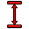 Vertical Dimension — [`Sketcher_ConstrainDistanceY`](https://github.com/FreeCAD/FreeCAD/blob/b9609745048b/src/Mod/Sketcher/Gui/CommandConstraints.cpp) | Constrains the vertical distance between two points, or from a point to the origin if only one is selected | Unspecified; retain original access |
|  Equal Constraint — [`Sketcher_ConstrainEqual`](https://github.com/FreeCAD/FreeCAD/blob/b9609745048b/src/Mod/Sketcher/Gui/CommandConstraints.cpp) | Constrains the selected edges or circles to be equal | Unspecified; retain original access |
|  Group Constraint — [`Sketcher_ConstrainGroup`](https://github.com/FreeCAD/FreeCAD/blob/b9609745048b/src/Mod/Sketcher/Gui/CommandConstraints.cpp) | Constrains the selected geometries together as a single entity.The position and size of the grouped geometries can be defined by constraining the construction line that is generated.Constraints applied to grouped edges are ignored as long as the Group constraint is here. | Unspecified; retain original access |
| Horizontal/Vertical Constraint — [`Sketcher_ConstrainHorVer`](https://github.com/FreeCAD/FreeCAD/blob/b9609745048b/src/Mod/Sketcher/Gui/CommandConstraints.cpp) | Constrains the selected elements either horizontally or vertically, based on their closest alignment | Unspecified; retain original access |
| Horizontal Constraint — [`Sketcher_ConstrainHorizontal`](https://github.com/FreeCAD/FreeCAD/blob/b9609745048b/src/Mod/Sketcher/Gui/CommandConstraints.cpp) | Constrains the selected elements horizontally | Unspecified; retain original access |
|  Lock Position — [`Sketcher_ConstrainLock`](https://github.com/FreeCAD/FreeCAD/blob/b9609745048b/src/Mod/Sketcher/Gui/CommandConstraints.cpp) | Constrains the selected vertices by adding horizontal and vertical distance constraints | Unspecified; retain original access |
|  Parallel Constraint — [`Sketcher_ConstrainParallel`](https://github.com/FreeCAD/FreeCAD/blob/b9609745048b/src/Mod/Sketcher/Gui/CommandConstraints.cpp) | Constrains the selected lines to be parallel | Unspecified; retain original access |
|  Perpendicular Constraint — [`Sketcher_ConstrainPerpendicular`](https://github.com/FreeCAD/FreeCAD/blob/b9609745048b/src/Mod/Sketcher/Gui/CommandConstraints.cpp) | Constrains the selected lines to be perpendicular | Unspecified; retain original access |
| Point-On-Object Constraint — [`Sketcher_ConstrainPointOnObject`](https://github.com/FreeCAD/FreeCAD/blob/b9609745048b/src/Mod/Sketcher/Gui/CommandConstraints.cpp) | Constrains the selected point onto the selected object | Unspecified; retain original access |
|  Radius/Diameter Dimension — [`Sketcher_ConstrainRadiam`](https://github.com/FreeCAD/FreeCAD/blob/b9609745048b/src/Mod/Sketcher/Gui/CommandConstraints.cpp) | Constrains the radius of the selected arc or the diameter of the selected circle | Unspecified; retain original access |
|  Radius Dimension — [`Sketcher_ConstrainRadius`](https://github.com/FreeCAD/FreeCAD/blob/b9609745048b/src/Mod/Sketcher/Gui/CommandConstraints.cpp) | Constrains the radius of the selected circle or arc | Unspecified; retain original access |
|  Refraction Constraint — [`Sketcher_ConstrainSnellsLaw`](https://github.com/FreeCAD/FreeCAD/blob/b9609745048b/src/Mod/Sketcher/Gui/CommandConstraints.cpp) | Constrains the selected elements based on the refraction law (Snell's Law) | Unspecified; retain original access |
|  Symmetric Constraint — [`Sketcher_ConstrainSymmetric`](https://github.com/FreeCAD/FreeCAD/blob/b9609745048b/src/Mod/Sketcher/Gui/CommandConstraints.cpp) | Constrains the selected elements to be symmetric | Unspecified; retain original access |
|  Tangent/Collinear Constraint — [`Sketcher_ConstrainTangent`](https://github.com/FreeCAD/FreeCAD/blob/b9609745048b/src/Mod/Sketcher/Gui/CommandConstraints.cpp) | Constrains the selected elements to be tangent or collinear | Unspecified; retain original access |
| Vertical Constraint — [`Sketcher_ConstrainVertical`](https://github.com/FreeCAD/FreeCAD/blob/b9609745048b/src/Mod/Sketcher/Gui/CommandConstraints.cpp) | Constrains the selected elements vertically | Unspecified; retain original access |
| Copy — [`Sketcher_Copy`](https://github.com/FreeCAD/FreeCAD/blob/b9609745048b/src/Mod/Sketcher/Gui/CommandSketcherTools.cpp) | Creates a simple copy of the geometry taking as reference the last selected point | Unspecified; retain original access |
| Copy Elements — [`Sketcher_CopyClipboard`](https://github.com/FreeCAD/FreeCAD/blob/b9609745048b/src/Mod/Sketcher/Gui/CommandSketcherTools.cpp) | Copies the selected geometries and constraints to the clipboard | Unspecified; retain original access |
| Arc From 3 Points — [`Sketcher_Create3PointArc`](https://github.com/FreeCAD/FreeCAD/blob/b9609745048b/src/Mod/Sketcher/Gui/CommandCreateGeo.cpp) | Creates an arc defined by 2 end points and 1 point on the arc | Unspecified; retain original access |
| Circle From 3 Points — [`Sketcher_Create3PointCircle`](https://github.com/FreeCAD/FreeCAD/blob/b9609745048b/src/Mod/Sketcher/Gui/CommandCreateGeo.cpp) | Creates a circle from 3 perimeter points | Unspecified; retain original access |
| Arc From Center — [`Sketcher_CreateArc`](https://github.com/FreeCAD/FreeCAD/blob/b9609745048b/src/Mod/Sketcher/Gui/CommandCreateGeo.cpp) | Creates an arc defined by a center point and an end point | Unspecified; retain original access |
| Elliptical Arc — [`Sketcher_CreateArcOfEllipse`](https://github.com/FreeCAD/FreeCAD/blob/b9609745048b/src/Mod/Sketcher/Gui/CommandCreateGeo.cpp) | Creates an elliptical arc | Unspecified; retain original access |
| Hyperbolic Arc — [`Sketcher_CreateArcOfHyperbola`](https://github.com/FreeCAD/FreeCAD/blob/b9609745048b/src/Mod/Sketcher/Gui/CommandCreateGeo.cpp) | Creates a hyperbolic arc | Unspecified; retain original access |
| Parabolic Arc — [`Sketcher_CreateArcOfParabola`](https://github.com/FreeCAD/FreeCAD/blob/b9609745048b/src/Mod/Sketcher/Gui/CommandCreateGeo.cpp) | Creates a parabolic arc | Unspecified; retain original access |
| Arc Slot — [`Sketcher_CreateArcSlot`](https://github.com/FreeCAD/FreeCAD/blob/b9609745048b/src/Mod/Sketcher/Gui/CommandCreateGeo.cpp) | Creates an arc slot | Unspecified; retain original access |
| B-Spline — [`Sketcher_CreateBSpline`](https://github.com/FreeCAD/FreeCAD/blob/b9609745048b/src/Mod/Sketcher/Gui/CommandCreateGeo.cpp) | Creates a B-spline curve defined by control points | Unspecified; retain original access |
| B-Spline From Knots — [`Sketcher_CreateBSplineByInterpolation`](https://github.com/FreeCAD/FreeCAD/blob/b9609745048b/src/Mod/Sketcher/Gui/CommandCreateGeo.cpp) | Creates a B-spline from knots, i.e. from interpolation | Unspecified; retain original access |
| Chamfer — [`Sketcher_CreateChamfer`](https://github.com/FreeCAD/FreeCAD/blob/b9609745048b/src/Mod/Sketcher/Gui/CommandCreateGeo.cpp) | Creates a chamfer between 2 selected curves or at coincident points | Unspecified; retain original access |
| Circle From Center — [`Sketcher_CreateCircle`](https://github.com/FreeCAD/FreeCAD/blob/b9609745048b/src/Mod/Sketcher/Gui/CommandCreateGeo.cpp) | Creates a circle from a center and rim point | Unspecified; retain original access |
| Ellipse From 3 Points — [`Sketcher_CreateEllipseBy3Points`](https://github.com/FreeCAD/FreeCAD/blob/b9609745048b/src/Mod/Sketcher/Gui/CommandCreateGeo.cpp) | Creates an ellipse from 3 points on its perimeter | Unspecified; retain original access |
| Ellipse From Center — [`Sketcher_CreateEllipseByCenter`](https://github.com/FreeCAD/FreeCAD/blob/b9609745048b/src/Mod/Sketcher/Gui/CommandCreateGeo.cpp) | Creates an ellipse from a center and rim point | Unspecified; retain original access |
| Fillet — [`Sketcher_CreateFillet`](https://github.com/FreeCAD/FreeCAD/blob/b9609745048b/src/Mod/Sketcher/Gui/CommandCreateGeo.cpp) | Creates a fillet between 2 selected curves or at coincident points | Unspecified; retain original access |
| Heptagon — [`Sketcher_CreateHeptagon`](https://github.com/FreeCAD/FreeCAD/blob/b9609745048b/src/Mod/Sketcher/Gui/CommandCreateGeo.cpp) | Creates a heptagon from a center and corner point | Unspecified; retain original access |
| Hexagon — [`Sketcher_CreateHexagon`](https://github.com/FreeCAD/FreeCAD/blob/b9609745048b/src/Mod/Sketcher/Gui/CommandCreateGeo.cpp) | Creates a hexagon from a center and corner point | Unspecified; retain original access |
| Line — [`Sketcher_CreateLine`](https://github.com/FreeCAD/FreeCAD/blob/b9609745048b/src/Mod/Sketcher/Gui/CommandCreateGeo.cpp) | Creates a line | Unspecified; retain original access |
| Rounded Rectangle — [`Sketcher_CreateOblong`](https://github.com/FreeCAD/FreeCAD/blob/b9609745048b/src/Mod/Sketcher/Gui/CommandCreateGeo.cpp) | Creates a rounded rectangle from 2 corner points | Unspecified; retain original access |
| Octagon — [`Sketcher_CreateOctagon`](https://github.com/FreeCAD/FreeCAD/blob/b9609745048b/src/Mod/Sketcher/Gui/CommandCreateGeo.cpp) | Creates an octagon from a center and corner point | Unspecified; retain original access |
| Pentagon — [`Sketcher_CreatePentagon`](https://github.com/FreeCAD/FreeCAD/blob/b9609745048b/src/Mod/Sketcher/Gui/CommandCreateGeo.cpp) | Creates a pentagon from a center and corner point | Unspecified; retain original access |
| Periodic B-Spline — [`Sketcher_CreatePeriodicBSpline`](https://github.com/FreeCAD/FreeCAD/blob/b9609745048b/src/Mod/Sketcher/Gui/CommandCreateGeo.cpp) | Creates a periodic B-spline curve defined by control points | Unspecified; retain original access |
| Periodic B-Spline From Knots — [`Sketcher_CreatePeriodicBSplineByInterpolation`](https://github.com/FreeCAD/FreeCAD/blob/b9609745048b/src/Mod/Sketcher/Gui/CommandCreateGeo.cpp) | Creates a periodic B-spline defined by knots using interpolation | Unspecified; retain original access |
|  Point — [`Sketcher_CreatePoint`](https://github.com/FreeCAD/FreeCAD/blob/b9609745048b/src/Mod/Sketcher/Gui/CommandCreateGeo.cpp) | Creates a point | Unspecified; retain original access |
| Polyline — [`Sketcher_CreatePolyline`](https://github.com/FreeCAD/FreeCAD/blob/b9609745048b/src/Mod/Sketcher/Gui/CommandCreateGeo.cpp) | Creates a polyline in the sketch. M key cycles through segment modes. | Unspecified; retain original access |
| Polyline — [`Sketcher_CreatePolylineLegacy`](https://github.com/FreeCAD/FreeCAD/blob/b9609745048b/src/Mod/Sketcher/Gui/CommandCreateGeo.cpp) | Creates a continuous polyline. Press the 'M' key to switch segment modes | Unspecified; retain original access |
| Rectangle — [`Sketcher_CreateRectangle`](https://github.com/FreeCAD/FreeCAD/blob/b9609745048b/src/Mod/Sketcher/Gui/CommandCreateGeo.cpp) | Creates a rectangle from 2 corner points | Unspecified; retain original access |
| Centered Rectangle — [`Sketcher_CreateRectangle_Center`](https://github.com/FreeCAD/FreeCAD/blob/b9609745048b/src/Mod/Sketcher/Gui/CommandCreateGeo.cpp) | Creates a centered rectangle from a center and a corner point | Unspecified; retain original access |
| Polygon — [`Sketcher_CreateRegularPolygon`](https://github.com/FreeCAD/FreeCAD/blob/b9609745048b/src/Mod/Sketcher/Gui/CommandCreateGeo.cpp) | Creates a regular polygon from a center and corner point | Unspecified; retain original access |
| Slot — [`Sketcher_CreateSlot`](https://github.com/FreeCAD/FreeCAD/blob/b9609745048b/src/Mod/Sketcher/Gui/CommandCreateGeo.cpp) | Creates a slot | Unspecified; retain original access |
| Square — [`Sketcher_CreateSquare`](https://github.com/FreeCAD/FreeCAD/blob/b9609745048b/src/Mod/Sketcher/Gui/CommandCreateGeo.cpp) | Creates a square from a center and corner point | Unspecified; retain original access |
|  Text — [`Sketcher_CreateText`](https://github.com/FreeCAD/FreeCAD/blob/b9609745048b/src/Mod/Sketcher/Gui/CommandCreateGeo.cpp) | Creates text geometries controlled by a Text constraint. To Edit: Double-click the Text constraint to change the text content and font. To Position/Size: Apply constraints to the group's construction line. Note: While the Text constraint is active, any constraints applied directly to the text geometries will be ignored. | Unspecified; retain original access |
| Triangle — [`Sketcher_CreateTriangle`](https://github.com/FreeCAD/FreeCAD/blob/b9609745048b/src/Mod/Sketcher/Gui/CommandCreateGeo.cpp) | Creates an equilateral triangle from a center and corner point | Unspecified; retain original access |
| Cut Elements — [`Sketcher_Cut`](https://github.com/FreeCAD/FreeCAD/blob/b9609745048b/src/Mod/Sketcher/Gui/CommandSketcherTools.cpp) | Cuts the selected geometries and constraints to the clipboard | Unspecified; retain original access |
| Delete All Constraints — [`Sketcher_DeleteAllConstraints`](https://github.com/FreeCAD/FreeCAD/blob/b9609745048b/src/Mod/Sketcher/Gui/CommandSketcherTools.cpp) | Deletes all constraints in the sketch | Unspecified; retain original access |
| Delete All Geometry — [`Sketcher_DeleteAllGeometry`](https://github.com/FreeCAD/FreeCAD/blob/b9609745048b/src/Mod/Sketcher/Gui/CommandSketcherTools.cpp) | Deletes all geometry and their constraints in the current sketch, with the exception of external geometry | Unspecified; retain original access |
|  Dimension — [`Sketcher_Dimension`](https://github.com/FreeCAD/FreeCAD/blob/b9609745048b/src/Mod/Sketcher/Gui/CommandConstraints.cpp) | Constrains contextually based on the selection. The type can be changed with the M key. | Unspecified; retain original access |
|  Edit Sketch — [`Sketcher_EditSketch`](https://github.com/FreeCAD/FreeCAD/blob/b9609745048b/src/Mod/Sketcher/Gui/Command.cpp) | Opens the selected sketch for editing | Design > Modeling > Sketch > small cluster |
| Extend Edge — [`Sketcher_Extend`](https://github.com/FreeCAD/FreeCAD/blob/b9609745048b/src/Mod/Sketcher/Gui/CommandCreateGeo.cpp) | Extends an edge with respect to the selected position | Unspecified; retain original access |
| Toggle Grid — [`Sketcher_Grid`](https://github.com/FreeCAD/FreeCAD/blob/b9609745048b/src/Mod/Sketcher/Gui/Command.cpp) | Toggles the grid display in the active sketch | Unspecified; retain original access |
| External Intersection — [`Sketcher_Intersection`](https://github.com/FreeCAD/FreeCAD/blob/b9609745048b/src/Mod/Sketcher/Gui/CommandCreateGeo.cpp) | Creates the intersection of external geometry with the sketch plane | Unspecified; retain original access |
|  Join Curves — [`Sketcher_JoinCurves`](https://github.com/FreeCAD/FreeCAD/blob/b9609745048b/src/Mod/Sketcher/Gui/CommandSketcherBSpline.cpp) | Joins 2 curves at selected end points | Unspecified; retain original access |
|  Leave Sketch — [`Sketcher_LeaveSketch`](https://github.com/FreeCAD/FreeCAD/blob/b9609745048b/src/Mod/Sketcher/Gui/Command.cpp) | Finishes editing the active sketch. Press Escape to exit. | Unspecified; retain original access |
|  Attach Sketch — [`Sketcher_MapSketch`](https://github.com/FreeCAD/FreeCAD/blob/b9609745048b/src/Mod/Sketcher/Gui/Command.cpp) | Attaches a sketch to the selected geometry element | Design > Modeling > Sketch > small cluster |
|  Merge Sketches — [`Sketcher_MergeSketches`](https://github.com/FreeCAD/FreeCAD/blob/b9609745048b/src/Mod/Sketcher/Gui/Command.cpp) | Creates a new sketch by merging at least 2 selected sketches | Unspecified; retain original access |
|  Mirror Sketch — [`Sketcher_MirrorSketch`](https://github.com/FreeCAD/FreeCAD/blob/b9609745048b/src/Mod/Sketcher/Gui/Command.cpp) | Creates a new mirrored sketch for each selected sketch by using the X or Y axes, or the origin point, as mirroring reference | Unspecified; retain original access |
| Move — [`Sketcher_Move`](https://github.com/FreeCAD/FreeCAD/blob/b9609745048b/src/Mod/Sketcher/Gui/CommandSketcherTools.cpp) | Moves the geometry taking as reference the last selected point | Unspecified; retain original access |
|  New Sketch — [`Sketcher_NewSketch`](https://github.com/FreeCAD/FreeCAD/blob/b9609745048b/src/Mod/Sketcher/Gui/Command.cpp) | Creates a new sketch | Design > Modeling > Sketch > New Sketch (size not confirmed) |
|  Offset — [`Sketcher_Offset`](https://github.com/FreeCAD/FreeCAD/blob/b9609745048b/src/Mod/Sketcher/Gui/CommandSketcherTools.cpp) | Adds an equidistant closed contour around selected geometry: positive values offset outward, negative values inward | Unspecified; retain original access |
| Paste Elements — [`Sketcher_Paste`](https://github.com/FreeCAD/FreeCAD/blob/b9609745048b/src/Mod/Sketcher/Gui/CommandSketcherTools.cpp) | Pastes the geometries and constraints from the clipboard into the sketch | Unspecified; retain original access |
| Creates a hexagonal profile — [`Sketcher_ProfilesHexagon1`](https://github.com/FreeCAD/FreeCAD/blob/b9609745048b/src/Mod/Sketcher/Profiles.py) | Creates a hexagonal profile in the sketch | Unspecified; retain original access |
| External Projection — [`Sketcher_Projection`](https://github.com/FreeCAD/FreeCAD/blob/b9609745048b/src/Mod/Sketcher/Gui/CommandCreateGeo.cpp) | Creates the projection of external geometry in the sketch plane | Unspecified; retain original access |
| Rectangular Array — [`Sketcher_RectangularArray`](https://github.com/FreeCAD/FreeCAD/blob/b9609745048b/src/Mod/Sketcher/Gui/CommandSketcherTools.cpp) | Creates a rectangular array pattern of the geometry taking as reference the last selected point | Unspecified; retain original access |
|  Remove Axes Alignment — [`Sketcher_RemoveAxesAlignment`](https://github.com/FreeCAD/FreeCAD/blob/b9609745048b/src/Mod/Sketcher/Gui/CommandSketcherTools.cpp) | Modifies the constraints to remove axes alignment while trying to preserve the constraint relationship of the selection | Unspecified; retain original access |
| Rendering Order — [`Sketcher_RenderingOrder`](https://github.com/FreeCAD/FreeCAD/blob/b9609745048b/src/Mod/Sketcher/Gui/Command.cpp) | Reorders items in the rendering order | Unspecified; retain original access |
|  Reorient Sketch — [`Sketcher_ReorientSketch`](https://github.com/FreeCAD/FreeCAD/blob/b9609745048b/src/Mod/Sketcher/Gui/Command.cpp) | Places the selected sketch on one of the global coordinate planes. This will clear the AttachmentSupport property. | Unspecified; retain original access |
|  Toggle Internal Geometry — [`Sketcher_RestoreInternalAlignmentGeometry`](https://github.com/FreeCAD/FreeCAD/blob/b9609745048b/src/Mod/Sketcher/Gui/CommandSketcherTools.cpp) | Toggles the visibility of all internal geometry | Unspecified; retain original access |
|  Rotate / Polar Transform — [`Sketcher_Rotate`](https://github.com/FreeCAD/FreeCAD/blob/b9609745048b/src/Mod/Sketcher/Gui/CommandSketcherTools.cpp) | Rotates the selected geometry by creating 'n' total elements, enabling circular pattern creation | Unspecified; retain original access |
|  Scale — [`Sketcher_Scale`](https://github.com/FreeCAD/FreeCAD/blob/b9609745048b/src/Mod/Sketcher/Gui/CommandSketcherTools.cpp) | Scales the selected geometries | Unspecified; retain original access |
| Select Conflicting Constraints — [`Sketcher_SelectConflictingConstraints`](https://github.com/FreeCAD/FreeCAD/blob/b9609745048b/src/Mod/Sketcher/Gui/CommandSketcherTools.cpp) | Selects all conflicting constraints | Unspecified; retain original access |
|  Select Associated Constraints — [`Sketcher_SelectConstraints`](https://github.com/FreeCAD/FreeCAD/blob/b9609745048b/src/Mod/Sketcher/Gui/CommandSketcherTools.cpp) | Selects the constraints associated with the selected geometrical elements | Unspecified; retain original access |
|  Select Associated Geometry — [`Sketcher_SelectElementsAssociatedWithConstraints`](https://github.com/FreeCAD/FreeCAD/blob/b9609745048b/src/Mod/Sketcher/Gui/Workbench.cpp) | Native Select Associated Geometry action; detailed behavior follows the original workbench help. | Unspecified; retain original access |
| Select Under-Constrained Elements — [`Sketcher_SelectElementsWithDoFs`](https://github.com/FreeCAD/FreeCAD/blob/b9609745048b/src/Mod/Sketcher/Gui/CommandSketcherTools.cpp) | Selects geometrical elements where the solver still detects unconstrained degrees of freedom | Unspecified; retain original access |
| Select Horizontal Axis — [`Sketcher_SelectHorizontalAxis`](https://github.com/FreeCAD/FreeCAD/blob/b9609745048b/src/Mod/Sketcher/Gui/CommandSketcherTools.cpp) | Selects the local horizontal axis of the sketch | Unspecified; retain original access |
| Select Malformed Constraints — [`Sketcher_SelectMalformedConstraints`](https://github.com/FreeCAD/FreeCAD/blob/b9609745048b/src/Mod/Sketcher/Gui/CommandSketcherTools.cpp) | Selects all malformed constraints | Unspecified; retain original access |
| Select Origin — [`Sketcher_SelectOrigin`](https://github.com/FreeCAD/FreeCAD/blob/b9609745048b/src/Mod/Sketcher/Gui/CommandSketcherTools.cpp) | Selects the local origin point of the sketch | Unspecified; retain original access |
| Select Partially Redundant Constraints — [`Sketcher_SelectPartiallyRedundantConstraints`](https://github.com/FreeCAD/FreeCAD/blob/b9609745048b/src/Mod/Sketcher/Gui/CommandSketcherTools.cpp) | Selects all partially redundant constraints | Unspecified; retain original access |
| Select Redundant Constraints — [`Sketcher_SelectRedundantConstraints`](https://github.com/FreeCAD/FreeCAD/blob/b9609745048b/src/Mod/Sketcher/Gui/CommandSketcherTools.cpp) | Selects all redundant constraints | Unspecified; retain original access |
| Select Vertical Axis — [`Sketcher_SelectVerticalAxis`](https://github.com/FreeCAD/FreeCAD/blob/b9609745048b/src/Mod/Sketcher/Gui/CommandSketcherTools.cpp) | Selects the local vertical axis of the sketch | Unspecified; retain original access |
| Toggle Snap — [`Sketcher_Snap`](https://github.com/FreeCAD/FreeCAD/blob/b9609745048b/src/Mod/Sketcher/Gui/Command.cpp) | Toggles snapping | Unspecified; retain original access |
| Split Edge — [`Sketcher_Split`](https://github.com/FreeCAD/FreeCAD/blob/b9609745048b/src/Mod/Sketcher/Gui/CommandCreateGeo.cpp) | Splits an edge into 2 segments while preserving constraints | Unspecified; retain original access |
| Stop Operation — [`Sketcher_StopOperation`](https://github.com/FreeCAD/FreeCAD/blob/b9609745048b/src/Mod/Sketcher/Gui/Command.cpp) | Stops the active operation while in edit mode | Unspecified; retain original access |
|  Switch Virtual Space — [`Sketcher_SwitchVirtualSpace`](https://github.com/FreeCAD/FreeCAD/blob/b9609745048b/src/Mod/Sketcher/Gui/CommandSketcherVirtualSpace.cpp) | Switches the selected constraints or the view to the other virtual space | Unspecified; retain original access |
|  Mirror — [`Sketcher_Symmetry`](https://github.com/FreeCAD/FreeCAD/blob/b9609745048b/src/Mod/Sketcher/Gui/CommandSketcherTools.cpp) | Creates a mirrored copy of the selected geometry | Unspecified; retain original access |
| Toggle Constraints — [`Sketcher_ToggleActiveConstraint`](https://github.com/FreeCAD/FreeCAD/blob/b9609745048b/src/Mod/Sketcher/Gui/CommandConstraints.cpp) | Toggles the state of the selected constraints | Unspecified; retain original access |
|  Toggle Construction Geometry — [`Sketcher_ToggleConstruction`](https://github.com/FreeCAD/FreeCAD/blob/b9609745048b/src/Mod/Sketcher/Gui/CommandAlterGeometry.cpp) | Toggles between defining geometry and construction geometry modes | Unspecified; retain original access |
| Toggle Driving/Reference Constraints — [`Sketcher_ToggleDrivingConstraint`](https://github.com/FreeCAD/FreeCAD/blob/b9609745048b/src/Mod/Sketcher/Gui/CommandConstraints.cpp) | Toggles between driving and reference mode of the selected constraints and commands | Unspecified; retain original access |
|  Move / Array Transform — [`Sketcher_Translate`](https://github.com/FreeCAD/FreeCAD/blob/b9609745048b/src/Mod/Sketcher/Gui/CommandSketcherTools.cpp) | Translates the selected geometries and enables the creation of 'i' * 'j' total elements | Unspecified; retain original access |
| Trim Edge — [`Sketcher_Trimming`](https://github.com/FreeCAD/FreeCAD/blob/b9609745048b/src/Mod/Sketcher/Gui/CommandCreateGeo.cpp) | Trims an edge with respect to the selected position | Unspecified; retain original access |
|  Validate Sketch — [`Sketcher_ValidateSketch`](https://github.com/FreeCAD/FreeCAD/blob/b9609745048b/src/Mod/Sketcher/Gui/Command.cpp) | Validates a sketch by checking for missing coincidences, invalid constraints, and degenerate geometry | Unspecified; retain original access |
|  Toggle Section View — [`Sketcher_ViewSection`](https://github.com/FreeCAD/FreeCAD/blob/b9609745048b/src/Mod/Sketcher/Gui/Command.cpp) | Toggles between section view and full view | Unspecified; retain original access |
|  Align View to Sketch — [`Sketcher_ViewSketch`](https://github.com/FreeCAD/FreeCAD/blob/b9609745048b/src/Mod/Sketcher/Gui/Command.cpp) | Aligns the camera orientation perpendicular to the active sketch plane | Unspecified; retain original access |
### Spreadsheet

| Button / command | Short description | FC Plus placement |
| --- | --- | --- |
|  Align Bottom — [`Spreadsheet_AlignBottom`](https://github.com/FreeCAD/FreeCAD/blob/b9609745048b/src/Mod/Spreadsheet/Gui/Command.cpp) | Aligns cell contents to the bottom | Unspecified; retain original access |
|  Align Horizontal Center — [`Spreadsheet_AlignCenter`](https://github.com/FreeCAD/FreeCAD/blob/b9609745048b/src/Mod/Spreadsheet/Gui/Command.cpp) | Aligns cell contents to the horizontal center | Unspecified; retain original access |
|  Align Left — [`Spreadsheet_AlignLeft`](https://github.com/FreeCAD/FreeCAD/blob/b9609745048b/src/Mod/Spreadsheet/Gui/Command.cpp) | Aligns cell contents to the left | Unspecified; retain original access |
|  Align Right — [`Spreadsheet_AlignRight`](https://github.com/FreeCAD/FreeCAD/blob/b9609745048b/src/Mod/Spreadsheet/Gui/Command.cpp) | Aligns cell contents to the right | Unspecified; retain original access |
|  Align Top — [`Spreadsheet_AlignTop`](https://github.com/FreeCAD/FreeCAD/blob/b9609745048b/src/Mod/Spreadsheet/Gui/Command.cpp) | Aligns cell contents to the top | Unspecified; retain original access |
|  Align Vertical Center — [`Spreadsheet_AlignVCenter`](https://github.com/FreeCAD/FreeCAD/blob/b9609745048b/src/Mod/Spreadsheet/Gui/Command.cpp) | Aligns cell contents to the vertical center | Unspecified; retain original access |
|  New Spreadsheet — [`Spreadsheet_CreateSheet`](https://github.com/FreeCAD/FreeCAD/blob/b9609745048b/src/Mod/Spreadsheet/Gui/Command.cpp) | Creates a new spreadsheet | Unspecified; retain original access |
|  Export Spreadsheet — [`Spreadsheet_Export`](https://github.com/FreeCAD/FreeCAD/blob/b9609745048b/src/Mod/Spreadsheet/Gui/Command.cpp) | Exports the spreadsheet to a CSV file | Unspecified; retain original access |
|  Import Spreadsheet — [`Spreadsheet_Import`](https://github.com/FreeCAD/FreeCAD/blob/b9609745048b/src/Mod/Spreadsheet/Gui/Command.cpp) | Imports a CSV file into a new spreadsheet | Unspecified; retain original access |
|  Merge Cells — [`Spreadsheet_MergeCells`](https://github.com/FreeCAD/FreeCAD/blob/b9609745048b/src/Mod/Spreadsheet/Gui/Command.cpp) | Merges the selected cells | Unspecified; retain original access |
|  Set Alias — [`Spreadsheet_SetAlias`](https://github.com/FreeCAD/FreeCAD/blob/b9609745048b/src/Mod/Spreadsheet/Gui/Command.cpp) | Sets an alias for the selected cell | Unspecified; retain original access |
|  Split Cell — [`Spreadsheet_SplitCell`](https://github.com/FreeCAD/FreeCAD/blob/b9609745048b/src/Mod/Spreadsheet/Gui/Command.cpp) | Splits a previously merged cell | Unspecified; retain original access |
|  Bold Text — [`Spreadsheet_StyleBold`](https://github.com/FreeCAD/FreeCAD/blob/b9609745048b/src/Mod/Spreadsheet/Gui/Command.cpp) | Sets the text in the selected cells bold | Unspecified; retain original access |
|  Italic Text — [`Spreadsheet_StyleItalic`](https://github.com/FreeCAD/FreeCAD/blob/b9609745048b/src/Mod/Spreadsheet/Gui/Command.cpp) | Sets the text in the selected cells italic | Unspecified; retain original access |
|  Underline Text — [`Spreadsheet_StyleUnderline`](https://github.com/FreeCAD/FreeCAD/blob/b9609745048b/src/Mod/Spreadsheet/Gui/Command.cpp) | Underlines the text in the selected cells | Unspecified; retain original access |
### Start

| Button / command | Short description | FC Plus placement |
| --- | --- | --- |
| Start Page — [`Start_Start`](https://github.com/FreeCAD/FreeCAD/blob/b9609745048b/src/Mod/Start/Gui/Manipulator.cpp) | Displays the start page | Unspecified; retain original access |
### Surface

| Button / command | Short description | FC Plus placement |
| --- | --- | --- |
|  Blend Curve — [`Surface_BlendCurve`](https://github.com/FreeCAD/FreeCAD/blob/b9609745048b/src/Mod/Surface/Gui/Command.cpp) | Joins 2 edges with continuity | Unspecified; retain original access |
|  Curve on Mesh — [`Surface_CurveOnMesh`](https://github.com/FreeCAD/FreeCAD/blob/b9609745048b/src/Mod/Surface/Gui/Command.cpp) | Creates an approximated curve on top of a mesh. This command only works with a mesh object. | Unspecified; retain original access |
| Surface Cut — [`Surface_Cut`](https://github.com/FreeCAD/FreeCAD/blob/b9609745048b/src/Mod/Surface/Gui/Command.cpp) | Cuts one shape using another | Unspecified; retain original access |
|  Extend Face — [`Surface_ExtendFace`](https://github.com/FreeCAD/FreeCAD/blob/b9609745048b/src/Mod/Surface/Gui/Command.cpp) | Extrapolates the selected face or surface at its boundaries with its local U and V parameters | Unspecified; retain original access |
|  Filling — [`Surface_Filling`](https://github.com/FreeCAD/FreeCAD/blob/b9609745048b/src/Mod/Surface/Gui/Command.cpp) | Creates a surface from a series of selected boundary edges. Additionally, the surface may be constrained by edges and vertices that are not on the boundary. | Unspecified; retain original access |
|  Fill Boundary Curves — [`Surface_GeomFillSurface`](https://github.com/FreeCAD/FreeCAD/blob/b9609745048b/src/Mod/Surface/Gui/Command.cpp) | Creates a surface from 2, 3, or 4 boundary edges | Unspecified; retain original access |
|  Sections — [`Surface_Sections`](https://github.com/FreeCAD/FreeCAD/blob/b9609745048b/src/Mod/Surface/Gui/Command.cpp) | Creates a surface from a series of sectional edges | Unspecified; retain original access |
### Tech Draw

| Button / command | Short description | FC Plus placement |
| --- | --- | --- |
| Centerline Between 2 Lines — [`TechDraw_2LineCenterLine`](https://github.com/FreeCAD/FreeCAD/blob/b9609745048b/src/Mod/TechDraw/Gui/CommandAnnotate.cpp) | Adds a centerline between 2 selected lines | Unspecified; retain original access |
| Centerline Between 2 Points — [`TechDraw_2PointCenterLine`](https://github.com/FreeCAD/FreeCAD/blob/b9609745048b/src/Mod/TechDraw/Gui/CommandAnnotate.cpp) | Adds a centerline between 2 selected points | Unspecified; retain original access |
| 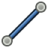 Cosmetic Line Through 2 Points — [`TechDraw_2PointCosmeticLine`](https://github.com/FreeCAD/FreeCAD/blob/b9609745048b/src/Mod/TechDraw/Gui/CommandAnnotate.cpp) | Adds a cosmetic line that passes through 2 selected points | Unspecified; retain original access |
|  Angle Dimension From 3 Points — [`TechDraw_3PtAngleDimension`](https://github.com/FreeCAD/FreeCAD/blob/b9609745048b/src/Mod/TechDraw/Gui/CommandCreateDims.cpp) | Inserts an angle dimension between 3 selected points | Unspecified; retain original access |
|  Active View — [`TechDraw_ActiveView`](https://github.com/FreeCAD/FreeCAD/blob/b9609745048b/src/Mod/TechDraw/Gui/Command.cpp) | Inserts an image of the open 3D view in the current page. If multiple 3D views are open, a selection dialog will be shown. | Unspecified; retain original access |
| Align Vertices/Edge Horizontally — [`TechDraw_AlignVertexesHorizontally`](https://github.com/FreeCAD/FreeCAD/blob/b9609745048b/src/Mod/TechDraw/Gui/CommandAlign.cpp) | Aligns the selected vertices or edges horizontally to the view rotation | Unspecified; retain original access |
| Align Vertices/Edge Vertically — [`TechDraw_AlignVertexesVertically`](https://github.com/FreeCAD/FreeCAD/blob/b9609745048b/src/Mod/TechDraw/Gui/CommandAlign.cpp) | Aligns the selected vertices or edges vertically to the view rotation | Unspecified; retain original access |
|  Angle Dimension — [`TechDraw_AngleDimension`](https://github.com/FreeCAD/FreeCAD/blob/b9609745048b/src/Mod/TechDraw/Gui/CommandCreateDims.cpp) | Inserts an angle dimension between two edges | Unspecified; retain original access |
| Text Annotation — [`TechDraw_Annotation`](https://github.com/FreeCAD/FreeCAD/blob/b9609745048b/src/Mod/TechDraw/Gui/CommandAnnotate.cpp) | Inserts an editable text block annotation to the current page | Unspecified; retain original access |
| BIM View — [`TechDraw_ArchView`](https://github.com/FreeCAD/FreeCAD/blob/b9609745048b/src/Mod/TechDraw/Gui/Command.cpp) | Inserts a view of a BIM section plane | Unspecified; retain original access |
|  Area Annotation — [`TechDraw_AreaDimension`](https://github.com/FreeCAD/FreeCAD/blob/b9609745048b/src/Mod/TechDraw/Gui/CommandCreateDims.cpp) | Inserts an annotation showing the area of a selected face | Unspecified; retain original access |
|  Axonometric Length Dimension — [`TechDraw_AxoLengthDimension`](https://github.com/FreeCAD/FreeCAD/blob/b9609745048b/src/Mod/TechDraw/TechDrawTools/CommandAxoLengthDimension.py) | Creates a length dimension in with axonometric view, using selected edges or vertex pairs to define direction and measurement | Unspecified; retain original access |
|  Balloon Annotation — [`TechDraw_Balloon`](https://github.com/FreeCAD/FreeCAD/blob/b9609745048b/src/Mod/TechDraw/Gui/Command.cpp) | Inserts a new balloon annotation in the selected view | Unspecified; retain original access |
|  Broken View — [`TechDraw_BrokenView`](https://github.com/FreeCAD/FreeCAD/blob/b9609745048b/src/Mod/TechDraw/Gui/Command.cpp) | Inserts a new broken view for the selected objects or base view and break definition objects | Unspecified; retain original access |
|  Centerline — [`TechDraw_CenterLineGroup`](https://github.com/FreeCAD/FreeCAD/blob/b9609745048b/src/Mod/TechDraw/Gui/CommandAnnotate.cpp) | Inserts a centerline to a face, or between 2 lines or edges | Unspecified; retain original access |
| 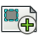 Clip Group — [`TechDraw_ClipGroup`](https://github.com/FreeCAD/FreeCAD/blob/b9609745048b/src/Mod/TechDraw/Gui/Command.cpp) | Inserts a new clip group for the selected view | Unspecified; retain original access |
| Add View To Clip Group — [`TechDraw_ClipGroupAdd`](https://github.com/FreeCAD/FreeCAD/blob/b9609745048b/src/Mod/TechDraw/Gui/Command.cpp) | Adds the selected view to a clip group | Unspecified; retain original access |
| Remove From Clip Group — [`TechDraw_ClipGroupRemove`](https://github.com/FreeCAD/FreeCAD/blob/b9609745048b/src/Mod/TechDraw/Gui/Command.cpp) | Removes a view based on the selected clip group | Unspecified; retain original access |
|  Offset Vertex — [`TechDraw_CommandAddOffsetVertex`](https://github.com/FreeCAD/FreeCAD/blob/b9609745048b/src/Mod/TechDraw/TechDrawTools/CommandVertexCreations.py) | Creates an offset from one selected vertex | Unspecified; retain original access |
|  Cosmetic Intersection Vertices — [`TechDraw_CommandVertexCreationGroup`](https://github.com/FreeCAD/FreeCAD/blob/b9609745048b/src/Mod/TechDraw/TechDrawTools/CommandVertexCreations.py) | Adds cosmetic vertices at the intersectionss of selected edges | Unspecified; retain original access |
|  Dimension — [`TechDraw_CompDimensionTools`](https://github.com/FreeCAD/FreeCAD/blob/b9609745048b/src/Mod/TechDraw/Gui/Workbench.cpp) | Native Dimension action; detailed behavior follows the original workbench help. | Unspecified; retain original access |
| Complex Section View — [`TechDraw_ComplexSection`](https://github.com/FreeCAD/FreeCAD/blob/b9609745048b/src/Mod/TechDraw/Gui/Command.cpp) | Inserts a complex section view based on the selected view in the current page | Unspecified; retain original access |
| Cosmetic 1 Point Circle — [`TechDraw_CosmeticCircle`](https://github.com/FreeCAD/FreeCAD/blob/b9609745048b/src/Mod/TechDraw/Gui/CommandExtensionPack.cpp) | Adds a cosmetic circle based on a selected centerpoint | Unspecified; retain original access |
| Remove Cosmetic Object — [`TechDraw_CosmeticEraser`](https://github.com/FreeCAD/FreeCAD/blob/b9609745048b/src/Mod/TechDraw/Gui/CommandAnnotate.cpp) | Removes the selected cosmetic object from the page | Unspecified; retain original access |
| Cosmetic Vertex — [`TechDraw_CosmeticVertex`](https://github.com/FreeCAD/FreeCAD/blob/b9609745048b/src/Mod/TechDraw/Gui/CommandAnnotate.cpp) | Adds a cosmetic vertex | Unspecified; retain original access |
|  Cosmetic Vertex — [`TechDraw_CosmeticVertexGroup`](https://github.com/FreeCAD/FreeCAD/blob/b9609745048b/src/Mod/TechDraw/Gui/CommandAnnotate.cpp) | Inserts a cosmetic vertex | Unspecified; retain original access |
|  Edit Line Appearance — [`TechDraw_DecorateLine`](https://github.com/FreeCAD/FreeCAD/blob/b9609745048b/src/Mod/TechDraw/Gui/CommandAnnotate.cpp) | Opens the 'Line decoration' dialog to edit the selected lines | Unspecified; retain original access |
|  Detail View — [`TechDraw_DetailView`](https://github.com/FreeCAD/FreeCAD/blob/b9609745048b/src/Mod/TechDraw/Gui/Command.cpp) | Inserts a new detail view based on the selected view in the current page | Unspecified; retain original access |
|  Diameter Dimension — [`TechDraw_DiameterDimension`](https://github.com/FreeCAD/FreeCAD/blob/b9609745048b/src/Mod/TechDraw/Gui/CommandCreateDims.cpp) | Inserts a diameter dimension of a circular edge or arc | Unspecified; retain original access |
|  Dimension — [`TechDraw_Dimension`](https://github.com/FreeCAD/FreeCAD/blob/b9609745048b/src/Mod/TechDraw/Gui/CommandCreateDims.cpp) | Inserts new contextual dimensions to the selection. Depending on your selection you might have several dimensions available. You can cycle through them using the M key. Left clicking on empty space will validate the current dimension. Right clicking or pressing Esc will cancel. | Unspecified; retain original access |
|  Repair Dimension References — [`TechDraw_DimensionRepair`](https://github.com/FreeCAD/FreeCAD/blob/b9609745048b/src/Mod/TechDraw/Gui/CommandCreateDims.cpp) | Repairs broken or incorrect dimension references | Unspecified; retain original access |
|  Draft View — [`TechDraw_DraftView`](https://github.com/FreeCAD/FreeCAD/blob/b9609745048b/src/Mod/TechDraw/Gui/Command.cpp) | Inserts a view of a Draft object | Unspecified; retain original access |
|  Export Page as DXF — [`TechDraw_ExportPageDXF`](https://github.com/FreeCAD/FreeCAD/blob/b9609745048b/src/Mod/TechDraw/Gui/Command.cpp) | Exports the current page as a DXF | Unspecified; retain original access |
| Export Page as PDF — [`TechDraw_ExportPagePDF`](https://github.com/FreeCAD/FreeCAD/blob/b9609745048b/src/Mod/TechDraw/Gui/Command.cpp) | Exports the current page as a PDF | Unspecified; retain original access |
|  Export Page as SVG — [`TechDraw_ExportPageSVG`](https://github.com/FreeCAD/FreeCAD/blob/b9609745048b/src/Mod/TechDraw/Gui/Command.cpp) | Exports the current page as an SVG | Unspecified; retain original access |
|  Arc Length Annotation — [`TechDraw_ExtensionArcLengthAnnotation`](https://github.com/FreeCAD/FreeCAD/blob/b9609745048b/src/Mod/TechDraw/Gui/CommandExtensionPack.cpp) | Inserts an annotation with the calculated arc length of the selected edges | Unspecified; retain original access |
|  Area Annotation — [`TechDraw_ExtensionAreaAnnotation`](https://github.com/FreeCAD/FreeCAD/blob/b9609745048b/src/Mod/TechDraw/Gui/CommandExtensionPack.cpp) | Calculates the area of multiple selected faces | Unspecified; retain original access |
| Cascade Horizontal Dimensions — [`TechDraw_ExtensionCascadeDimensionGroup`](https://github.com/FreeCAD/FreeCAD/blob/b9609745048b/src/Mod/TechDraw/Gui/CommandExtensionDims.cpp) | Native Cascade Horizontal Dimensions action; detailed behavior follows the original workbench help. | Unspecified; retain original access |
| Cascade Horizontal Dimensions — [`TechDraw_ExtensionCascadeHorizDimension`](https://github.com/FreeCAD/FreeCAD/blob/b9609745048b/src/Mod/TechDraw/Gui/CommandExtensionDims.cpp) | Native Cascade Horizontal Dimensions action; detailed behavior follows the original workbench help. | Unspecified; retain original access |
| Cascade Oblique Dimensions — [`TechDraw_ExtensionCascadeObliqueDimension`](https://github.com/FreeCAD/FreeCAD/blob/b9609745048b/src/Mod/TechDraw/Gui/CommandExtensionDims.cpp) | Native Cascade Oblique Dimensions action; detailed behavior follows the original workbench help. | Unspecified; retain original access |
| Cascade Vertical Dimensions — [`TechDraw_ExtensionCascadeVertDimension`](https://github.com/FreeCAD/FreeCAD/blob/b9609745048b/src/Mod/TechDraw/Gui/CommandExtensionDims.cpp) | Native Cascade Vertical Dimensions action; detailed behavior follows the original workbench help. | Unspecified; retain original access |
| 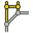 Horizontal Chamfer Dimension — [`TechDraw_ExtensionChamferDimensionGroup`](https://github.com/FreeCAD/FreeCAD/blob/b9609745048b/src/Mod/TechDraw/Gui/CommandExtensionDims.cpp) | Inserts a horizontal size and angle dimension for a chamfer from 2 selected vertices | Unspecified; retain original access |
|  Change Line Attributes — [`TechDraw_ExtensionChangeLineAttributes`](https://github.com/FreeCAD/FreeCAD/blob/b9609745048b/src/Mod/TechDraw/Gui/CommandExtensionPack.cpp) | Changes the selected cosmetic lines and centerlines to the specified attributes | Unspecified; retain original access |
| Circle Centerlines — [`TechDraw_ExtensionCircleCenterLines`](https://github.com/FreeCAD/FreeCAD/blob/b9609745048b/src/Mod/TechDraw/Gui/CommandExtensionPack.cpp) | Adds centerlines to the selected circles and arcs | Unspecified; retain original access |
|  Circle Centerlines — [`TechDraw_ExtensionCircleCenterLinesGroup`](https://github.com/FreeCAD/FreeCAD/blob/b9609745048b/src/Mod/TechDraw/Gui/CommandExtensionPack.cpp) | Adds centerlines to selected circles and arcs | Unspecified; retain original access |
|  Horizontal Chain Dimension — [`TechDraw_ExtensionCreateChainDimensionGroup`](https://github.com/FreeCAD/FreeCAD/blob/b9609745048b/src/Mod/TechDraw/Gui/CommandExtensionDims.cpp) | Inserts a sequence of aligned horizontal dimensions to at least three selected vertices, where the first two define the direction | Unspecified; retain original access |
|  Horizontal Coordinate Dimension — [`TechDraw_ExtensionCreateCoordDimensionGroup`](https://github.com/FreeCAD/FreeCAD/blob/b9609745048b/src/Mod/TechDraw/Gui/CommandExtensionDims.cpp) | Adds evenly spaced horizontal dimensions between 3 or more vertices aligned to a shared baseline | Unspecified; retain original access |
| Horizontal Chain Dimension — [`TechDraw_ExtensionCreateHorizChainDimension`](https://github.com/FreeCAD/FreeCAD/blob/b9609745048b/src/Mod/TechDraw/Gui/CommandExtensionDims.cpp) | Inserts a sequence of aligned horizontal dimensions to at least three selected vertices | Unspecified; retain original access |
| Horizontal Chamfer Dimension — [`TechDraw_ExtensionCreateHorizChamferDimension`](https://github.com/FreeCAD/FreeCAD/blob/b9609745048b/src/Mod/TechDraw/Gui/CommandExtensionDims.cpp) | Inserts a horizontal size and angle dimension for a chamfer from 2 selected vertices | Unspecified; retain original access |
| Horizontal Coordinate Dimension — [`TechDraw_ExtensionCreateHorizCoordDimension`](https://github.com/FreeCAD/FreeCAD/blob/b9609745048b/src/Mod/TechDraw/Gui/CommandExtensionDims.cpp) | Adds evenly spaced horizontal dimensions between 3 or more vertices aligned to a shared baseline | Unspecified; retain original access |
|  Arc Length Dimension — [`TechDraw_ExtensionCreateLengthArc`](https://github.com/FreeCAD/FreeCAD/blob/b9609745048b/src/Mod/TechDraw/Gui/CommandExtensionDims.cpp) | Inserts an arc length dimension to the selected arc | Unspecified; retain original access |
| Oblique Chain Dimension — [`TechDraw_ExtensionCreateObliqueChainDimension`](https://github.com/FreeCAD/FreeCAD/blob/b9609745048b/src/Mod/TechDraw/Gui/CommandExtensionDims.cpp) | Inserts a sequence of aligned oblique dimensions to at least three selected vertices, where the first two define the direction | Unspecified; retain original access |
| Oblique Coordinate Dimension — [`TechDraw_ExtensionCreateObliqueCoordDimension`](https://github.com/FreeCAD/FreeCAD/blob/b9609745048b/src/Mod/TechDraw/Gui/CommandExtensionDims.cpp) | Adds evenly spaced oblique dimensions between 3 or more vertices aligned to a shared baseline | Unspecified; retain original access |
| Vertical Chain Dimension — [`TechDraw_ExtensionCreateVertChainDimension`](https://github.com/FreeCAD/FreeCAD/blob/b9609745048b/src/Mod/TechDraw/Gui/CommandExtensionDims.cpp) | Inserts a sequence of aligned vertical dimensions to at least three selected vertices | Unspecified; retain original access |
| Vertical Chamfer Dimension — [`TechDraw_ExtensionCreateVertChamferDimension`](https://github.com/FreeCAD/FreeCAD/blob/b9609745048b/src/Mod/TechDraw/Gui/CommandExtensionDims.cpp) | Inserts a vertical size and angle dimension for a chamfer from 2 selected vertices | Unspecified; retain original access |
| Vertical Coordinate Dimension — [`TechDraw_ExtensionCreateVertCoordDimension`](https://github.com/FreeCAD/FreeCAD/blob/b9609745048b/src/Mod/TechDraw/Gui/CommandExtensionDims.cpp) | Adds evenly spaced vertical dimensions between 3 or more vertices aligned to a shared baseline | Unspecified; retain original access |
|  Customize Format Label — [`TechDraw_ExtensionCustomizeFormat`](https://github.com/FreeCAD/FreeCAD/blob/b9609745048b/src/Mod/TechDraw/Gui/CommandExtensionDims.cpp) | Customizes the format label of a selected dimension or balloon | Unspecified; retain original access |
| Decrease Decimal Places — [`TechDraw_ExtensionDecreaseDecimal`](https://github.com/FreeCAD/FreeCAD/blob/b9609745048b/src/Mod/TechDraw/Gui/CommandExtensionDims.cpp) | Decreases the number of decimal places of the dimension | Unspecified; retain original access |
|  Cosmetic 1 Point Circle — [`TechDraw_ExtensionDrawCirclesGroup`](https://github.com/FreeCAD/FreeCAD/blob/b9609745048b/src/Mod/TechDraw/Gui/CommandExtensionPack.cpp) | Adds a cosmetic circle based on two vertices, where the first selection is the centerpoint and the second is the radius | Unspecified; retain original access |
| Cosmetic Arc — [`TechDraw_ExtensionDrawCosmArc`](https://github.com/FreeCAD/FreeCAD/blob/b9609745048b/src/Mod/TechDraw/Gui/CommandExtensionPack.cpp) | Adds a cosmetic counter clockwise arc based on three vertices, where the first selection is the center point and the second is the radius and start point | Unspecified; retain original access |
| Cosmetic 2 Point Circle — [`TechDraw_ExtensionDrawCosmCircle`](https://github.com/FreeCAD/FreeCAD/blob/b9609745048b/src/Mod/TechDraw/Gui/CommandExtensionPack.cpp) | Adds a cosmetic circle based on two selected vertices, where the first is the center point and the second is the radius | Unspecified; retain original access |
| Cosmetic 3 Point Circle — [`TechDraw_ExtensionDrawCosmCircle3Points`](https://github.com/FreeCAD/FreeCAD/blob/b9609745048b/src/Mod/TechDraw/Gui/CommandExtensionPack.cpp) | Adds a cosmetic circle that passes through 3 selected perimeter points | Unspecified; retain original access |
| Extend Line — [`TechDraw_ExtensionExtendLine`](https://github.com/FreeCAD/FreeCAD/blob/b9609745048b/src/Mod/TechDraw/Gui/CommandExtensionPack.cpp) | Extends a selected cosmetic line or centerline at both ends by the specified delta distance | Unspecified; retain original access |
|  Extend Line — [`TechDraw_ExtensionExtendShortenLineGroup`](https://github.com/FreeCAD/FreeCAD/blob/b9609745048b/src/Mod/TechDraw/Gui/CommandExtensionPack.cpp) | Extends a selected cosmetic line or centerline at both ends by the specified delta distance | Unspecified; retain original access |
| Bolt Circle Centerlines — [`TechDraw_ExtensionHoleCircle`](https://github.com/FreeCAD/FreeCAD/blob/b9609745048b/src/Mod/TechDraw/Gui/CommandExtensionPack.cpp) | Adds centerlines to a circular pattern of three or more selected circles | Unspecified; retain original access |
| Increase Decimal Places — [`TechDraw_ExtensionIncreaseDecimal`](https://github.com/FreeCAD/FreeCAD/blob/b9609745048b/src/Mod/TechDraw/Gui/CommandExtensionDims.cpp) | Increases the number of decimal places of the dimension | Unspecified; retain original access |
|  Increase Decimal Places — [`TechDraw_ExtensionIncreaseDecreaseGroup`](https://github.com/FreeCAD/FreeCAD/blob/b9609745048b/src/Mod/TechDraw/Gui/CommandExtensionDims.cpp) | Increases the number of decimal places of the dimension | Unspecified; retain original access |
| Insert '⌀' Prefix — [`TechDraw_ExtensionInsertDiameter`](https://github.com/FreeCAD/FreeCAD/blob/b9609745048b/src/Mod/TechDraw/Gui/CommandExtensionDims.cpp) | Inserts a '⌀' symbol at the beginning of the dimension | Unspecified; retain original access |
|  Insert '⌀' Prefix — [`TechDraw_ExtensionInsertPrefixGroup`](https://github.com/FreeCAD/FreeCAD/blob/b9609745048b/src/Mod/TechDraw/Gui/CommandExtensionDims.cpp) | Inserts a '⌀' symbol at the beginning of the dimension text | Unspecified; retain original access |
| Insert 'n×' Prefix — [`TechDraw_ExtensionInsertRepetition`](https://github.com/FreeCAD/FreeCAD/blob/b9609745048b/src/Mod/TechDraw/Gui/CommandExtensionDims.cpp) | Inserts a repeated feature count at the beginning of the dimension | Unspecified; retain original access |
| Insert 'â–¡' Prefix — [`TechDraw_ExtensionInsertSquare`](https://github.com/FreeCAD/FreeCAD/blob/b9609745048b/src/Mod/TechDraw/Gui/CommandExtensionDims.cpp) | Inserts a 'â–¡' symbol at the beginning of the dimension | Unspecified; retain original access |
|  Cosmetic Parallel Line — [`TechDraw_ExtensionLinePPGroup`](https://github.com/FreeCAD/FreeCAD/blob/b9609745048b/src/Mod/TechDraw/Gui/CommandExtensionPack.cpp) | Adds a cosmetic line parallel to the selected line through the selected vertex | Unspecified; retain original access |
| Cosmetic Parallel Line — [`TechDraw_ExtensionLineParallel`](https://github.com/FreeCAD/FreeCAD/blob/b9609745048b/src/Mod/TechDraw/Gui/CommandExtensionPack.cpp) | Adds a cosmetic circle to 3 selected vertices | Unspecified; retain original access |
| Cosmetic Perpendicular Line — [`TechDraw_ExtensionLinePerpendicular`](https://github.com/FreeCAD/FreeCAD/blob/b9609745048b/src/Mod/TechDraw/Gui/CommandExtensionPack.cpp) | Adds a cosmetic line perpendicular to the selected line through the selected vertex | Unspecified; retain original access |
|  Toggle View Lock — [`TechDraw_ExtensionLockUnlockView`](https://github.com/FreeCAD/FreeCAD/blob/b9609745048b/src/Mod/TechDraw/Gui/CommandExtensionPack.cpp) | Locks or unlocks the position of the selected views | Unspecified; retain original access |
| Align Horizontal Chain Dimensions — [`TechDraw_ExtensionPosChainDimensionGroup`](https://github.com/FreeCAD/FreeCAD/blob/b9609745048b/src/Mod/TechDraw/Gui/CommandExtensionDims.cpp) | Native Align Horizontal Chain Dimensions action; detailed behavior follows the original workbench help. | Unspecified; retain original access |
| Align Horizontal Chain Dimensions — [`TechDraw_ExtensionPosHorizChainDimension`](https://github.com/FreeCAD/FreeCAD/blob/b9609745048b/src/Mod/TechDraw/Gui/CommandExtensionDims.cpp) | Native Align Horizontal Chain Dimensions action; detailed behavior follows the original workbench help. | Unspecified; retain original access |
| Align Oblique Chain Dimensions — [`TechDraw_ExtensionPosObliqueChainDimension`](https://github.com/FreeCAD/FreeCAD/blob/b9609745048b/src/Mod/TechDraw/Gui/CommandExtensionDims.cpp) | Native Align Oblique Chain Dimensions action; detailed behavior follows the original workbench help. | Unspecified; retain original access |
| Align Vertical Chain Dimensions — [`TechDraw_ExtensionPosVertChainDimension`](https://github.com/FreeCAD/FreeCAD/blob/b9609745048b/src/Mod/TechDraw/Gui/CommandExtensionDims.cpp) | Native Align Vertical Chain Dimensions action; detailed behavior follows the original workbench help. | Unspecified; retain original access |
| 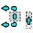 Position Section View — [`TechDraw_ExtensionPositionSectionView`](https://github.com/FreeCAD/FreeCAD/blob/b9609745048b/src/Mod/TechDraw/TechDrawTools/CommandPositionSectionView.py) | Aligns the selected section view with its source view orthogonally or the selected edge in the section view to the selected vertex in the base view | Unspecified; retain original access |
| Remove Prefix — [`TechDraw_ExtensionRemovePrefixChar`](https://github.com/FreeCAD/FreeCAD/blob/b9609745048b/src/Mod/TechDraw/Gui/CommandExtensionDims.cpp) | Removes the prefix symbols at the beginning of the dimension | Unspecified; retain original access |
| 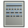 Select Line Attributes, Cascade Spacing and Delta Distance — [`TechDraw_ExtensionSelectLineAttributes`](https://github.com/FreeCAD/FreeCAD/blob/b9609745048b/src/Mod/TechDraw/Gui/CommandExtensionPack.cpp) | Configures the default attributes for cosmetic lines and centerlines, including cascade spacing and delta distance | Unspecified; retain original access |
| Shorten Line — [`TechDraw_ExtensionShortenLine`](https://github.com/FreeCAD/FreeCAD/blob/b9609745048b/src/Mod/TechDraw/Gui/CommandExtensionPack.cpp) | Shortens a selected cosmetic line or centerline at both ends by the specified delta distance | Unspecified; retain original access |
| Cosmetic Thread Bolt Bottom View — [`TechDraw_ExtensionThreadBoltBottom`](https://github.com/FreeCAD/FreeCAD/blob/b9609745048b/src/Mod/TechDraw/Gui/CommandExtensionPack.cpp) | Adds a cosmetic thread to the top or bottom view of the selected bolts/screws/rods | Unspecified; retain original access |
| Cosmetic Thread Bolt Side View — [`TechDraw_ExtensionThreadBoltSide`](https://github.com/FreeCAD/FreeCAD/blob/b9609745048b/src/Mod/TechDraw/Gui/CommandExtensionPack.cpp) | Adds a cosmetic thread to the side view of a bolt/screw/rod between two selected parallel lines | Unspecified; retain original access |
| Cosmetic Thread Hole Bottom View — [`TechDraw_ExtensionThreadHoleBottom`](https://github.com/FreeCAD/FreeCAD/blob/b9609745048b/src/Mod/TechDraw/Gui/CommandExtensionPack.cpp) | Adds a cosmetic thread to the top or bottom view of selected holes or circles | Unspecified; retain original access |
| Cosmetic Thread Hole Side View — [`TechDraw_ExtensionThreadHoleSide`](https://github.com/FreeCAD/FreeCAD/blob/b9609745048b/src/Mod/TechDraw/Gui/CommandExtensionPack.cpp) | Adds a cosmetic thread to the side view of a hole or circle | Unspecified; retain original access |
| 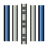 Cosmetic Thread Hole Side View — [`TechDraw_ExtensionThreadsGroup`](https://github.com/FreeCAD/FreeCAD/blob/b9609745048b/src/Mod/TechDraw/Gui/CommandExtensionPack.cpp) | Adds a cosmetic thread to the side view of a selected hole between two selected parallel lines | Unspecified; retain original access |
|  Cosmetic Intersection Vertices — [`TechDraw_ExtensionVertexAtIntersection`](https://github.com/FreeCAD/FreeCAD/blob/b9609745048b/src/Mod/TechDraw/Gui/CommandExtensionPack.cpp) | Adds cosmetic vertices at the intersections of selected edges | Unspecified; retain original access |
| 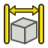 Extent Dimension — [`TechDraw_ExtentGroup`](https://github.com/FreeCAD/FreeCAD/blob/b9609745048b/src/Mod/TechDraw/Gui/CommandCreateDims.cpp) | Inserts a dimension showing the extent (overall length) of an object or feature | Unspecified; retain original access |
| Centerline on Face — [`TechDraw_FaceCenterLine`](https://github.com/FreeCAD/FreeCAD/blob/b9609745048b/src/Mod/TechDraw/Gui/CommandAnnotate.cpp) | Adds a centerline to selected faces | Unspecified; retain original access |
|  Update Template Fields — [`TechDraw_FillTemplateFields`](https://github.com/FreeCAD/FreeCAD/blob/b9609745048b/src/Mod/TechDraw/TechDrawTools/CommandFillTemplateFields.py) | Uses document info to populate the template fields | Unspecified; retain original access |
|  Geometric Hatch — [`TechDraw_GeometricHatch`](https://github.com/FreeCAD/FreeCAD/blob/b9609745048b/src/Mod/TechDraw/Gui/CommandDecorate.cpp) | Applies a geometric hatch pattern to the selected faces | Unspecified; retain original access |
|  Image Hatch — [`TechDraw_Hatch`](https://github.com/FreeCAD/FreeCAD/blob/b9609745048b/src/Mod/TechDraw/Gui/CommandDecorate.cpp) | Applies a hatch pattern to the selected faces using an image file | Unspecified; retain original access |
|  Hole/Shaft Fit — [`TechDraw_HoleShaftFit`](https://github.com/FreeCAD/FreeCAD/blob/b9609745048b/src/Mod/TechDraw/TechDrawTools/CommandHoleShaftFit.py) | Adds a hole or shaft fit to a selected length or diameter dimension | Unspecified; retain original access |
|  Horizontal Length Dimension — [`TechDraw_HorizontalDimension`](https://github.com/FreeCAD/FreeCAD/blob/b9609745048b/src/Mod/TechDraw/Gui/CommandCreateDims.cpp) | Inserts a horizontal length dimension of an edge or distance between two points | Unspecified; retain original access |
| Horizontal Extent Dimension — [`TechDraw_HorizontalExtentDimension`](https://github.com/FreeCAD/FreeCAD/blob/b9609745048b/src/Mod/TechDraw/Gui/CommandCreateDims.cpp) | Inserts a dimension showing the horizontal extent (overall length) of an object or feature | Unspecified; retain original access |
| Bitmap Image — [`TechDraw_Image`](https://github.com/FreeCAD/FreeCAD/blob/b9609745048b/src/Mod/TechDraw/Gui/CommandDecorate.cpp) | Inserts a bitmap from a file into the current page | Unspecified; retain original access |
|  Leader Line — [`TechDraw_LeaderLine`](https://github.com/FreeCAD/FreeCAD/blob/b9609745048b/src/Mod/TechDraw/Gui/CommandAnnotate.cpp) | Adds a leader line | Unspecified; retain original access |
|  Length Dimension — [`TechDraw_LengthDimension`](https://github.com/FreeCAD/FreeCAD/blob/b9609745048b/src/Mod/TechDraw/Gui/CommandCreateDims.cpp) | Inserts a length dimension of an edge or distance between two points | Unspecified; retain original access |
| Midpoint Vertices — [`TechDraw_Midpoints`](https://github.com/FreeCAD/FreeCAD/blob/b9609745048b/src/Mod/TechDraw/Gui/CommandAnnotate.cpp) | Adds cosmetic vertices at the midpoint of the selected edges | Unspecified; retain original access |
| Move View — [`TechDraw_MoveView`](https://github.com/FreeCAD/FreeCAD/blob/b9609745048b/src/Mod/TechDraw/TechDrawTools/CommandMoveView.py) | Moves a view to a new page | Unspecified; retain original access |
|  New Page — [`TechDraw_PageDefault`](https://github.com/FreeCAD/FreeCAD/blob/b9609745048b/src/Mod/TechDraw/Gui/Command.cpp) | Creates a new page with the default template | Unspecified; retain original access |
|  New Page From Template — [`TechDraw_PageTemplate`](https://github.com/FreeCAD/FreeCAD/blob/b9609745048b/src/Mod/TechDraw/Gui/Command.cpp) | Creates a new page from a custom template | Unspecified; retain original access |
|  Print All Pages — [`TechDraw_PrintAll`](https://github.com/FreeCAD/FreeCAD/blob/b9609745048b/src/Mod/TechDraw/Gui/Command.cpp) | Prints all pages with the print dialog | Unspecified; retain original access |
| Project Shape — [`TechDraw_ProjectShape`](https://github.com/FreeCAD/FreeCAD/blob/b9609745048b/src/Mod/TechDraw/Gui/Command.cpp) | Creates a projected geometry of the selected object in the 3D view from the current camera angle | Unspecified; retain original access |
| Projection Group — [`TechDraw_ProjectionGroup`](https://github.com/FreeCAD/FreeCAD/blob/b9609745048b/src/Mod/TechDraw/Gui/Command.cpp) | Inserts multiple new linked views of the selected objects in the current page | Unspecified; retain original access |
| Quadrant Vertices — [`TechDraw_Quadrants`](https://github.com/FreeCAD/FreeCAD/blob/b9609745048b/src/Mod/TechDraw/Gui/CommandAnnotate.cpp) | Adds cosmetic vertices at the quadrant points of the selected circles | Unspecified; retain original access |
|  Radius Dimension — [`TechDraw_RadiusDimension`](https://github.com/FreeCAD/FreeCAD/blob/b9609745048b/src/Mod/TechDraw/Gui/CommandCreateDims.cpp) | Inserts a radius dimension of a circular edge or arc | Unspecified; retain original access |
|  Redraw Page — [`TechDraw_RedrawPage`](https://github.com/FreeCAD/FreeCAD/blob/b9609745048b/src/Mod/TechDraw/Gui/Command.cpp) | Redraws the current page | Unspecified; retain original access |
|  Rich Text Annotation — [`TechDraw_RichTextAnnotation`](https://github.com/FreeCAD/FreeCAD/blob/b9609745048b/src/Mod/TechDraw/Gui/CommandAnnotate.cpp) | Inserts a rich text annotation in the current page | Unspecified; retain original access |
|  Section View (Simple or Complex) — [`TechDraw_SectionGroup`](https://github.com/FreeCAD/FreeCAD/blob/b9609745048b/src/Mod/TechDraw/Gui/Command.cpp) | Inserts a simple or complex section view in the current page | Unspecified; retain original access |
| Section View — [`TechDraw_SectionView`](https://github.com/FreeCAD/FreeCAD/blob/b9609745048b/src/Mod/TechDraw/Gui/Command.cpp) | Inserts a new section view based on the selected view in the current page | Unspecified; retain original access |
| Share View — [`TechDraw_ShareView`](https://github.com/FreeCAD/FreeCAD/blob/b9609745048b/src/Mod/TechDraw/TechDrawTools/CommandShareView.py) | Shares a view on a second page | Unspecified; retain original access |
|  Toggle Edge Visibility — [`TechDraw_ShowAll`](https://github.com/FreeCAD/FreeCAD/blob/b9609745048b/src/Mod/TechDraw/Gui/CommandAnnotate.cpp) | Toggles the visibility of the selected edges | Unspecified; retain original access |
|  Spreadsheet View — [`TechDraw_SpreadsheetView`](https://github.com/FreeCAD/FreeCAD/blob/b9609745048b/src/Mod/TechDraw/Gui/Command.cpp) | Inserts a view of a spreadsheet in the current page | Unspecified; retain original access |
| Stack Bottom — [`TechDraw_StackBottom`](https://github.com/FreeCAD/FreeCAD/blob/b9609745048b/src/Mod/TechDraw/Gui/CommandStack.cpp) | Moves the selected view to the bottom of the stack | Unspecified; retain original access |
| Stack Down — [`TechDraw_StackDown`](https://github.com/FreeCAD/FreeCAD/blob/b9609745048b/src/Mod/TechDraw/Gui/CommandStack.cpp) | Moves the selected view down 1 level in the view stack | Unspecified; retain original access |
|  View Stacking Order — [`TechDraw_StackGroup`](https://github.com/FreeCAD/FreeCAD/blob/b9609745048b/src/Mod/TechDraw/Gui/CommandStack.cpp) | Adjusts the stacking order of the selected views | Unspecified; retain original access |
| Stack Top — [`TechDraw_StackTop`](https://github.com/FreeCAD/FreeCAD/blob/b9609745048b/src/Mod/TechDraw/Gui/CommandStack.cpp) | Moves the selected view to the top of the stack | Unspecified; retain original access |
| Stack Up — [`TechDraw_StackUp`](https://github.com/FreeCAD/FreeCAD/blob/b9609745048b/src/Mod/TechDraw/Gui/CommandStack.cpp) | Moves the selected view up 1 level in the view stack | Unspecified; retain original access |
|  Surface Finish Symbol — [`TechDraw_SurfaceFinishSymbols`](https://github.com/FreeCAD/FreeCAD/blob/b9609745048b/src/Mod/TechDraw/Gui/CommandAnnotate.cpp) | Adds a surface finish symbol in the selected view | Unspecified; retain original access |
| Insert SVG — [`TechDraw_Symbol`](https://github.com/FreeCAD/FreeCAD/blob/b9609745048b/src/Mod/TechDraw/Gui/Command.cpp) | Inserts a symbol from an SVG file | Unspecified; retain original access |
|  Toggle View Frames — [`TechDraw_ToggleFrame`](https://github.com/FreeCAD/FreeCAD/blob/b9609745048b/src/Mod/TechDraw/Gui/CommandDecorate.cpp) | Toggles visibility of view frames and vertices | Unspecified; retain original access |
| Toggle Grid — [`TechDraw_ToggleGrid`](https://github.com/FreeCAD/FreeCAD/blob/b9609745048b/src/Mod/TechDraw/Gui/CommandDecorate.cpp) | Toggles the grid on the active page | Unspecified; retain original access |
|  Vertical Length Dimension — [`TechDraw_VerticalDimension`](https://github.com/FreeCAD/FreeCAD/blob/b9609745048b/src/Mod/TechDraw/Gui/CommandCreateDims.cpp) | Inserts a vertical length dimension of an edge or distance between two points | Unspecified; retain original access |
| Vertical Extent Dimension — [`TechDraw_VerticalExtentDimension`](https://github.com/FreeCAD/FreeCAD/blob/b9609745048b/src/Mod/TechDraw/Gui/CommandCreateDims.cpp) | Inserts a dimension showing the vertical extent (overall length) of an object or feature | Unspecified; retain original access |
|  New View — [`TechDraw_View`](https://github.com/FreeCAD/FreeCAD/blob/b9609745048b/src/Mod/TechDraw/Gui/Command.cpp) | Inserts a new view into the current page based on the selected object in the tree view or 3D view. If no object is selected, a file browser opens to select an SVG or image file. | Unspecified; retain original access |
|  Weld Symbol — [`TechDraw_WeldSymbol`](https://github.com/FreeCAD/FreeCAD/blob/b9609745048b/src/Mod/TechDraw/Gui/CommandAnnotate.cpp) | Adds welding information to the selected leader line | Unspecified; retain original access |
### TemplatePyMod

| Button / command | Short description | FC Plus placement |
| --- | --- | --- |
| Toggle command — [`TemplatePyCheckable`](https://github.com/FreeCAD/FreeCAD/blob/b9609745048b/src/Mod/TemplatePyMod/Commands.py) | Example toggle command | Unspecified; retain original access |
| Group command — [`TemplatePyGroup`](https://github.com/FreeCAD/FreeCAD/blob/b9609745048b/src/Mod/TemplatePyMod/Commands.py) | Example group command | Unspecified; retain original access |
| TemplatePyGrp_1 — [`TemplatePyGrp_1`](https://github.com/FreeCAD/FreeCAD/blob/b9609745048b/src/Mod/TemplatePyMod/Commands.py) | Print a message | Unspecified; retain original access |
| TemplatePyGrp_2 — [`TemplatePyGrp_2`](https://github.com/FreeCAD/FreeCAD/blob/b9609745048b/src/Mod/TemplatePyMod/Commands.py) | Print a message | Unspecified; retain original access |
| TemplatePyGrp_3 — [`TemplatePyGrp_3`](https://github.com/FreeCAD/FreeCAD/blob/b9609745048b/src/Mod/TemplatePyMod/Commands.py) | Print a message | Unspecified; retain original access |
| Create spheres... — [`TemplatePyMod_Cmd4`](https://github.com/FreeCAD/FreeCAD/blob/b9609745048b/src/Mod/TemplatePyMod/Commands.py) | Click on the screen to create a sphere | Unspecified; retain original access |
| Render area — [`TemplatePyMod_Cmd5`](https://github.com/FreeCAD/FreeCAD/blob/b9609745048b/src/Mod/TemplatePyMod/Commands.py) | Show render area | Unspecified; retain original access |
| Create a box — [`TemplatePyMod_Cmd6`](https://github.com/FreeCAD/FreeCAD/blob/b9609745048b/src/Mod/TemplatePyMod/Commands.py) | Use Box feature class which is completely written in Python | Unspecified; retain original access |
### Test Framework

| Button / command | Short description | FC Plus placement |
| --- | --- | --- |
| Insert a TestFeature — [`Test_InsertFeature`](https://github.com/FreeCAD/FreeCAD/blob/b9609745048b/src/Mod/Test/TestGui.py) | Insert a TestFeature in the active Document | Unspecified; retain original access |
| Self-test... — [`Test_Test`](https://github.com/FreeCAD/FreeCAD/blob/b9609745048b/src/Mod/Test/TestGui.py) | Runs a self-test to check if the application works properly | Unspecified; retain original access |
|  Test all — [`Test_TestAll`](https://github.com/FreeCAD/FreeCAD/blob/b9609745048b/src/Mod/Test/TestGui.py) | Runs all tests at once (can take very long!) | Unspecified; retain original access |
| Test all — [`Test_TestAllText`](https://github.com/FreeCAD/FreeCAD/blob/b9609745048b/src/Mod/Test/TestGui.py) | Runs all tests at once (can take very long!) | Unspecified; retain original access |
|  Test base — [`Test_TestBase`](https://github.com/FreeCAD/FreeCAD/blob/b9609745048b/src/Mod/Test/TestGui.py) | Test the basic functions of FreeCAD | Unspecified; retain original access |
| Test base — [`Test_TestBaseText`](https://github.com/FreeCAD/FreeCAD/blob/b9609745048b/src/Mod/Test/TestGui.py) | Test the basic functions of FreeCAD | Unspecified; retain original access |
| Add menu — [`Test_TestCreateMenu`](https://github.com/FreeCAD/FreeCAD/blob/b9609745048b/src/Mod/Test/TestGui.py) | Test the menu stuff of FreeCAD | Unspecified; retain original access |
| Remove menu — [`Test_TestDeleteMenu`](https://github.com/FreeCAD/FreeCAD/blob/b9609745048b/src/Mod/Test/TestGui.py) | Test the menu stuff of FreeCAD | Unspecified; retain original access |
|  Test Document — [`Test_TestDoc`](https://github.com/FreeCAD/FreeCAD/blob/b9609745048b/src/Mod/Test/TestGui.py) | Test the document (creation, save, load and destruction) | Unspecified; retain original access |
| Test Document — [`Test_TestDocText`](https://github.com/FreeCAD/FreeCAD/blob/b9609745048b/src/Mod/Test/TestGui.py) | Test the document (creation, save, load and destruction) | Unspecified; retain original access |
| Test workbench — [`Test_TestWork`](https://github.com/FreeCAD/FreeCAD/blob/b9609745048b/src/Mod/Test/TestGui.py) | Test the switching of workbenches in FreeCAD | Unspecified; retain original access |

### FC Plus additions grouped by inherited workbench responsibility

These are user-facing actions, not newly invented command IDs. An action can serve more than one original workbench; grouping here assigns its closest inherited function and does not require a workbench switch.

| Original workbench family | FC Plus action | Short description / approved destination |
| --- | --- | --- |
| Shared desktop / Assembly | New Component | Create a domestic or external definition; Component Panel owns storage behavior. Exact button placement needs confirmation. |
| Shared desktop / Assembly | Add Component | Place selected model instances; revised task explicitly deferred. |
| Shared desktop / Assembly | Edit / Open in new window | Edit in current tab or open component tab, from Models/Part Tree. |
| Assembly | Move Components | One task with six placement workflows for siblings and descendants; Part Tree/Design Assembly entry. |
| Shared desktop / Part / Part Design | Part Type | Full Component, Bodies Only, Reference, Excluded, separate from visibility. |
| Part / Part Design | Add Reference Feature | Make an owned linked derivative before source Reference geometry can be used; task details pending. |
| Part Design | Extrude | Owner-requested Modeling action consolidating extrusion access; DOCX Pad/Pocket fields below need source confirmation. |
| Part Design | Revolve | Owner-requested Modeling action; DOCX shared Revolution/Groove fields need source confirmation. |
| Part Design | Loft / Helix / Primitive | Owner-requested Modeling buttons; native fields retained pending exact custom task confirmation. |
| Part Design | Pipe | DOCX combined Pipe proposal retained; Plus location not confirmed by latest Modeling outline. |
| Part Design | Tab | Included by the owner in the Primitives dropdown; task and geometry definition still needed. Not silently removed. |
| Part Design | Combined Linear/Circular Pattern | DOCX custom workflow candidate; original pattern commands remain cataloged separately. |
| Shared desktop / Sketcher / Part | Selection toolbar | Curve intent, eight category filters, directional and persistent selection in Design. |
| Shared desktop / Draft / Part | Layers / Move to Layer / Change Active Layer | Saved layers and assignments through the Design toolbar/task. |
| Sketcher | Contextual Constraint Palette | Native constraint icons and dimension/construction toggles for clicked selection. |
| Part / Part Design | Trim Body / Isocline Curve | Previously specified in old Markdown; no accessible direct owner request recovered yet. Needs owner confirmation; archived details are not approval. |
| CAM | Direct STL Parallel/Waterline, holding tabs, indexed setups | Prior Markdown details retained in archive; exact custom UI requires source confirmation. |

Unresolved original IDs in Section 2 remain visible rather than being silently dropped. Original-source commands absent from the earlier catalog are included above. See the evidence ledger for extraction limits and the workbench registration audit.

### Original options without a separately resolved command ID

These preserve all remaining DOCX inventory items, grouped by their original workbench. Some are dropdown options rather than separately registered commands. Descriptions are native resource text when resolved, otherwise a concise description of the named operation; unresolved specifics are stated explicitly. Their existence is not an approved FC Plus placement.

#### Not Workbench Specific

| Original option | Short description | Trace |
| --- | --- | --- |
| Draw Style > Points | Displays object vertices as points. | D279; Plus placement unspecified |
| Draw Style > Wireframe | Displays object edges without shaded faces. | D289; Plus placement unspecified |
| Draw Style > Hidden Line | Displays visible edges while concealing hidden edges. | D299; Plus placement unspecified |
| Draw Style > No Shading | Displays faces without lighting-based shading. | D309; Plus placement unspecified |
| Draw Style > Shaded | Displays shaded faces. | D319; Plus placement unspecified |
| Draw Style > Flat Lines | Displays shaded faces with visible edges. | D329; Plus placement unspecified |
| Link Actions | Opens native link creation, replacement, unlinking and import actions. | D529; Plus placement unspecified |
#### Sketcher

| Original option | Short description | Trace |
| --- | --- | --- |
| Radius and Diameter Constraints > Constrain diameter | Sets a circle or arc diameter constraint. | D769; Plus placement unspecified |
| Radius and Diameter Constraints > Constrain auto radius/diameter | Chooses a radius or diameter constraint for the selected circular geometry. | D771; Plus placement unspecified |
#### Part Design

| Original option | Short description | Trace |
| --- | --- | --- |
| Sketch Actions | Opens sketch creation and related helper actions. | D897; Plus placement unspecified |
| Additive Primitives | Creates a primitive solid added to a body. | D928; Plus placement unspecified |
| Additive Primitives > Additive Cylinder | Adds a cylinder primitive using native dimensions. | D934; Plus placement unspecified |
| Additive Primitives > Additive Sphere | Adds a sphere primitive using native dimensions. | D937; Plus placement unspecified |
| Additive Primitives > Additive Cone | Adds a cone primitive using native dimensions. | D940; Plus placement unspecified |
| Additive Primitives > Additive Ellipsoid | Adds a ellipsoid primitive using native dimensions. | D943; Plus placement unspecified |
| Additive Primitives > Additive Torus | Adds a torus primitive using native dimensions. | D946; Plus placement unspecified |
| Additive Primitives > Additive Prism | Adds a prism primitive using native dimensions. | D949; Plus placement unspecified |
| Additive Primitives > Additive Wedge | Adds a wedge primitive using native dimensions. | D952; Plus placement unspecified |
| Subtractive Primitives | Cuts a primitive volume from a body. | D968; Plus placement unspecified |
| Subtractive Primitives > Subtractive Cylinder | Cuts a cylinder primitive using native dimensions. | D974; Plus placement unspecified |
| Subtractive Primitives > Subtractive Sphere | Cuts a sphere primitive using native dimensions. | D977; Plus placement unspecified |
| Subtractive Primitives > Subtractive Cone | Cuts a cone primitive using native dimensions. | D980; Plus placement unspecified |
| Subtractive Primitives > Subtractive Ellipsoid | Cuts a ellipsoid primitive using native dimensions. | D983; Plus placement unspecified |
| Subtractive Primitives > Subtractive Torus | Cuts a torus primitive using native dimensions. | D986; Plus placement unspecified |
| Subtractive Primitives > Subtractive Prism | Cuts a prism primitive using native dimensions. | D989; Plus placement unspecified |
| Subtractive Primitives > Subtractive Wedge | Cuts a wedge primitive using native dimensions. | D992; Plus placement unspecified |
#### Part

| Original option | Short description | Trace |
| --- | --- | --- |
| New Sketch | Creates a new sketch in the current working plane | D1044; Plus placement unspecified |
| Offset Tools | Creates offset geometry from the selected source. | D1073; Plus placement unspecified |
| Join Features | Joins selected geometry with native join operations. | D1102; Plus placement unspecified |
| Split Features | Splits selected geometry with native split operations. | D1110; Plus placement unspecified |
#### Draft

| Original option | Short description | Trace |
| --- | --- | --- |
| 2D View Tools > Update Shape 2D View | Regenerates a two-dimensional projection from its source geometry. | D1248; Plus placement unspecified |
#### Assembly

| Original option | Short description | Trace |
| --- | --- | --- |
| Link Arrays > Circular Link Array | Places linked copies around a circular arrangement. | D1321; Plus placement unspecified |
| Link Arrays > Path Link Array | Creates linked copies of the selected object along a selected path | D1329; Plus placement unspecified |
| Link Arrays > Point Link Array | Creates linked copies of the selected object at the points of a point object | D1333; Plus placement unspecified |
#### CAM

| Original option | Short description | Trace |
| --- | --- | --- |
| Post-processing | Converts CAM toolpaths into machine-specific output. | D1501; Plus placement unspecified |
| Post-processing > Post Process Selected Operations | Post-processes only the selected CAM operations. | D1505; Plus placement unspecified |
| Simulators | Opens the available native toolpath simulators. | D1508; Plus placement unspecified |
| CAMotics Simulation | Simulates machining through the CAMotics integration when available. | D1522; Plus placement unspecified |
| Drilling Operations | Opens drilling and related hole-machining operations. | D1536; Plus placement unspecified |
| Drilling Operations > Thread Milling | Creates toolpaths for milling threads. | D1540; Plus placement unspecified |
| Engraving Operations | Opens engraving, deburring and V-carving operations. | D1542; Plus placement unspecified |
| Engraving Operations > Deburr | Creates edge-deburring toolpaths. | D1546; Plus placement unspecified |
| Engraving Operations > V-Carve | Creates a V-bit carving toolpath. | D1548; Plus placement unspecified |
| Engraving Operations > Flute | Creates flute-machining toolpaths. | D1550; Plus placement unspecified |
| 3D Operations | Opens native three-dimensional machining operations. | D1551; Plus placement unspecified |
| 3D Operations > 3D Pocket | Removes stock in a three-dimensional pocket. | D1552; Plus placement unspecified |
| 3D Operations > 3D Surface | Machines a three-dimensional surface. | D1553; Plus placement unspecified |
| 3D Operations > Waterline | Machines successive constant-height contours. | D1554; Plus placement unspecified |
| 3D Operations > Planar Surface | Creates passes for planar surface machining. | D1555; Plus placement unspecified |
| 3D Operations > Rotary Surface | Creates rotary-axis surface machining passes. | D1557; Plus placement unspecified |
| Dress-up Operations | Applies a modification to an existing CAM toolpath. | D1565; Plus placement unspecified |
| Dress-up Operations > Array Dress-up | Modifies an existing toolpath using the native array operation. | D1567; Plus placement unspecified |
| Dress-up Operations > Axis Mapping Dress-up | Modifies an existing toolpath using the native axis mapping operation. | D1569; Plus placement unspecified |
| Dress-up Operations > Boundary Dress-up | Modifies an existing toolpath using the native boundary operation. | D1571; Plus placement unspecified |
| Dress-up Operations > Boundary Dress-up | Modifies an existing toolpath using the native boundary operation. | D1573; Plus placement unspecified |
| Dress-up Operations > Dogbone Dress-up | Modifies an existing toolpath using the native dogbone operation. | D1575; Plus placement unspecified |
| Dress-up Operations > Drag Knife Dress-up | Modifies an existing toolpath using the native drag knife operation. | D1577; Plus placement unspecified |
| Dress-up Operations > Lead In/Out Dress-up | Modifies an existing toolpath using the native lead in/out operation. | D1579; Plus placement unspecified |
| Dress-up Operations > Mirror Dress-up | Modifies an existing toolpath using the native mirror operation. | D1581; Plus placement unspecified |
| Dress-up Operations > Plunge Milling Dress-up | Modifies an existing toolpath using the native plunge milling operation. | D1583; Plus placement unspecified |
| Dress-up Operations > Ramp Entry Dress-up | Modifies an existing toolpath using the native ramp entry operation. | D1585; Plus placement unspecified |
| Dress-up Operations > Holding Tags Dress-up | Modifies an existing toolpath using the native holding tags operation. | D1587; Plus placement unspecified |
| Dress-up Operations > Z Correction Dress-up | Modifies an existing toolpath using the native z correction operation. | D1589; Plus placement unspecified |
#### BIM

| Original option | Short description | Trace |
| --- | --- | --- |
| Line | Creates a 2-point line | D1597; Plus placement unspecified |
| Polyline | Creates a polyline | D1600; Plus placement unspecified |
| Rectangle | Creates a 2-point rectangle | D1603; Plus placement unspecified |
| Arc Tools | Tools to create various types of circular arcs | D1605; Plus placement unspecified |
| Arc Tools > Arc | Creates a circular arc from a center point and a radius | D1606; Plus placement unspecified |
| Arc Tools > Arc From 3 Points | Creates a circular arc from 3 points | D1608; Plus placement unspecified |
| Polygon | Creates a regular polygon (triangle, square, pentagon…) | D1614; Plus placement unspecified |
| Spline Tools | Opens the original spline tools command group. | D1616; Plus placement unspecified |
| Spline Tools > B-Spline | Creates a multiple-point B-spline | D1617; Plus placement unspecified |
| Spline Tools > Cubic Bézier Curve | Creates a Bézier curve made of 2nd degree (quadratic) and 3rd degree (cubic) segments. Clicking and dragging allows to define segments. Control points and properties of each knot can be edited after creation. | D1621; Plus placement unspecified |
| Point | Creates a point | D1623; Plus placement unspecified |
| Fillet | Creates a fillet between 2 selected edges | D1625; Plus placement unspecified |
| Toggle Grid | Toggles the visibility of the Draft grid | D1659; Plus placement unspecified |
| Level | Creates a building part object that represents a level | D1664; Plus placement unspecified |
| Generic 3D Tools | Opens the original generic 3d tools command group. | D1684; Plus placement unspecified |
| Generic 3D Tools > Profile | Creates a profile | D1685; Plus placement unspecified |
| Generic 3D Tools > Reference | References geometry from another file. | D1692; Plus placement unspecified |
| Create 2D Views | Creates two-dimensional views of model geometry. | D1708; Plus placement unspecified |
| Create 2D Views > Section View | Creates a section-based view of the model. | D1710; Plus placement unspecified |
| Create 2D Views > Section Cut | Shows or creates a cut through model geometry. | D1711; Plus placement unspecified |
| Create 2D Views > Update Shape 2D View | Regenerates a two-dimensional projection from its source geometry. | D1712; Plus placement unspecified |
| Move | Moves the selected objects. If the "Copy" option is active, it creates displaced copies. | D1716; Plus placement unspecified |
| Scale | Scales the selected objects from a base point | D1720; Plus placement unspecified |
| Mirror | Mirrors the selected objects along a line defined by 2 points | D1722; Plus placement unspecified |
| Cloning Tools | Opens the original cloning tools command group. | D1724; Plus placement unspecified |
| Offset Tools | Creates offset geometry from the selected source. | D1732; Plus placement unspecified |
| Offset Tools > Offset | Offsets the selected object. It can also create an offset copy of the original object. | D1734; Plus placement unspecified |
| Split | Splits the selected line or polyline at a specified point | D1739; Plus placement unspecified |
| Edit | Edits the active object | D1745; Plus placement unspecified |
| Add Component | Adds the selected components to the active object | D1752; Plus placement unspecified |
| Array Tools > Array | Creates copies of the selected object in an orthogonal pattern | D1756; Plus placement unspecified |
| Array Tools > Path Link Array | Creates linked copies of the selected object along a selected path | D1758; Plus placement unspecified |
| Array Tools > Point Link Array | Creates linked copies of the selected object at the points of a point object | D1762; Plus placement unspecified |
| Boolean Tools | Opens the original boolean tools command group. | D1767; Plus placement unspecified |
| IFC Management | Opens the original ifc management command group. | D1775; Plus placement unspecified |
| IFC Management > IFC Elements | Manages IFC element definitions. | D1776; Plus placement unspecified |
| IFC Management > IFC Quantities | Manages quantity information for IFC objects. | D1777; Plus placement unspecified |
| IFC Management > IFC Properties | Manages IFC property sets. | D1778; Plus placement unspecified |
| IFC Management > Classification | Assigns or manages building-element classifications. | D1779; Plus placement unspecified |
| Report Tools | Opens the original report tools command group. | D1782; Plus placement unspecified |
#### FEM

| Original option | Short description | Trace |
| --- | --- | --- |
| Electromagnetic Constraints | Opens electromagnetic analysis constraint choices. | D1803; Plus placement unspecified |
| Solvers > CalculiX Solver | Adds or configures the CalculiX solver. | D1841; Plus placement unspecified |
| Solvers > Elmer Solver | Adds or configures the Elmer solver. | D1842; Plus placement unspecified |
| Solvers > Mystran Solver | Adds or configures the Mystran solver. | D1843; Plus placement unspecified |
| Solvers > Z88 Solver | Adds or configures the Z88 solver. | D1844; Plus placement unspecified |
| Filter Functions > Sphere | Adds a spherical result-processing region. | D1877; Plus placement unspecified |
| Filter Functions > Cylinder | Adds a cylindrical result-processing region. | D1878; Plus placement unspecified |
| Data Visualizations > Line Plot | Plots sampled result values along a line. | D1881; Plus placement unspecified |
| Data Visualizations > Histogram | Shows the distribution of result values. | D1882; Plus placement unspecified |
| Data Visualizations > Data Table | Shows result data in a table. | D1883; Plus placement unspecified |
#### OpenSCAD

| Original option | Short description | Trace |
| --- | --- | --- |
| Shape Builder | Advanced utility to create shapes | D1914; Plus placement unspecified |
| Cut | Subtracts tool geometry from a target. | D1916; Plus placement unspecified |
| Union | Creates a union of several shapes | D1918; Plus placement unspecified |
| Intersection | Creates an intersection of two shapes | D1920; Plus placement unspecified |
| Extrude | Extrudes a selected 2D shape | D1922; Plus placement unspecified |
| Revolve | Sweeps a profile around an axis. | D1924; Plus placement unspecified |
#### Tech Draw

| Original option | Short description | Trace |
| --- | --- | --- |
| Horizontal extent > Vertical extent | Dimensions the overall vertical extent of projected geometry. | D2083; Plus placement unspecified |
