# FreeCAD Plus toolbar reference

Classic inventory comes first, followed by the implemented Plus layout, the change map, and the function catalog. Each command has its own row. Reference icons are displayed at **11 × 11 px**, approximately one third of the previous 32 px renders.

The Plus layout implements the owner's revised direction and completes the incomplete outline with native command placements. **The revised Design Home, Modeling, Sketch and Assembly layouts are source-validated and awaits the next build; the October 2 audit executable retains its prior layout.** Native IDs, icons and command descriptions come from the inspected payload. [UI rules](../UI_UX_SPEC.md#toolbar-ui-styles) govern interaction; [WORK_STATE](../WORK_STATE.md) records implementation/build acceptance.

- [Classic toolbars](#classic-toolbars)
- [Plus UI target layout](#plus-ui-target-layout)
- [Changes and retained access](#changes-and-retained-access)
- [Complete function catalog](#complete-toolbar-buttonfunction-catalog)

## Design Move Components

The Design Assembly group includes **Move Components** (`Std_MoveComponents`).
The Part Tree instance context menu opens the same task. Its ordered workflow
dropdown starts with Translate; the remaining five workflows await their queued
implementations. See [Move Components](../UI_UX_SPEC.md#move-components).

## Classic toolbars

Recorded upstream source: `b9609745048b`. Native metadata: application `6be8eda4246a`. Conditional/edit-only toolbars are included; they are not all shown simultaneously. Shared desktop groups are listed once. Classic location mappings record the prior audit layout; the revised Design Home section below governs current source placement. Removed Home actions retain specialist tabs or native menus.

### All workbenches — shared desktop

#### File

| Command | Plus mode | Plus tab / location |
| --- | --- | --- |
|  [New Document](#button-std_new) | All | Common toolbar |
|  [Open…](#button-std_open) | All | Common toolbar |
|  [Save](#button-std_save) | All | Common toolbar |

#### Edit

| Command | Plus mode | Plus tab / location |
| --- | --- | --- |
|  [Undo](#button-std_undo) | All | Common toolbar |
|  [Redo](#button-std_redo) | All | Common toolbar |
|  [Recompute](#button-std_refresh) | All | Common toolbar |

#### Clipboard

| Command | Plus mode | Plus tab / location |
| --- | --- | --- |
|  [Cut](#button-std_cut) | All | Common toolbar |
|  [Copy](#button-std_copy) | All | Common toolbar |
|  [Paste](#button-std_paste) | All | Common toolbar |

#### Workbench

| Command | Plus mode | Plus tab / location |
| --- | --- | --- |
|  [Workbench selector](#button-std_workbench) | All | Mode selector |

#### Macro

| Command | Plus mode | Plus tab / location |
| --- | --- | --- |
|  [Record Macro](#button-std_dlgmacrorecord) | Design | Home |
|  [Macros](#button-std_dlgmacroexecute) | Design | Home |
|  [Execute Macro](#button-std_dlgmacroexecutedirect) | Design | Home |

#### View

| Command | Plus mode | Plus tab / location |
| --- | --- | --- |
|  [Fit All](#button-std_viewfitall) | All | View |
|  [Fit Selection](#button-std_viewfitselection) | All | View |
|  [Isometric](#button-std_viewgroup) | All | View |
|  [Align to Selection](#button-std_aligntoselection) | All | View |
|  [As Is](#button-std_drawstyle) | All | View |
|  [Vertex Selection](#button-part_selectfilter) | All | View |
|  [Measure](#button-std_measure) | All | View |
|  [Mass Properties](#button-std_massproperties) | All | View |

#### Individual Views

| Command | Plus mode | Plus tab / location |
| --- | --- | --- |
|  [Isometric](#button-std_viewisometric) | All | View |
|  [Front](#button-std_viewfront) | All | View |
|  [Top](#button-std_viewtop) | All | View |
|  [Right](#button-std_viewright) | All | View |
|  [Rear](#button-std_viewrear) | All | View |
|  [Bottom](#button-std_viewbottom) | All | View |
|  [Left](#button-std_viewleft) | All | View |

#### Structure

| Command | Plus mode | Plus tab / location |
| --- | --- | --- |
|  [New Part](#button-std_part) | Design | Home |
|  [Datums](#button-part_datums) | Design | Home → Coordinate System dropdown |
|  [New Group](#button-std_group) | Design | Home |
|  [Make Link](#button-std_linkactions) | Design | Home |
|  [Variable Set](#button-std_varset) | Design | Home |

#### Help

| Command | Plus mode | Plus tab / location |
| --- | --- | --- |
|  [What's This?](#button-std_whatsthis) | Design | Home |

### Part Design workbench

Definition: [`src/Mod/PartDesign/Gui/Workbench.cpp`](../../../src/Mod/PartDesign/Gui/Workbench.cpp).

#### Part Design Helper Features

| Command | Plus mode | Plus tab / location |
| --- | --- | --- |
|  [New Body](#button-partdesign_body) | Design | Modeling |
|  [New Sketch](#button-partdesign_compsketches) | Design | Modeling |
|  [Validate Sketch](#button-sketcher_validatesketch) | Design | Modeling; Sketch |
|  [Check Geometry](#button-part_checkgeometry) | Design / Part / OpenSCAD | Modeling; Tools |
|  [Sub-Shape Binder](#button-partdesign_subshapebinder) | Design | Modeling |
|  [Clone](#button-partdesign_clone) | Design | Modeling |

#### Part Design Modeling Features

| Command | Plus mode | Plus tab / location |
| --- | --- | --- |
|  [Pad](#button-partdesign_pad) | Design | Home / Modeling → Extrude |
|  [Revolve](#button-partdesign_revolution) | Design | Home; Modeling |
|  [Additive Loft](#button-partdesign_additiveloft) | Design | Modeling |
|  [Additive Pipe](#button-partdesign_additivepipe) | Design | Modeling |
|  [Additive Helix](#button-partdesign_additivehelix) | Design | Modeling |
|  [Additive Box](#button-partdesign_compprimitiveadditive) | Design | Modeling |
|  [Pocket](#button-partdesign_pocket) | Design | Home / Modeling → Extrude |
|  [Hole](#button-partdesign_hole) | Design | Modeling |
|  [Groove](#button-partdesign_groove) | Design | Modeling |
|  [Subtractive Loft](#button-partdesign_subtractiveloft) | Design | Modeling |
|  [Subtractive Pipe](#button-partdesign_subtractivepipe) | Design | Modeling |
|  [Subtractive Helix](#button-partdesign_subtractivehelix) | Design | Modeling |
|  [Subtractive Box](#button-partdesign_compprimitivesubtractive) | Design | Modeling |
|  [Boolean Operation](#button-partdesign_boolean) | Design | Modeling |

#### Part Design Dress-Up Features

| Command | Plus mode | Plus tab / location |
| --- | --- | --- |
|  [Fillet](#button-partdesign_fillet) | Design | Home; Modeling |
|  [Chamfer](#button-partdesign_chamfer) | Design | Modeling |
|  [Draft](#button-partdesign_draft) | Design | Modeling |
|  [Thickness](#button-partdesign_thickness) | Design | Modeling |
|  [Defeaturing](#button-partdesign_defeaturing) | Design | Modeling |

#### Part Design Transformation Features

| Command | Plus mode | Plus tab / location |
| --- | --- | --- |
|  [Mirror](#button-partdesign_mirrored) | Design | Modeling |
|  [Linear Pattern](#button-partdesign_linearpattern) | Design | Home / Modeling → Pattern task |
|  [Polar Pattern](#button-partdesign_polarpattern) | Design | Home / Modeling → Pattern task |
| 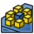 [Circular Pattern](#button-partdesign_circularpattern) | Design | Home; Modeling |
|  [Path Pattern](#button-partdesign_pathpattern) | Design | Home; Modeling |
|  [Point Pattern](#button-partdesign_pointpattern) | Design | Home; Modeling |
| 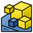 [Multi-Transform](#button-partdesign_multitransform) | Design | Modeling |

### Part workbench

Definition: [`src/Mod/Part/Gui/Workbench.cpp`](../../../src/Mod/Part/Gui/Workbench.cpp).

#### Solids

| Command | Plus mode | Plus tab / location |
| --- | --- | --- |
|  [Cube](#button-part_box) | Part | Tools |
|  [Cylinder](#button-part_cylinder) | Part | Tools |
|  [Sphere](#button-part_sphere) | Part | Tools |
|  [Cone](#button-part_cone) | Part | Tools |
|  [Torus](#button-part_torus) | Part | Tools |
|  [Tube](#button-part_tube) | Part | Tools |
|  [Primitive](#button-part_primitives) | Part / OpenSCAD | Tools |
|  [Shape Builder](#button-part_builder) | Part / OpenSCAD | Tools |

#### Part Tools

| Command | Plus mode | Plus tab / location |
| --- | --- | --- |
|  [New Sketch](#button-sketcher_newsketch) | Design / Part | Sketch; Tools |
|  [Extrude](#button-part_extrude) | Part / OpenSCAD | Tools |
|  [Revolve](#button-part_revolve) | Part / OpenSCAD | Tools |
|  [Mirror](#button-part_mirror) | Part | Tools |
|  [Scale](#button-part_scale) | Part | Tools |
|  [Fillet](#button-part_fillet) | Part | Tools |
|  [Chamfer](#button-part_chamfer) | Part | Tools |
|  [Face From Wires](#button-part_makeface) | Part | Tools |
|  [Ruled Surface](#button-part_ruledsurface) | Part | Tools |
|  [Loft](#button-part_loft) | Part | Tools |
|  [Sweep](#button-part_sweep) | Part | Tools |
|  [Section](#button-part_section) | Part | Tools |
|  [Cross-Sections](#button-part_crosssections) | Part | Tools |
|  [3D Offset](#button-part_compoffset) | Part | Tools |
|  [Thickness](#button-part_thickness) | Part | Tools |
|  [Project on Surface](#button-part_projectiononsurface) | Part | Tools |
|  [Appearance per Face](#button-part_colorperface) | Part | Tools |

#### Boolean Tools

| Command | Plus mode | Plus tab / location |
| --- | --- | --- |
|  [Compound](#button-part_compcompoundtools) | Part | Tools |
|  [Boolean Operation](#button-part_boolean) | Part | Tools |
|  [Cut](#button-part_cut) | Part / OpenSCAD | Tools |
|  [Union](#button-part_fuse) | Part / OpenSCAD | Tools |
|  [Intersection](#button-part_common) | Part / OpenSCAD | Tools |
|  [Connect Shapes](#button-part_compjoinfeatures) | Part | Tools |
|  [Boolean Fragments](#button-part_compsplitfeatures) | Part | Tools |
|  [Check Geometry](#button-part_checkgeometry) | Design / Part / OpenSCAD | Modeling; Tools |
|  [Defeaturing](#button-part_defeaturing) | Part | Tools |

### Sketcher workbench

Definition: [`src/Mod/Sketcher/Gui/Workbench.cpp`](../../../src/Mod/Sketcher/Gui/Workbench.cpp).

#### Sketcher

| Command | Plus mode | Plus tab / location |
| --- | --- | --- |
|  [New Sketch](#button-sketcher_newsketch) | Design / Part | Sketch; Tools |
|  [Edit Sketch](#button-sketcher_editsketch) | Design | Home; Sketch |
|  [Attach Sketch](#button-sketcher_mapsketch) | Design | Home; Sketch |
|  [Reorient Sketch](#button-sketcher_reorientsketch) | Design | Sketch |
|  [Validate Sketch](#button-sketcher_validatesketch) | Design | Modeling; Sketch |
|  [Merge Sketches](#button-sketcher_mergesketches) | Design | Sketch |
|  [Mirror Sketch](#button-sketcher_mirrorsketch) | Design | Sketch |

#### Edit Mode

| Command | Plus mode | Plus tab / location |
| --- | --- | --- |
|  [Leave Sketch](#button-sketcher_leavesketch) | Design | Sketch |
|  [Align View to Sketch](#button-sketcher_viewsketch) | Design | Sketch |
| 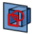 [Toggle Section View](#button-sketcher_viewsection) | Design | Sketch |

#### Geometries

| Command | Plus mode | Plus tab / location |
| --- | --- | --- |
|  [Point](#button-sketcher_createpoint) | Design | Sketch |
|  [Polyline](#button-sketcher_compline) | Design | Home; Sketch |
|  [Arc From Center](#button-sketcher_compcreatearc) | Design | Sketch |
|  [Circle From Center](#button-sketcher_compcreateconic) | Design | Sketch |
|  [Rectangle](#button-sketcher_compcreaterectangles) | Design | Home; Sketch |
|  [Triangle](#button-sketcher_compcreateregularpolygon) | Design | Sketch |
|  [Slot](#button-sketcher_compslot) | Design | Sketch |
|  [B-Spline](#button-sketcher_compcreatebspline) | Design | Sketch |
|  [Text (Experimental)](#button-sketcher_createtext) | Design | Sketch |
|  [Toggle Construction Geometry](#button-sketcher_toggleconstruction) | Design | Home; Sketch |

#### Constraints

| Command | Plus mode | Plus tab / location |
| --- | --- | --- |
|  [Dimension](#button-sketcher_compdimensiontools) | Menus / shortcuts | No dedicated ribbon button |
|  [Coincident Constraint](#button-sketcher_constraincoincidentunified) | Design | Sketch |
|  [Horizontal Constraint](#button-sketcher_comphorver) | Design | Sketch |
|  [Parallel Constraint](#button-sketcher_constrainparallel) | Design | Sketch |
|  [Perpendicular Constraint](#button-sketcher_constrainperpendicular) | Design | Sketch |
|  [Tangent/Collinear Constraint](#button-sketcher_constraintangent) | Design | Sketch |
| 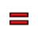 [Equal Constraint](#button-sketcher_constrainequal) | Design | Sketch |
|  [Symmetric Constraint](#button-sketcher_constrainsymmetric) | Design | Sketch |
|  [Block Constraint](#button-sketcher_constrainblock) | Design | Sketch |
|  [Group Constraint (Development preview)](#button-sketcher_constraingroup) | Design | Sketch |
| 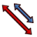 [Toggle Driving/Reference Constraints](#button-sketcher_comptoggleconstraints) | Design | Sketch |

#### Sketcher Tools

| Command | Plus mode | Plus tab / location |
| --- | --- | --- |
|  [Fillet](#button-sketcher_compcreatefillets) | Design | Sketch |
|  [Trim Edge](#button-sketcher_compcurveedition) | Design | Sketch |
|  [External Projection](#button-sketcher_compexternal) | Design | Sketch |
|  [Carbon Copy](#button-sketcher_carboncopy) | Design | Sketch |
|  [Move / Array Transform](#button-sketcher_translate) | Design | Sketch |
|  [Rotate / Polar Transform](#button-sketcher_rotate) | Design | Sketch |
|  [Scale](#button-sketcher_scale) | Design | Sketch |
|  [Offset](#button-sketcher_offset) | Design | Sketch |
|  [Mirror](#button-sketcher_symmetry) | Design | Sketch |
|  [Remove Axes Alignment](#button-sketcher_removeaxesalignment) | Design | Sketch |

#### B-Spline Tools

| Command | Plus mode | Plus tab / location |
| --- | --- | --- |
|  [Geometry to B-Spline](#button-sketcher_bsplineconverttonurbs) | Design | Sketch |
|  [Increase B-Spline Degree](#button-sketcher_bsplineincreasedegree) | Design | Sketch |
|  [Decrease B-Spline Degree](#button-sketcher_bsplinedecreasedegree) | Design | Sketch |
|  [Increase knot multiplicity](#button-sketcher_compmodifyknotmultiplicity) | Design | Sketch |
|  [Insert Knot](#button-sketcher_bsplineinsertknot) | Design | Sketch |
|  [Join Curves](#button-sketcher_joincurves) | Design | Sketch |

#### Visual Helpers

| Command | Plus mode | Plus tab / location |
| --- | --- | --- |
|  [Select Associated Constraints](#button-sketcher_selectconstraints) | Design | Sketch |
| 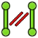 [Select Associated Geometry](#button-sketcher_selectelementsassociatedwithconstraints) | Design | Sketch |
|  [Toggle Circular Helper for Arcs](#button-sketcher_arcoverlay) | Design | Sketch |
|  [Toggle B-Spline Degree](#button-sketcher_compbsplineshowhidegeometryinformation) | Design | Sketch |
|  [Toggle Internal Geometry](#button-sketcher_restoreinternalalignmentgeometry) | Design | Sketch |
|  [Switch Virtual Space](#button-sketcher_switchvirtualspace) | Design | Sketch |

### Surface workbench

Definition: [`src/Mod/Surface/Gui/Workbench.cpp`](../../../src/Mod/Surface/Gui/Workbench.cpp).

#### Surface

| Command | Plus mode | Plus tab / location |
| --- | --- | --- |
|  [Filling](#button-surface_filling) | Design | Home; Surface |
|  [Fill Boundary Curves](#button-surface_geomfillsurface) | Design | Home; Surface |
|  [Sections](#button-surface_sections) | Design | Surface |
|  [Extend Face](#button-surface_extendface) | Design | Home; Surface |
|  [Curve on Mesh](#button-surface_curveonmesh) | Design | Surface |
|  [Blend Curve](#button-surface_blendcurve) | Design | Surface |

### Mesh workbench

Definition: [`src/Mod/Mesh/Gui/Workbench.cpp`](../../../src/Mod/Mesh/Gui/Workbench.cpp).

#### Mesh Tools

| Command | Plus mode | Plus tab / location |
| --- | --- | --- |
|  [Import Mesh…](#button-mesh_import) | Design | Home; Mesh |
|  [Export Mesh…](#button-mesh_export) | Design | Mesh |
|  [Mesh From Shape](#button-mesh_frompartshape) | Design | Home; Mesh |
|  [Regular Solid](#button-mesh_buildregularsolid) | Design | Mesh |

#### Mesh Modify

| Command | Plus mode | Plus tab / location |
| --- | --- | --- |
|  [Harmonize Normals](#button-mesh_harmonizenormals) | Design | Mesh |
|  [Flip Normals](#button-mesh_flipnormals) | Design | Mesh |
|  [Fill Holes](#button-mesh_fillupholes) | Design | Mesh |
|  [Close Hole](#button-mesh_fillinteractivehole) | Design | Mesh |
|  [Add Triangle](#button-mesh_addfacet) | Design | Mesh |
|  [Remove Components](#button-mesh_removecomponents) | Design | Mesh |
|  [Smooth](#button-mesh_smoothing) | Design | Mesh |
|  [Refinement](#button-mesh_remeshgmsh) | Design | Mesh |
|  [Decimate](#button-mesh_decimating) | Design | Mesh |
| 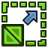 [Scale](#button-mesh_scale) | Design | Mesh |

#### Mesh Boolean

| Command | Plus mode | Plus tab / location |
| --- | --- | --- |
|  [Union](#button-mesh_union) | Design | Mesh |
|  [Intersection](#button-mesh_intersection) | Design | Mesh |
|  [Difference](#button-mesh_difference) | Design | Mesh |

#### Mesh Cutting

| Command | Plus mode | Plus tab / location |
| --- | --- | --- |
|  [Cut](#button-mesh_polycut) | Design | Mesh |
|  [Trim](#button-mesh_polytrim) | Design | Mesh |
| 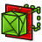 [Trim With Plane](#button-mesh_trimbyplane) | Design | Mesh |
|  [Section From Plane](#button-mesh_sectionbyplane) | Design | Mesh |
|  [Cross-Sections](#button-mesh_crosssections) | Design | Mesh |

#### Mesh Segmentation

| Command | Plus mode | Plus tab / location |
| --- | --- | --- |
|  [Merge](#button-mesh_merge) | Design | Mesh |
|  [Split by Components](#button-mesh_splitcomponents) | Design | Mesh |
|  [Segmentation](#button-mesh_segmentation) | Design | Mesh |
|  [Segmentation From Best-Fit Surfaces](#button-mesh_segmentationbestfit) | Design | Mesh |

#### Mesh Analyze

| Command | Plus mode | Plus tab / location |
| --- | --- | --- |
|  [Evaluate and Repair](#button-mesh_evaluation) | Design | Home; Mesh |
|  [Face Info](#button-mesh_evaluatefacet) | Design | Mesh |
|  [Curvature Plot](#button-mesh_vertexcurvature) | Design | Mesh |
|  [Curvature Info](#button-mesh_curvatureinfo) | Design | Mesh |
|  [Evaluate Solid](#button-mesh_evaluatesolid) | Design | Mesh |
|  [Bounding Box Info](#button-mesh_boundingbox) | Design | Mesh |

### Draft workbench

Definition: [`src/Mod/Draft/InitGui.py`](../../../src/Mod/Draft/InitGui.py).

#### Draft Creation

| Command | Plus mode | Plus tab / location |
| --- | --- | --- |
|  [Line](#button-draft_line) | Draft / BIM | Tools |
|  [Polyline](#button-draft_wire) | Draft / BIM | Tools |
|  [Fillet](#button-draft_fillet) | Draft / BIM | Tools |
|  [Arc](#button-draft_arctools) | Draft | Tools |
|  [Circle](#button-draft_circle) | Draft / BIM | Tools |
|  [Ellipse](#button-draft_ellipse) | Draft / BIM | Tools |
|  [Rectangle](#button-draft_rectangle) | Draft / BIM | Tools |
|  [Polygon](#button-draft_polygon) | Draft / BIM | Tools |
|  [B-Spline](#button-draft_bspline) | Draft / BIM | Tools |
|  [Cubic Bézier Curve](#button-draft_beziertools) | Draft | Tools |
|  [Point](#button-draft_point) | Draft / BIM | Tools |
|  [Facebinder](#button-draft_facebinder) | Draft / BIM | Tools |
|  [Shape From Text](#button-draft_shapestring) | Draft | Tools |
|  [Hatch](#button-draft_hatch) | Draft / BIM | Tools |

#### Draft Annotation

| Command | Plus mode | Plus tab / location |
| --- | --- | --- |
|  [Text](#button-draft_text) | Draft | Tools |
|  [Dimension](#button-draft_dimension) | Draft | Tools |
|  [Label](#button-draft_label) | Draft / BIM | Tools |
|  [Annotation Styles](#button-draft_annotationstyleeditor) | Draft / BIM | Tools |

#### Draft Modification

| Command | Plus mode | Plus tab / location |
| --- | --- | --- |
|  [Move](#button-draft_move) | Draft / BIM | Tools |
|  [Rotate](#button-draft_rotate) | Draft / BIM | Tools |
|  [Scale](#button-draft_scale) | Draft / BIM | Tools |
|  [Mirror](#button-draft_mirror) | Draft / BIM | Tools |
|  [Offset](#button-draft_offset) | Draft / BIM | Tools |
|  [Trimex](#button-draft_trimex) | Draft | Tools |
|  [Stretch](#button-draft_stretch) | Draft / BIM | Tools |
|  [Clone](#button-draft_clone) | Draft | Tools |
|  [Array](#button-draft_arraytools) | Draft | Tools |
|  [Edit](#button-draft_edit) | Draft / BIM | Tools |
|  [Highlight Subelements](#button-draft_subelementhighlight) | Draft | Tools |
|  [Join](#button-draft_join) | Draft / BIM | Tools |
|  [Split](#button-draft_split) | Draft / BIM | Tools |
|  [Upgrade](#button-draft_upgrade) | Draft / BIM | Tools |
|  [Downgrade](#button-draft_downgrade) | Draft / BIM | Tools |
|  [Convert Wire/B-Spline](#button-draft_wiretobspline) | Draft | Tools |
|  [Draft to Sketch](#button-draft_draft2sketch) | Draft / BIM | Tools |
|  [Set Slope](#button-draft_slope) | Draft | Tools |
|  [Flip Dimension](#button-draft_flipdimension) | Draft | Tools |
|  [Shape 2D View](#button-draft_shape2dview) | Draft | Tools |

#### Draft Utility

| Command | Plus mode | Plus tab / location |
| --- | --- | --- |
|  [Manage Layers](#button-draft_layermanager) | Draft | Tools |
|  [New Named Group](#button-draft_addnamedgroup) | Draft | Tools |
|  [Select Group](#button-draft_selectgroup) | Draft | Tools |
|  [Add to Layer](#button-draft_addtolayer) | Draft | Tools |
|  [Add to Group](#button-draft_addtogroup) | Draft | Tools |
|  [Add to Construction Group](#button-draft_addconstruction) | Draft | Tools |
| 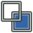 [Toggle Wireframe](#button-draft_toggledisplaymode) | Draft | Tools |
|  [Working Plane Proxy](#button-draft_workingplaneproxy) | Draft | Tools |

#### Draft Snap

| Command | Plus mode | Plus tab / location |
| --- | --- | --- |
|  [Snap Lock](#button-draft_snap_lock) | Draft / BIM | Tools |
|  [Snap Endpoint](#button-draft_snap_endpoint) | Draft / BIM | Tools |
|  [Snap Midpoint](#button-draft_snap_midpoint) | Draft / BIM | Tools |
|  [Snap Center](#button-draft_snap_center) | Draft / BIM | Tools |
|  [Snap Angle](#button-draft_snap_angle) | Draft / BIM | Tools |
|  [Snap Intersection](#button-draft_snap_intersection) | Draft / BIM | Tools |
|  [Snap Perpendicular](#button-draft_snap_perpendicular) | Draft / BIM | Tools |
|  [Snap Extension](#button-draft_snap_extension) | Draft / BIM | Tools |
|  [Snap Parallel](#button-draft_snap_parallel) | Draft / BIM | Tools |
|  [Snap Special](#button-draft_snap_special) | Draft / BIM | Tools |
|  [Snap Near](#button-draft_snap_near) | Draft / BIM | Tools |
|  [Snap Ortho](#button-draft_snap_ortho) | Draft / BIM | Tools |
|  [Snap Grid](#button-draft_snap_grid) | Draft / BIM | Tools |
|  [Snap Working Plane](#button-draft_snap_workingplane) | Draft / BIM | Tools |
|  [Snap Dimensions](#button-draft_snap_dimensions) | Draft / BIM | Tools |
|  [Toggle Grid](#button-draft_togglegrid) | Draft / BIM | Tools |

### Assembly workbench

Definition: [`src/Mod/Assembly/InitGui.py`](../../../src/Mod/Assembly/InitGui.py).

#### Assembly

| Command | Plus mode | Plus tab / location |
| --- | --- | --- |
| 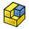 [New Assembly](#button-assembly_createassembly) | Design / Assembly | Home; Assembly; Tools |
| 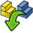 [Insert Component](#button-assembly_insert) | Design / Assembly | Home; Assembly; Tools |
|  [Circular Link Array](#button-part_linkarrays) | Design / Assembly | Assembly; Tools |
|  [Solve Assembly](#button-assembly_solveassembly) | Design / Assembly | Home; Assembly; Tools |
| 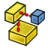 [Exploded View](#button-assembly_createview) | Design / Assembly | Assembly; Tools |
|  [Snapshot](#button-assembly_createsnapshot) | Design / Assembly | Assembly; Tools |
|  [Simulation](#button-assembly_createsimulation) | Design / Assembly | Assembly; Tools |
|  [Bill of Materials](#button-assembly_createbom) | Design / Assembly | Assembly; Tools |

#### Assembly Joints

| Command | Plus mode | Plus tab / location |
| --- | --- | --- |
|  [Toggle Grounded](#button-assembly_togglegrounded) | Design / Assembly | Assembly; Tools |
|  [Create Rigid Group](#button-assembly_createjointrigidgroup) | Design / Assembly | Home; Assembly; Tools |
|  [Fixed Joint](#button-assembly_createjointfixed) | Design / Assembly | Home; Assembly; Tools |
|  [Revolute Joint](#button-assembly_createjointrevolute) | Design / Assembly | Home; Assembly; Tools |
|  [Cylindrical Joint](#button-assembly_createjointcylindrical) | Design / Assembly | Home; Assembly; Tools |
|  [Slider Joint](#button-assembly_createjointslider) | Design / Assembly | Home; Assembly; Tools |
|  [Ball Joint](#button-assembly_createjointball) | Design / Assembly | Home; Assembly; Tools |
|  [Distance Joint](#button-assembly_createjointdistance) | Design / Assembly | Home; Assembly; Tools |
|  [Parallel Joint](#button-assembly_createjointparallel) | Design / Assembly | Home; Assembly; Tools |
|  [Perpendicular Joint](#button-assembly_createjointperpendicular) | Design / Assembly | Home; Assembly; Tools |
| 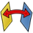 [Angle Joint](#button-assembly_createjointangle) | Design / Assembly | Home; Assembly; Tools |
|  [Rack and Pinion Joint](#button-assembly_createjointrackpinion) | Design / Assembly | Home; Assembly; Tools |
| 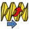 [Screw Joint](#button-assembly_createjointscrew) | Design / Assembly | Home; Assembly; Tools |
|  [Gears Joint](#button-assembly_createjointgearbelt) | Design / Assembly | Assembly; Tools |

### CAM workbench

Definition: [`src/Mod/CAM/InitGui.py`](../../../src/Mod/CAM/InitGui.py).

#### Project Setup

| Command | Plus mode | Plus tab / location |
| --- | --- | --- |
|  [New Job](#button-cam_job) | CAM | Tools |
|  [Work Plane](#button-cam_workplane) | CAM | Tools |
|  [Sanity Check](#button-cam_sanity) | CAM | Tools |
|  [Post Process](#button-cam_posttools) | CAM | Tools |

#### Tool Commands

| Command | Plus mode | Plus tab / location |
| --- | --- | --- |
|  [CAM Simulator](#button-cam_simtools) | CAM | Tools |
|  [Inspect Toolpath](#button-cam_inspect) | CAM | Tools |
|  [Finish Selecting Loop](#button-cam_selectloop) | CAM | Tools |
|  [Toggle Operation](#button-cam_opactivetoggle) | CAM | Tools |
|  [Add Toolbit…](#button-cam_toolbitdock) | CAM | Tools |

#### New Operations

| Command | Plus mode | Plus tab / location |
| --- | --- | --- |
|  [Profile](#button-cam_profile) | CAM | Tools |
|  [Pocket Shape](#button-cam_pocket_shape) | CAM | Tools |
|  [Mill Facing](#button-cam_millfacing) | CAM | Tools |
|  [Helix](#button-cam_helix) | CAM | Tools |
|  [Adaptive](#button-cam_adaptive) | CAM | Tools |
|  [Slot](#button-cam_slot) | CAM | Tools |
|  [Drilling](#button-cam_drillingtools) | CAM | Tools |
|  [Engrave](#button-cam_engravetools) | CAM | Tools |

#### Path Modification

| Command | Plus mode | Plus tab / location |
| --- | --- | --- |
|  [Copy Operation](#button-cam_operationcopy) | CAM | Tools |
|  [Array](#button-cam_array) | CAM | Tools |
|  [Simple Copy](#button-cam_simplecopy) | CAM | Tools |
|  [Array](#button-cam_dressuptools) | CAM | Tools |

### TechDraw workbench

Definition: [`src/Mod/TechDraw/Gui/Workbench.cpp`](../../../src/Mod/TechDraw/Gui/Workbench.cpp).

#### TechDraw Pages

| Command | Plus mode | Plus tab / location |
| --- | --- | --- |
|  [New Page](#button-techdraw_pagedefault) | TechDraw | Tools |
|  [New Page From Template](#button-techdraw_pagetemplate) | TechDraw | Tools |
|  [Update Template Fields](#button-techdraw_filltemplatefields) | TechDraw | Tools |
|  [Redraw Page](#button-techdraw_redrawpage) | TechDraw | Tools |
|  [Print All Pages](#button-techdraw_printall) | TechDraw | Tools |

#### TechDraw Views

| Command | Plus mode | Plus tab / location |
| --- | --- | --- |
|  [New View](#button-techdraw_view) | TechDraw | Tools |
|  [Broken View](#button-techdraw_brokenview) | TechDraw | Tools |
|  [Active View](#button-techdraw_activeview) | TechDraw | Tools |
| 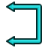 [Section View](#button-techdraw_sectiongroup) | TechDraw | Tools |
|  [Detail View](#button-techdraw_detailview) | TechDraw | Tools |
|  [Draft View](#button-techdraw_draftview) | TechDraw | Tools |
|  [Spreadsheet View](#button-techdraw_spreadsheetview) | TechDraw | Tools |
|  [Clip Group](#button-techdraw_clipgroup) | TechDraw | Tools |

#### TechDraw Stacking

| Command | Plus mode | Plus tab / location |
| --- | --- | --- |
|  [Stack Top](#button-techdraw_stackgroup) | TechDraw | Tools |

#### TechDraw Dimensions

| Command | Plus mode | Plus tab / location |
| --- | --- | --- |
| 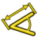 [Dimension](#button-techdraw_dimension) | Menus / shortcuts | No dedicated ribbon button |
|  [Dimension](#button-techdraw_compdimensiontools) | TechDraw | Tools |
|  [Length Dimension](#button-techdraw_lengthdimension) | Menus / shortcuts | No dedicated ribbon button |
|  [Horizontal Length Dimension](#button-techdraw_horizontaldimension) | Menus / shortcuts | No dedicated ribbon button |
|  [Vertical Length Dimension](#button-techdraw_verticaldimension) | Menus / shortcuts | No dedicated ribbon button |
|  [Radius Dimension](#button-techdraw_radiusdimension) | Menus / shortcuts | No dedicated ribbon button |
|  [Diameter Dimension](#button-techdraw_diameterdimension) | Menus / shortcuts | No dedicated ribbon button |
|  [Angle Dimension](#button-techdraw_angledimension) | Menus / shortcuts | No dedicated ribbon button |
|  [Angle Dimension From 3 Points](#button-techdraw_3ptangledimension) | Menus / shortcuts | No dedicated ribbon button |
|  [Area Annotation](#button-techdraw_areadimension) | Menus / shortcuts | No dedicated ribbon button |
|  [Horizontal extent](#button-techdraw_extentgroup) | Menus / shortcuts | No dedicated ribbon button |
|  [Balloon Annotation](#button-techdraw_balloon) | TechDraw | Tools |
|  [Axonometric Length Dimension](#button-techdraw_axolengthdimension) | TechDraw | Tools |
|  [Repair Dimension References](#button-techdraw_dimensionrepair) | TechDraw | Tools |

#### TechDraw Attributes

| Command | Plus mode | Plus tab / location |
| --- | --- | --- |
|  [Select Line Attributes, Cascade Spacing and Delta Distance](#button-techdraw_extensionselectlineattributes) | TechDraw | Tools |
|  [Change Line Attributes](#button-techdraw_extensionchangelineattributes) | TechDraw | Tools |
|  [Extend Line](#button-techdraw_extensionextendshortenlinegroup) | TechDraw | Tools |
|  [Toggle View Lock](#button-techdraw_extensionlockunlockview) | TechDraw | Tools |
|  [Position Section View](#button-techdraw_extensionpositionsectionview) | TechDraw | Tools |
|  [Area Annotation](#button-techdraw_extensionareaannotation) | Menus / shortcuts | No dedicated ribbon button |
|  [Arc Length Annotation](#button-techdraw_extensionarclengthannotation) | Menus / shortcuts | No dedicated ribbon button |
| 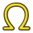 [Customize Format Label](#button-techdraw_extensioncustomizeformat) | TechDraw | Tools |

#### TechDraw Centerlines

| Command | Plus mode | Plus tab / location |
| --- | --- | --- |
|  [Circle Centerlines](#button-techdraw_extensioncirclecenterlinesgroup) | TechDraw | Tools |
|  [Cosmetic Thread Hole Side View](#button-techdraw_extensionthreadsgroup) | TechDraw | Tools |
|  [Cosmetic Intersection Vertices](#button-techdraw_commandvertexcreationgroup) | TechDraw | Tools |
|  [Cosmetic 1 Point Circle](#button-techdraw_extensiondrawcirclesgroup) | TechDraw | Tools |
|  [Cosmetic Parallel Line](#button-techdraw_extensionlineppgroup) | TechDraw | Tools |

#### TechDraw Extend Dimensions

| Command | Plus mode | Plus tab / location |
| --- | --- | --- |
| 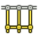 [Horizontal Chain Dimension](#button-techdraw_extensioncreatechaindimensiongroup) | Menus / shortcuts | No dedicated ribbon button |
|  [Horizontal Coordinate Dimension](#button-techdraw_extensioncreatecoorddimensiongroup) | Menus / shortcuts | No dedicated ribbon button |
|  [Horizontal Chamfer Dimension](#button-techdraw_extensionchamferdimensiongroup) | Menus / shortcuts | No dedicated ribbon button |
| 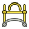 [Arc Length Dimension](#button-techdraw_extensioncreatelengtharc) | Menus / shortcuts | No dedicated ribbon button |
|  [Insert '⌀' Prefix](#button-techdraw_extensioninsertprefixgroup) | TechDraw | Tools |
|  [Increase Decimal Places](#button-techdraw_extensionincreasedecreasegroup) | TechDraw | Tools |

#### TechDraw File Access

| Command | Plus mode | Plus tab / location |
| --- | --- | --- |
|  [Export Page as SVG](#button-techdraw_exportpagesvg) | TechDraw | Tools |
| 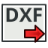 [Export Page as DXF](#button-techdraw_exportpagedxf) | TechDraw | Tools |

#### TechDraw Decoration

| Command | Plus mode | Plus tab / location |
| --- | --- | --- |
|  [Toggle View Frames](#button-techdraw_toggleframe) | TechDraw | Tools |
|  [Image Hatch](#button-techdraw_hatch) | TechDraw | Tools |
|  [Geometric Hatch](#button-techdraw_geometrichatch) | TechDraw | Tools |

#### TechDraw Annotation

| Command | Plus mode | Plus tab / location |
| --- | --- | --- |
|  [Rich Text Annotation](#button-techdraw_richtextannotation) | TechDraw | Tools |
| 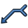 [Leader Line](#button-techdraw_leaderline) | TechDraw | Tools |
|  [Cosmetic Vertex](#button-techdraw_cosmeticvertexgroup) | TechDraw | Tools |
|  [Centerline on Face](#button-techdraw_centerlinegroup) | TechDraw | Tools |
|  [Cosmetic Line Through 2 Points](#button-techdraw_2pointcosmeticline) | TechDraw | Tools |
|  [Edit Line Appearance](#button-techdraw_decorateline) | TechDraw | Tools |
|  [Toggle Edge Visibility](#button-techdraw_showall) | TechDraw | Tools |
|  [Weld Symbol](#button-techdraw_weldsymbol) | TechDraw | Tools |
| 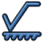 [Surface Finish Symbol](#button-techdraw_surfacefinishsymbols) | TechDraw | Tools |
|  [Hole/Shaft Fit](#button-techdraw_holeshaftfit) | TechDraw | Tools |

### FEM workbench

Definition: [`src/Mod/Fem/Gui/Workbench.cpp`](../../../src/Mod/Fem/Gui/Workbench.cpp). **Source-only; unavailable in the inspected build.**

#### Model

| Command | Plus mode | Plus tab / location |
| --- | --- | --- |
|  [New Analysis](#button-fem_analysis) | FEM | Tools |
|  [Solid Material](#button-fem_materialsolid) | FEM | Tools |
|  [Fluid Material](#button-fem_materialfluid) | FEM | Tools |
|  [Non-Linear Mechanical Material](#button-fem_materialmechanicalnonlinear) | FEM | Tools |
|  [Reinforced Material (Concrete)](#button-fem_materialreinforced) | FEM | Tools |
|  [Material Editor](#button-fem_materialeditor) | FEM | Tools |
|  [Beam Cross Section](#button-fem_elementgeometry1d) | FEM | Tools |
|  [Beam Rotation](#button-fem_elementrotation1d) | FEM | Tools |
|  [Shell Plate Thickness](#button-fem_elementgeometry2d) | FEM | Tools |
|  [Fluid Section for 1D Flow](#button-fem_elementfluid1d) | FEM | Tools |

#### Electromagnetic Boundary Conditions

| Command | Plus mode | Plus tab / location |
| --- | --- | --- |
| — [Electromagnetic Boundary Conditions](#button-fem_compemconstraints) | FEM | Tools |

#### Fluid Boundary Conditions

| Command | Plus mode | Plus tab / location |
| --- | --- | --- |
|  [Initial Flow Velocity Condition](#button-fem_constraintinitialflowvelocity) | FEM | Tools |
|  [Initial Pressure Condition](#button-fem_constraintinitialpressure) | FEM | Tools |
|  [Flow Velocity Boundary Condition](#button-fem_constraintflowvelocity) | FEM | Tools |

#### Geometrical Analysis Features

| Command | Plus mode | Plus tab / location |
| --- | --- | --- |
|  [Plane Multi-Point Constraint](#button-fem_constraintplanerotation) | FEM | Tools |
|  [Section Print Feature](#button-fem_constraintsectionprint) | FEM | Tools |
|  [Local Coordinate System](#button-fem_constrainttransform) | FEM | Tools |

#### Mechanical Boundary Conditions and Loads

| Command | Plus mode | Plus tab / location |
| --- | --- | --- |
|  [Fixed Boundary Condition](#button-fem_constraintfixed) | FEM | Tools |
|  [Rigid Body Constraint](#button-fem_constraintrigidbody) | FEM | Tools |
|  [Displacement Boundary Condition](#button-fem_constraintdisplacement) | FEM | Tools |
|  [Contact Constraint](#button-fem_constraintcontact) | FEM | Tools |
|  [Tie Constraint](#button-fem_constrainttie) | FEM | Tools |
|  [Spring Boundary Condition](#button-fem_constraintspring) | FEM | Tools |
|  [Force Load](#button-fem_constraintforce) | FEM | Tools |
|  [Pressure Load](#button-fem_constraintpressure) | FEM | Tools |
|  [Centrifugal Load](#button-fem_constraintcentrif) | FEM | Tools |
|  [Gravity Load](#button-fem_constraintselfweight) | FEM | Tools |

#### Thermal Boundary Conditions and Loads

| Command | Plus mode | Plus tab / location |
| --- | --- | --- |
|  [Initial Temperature](#button-fem_constraintinitialtemperature) | FEM | Tools |
|  [Heat Flux Load](#button-fem_constraintheatflux) | FEM | Tools |
|  [Temperature Boundary Condition](#button-fem_constrainttemperature) | FEM | Tools |
|  [Body Heat Source](#button-fem_constraintbodyheatsource) | FEM | Tools |

#### Mesh

| Command | Plus mode | Plus tab / location |
| --- | --- | --- |
|  [Mesh From Shape by Netgen](#button-fem_meshnetgenfromshape) | FEM | Tools |
|  [Mesh From Shape by Gmsh](#button-fem_meshgmshfromshape) | FEM | Tools |
|  [Mesh Refinement](#button-fem_meshregion) | FEM | Tools |
|  [Mesh Group](#button-fem_meshgroup) | FEM | Tools |
| — [GMSH Refinements](#button-fem_meshgmshrefinement) | FEM | Tools |
|  [FEM Mesh to Mesh](#button-fem_femmesh2mesh) | FEM | Tools |

#### Solve

| Command | Plus mode | Plus tab / location |
| --- | --- | --- |
| — [Solvers](#button-fem_compsolvers) | FEM | Tools |
| — [Mechanical Equations](#button-fem_compmechequations) | FEM | Tools |
| — [Electromagnetic Equations](#button-fem_compemequations) | FEM | Tools |
|  [Flow Equation](#button-fem_equationflow) | FEM | Tools |
|  [Flux Equation](#button-fem_equationflux) | FEM | Tools |
|  [Heat Equation](#button-fem_equationheat) | FEM | Tools |
|  [Solver Job Control](#button-fem_solvercontrol) | FEM | Tools |
|  [Run Solver](#button-fem_solverrun) | FEM | Tools |

#### Results

| Command | Plus mode | Plus tab / location |
| --- | --- | --- |
|  [Purge Results](#button-fem_resultspurge) | FEM | Tools |
|  [Show Result](#button-fem_resultshow) | FEM | Tools |
|  [Apply Changes to Pipeline](#button-fem_postapplychanges) | FEM | Tools |
|  [Post Pipeline From Result](#button-fem_postpipelinefromresult) | FEM | Tools |
|  [Pipeline Branch](#button-fem_postbranchfilter) | FEM | Tools |
|  [Warp Filter](#button-fem_postfilterwarp) | FEM | Tools |
|  [Scalar Clip Filter](#button-fem_postfilterclipscalar) | FEM | Tools |
|  [Function Cut Filter](#button-fem_postfiltercutfunction) | FEM | Tools |
|  [Region Clip Filter](#button-fem_postfilterclipregion) | FEM | Tools |
|  [Contours Filter](#button-fem_postfiltercontours) | FEM | Tools |
|  [Glyph Filter](#button-fem_postfilterglyph) | FEM | Tools |
|  [Line Clip Filter](#button-fem_postfilterdataalongline) | FEM | Tools |
|  [Stress Linearization Plot](#button-fem_postfilterlinearizedstresses) | FEM | Tools |
|  [Data at Point Clip Filter](#button-fem_postfilterdataatpoint) | FEM | Tools |
|  [Calculator Filter](#button-fem_postfiltercalculator) | FEM | Tools |
| — [Filter Functions](#button-fem_postcreatefunctions) | FEM | Tools |
| — [Data Visualizations](#button-fem_postvisualization) | FEM | Tools |

#### Utilities

| Command | Plus mode | Plus tab / location |
| --- | --- | --- |
|  [Clipping Plane on Face](#button-fem_clippingplaneadd) | FEM | Tools |
|  [Remove All Clipping Planes](#button-fem_clippingplaneremoveall) | FEM | Tools |
|  [FEM Examples](#button-fem_examples) | FEM | Tools |

### Spreadsheet workbench

Definition: [`src/Mod/Spreadsheet/Gui/Workbench.cpp`](../../../src/Mod/Spreadsheet/Gui/Workbench.cpp).

#### Spreadsheet

| Command | Plus mode | Plus tab / location |
| --- | --- | --- |
|  [New Spreadsheet](#button-spreadsheet_createsheet) | Spreadsheet | Tools |
|  [Import Spreadsheet](#button-spreadsheet_import) | Spreadsheet | Tools |
|  [Export Spreadsheet](#button-spreadsheet_export) | Spreadsheet | Tools |
|  [Merge Cells](#button-spreadsheet_mergecells) | Spreadsheet | Tools |
|  [Split Cell](#button-spreadsheet_splitcell) | Spreadsheet | Tools |
|  [Align Left](#button-spreadsheet_alignleft) | Spreadsheet | Tools |
|  [Align Horizontal Center](#button-spreadsheet_aligncenter) | Spreadsheet | Tools |
|  [Align Right](#button-spreadsheet_alignright) | Spreadsheet | Tools |
|  [Align Top](#button-spreadsheet_aligntop) | Spreadsheet | Tools |
|  [Align Vertical Center](#button-spreadsheet_alignvcenter) | Spreadsheet | Tools |
|  [Align Bottom](#button-spreadsheet_alignbottom) | Spreadsheet | Tools |
|  [Bold Text](#button-spreadsheet_stylebold) | Spreadsheet | Tools |
|  [Italic Text](#button-spreadsheet_styleitalic) | Spreadsheet | Tools |
|  [Underline Text](#button-spreadsheet_styleunderline) | Spreadsheet | Tools |
|  [Set Alias](#button-spreadsheet_setalias) | Spreadsheet | Tools |

### Material workbench

Definition: [`src/Mod/Material/Gui/Workbench.cpp`](../../../src/Mod/Material/Gui/Workbench.cpp).

#### Material

| Command | Plus mode | Plus tab / location |
| --- | --- | --- |
|  [Edit](#button-material_edit) | Material | Tools |

### MeshPart workbench

Definition: [`src/Mod/MeshPart/Gui/Workbench.cpp`](../../../src/Mod/MeshPart/Gui/Workbench.cpp). **Source-only; unavailable in the inspected build.**

#### MeshPart

| Command | Plus mode | Plus tab / location |
| --- | --- | --- |
|  [Mesh From Shape](#button-meshpart_mesher) | MeshPart | Tools |

### Points workbench

Definition: [`src/Mod/Points/Gui/Workbench.cpp`](../../../src/Mod/Points/Gui/Workbench.cpp). **Source-only; unavailable in the inspected build.**

#### Points Tools

| Command | Plus mode | Plus tab / location |
| --- | --- | --- |
|  [Import Points…](#button-points_import) | Points | Tools |
|  [Export Points…](#button-points_export) | Points | Tools |
|  [Convert to Points](#button-points_convert) | Points | Tools |
|  [Structured Point Cloud](#button-points_structure) | Points | Tools |
|  [Merge Point Clouds](#button-points_merge) | Points | Tools |
|  [Cut Point Cloud](#button-points_polycut) | Points | Tools |

### Robot workbench

Definition: [`src/Mod/Robot/Gui/Workbench.cpp`](../../../src/Mod/Robot/Gui/Workbench.cpp). **Source-only; unavailable in the inspected build.**

#### Robot

| Command | Plus mode | Plus tab / location |
| --- | --- | --- |
|  [Place Robot](#button-robot_create) | Robot | Tools |
|  [Trajectory](#button-robot_createtrajectory) | Robot | Tools |
|  [Insert in Trajectory](#button-robot_insertwaypoint) | Robot | Tools |
|  [Insert in Trajectory](#button-robot_insertwaypointpreselect) | Robot | Tools |
|  [Edge to Trajectory](#button-robot_edge2trac) | Robot | Tools |
|  [Dress-Up Trajectory](#button-robot_trajectorydressup) | Robot | Tools |
|  [Trajectory Compound](#button-robot_trajectorycompound) | Robot | Tools |
|  [Set Home Position](#button-robot_sethomepos) | Robot | Tools |
|  [Move to Home](#button-robot_restorehomepos) | Robot | Tools |
|  [Simulate Trajectory](#button-robot_simulate) | Robot | Tools |

### ReverseEngineering workbench

Definition: [`src/Mod/ReverseEngineering/Gui/Workbench.cpp`](../../../src/Mod/ReverseEngineering/Gui/Workbench.cpp). **Source-only; unavailable in the inspected build.**

#### Reverse Engineering

| Command | Plus mode | Plus tab / location |
| --- | --- | --- |
|  [Approximate B-Spline Surface…](#button-reen_approxsurface) | ReverseEngineering | Tools |

### Inspection workbench

Definition: [`src/Mod/Inspection/Gui/Workbench.cpp`](../../../src/Mod/Inspection/Gui/Workbench.cpp). **Source-only; unavailable in the inspected build.**

#### Inspection

| Command | Plus mode | Plus tab / location |
| --- | --- | --- |
|  [Visual Inspection](#button-inspection_visualinspection) | Inspection | Tools |
|  [Inspection…](#button-inspection_inspectelement) | Inspection | Tools |

### BIM workbench

Definition: [`src/Mod/BIM/InitGui.py`](../../../src/Mod/BIM/InitGui.py). **Source-only; unavailable in the inspected build.**

#### Drafting Tools

| Command | Plus mode | Plus tab / location |
| --- | --- | --- |
|  [New Sketch](#button-bim_sketch) | BIM | Tools |
|  [Line](#button-draft_line) | Draft / BIM | Tools |
|  [Polyline](#button-draft_wire) | Draft / BIM | Tools |
|  [Rectangle](#button-draft_rectangle) | Draft / BIM | Tools |
|  [Arc Tools](#button-bim_arctools) | BIM | Tools |
|  [Circle](#button-draft_circle) | Draft / BIM | Tools |
|  [Ellipse](#button-draft_ellipse) | Draft / BIM | Tools |
|  [Polygon](#button-draft_polygon) | Draft / BIM | Tools |
|  [Spline Tools](#button-bim_splinetools) | BIM | Tools |
|  [Point](#button-draft_point) | Draft / BIM | Tools |
|  [Fillet](#button-draft_fillet) | Draft / BIM | Tools |

#### Draft Snap

| Command | Plus mode | Plus tab / location |
| --- | --- | --- |
|  [Snap Lock](#button-draft_snap_lock) | Draft / BIM | Tools |
|  [Snap Endpoint](#button-draft_snap_endpoint) | Draft / BIM | Tools |
|  [Snap Midpoint](#button-draft_snap_midpoint) | Draft / BIM | Tools |
|  [Snap Center](#button-draft_snap_center) | Draft / BIM | Tools |
|  [Snap Angle](#button-draft_snap_angle) | Draft / BIM | Tools |
|  [Snap Intersection](#button-draft_snap_intersection) | Draft / BIM | Tools |
|  [Snap Perpendicular](#button-draft_snap_perpendicular) | Draft / BIM | Tools |
|  [Snap Extension](#button-draft_snap_extension) | Draft / BIM | Tools |
|  [Snap Parallel](#button-draft_snap_parallel) | Draft / BIM | Tools |
|  [Snap Special](#button-draft_snap_special) | Draft / BIM | Tools |
|  [Snap Near](#button-draft_snap_near) | Draft / BIM | Tools |
|  [Snap Ortho](#button-draft_snap_ortho) | Draft / BIM | Tools |
|  [Snap Grid](#button-draft_snap_grid) | Draft / BIM | Tools |
|  [Snap Working Plane](#button-draft_snap_workingplane) | Draft / BIM | Tools |
|  [Snap Dimensions](#button-draft_snap_dimensions) | Draft / BIM | Tools |
|  [Toggle Grid](#button-draft_togglegrid) | Draft / BIM | Tools |

#### 3D/BIM Tools

| Command | Plus mode | Plus tab / location |
| --- | --- | --- |
|  [Site](#button-arch_site) | BIM | Tools |
|  [Building](#button-arch_building) | BIM | Tools |
|  [Level](#button-arch_level) | BIM | Tools |
|  [Space](#button-arch_space) | BIM | Tools |
|  [Wall](#button-arch_wall) | BIM | Tools |
|  [Curtain Wall](#button-arch_curtainwall) | BIM | Tools |
|  [Column](#button-bim_column) | BIM | Tools |
|  [Beam](#button-bim_beam) | BIM | Tools |
|  [Slab](#button-bim_slab) | BIM | Tools |
|  [Door](#button-bim_door) | BIM | Tools |
|  [Window](#button-arch_window) | BIM | Tools |
|  [Covering](#button-bim_covering) | BIM | Tools |
|  [Pipe](#button-arch_pipe) | BIM | Tools |
|  [Connector](#button-arch_pipeconnector) | BIM | Tools |
|  [Stairs](#button-arch_stairs) | BIM | Tools |
|  [Roof](#button-arch_roof) | BIM | Tools |
|  [Panel](#button-arch_panel) | BIM | Tools |
|  [Frame](#button-arch_frame) | BIM | Tools |
|  [Fence](#button-arch_fence) | BIM | Tools |
|  [Truss](#button-arch_truss) | BIM | Tools |
|  [Equipment](#button-arch_equipment) | BIM | Tools |
|  [Custom Rebar](#button-arch_rebar) | BIM | Tools |
|  [Generic 3D Tools](#button-bim_generictools) | BIM | Tools |

#### Annotation Tools

| Command | Plus mode | Plus tab / location |
| --- | --- | --- |
|  [Aligned Dimension](#button-bim_dimensionaligned) | BIM | Tools |
|  [Horizontal Dimension](#button-bim_dimensionhorizontal) | BIM | Tools |
|  [Vertical Dimension](#button-bim_dimensionvertical) | BIM | Tools |
|  [Text](#button-bim_text) | BIM | Tools |
|  [Leader](#button-bim_leader) | BIM | Tools |
|  [Label](#button-draft_label) | Draft / BIM | Tools |
|  [Hatch](#button-draft_hatch) | Draft / BIM | Tools |
|  [Axis Tools](#button-bim_axistools) | BIM | Tools |
|  [Grid](#button-arch_grid) | BIM | Tools |
|  [Section Plane](#button-arch_sectionplane) | BIM | Tools |
| — [Create 2D Views](#button-bim_create2dviews) | BIM | Tools |
|  [New Page](#button-bim_tdpage) | BIM | Tools |
|  [New View](#button-bim_tdview) | BIM | Tools |

#### General Tools

| Command | Plus mode | Plus tab / location |
| --- | --- | --- |
|  [Move](#button-draft_move) | Draft / BIM | Tools |
|  [Rotate](#button-draft_rotate) | Draft / BIM | Tools |
|  [Scale](#button-draft_scale) | Draft / BIM | Tools |
|  [Mirror](#button-draft_mirror) | Draft / BIM | Tools |
|  [Cloning Tools](#button-bim_clonetools) | BIM | Tools |
|  [Copy](#button-bim_copy) | BIM | Tools |
|  [Simple Copy](#button-bim_simplecopy) | BIM | Tools |
|  [Compound](#button-bim_compound) | BIM | Tools |

#### 2D Tools

| Command | Plus mode | Plus tab / location |
| --- | --- | --- |
| — [Offset Tools](#button-bim_offsettools) | BIM | Tools |
|  [Trimex](#button-bim_trimex) | BIM | Tools |
|  [Join](#button-draft_join) | Draft / BIM | Tools |
|  [Split](#button-draft_split) | Draft / BIM | Tools |
|  [Stretch](#button-draft_stretch) | Draft / BIM | Tools |
|  [Draft to Sketch](#button-draft_draft2sketch) | Draft / BIM | Tools |
|  [Edit](#button-draft_edit) | Draft / BIM | Tools |

#### Object Tools

| Command | Plus mode | Plus tab / location |
| --- | --- | --- |
|  [Upgrade](#button-draft_upgrade) | Draft / BIM | Tools |
|  [Downgrade](#button-draft_downgrade) | Draft / BIM | Tools |
|  [Add Component](#button-arch_add) | BIM | Tools |
|  [Remove Component](#button-arch_remove) | BIM | Tools |

#### 3D Tools

| Command | Plus mode | Plus tab / location |
| --- | --- | --- |
|  [Array Tools](#button-bim_arraytools) | BIM | Tools |
|  [Cut With Plane](#button-arch_cutplane) | BIM | Tools |
|  [Extrude](#button-bim_extrude) | BIM | Tools |
|  [Extrude Face](#button-bim_extrudeface) | BIM | Tools |
| — [Boolean Tools](#button-bim_booleantools) | BIM | Tools |

#### Manage Tools

| Command | Plus mode | Plus tab / location |
| --- | --- | --- |
|  [BIM Setup](#button-bim_setup) | BIM | Tools |
|  [Setup Project](#button-bim_projectmanager) | BIM | Tools |
|  [Manage Doors and Windows](#button-bim_windows) | BIM | Tools |
|  [IFC Management](#button-bim_ifcmanagetools) | BIM | Tools |
|  [Manage Layers](#button-bim_layers) | BIM | Tools |
|  [Material](#button-bim_material) | BIM | Tools |
|  [Report Tools](#button-bim_reporttools) | BIM | Tools |
|  [Preflight Checks](#button-bim_preflight) | BIM | Tools |
|  [Annotation Styles](#button-draft_annotationstyleeditor) | Draft / BIM | Tools |

### OpenSCAD workbench

Definition: [`src/Mod/OpenSCAD/InitGui.py`](../../../src/Mod/OpenSCAD/InitGui.py). **Source-only; unavailable in the inspected build.**

#### OpenSCAD Tools

| Command | Plus mode | Plus tab / location |
| --- | --- | --- |
|  [Replace Object](#button-openscad_replaceobject) | OpenSCAD | Tools |
|  [Remove Objects and Children](#button-openscad_removesubtree) | OpenSCAD | Tools |
|  [Explode Group](#button-openscad_explodegroup) | OpenSCAD | Tools |
|  [Refine Shape Feature](#button-openscad_refineshapefeature) | OpenSCAD | Tools |
|  [Increase Tolerance Feature](#button-openscad_increasetolerancefeature) | OpenSCAD | Tools |
|  [Add OpenSCAD Element](#button-openscad_addopenscadelement) | OpenSCAD | Tools |
|  [Mesh Boolean](#button-openscad_meshboolean) | OpenSCAD | Tools |
|  [Hull](#button-openscad_hull) | OpenSCAD | Tools |
|  [Minkowski Sum](#button-openscad_minkowski) | OpenSCAD | Tools |

#### Frequently-used Part WB tools

| Command | Plus mode | Plus tab / location |
| --- | --- | --- |
|  [Check Geometry](#button-part_checkgeometry) | Design / Part / OpenSCAD | Modeling; Tools |
|  [Primitive](#button-part_primitives) | Part / OpenSCAD | Tools |
|  [Shape Builder](#button-part_builder) | Part / OpenSCAD | Tools |
|  [Cut](#button-part_cut) | Part / OpenSCAD | Tools |
|  [Union](#button-part_fuse) | Part / OpenSCAD | Tools |
|  [Intersection](#button-part_common) | Part / OpenSCAD | Tools |
|  [Extrude](#button-part_extrude) | Part / OpenSCAD | Tools |
|  [Revolve](#button-part_revolve) | Part / OpenSCAD | Tools |

### Test Framework workbench

Definition: [`src/Mod/Test/InitGui.py`](../../../src/Mod/Test/InitGui.py).

#### TestTools

| Command | Plus mode | Plus tab / location |
| --- | --- | --- |
|  [Self-test...](#button-test_test) | Test Framework | Tools |
|  [Test all](#button-test_testall) | Test Framework | Tools |
|  [Test Document](#button-test_testdoc) | Test Framework | Tools |
|  [Test base](#button-test_testbase) | Test Framework | Tools |

## Plus UI target layout

### Design Layers toolbar

Visible only in Plus Design mode, beside Save/Edit and Selection: **Layers** opens
the task panel; **Move to Layer** and **Change Active Layer** use fixed-label,
whole-button dropdown menus. Move is disabled without eligible preselection;
active-layer choices have check marks. No split default action or wide current-value
combo box is used. The panel provides creation, rename, deletion, assignment, active
choice and eye controls. Base/origin protection and body/sketch independence follow
[the interaction requirements](../UI_UX_SPEC.md#design-layers).

The Contextual Constraint Palette is a viewport overlay, not another top toolbar.
It appears only after sketch selection clicks and uses the shared persistent
selection policy. See [palette interaction requirements](../UI_UX_SPEC.md#contextual-constraint-palette).

### Design Selection toolbar

Source addition, October 3: `FreeCADPlusSelection` appears alongside the common
Save/Edit row above the ribbon only in Design mode. Its ordered controls are
Single Curve / Connected Curves / Tangent Curves; Selection Filter with independent
Planes, Bodies, Surfaces, Faces, Edges, Curves, Points, Vertices checkboxes;
Directional Selection; Persistent Selection. Both toggles default on and retain
saved choices. This is a dedicated toolbar, not an additional ribbon group.
Classic and non-Design modes hide it and deactivate its policy. See
[interaction contract](../UI_UX_SPEC.md#design-selection-toolbar) and WORK_STATE
for source checks and pending grouped native acceptance.

### Size and dropdown key

| Treatment | Use |
| --- | --- |
| Full size / big | Primary operations; one row, bounded captions |
| Medium / half size | Frequently used actions that need less visual weight; bounded captions |
| Small | Secondary actions; no visible caption; three-row grid inside the ribbon |
| Dropdown | A separate property, compatible with any icon size; related or rare choices appear in its menu |

Full icons are 40 logical pixels, medium icons 20, and small icons 16. Full buttons span the 76px grid; two medium buttons (38px each) or three small buttons (24px each) fit a column. Documentation icon size is independent of application button size. Every icon retains a tooltip and accessible name.

### All Modes

**Horizontal common toolbar above the ribbon.** These native actions remain visible when modes or tabs change. All use small icons in one horizontal row. They belong to Plus UI; Classic toolbar restoration must not duplicate them.

#### File group

| Command | Icon size | Dropdown / choices |
| --- | --- | --- |
|  [New File](#button-std_new) | Small | — |
|  [Open…](#button-std_open) | Small | — |
|  [Save](#button-std_save) | Small | — |
|  [Save As…](#button-std_saveas) | Small | — |

#### Edit group

| Command | Icon size | Dropdown / choices |
| --- | --- | --- |
|  [Undo](#button-std_undo) | Small | — |
|  [Redo](#button-std_redo) | Small | — |
|  [Recompute](#button-std_refresh) | Small | — |

#### Clipboard group

| Command | Icon size | Dropdown / choices |
| --- | --- | --- |
|  [Cut](#button-std_cut) | Small | — |
|  [Copy](#button-std_copy) | Small | — |
|  [Paste](#button-std_paste) | Small | — |

### Design Mode

Tabs: **Home → Modeling → Surface → Sketch → Assembly → Mesh → View**. Sketch is retained from the earlier design because the owner's new outline is incomplete. Assembly is added to Design. Home contains curated frequent actions from the other tabs; specialist groups remain in their own tabs.

#### Home tab

Exactly three groups in this order. This revision awaits the next owner build. Common File/Edit/Clipboard remains above the ribbon.

##### Main group

| Command | Icon size | Dropdown / choices |
| --- | --- | --- |
|  [New Component](#button-std_newcomponent) | Medium | — |
|  [Add Component](#button-std_part) | Medium | — |

##### Modeling group

| Command | Icon size | Dropdown / choices |
| --- | --- | --- |
|  [Extrude](#button-partdesign_extrude) | Full size | — |
|  [Revolve](#button-partdesign_revolution) | Full size | — |
|  [Fillet/Chamfer](#button-partdesign_fillet) | Medium; dropdown: Fillet, Chamfer | — |

##### Sketch group

| Command | Icon size | Dropdown / choices |
| --- | --- | --- |
|  [New Sketch](#button-partdesign_newsketch) | Medium | — |
|  [Coordinate System](#button-part_coordinatesystem) | Medium; dropdown: Coordinate System, Plane, Axis, Point | — |

#### Modeling tab

October 6 owner layout; medium and small buttons show icons only. Large captions and group labels retain complete names, using two lines when needed. Gray vertical dividers separate adjacent groups on every tab. Native actions, tooltips and geometry workflows are retained.

| Group | Large buttons | Medium button clusters (two per column) | Small button cluster |
| --- | --- | --- | --- |
| Sketch | New Sketch | — | Edit Sketch; Attach Sketch; Coordinate System dropdown |
| Modeling | Extrude; Revolve | Loft; Helix | — |
| Dress-Up | Fillet and Chamfer split button (default Fillet; Chamfer menu choice) | Draft; Shell/Thickness | — |
| Transformation | — | Mirror Feature; Linear Pattern / Circular Pattern; Multi Transform | — |
| Primitives | Primitives split dropdown, default Box | — | — |
| Other | — | Delete Face/Defeaturing; Add Reference Object | — |

Coordinate System choices: **Coordinate System (default), Plane, Axis, Point**.
Primitives choices: **Box (default), Cylinder, Sphere, Cone, Ellipsoid, Torus, Prism, Wedge, Tab**. Tab remains disabled/unimplemented. Native additive/subtractive primitive tasks are retained. Pipe and the standalone Chamfer/Primitive native commands remain available outside this revised ribbon membership.

#### Surface tab

##### Surface group

| Command | Icon size | Dropdown / choices |
| --- | --- | --- |
|  [Filling](#button-surface_filling) | Small | — |
|  [Fill Boundary Curves](#button-surface_geomfillsurface) | Small | — |
|  [Sections](#button-surface_sections) | Small | — |
|  [Extend Face](#button-surface_extendface) | Full size | — |
|  [Curve on Mesh](#button-surface_curveonmesh) | Small | — |
|  [Blend Curve](#button-surface_blendcurve) | Small | — |

#### Sketch tab

Exact owner layout, source-validated and awaiting the next build. All listed individual buttons remain alongside their dropdowns. Local captions preserve native command names, execution, enabled states and checked states.

##### Sketcher group

| Command | Icon size | Choices |
| --- | --- | --- |
|  [New Sketch](#button-sketcher_newsketch) | Full | — |
|  [Edit Sketch](#button-sketcher_editsketch) | Full | — |
|  [Attach Sketch](#button-sketcher_mapsketch) | Small | — |
|  [Reorient Sketch](#button-sketcher_reorientsketch) | Small | — |
|  [Validate Sketch](#button-sketcher_validatesketch) | Small | — |
|  [Merge Sketches](#button-sketcher_mergesketches) | Small | — |
|  [Mirror Sketch](#button-sketcher_mirrorsketch) | Small | — |

##### Edit Mode group

| Command | Icon size | Choices |
| --- | --- | --- |
|  [Leave Sketch](#button-sketcher_leavesketch) | Small | — |
|  [Align View to Sketch](#button-sketcher_viewsketch) | Small | — |
|  [Toggle Section View](#button-sketcher_viewsection) | Small | — |

##### Geometries group

| Command | Icon size | Choices |
| --- | --- | --- |
|  [Point](#button-sketcher_createpoint) | Small | — |
|  [Text (Experimental)](#button-sketcher_createtext) | Small | — |
|  [Toggle Construction Geometry](#button-sketcher_toggleconstruction) | Small | — |
|  [Line Tools](#button-sketcher_compline) | Small dropdown | Polyline; Line |
|  [Polyline](#button-sketcher_createpolyline) | Full | — |
|  [Line](#button-sketcher_createline) | Small | — |
|  [Arc Tools](#button-sketcher_compcreatearc) | Small dropdown | Arc From Center; Arc From 3 Points; Elliptical Arc; Hyperbolic Arc; Parabolic Arc |
|  [Circle and Conic Tools](#button-sketcher_compcreateconic) | Small dropdown | Circle From Center; Circle From 3 Points; Ellipse From Center; Ellipse From 3 Points |
|  [Rectangle Tools](#button-sketcher_compcreaterectangles) | Small dropdown | Rectangle; Centered Rectangle; Rounded Rectangle |
|  [Regular Polygon Tools](#button-sketcher_compcreateregularpolygon) | Small dropdown | Triangle; Square; Pentagon; Hexagon; Heptagon; Octagon; Polygon |
|  [Slot Tools](#button-sketcher_compslot) | Small dropdown | Slot; Arc Slot |
|  [B-Spline Creation Tools](#button-sketcher_compcreatebspline) | Small dropdown | B-Spline; Periodic B-Spline; B-Spline From Knots; Periodic B-Spline From Knots |

##### Constraints group

| Command | Icon size | Choices |
| --- | --- | --- |
|  [Dimension Tools](#button-sketcher_compdimensiontools) | Full dropdown | Dimension; Horizontal Dimension; Vertical Dimension; Distance Dimension; Radius/Diameter Dimension; Radius Dimension; Diameter Dimension; Angle Dimension; Lock Position |
|  [Dimension](#button-sketcher_dimension) | Full | — |
|  [Horizontal Dimension](#button-sketcher_constraindistancex) | Small | — |
|  [Vertical Dimension](#button-sketcher_constraindistancey) | Small | — |
|  [Distance Dimension](#button-sketcher_constraindistance) | Small | — |
|  [Radius and Diameter Constraints](#button-sketcher_compconstrainraddia) | Small dropdown | Constrain radius; Constrain diameter; Constrain auto radius/diameter |
|  [Angle Dimension](#button-sketcher_constrainangle) | Small | — |
|  [Lock Position](#button-sketcher_constrainlock) | Small | — |
|  [Coincident / Point-on-object](#button-sketcher_constraincoincidentunified) | Small | — |
|  [Coincident Constraint](#button-sketcher_constraincoincident) | Small | — |
|  [Point-on-object Constraint](#button-sketcher_constrainpointonobject) | Small | — |
|  [Horizontal and Vertical Constraints](#button-sketcher_comphorver) | Small dropdown | Horizontal Constraint; Vertical Constraint |
|  [Horizontal Constraint](#button-sketcher_constrainhorizontal) | Small | — |
|  [Vertical Constraint](#button-sketcher_constrainvertical) | Small | — |
|  [Parallel Constraint](#button-sketcher_constrainparallel) | Small | — |
|  [Perpendicular Constraint](#button-sketcher_constrainperpendicular) | Small | — |
|  [Tangent/Collinear Constraint](#button-sketcher_constraintangent) | Small | — |
|  [Equal Constraint](#button-sketcher_constrainequal) | Small | — |
|  [Symmetric Constraint](#button-sketcher_constrainsymmetric) | Small | — |
|  [Block Constraint](#button-sketcher_constrainblock) | Small | — |
|  [Group Constraint (Development preview)](#button-sketcher_constraingroup) | Small | — |
|  [Constraint State](#button-sketcher_comptoggleconstraints) | Small dropdown | Toggle Driving/Reference Constraints; Toggle Constraints |

##### Tools group

| Command | Icon size | Choices |
| --- | --- | --- |
|  [External Geometry](#button-sketcher_compexternal) | Small dropdown | External Projection; External Intersection |
|  [Carbon Copy](#button-sketcher_carboncopy) | Small | — |
|  [Move / Array Transform](#button-sketcher_translate) | Small | — |
|  [Rotate / Polar Transform](#button-sketcher_rotate) | Small | — |
|  [Scale](#button-sketcher_scale) | Small | — |
|  [Offset](#button-sketcher_offset) | Small | — |
|  [Mirror](#button-sketcher_symmetry) | Small | — |
|  [Remove Axes Alignment](#button-sketcher_removeaxesalignment) | Small | — |
|  [Fillet and Chamfer Tools](#button-sketcher_compcreatefillets) | Small dropdown | Fillet; Chamfer |
|  [Curve Editing Tools](#button-sketcher_compcurveedition) | Small dropdown | Trim Edge; Split Edge; Extend Edge |

##### B-Spline group

| Command | Icon size | Choices |
| --- | --- | --- |
|  [Geometry to B-Spline](#button-sketcher_bsplineconverttonurbs) | Small | — |
|  [Increase B-Spline Degree](#button-sketcher_bsplineincreasedegree) | Small | — |
|  [Decrease B-Spline Degree](#button-sketcher_bsplinedecreasedegree) | Small | — |
|  [Knot Multiplicity](#button-sketcher_compmodifyknotmultiplicity) | Small dropdown | Increase knot multiplicity; Decrease knot multiplicity |
|  [Insert Knot](#button-sketcher_bsplineinsertknot) | Small | — |
|  [Join Curves](#button-sketcher_joincurves) | Small | — |

##### Helpers group

| Command | Icon size | Choices |
| --- | --- | --- |
|  [Select Associated Constraints](#button-sketcher_selectconstraints) | Small | — |
|  [Select Associated Geometry](#button-sketcher_selectelementsassociatedwithconstraints) | Small | — |
|  [Toggle Circular Helper for Arcs](#button-sketcher_arcoverlay) | Small | — |
|  [B-Spline Geometry Information](#button-sketcher_compbsplineshowhidegeometryinformation) | Small dropdown | Toggle B-Spline Degree; Toggle B-Spline Control Polygon; Toggle B-Spline Curvature Comb; Toggle B-Spline Knot Multiplicity; Toggle B-Spline Control Point Weight |
|  [Toggle Internal Geometry](#button-sketcher_restoreinternalalignmentgeometry) | Small | — |
|  [Switch Virtual Space](#button-sketcher_switchvirtualspace) | Small | — |

#### Assembly tab

##### Assembly group

| Command | Icon size | Dropdown / choices |
| --- | --- | --- |
|  [Create Assembly](#button-assembly_createassembly) | Full | — |
|  [Insert Component](#button-assembly_insert) | Full | Dropdown |
| ↳  [Insert Component](#button-assembly_insertlink) | Menu item | — |
| ↳ 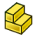 [Insert New Part](#button-assembly_insertnewpart) | Menu item | — |
|  [Link Arrays](#button-part_linkarrays) | Small | Dropdown |
| ↳  [Circular Link Array](#button-part_linkarraycircular) | Menu item | — |
| ↳  [Linear Link Array](#button-part_linkarraylinear) | Menu item | — |
| ↳  [Path Link Array](#button-part_linkarraypath) | Menu item | — |
| ↳  [Point Link Array](#button-part_linkarraypoint) | Menu item | — |
| ↳  [Polar Link Array](#button-part_linkarraypolar) | Menu item | — |
|  [Solve Assembly](#button-assembly_solveassembly) | Small | — |
|  [Exploded View](#button-assembly_createview) | Small | — |
|  [Snapshot](#button-assembly_createsnapshot) | Small | — |
|  [Simulation](#button-assembly_createsimulation) | Small | — |
|  [Bill of Materials](#button-assembly_createbom) | Small | — |

##### Assembly Joints group

| Command | Icon size | Dropdown / choices |
| --- | --- | --- |
|  [Toggle Grounded](#button-assembly_togglegrounded) | Small | — |
|  [Create Rigid Group](#button-assembly_createjointrigidgroup) | Small | — |
|  [Fixed Joint](#button-assembly_createjointfixed) | Small | — |
|  [Revolute Joint](#button-assembly_createjointrevolute) | Small | — |
|  [Cylindrical Joint](#button-assembly_createjointcylindrical) | Small | — |
|  [Slider Joint](#button-assembly_createjointslider) | Small | — |
|  [Ball Joint](#button-assembly_createjointball) | Small | — |
|  [Distance Joint](#button-assembly_createjointdistance) | Small | — |
|  [Parallel Joint](#button-assembly_createjointparallel) | Small | — |
|  [Perpendicular Joint](#button-assembly_createjointperpendicular) | Small | — |
|  [Angle Joint](#button-assembly_createjointangle) | Small | — |
|  [Rack and Pinion Joint](#button-assembly_createjointrackpinion) | Small | — |
|  [Screw Joint](#button-assembly_createjointscrew) | Small | — |
|  [Gears Joint](#button-assembly_createjointgearbelt) | Small | Dropdown |
| ↳  [Gears Joint](#button-assembly_createjointgears) | Menu item | — |
| ↳  [Belt Join](#button-assembly_createjointbelt) | Menu item | — |

#### Mesh tab

##### Mesh Tools group

| Command | Icon size | Dropdown / choices |
| --- | --- | --- |
|  [Import Mesh…](#button-mesh_import) | Full size | — |
|  [Export Mesh…](#button-mesh_export) | Small | — |
|  [Mesh From Shape](#button-mesh_frompartshape) | Small | — |
|  [Regular Solid](#button-mesh_buildregularsolid) | Small | — |

##### Mesh Modify group

| Command | Icon size | Dropdown / choices |
| --- | --- | --- |
|  [Harmonize Normals](#button-mesh_harmonizenormals) | Small | — |
|  [Flip Normals](#button-mesh_flipnormals) | Small | — |
|  [Fill Holes](#button-mesh_fillupholes) | Small | — |
|  [Close Hole](#button-mesh_fillinteractivehole) | Small | — |
|  [Add Triangle](#button-mesh_addfacet) | Small | — |
|  [Remove Components](#button-mesh_removecomponents) | Small | — |
|  [Smooth](#button-mesh_smoothing) | Small | — |
|  [Refinement](#button-mesh_remeshgmsh) | Small | — |
|  [Decimate](#button-mesh_decimating) | Small | — |
|  [Scale](#button-mesh_scale) | Small | — |

##### Mesh Boolean group

| Command | Icon size | Dropdown / choices |
| --- | --- | --- |
|  [Union](#button-mesh_union) | Small | — |
|  [Intersection](#button-mesh_intersection) | Small | — |
|  [Difference](#button-mesh_difference) | Small | — |

##### Mesh Cutting group

| Command | Icon size | Dropdown / choices |
| --- | --- | --- |
|  [Cut](#button-mesh_polycut) | Small | — |
|  [Trim](#button-mesh_polytrim) | Small | — |
|  [Trim With Plane](#button-mesh_trimbyplane) | Small | — |
|  [Section From Plane](#button-mesh_sectionbyplane) | Small | — |
|  [Cross-Sections](#button-mesh_crosssections) | Small | — |

##### Mesh Segmentation group

| Command | Icon size | Dropdown / choices |
| --- | --- | --- |
|  [Merge](#button-mesh_merge) | Small | — |
|  [Split by Components](#button-mesh_splitcomponents) | Small | — |
|  [Segmentation](#button-mesh_segmentation) | Small | — |
|  [Segmentation From Best-Fit Surfaces](#button-mesh_segmentationbestfit) | Small | — |

##### Mesh Analyze group

| Command | Icon size | Dropdown / choices |
| --- | --- | --- |
|  [Evaluate and Repair](#button-mesh_evaluation) | Small | — |
|  [Face Info](#button-mesh_evaluatefacet) | Small | — |
|  [Curvature Plot](#button-mesh_vertexcurvature) | Small | — |
|  [Curvature Info](#button-mesh_curvatureinfo) | Small | — |
|  [Evaluate Solid](#button-mesh_evaluatesolid) | Small | — |
|  [Bounding Box Info](#button-mesh_boundingbox) | Small | — |

#### View tab

##### View group

| Command | Icon size | Dropdown / choices |
| --- | --- | --- |
|  [Fit All](#button-std_viewfitall) | Full size | — |
|  [Fit Selection](#button-std_viewfitselection) | Small | — |
|  [Standard Views](#button-std_viewgroup) | Small | Dropdown |
| ↳ Choices for Standard Views | Menu items | Isometric; Front; Top; Right; Rear; Bottom; Left |
|  [Align to Selection](#button-std_aligntoselection) | Small | — |
|  [Draw Style](#button-std_drawstyle) | Small | Dropdown |
| ↳ Choices for Draw Style | Menu items | As Is; Points; Wireframe; Hidden Line; No Shading; Shaded; Flat Lines |
|  [Measure](#button-std_measure) | Small | — |
|  [Mass Properties](#button-std_massproperties) | Small | — |

##### Individual Views group

| Command | Icon size | Dropdown / choices |
| --- | --- | --- |
|  [Isometric](#button-std_viewisometric) | Small | — |
|  [Front](#button-std_viewfront) | Small | — |
|  [Top](#button-std_viewtop) | Small | — |
|  [Right](#button-std_viewright) | Small | — |
|  [Rear](#button-std_viewrear) | Small | — |
|  [Bottom](#button-std_viewbottom) | Small | — |
|  [Left](#button-std_viewleft) | Small | — |

### Part Mode

#### Home tab

Component access, this mode's frequent operations, and shared utilities. File/Edit/Clipboard stay in the common toolbar above the ribbon.

##### Main group

| Command | Icon size | Dropdown / choices |
| --- | --- | --- |
|  [Add Component](#button-std_part) | Medium (half size) | — |
|  [Components](#button-std_componentstructure) | Medium (half size) | — |

##### Frequent operations group

| Command | Icon size | Dropdown / choices |
| --- | --- | --- |
|  [Cube](#button-part_box) | Medium (half size) | — |
|  [Cylinder](#button-part_cylinder) | Medium (half size) | — |
|  [Sphere](#button-part_sphere) | Medium (half size) | — |

##### Structure group

| Command | Icon size | Dropdown / choices |
| --- | --- | --- |
|  [Components](#button-std_componentstructure) | Small | — |
|  [New Group](#button-std_group) | Small | — |
|  [Make Link](#button-std_linkactions) | Small | Dropdown |
| ↳ Native choices for [Make Link](#button-std_linkactions) | Menu items | See function catalog |
|  [Variable Set](#button-std_varset) | Small | — |
|  [Add Reference Object](#button-partdesign_addreferenceobject) | Small | — |

##### Utilities group

| Command | Icon size | Dropdown / choices |
| --- | --- | --- |
|  [Import…](#button-std_import) | Small | — |
|  [Export…](#button-std_export) | Small | — |
|  [Preferences](#button-std_dlgpreferences) | Small | — |
|  [Command search...](#button-std_commandsearch) | Small | — |
|  [Measure](#button-std_measure) | Small | — |
|  [Mass Properties](#button-std_massproperties) | Small | — |
|  [Delete](#button-std_delete) | Small | — |

##### Help group

| Command | Icon size | Dropdown / choices |
| --- | --- | --- |
| Help | Small | Dropdown |
| ↳  [What's This?](#button-std_whatsthis) | Menu item | — |

##### Macro group

| Command | Icon size | Dropdown / choices |
| --- | --- | --- |
| Macro | Small | Dropdown |
| ↳  [Record Macro](#button-std_dlgmacrorecord) | Menu item | — |
| ↳  [Macros](#button-std_dlgmacroexecute) | Menu item | — |
| ↳  [Execute Macro](#button-std_dlgmacroexecutedirect) | Menu item | — |

#### Tools tab

##### Solids group

| Command | Icon size | Dropdown / choices |
| --- | --- | --- |
|  [Cube](#button-part_box) | Small | — |
|  [Cylinder](#button-part_cylinder) | Small | — |
|  [Sphere](#button-part_sphere) | Small | — |
|  [Cone](#button-part_cone) | Small | — |
|  [Torus](#button-part_torus) | Small | — |
|  [Tube](#button-part_tube) | Small | — |
|  [Primitive](#button-part_primitives) | Small | — |
|  [Shape Builder](#button-part_builder) | Small | — |

##### Part Tools group

| Command | Icon size | Dropdown / choices |
| --- | --- | --- |
|  [New Sketch](#button-sketcher_newsketch) | Full size | — |
|  [Extrude](#button-part_extrude) | Small | — |
|  [Add Reference Object](#button-partdesign_addreferenceobject) | Small | — |
|  [Revolve](#button-part_revolve) | Small | — |
|  [Mirror](#button-part_mirror) | Small | — |
|  [Scale](#button-part_scale) | Small | — |
|  [Fillet](#button-part_fillet) | Small | — |
|  [Chamfer](#button-part_chamfer) | Small | — |
|  [Face From Wires](#button-part_makeface) | Small | — |
|  [Ruled Surface](#button-part_ruledsurface) | Small | — |
|  [Loft](#button-part_loft) | Small | — |
|  [Sweep](#button-part_sweep) | Small | — |
|  [Section](#button-part_section) | Small | — |
|  [Cross-Sections](#button-part_crosssections) | Small | — |
|  [3D Offset](#button-part_compoffset) | Small | Dropdown |
| ↳  [3D Offset](#button-part_offset) | Menu item | — |
| ↳  [2D Offset](#button-part_offset2d) | Menu item | — |
|  [Thickness](#button-part_thickness) | Small | — |
|  [Project on Surface](#button-part_projectiononsurface) | Small | — |
|  [Isocline Curve](#button-part_isoclinecurve) | Small | — |
|  [Appearance per Face](#button-part_colorperface) | Small | — |

##### Boolean Tools group

| Command | Icon size | Dropdown / choices |
| --- | --- | --- |
|  [Compound](#button-part_compcompoundtools) | Small | Dropdown |
| ↳  [Compound](#button-part_compound) | Menu item | — |
| ↳  [Explode Compound](#button-part_explodecompound) | Menu item | — |
| ↳  [Compound Filter](#button-part_compoundfilter) | Menu item | — |
|  [Boolean Operation](#button-part_boolean) | Small | — |
|  [Cut](#button-part_cut) | Small | — |
|  [Union](#button-part_fuse) | Small | — |
|  [Intersection](#button-part_common) | Small | — |
|  [Trim Body](#button-part_trimbody) | Small | — |
|  [Connect Shapes](#button-part_compjoinfeatures) | Small | Dropdown |
| ↳  [Connect Shapes](#button-part_joinconnect) | Menu item | — |
| ↳  [Embed Shapes](#button-part_joinembed) | Menu item | — |
| ↳  [Cutout Shape](#button-part_joincutout) | Menu item | — |
|  [Boolean Fragments](#button-part_compsplitfeatures) | Small | Dropdown |
| ↳  [Boolean Fragments](#button-part_booleanfragments) | Menu item | — |
| ↳  [Slice Apart](#button-part_sliceapart) | Menu item | — |
| ↳  [Slice to Compound](#button-part_slice) | Menu item | — |
| ↳  [Boolean XOR](#button-part_xor) | Menu item | — |
|  [Check Geometry](#button-part_checkgeometry) | Small | — |
|  [Defeaturing](#button-part_defeaturing) | Small | — |

#### View tab

Use the **Design → View** groups and sizes above; each mode activates its native view actions.

### Draft Mode

#### Home tab

Component access, this mode's frequent operations, and shared utilities. File/Edit/Clipboard stay in the common toolbar above the ribbon.

##### Main group

| Command | Icon size | Dropdown / choices |
| --- | --- | --- |
|  [Add Component](#button-std_part) | Medium (half size) | — |
|  [Components](#button-std_componentstructure) | Medium (half size) | — |

##### Frequent operations group

| Command | Icon size | Dropdown / choices |
| --- | --- | --- |
|  [Line](#button-draft_line) | Medium (half size) | — |
|  [Polyline](#button-draft_wire) | Medium (half size) | — |
|  [Fillet](#button-draft_fillet) | Medium (half size) | — |

##### Structure group

| Command | Icon size | Dropdown / choices |
| --- | --- | --- |
|  [Components](#button-std_componentstructure) | Small | — |
|  [New Group](#button-std_group) | Small | — |
|  [Make Link](#button-std_linkactions) | Small | Dropdown |
| ↳ Native choices for [Make Link](#button-std_linkactions) | Menu items | See function catalog |
|  [Variable Set](#button-std_varset) | Small | — |
|  [Add Reference Object](#button-partdesign_addreferenceobject) | Small | — |

##### Utilities group

| Command | Icon size | Dropdown / choices |
| --- | --- | --- |
|  [Import…](#button-std_import) | Small | — |
|  [Export…](#button-std_export) | Small | — |
|  [Preferences](#button-std_dlgpreferences) | Small | — |
|  [Command search...](#button-std_commandsearch) | Small | — |
|  [Measure](#button-std_measure) | Small | — |
|  [Mass Properties](#button-std_massproperties) | Small | — |
|  [Delete](#button-std_delete) | Small | — |

##### Help group

| Command | Icon size | Dropdown / choices |
| --- | --- | --- |
| Help | Small | Dropdown |
| ↳  [What's This?](#button-std_whatsthis) | Menu item | — |

##### Macro group

| Command | Icon size | Dropdown / choices |
| --- | --- | --- |
| Macro | Small | Dropdown |
| ↳  [Record Macro](#button-std_dlgmacrorecord) | Menu item | — |
| ↳  [Macros](#button-std_dlgmacroexecute) | Menu item | — |
| ↳  [Execute Macro](#button-std_dlgmacroexecutedirect) | Menu item | — |

#### Tools tab

##### Draft Creation group

| Command | Icon size | Dropdown / choices |
| --- | --- | --- |
|  [Line](#button-draft_line) | Full size | — |
|  [Polyline](#button-draft_wire) | Full size | — |
|  [Fillet](#button-draft_fillet) | Small | — |
|  [Arc](#button-draft_arctools) | Small | Dropdown |
| ↳  [Arc](#button-draft_arc) | Menu item | — |
| ↳  [Arc From 3 Points](#button-draft_arc_3points) | Menu item | — |
|  [Circle](#button-draft_circle) | Small | — |
|  [Ellipse](#button-draft_ellipse) | Small | — |
|  [Rectangle](#button-draft_rectangle) | Small | — |
|  [Polygon](#button-draft_polygon) | Small | — |
|  [B-Spline](#button-draft_bspline) | Small | — |
|  [Cubic Bézier Curve](#button-draft_beziertools) | Small | Dropdown |
| ↳  [Cubic Bézier Curve](#button-draft_cubicbezcurve) | Menu item | — |
| ↳  [Bézier Curve](#button-draft_bezcurve) | Menu item | — |
|  [Point](#button-draft_point) | Small | — |
|  [Facebinder](#button-draft_facebinder) | Small | — |
|  [Shape From Text](#button-draft_shapestring) | Small | — |
|  [Hatch](#button-draft_hatch) | Small | — |

##### Draft Annotation group

| Command | Icon size | Dropdown / choices |
| --- | --- | --- |
|  [Text](#button-draft_text) | Small | — |
|  [Dimension](#button-draft_dimension) | Small | — |
|  [Label](#button-draft_label) | Small | — |
|  [Annotation Styles](#button-draft_annotationstyleeditor) | Small | — |

##### Draft Modification group

| Command | Icon size | Dropdown / choices |
| --- | --- | --- |
|  [Move](#button-draft_move) | Small | — |
|  [Rotate](#button-draft_rotate) | Small | — |
|  [Scale](#button-draft_scale) | Small | — |
|  [Mirror](#button-draft_mirror) | Small | — |
|  [Offset](#button-draft_offset) | Small | — |
|  [Trimex](#button-draft_trimex) | Small | — |
|  [Stretch](#button-draft_stretch) | Small | — |
|  [Clone](#button-draft_clone) | Small | — |
|  [Array](#button-draft_arraytools) | Small | Dropdown |
| ↳  [Array](#button-draft_orthoarray) | Menu item | — |
| ↳  [Polar Array](#button-draft_polararray) | Menu item | — |
| ↳  [Circular Array](#button-draft_circulararray) | Menu item | — |
| ↳  [Path Array](#button-draft_patharray) | Menu item | — |
| ↳  [Path Link Array](#button-draft_pathlinkarray) | Menu item | — |
| ↳  [Point Array](#button-draft_pointarray) | Menu item | — |
| ↳  [Point Link Array](#button-draft_pointlinkarray) | Menu item | — |
| ↳  [Twisted Path Array](#button-draft_pathtwistedarray) | Menu item | — |
| ↳  [Twisted Path Link Array](#button-draft_pathtwistedlinkarray) | Menu item | — |
|  [Edit](#button-draft_edit) | Small | — |
|  [Highlight Subelements](#button-draft_subelementhighlight) | Small | — |
|  [Join](#button-draft_join) | Small | — |
|  [Split](#button-draft_split) | Small | — |
|  [Upgrade](#button-draft_upgrade) | Small | — |
|  [Downgrade](#button-draft_downgrade) | Small | — |
|  [Convert Wire/B-Spline](#button-draft_wiretobspline) | Small | — |
|  [Draft to Sketch](#button-draft_draft2sketch) | Small | — |
|  [Set Slope](#button-draft_slope) | Small | — |
|  [Flip Dimension](#button-draft_flipdimension) | Small | — |
|  [Shape 2D View](#button-draft_shape2dview) | Small | — |

##### Draft Utility group

| Command | Icon size | Dropdown / choices |
| --- | --- | --- |
|  [Manage Layers](#button-draft_layermanager) | Small | — |
|  [New Named Group](#button-draft_addnamedgroup) | Small | — |
|  [Select Group](#button-draft_selectgroup) | Small | — |
|  [Add to Layer](#button-draft_addtolayer) | Small | — |
|  [Add to Group](#button-draft_addtogroup) | Small | — |
|  [Add to Construction Group](#button-draft_addconstruction) | Small | — |
|  [Toggle Wireframe](#button-draft_toggledisplaymode) | Small | — |
|  [Working Plane Proxy](#button-draft_workingplaneproxy) | Small | — |

##### Draft Snap group

| Command | Icon size | Dropdown / choices |
| --- | --- | --- |
|  [Snap Lock](#button-draft_snap_lock) | Small | — |
|  [Snap Endpoint](#button-draft_snap_endpoint) | Small | — |
|  [Snap Midpoint](#button-draft_snap_midpoint) | Small | — |
|  [Snap Center](#button-draft_snap_center) | Small | — |
|  [Snap Angle](#button-draft_snap_angle) | Small | — |
|  [Snap Intersection](#button-draft_snap_intersection) | Small | — |
|  [Snap Perpendicular](#button-draft_snap_perpendicular) | Small | — |
|  [Snap Extension](#button-draft_snap_extension) | Small | — |
|  [Snap Parallel](#button-draft_snap_parallel) | Small | — |
|  [Snap Special](#button-draft_snap_special) | Small | — |
|  [Snap Near](#button-draft_snap_near) | Small | — |
|  [Snap Ortho](#button-draft_snap_ortho) | Small | — |
|  [Snap Grid](#button-draft_snap_grid) | Small | — |
|  [Snap Working Plane](#button-draft_snap_workingplane) | Small | — |
|  [Snap Dimensions](#button-draft_snap_dimensions) | Small | — |
|  [Toggle Grid](#button-draft_togglegrid) | Small | — |

#### View tab

Use the **Design → View** groups and sizes above; each mode activates its native view actions.

### Assembly Mode

#### Home tab

Component access, this mode's frequent operations, and shared utilities. File/Edit/Clipboard stay in the common toolbar above the ribbon.

##### Main group

| Command | Icon size | Dropdown / choices |
| --- | --- | --- |
|  [New Component](#button-std_newcomponent) | Medium (half size) | — |
|  [Add Component](#button-std_part) | Medium (half size) | — |
|  [New Sketch](#button-partdesign_newsketch) | Medium (half size) | — |
|  [Coordinate System](#button-part_coordinatesystem) | Medium (half size) | Dropdown |
| ↳  [Coordinate System](#button-part_coordinatesystem) | Menu item | — |
| ↳  [Datum Plane](#button-part_datumplane) | Menu item | — |
| ↳  [Datum Line](#button-part_datumline) | Menu item | — |
| ↳  [Datum Point](#button-part_datumpoint) | Menu item | — |

##### Modeling group

| Command | Icon size | Dropdown / choices |
| --- | --- | --- |
|  [Extrude](#button-partdesign_extrude) | Full size | — |
|  [Revolve](#button-partdesign_revolution) | Full size | — |
|  [Fillet](#button-partdesign_fillet) | Medium (half size) | — |
|  [Pattern](#button-partdesign_pattern) | Medium (half size) | Dropdown |
| ↳  [Pattern](#button-partdesign_pattern) | Menu item | — |
| ↳  [Circular Pattern](#button-partdesign_circularpattern) | Menu item | — |
| ↳  [Path Pattern](#button-partdesign_pathpattern) | Menu item | — |
| ↳  [Point Pattern](#button-partdesign_pointpattern) | Menu item | — |

##### Surface group

| Command | Icon size | Dropdown / choices |
| --- | --- | --- |
|  [Filling](#button-surface_filling) | Medium (half size) | — |
|  [Fill Boundary Curves](#button-surface_geomfillsurface) | Medium (half size) | — |
|  [Extend Face](#button-surface_extendface) | Medium (half size) | — |

##### Sketch group

| Command | Icon size | Dropdown / choices |
| --- | --- | --- |
|  [Edit Sketch](#button-sketcher_editsketch) | Medium (half size) | — |
|  [Attach Sketch](#button-sketcher_mapsketch) | Medium (half size) | — |
|  [Polyline](#button-sketcher_compline) | Medium (half size) | Dropdown |
| ↳ Native choices for [Polyline](#button-sketcher_compline) | Menu items | See function catalog |
|  [Rectangle](#button-sketcher_compcreaterectangles) | Medium (half size) | Dropdown |
| ↳ Native choices for [Rectangle](#button-sketcher_compcreaterectangles) | Menu items | See function catalog |
|  [Auto Dimension](#button-sketcher_dimension) | Medium (half size) | Dropdown |
| ↳  [Auto Dimension](#button-sketcher_dimension) | Menu item | — |
| ↳  [Vertical Dimension](#button-sketcher_constraindistancey) | Menu item | — |
| ↳  [Horizontal Dimension](#button-sketcher_constraindistancex) | Menu item | — |
| ↳  [Angle Dimension](#button-sketcher_constrainangle) | Menu item | — |
| ↳  [Radius Dimension](#button-sketcher_constrainradius) | Menu item | — |
| ↳  [Diameter Dimension](#button-sketcher_constraindiameter) | Menu item | — |
| ↳  [Distance Dimension](#button-sketcher_constraindistance) | Menu item | — |
| ↳  [Radius/Diameter Dimension](#button-sketcher_constrainradiam) | Menu item | — |
| ↳  [Lock Position](#button-sketcher_constrainlock) | Menu item | — |
| ↳  [Refraction Constraint](#button-sketcher_constrainsnellslaw) | Menu item | — |
|  [Toggle Construction Geometry](#button-sketcher_toggleconstruction) | Medium (half size) | — |

##### Assembly group

| Command | Icon size | Dropdown / choices |
| --- | --- | --- |
|  [New Assembly](#button-assembly_createassembly) | Medium (half size) | — |
|  [Insert Component](#button-assembly_insert) | Medium (half size) | Dropdown |
| ↳  [Insert Component](#button-assembly_insertlink) | Menu item | — |
| ↳  [Add Component](#button-assembly_insertnewpart) | Menu item | — |
|  [Solve Assembly](#button-assembly_solveassembly) | Medium (half size) | — |
|  [Fixed Joint](#button-assembly_createjointfixed) | Medium (half size) | Dropdown |
| ↳  [Create Rigid Group](#button-assembly_createjointrigidgroup) | Menu item | — |
| ↳  [Fixed Joint](#button-assembly_createjointfixed) | Menu item | — |
| ↳  [Revolute Joint](#button-assembly_createjointrevolute) | Menu item | — |
| ↳  [Cylindrical Joint](#button-assembly_createjointcylindrical) | Menu item | — |
| ↳  [Slider Joint](#button-assembly_createjointslider) | Menu item | — |
| ↳  [Ball Joint](#button-assembly_createjointball) | Menu item | — |
| ↳  [Distance Joint](#button-assembly_createjointdistance) | Menu item | — |
| ↳  [Parallel Joint](#button-assembly_createjointparallel) | Menu item | — |
| ↳  [Perpendicular Joint](#button-assembly_createjointperpendicular) | Menu item | — |
| ↳  [Angle Joint](#button-assembly_createjointangle) | Menu item | — |
| ↳  [Rack and Pinion Joint](#button-assembly_createjointrackpinion) | Menu item | — |
| ↳  [Screw Joint](#button-assembly_createjointscrew) | Menu item | — |
| ↳  [Gears Joint](#button-assembly_createjointgears) | Menu item | — |
| ↳  [Belt Joint](#button-assembly_createjointbelt) | Menu item | — |

##### Mesh group

| Command | Icon size | Dropdown / choices |
| --- | --- | --- |
|  [Import Mesh…](#button-mesh_import) | Medium (half size) | — |
|  [Mesh From Shape](#button-mesh_frompartshape) | Medium (half size) | — |
|  [Evaluate and Repair](#button-mesh_evaluation) | Medium (half size) | — |

##### View group

| Command | Icon size | Dropdown / choices |
| --- | --- | --- |
|  [Fit All](#button-std_viewfitall) | Medium (half size) | — |
|  [Isometric](#button-std_viewisometric) | Medium (half size) | — |
|  [As Is](#button-std_drawstyle) | Medium (half size) | Dropdown |
| ↳ Native choices for [As Is](#button-std_drawstyle) | Menu items | See function catalog |
|  [Selection filters…](#button-std_entityselectionfilter) | Medium (half size) | — |

##### Structure group

| Command | Icon size | Dropdown / choices |
| --- | --- | --- |
|  [Components](#button-std_componentstructure) | Small | — |
|  [New Group](#button-std_group) | Small | — |
|  [Make Link](#button-std_linkactions) | Small | Dropdown |
| ↳ Native choices for [Make Link](#button-std_linkactions) | Menu items | See function catalog |
|  [Variable Set](#button-std_varset) | Small | — |
|  [Add Reference Object](#button-partdesign_addreferenceobject) | Small | — |

##### Utilities group

| Command | Icon size | Dropdown / choices |
| --- | --- | --- |
|  [Import…](#button-std_import) | Small | — |
|  [Export…](#button-std_export) | Small | — |
|  [Preferences](#button-std_dlgpreferences) | Small | — |
|  [Command search...](#button-std_commandsearch) | Small | — |
|  [Measure](#button-std_measure) | Small | — |
|  [Mass Properties](#button-std_massproperties) | Small | — |
|  [Delete](#button-std_delete) | Small | — |

##### Help group

| Command | Icon size | Dropdown / choices |
| --- | --- | --- |
| Help | Small | Dropdown |
| ↳  [What's This?](#button-std_whatsthis) | Menu item | — |

##### Macro group

| Command | Icon size | Dropdown / choices |
| --- | --- | --- |
| Macro | Small | Dropdown |
| ↳  [Record Macro](#button-std_dlgmacrorecord) | Menu item | — |
| ↳  [Macros](#button-std_dlgmacroexecute) | Menu item | — |
| ↳  [Execute Macro](#button-std_dlgmacroexecutedirect) | Menu item | — |

#### Tools tab

##### Assembly group

| Command | Icon size | Dropdown / choices |
| --- | --- | --- |
|  [New Assembly](#button-assembly_createassembly) | Small | — |
|  [Insert Component](#button-assembly_insert) | Small | Dropdown |
| ↳  [Insert Component](#button-assembly_insertlink) | Menu item | — |
| ↳  [Add Component](#button-assembly_insertnewpart) | Menu item | — |
|  [Circular Link Array](#button-part_linkarrays) | Small | Dropdown |
| ↳ Native choices for [Circular Link Array](#button-part_linkarrays) | Menu items | See function catalog |
|  [Solve Assembly](#button-assembly_solveassembly) | Small | — |
|  [Exploded View](#button-assembly_createview) | Small | — |
|  [Snapshot](#button-assembly_createsnapshot) | Small | — |
|  [Simulation](#button-assembly_createsimulation) | Small | — |
|  [Bill of Materials](#button-assembly_createbom) | Small | — |

##### Assembly Joints group

| Command | Icon size | Dropdown / choices |
| --- | --- | --- |
|  [Toggle Grounded](#button-assembly_togglegrounded) | Small | — |
|  [Create Rigid Group](#button-assembly_createjointrigidgroup) | Small | — |
|  [Fixed Joint](#button-assembly_createjointfixed) | Small | Dropdown |
| ↳  [Create Rigid Group](#button-assembly_createjointrigidgroup) | Menu item | — |
| ↳  [Fixed Joint](#button-assembly_createjointfixed) | Menu item | — |
| ↳  [Revolute Joint](#button-assembly_createjointrevolute) | Menu item | — |
| ↳  [Cylindrical Joint](#button-assembly_createjointcylindrical) | Menu item | — |
| ↳  [Slider Joint](#button-assembly_createjointslider) | Menu item | — |
| ↳  [Ball Joint](#button-assembly_createjointball) | Menu item | — |
| ↳  [Distance Joint](#button-assembly_createjointdistance) | Menu item | — |
| ↳  [Parallel Joint](#button-assembly_createjointparallel) | Menu item | — |
| ↳  [Perpendicular Joint](#button-assembly_createjointperpendicular) | Menu item | — |
| ↳  [Angle Joint](#button-assembly_createjointangle) | Menu item | — |
| ↳  [Rack and Pinion Joint](#button-assembly_createjointrackpinion) | Menu item | — |
| ↳  [Screw Joint](#button-assembly_createjointscrew) | Menu item | — |
| ↳  [Gears Joint](#button-assembly_createjointgears) | Menu item | — |
| ↳  [Belt Joint](#button-assembly_createjointbelt) | Menu item | — |
|  [Revolute Joint](#button-assembly_createjointrevolute) | Small | — |
|  [Cylindrical Joint](#button-assembly_createjointcylindrical) | Small | — |
|  [Slider Joint](#button-assembly_createjointslider) | Small | — |
|  [Ball Joint](#button-assembly_createjointball) | Small | — |
|  [Distance Joint](#button-assembly_createjointdistance) | Small | — |
|  [Parallel Joint](#button-assembly_createjointparallel) | Small | — |
|  [Perpendicular Joint](#button-assembly_createjointperpendicular) | Small | — |
|  [Angle Joint](#button-assembly_createjointangle) | Small | — |
|  [Rack and Pinion Joint](#button-assembly_createjointrackpinion) | Small | — |
|  [Screw Joint](#button-assembly_createjointscrew) | Small | — |
|  [Gears Joint](#button-assembly_createjointgearbelt) | Small | Dropdown |
| ↳  [Gears Joint](#button-assembly_createjointgears) | Menu item | — |
| ↳  [Belt Joint](#button-assembly_createjointbelt) | Menu item | — |

#### View tab

Use the **Design → View** groups and sizes above; each mode activates its native view actions.

### CAM Mode

#### Home tab

Component access, this mode's frequent operations, and shared utilities. File/Edit/Clipboard stay in the common toolbar above the ribbon.

##### Main group

| Command | Icon size | Dropdown / choices |
| --- | --- | --- |
|  [Add Component](#button-std_part) | Medium (half size) | — |
|  [Components](#button-std_componentstructure) | Medium (half size) | — |

##### Frequent operations group

| Command | Icon size | Dropdown / choices |
| --- | --- | --- |
|  [New Job](#button-cam_job) | Medium (half size) | — |
|  [Review CAM mesh...](#button-cam_meshpreparation) | Medium (half size) | — |
|  [Work Plane](#button-cam_workplane) | Medium (half size) | — |

##### Structure group

| Command | Icon size | Dropdown / choices |
| --- | --- | --- |
|  [Components](#button-std_componentstructure) | Small | — |
|  [New Group](#button-std_group) | Small | — |
|  [Make Link](#button-std_linkactions) | Small | Dropdown |
| ↳ Native choices for [Make Link](#button-std_linkactions) | Menu items | See function catalog |
|  [Variable Set](#button-std_varset) | Small | — |
|  [Add Reference Object](#button-partdesign_addreferenceobject) | Small | — |

##### Utilities group

| Command | Icon size | Dropdown / choices |
| --- | --- | --- |
|  [Import…](#button-std_import) | Small | — |
|  [Export…](#button-std_export) | Small | — |
|  [Preferences](#button-std_dlgpreferences) | Small | — |
|  [Command search...](#button-std_commandsearch) | Small | — |
|  [Measure](#button-std_measure) | Small | — |
|  [Mass Properties](#button-std_massproperties) | Small | — |
|  [Delete](#button-std_delete) | Small | — |

##### Help group

| Command | Icon size | Dropdown / choices |
| --- | --- | --- |
| Help | Small | Dropdown |
| ↳  [What's This?](#button-std_whatsthis) | Menu item | — |

##### Macro group

| Command | Icon size | Dropdown / choices |
| --- | --- | --- |
| Macro | Small | Dropdown |
| ↳  [Record Macro](#button-std_dlgmacrorecord) | Menu item | — |
| ↳  [Macros](#button-std_dlgmacroexecute) | Menu item | — |
| ↳  [Execute Macro](#button-std_dlgmacroexecutedirect) | Menu item | — |

#### Tools tab

##### Project Setup group

| Command | Icon size | Dropdown / choices |
| --- | --- | --- |
|  [New Job](#button-cam_job) | Full size | — |
|  [Review CAM mesh...](#button-cam_meshpreparation) | Small | — |
|  [Work Plane](#button-cam_workplane) | Small | — |
|  [Holding Tab](#button-cam_holdingtab) | Small | — |
|  [Indexed Setup](#button-cam_indexedsetup) | Small | — |
|  [Sanity Check](#button-cam_sanity) | Small | — |
|  [Post Process](#button-cam_posttools) | Small | Dropdown |
| ↳ Native choices for [Post Process](#button-cam_posttools) | Menu items | See function catalog |

##### Tool Commands group

| Command | Icon size | Dropdown / choices |
| --- | --- | --- |
|  [CAM Simulator](#button-cam_simtools) | Small | Dropdown |
| ↳ Native choices for [CAM Simulator](#button-cam_simtools) | Menu items | See function catalog |
|  [Inspect Toolpath](#button-cam_inspect) | Small | — |
|  [Finish Selecting Loop](#button-cam_selectloop) | Small | — |
|  [Toggle Operation](#button-cam_opactivetoggle) | Small | — |
|  [Add Toolbit…](#button-cam_toolbitdock) | Small | — |

##### New Operations group

| Command | Icon size | Dropdown / choices |
| --- | --- | --- |
|  [Profile](#button-cam_profile) | Small | — |
|  [Pocket Shape](#button-cam_pocket_shape) | Small | — |
|  [Mill Facing](#button-cam_millfacing) | Small | — |
|  [Helix](#button-cam_helix) | Small | — |
|  [Adaptive](#button-cam_adaptive) | Small | — |
|  [Slot](#button-cam_slot) | Small | — |
|  [Drilling](#button-cam_drillingtools) | Small | Dropdown |
| ↳ Native choices for [Drilling](#button-cam_drillingtools) | Menu items | See function catalog |
|  [Engrave](#button-cam_engravetools) | Small | Dropdown |
| ↳ Native choices for [Engrave](#button-cam_engravetools) | Menu items | See function catalog |
|  [Parallel / Waterline](#button-cam_planarsurface) | Small | — |

##### Path Modification group

| Command | Icon size | Dropdown / choices |
| --- | --- | --- |
|  [Copy Operation](#button-cam_operationcopy) | Small | — |
|  [Array](#button-cam_array) | Small | — |
|  [Simple Copy](#button-cam_simplecopy) | Small | — |
|  [Array](#button-cam_dressuptools) | Small | Dropdown |
| ↳ Native choices for [Array](#button-cam_dressuptools) | Menu items | See function catalog |

#### View tab

Use the **Design → View** groups and sizes above; each mode activates its native view actions.

### TechDraw Mode

#### Home tab

Component access, this mode's frequent operations, and shared utilities. File/Edit/Clipboard stay in the common toolbar above the ribbon.

##### Main group

| Command | Icon size | Dropdown / choices |
| --- | --- | --- |
|  [Add Component](#button-std_part) | Medium (half size) | — |
|  [Components](#button-std_componentstructure) | Medium (half size) | — |

##### Frequent operations group

| Command | Icon size | Dropdown / choices |
| --- | --- | --- |
|  [New Page](#button-techdraw_pagedefault) | Medium (half size) | — |
|  [New Page From Template](#button-techdraw_pagetemplate) | Medium (half size) | — |
|  [Update Template Fields](#button-techdraw_filltemplatefields) | Medium (half size) | — |

##### Structure group

| Command | Icon size | Dropdown / choices |
| --- | --- | --- |
|  [Components](#button-std_componentstructure) | Small | — |
|  [New Group](#button-std_group) | Small | — |
|  [Make Link](#button-std_linkactions) | Small | Dropdown |
| ↳ Native choices for [Make Link](#button-std_linkactions) | Menu items | See function catalog |
|  [Variable Set](#button-std_varset) | Small | — |
|  [Add Reference Object](#button-partdesign_addreferenceobject) | Small | — |

##### Utilities group

| Command | Icon size | Dropdown / choices |
| --- | --- | --- |
|  [Import…](#button-std_import) | Small | — |
|  [Export…](#button-std_export) | Small | — |
|  [Preferences](#button-std_dlgpreferences) | Small | — |
|  [Command search...](#button-std_commandsearch) | Small | — |
|  [Measure](#button-std_measure) | Small | — |
|  [Mass Properties](#button-std_massproperties) | Small | — |
|  [Delete](#button-std_delete) | Small | — |

##### Help group

| Command | Icon size | Dropdown / choices |
| --- | --- | --- |
| Help | Small | Dropdown |
| ↳  [What's This?](#button-std_whatsthis) | Menu item | — |

##### Macro group

| Command | Icon size | Dropdown / choices |
| --- | --- | --- |
| Macro | Small | Dropdown |
| ↳  [Record Macro](#button-std_dlgmacrorecord) | Menu item | — |
| ↳  [Macros](#button-std_dlgmacroexecute) | Menu item | — |
| ↳  [Execute Macro](#button-std_dlgmacroexecutedirect) | Menu item | — |

#### Tools tab

##### TechDraw Pages group

| Command | Icon size | Dropdown / choices |
| --- | --- | --- |
|  [New Page](#button-techdraw_pagedefault) | Full size | — |
|  [New Page From Template](#button-techdraw_pagetemplate) | Small | — |
|  [Update Template Fields](#button-techdraw_filltemplatefields) | Small | — |
|  [Redraw Page](#button-techdraw_redrawpage) | Small | — |
|  [Print All Pages](#button-techdraw_printall) | Small | — |

##### TechDraw Views group

| Command | Icon size | Dropdown / choices |
| --- | --- | --- |
|  [New View](#button-techdraw_view) | Small | — |
|  [Broken View](#button-techdraw_brokenview) | Small | — |
|  [Active View](#button-techdraw_activeview) | Small | — |
|  [Section View](#button-techdraw_sectiongroup) | Small | Dropdown |
| ↳ Native choices for [Section View](#button-techdraw_sectiongroup) | Menu items | See function catalog |
|  [Detail View](#button-techdraw_detailview) | Small | — |
|  [Draft View](#button-techdraw_draftview) | Small | — |
|  [Spreadsheet View](#button-techdraw_spreadsheetview) | Small | — |
|  [Clip Group](#button-techdraw_clipgroup) | Small | — |

##### TechDraw Stacking group

| Command | Icon size | Dropdown / choices |
| --- | --- | --- |
|  [Stack Top](#button-techdraw_stackgroup) | Small | Dropdown |
| ↳ Native choices for [Stack Top](#button-techdraw_stackgroup) | Menu items | See function catalog |

##### TechDraw Dimensions group

| Command | Icon size | Dropdown / choices |
| --- | --- | --- |
|  [Dimension](#button-techdraw_compdimensiontools) | Small | Dropdown |
| ↳ Native choices for [Dimension](#button-techdraw_compdimensiontools) | Menu items | See function catalog |
|  [Balloon Annotation](#button-techdraw_balloon) | Small | — |
|  [Axonometric Length Dimension](#button-techdraw_axolengthdimension) | Small | — |
|  [Repair Dimension References](#button-techdraw_dimensionrepair) | Small | — |

##### TechDraw Attributes group

| Command | Icon size | Dropdown / choices |
| --- | --- | --- |
|  [Select Line Attributes, Cascade Spacing and Delta Distance](#button-techdraw_extensionselectlineattributes) | Small | — |
|  [Change Line Attributes](#button-techdraw_extensionchangelineattributes) | Small | — |
|  [Extend Line](#button-techdraw_extensionextendshortenlinegroup) | Small | Dropdown |
| ↳ Native choices for [Extend Line](#button-techdraw_extensionextendshortenlinegroup) | Menu items | See function catalog |
|  [Toggle View Lock](#button-techdraw_extensionlockunlockview) | Small | — |
|  [Position Section View](#button-techdraw_extensionpositionsectionview) | Small | — |
|  [Customize Format Label](#button-techdraw_extensioncustomizeformat) | Small | — |

##### TechDraw Centerlines group

| Command | Icon size | Dropdown / choices |
| --- | --- | --- |
|  [Circle Centerlines](#button-techdraw_extensioncirclecenterlinesgroup) | Small | Dropdown |
| ↳ Native choices for [Circle Centerlines](#button-techdraw_extensioncirclecenterlinesgroup) | Menu items | See function catalog |
|  [Cosmetic Thread Hole Side View](#button-techdraw_extensionthreadsgroup) | Small | Dropdown |
| ↳ Native choices for [Cosmetic Thread Hole Side View](#button-techdraw_extensionthreadsgroup) | Menu items | See function catalog |
|  [Cosmetic Intersection Vertices](#button-techdraw_commandvertexcreationgroup) | Small | Dropdown |
| ↳ 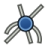 [Cosmetic Intersection Vertices](#button-techdraw_extensionvertexatintersection) | Menu item | — |
| ↳  [Offset Vertex](#button-techdraw_commandaddoffsetvertex) | Menu item | — |
|  [Cosmetic 1 Point Circle](#button-techdraw_extensiondrawcirclesgroup) | Small | Dropdown |
| ↳ Native choices for [Cosmetic 1 Point Circle](#button-techdraw_extensiondrawcirclesgroup) | Menu items | See function catalog |
|  [Cosmetic Parallel Line](#button-techdraw_extensionlineppgroup) | Small | Dropdown |
| ↳ Native choices for [Cosmetic Parallel Line](#button-techdraw_extensionlineppgroup) | Menu items | See function catalog |

##### TechDraw Extend Dimensions group

| Command | Icon size | Dropdown / choices |
| --- | --- | --- |
|  [Insert '⌀' Prefix](#button-techdraw_extensioninsertprefixgroup) | Small | Dropdown |
| ↳ Native choices for [Insert '⌀' Prefix](#button-techdraw_extensioninsertprefixgroup) | Menu items | See function catalog |
|  [Increase Decimal Places](#button-techdraw_extensionincreasedecreasegroup) | Small | Dropdown |
| ↳ Native choices for [Increase Decimal Places](#button-techdraw_extensionincreasedecreasegroup) | Menu items | See function catalog |

##### TechDraw File Access group

| Command | Icon size | Dropdown / choices |
| --- | --- | --- |
|  [Export Page as SVG](#button-techdraw_exportpagesvg) | Small | — |
|  [Export Page as DXF](#button-techdraw_exportpagedxf) | Small | — |

##### TechDraw Decoration group

| Command | Icon size | Dropdown / choices |
| --- | --- | --- |
|  [Toggle View Frames](#button-techdraw_toggleframe) | Small | — |
|  [Image Hatch](#button-techdraw_hatch) | Small | — |
|  [Geometric Hatch](#button-techdraw_geometrichatch) | Small | — |

##### TechDraw Annotation group

| Command | Icon size | Dropdown / choices |
| --- | --- | --- |
|  [Rich Text Annotation](#button-techdraw_richtextannotation) | Small | — |
|  [Leader Line](#button-techdraw_leaderline) | Small | — |
|  [Cosmetic Vertex](#button-techdraw_cosmeticvertexgroup) | Small | Dropdown |
| ↳ Native choices for [Cosmetic Vertex](#button-techdraw_cosmeticvertexgroup) | Menu items | See function catalog |
|  [Centerline on Face](#button-techdraw_centerlinegroup) | Small | Dropdown |
| ↳ Native choices for [Centerline on Face](#button-techdraw_centerlinegroup) | Menu items | See function catalog |
|  [Cosmetic Line Through 2 Points](#button-techdraw_2pointcosmeticline) | Small | — |
|  [Edit Line Appearance](#button-techdraw_decorateline) | Small | — |
|  [Toggle Edge Visibility](#button-techdraw_showall) | Small | — |
|  [Weld Symbol](#button-techdraw_weldsymbol) | Small | — |
|  [Surface Finish Symbol](#button-techdraw_surfacefinishsymbols) | Small | — |
|  [Hole/Shaft Fit](#button-techdraw_holeshaftfit) | Small | — |

#### View tab

Use the **Design → View** groups and sizes above; each mode activates its native view actions.

### FEM Mode

**Conditional / source-only:** show this mode only when its workbench is installed and registered.

#### Home tab

Component access, this mode's frequent operations, and shared utilities. File/Edit/Clipboard stay in the common toolbar above the ribbon.

##### Main group

| Command | Icon size | Dropdown / choices |
| --- | --- | --- |
|  [Add Component](#button-std_part) | Medium (half size) | — |
|  [Components](#button-std_componentstructure) | Medium (half size) | — |

##### Frequent operations group

| Command | Icon size | Dropdown / choices |
| --- | --- | --- |
|  [New Analysis](#button-fem_analysis) | Medium (half size) | — |
|  [Solid Material](#button-fem_materialsolid) | Medium (half size) | — |
|  [Fluid Material](#button-fem_materialfluid) | Medium (half size) | — |

##### Utilities group

| Command | Icon size | Dropdown / choices |
| --- | --- | --- |
|  [Import…](#button-std_import) | Small | — |
|  [Export…](#button-std_export) | Small | — |
|  [Preferences](#button-std_dlgpreferences) | Small | — |
|  [Command search...](#button-std_commandsearch) | Small | — |
|  [Measure](#button-std_measure) | Small | — |
|  [Mass Properties](#button-std_massproperties) | Small | — |
|  [Delete](#button-std_delete) | Small | — |

##### Help group

| Command | Icon size | Dropdown / choices |
| --- | --- | --- |
| Help | Small | Dropdown |
| ↳  [What's This?](#button-std_whatsthis) | Menu item | — |

##### Macro group

| Command | Icon size | Dropdown / choices |
| --- | --- | --- |
| Macro | Small | Dropdown |
| ↳  [Record Macro](#button-std_dlgmacrorecord) | Menu item | — |
| ↳  [Macros](#button-std_dlgmacroexecute) | Menu item | — |
| ↳  [Execute Macro](#button-std_dlgmacroexecutedirect) | Menu item | — |

#### Tools tab

##### Model group

| Command | Icon size | Dropdown / choices |
| --- | --- | --- |
|  [New Analysis](#button-fem_analysis) | Small | — |
|  [Solid Material](#button-fem_materialsolid) | Small | — |
|  [Fluid Material](#button-fem_materialfluid) | Small | — |
|  [Non-Linear Mechanical Material](#button-fem_materialmechanicalnonlinear) | Small | — |
|  [Reinforced Material (Concrete)](#button-fem_materialreinforced) | Small | — |
|  [Material Editor](#button-fem_materialeditor) | Small | — |
|  [Beam Cross Section](#button-fem_elementgeometry1d) | Small | — |
|  [Beam Rotation](#button-fem_elementrotation1d) | Small | — |
|  [Shell Plate Thickness](#button-fem_elementgeometry2d) | Small | — |
|  [Fluid Section for 1D Flow](#button-fem_elementfluid1d) | Small | — |

##### Electromagnetic Boundary Conditions group

| Command | Icon size | Dropdown / choices |
| --- | --- | --- |
| — [Electromagnetic Boundary Conditions](#button-fem_compemconstraints) | Small | Dropdown |
| ↳  [Electromagnetic Boundary Condition](#button-fem_constraintelectromagnetic) | Menu item | — |
| ↳  [Current Density Boundary Condition](#button-fem_constraintcurrentdensity) | Menu item | — |
| ↳  [Magnetization Boundary Condition](#button-fem_constraintmagnetization) | Menu item | — |
| ↳  [Electric Charge Density](#button-fem_constraintelectricchargedensity) | Menu item | — |

##### Fluid Boundary Conditions group

| Command | Icon size | Dropdown / choices |
| --- | --- | --- |
|  [Initial Flow Velocity Condition](#button-fem_constraintinitialflowvelocity) | Small | — |
|  [Initial Pressure Condition](#button-fem_constraintinitialpressure) | Small | — |
|  [Flow Velocity Boundary Condition](#button-fem_constraintflowvelocity) | Small | — |

##### Geometrical Analysis Features group

| Command | Icon size | Dropdown / choices |
| --- | --- | --- |
|  [Plane Multi-Point Constraint](#button-fem_constraintplanerotation) | Small | — |
|  [Section Print Feature](#button-fem_constraintsectionprint) | Small | — |
|  [Local Coordinate System](#button-fem_constrainttransform) | Small | — |

##### Mechanical Boundary Conditions and Loads group

| Command | Icon size | Dropdown / choices |
| --- | --- | --- |
|  [Fixed Boundary Condition](#button-fem_constraintfixed) | Small | — |
|  [Rigid Body Constraint](#button-fem_constraintrigidbody) | Small | — |
|  [Displacement Boundary Condition](#button-fem_constraintdisplacement) | Small | — |
|  [Contact Constraint](#button-fem_constraintcontact) | Small | — |
|  [Tie Constraint](#button-fem_constrainttie) | Small | — |
|  [Spring Boundary Condition](#button-fem_constraintspring) | Small | — |
|  [Force Load](#button-fem_constraintforce) | Small | — |
|  [Pressure Load](#button-fem_constraintpressure) | Small | — |
|  [Centrifugal Load](#button-fem_constraintcentrif) | Small | — |
|  [Gravity Load](#button-fem_constraintselfweight) | Small | — |

##### Thermal Boundary Conditions and Loads group

| Command | Icon size | Dropdown / choices |
| --- | --- | --- |
|  [Initial Temperature](#button-fem_constraintinitialtemperature) | Small | — |
|  [Heat Flux Load](#button-fem_constraintheatflux) | Small | — |
|  [Temperature Boundary Condition](#button-fem_constrainttemperature) | Small | — |
|  [Body Heat Source](#button-fem_constraintbodyheatsource) | Small | — |

##### Mesh group

| Command | Icon size | Dropdown / choices |
| --- | --- | --- |
|  [Mesh From Shape by Netgen](#button-fem_meshnetgenfromshape) | Small | — |
|  [Mesh From Shape by Gmsh](#button-fem_meshgmshfromshape) | Small | — |
|  [Mesh Refinement](#button-fem_meshregion) | Small | — |
|  [Mesh Group](#button-fem_meshgroup) | Small | — |
| — [GMSH Refinements](#button-fem_meshgmshrefinement) | Small | Dropdown |
| ↳  [Distance-Based Refinement](#button-fem_meshdistance) | Menu item | — |
| ↳  [2D Boundary Layer](#button-fem_meshboundarylayer) | Menu item | — |
| ↳  [Shape-Based Refinement](#button-fem_meshshape) | Menu item | — |
| ↳  [Manipulate Refinement](#button-fem_meshmanipulate) | Menu item | — |
| ↳  [Advanced Refinement Types](#button-fem_meshadvanced) | Menu item | — |
| ↳  [Structured Transfinite Curve](#button-fem_meshtransfinitecurve) | Menu item | — |
| ↳  [Structured Transfinite Surface](#button-fem_meshtransfinitesurface) | Menu item | — |
| ↳  [Structured Transfinite Volume](#button-fem_meshtransfinitevolume) | Menu item | — |
|  [FEM Mesh to Mesh](#button-fem_femmesh2mesh) | Small | — |

##### Solve group

| Command | Icon size | Dropdown / choices |
| --- | --- | --- |
| — [Solvers](#button-fem_compsolvers) | Small | Dropdown |
| ↳  [Solver CalculiX](#button-fem_solvercalculix) | Menu item | — |
| ↳  [Solver Elmer](#button-fem_solverelmer) | Menu item | — |
| ↳  [Solver Mystran](#button-fem_solvermystran) | Menu item | — |
| ↳  [Solver Z88](#button-fem_solverz88) | Menu item | — |
| — [Mechanical Equations](#button-fem_compmechequations) | Small | Dropdown |
| ↳  [Elasticity Equation](#button-fem_equationelasticity) | Menu item | — |
| ↳  [Deformation Equation](#button-fem_equationdeformation) | Menu item | — |
| — [Electromagnetic Equations](#button-fem_compemequations) | Small | Dropdown |
| ↳  [Electrostatic Equation](#button-fem_equationelectrostatic) | Menu item | — |
| ↳  [Electricforce Equation](#button-fem_equationelectricforce) | Menu item | — |
| ↳  [Magnetodynamic Equation](#button-fem_equationmagnetodynamic) | Menu item | — |
| ↳  [Magnetodynamic 2D Equation](#button-fem_equationmagnetodynamic2d) | Menu item | — |
| ↳  [Static Current Equation](#button-fem_equationstaticcurrent) | Menu item | — |
|  [Flow Equation](#button-fem_equationflow) | Small | — |
|  [Flux Equation](#button-fem_equationflux) | Small | — |
|  [Heat Equation](#button-fem_equationheat) | Small | — |
|  [Solver Job Control](#button-fem_solvercontrol) | Small | — |
|  [Run Solver](#button-fem_solverrun) | Small | — |

##### Results group

| Command | Icon size | Dropdown / choices |
| --- | --- | --- |
|  [Purge Results](#button-fem_resultspurge) | Small | — |
|  [Show Result](#button-fem_resultshow) | Small | — |
|  [Apply Changes to Pipeline](#button-fem_postapplychanges) | Small | — |
|  [Post Pipeline From Result](#button-fem_postpipelinefromresult) | Small | — |
|  [Pipeline Branch](#button-fem_postbranchfilter) | Small | — |
|  [Warp Filter](#button-fem_postfilterwarp) | Small | — |
|  [Scalar Clip Filter](#button-fem_postfilterclipscalar) | Small | — |
|  [Function Cut Filter](#button-fem_postfiltercutfunction) | Small | — |
|  [Region Clip Filter](#button-fem_postfilterclipregion) | Small | — |
|  [Contours Filter](#button-fem_postfiltercontours) | Small | — |
|  [Glyph Filter](#button-fem_postfilterglyph) | Small | — |
|  [Line Clip Filter](#button-fem_postfilterdataalongline) | Small | — |
|  [Stress Linearization Plot](#button-fem_postfilterlinearizedstresses) | Small | — |
|  [Data at Point Clip Filter](#button-fem_postfilterdataatpoint) | Small | — |
|  [Calculator Filter](#button-fem_postfiltercalculator) | Small | — |
| — [Filter Functions](#button-fem_postcreatefunctions) | Small | — |
| — [Data Visualizations](#button-fem_postvisualization) | Small | — |

##### Utilities group

| Command | Icon size | Dropdown / choices |
| --- | --- | --- |
|  [Clipping Plane on Face](#button-fem_clippingplaneadd) | Small | — |
|  [Remove All Clipping Planes](#button-fem_clippingplaneremoveall) | Small | — |
|  [FEM Examples](#button-fem_examples) | Small | — |

#### View tab

Use the **Design → View** groups and sizes above; each mode activates its native view actions.

### Spreadsheet Mode

#### Home tab

Component access, this mode's frequent operations, and shared utilities. File/Edit/Clipboard stay in the common toolbar above the ribbon.

##### Main group

| Command | Icon size | Dropdown / choices |
| --- | --- | --- |
|  [Add Component](#button-std_part) | Medium (half size) | — |
|  [Components](#button-std_componentstructure) | Medium (half size) | — |

##### Frequent operations group

| Command | Icon size | Dropdown / choices |
| --- | --- | --- |
|  [New Spreadsheet](#button-spreadsheet_createsheet) | Medium (half size) | — |
|  [Import Spreadsheet](#button-spreadsheet_import) | Medium (half size) | — |
|  [Export Spreadsheet](#button-spreadsheet_export) | Medium (half size) | — |

##### Structure group

| Command | Icon size | Dropdown / choices |
| --- | --- | --- |
|  [Components](#button-std_componentstructure) | Small | — |
|  [New Group](#button-std_group) | Small | — |
|  [Make Link](#button-std_linkactions) | Small | Dropdown |
| ↳ Native choices for [Make Link](#button-std_linkactions) | Menu items | See function catalog |
|  [Variable Set](#button-std_varset) | Small | — |
|  [Add Reference Object](#button-partdesign_addreferenceobject) | Small | — |

##### Utilities group

| Command | Icon size | Dropdown / choices |
| --- | --- | --- |
|  [Import…](#button-std_import) | Small | — |
|  [Export…](#button-std_export) | Small | — |
|  [Preferences](#button-std_dlgpreferences) | Small | — |
|  [Command search...](#button-std_commandsearch) | Small | — |
|  [Measure](#button-std_measure) | Small | — |
|  [Mass Properties](#button-std_massproperties) | Small | — |
|  [Delete](#button-std_delete) | Small | — |

##### Help group

| Command | Icon size | Dropdown / choices |
| --- | --- | --- |
| Help | Small | Dropdown |
| ↳  [What's This?](#button-std_whatsthis) | Menu item | — |

##### Macro group

| Command | Icon size | Dropdown / choices |
| --- | --- | --- |
| Macro | Small | Dropdown |
| ↳  [Record Macro](#button-std_dlgmacrorecord) | Menu item | — |
| ↳  [Macros](#button-std_dlgmacroexecute) | Menu item | — |
| ↳  [Execute Macro](#button-std_dlgmacroexecutedirect) | Menu item | — |

#### Tools tab

##### Spreadsheet group

| Command | Icon size | Dropdown / choices |
| --- | --- | --- |
|  [New Spreadsheet](#button-spreadsheet_createsheet) | Small | — |
|  [Import Spreadsheet](#button-spreadsheet_import) | Small | — |
|  [Export Spreadsheet](#button-spreadsheet_export) | Small | — |
|  [Merge Cells](#button-spreadsheet_mergecells) | Small | — |
|  [Split Cell](#button-spreadsheet_splitcell) | Small | — |
|  [Align Left](#button-spreadsheet_alignleft) | Small | — |
|  [Align Horizontal Center](#button-spreadsheet_aligncenter) | Small | — |
|  [Align Right](#button-spreadsheet_alignright) | Small | — |
|  [Align Top](#button-spreadsheet_aligntop) | Small | — |
|  [Align Vertical Center](#button-spreadsheet_alignvcenter) | Small | — |
|  [Align Bottom](#button-spreadsheet_alignbottom) | Small | — |
|  [Bold Text](#button-spreadsheet_stylebold) | Small | — |
|  [Italic Text](#button-spreadsheet_styleitalic) | Small | — |
|  [Underline Text](#button-spreadsheet_styleunderline) | Small | — |
|  [Set Alias](#button-spreadsheet_setalias) | Small | — |

#### View tab

Use the **Design → View** groups and sizes above; each mode activates its native view actions.

### Material Mode

#### Home tab

Component access, this mode's frequent operations, and shared utilities. File/Edit/Clipboard stay in the common toolbar above the ribbon.

##### Main group

| Command | Icon size | Dropdown / choices |
| --- | --- | --- |
|  [Add Component](#button-std_part) | Medium (half size) | — |
|  [Components](#button-std_componentstructure) | Medium (half size) | — |

##### Frequent operations group

| Command | Icon size | Dropdown / choices |
| --- | --- | --- |
|  [Edit](#button-material_edit) | Medium (half size) | — |

##### Structure group

| Command | Icon size | Dropdown / choices |
| --- | --- | --- |
|  [Components](#button-std_componentstructure) | Small | — |
|  [New Group](#button-std_group) | Small | — |
|  [Make Link](#button-std_linkactions) | Small | Dropdown |
| ↳ Native choices for [Make Link](#button-std_linkactions) | Menu items | See function catalog |
|  [Variable Set](#button-std_varset) | Small | — |
|  [Add Reference Object](#button-partdesign_addreferenceobject) | Small | — |

##### Utilities group

| Command | Icon size | Dropdown / choices |
| --- | --- | --- |
|  [Import…](#button-std_import) | Small | — |
|  [Export…](#button-std_export) | Small | — |
|  [Preferences](#button-std_dlgpreferences) | Small | — |
|  [Command search...](#button-std_commandsearch) | Small | — |
|  [Measure](#button-std_measure) | Small | — |
|  [Mass Properties](#button-std_massproperties) | Small | — |
|  [Delete](#button-std_delete) | Small | — |

##### Help group

| Command | Icon size | Dropdown / choices |
| --- | --- | --- |
| Help | Small | Dropdown |
| ↳  [What's This?](#button-std_whatsthis) | Menu item | — |

##### Macro group

| Command | Icon size | Dropdown / choices |
| --- | --- | --- |
| Macro | Small | Dropdown |
| ↳  [Record Macro](#button-std_dlgmacrorecord) | Menu item | — |
| ↳  [Macros](#button-std_dlgmacroexecute) | Menu item | — |
| ↳  [Execute Macro](#button-std_dlgmacroexecutedirect) | Menu item | — |

#### Tools tab

##### Material group

| Command | Icon size | Dropdown / choices |
| --- | --- | --- |
|  [Edit](#button-material_edit) | Small | — |

#### View tab

Use the **Design → View** groups and sizes above; each mode activates its native view actions.

### MeshPart Mode

**Conditional / source-only:** show this mode only when its workbench is installed and registered.

#### Home tab

Component access, this mode's frequent operations, and shared utilities. File/Edit/Clipboard stay in the common toolbar above the ribbon.

##### Main group

| Command | Icon size | Dropdown / choices |
| --- | --- | --- |
|  [Add Component](#button-std_part) | Medium (half size) | — |
|  [Components](#button-std_componentstructure) | Medium (half size) | — |

##### Frequent operations group

| Command | Icon size | Dropdown / choices |
| --- | --- | --- |
|  [Mesh From Shape](#button-meshpart_mesher) | Medium (half size) | — |

##### Utilities group

| Command | Icon size | Dropdown / choices |
| --- | --- | --- |
|  [Import…](#button-std_import) | Small | — |
|  [Export…](#button-std_export) | Small | — |
|  [Preferences](#button-std_dlgpreferences) | Small | — |
|  [Command search...](#button-std_commandsearch) | Small | — |
|  [Measure](#button-std_measure) | Small | — |
|  [Mass Properties](#button-std_massproperties) | Small | — |
|  [Delete](#button-std_delete) | Small | — |

##### Help group

| Command | Icon size | Dropdown / choices |
| --- | --- | --- |
| Help | Small | Dropdown |
| ↳  [What's This?](#button-std_whatsthis) | Menu item | — |

##### Macro group

| Command | Icon size | Dropdown / choices |
| --- | --- | --- |
| Macro | Small | Dropdown |
| ↳  [Record Macro](#button-std_dlgmacrorecord) | Menu item | — |
| ↳  [Macros](#button-std_dlgmacroexecute) | Menu item | — |
| ↳  [Execute Macro](#button-std_dlgmacroexecutedirect) | Menu item | — |

#### Tools tab

##### MeshPart group

| Command | Icon size | Dropdown / choices |
| --- | --- | --- |
|  [Mesh From Shape](#button-meshpart_mesher) | Small | — |

#### View tab

Use the **Design → View** groups and sizes above; each mode activates its native view actions.

### Points Mode

**Conditional / source-only:** show this mode only when its workbench is installed and registered.

#### Home tab

Component access, this mode's frequent operations, and shared utilities. File/Edit/Clipboard stay in the common toolbar above the ribbon.

##### Main group

| Command | Icon size | Dropdown / choices |
| --- | --- | --- |
|  [Add Component](#button-std_part) | Medium (half size) | — |
|  [Components](#button-std_componentstructure) | Medium (half size) | — |

##### Frequent operations group

| Command | Icon size | Dropdown / choices |
| --- | --- | --- |
|  [Import Points…](#button-points_import) | Medium (half size) | — |
|  [Export Points…](#button-points_export) | Medium (half size) | — |
|  [Convert to Points](#button-points_convert) | Medium (half size) | — |

##### Utilities group

| Command | Icon size | Dropdown / choices |
| --- | --- | --- |
|  [Import…](#button-std_import) | Small | — |
|  [Export…](#button-std_export) | Small | — |
|  [Preferences](#button-std_dlgpreferences) | Small | — |
|  [Command search...](#button-std_commandsearch) | Small | — |
|  [Measure](#button-std_measure) | Small | — |
|  [Mass Properties](#button-std_massproperties) | Small | — |
|  [Delete](#button-std_delete) | Small | — |

##### Help group

| Command | Icon size | Dropdown / choices |
| --- | --- | --- |
| Help | Small | Dropdown |
| ↳  [What's This?](#button-std_whatsthis) | Menu item | — |

##### Macro group

| Command | Icon size | Dropdown / choices |
| --- | --- | --- |
| Macro | Small | Dropdown |
| ↳  [Record Macro](#button-std_dlgmacrorecord) | Menu item | — |
| ↳  [Macros](#button-std_dlgmacroexecute) | Menu item | — |
| ↳  [Execute Macro](#button-std_dlgmacroexecutedirect) | Menu item | — |

#### Tools tab

##### Points Tools group

| Command | Icon size | Dropdown / choices |
| --- | --- | --- |
|  [Import Points…](#button-points_import) | Small | — |
|  [Export Points…](#button-points_export) | Small | — |
|  [Convert to Points](#button-points_convert) | Small | — |
|  [Structured Point Cloud](#button-points_structure) | Small | — |
|  [Merge Point Clouds](#button-points_merge) | Small | — |
|  [Cut Point Cloud](#button-points_polycut) | Small | — |

#### View tab

Use the **Design → View** groups and sizes above; each mode activates its native view actions.

### Robot Mode

**Conditional / source-only:** show this mode only when its workbench is installed and registered.

#### Home tab

Component access, this mode's frequent operations, and shared utilities. File/Edit/Clipboard stay in the common toolbar above the ribbon.

##### Main group

| Command | Icon size | Dropdown / choices |
| --- | --- | --- |
|  [Add Component](#button-std_part) | Medium (half size) | — |
|  [Components](#button-std_componentstructure) | Medium (half size) | — |

##### Frequent operations group

| Command | Icon size | Dropdown / choices |
| --- | --- | --- |
|  [Place Robot](#button-robot_create) | Medium (half size) | — |
|  [Trajectory](#button-robot_createtrajectory) | Medium (half size) | — |
|  [Insert in Trajectory](#button-robot_insertwaypoint) | Medium (half size) | — |

##### Utilities group

| Command | Icon size | Dropdown / choices |
| --- | --- | --- |
|  [Import…](#button-std_import) | Small | — |
|  [Export…](#button-std_export) | Small | — |
|  [Preferences](#button-std_dlgpreferences) | Small | — |
|  [Command search...](#button-std_commandsearch) | Small | — |
|  [Measure](#button-std_measure) | Small | — |
|  [Mass Properties](#button-std_massproperties) | Small | — |
|  [Delete](#button-std_delete) | Small | — |

##### Help group

| Command | Icon size | Dropdown / choices |
| --- | --- | --- |
| Help | Small | Dropdown |
| ↳  [What's This?](#button-std_whatsthis) | Menu item | — |

##### Macro group

| Command | Icon size | Dropdown / choices |
| --- | --- | --- |
| Macro | Small | Dropdown |
| ↳  [Record Macro](#button-std_dlgmacrorecord) | Menu item | — |
| ↳  [Macros](#button-std_dlgmacroexecute) | Menu item | — |
| ↳  [Execute Macro](#button-std_dlgmacroexecutedirect) | Menu item | — |

#### Tools tab

##### Robot group

| Command | Icon size | Dropdown / choices |
| --- | --- | --- |
|  [Place Robot](#button-robot_create) | Small | — |
|  [Trajectory](#button-robot_createtrajectory) | Small | — |
|  [Insert in Trajectory](#button-robot_insertwaypoint) | Small | — |
|  [Insert in Trajectory](#button-robot_insertwaypointpreselect) | Small | — |
|  [Edge to Trajectory](#button-robot_edge2trac) | Small | — |
|  [Dress-Up Trajectory](#button-robot_trajectorydressup) | Small | — |
|  [Trajectory Compound](#button-robot_trajectorycompound) | Small | — |
|  [Set Home Position](#button-robot_sethomepos) | Small | — |
|  [Move to Home](#button-robot_restorehomepos) | Small | — |
|  [Simulate Trajectory](#button-robot_simulate) | Small | — |

#### View tab

Use the **Design → View** groups and sizes above; each mode activates its native view actions.

### ReverseEngineering Mode

**Conditional / source-only:** show this mode only when its workbench is installed and registered.

#### Home tab

Component access, this mode's frequent operations, and shared utilities. File/Edit/Clipboard stay in the common toolbar above the ribbon.

##### Main group

| Command | Icon size | Dropdown / choices |
| --- | --- | --- |
|  [Add Component](#button-std_part) | Medium (half size) | — |
|  [Components](#button-std_componentstructure) | Medium (half size) | — |

##### Frequent operations group

| Command | Icon size | Dropdown / choices |
| --- | --- | --- |
|  [Approximate B-Spline Surface…](#button-reen_approxsurface) | Medium (half size) | — |

##### Utilities group

| Command | Icon size | Dropdown / choices |
| --- | --- | --- |
|  [Import…](#button-std_import) | Small | — |
|  [Export…](#button-std_export) | Small | — |
|  [Preferences](#button-std_dlgpreferences) | Small | — |
|  [Command search...](#button-std_commandsearch) | Small | — |
|  [Measure](#button-std_measure) | Small | — |
|  [Mass Properties](#button-std_massproperties) | Small | — |
|  [Delete](#button-std_delete) | Small | — |

##### Help group

| Command | Icon size | Dropdown / choices |
| --- | --- | --- |
| Help | Small | Dropdown |
| ↳  [What's This?](#button-std_whatsthis) | Menu item | — |

##### Macro group

| Command | Icon size | Dropdown / choices |
| --- | --- | --- |
| Macro | Small | Dropdown |
| ↳  [Record Macro](#button-std_dlgmacrorecord) | Menu item | — |
| ↳  [Macros](#button-std_dlgmacroexecute) | Menu item | — |
| ↳  [Execute Macro](#button-std_dlgmacroexecutedirect) | Menu item | — |

#### Tools tab

##### Reverse Engineering group

| Command | Icon size | Dropdown / choices |
| --- | --- | --- |
|  [Approximate B-Spline Surface…](#button-reen_approxsurface) | Small | — |

#### View tab

Use the **Design → View** groups and sizes above; each mode activates its native view actions.

### Inspection Mode

**Conditional / source-only:** show this mode only when its workbench is installed and registered.

#### Home tab

Component access, this mode's frequent operations, and shared utilities. File/Edit/Clipboard stay in the common toolbar above the ribbon.

##### Main group

| Command | Icon size | Dropdown / choices |
| --- | --- | --- |
|  [Add Component](#button-std_part) | Medium (half size) | — |
|  [Components](#button-std_componentstructure) | Medium (half size) | — |

##### Frequent operations group

| Command | Icon size | Dropdown / choices |
| --- | --- | --- |
|  [Visual Inspection](#button-inspection_visualinspection) | Medium (half size) | — |
|  [Inspection…](#button-inspection_inspectelement) | Medium (half size) | — |

##### Utilities group

| Command | Icon size | Dropdown / choices |
| --- | --- | --- |
|  [Import…](#button-std_import) | Small | — |
|  [Export…](#button-std_export) | Small | — |
|  [Preferences](#button-std_dlgpreferences) | Small | — |
|  [Command search...](#button-std_commandsearch) | Small | — |
|  [Measure](#button-std_measure) | Small | — |
|  [Mass Properties](#button-std_massproperties) | Small | — |
|  [Delete](#button-std_delete) | Small | — |

##### Help group

| Command | Icon size | Dropdown / choices |
| --- | --- | --- |
| Help | Small | Dropdown |
| ↳  [What's This?](#button-std_whatsthis) | Menu item | — |

##### Macro group

| Command | Icon size | Dropdown / choices |
| --- | --- | --- |
| Macro | Small | Dropdown |
| ↳  [Record Macro](#button-std_dlgmacrorecord) | Menu item | — |
| ↳  [Macros](#button-std_dlgmacroexecute) | Menu item | — |
| ↳  [Execute Macro](#button-std_dlgmacroexecutedirect) | Menu item | — |

#### Tools tab

##### Inspection group

| Command | Icon size | Dropdown / choices |
| --- | --- | --- |
|  [Visual Inspection](#button-inspection_visualinspection) | Small | — |
|  [Inspection…](#button-inspection_inspectelement) | Small | — |

#### View tab

Use the **Design → View** groups and sizes above; each mode activates its native view actions.

### BIM Mode

**Conditional / source-only:** show this mode only when its workbench is installed and registered.

#### Home tab

Component access, this mode's frequent operations, and shared utilities. File/Edit/Clipboard stay in the common toolbar above the ribbon.

##### Main group

| Command | Icon size | Dropdown / choices |
| --- | --- | --- |
|  [Add Component](#button-std_part) | Medium (half size) | — |
|  [Components](#button-std_componentstructure) | Medium (half size) | — |

##### Frequent operations group

| Command | Icon size | Dropdown / choices |
| --- | --- | --- |
|  [New Sketch](#button-bim_sketch) | Medium (half size) | — |
|  [Line](#button-draft_line) | Medium (half size) | — |
|  [Polyline](#button-draft_wire) | Medium (half size) | — |

##### Utilities group

| Command | Icon size | Dropdown / choices |
| --- | --- | --- |
|  [Import…](#button-std_import) | Small | — |
|  [Export…](#button-std_export) | Small | — |
|  [Preferences](#button-std_dlgpreferences) | Small | — |
|  [Command search...](#button-std_commandsearch) | Small | — |
|  [Measure](#button-std_measure) | Small | — |
|  [Mass Properties](#button-std_massproperties) | Small | — |
|  [Delete](#button-std_delete) | Small | — |

##### Help group

| Command | Icon size | Dropdown / choices |
| --- | --- | --- |
| Help | Small | Dropdown |
| ↳  [What's This?](#button-std_whatsthis) | Menu item | — |

##### Macro group

| Command | Icon size | Dropdown / choices |
| --- | --- | --- |
| Macro | Small | Dropdown |
| ↳  [Record Macro](#button-std_dlgmacrorecord) | Menu item | — |
| ↳  [Macros](#button-std_dlgmacroexecute) | Menu item | — |
| ↳  [Execute Macro](#button-std_dlgmacroexecutedirect) | Menu item | — |

#### Tools tab

##### Drafting Tools group

| Command | Icon size | Dropdown / choices |
| --- | --- | --- |
|  [New Sketch](#button-bim_sketch) | Small | — |
|  [Line](#button-draft_line) | Full size | — |
|  [Polyline](#button-draft_wire) | Full size | — |
|  [Rectangle](#button-draft_rectangle) | Small | — |
|  [Arc Tools](#button-bim_arctools) | Small | Dropdown |
| ↳  [Arc](#button-draft_arc) | Menu item | — |
| ↳  [Arc From 3 Points](#button-draft_arc_3points) | Menu item | — |
|  [Circle](#button-draft_circle) | Small | — |
|  [Ellipse](#button-draft_ellipse) | Small | — |
|  [Polygon](#button-draft_polygon) | Small | — |
|  [Spline Tools](#button-bim_splinetools) | Small | Dropdown |
| ↳  [B-Spline](#button-draft_bspline) | Menu item | — |
| ↳  [Bézier Curve](#button-draft_bezcurve) | Menu item | — |
| ↳  [Cubic Bézier Curve](#button-draft_cubicbezcurve) | Menu item | — |
|  [Point](#button-draft_point) | Small | — |
|  [Fillet](#button-draft_fillet) | Small | — |

##### Draft Snap group

| Command | Icon size | Dropdown / choices |
| --- | --- | --- |
|  [Snap Lock](#button-draft_snap_lock) | Small | — |
|  [Snap Endpoint](#button-draft_snap_endpoint) | Small | — |
|  [Snap Midpoint](#button-draft_snap_midpoint) | Small | — |
|  [Snap Center](#button-draft_snap_center) | Small | — |
|  [Snap Angle](#button-draft_snap_angle) | Small | — |
|  [Snap Intersection](#button-draft_snap_intersection) | Small | — |
|  [Snap Perpendicular](#button-draft_snap_perpendicular) | Small | — |
|  [Snap Extension](#button-draft_snap_extension) | Small | — |
|  [Snap Parallel](#button-draft_snap_parallel) | Small | — |
|  [Snap Special](#button-draft_snap_special) | Small | — |
|  [Snap Near](#button-draft_snap_near) | Small | — |
|  [Snap Ortho](#button-draft_snap_ortho) | Small | — |
|  [Snap Grid](#button-draft_snap_grid) | Small | — |
|  [Snap Working Plane](#button-draft_snap_workingplane) | Small | — |
|  [Snap Dimensions](#button-draft_snap_dimensions) | Small | — |
|  [Toggle Grid](#button-draft_togglegrid) | Small | — |

##### 3D/BIM Tools group

| Command | Icon size | Dropdown / choices |
| --- | --- | --- |
|  [Site](#button-arch_site) | Small | — |
|  [Building](#button-arch_building) | Small | — |
|  [Level](#button-arch_level) | Small | — |
|  [Space](#button-arch_space) | Small | — |
|  [Wall](#button-arch_wall) | Small | — |
|  [Curtain Wall](#button-arch_curtainwall) | Small | — |
|  [Column](#button-bim_column) | Small | — |
|  [Beam](#button-bim_beam) | Small | — |
|  [Slab](#button-bim_slab) | Small | — |
|  [Door](#button-bim_door) | Small | — |
|  [Window](#button-arch_window) | Small | — |
|  [Covering](#button-bim_covering) | Small | — |
|  [Pipe](#button-arch_pipe) | Small | — |
|  [Connector](#button-arch_pipeconnector) | Small | — |
|  [Stairs](#button-arch_stairs) | Small | — |
|  [Roof](#button-arch_roof) | Small | — |
|  [Panel](#button-arch_panel) | Small | — |
|  [Frame](#button-arch_frame) | Small | — |
|  [Fence](#button-arch_fence) | Small | — |
|  [Truss](#button-arch_truss) | Small | — |
|  [Equipment](#button-arch_equipment) | Small | — |
|  [Custom Rebar](#button-arch_rebar) | Small | — |
|  [Generic 3D Tools](#button-bim_generictools) | Small | Dropdown |
| ↳  [Profile](#button-arch_profile) | Menu item | — |
| ↳  [Box](#button-bim_box) | Menu item | — |
| ↳  [Shape Builder](#button-bim_builder) | Menu item | — |
| ↳  [Facebinder](#button-draft_facebinder) | Menu item | — |
| ↳  [Objects Library](#button-bim_library) | Menu item | — |
| ↳  [Component](#button-arch_component) | Menu item | — |
| ↳  [External Reference](#button-arch_reference) | Menu item | — |

##### Annotation Tools group

| Command | Icon size | Dropdown / choices |
| --- | --- | --- |
|  [Aligned Dimension](#button-bim_dimensionaligned) | Small | — |
|  [Horizontal Dimension](#button-bim_dimensionhorizontal) | Small | — |
|  [Vertical Dimension](#button-bim_dimensionvertical) | Small | — |
|  [Text](#button-bim_text) | Small | — |
|  [Leader](#button-bim_leader) | Small | — |
|  [Label](#button-draft_label) | Small | — |
|  [Hatch](#button-draft_hatch) | Small | — |
|  [Axis Tools](#button-bim_axistools) | Small | Dropdown |
| ↳  [Axis](#button-arch_axis) | Menu item | — |
| ↳  [Axis System](#button-arch_axissystem) | Menu item | — |
|  [Grid](#button-arch_grid) | Small | — |
|  [Section Plane](#button-arch_sectionplane) | Small | — |
| — [Create 2D Views](#button-bim_create2dviews) | Small | Dropdown |
| ↳  [2D Drawing](#button-bim_drawingview) | Menu item | — |
| ↳  [Section View](#button-bim_shape2dview) | Menu item | — |
| ↳  [Section Cut](#button-bim_shape2dcut) | Menu item | — |
| ↳  [Force 2D View Update](#button-draft_updateshape2dview) | Menu item | — |
|  [New Page](#button-bim_tdpage) | Small | — |
|  [New View](#button-bim_tdview) | Small | — |

##### General Tools group

| Command | Icon size | Dropdown / choices |
| --- | --- | --- |
|  [Move](#button-draft_move) | Small | — |
|  [Rotate](#button-draft_rotate) | Small | — |
|  [Scale](#button-draft_scale) | Small | — |
|  [Mirror](#button-draft_mirror) | Small | — |
|  [Cloning Tools](#button-bim_clonetools) | Small | Dropdown |
| ↳  [Clone](#button-bim_clone) | Menu item | — |
| ↳  [Make Link](#button-bim_linkmake) | Menu item | — |
| ↳  [Unclone](#button-bim_unclone) | Menu item | — |
|  [Copy](#button-bim_copy) | Small | — |
|  [Simple Copy](#button-bim_simplecopy) | Small | — |
|  [Compound](#button-bim_compound) | Small | — |

##### 2D Tools group

| Command | Icon size | Dropdown / choices |
| --- | --- | --- |
| — [Offset Tools](#button-bim_offsettools) | Small | Dropdown |
| ↳  [2D Offset](#button-bim_offset2d) | Menu item | — |
| ↳  [Offset](#button-draft_offset) | Menu item | — |
|  [Trimex](#button-bim_trimex) | Small | — |
|  [Join](#button-draft_join) | Small | — |
|  [Split](#button-draft_split) | Small | — |
|  [Stretch](#button-draft_stretch) | Small | — |
|  [Draft to Sketch](#button-draft_draft2sketch) | Small | — |
|  [Edit](#button-draft_edit) | Small | — |

##### Object Tools group

| Command | Icon size | Dropdown / choices |
| --- | --- | --- |
|  [Upgrade](#button-draft_upgrade) | Small | — |
|  [Downgrade](#button-draft_downgrade) | Small | — |
|  [Add Component](#button-arch_add) | Small | — |
|  [Remove Component](#button-arch_remove) | Small | — |

##### 3D Tools group

| Command | Icon size | Dropdown / choices |
| --- | --- | --- |
|  [Array Tools](#button-bim_arraytools) | Small | Dropdown |
| ↳  [Array](#button-draft_orthoarray) | Menu item | — |
| ↳  [Path Link Array](#button-draft_pathlinkarray) | Menu item | — |
| ↳  [Polar Array](#button-draft_polararray) | Menu item | — |
| ↳  [Point Link Array](#button-draft_pointlinkarray) | Menu item | — |
|  [Cut With Plane](#button-arch_cutplane) | Small | — |
|  [Extrude](#button-bim_extrude) | Small | — |
|  [Extrude Face](#button-bim_extrudeface) | Small | — |
| — [Boolean Tools](#button-bim_booleantools) | Small | Dropdown |
| ↳  [Union](#button-bim_fuse) | Menu item | — |
| ↳  [Difference](#button-bim_cut) | Menu item | — |
| ↳  [Intersection](#button-bim_common) | Menu item | — |

##### Manage Tools group

| Command | Icon size | Dropdown / choices |
| --- | --- | --- |
|  [BIM Setup](#button-bim_setup) | Small | — |
|  [Setup Project](#button-bim_projectmanager) | Small | — |
|  [Manage Doors and Windows](#button-bim_windows) | Small | — |
|  [IFC Management](#button-bim_ifcmanagetools) | Small | Dropdown |
| ↳  [Manage IFC Elements](#button-bim_ifcelements) | Menu item | — |
| ↳  [Manage IFC Quantities](#button-bim_ifcquantities) | Menu item | — |
| ↳  [Manage IFC Properties](#button-bim_ifcproperties) | Menu item | — |
| ↳  [Manage Classification](#button-bim_classification) | Menu item | — |
|  [Manage Layers](#button-bim_layers) | Small | — |
|  [Material](#button-bim_material) | Small | — |
|  [Report Tools](#button-bim_reporttools) | Small | Dropdown |
| ↳  [Report](#button-bim_report) | Menu item | — |
| ↳  [Schedule](#button-arch_schedule) | Menu item | — |
| ↳  [Survey](#button-arch_survey) | Menu item | — |
|  [Preflight Checks](#button-bim_preflight) | Small | — |
|  [Annotation Styles](#button-draft_annotationstyleeditor) | Small | — |

#### View tab

Use the **Design → View** groups and sizes above; each mode activates its native view actions.

### OpenSCAD Mode

**Conditional / source-only:** show this mode only when its workbench is installed and registered.

#### Home tab

Component access, this mode's frequent operations, and shared utilities. File/Edit/Clipboard stay in the common toolbar above the ribbon.

##### Main group

| Command | Icon size | Dropdown / choices |
| --- | --- | --- |
|  [Add Component](#button-std_part) | Medium (half size) | — |
|  [Components](#button-std_componentstructure) | Medium (half size) | — |

##### Frequent operations group

| Command | Icon size | Dropdown / choices |
| --- | --- | --- |
|  [Replace Object](#button-openscad_replaceobject) | Medium (half size) | — |
|  [Remove Objects and Children](#button-openscad_removesubtree) | Medium (half size) | — |
|  [Explode Group](#button-openscad_explodegroup) | Medium (half size) | — |

##### Utilities group

| Command | Icon size | Dropdown / choices |
| --- | --- | --- |
|  [Import…](#button-std_import) | Small | — |
|  [Export…](#button-std_export) | Small | — |
|  [Preferences](#button-std_dlgpreferences) | Small | — |
|  [Command search...](#button-std_commandsearch) | Small | — |
|  [Measure](#button-std_measure) | Small | — |
|  [Mass Properties](#button-std_massproperties) | Small | — |
|  [Delete](#button-std_delete) | Small | — |

##### Help group

| Command | Icon size | Dropdown / choices |
| --- | --- | --- |
| Help | Small | Dropdown |
| ↳  [What's This?](#button-std_whatsthis) | Menu item | — |

##### Macro group

| Command | Icon size | Dropdown / choices |
| --- | --- | --- |
| Macro | Small | Dropdown |
| ↳  [Record Macro](#button-std_dlgmacrorecord) | Menu item | — |
| ↳  [Macros](#button-std_dlgmacroexecute) | Menu item | — |
| ↳  [Execute Macro](#button-std_dlgmacroexecutedirect) | Menu item | — |

#### Tools tab

##### OpenSCAD Tools group

| Command | Icon size | Dropdown / choices |
| --- | --- | --- |
|  [Replace Object](#button-openscad_replaceobject) | Small | — |
|  [Remove Objects and Children](#button-openscad_removesubtree) | Small | — |
|  [Explode Group](#button-openscad_explodegroup) | Small | — |
|  [Refine Shape Feature](#button-openscad_refineshapefeature) | Small | — |
|  [Increase Tolerance Feature](#button-openscad_increasetolerancefeature) | Small | — |
|  [Add OpenSCAD Element](#button-openscad_addopenscadelement) | Small | — |
|  [Mesh Boolean](#button-openscad_meshboolean) | Small | — |
|  [Hull](#button-openscad_hull) | Small | — |
|  [Minkowski Sum](#button-openscad_minkowski) | Small | — |

##### Frequently-used Part WB tools group

| Command | Icon size | Dropdown / choices |
| --- | --- | --- |
|  [Check Geometry](#button-part_checkgeometry) | Small | — |
|  [Primitive](#button-part_primitives) | Small | — |
|  [Shape Builder](#button-part_builder) | Small | — |
|  [Cut](#button-part_cut) | Small | — |
|  [Union](#button-part_fuse) | Small | — |
|  [Intersection](#button-part_common) | Small | — |
|  [Extrude](#button-part_extrude) | Small | — |
|  [Revolve](#button-part_revolve) | Small | — |

#### View tab

Use the **Design → View** groups and sizes above; each mode activates its native view actions.

### Test Framework Mode

#### Home tab

Component access, this mode's frequent operations, and shared utilities. File/Edit/Clipboard stay in the common toolbar above the ribbon.

##### Main group

| Command | Icon size | Dropdown / choices |
| --- | --- | --- |
|  [Add Component](#button-std_part) | Medium (half size) | — |
|  [Components](#button-std_componentstructure) | Medium (half size) | — |

##### Frequent operations group

| Command | Icon size | Dropdown / choices |
| --- | --- | --- |
|  [Self-test...](#button-test_test) | Medium (half size) | — |
|  [Test all](#button-test_testall) | Medium (half size) | — |
|  [Test Document](#button-test_testdoc) | Medium (half size) | — |

##### Structure group

| Command | Icon size | Dropdown / choices |
| --- | --- | --- |
|  [Components](#button-std_componentstructure) | Small | — |
|  [New Group](#button-std_group) | Small | — |
|  [Make Link](#button-std_linkactions) | Small | Dropdown |
| ↳ Native choices for [Make Link](#button-std_linkactions) | Menu items | See function catalog |
|  [Variable Set](#button-std_varset) | Small | — |
|  [Add Reference Object](#button-partdesign_addreferenceobject) | Small | — |

##### Utilities group

| Command | Icon size | Dropdown / choices |
| --- | --- | --- |
|  [Import…](#button-std_import) | Small | — |
|  [Export…](#button-std_export) | Small | — |
|  [Preferences](#button-std_dlgpreferences) | Small | — |
|  [Command search...](#button-std_commandsearch) | Small | — |
|  [Measure](#button-std_measure) | Small | — |
|  [Mass Properties](#button-std_massproperties) | Small | — |
|  [Delete](#button-std_delete) | Small | — |

##### Help group

| Command | Icon size | Dropdown / choices |
| --- | --- | --- |
| Help | Small | Dropdown |
| ↳  [What's This?](#button-std_whatsthis) | Menu item | — |

##### Macro group

| Command | Icon size | Dropdown / choices |
| --- | --- | --- |
| Macro | Small | Dropdown |
| ↳  [Record Macro](#button-std_dlgmacrorecord) | Menu item | — |
| ↳  [Macros](#button-std_dlgmacroexecute) | Menu item | — |
| ↳  [Execute Macro](#button-std_dlgmacroexecutedirect) | Menu item | — |

#### Tools tab

##### TestTools group

| Command | Icon size | Dropdown / choices |
| --- | --- | --- |
|  [Self-test...](#button-test_test) | Small | — |
|  [Test all](#button-test_testall) | Small | — |
|  [Test Document](#button-test_testdoc) | Small | — |
|  [Test base](#button-test_testbase) | Small | — |

#### View tab

Use the **Design → View** groups and sizes above; each mode activates its native view actions.

### 3D Printing and other addon modes

Only show a mode when an installed workbench registers it. Use the common toolbar, Home/Tools/View structure, and the same size hierarchy. Populate Tools from that workbench's actual groups; addon command lists remain unknown until installed. OpenSCAD's external-tool operations and BIM's reinforcement addons remain conditional.

## Changes and retained access

### Owner changes and completion of the outline

| Change | Status / effect |
| --- | --- |
| Common toolbar above ribbon | Owner direction; File/Edit/Clipboard move out of Home and stay available in all modes |
| Medium / half size | Owner direction; added between full and small, independent of dropdown behavior |
| Home Main | Owner direction: New Component, Add Component, New Sketch, Coordinate System; medium icons |
| Coordinate System dropdown | Owner direction: coordinate system, plane, axis, point; mapped to existing Part datum commands |
| Home domain groups | Owner direction; individual common commands and sizes complete the outline |
| Design Assembly tab | Owner outline; populated with existing Assembly and Assembly Joints groups |
| Design Sketch tab | Retained as a completion of the incomplete outline |
| Other modes | Existing native Tools groups retained; frequent Home subsets and sizes complete the outline |
| New Component | Std_NewComponent creates an embedded model with zero instances and opens its editing tab; Add Component inserts an occurrence |

### Classic-to-Plus consolidations

| Classic commands | Plus access |
| --- | --- |
|  [Pad](#button-partdesign_pad) | Extrude → Add |
|  [Pocket](#button-partdesign_pocket) | Extrude → Subtract |
|  [Linear Pattern](#button-partdesign_linearpattern) | Pattern task → Linear / Circular type |
|  [Polar Pattern](#button-partdesign_polarpattern) | Pattern task → Linear / Circular type |
|  [Coordinate System](#button-part_coordinatesystem) | Coordinate System dropdown / task choices |
|  [Fixed Joint](#button-assembly_createjointfixed) | Fixed Joint dropdown / task choices |
|  [Pattern](#button-partdesign_pattern) | Pattern dropdown / task choices |
|  [Circular Pattern](#button-partdesign_circularpattern) | Pattern dropdown / task choices |
|  [Path Pattern](#button-partdesign_pathpattern) | Pattern dropdown / task choices |
|  [Point Pattern](#button-partdesign_pointpattern) | Pattern dropdown / task choices |
|  [Auto Dimension](#button-sketcher_dimension) | Auto Dimension dropdown / task choices |
|  [Vertical Dimension](#button-sketcher_constraindistancey) | Auto Dimension dropdown / task choices |
|  [Horizontal Dimension](#button-sketcher_constraindistancex) | Auto Dimension dropdown / task choices |
|  [Angle Dimension](#button-sketcher_constrainangle) | Auto Dimension dropdown / task choices |
|  [Radius Dimension](#button-sketcher_constrainradius) | Auto Dimension dropdown / task choices |
|  [Diameter Dimension](#button-sketcher_constraindiameter) | Auto Dimension dropdown / task choices |
|  [Distance Dimension](#button-sketcher_constraindistance) | Auto Dimension dropdown / task choices |
|  [Radius/Diameter Dimension](#button-sketcher_constrainradiam) | Auto Dimension dropdown / task choices |
|  [Lock Position](#button-sketcher_constrainlock) | Auto Dimension dropdown / task choices |
|  [Refraction Constraint](#button-sketcher_constrainsnellslaw) | Auto Dimension dropdown / task choices |
|  [Dimension](#button-sketcher_compdimensiontools) | Auto Dimension dropdown / task choices |
|  [Constrain radius](#button-sketcher_compconstrainraddia) | Auto Dimension dropdown / task choices |
|  [Additive Loft](#button-partdesign_additiveloft) | Unified Loft task operation choices |
|  [Subtractive Loft](#button-partdesign_subtractiveloft) | Unified Loft task operation choices |
|  [Additive Pipe](#button-partdesign_additivepipe) | Unified Pipe task operation choices |
|  [Subtractive Pipe](#button-partdesign_subtractivepipe) | Unified Pipe task operation choices |
|  [Additive Helix](#button-partdesign_additivehelix) | Unified Helix task operation choices |
|  [Subtractive Helix](#button-partdesign_subtractivehelix) | Unified Helix task operation choices |
|  [Workbench selector](#button-std_workbench) | Plus mode selector |

Shared native menus and shortcuts remain available. A toolbar omission is not removal of the underlying function. Legacy Body creation is not promoted in Home; component results remain background objects. The restored Circular/Path/Point bindings exist in the inspected build. Toolbar placement here does not expand their geometry scope.

### Part Design native toolbar differences

| Command | Native toolbar change |
| --- | --- |
|  [Add Reference Object](#button-partdesign_addreferenceobject) | Added in fork |
|  [Extrude](#button-partdesign_extrude) | Added in fork |
|  [Pattern](#button-partdesign_pattern) | Added in fork |
|  [Isocline Curve](#button-part_isoclinecurve) | Added in fork |
|  [Trim Body](#button-part_trimbody) | Added in fork |
|  [Linear Pattern](#button-partdesign_linearpattern) | Omitted from fork toolbar; consolidation/menu access noted above |
|  [Pad](#button-partdesign_pad) | Omitted from fork toolbar; consolidation/menu access noted above |
|  [Pocket](#button-partdesign_pocket) | Omitted from fork toolbar; consolidation/menu access noted above |
|  [Polar Pattern](#button-partdesign_polarpattern) | Omitted from fork toolbar; consolidation/menu access noted above |

### Part native toolbar differences

| Command | Native toolbar change |
| --- | --- |
|  [Add Reference Object](#button-partdesign_addreferenceobject) | Added in fork |
|  [Isocline Curve](#button-part_isoclinecurve) | Added in fork |
|  [Trim Body](#button-part_trimbody) | Added in fork |

### Sketcher native toolbar differences

No native command addition/removal in the compared toolbar definitions. Plus changes placement and presentation.

### Surface native toolbar differences

No native command addition/removal in the compared toolbar definitions. Plus changes placement and presentation.

### Mesh native toolbar differences

No native command addition/removal in the compared toolbar definitions. Plus changes placement and presentation.

### Draft native toolbar differences

No native command addition/removal in the compared toolbar definitions. Plus changes placement and presentation.

### Assembly native toolbar differences

No native command addition/removal in the compared toolbar definitions. Plus changes placement and presentation.

### CAM native toolbar differences

| Command | Native toolbar change |
| --- | --- |
|  [Holding Tab](#button-cam_holdingtab) | Added in fork |
|  [Indexed Setup](#button-cam_indexedsetup) | Added in fork |
|  [Review CAM mesh...](#button-cam_meshpreparation) | Added in fork |
|  [Parallel / Waterline](#button-cam_planarsurface) | Added in fork |

### TechDraw native toolbar differences

| Command | Native toolbar change |
| --- | --- |
|  [Angle Dimension From 3 Points](#button-techdraw_3ptangledimension) | Omitted from fork toolbar; consolidation/menu access noted above |
|  [Angle Dimension](#button-techdraw_angledimension) | Omitted from fork toolbar; consolidation/menu access noted above |
|  [Area Annotation](#button-techdraw_areadimension) | Omitted from fork toolbar; consolidation/menu access noted above |
|  [Diameter Dimension](#button-techdraw_diameterdimension) | Omitted from fork toolbar; consolidation/menu access noted above |
|  [Dimension](#button-techdraw_dimension) | Omitted from fork toolbar; consolidation/menu access noted above |
|  [Arc Length Annotation](#button-techdraw_extensionarclengthannotation) | Omitted from fork toolbar; consolidation/menu access noted above |
|  [Area Annotation](#button-techdraw_extensionareaannotation) | Omitted from fork toolbar; consolidation/menu access noted above |
|  [Horizontal Chamfer Dimension](#button-techdraw_extensionchamferdimensiongroup) | Omitted from fork toolbar; consolidation/menu access noted above |
|  [Horizontal Chain Dimension](#button-techdraw_extensioncreatechaindimensiongroup) | Omitted from fork toolbar; consolidation/menu access noted above |
|  [Horizontal Coordinate Dimension](#button-techdraw_extensioncreatecoorddimensiongroup) | Omitted from fork toolbar; consolidation/menu access noted above |
|  [Arc Length Dimension](#button-techdraw_extensioncreatelengtharc) | Omitted from fork toolbar; consolidation/menu access noted above |
|  [Horizontal extent](#button-techdraw_extentgroup) | Omitted from fork toolbar; consolidation/menu access noted above |
|  [Horizontal Length Dimension](#button-techdraw_horizontaldimension) | Omitted from fork toolbar; consolidation/menu access noted above |
|  [Length Dimension](#button-techdraw_lengthdimension) | Omitted from fork toolbar; consolidation/menu access noted above |
|  [Radius Dimension](#button-techdraw_radiusdimension) | Omitted from fork toolbar; consolidation/menu access noted above |
|  [Vertical Length Dimension](#button-techdraw_verticaldimension) | Omitted from fork toolbar; consolidation/menu access noted above |

### FEM native toolbar differences

No native command addition/removal in the compared toolbar definitions. Plus changes placement and presentation.

### Spreadsheet native toolbar differences

No native command addition/removal in the compared toolbar definitions. Plus changes placement and presentation.

### Material native toolbar differences

No native command addition/removal in the compared toolbar definitions. Plus changes placement and presentation.

### MeshPart native toolbar differences

No native command addition/removal in the compared toolbar definitions. Plus changes placement and presentation.

### Points native toolbar differences

No native command addition/removal in the compared toolbar definitions. Plus changes placement and presentation.

### Robot native toolbar differences

No native command addition/removal in the compared toolbar definitions. Plus changes placement and presentation.

### ReverseEngineering native toolbar differences

No native command addition/removal in the compared toolbar definitions. Plus changes placement and presentation.

### Inspection native toolbar differences

No native command addition/removal in the compared toolbar definitions. Plus changes placement and presentation.

### BIM native toolbar differences

No native command addition/removal in the compared toolbar definitions. Plus changes placement and presentation.

### OpenSCAD native toolbar differences

No native command addition/removal in the compared toolbar definitions. Plus changes placement and presentation.

### Test Framework native toolbar differences

No native command addition/removal in the compared toolbar definitions. Plus changes placement and presentation.

## Maintenance

This reference owns command placement; the UI specification owns shared behavior/sizing. The owner's outline is incomplete: group membership and sizes remain reviewable. Refresh native metadata with [ExportToolbarReference.FCMacro](../../../tools/ExportToolbarReference.FCMacro), then `python tools/GenerateToolbarReference.py <inventory.json> <recorded-upstream-ref>`. Review the generator's target placements when owner decisions change.

Artwork retains its original [license](../../../LICENSE). HTML width/height attributes scale reference icons without changing PNG/SVG assets.

## Complete toolbar button/function catalog

Every Classic/Plus command and native compound-button choice is listed below. Native IDs disambiguate similar captions. Descriptions come from native help/status text or source resources. Dropdown child choices have their own rows. New Component is a registered native Python command with its own ID and function row.

| Icon | Command / choice | Native ID | Function |
| --- | --- | --- | --- |
|  | Add Component | `Arch_Add` | Adds the selected components to the active object |
|  | Axis | `Arch_Axis` | Creates a set of axes |
|  | Axis System | `Arch_AxisSystem` | Creates an axis system from a set of axes |
|  | Building | `Arch_Building` | Creates a building object |
|  | Component | `Arch_Component` | Creates an undefined architectural component |
|  | Curtain Wall | `Arch_CurtainWall` | Creates a curtain wall object from selected line or from scratch |
|  | Cut With Plane | `Arch_CutPlane` | Cuts an object with a plane |
|  | Equipment | `Arch_Equipment` | Creates an equipment from a selected object (Part or Mesh) |
|  | Fence | `Arch_Fence` | Creates a fence object from a selected section, post and path |
|  | Frame | `Arch_Frame` | Creates a frame object from a planar 2D object (the extrusion path(s)) and a profile. Make sure objects are selected in that order. |
|  | Grid | `Arch_Grid` | Creates a customizable grid object |
|  | Level | `Arch_Level` | Creates a building part object that represents a level |
|  | Panel | `Arch_Panel` | Creates a panel object from scratch or from a selected object (sketch, wire, face or solid) |
|  | Pipe | `Arch_Pipe` | Creates a pipe object from a given wire or line |
|  | Connector | `Arch_PipeConnector` | Creates a connector between 2 or 3 selected pipes |
|  | Profile | `Arch_Profile` | Creates a profile |
|  | Custom Rebar | `Arch_Rebar` | Creates a reinforcement bar from the selected face of solid object and/or a sketch |
|  | External Reference | `Arch_Reference` | Creates an external reference object |
|  | Remove Component | `Arch_Remove` | Removes the selected components from their parents, or creates a hole in a component |
|  | Roof | `Arch_Roof` | Creates a roof object from the selected wire. |
|  | Schedule | `Arch_Schedule` | Creates a schedule to collect data from the model |
|  | Section Plane | `Arch_SectionPlane` | Creates a section plane object, including the selected objects |
|  | Site | `Arch_Site` | Creates a site including selected objects |
|  | Space | `Arch_Space` | Creates a space object from selected boundary objects |
|  | Stairs | `Arch_Stairs` | Creates a flight of stairs |
|  | Survey | `Arch_Survey` | Starts survey |
|  | Truss | `Arch_Truss` | Creates a truss object from the selected line or from scratch |
|  | Wall | `Arch_Wall` | Creates a wall object from scratch or from a selected object (wire, face or solid) |
|  | Window | `Arch_Window` | Creates a window object from a selected object (wire, rectangle or sketch) |
|  | New Assembly | `Assembly_CreateAssembly` | Creates an assembly object in the current document, or in the current active assembly (if any). Limit of one root assembly per file. |
|  | Bill of Materials | `Assembly_CreateBom` | Creates a bill of materials of the current assembly. If an assembly is active, it will be a BOM of this assembly. Else it will be a BOM of the whole document. The BOM object is a document object that stores the settings of your BOM. It is also a spreadsheet object so you can easily visualize the BOM. If you do not need the BOM object to be saved as a document object, you can simply export and cancel the task. The columns 'Index', 'Name', 'File Name' and 'Quantity' are automatically generated on recompute. The 'Description' and custom columns are not overwritten. |
|  | Angle Joint | `Assembly_CreateJointAngle` | Creates an angle joint that fixes the angle between the Z-axis of the selected coordinate systems |
|  | Ball Joint | `Assembly_CreateJointBall` | Creates a ball joint that connects parts at a point, allowing unrestricted movement as long as the connection points remain in contact |
|  | Belt Joint | `Assembly_CreateJointBelt` | Creates a belt joint that links 2 rotating objects together. They will have the same rotation direction. Select the same coordinate systems as the revolute joints. |
|  | Cylindrical Joint | `Assembly_CreateJointCylindrical` | Creates a cylindrical joint that allows rotation around and translation along a single axis between assembled parts |
|  | Distance Joint | `Assembly_CreateJointDistance` | Creates a distance joint that fixes the distance between the selected objects Creates one of several different joints based on the selection. For example, a distance of 0 between a plane and a cylinder creates a tangent joint. A distance of 0 between planes will make them co-planar. |
|  | Fixed Joint | `Assembly_CreateJointFixed` | 1 - If an assembly is active : Creates a joint statically locking two parts together, preventing any movement or rotation 2 - If a part is active: Positions sub-parts by matching selected coordinate systems. The second part selected will move. |
|  | Gears Joint | `Assembly_CreateJointGearBelt` | Creates a gears joint that links 2 rotating gears together. They will have inverse rotation direction. Select the same coordinate systems as the revolute joints. |
|  | ↳ Belt Joint | `Assembly_CreateJointGearBelt` | Creates a belt joint that links 2 rotating objects together. They will have the same rotation direction. Select the same coordinate systems as the revolute joints. |
|  | Gears Joint | `Assembly_CreateJointGears` | Creates a gears joint that links 2 rotating gears together. They will have inverse rotation direction. Select the same coordinate systems as the revolute joints. |
|  | Parallel Joint | `Assembly_CreateJointParallel` | Creates a parallel joint that makes the Z-axis of the selected coordinate systems parallel |
|  | Perpendicular Joint | `Assembly_CreateJointPerpendicular` | Creates a perpendicular joint that makes the Z-axis of the selected coordinate systems perpendicular |
|  | Rack and Pinion Joint | `Assembly_CreateJointRackPinion` | Creates a rack and pinion joint that links a part with a slider joint to a part with a revolute joint Select the same coordinate systems as the revolute and slider joints. The pitch radius defines the movement ratio between the rack and the pinion. |
|  | Revolute Joint | `Assembly_CreateJointRevolute` | Creates a revolute joint allowing rotation around a single axis between selected parts |
|  | Create Rigid Group | `Assembly_CreateJointRigidGroup` | Create a rigid group. Creates a rigid group that permanently locks the selected components together. |
|  | Screw Joint | `Assembly_CreateJointScrew` | Creates a screw joint that links a part with a slider joint to a part with a revolute joint Select the same coordinate systems as the revolute and slider joints. The pitch radius defines the movement ratio between the rotating screw and the sliding part. |
|  | Slider Joint | `Assembly_CreateJointSlider` | Creates a slider joint that allows linear movement along a single axis, but restricts rotation between selected parts |
|  | Simulation | `Assembly_CreateSimulation` | Creates a new simulation of the current assembly |
|  | Snapshot | `Assembly_CreateSnapshot` | Captures the current assembly state (placements and visibility). Double-clicking the Snapshot object restores the assembly to that state. |
|  | Exploded View | `Assembly_CreateView` | Creates an exploded view of the current assembly |
|  | Insert Component | `Assembly_Insert` | Inserts a component into the active assembly. This will create dynamic links to parts, bodies, primitives, and assemblies. To insert external components, make sure that the file is open in the current session Insert by left clicking items in the list. Remove by right clicking items in the list. Press shift to add several instances of the component while clicking on the view. |
|  | ↳ Add Component | `Assembly_Insert` | Adds a component to the active component or assembly. |
|  | Insert Component | `Assembly_InsertLink` | Inserts a component into the active assembly. This will create dynamic links to parts, bodies, primitives, and assemblies. To insert external components, make sure that the file is open in the current session Insert by left clicking items in the list. Remove by right clicking items in the list. Press shift to add several instances of the component while clicking on the view. |
|  | Add Component | `Assembly_InsertNewPart` | Adds a component to the active component or assembly. |
|  | Solve Assembly | `Assembly_SolveAssembly` | Solves the currently active assembly. |
|  | Toggle Grounded | `Assembly_ToggleGrounded` | Toggles the grounding of a part. Grounding a part permanently locks its position in the assembly, preventing any movement or rotation. |
|  | Arc Tools | `BIM_ArcTools` | Arc Tools |
|  | Array Tools | `BIM_ArrayTools` | Array Tools |
|  | Axis Tools | `BIM_AxisTools` | Axis Tools |
|  | Beam | `BIM_Beam` | Creates a beam between two points |
| — | Boolean Tools | `BIM_BooleanTools` | Boolean Tools |
|  | Box | `BIM_Box` | Graphically creates a generic box in the current document |
|  | Shape Builder | `BIM_Builder` | Advanced utility to create shapes |
|  | Manage Classification | `BIM_Classification` | Manages classification systems and apply classification to objects |
|  | Clone | `BIM_Clone` | Clones selected objects to another location |
|  | Cloning Tools | `BIM_CloneTools` | Cloning Tools |
|  | Column | `BIM_Column` | Creates a column at a specified location |
|  | Intersection | `BIM_Common` | Creates an intersection of two shapes |
|  | Compound | `BIM_Compound` | Creates a compound of several shapes |
|  | Copy | `BIM_Copy` | Copies selected objects to another location |
|  | Covering | `BIM_Covering` | Creates a covering (floor finish, cladding) on a selected face |
| — | Create 2D Views | `BIM_Create2DViews` | Create 2D Views |
|  | Difference | `BIM_Cut` | Creates a difference between two shapes |
|  | Aligned Dimension | `BIM_DimensionAligned` | Creates an aligned dimension |
|  | Horizontal Dimension | `BIM_DimensionHorizontal` | Creates an horizontal dimension |
|  | Vertical Dimension | `BIM_DimensionVertical` | Creates a vertical dimension |
|  | Door | `BIM_Door` | Places a door at a given location |
|  | 2D Drawing | `BIM_DrawingView` | Creates a drawing container to contain elements of a 2D view |
|  | Extrude | `BIM_Extrude` | Extrudes a selected 2D shape |
|  | Extrude Face | `BIM_ExtrudeFace` | Extrudes a selected face into a solid |
|  | Union | `BIM_Fuse` | Creates a union of several shapes |
|  | Generic 3D Tools | `BIM_GenericTools` | Generic 3D Tools |
|  | Manage IFC Elements | `BIM_IfcElements` | Manages how the different elements of the BIM project will be exported to IFC |
|  | IFC Management | `BIM_IfcManageTools` | IFC Management |
|  | Manage IFC Properties | `BIM_IfcProperties` | Manages the different IFC properties of the BIM objects |
|  | Manage IFC Quantities | `BIM_IfcQuantities` | Manages how the quantities of different elements of the BIM project will be exported to IFC |
|  | Manage Layers | `BIM_Layers` | Sets/modifies the different layers of your BIM project |
|  | Leader | `BIM_Leader` | Creates a polyline with an arrow at its endpoint |
|  | Objects Library | `BIM_Library` | Opens the objects library |
|  | Make Link | `BIM_LinkMake` | Creates a Link to the selected object and immediately enables moving it |
|  | Material | `BIM_Material` | Sets or creates a material for selected objects |
|  | 2D Offset | `BIM_Offset2D` | Utility to offset planar shapes |
| — | Offset Tools | `BIM_OffsetTools` | Offset Tools |
|  | Preflight Checks | `BIM_Preflight` | Checks several characteristics of this model before exporting to IFC |
|  | Setup Project | `BIM_ProjectManager` | Creates or manages a BIM project |
|  | Report | `BIM_Report` | Create a new BIM Report to query model data with SQL |
|  | Report Tools | `BIM_ReportTools` | Report Tools |
|  | BIM Setup | `BIM_Setup` | Sets common FreeCAD preferences for a BIM workflow |
|  | Section Cut | `BIM_Shape2DCut` | Creates a 2D projection of only the intersecting faces of the selected objects on the XY-plane. |
|  | Section View | `BIM_Shape2DView` | Creates a 2D projection of the selected objects on the XY-plane. The initial projection direction is the opposite of the current active view direction. |
|  | Simple Copy | `BIM_SimpleCopy` | Creates a simple non-parametric copy |
|  | New Sketch | `BIM_Sketch` | Creates a new sketch in the current working plane |
|  | Slab | `BIM_Slab` | Creates a slab from a planar shape |
|  | Spline Tools | `BIM_SplineTools` | Spline Tools |
|  | New Page | `BIM_TDPage` | Creates a new TechDraw page from a template |
|  | New View | `BIM_TDView` | Inserts a drawing view on a page. To choose where to insert the view when multiple pages are available, select both the view and the page before executing the command. |
|  | Text | `BIM_Text` | Create a text in the current 3D view or TechDraw page |
|  | Trimex | `BIM_Trimex` | Trims or extends the selected object |
|  | Unclone | `BIM_Unclone` | Creates a selected clone object independent from its original |
|  | Manage Doors and Windows | `BIM_Windows` | Manages the different doors and windows of the BIM project |
|  | Adaptive | `CAM_Adaptive` | Adaptive clearing and profiling |
|  | Array | `CAM_Array` | Creates an array from selected toolpaths |
|  | Array | `CAM_DressupTools` | Creates an array from a selected toolpath |
|  | ↳ Axis Map | `CAM_DressupTools` | Remaps one axis to another |
|  | ↳ Boundary | `CAM_DressupTools` | Creates a boundary dress-up from a selected toolpath |
|  | ↳ Boundary2 | `CAM_DressupTools` | Creates a boundary dress-up from a selected toolpath |
|  | ↳ Dogbone | `CAM_DressupTools` | Creates a dogbone dress-up object from a selected toolpath |
|  | ↳ Drag Knife | `CAM_DressupTools` | Modifies a toolpath to add dragknife corner actions |
|  | ↳ Lead In/Out | `CAM_DressupTools` | Creates entry and exit motions for a selected path |
|  | ↳ Mirror | `CAM_DressupTools` | Creates mirror of a selected path |
|  | ↳ Plunge Milling | `CAM_DressupTools` | Creates plunge milling for a selected path |
|  | ↳ Ramp Entry | `CAM_DressupTools` | Creates a ramp entry dress-up object from a selected toolpath |
|  | ↳ Tag | `CAM_DressupTools` | Creates a tag dress-up object from a selected toolpath |
|  | ↳ Z Depth Correction | `CAM_DressupTools` | Corrects Z depth using a probe map |
|  | Drilling | `CAM_DrillingTools` | Creates a Drilling toolpath from the features of a base object |
|  | ↳ Thread Milling | `CAM_DrillingTools` | Creates a Thread Milling toolpath from features of a base object |
|  | Engrave | `CAM_EngraveTools` | Creates an Engraving toolpath around a Draft ShapeString |
|  | ↳ Deburr | `CAM_EngraveTools` | Creates a Deburr toolpath along Edges or around Faces |
|  | ↳ Vcarve | `CAM_EngraveTools` | Creates a medial line engraving toolpath |
|  | Helix | `CAM_Helix` | Creates a Helical toolpath from the features of a base object |
|  | Holding Tab | `CAM_HoldingTab` | Creates a stock bridge preserved by Parallel and Waterline paths |
|  | Indexed Setup | `CAM_IndexedSetup` | Creates another manually indexed side of a Job, including its stock and tabs |
|  | Inspect Toolpath | `CAM_Inspect` | Inspects the contents of a toolpath object |
|  | New Job | `CAM_Job` | Creates a CAM job |
|  | Review CAM mesh... | `CAM_MeshPreparation` | Inspect an imported mesh and optionally create an independent reversed-normal copy |
|  | Mill Facing | `CAM_MillFacing` | Create a Mill Facing Operation to machine the top surface of stock |
|  | Toggle Operation | `CAM_OpActiveToggle` | Toggles the active state of the operation |
|  | Copy Operation | `CAM_OperationCopy` | Copies the operation in the job |
|  | Parallel / Waterline | `CAM_PlanarSurface` | Machines an STL or CAD model with Parallel or Waterline paths |
|  | Pocket Shape | `CAM_Pocket_Shape` | Creates a pocket toolpath from a face or faces |
|  | Post Process | `CAM_PostTools` | Post Processes the selected Job |
|  | ↳ Post Process Selected | `CAM_PostTools` | Post Processes the selected operations |
|  | Profile | `CAM_Profile` | Profile entire model, selected face(s) or selected edge(s) |
|  | Sanity Check | `CAM_Sanity` | Checks the CAM job for common errors |
|  | Finish Selecting Loop | `CAM_SelectLoop` | Completes the selection of edges or faces that forms a loop. Works in described sequence, but can be forced by modifier key. Face selection: Vertical face: searching loops faces which forms the walls or vertical faces with same center height (SHIFT). Horizontal face: searching inner edges of the face (CTRL), outer edges of the face (CTRL + ALT) or horizontal faces at the same height (SHIFT). Otherwise select all edges of the face (ALT). Edge selection: One edge: searching loop edges in horizontal plane. Two edges: searching loop edges in wires of the shape or tangent edges (CTRL). Otherwise searching horizontal wires which contain selected edges (ALT). Without sub selection: Select all edges, faces (ALT) or vertexes (CTRL) of the model. |
|  | CAM Simulator | `CAM_SimTools` | Simulates G-code on stock |
|  | ↳ Legacy CAM Simulator | `CAM_SimTools` | Simulates G-code on stock |
|  | Simple Copy | `CAM_SimpleCopy` | Creates a non-parametric copy of another toolpath Several operations can be used with identical tool controller and coolant mode |
|  | Slot | `CAM_Slot` | Create a single horizontal slot between two points. Points can be specified through selected geometry or custom points. Allowed selection only from one model: - two vertexes, - one or two edges, - one horizontal or vertical face, - one or two vertical faces. |
|  | Add Toolbit… | `CAM_ToolBitDock` | Opens the toolbit selection dialog |
|  | Work Plane | `CAM_Workplane` | Create a named work plane on the Job, from a selected planar face or at the Job origin. Operations can share one work plane. |
|  | Add to Construction Group | `Draft_AddConstruction` | Adds the selected objects to the construction group, and changes their appearance to the construction style. The construction group is created if it does not exist. |
|  | New Named Group | `Draft_AddNamedGroup` | Adds a group with a given name |
|  | Add to Group | `Draft_AddToGroup` | Adds selected objects to a group, or removes them from any group |
|  | Add to Layer | `Draft_AddToLayer` | Adds selected objects to a layer, or removes them from any layer |
|  | Annotation Styles | `Draft_AnnotationStyleEditor` | Opens an editor to manage or create annotation styles |
|  | Arc | `Draft_Arc` | Creates a circular arc from a center point and a radius |
|  | Arc | `Draft_ArcTools` | Creates a circular arc from a center point and a radius |
| 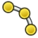 | ↳ Arc From 3 Points | `Draft_ArcTools` | Creates a circular arc from 3 points |
|  | Arc From 3 Points | `Draft_Arc_3Points` | Creates a circular arc from 3 points |
|  | Array | `Draft_ArrayTools` | Creates copies of the selected object in an orthogonal pattern |
| 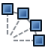 | ↳ Polar Array | `Draft_ArrayTools` | Creates copies of the selected object in a polar pattern |
|  | ↳ Circular Array | `Draft_ArrayTools` | Creates copies of the selected object in a radial pattern with 1 or more circular layers |
|  | ↳ Path Array | `Draft_ArrayTools` | Creates copies of the selected object along a selected path |
|  | ↳ Path Link Array | `Draft_ArrayTools` | Creates linked copies of the selected object along a selected path |
|  | ↳ Point Array | `Draft_ArrayTools` | Creates copies of the selected object at the points of a point object |
|  | ↳ Point Link Array | `Draft_ArrayTools` | Creates linked copies of the selected object at the points of a point object |
|  | ↳ Twisted Path Array | `Draft_ArrayTools` | Creates twisted copies of the selected object along a selected path |
|  | ↳ Twisted Path Link Array | `Draft_ArrayTools` | Creates twisted linked copies of the selected object along a selected path |
|  | B-Spline | `Draft_BSpline` | Creates a multiple-point B-spline |
|  | Bézier Curve | `Draft_BezCurve` | Creates an n-degree Bézier curve. The more points, the higher the degree. |
|  | Cubic Bézier Curve | `Draft_BezierTools` | Creates a Bézier curve made of 2nd degree (quadratic) and 3rd degree (cubic) segments. Clicking and dragging allows to define segments. Control points and properties of each knot can be edited after creation. |
|  | ↳ Bézier Curve | `Draft_BezierTools` | Creates an n-degree Bézier curve. The more points, the higher the degree. |
|  | Circle | `Draft_Circle` | Creates a circle (full circular arc) |
|  | Circular Array | `Draft_CircularArray` | Creates copies of the selected object in a radial pattern with 1 or more circular layers |
|  | Clone | `Draft_Clone` | Creates a clone of the selected objects |
|  | Cubic Bézier Curve | `Draft_CubicBezCurve` | Creates a Bézier curve made of 2nd degree (quadratic) and 3rd degree (cubic) segments. Clicking and dragging allows to define segments. Control points and properties of each knot can be edited after creation. |
|  | Dimension | `Draft_Dimension` | Creates a linear dimension for a straight edge, a circular edge, or 2 picked points, or an angular dimension for 2 straight edges |
|  | Downgrade | `Draft_Downgrade` | Downgrades the selected objects into simpler shapes. The result of the operation depends on the types of objects, which may be downgraded several times in a row. For example, a 3D solid is deconstructed into separate faces, wires, and then edges. Faces can also be subtracted. |
|  | Draft to Sketch | `Draft_Draft2Sketch` | Converts bidirectionally between Draft objects and sketches. Multiple selected Draft objects are converted into a single sketch. However, a single sketch with disconnected traces is converted into several individual Draft objects. |
|  | Edit | `Draft_Edit` | Edits the active object |
|  | Ellipse | `Draft_Ellipse` | Creates an ellipse |
|  | Facebinder | `Draft_Facebinder` | Creates a facebinder from the selected faces |
|  | Fillet | `Draft_Fillet` | Creates a fillet between 2 selected edges |
|  | Flip Dimension | `Draft_FlipDimension` | Flips the normal direction of the selected dimensions (linear, radial, angular). If other objects are selected they are ignored. |
|  | Hatch | `Draft_Hatch` | Creates hatches on the faces of a selected object |
|  | Join | `Draft_Join` | Joins the selected lines or polylines into a single object. The lines must share a common point at the start or at the end. |
|  | Label | `Draft_Label` | Creates a label, optionally attached to a selected object or subelement |
|  | Manage Layers | `Draft_LayerManager` | Allows to modify the layers |
|  | Line | `Draft_Line` | Creates a 2-point line |
|  | Mirror | `Draft_Mirror` | Mirrors the selected objects along a line defined by 2 points |
|  | Move | `Draft_Move` | Moves the selected objects. If the "Copy" option is active, it creates displaced copies. |
|  | Offset | `Draft_Offset` | Offsets the selected object. It can also create an offset copy of the original object. |
|  | Array | `Draft_OrthoArray` | Creates copies of the selected object in an orthogonal pattern |
|  | Path Array | `Draft_PathArray` | Creates copies of the selected object along a selected path |
|  | Path Link Array | `Draft_PathLinkArray` | Creates linked copies of the selected object along a selected path |
|  | Twisted Path Array | `Draft_PathTwistedArray` | Creates twisted copies of the selected object along a selected path |
|  | Twisted Path Link Array | `Draft_PathTwistedLinkArray` | Creates twisted linked copies of the selected object along a selected path |
|  | Point | `Draft_Point` | Creates a point |
|  | Point Array | `Draft_PointArray` | Creates copies of the selected object at the points of a point object |
|  | Point Link Array | `Draft_PointLinkArray` | Creates linked copies of the selected object at the points of a point object |
|  | Polar Array | `Draft_PolarArray` | Creates copies of the selected object in a polar pattern |
|  | Polygon | `Draft_Polygon` | Creates a regular polygon (triangle, square, pentagon…) |
|  | Rectangle | `Draft_Rectangle` | Creates a 2-point rectangle |
|  | Rotate | `Draft_Rotate` | Rotates the selected objects. If the "Copy" option is active, it will create rotated copies. |
|  | Scale | `Draft_Scale` | Scales the selected objects from a base point |
|  | Select Group | `Draft_SelectGroup` | Selects the contents of selected groups. For selected non-group objects, the contents of the group they are in are selected. |
|  | Shape 2D View | `Draft_Shape2DView` | Creates a 2D projection of the selected objects on the XY-plane. The initial projection direction is the opposite of the current active view direction. |
|  | Shape From Text | `Draft_ShapeString` | Creates a shape from a text string and a specified font |
|  | Set Slope | `Draft_Slope` | Sets the slope of the selected line by changing the value of the Z value of one of its points. If a polyline is selected, it will apply the slope transformation to each of its segments. The slope will always change the Z value, therefore this command only works well for straight Draft lines that are drawn on the XY-plane. |
|  | Snap Angle | `Draft_Snap_Angle` | Snaps to the special cardinal points on circular edges, at multiples of 30° and 45° |
|  | Snap Center | `Draft_Snap_Center` | Snaps to the center point of faces and circular edges, and to the placement point of working plane proxies and building parts |
|  | Snap Dimensions | `Draft_Snap_Dimensions` | Shows temporary X and Y dimensions |
|  | Snap Endpoint | `Draft_Snap_Endpoint` | Snaps to the endpoints of edges |
|  | Snap Extension | `Draft_Snap_Extension` | Snaps to an imaginary line that extends beyond the endpoints of straight edges |
|  | Snap Grid | `Draft_Snap_Grid` | Snaps to the intersections of grid lines |
|  | Snap Intersection | `Draft_Snap_Intersection` | Snaps to the intersection of 2 edges, and the intersection of a face and an edge |
|  | Snap Lock | `Draft_Snap_Lock` | Enables or disables snapping globally |
|  | Snap Midpoint | `Draft_Snap_Midpoint` | Snaps to the midpoint of edges |
|  | Snap Near | `Draft_Snap_Near` | Snaps to the nearest point on faces and edges |
|  | Snap Ortho | `Draft_Snap_Ortho` | Snaps to imaginary lines that cross the previous point at multiples of 45° |
|  | Snap Parallel | `Draft_Snap_Parallel` | Snaps to an imaginary line parallel to straight edges |
|  | Snap Perpendicular | `Draft_Snap_Perpendicular` | Snaps to the perpendicular points on faces and edges |
|  | Snap Special | `Draft_Snap_Special` | Snaps to special points defined by the object |
|  | Snap Working Plane | `Draft_Snap_WorkingPlane` | Projects snap points onto the current working plane |
|  | Split | `Draft_Split` | Splits the selected line or polyline at a specified point |
|  | Stretch | `Draft_Stretch` | Stretches the selected objects |
|  | Highlight Subelements | `Draft_SubelementHighlight` | Highlights the subelements of the selected objects, to be able to move, rotate, and scale them |
|  | Text | `Draft_Text` | Creates a multi-line annotation |
|  | Toggle Wireframe | `Draft_ToggleDisplayMode` | Switches the view style of the selected objects from Flat Lines to Wireframe and back |
|  | Toggle Grid | `Draft_ToggleGrid` | Toggles the visibility of the Draft grid |
|  | Trimex | `Draft_Trimex` | Trims or extends the selected object |
|  | Force 2D View Update | `Draft_UpdateShape2DView` | Forces an update of the selected 2D Views or all 2D Views in the document. The 'Auto Update' property of the views is ignored. |
|  | Upgrade | `Draft_Upgrade` | Upgrades the selected objects into more complex shapes. The result of the operation depends on the types of objects, which may be able to be upgraded several times in a row. For example, it can join the selected objects into one, convert simple edges into parametric polylines, convert closed edges into filled faces and parametric polygons, and merge faces into a single face. |
|  | Polyline | `Draft_Wire` | Creates a polyline |
|  | Convert Wire/B-Spline | `Draft_WireToBSpline` | Converts the selected polyline to a B-spline, or the selected B-spline to a polyline |
|  | Working Plane Proxy | `Draft_WorkingPlaneProxy` | Creates a proxy object from the current working plane that allows to restore the camera position and visibility of objects |
|  | New Analysis | `FEM_Analysis` | Creates an analysis container with default solver |
|  | Clipping Plane on Face | `FEM_ClippingPlaneAdd` | Adds a clipping plane on a selected face |
|  | Remove All Clipping Planes | `FEM_ClippingPlaneRemoveAll` | Removes all clipping planes |
| — | Electromagnetic Boundary Conditions | `FEM_CompEmConstraints` | Electromagnetic boundary conditions |
| — | Electromagnetic Equations | `FEM_CompEmEquations` | Electromagnetic equations for the Elmer solver |
| — | Mechanical Equations | `FEM_CompMechEquations` | Mechanical equations for the Elmer solver |
| — | Solvers | `FEM_CompSolvers` | Creates a FEM solver |
|  | Body Heat Source | `FEM_ConstraintBodyHeatSource` | Creates a body heat source |
|  | Centrifugal Load | `FEM_ConstraintCentrif` | Creates a centrifugal load |
|  | Contact Constraint | `FEM_ConstraintContact` | Creates a contact constraint between faces |
|  | Current Density Boundary Condition | `FEM_ConstraintCurrentDensity` | Creates a current density boundary condition |
|  | Displacement Boundary Condition | `FEM_ConstraintDisplacement` | Creates a displacement boundary condition for a geometric entity |
|  | Electric Charge Density | `FEM_ConstraintElectricChargeDensity` | Creates an electric charge density |
|  | Electromagnetic Boundary Condition | `FEM_ConstraintElectromagnetic` | Creates an electromagnetic boundary condition |
|  | Fixed Boundary Condition | `FEM_ConstraintFixed` | Creates a fixed boundary condition for a geometric entity |
|  | Flow Velocity Boundary Condition | `FEM_ConstraintFlowVelocity` | Creates a flow velocity boundary condition |
|  | Force Load | `FEM_ConstraintForce` | Creates a force load applied to a geometric entity |
|  | Heat Flux Load | `FEM_ConstraintHeatflux` | Creates a heat flux load acting on a face |
|  | Initial Flow Velocity Condition | `FEM_ConstraintInitialFlowVelocity` | Creates an initial flow velocity condition |
|  | Initial Pressure Condition | `FEM_ConstraintInitialPressure` | Creates an initial pressure condition |
|  | Initial Temperature | `FEM_ConstraintInitialTemperature` | Creates an initial temperature acting on a body |
|  | Magnetization Boundary Condition | `FEM_ConstraintMagnetization` | Creates a magnetization boundary condition |
|  | Plane Multi-Point Constraint | `FEM_ConstraintPlaneRotation` | Creates a plane multi-point constraint for a face |
|  | Pressure Load | `FEM_ConstraintPressure` | Creates a pressure load acting on a face |
|  | Rigid Body Constraint | `FEM_ConstraintRigidBody` | Creates a rigid body constraint for a geometric entity |
|  | Section Print Feature | `FEM_ConstraintSectionPrint` | Creates a section print feature |
|  | Gravity Load | `FEM_ConstraintSelfWeight` | Creates a gravity load |
|  | Spring Boundary Condition | `FEM_ConstraintSpring` | Creates a spring boundary condition on a face |
|  | Temperature Boundary Condition | `FEM_ConstraintTemperature` | Creates a temperature/concentrated heat flux load acting on a face |
|  | Tie Constraint | `FEM_ConstraintTie` | Creates a tie constraint |
|  | Local Coordinate System | `FEM_ConstraintTransform` | Creates a local coordinate system on a face |
|  | Fluid Section for 1D Flow | `FEM_ElementFluid1D` | Creates a fluid section for 1D flow |
|  | Beam Cross Section | `FEM_ElementGeometry1D` | Creates a beam cross section |
|  | Shell Plate Thickness | `FEM_ElementGeometry2D` | Creates a shell plate thickness |
|  | Beam Rotation | `FEM_ElementRotation1D` | Creates a beam rotation |
|  | Deformation Equation | `FEM_EquationDeformation` | Creates an equation for deformation (nonlinear elasticity) |
|  | Elasticity Equation | `FEM_EquationElasticity` | Creates an equation for elasticity (stress) |
|  | Electricforce Equation | `FEM_EquationElectricforce` | Creates an equation for electric forces |
|  | Electrostatic Equation | `FEM_EquationElectrostatic` | Creates an equation for electrostatic |
|  | Flow Equation | `FEM_EquationFlow` | Creates an equation for flow |
|  | Flux Equation | `FEM_EquationFlux` | Creates an equation for flux |
|  | Heat Equation | `FEM_EquationHeat` | Creates an equation for heat |
|  | Magnetodynamic Equation | `FEM_EquationMagnetodynamic` | Creates an equation for magnetodynamic forces |
|  | Magnetodynamic 2D Equation | `FEM_EquationMagnetodynamic2D` | Creates an equation for 2D magnetodynamic forces |
|  | Static Current Equation | `FEM_EquationStaticCurrent` | Creates an equation for static current |
|  | FEM Examples | `FEM_Examples` | Opens the FEM examples |
|  | FEM Mesh to Mesh | `FEM_FEMMesh2Mesh` | Converts the surface of a FEM mesh to a mesh |
|  | Material Editor | `FEM_MaterialEditor` | Opens the FreeCAD material editor |
|  | Fluid Material | `FEM_MaterialFluid` | Creates a fluid material |
|  | Non-Linear Mechanical Material | `FEM_MaterialMechanicalNonlinear` | Add non-linear mechanical properties to material |
|  | Reinforced Material (Concrete) | `FEM_MaterialReinforced` | Creates a material for reinforced matrix material such as concrete |
|  | Solid Material | `FEM_MaterialSolid` | Creates a solid material |
|  | Advanced Refinement Types | `FEM_MeshAdvanced` | Allows to define the mesh size by various advanced means |
|  | 2D Boundary Layer | `FEM_MeshBoundaryLayer` | Adds a structured layer of mesh elements on 2D model boundaries |
|  | Distance-Based Refinement | `FEM_MeshDistance` | Sets mesh size based on the distance to vertices, edges, and faces |
| — | GMSH Refinements | `FEM_MeshGMSHRefinement` | Mesh refinements for the GMSH mesh generation |
|  | Mesh From Shape by Gmsh | `FEM_MeshGmshFromShape` | Creates a FEM mesh from a shape by Gmsh mesher |
|  | Mesh Group | `FEM_MeshGroup` | Creates a mesh group |
|  | Manipulate Refinement | `FEM_MeshManipulate` | Allows to manipulate the output of a refinement in various ways |
|  | Mesh From Shape by Netgen | `FEM_MeshNetgenFromShape` | Creates a FEM mesh from a solid or face shape by Netgen internal mesher |
|  | Mesh Refinement | `FEM_MeshRegion` | Creates a FEM mesh refinement |
|  | Shape-Based Refinement | `FEM_MeshShape` | Sets mesh size within and outside of a geometric shape (box, sphere, cylinder) |
|  | Structured Transfinite Curve | `FEM_MeshTransfiniteCurve` | Creates a fixed number of nodes on an edge with a structured algorithm |
|  | Structured Transfinite Surface | `FEM_MeshTransfiniteSurface` | Creates a structured mesh on a face |
|  | Structured Transfinite Volume | `FEM_MeshTransfiniteVolume` | Creates a structured mesh in a 4- or 5-sided volume bounded by transfinite surfaces |
|  | Apply Changes to Pipeline | `FEM_PostApplyChanges` | Applies changes to parameters directly and not on recompute only |
|  | Pipeline Branch | `FEM_PostBranchFilter` | Branches the pipeline into a new path |
| — | Filter Functions | `FEM_PostCreateFunctions` | Functions for use in postprocessing filter |
|  | Calculator Filter | `FEM_PostFilterCalculator` | Creates a new field from current data |
|  | Region Clip Filter | `FEM_PostFilterClipRegion` | Defines a clip filter which uses functions to define the clipped region |
|  | Scalar Clip Filter | `FEM_PostFilterClipScalar` | Defines a clip filter which clips a field with a scalar value |
|  | Contours Filter | `FEM_PostFilterContours` | Defines a contours filter that displays iso contours |
|  | Function Cut Filter | `FEM_PostFilterCutFunction` | Cuts the data along an implicit function |
|  | Line Clip Filter | `FEM_PostFilterDataAlongLine` | Defines a clip filter which clips a field along a line |
|  | Data at Point Clip Filter | `FEM_PostFilterDataAtPoint` | Defines a clip filter which clips a field data at point |
|  | Glyph Filter | `FEM_PostFilterGlyph` | Adds a post-processing filter that adds glyphs to the mesh vertices for vertex data visualization |
|  | Stress Linearization Plot | `FEM_PostFilterLinearizedStresses` | Defines a stress linearization plot |
|  | Warp Filter | `FEM_PostFilterWarp` | Warps the geometry along a vector field by a certain factor |
|  | Post Pipeline From Result | `FEM_PostPipelineFromResult` | Creates a post processing pipeline from a result object |
| — | Data Visualizations | `FEM_PostVisualization` | Different visualizations to show post processing data in |
|  | Show Result | `FEM_ResultShow` | Shows and visualizes the selected result data |
|  | Purge Results | `FEM_ResultsPurge` | Purges all results from the active analysis |
|  | Solver CalculiX | `FEM_SolverCalculiX` | Creates a FEM solver CalculiX |
|  | Solver Job Control | `FEM_SolverControl` | Changes solver attributes and runs the calculations for the selected solver |
|  | Solver Elmer | `FEM_SolverElmer` | Creates a FEM solver Elmer |
|  | Solver Mystran | `FEM_SolverMystran` | Creates a FEM solver Mystran |
|  | Run Solver | `FEM_SolverRun` | Runs the calculations for the selected solver |
|  | Solver Z88 | `FEM_SolverZ88` | Creates a FEM solver Z88 |
|  | Inspection… | `Inspection_InspectElement` | Inspects distance information |
|  | Visual Inspection | `Inspection_VisualInspection` | Inspects the objects visually |
|  | Edit | `Material_Edit` | Edits material properties |
|  | Mesh From Shape | `MeshPart_Mesher` | Tessellate shape |
|  | Add Triangle | `Mesh_AddFacet` | Adds a triangle manually to a mesh |
|  | Bounding Box Info | `Mesh_BoundingBox` | Shows the bounding box coordinates of the selected mesh |
|  | Regular Solid | `Mesh_BuildRegularSolid` | Builds a regular solid |
|  | Cross-Sections | `Mesh_CrossSections` | Creates cross-sections of the mesh |
|  | Curvature Info | `Mesh_CurvatureInfo` | Displays information about the curvature |
|  | Decimate | `Mesh_Decimating` | Decimates a mesh |
|  | Difference | `Mesh_Difference` | Creates a boolean difference of the selected meshes |
|  | Face Info | `Mesh_EvaluateFacet` | Displays information about the selected faces |
|  | Evaluate Solid | `Mesh_EvaluateSolid` | Checks whether the mesh is a solid |
|  | Evaluate and Repair | `Mesh_Evaluation` | Opens a dialog to analyze and repair a mesh |
|  | Export Mesh… | `Mesh_Export` | Exports a mesh to a file |
|  | Close Hole | `Mesh_FillInteractiveHole` | Closes a hole interactively in the mesh |
|  | Fill Holes | `Mesh_FillupHoles` | Fills holes in the mesh |
|  | Flip Normals | `Mesh_FlipNormals` | Flips the normals of the selected mesh |
|  | Mesh From Shape | `Mesh_FromPartShape` | Tessellates the selected shape to a mesh |
|  | Harmonize Normals | `Mesh_HarmonizeNormals` | Harmonizes the normals of the mesh |
|  | Import Mesh… | `Mesh_Import` | Imports a mesh from a file |
|  | Intersection | `Mesh_Intersection` | Creates a boolean intersection from the selected meshes |
|  | Merge | `Mesh_Merge` | Merges selected meshes into one |
|  | Cut | `Mesh_PolyCut` | Cuts the mesh with a selected polygon |
|  | Trim | `Mesh_PolyTrim` | Trims a mesh with a picked polygon |
|  | Refinement | `Mesh_RemeshGmsh` | Refines an existing mesh |
|  | Remove Components | `Mesh_RemoveComponents` | Removes topologically independent components from the mesh |
|  | Scale | `Mesh_Scale` | Scales the selected mesh objects |
|  | Section From Plane | `Mesh_SectionByPlane` | Sections the mesh with the selected plane |
|  | Segmentation | `Mesh_Segmentation` | Creates new mesh segments from the mesh |
|  | Segmentation From Best-Fit Surfaces | `Mesh_SegmentationBestFit` | Creates new mesh segments from the best-fit surfaces |
|  | Smooth | `Mesh_Smoothing` | Smoothes the selected meshes |
|  | Split by Components | `Mesh_SplitComponents` | Splits the selected mesh into its components |
|  | Trim With Plane | `Mesh_TrimByPlane` | Trims a mesh by removing faces on one side of a selected plane |
|  | Union | `Mesh_Union` | Unifies the selected meshes |
|  | Curvature Plot | `Mesh_VertexCurvature` | Calculates the curvature of the vertices of a mesh |
|  | Add OpenSCAD Element | `OpenSCAD_AddOpenSCADElement` | Adds an OpenSCAD element based on entered OpenSCAD code using the OpenSCAD binary |
|  | Explode Group | `OpenSCAD_ExplodeGroup` | Explodes a fusion or compound and applies random colors |
|  | Hull | `OpenSCAD_Hull` | Creates a hull |
|  | Increase Tolerance Feature | `OpenSCAD_IncreaseToleranceFeature` | Creates a feature to increase the tolerance |
|  | Mesh Boolean | `OpenSCAD_MeshBoolean` | Performs a boolean operation using the OpenSCAD binary |
|  | Minkowski Sum | `OpenSCAD_Minkowski` | Creates a Minkowski sum |
|  | Refine Shape Feature | `OpenSCAD_RefineShapeFeature` | Creates a refined shape |
|  | Remove Objects and Children | `OpenSCAD_RemoveSubtree` | Removes the selected objects and all children that are not referenced by other objects |
|  | Replace Object | `OpenSCAD_ReplaceObject` | Replaces an object in the Tree View |
|  | Add Reference Object | `PartDesign_AddReferenceObject` | Reference evaluated geometry from a direct child of the active component |
|  | Additive Helix | `PartDesign_AdditiveHelix` | Sweeps the selected sketch or profile along a helix and adds it to the body |
|  | Additive Loft | `PartDesign_AdditiveLoft` | Lofts the selected sketch or profile through one or more sections and adds it to the body |
|  | Additive Pipe | `PartDesign_AdditivePipe` | Sweeps the selected sketch or profile along a path and adds it to the body |
|  | New Body | `PartDesign_Body` | Creates a new body and activates it |
|  | Boolean Operation | `PartDesign_Boolean` | Applies boolean operations with the selected objects and the active body |
|  | Chamfer | `PartDesign_Chamfer` | Applies a chamfer to the selected edges or faces |
|  | Circular Pattern | `PartDesign_CircularPattern` | Duplicates the selected features or the active body in concentric circular patterns |
|  | Clone | `PartDesign_Clone` | Copies a solid object parametrically as the base feature of a new body |
|  | Additive Box | `PartDesign_CompPrimitiveAdditive` | Creates an additive box by its width, height, and length |
| 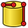 | ↳ Additive Cylinder | `PartDesign_CompPrimitiveAdditive` | Creates an additive cylinder by its radius, height, and angle |
|  | ↳ Additive Sphere | `PartDesign_CompPrimitiveAdditive` | Creates an additive sphere by its radius and various angles |
|  | ↳ Additive Cone | `PartDesign_CompPrimitiveAdditive` | Creates an additive cone |
|  | ↳ Additive Ellipsoid | `PartDesign_CompPrimitiveAdditive` | Creates an additive ellipsoid |
|  | ↳ Additive Torus | `PartDesign_CompPrimitiveAdditive` | Creates an additive torus |
| 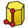 | ↳ Additive Prism | `PartDesign_CompPrimitiveAdditive` | Creates an additive prism |
| 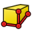 | ↳ Additive Wedge | `PartDesign_CompPrimitiveAdditive` | Creates an additive wedge |
|  | Subtractive Box | `PartDesign_CompPrimitiveSubtractive` | Creates a subtractive box by its width, height and length |
|  | ↳ Subtractive Cylinder | `PartDesign_CompPrimitiveSubtractive` | Creates a subtractive cylinder by its radius, height and angle |
|  | ↳ Subtractive Sphere | `PartDesign_CompPrimitiveSubtractive` | Creates a subtractive sphere by its radius and various angles |
|  | ↳ Subtractive Cone | `PartDesign_CompPrimitiveSubtractive` | Creates a subtractive cone |
|  | ↳ Subtractive Ellipsoid | `PartDesign_CompPrimitiveSubtractive` | Creates a subtractive ellipsoid |
|  | ↳ Subtractive Torus | `PartDesign_CompPrimitiveSubtractive` | Creates a subtractive torus |
| 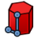 | ↳ Subtractive Prism | `PartDesign_CompPrimitiveSubtractive` | Creates a subtractive prism |
|  | ↳ Subtractive Wedge | `PartDesign_CompPrimitiveSubtractive` | Creates a subtractive wedge |
|  | New Sketch | `PartDesign_CompSketches` | Creates a new sketch |
|  | ↳ Attach Sketch | `PartDesign_CompSketches` | Attaches a sketch to the selected geometry element |
|  | ↳ Edit Sketch | `PartDesign_CompSketches` | Opens the selected sketch for editing |
|  | Defeaturing | `PartDesign_Defeaturing` | Removes selected faces from a solid |
|  | Draft | `PartDesign_Draft` | Applies a draft to the selected faces |
|  | Extrude | `PartDesign_Extrude` | Extrudes a profile with Add or Subtract selected in the task panel |
|  | Fillet | `PartDesign_Fillet` | Applies a fillet to the selected edges or faces |
|  | Groove | `PartDesign_Groove` | Revolves the sketch or profile around a line or axis and removes it from the body |
|  | Hole | `PartDesign_Hole` | Creates holes in the active body at the center points of circles or arcs of the selected sketch or profile |
|  | Linear Pattern | `PartDesign_LinearPattern` | Duplicates the selected features or the active body in a linear pattern |
|  | Mirror | `PartDesign_Mirrored` | Mirrors the selected features or active body |
|  | Multi-Transform | `PartDesign_MultiTransform` | Applies multiple transformations to the selected features or active body |
|  | New Sketch | `PartDesign_NewSketch` | Creates a new sketch |
|  | Pad | `PartDesign_Pad` | Extrudes a sketch or profile selected before or within the task panel and adds it to the body |
|  | Path Pattern | `PartDesign_PathPattern` | Duplicates the selected features or the active body along a path |
|  | Pattern | `PartDesign_Pattern` | Creates a linear or circular pattern; select the type and features in the task pane |
|  | Pocket | `PartDesign_Pocket` | Extrudes the selected sketch or profile and removes it from the body |
|  | Point Pattern | `PartDesign_PointPattern` | Duplicates the selected features or the active body at points from a shape |
|  | Polar Pattern | `PartDesign_PolarPattern` | Duplicates the selected features or the active body in a circular pattern |
|  | Revolve | `PartDesign_Revolution` | Revolves the selected sketch or profile around a line or axis and adds it to the body |
|  | Sub-Shape Binder | `PartDesign_SubShapeBinder` | Creates a reference to geometry from one or more objects, allowing it to be used inside or outside a body. It tracks relative placements, supports multiple geometry types (solids, faces, edges, vertices), and can work with objects in the same or external documents. |
|  | Subtractive Helix | `PartDesign_SubtractiveHelix` | Sweeps the selected sketch or profile along a helix and removes it from the body |
|  | Subtractive Loft | `PartDesign_SubtractiveLoft` | Lofts the selected sketch or profile through one or more sections and removes it from the body |
|  | Subtractive Pipe | `PartDesign_SubtractivePipe` | Sweeps the selected sketch or profile along a path and removes it from the body |
|  | Thickness | `PartDesign_Thickness` | Applies thickness and removes the selected faces |
|  | Boolean Operation | `Part_Boolean` | Applies a boolean operation with the selected shapes |
|  | Boolean Fragments | `Part_BooleanFragments` | Creates a boolean union which is sliced at the intersections of the selected shapes |
|  | Cube | `Part_Box` | Creates a solid cube |
|  | Shape Builder | `Part_Builder` | Advanced utility to create shapes |
|  | Chamfer | `Part_Chamfer` | Chamfers the selected edges of a shape |
|  | Check Geometry | `Part_CheckGeometry` | Analyzes the selected shapes for errors |
|  | Appearance per Face | `Part_ColorPerFace` | Sets the appearance of individual faces of the selected object |
|  | Intersection | `Part_Common` | Intersects the selected shapes |
|  | Compound | `Part_CompCompoundTools` | Compounds the selected shapes |
|  | ↳ Explode Compound | `Part_CompCompoundTools` | Splits up a compound of shapes into separate objects, creating a compound filter for each shape |
|  | ↳ Compound Filter | `Part_CompCompoundTools` | Filters out objects from the selected compound by characteristics like volume, area, or length, or by choosing specific items. If a second object is selected, it will be used as reference, for example, for collision or distance filtering. |
|  | Connect Shapes | `Part_CompJoinFeatures` | Fuses shapes, taking care to preserve voids |
|  | ↳ Embed Shapes | `Part_CompJoinFeatures` | Fuses one shape into another, taking care to preserve voids |
|  | ↳ Cutout Shape | `Part_CompJoinFeatures` | Creates a cutout in the selected shape to fit another shape |
|  | 3D Offset | `Part_CompOffset` | Offsets shapes in 3D |
|  | ↳ 2D Offset | `Part_CompOffset` | Offsets planar shapes in 2D |
|  | Boolean Fragments | `Part_CompSplitFeatures` | Creates a boolean union which is sliced at the intersections of the selected shapes |
|  | ↳ Slice Apart | `Part_CompSplitFeatures` | Slices the selected object by other objects, and splits it apart, creating a compound filter for each slide |
|  | ↳ Slice to Compound | `Part_CompSplitFeatures` | Slices the selected object by using other objects as cutting tools and storing the results in one compound |
|  | ↳ Boolean XOR | `Part_CompSplitFeatures` | Performs an 'exclusive OR' boolean operation with two or more selected objects, or with the shapes inside a compound. Overlapping volumes of the shapes will be removed. |
|  | Compound | `Part_Compound` | Compounds the selected shapes |
|  | Compound Filter | `Part_CompoundFilter` | Filters out objects from the selected compound by characteristics like volume, area, or length, or by choosing specific items. If a second object is selected, it will be used as reference, for example, for collision or distance filtering. |
|  | Cone | `Part_Cone` | Creates a solid cone |
|  | Coordinate System | `Part_CoordinateSystem` | Creates a coordinate system that can be attached to other objects |
|  | Cross-Sections | `Part_CrossSections` | Creates cross-sections |
|  | Cut | `Part_Cut` | Cuts 2 selected shapes |
|  | Cylinder | `Part_Cylinder` | Creates a solid cylinder |
|  | Datum Line | `Part_DatumLine` | Creates a datum line that can be attached to other objects |
|  | Datum Plane | `Part_DatumPlane` | Creates a datum plane that can be attached to other objects |
|  | Datum Point | `Part_DatumPoint` | Creates a datum point that can be attached to other objects |
|  | Coordinate System | `Part_Datums` | Creates a coordinate system that can be attached to other objects |
|  | ↳ Datum Plane | `Part_Datums` | Creates a datum plane that can be attached to other objects |
|  | ↳ Datum Line | `Part_Datums` | Creates a datum line that can be attached to other objects |
|  | ↳ Datum Point | `Part_Datums` | Creates a datum point that can be attached to other objects |
|  | Defeaturing | `Part_Defeaturing` | Removes the selected features from a shape |
|  | Explode Compound | `Part_ExplodeCompound` | Splits up a compound of shapes into separate objects, creating a compound filter for each shape |
|  | Extrude | `Part_Extrude` | Extrudes the selected sketch or profile |
|  | Fillet | `Part_Fillet` | Fillets the selected edges of a shape |
|  | Union | `Part_Fuse` | Unites the selected shapes |
|  | Isocline Curve | `Part_IsoclineCurve` | Create associative draft-angle curves on selected faces |
|  | Connect Shapes | `Part_JoinConnect` | Fuses shapes, taking care to preserve voids |
|  | Cutout Shape | `Part_JoinCutout` | Creates a cutout in the selected shape to fit another shape |
|  | Embed Shapes | `Part_JoinEmbed` | Fuses one shape into another, taking care to preserve voids |
|  | Circular Link Array | `Part_LinkArrays` | Creates a concentric circular array of linked objects |
|  | ↳ Linear Link Array | `Part_LinkArrays` | Creates a linear array of linked objects |
|  | ↳ Path Link Array | `Part_LinkArrays` | Creates an array of linked objects along a path |
|  | ↳ Point Link Array | `Part_LinkArrays` | Creates an array of linked objects at each point of a sketch or shape |
|  | ↳ Polar Link Array | `Part_LinkArrays` | Creates a polar array of linked objects |
|  | Loft | `Part_Loft` | Lofts the selected profiles |
|  | Face From Wires | `Part_MakeFace` | Creates a face from the selected wires (e.g. from a sketch) |
|  | Mirror | `Part_Mirror` | Mirrors the selected shape |
|  | 3D Offset | `Part_Offset` | Offsets shapes in 3D |
|  | 2D Offset | `Part_Offset2D` | Offsets planar shapes in 2D |
|  | Primitive | `Part_Primitives` | Creates solid geometric primitives parametrically |
|  | Project on Surface | `Part_ProjectionOnSurface` | Projects edges, wires, or faces of one shape onto a face of another shape. The camera view determines the direction of the projection. |
|  | Revolve | `Part_Revolve` | Revolves the selected shape |
|  | Ruled Surface | `Part_RuledSurface` | Creates a ruled surface between 2 selected wires |
|  | Scale | `Part_Scale` | Scales the selected shape |
|  | Section | `Part_Section` | Sections 2 selected shapes |
|  | Vertex Selection | `Part_SelectFilter` | Only allows the selection of vertices |
|  | ↳ Edge Selection | `Part_SelectFilter` | Only allows the selection of edges |
|  | ↳ Face Selection | `Part_SelectFilter` | Only allows the selection of faces |
|  | ↳ No Selection Filters | `Part_SelectFilter` | Clears all selection filters |
|  | Slice to Compound | `Part_Slice` | Slices the selected object by using other objects as cutting tools and storing the results in one compound |
|  | Slice Apart | `Part_SliceApart` | Slices the selected object by other objects, and splits it apart, creating a compound filter for each slide |
|  | Sphere | `Part_Sphere` | Creates a solid sphere |
|  | Sweep | `Part_Sweep` | Sweeps profiles along a wire |
|  | Thickness | `Part_Thickness` | Removes the selected faces and offsets the remaining shape outward to add thickness |
|  | Torus | `Part_Torus` | Creates a solid torus |
|  | Trim Body | `Part_TrimBody` | Trim a solid or sheet with a plane, face, or sheet and choose the side to keep |
|  | Tube | `Part_Tube` | Creates a tube |
|  | Boolean XOR | `Part_XOR` | Performs an 'exclusive OR' boolean operation with two or more selected objects, or with the shapes inside a compound. Overlapping volumes of the shapes will be removed. |
|  | Convert to Points | `Points_Convert` | Converts to points |
|  | Export Points… | `Points_Export` | Exports a point cloud |
|  | Import Points… | `Points_Import` | Imports a point cloud |
|  | Merge Point Clouds | `Points_Merge` | Merges several point clouds into one |
|  | Cut Point Cloud | `Points_PolyCut` | Cuts a point cloud with a selected polygon |
|  | Structured Point Cloud | `Points_Structure` | Converts points to a structured point cloud |
|  | Approximate B-Spline Surface… | `Reen_ApproxSurface` | Approximates a B-spline surface |
|  | Place Robot | `Robot_Create` | Places a robot in the scene |
|  | Trajectory | `Robot_CreateTrajectory` | Creates a new empty trajectory |
|  | Edge to Trajectory | `Robot_Edge2Trac` | Generates a trajectory from the selected edges |
|  | Insert in Trajectory | `Robot_InsertWaypoint` | Inserts the robot tool location into the trajectory |
|  | Insert in Trajectory | `Robot_InsertWaypointPreselect` | Inserts the preselection position into the trajectory (W) |
|  | Move to Home | `Robot_RestoreHomePos` | Moves to the home position |
|  | Set Home Position | `Robot_SetHomePos` | Sets the home position |
|  | Simulate Trajectory | `Robot_Simulate` | Simulates robot movement along a selected trajectory |
|  | Trajectory Compound | `Robot_TrajectoryCompound` | Groups and connects multiple trajectories into one |
|  | Dress-Up Trajectory | `Robot_TrajectoryDressUp` | Creates a dress-up object that overrides aspects of a trajectory |
|  | Toggle Circular Helper for Arcs | `Sketcher_ArcOverlay` | Toggles the visibility of the circular helpers for all arcs |
|  | Geometry to B-Spline | `Sketcher_BSplineConvertToNURBS` | Converts the selected geometry to B-splines |
|  | Decrease B-Spline Degree | `Sketcher_BSplineDecreaseDegree` | Decreases the degree of the B-spline |
|  | Increase B-Spline Degree | `Sketcher_BSplineIncreaseDegree` | Increases the degree of the B-spline |
|  | Insert Knot | `Sketcher_BSplineInsertKnot` | Inserts a knot at a given parameter. If a knot already exists at that parameter, its multiplicity is increased by 1. |
|  | Carbon Copy | `Sketcher_CarbonCopy` | Copies the geometry of another sketch |
|  | Toggle B-Spline Degree | `Sketcher_CompBSplineShowHideGeometryInformation` | Toggles the visibility of the degree for all B-splines |
| 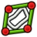 | ↳ Toggle B-Spline Control Polygon | `Sketcher_CompBSplineShowHideGeometryInformation` | Toggles the visibility of the control polygons for all B-splines |
|  | ↳ Toggle B-Spline Curvature Comb | `Sketcher_CompBSplineShowHideGeometryInformation` | Toggles the visibility of the curvature comb for all B-splines |
| 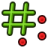 | ↳ Toggle B-Spline Knot Multiplicity | `Sketcher_CompBSplineShowHideGeometryInformation` | Toggles the visibility of the knot multiplicity for all B-splines |
| 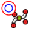 | ↳ Toggle B-Spline Control Point Weight | `Sketcher_CompBSplineShowHideGeometryInformation` | Toggles the visibility of the control point weight for all B-splines |
|  | Constrain radius | `Sketcher_CompConstrainRadDia` | Fix the radius of an arc or a circle |
|  | ↳ Constrain diameter | `Sketcher_CompConstrainRadDia` | Fix the diameter of a circle or an arc |
|  | ↳ Constrain auto radius/diameter | `Sketcher_CompConstrainRadDia` | Fix the radius/diameter of an arc or a circle |
|  | Arc From Center | `Sketcher_CompCreateArc` | Creates an arc defined by a center point and an end point |
|  | ↳ Arc From 3 Points | `Sketcher_CompCreateArc` | Creates an arc defined by 2 end points and 1 point on the arc |
|  | ↳ Elliptical Arc | `Sketcher_CompCreateArc` | Creates an elliptical arc |
|  | ↳ Hyperbolic Arc | `Sketcher_CompCreateArc` | Creates a hyperbolic arc |
|  | ↳ Parabolic Arc | `Sketcher_CompCreateArc` | Creates a parabolic arc |
|  | B-Spline | `Sketcher_CompCreateBSpline` | Creates a B-spline curve defined by control points |
|  | ↳ Periodic B-Spline | `Sketcher_CompCreateBSpline` | Creates a periodic B-spline curve defined by control points |
|  | ↳ B-Spline From Knots | `Sketcher_CompCreateBSpline` | Creates a B-spline from knots, i.e. from interpolation |
|  | ↳ Periodic B-Spline From Knots | `Sketcher_CompCreateBSpline` | Creates a periodic B-spline defined by knots using interpolation |
|  | Circle From Center | `Sketcher_CompCreateConic` | Creates a circle from a center and rim point |
|  | ↳ Circle From 3 Points | `Sketcher_CompCreateConic` | Creates a circle from 3 perimeter points |
|  | ↳ Ellipse From Center | `Sketcher_CompCreateConic` | Creates an ellipse from a center and rim point |
|  | ↳ Ellipse From 3 Points | `Sketcher_CompCreateConic` | Creates an ellipse from 3 points on its perimeter |
|  | Fillet | `Sketcher_CompCreateFillets` | Creates a fillet between 2 selected curves or at coincident points |
|  | ↳ Chamfer | `Sketcher_CompCreateFillets` | Creates a chamfer between 2 selected curves or at coincident points |
|  | Rectangle | `Sketcher_CompCreateRectangles` | Creates a rectangle from 2 corner points |
|  | ↳ Centered Rectangle | `Sketcher_CompCreateRectangles` | Creates a centered rectangle from a center and a corner point |
|  | ↳ Rounded Rectangle | `Sketcher_CompCreateRectangles` | Creates a rounded rectangle from 2 corner points |
|  | Triangle | `Sketcher_CompCreateRegularPolygon` | Creates an equilateral triangle from a center and corner point |
|  | ↳ Square | `Sketcher_CompCreateRegularPolygon` | Creates a square from a center and corner point |
|  | ↳ Pentagon | `Sketcher_CompCreateRegularPolygon` | Creates a pentagon from a center and corner point |
|  | ↳ Hexagon | `Sketcher_CompCreateRegularPolygon` | Creates a hexagon from a center and corner point |
|  | ↳ Heptagon | `Sketcher_CompCreateRegularPolygon` | Creates a heptagon from a center and corner point |
|  | ↳ Octagon | `Sketcher_CompCreateRegularPolygon` | Creates an octagon from a center and corner point |
|  | ↳ Polygon | `Sketcher_CompCreateRegularPolygon` | Creates a regular polygon from a center and corner point |
|  | Trim Edge | `Sketcher_CompCurveEdition` | Trims an edge with respect to the selected position |
|  | ↳ Split Edge | `Sketcher_CompCurveEdition` | Splits an edge into 2 segments while preserving constraints |
|  | ↳ Extend Edge | `Sketcher_CompCurveEdition` | Extends an edge with respect to the selected position |
|  | Dimension | `Sketcher_CompDimensionTools` | Constrains contextually based on the selection. The type can be changed with the M key. |
|  | ↳ Horizontal Dimension | `Sketcher_CompDimensionTools` | Constrains the horizontal distance between two points, or from a point to the origin if only one is selected |
|  | ↳ Vertical Dimension | `Sketcher_CompDimensionTools` | Constrains the vertical distance between two points, or from a point to the origin if only one is selected |
|  | ↳ Distance Dimension | `Sketcher_CompDimensionTools` | Constrains the vertical distance between two points, or from a point to the origin if one is selected |
|  | ↳ Radius/Diameter Dimension | `Sketcher_CompDimensionTools` | Constrains the radius of the selected arc or the diameter of the selected circle |
|  | ↳ Radius Dimension | `Sketcher_CompDimensionTools` | Constrains the radius of the selected circle or arc |
|  | ↳ Diameter Dimension | `Sketcher_CompDimensionTools` | Constrains the diameter of the selected circle or arc |
|  | ↳ Angle Dimension | `Sketcher_CompDimensionTools` | Constrains the angle between two straight lines or between one line and the X-axis of the sketch if only one is selected |
|  | ↳ Lock Position | `Sketcher_CompDimensionTools` | Constrains the selected vertices by adding horizontal and vertical distance constraints |
|  | External Projection | `Sketcher_CompExternal` | Creates the projection of external geometry in the sketch plane |
|  | ↳ External Intersection | `Sketcher_CompExternal` | Creates the intersection of external geometry with the sketch plane |
|  | Horizontal Constraint | `Sketcher_CompHorVer` | Constrains the selected elements horizontally |
|  | ↳ Vertical Constraint | `Sketcher_CompHorVer` | Constrains the selected elements vertically |
|  | Polyline | `Sketcher_CompLine` | Creates a polyline in the sketch. M key cycles through segment modes. |
|  | ↳ Line | `Sketcher_CompLine` | Creates a line |
|  | Increase knot multiplicity | `Sketcher_CompModifyKnotMultiplicity` | Increases the multiplicity of the selected knot of a B-spline |
|  | ↳ Decrease knot multiplicity | `Sketcher_CompModifyKnotMultiplicity` | Decreases the multiplicity of the selected knot of a B-spline |
|  | Slot | `Sketcher_CompSlot` | Creates a slot |
|  | ↳ Arc Slot | `Sketcher_CompSlot` | Creates an arc slot |
|  | Toggle Driving/Reference Constraints | `Sketcher_CompToggleConstraints` | Toggles between driving and reference mode of the selected constraints and commands |
| 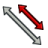 | ↳ Toggle Constraints | `Sketcher_CompToggleConstraints` | Toggles the state of the selected constraints |
|  | Angle Dimension | `Sketcher_ConstrainAngle` | Constrains the angle between two straight lines or between one line and the X-axis of the sketch if only one is selected |
|  | Block Constraint | `Sketcher_ConstrainBlock` | Constrains the selected edges as fixed |
|  | Coincident Constraint | `Sketcher_ConstrainCoincidentUnified` | Constrains the selected elements to be coincident |
|  | Diameter Dimension | `Sketcher_ConstrainDiameter` | Constrains the diameter of the selected circle or arc |
|  | Distance Dimension | `Sketcher_ConstrainDistance` | Constrains the vertical distance between two points, or from a point to the origin if one is selected |
|  | Horizontal Dimension | `Sketcher_ConstrainDistanceX` | Constrains the horizontal distance between two points, or from a point to the origin if only one is selected |
|  | Vertical Dimension | `Sketcher_ConstrainDistanceY` | Constrains the vertical distance between two points, or from a point to the origin if only one is selected |
|  | Equal Constraint | `Sketcher_ConstrainEqual` | Constrains the selected edges or circles to be equal |
|  | Group Constraint (Development preview) | `Sketcher_ConstrainGroup` | Constrains the selected geometries together as a single entity.The position and size of the grouped geometries can be defined by constraining the construction line that is generated.Constraints applied to grouped edges are ignored as long as the Group constraint is here. |
|  | Lock Position | `Sketcher_ConstrainLock` | Constrains the selected vertices by adding horizontal and vertical distance constraints |
|  | Parallel Constraint | `Sketcher_ConstrainParallel` | Constrains the selected lines to be parallel |
|  | Perpendicular Constraint | `Sketcher_ConstrainPerpendicular` | Constrains the selected lines to be perpendicular |
|  | Radius/Diameter Dimension | `Sketcher_ConstrainRadiam` | Constrains the radius of the selected arc or the diameter of the selected circle |
|  | Radius Dimension | `Sketcher_ConstrainRadius` | Constrains the radius of the selected circle or arc |
|  | Refraction Constraint | `Sketcher_ConstrainSnellsLaw` | Constrains the selected elements based on the refraction law (Snell's Law) |
|  | Symmetric Constraint | `Sketcher_ConstrainSymmetric` | Constrains the selected elements to be symmetric |
|  | Tangent/Collinear Constraint | `Sketcher_ConstrainTangent` | Constrains the selected elements to be tangent or collinear |
|  | Point | `Sketcher_CreatePoint` | Creates a point |
|  | Text (Experimental) | `Sketcher_CreateText` | Creates text geometries controlled by a Text constraint. To Edit: Double-click the Text constraint to change the text content and font. To Position/Size: Apply constraints to the group's construction line. Note: While the Text constraint is active, any constraints applied directly to the text geometries will be ignored. |
|  | Dimension | `Sketcher_Dimension` | Constrains contextually based on the selection. The type can be changed with the M key. |
|  | Edit Sketch | `Sketcher_EditSketch` | Opens the selected sketch for editing |
|  | Join Curves | `Sketcher_JoinCurves` | Joins 2 curves at selected end points |
|  | Leave Sketch | `Sketcher_LeaveSketch` | Finishes editing the active sketch. Press Escape to exit. |
|  | Attach Sketch | `Sketcher_MapSketch` | Attaches a sketch to the selected geometry element |
|  | Merge Sketches | `Sketcher_MergeSketches` | Creates a new sketch by merging at least 2 selected sketches |
|  | Mirror Sketch | `Sketcher_MirrorSketch` | Creates a new mirrored sketch for each selected sketch by using the X or Y axes, or the origin point, as mirroring reference |
|  | New Sketch | `Sketcher_NewSketch` | Creates a new sketch |
|  | Offset | `Sketcher_Offset` | Adds an equidistant closed contour around selected geometry: positive values offset outward, negative values inward |
|  | Remove Axes Alignment | `Sketcher_RemoveAxesAlignment` | Modifies the constraints to remove axes alignment while trying to preserve the constraint relationship of the selection |
|  | Reorient Sketch | `Sketcher_ReorientSketch` | Places the selected sketch on one of the global coordinate planes. This will clear the AttachmentSupport property. |
|  | Toggle Internal Geometry | `Sketcher_RestoreInternalAlignmentGeometry` | Toggles the visibility of all internal geometry |
|  | Rotate / Polar Transform | `Sketcher_Rotate` | Rotates the selected geometry by creating 'n' total elements, enabling circular pattern creation |
|  | Scale | `Sketcher_Scale` | Scales the selected geometries |
|  | Select Associated Constraints | `Sketcher_SelectConstraints` | Selects the constraints associated with the selected geometrical elements |
|  | Select Associated Geometry | `Sketcher_SelectElementsAssociatedWithConstraints` | Selects the geometrical elements associated with the selected constraints |
|  | Switch Virtual Space | `Sketcher_SwitchVirtualSpace` | Switches the selected constraints or the view to the other virtual space |
|  | Mirror | `Sketcher_Symmetry` | Creates a mirrored copy of the selected geometry |
|  | Toggle Construction Geometry | `Sketcher_ToggleConstruction` | Toggles between defining geometry and construction geometry modes |
|  | Move / Array Transform | `Sketcher_Translate` | Translates the selected geometries and enables the creation of 'i' * 'j' total elements |
|  | Validate Sketch | `Sketcher_ValidateSketch` | Validates a sketch by checking for missing coincidences, invalid constraints, and degenerate geometry |
|  | Toggle Section View | `Sketcher_ViewSection` | Toggles between section view and full view |
|  | Align View to Sketch | `Sketcher_ViewSketch` | Aligns the camera orientation perpendicular to the active sketch plane |
|  | Align Bottom | `Spreadsheet_AlignBottom` | Aligns cell contents to the bottom |
|  | Align Horizontal Center | `Spreadsheet_AlignCenter` | Aligns cell contents to the horizontal center |
|  | Align Left | `Spreadsheet_AlignLeft` | Aligns cell contents to the left |
|  | Align Right | `Spreadsheet_AlignRight` | Aligns cell contents to the right |
|  | Align Top | `Spreadsheet_AlignTop` | Aligns cell contents to the top |
|  | Align Vertical Center | `Spreadsheet_AlignVCenter` | Aligns cell contents to the vertical center |
|  | New Spreadsheet | `Spreadsheet_CreateSheet` | Creates a new spreadsheet |
|  | Export Spreadsheet | `Spreadsheet_Export` | Exports the spreadsheet to a CSV file |
|  | Import Spreadsheet | `Spreadsheet_Import` | Imports a CSV file into a new spreadsheet |
|  | Merge Cells | `Spreadsheet_MergeCells` | Merges the selected cells |
|  | Set Alias | `Spreadsheet_SetAlias` | Sets an alias for the selected cell |
|  | Split Cell | `Spreadsheet_SplitCell` | Splits a previously merged cell |
|  | Bold Text | `Spreadsheet_StyleBold` | Sets the text in the selected cells bold |
|  | Italic Text | `Spreadsheet_StyleItalic` | Sets the text in the selected cells italic |
|  | Underline Text | `Spreadsheet_StyleUnderline` | Underlines the text in the selected cells |
|  | Align to Selection | `Std_AlignToSelection` | Aligns the camera view to the selected elements in the 3D view |
|  | Command search... | `Std_CommandSearch` | Find commands by name, familiar alias or shortcut |
|  | Components | `Std_ComponentStructure` | Show Models, Part Tree and History |
|  | Copy | `Std_Copy` | Copies the selection to the clipboard |
|  | Cut | `Std_Cut` | Removes the selection and copies it to the clipboard |
|  | Delete | `Std_Delete` | Deletes the selected objects |
|  | Macros | `Std_DlgMacroExecute` | Opens a dialog to execute a recorded macro |
|  | Execute Macro | `Std_DlgMacroExecuteDirect` | Executes the macro in the editor |
|  | Record Macro | `Std_DlgMacroRecord` | Opens a dialog to record a macro |
|  | Preferences | `Std_DlgPreferences` | Opens a dialog to edit the preferences |
|  | Panels | `Std_DockViewMenu` | Lists available dock panels |
|  | As Is | `Std_DrawStyle` | Normal mode |
| 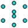 | ↳ Points | `Std_DrawStyle` | Points mode |
|  | ↳ Wireframe | `Std_DrawStyle` | Wireframe mode |
|  | ↳ Hidden Line | `Std_DrawStyle` | Hidden line mode |
|  | ↳ No Shading | `Std_DrawStyle` | No shading mode |
|  | ↳ Shaded | `Std_DrawStyle` | Shaded mode |
|  | ↳ Flat Lines | `Std_DrawStyle` | Flat lines mode |
|  | Selection filters… | `Std_EntitySelectionFilter` | Restrict new picks to vertices, edges, faces or whole objects |
|  | Export… | `Std_Export` | Exports an object in the active document |
|  | New Group | `Std_Group` | Creates a group, which is a general-purpose container to group objects in the tree view, regardless of their data type. It is a simple folder to organize the objects in a model. |
|  | Import… | `Std_Import` | Imports a file into the active document |
|  | Make Link | `Std_LinkActions` | A link is an object that references another object, either within the same or in another document. Unlike clones, links reference the original shape directly, making them more memory-efficient, which helps with the creation of complex assemblies. |
|  | ↳ Make Sub-Link | `Std_LinkActions` | Creates a sub-object or sub-element link |
|  | ↳ Replace With Link | `Std_LinkActions` | Replaces the selected objects with links |
|  | ↳ Unlink | `Std_LinkActions` | Unlinks the object by placing it directly in the container |
|  | ↳ Import Links | `Std_LinkActions` | Imports selected external links |
|  | ↳ Import All Links | `Std_LinkActions` | Imports all links of the active document |
|  | Mass Properties | `Std_MassProperties` | Calculates mass properties of selected objects |
|  | Measure | `Std_Measure` | Measures a feature |
|  | New Document | `Std_New` | Creates a new empty document |
|  | New Component | `Std_NewComponent` | Create an embedded model with no assembly instances and open it for editing |
|  | Open… | `Std_Open` | Opens a document or imports files |
|  | Add Component | `Std_Part` | Adds a component to the active component. |
|  | Paste | `Std_Paste` | Pastes the contents of the clipboard |
|  | Redo | `Std_Redo` | Redoes a previously undone action |
|  | Recompute | `Std_Refresh` | Recomputes the active document |
|  | Save | `Std_Save` | Saves the active document |
|  | Save As… | `Std_SaveAs` | Saves the active document under a new file name |
|  | Toolbars | `Std_ToolBarMenu` | Toggles this window |
|  | Undo | `Std_Undo` | Undoes the previous action |
|  | Variable Set | `Std_VarSet` | Creates a variable set, which is an object that maintains a set of properties to be used as variables |
|  | Bottom | `Std_ViewBottom` | Sets the camera to the bottom view |
|  | Fit All | `Std_ViewFitAll` | Fits all content into the 3D view |
|  | Fit Selection | `Std_ViewFitSelection` | Fits the selected content into the 3D view |
|  | Front | `Std_ViewFront` | Sets the camera to the front view |
|  | Isometric | `Std_ViewGroup` | Sets the camera to the isometric view |
|  | ↳ Front | `Std_ViewGroup` | Sets the camera to the front view |
|  | ↳ Top | `Std_ViewGroup` | Sets the camera to the top view |
|  | ↳ Right | `Std_ViewGroup` | Sets the camera to the right view |
|  | ↳ Rear | `Std_ViewGroup` | Sets the camera to the rear view |
|  | ↳ Bottom | `Std_ViewGroup` | Sets the camera to the bottom view |
|  | ↳ Left | `Std_ViewGroup` | Sets the camera to the left view |
|  | Isometric | `Std_ViewIsometric` | Sets the camera to the isometric view |
|  | Left | `Std_ViewLeft` | Sets the camera to the left view |
|  | Rear | `Std_ViewRear` | Sets the camera to the rear view |
|  | Right | `Std_ViewRight` | Sets the camera to the right view |
|  | Status Bar | `Std_ViewStatusBar` | Toggles the status bar |
|  | Top | `Std_ViewTop` | Sets the camera to the top view |
|  | What's This? | `Std_WhatsThis` | Opens the documentation for the selected command |
|  | Assembly | `Std_Workbench` | Selects the 'Assembly' workbench |
| 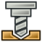 | ↳ CAM | `Std_Workbench` | Selects the 'CAM' workbench |
|  | ↳ Draft | `Std_Workbench` | Selects the 'Draft' workbench |
|  | ↳ Material | `Std_Workbench` | Selects the 'Material' workbench |
|  | ↳ Mesh | `Std_Workbench` | Selects the 'Mesh' workbench |
|  | ↳ Part Design | `Std_Workbench` | Selects the 'Part Design' workbench |
|  | ↳ Part | `Std_Workbench` | Selects the 'Part' workbench |
|  | ↳ Sketcher | `Std_Workbench` | Selects the 'Sketcher' workbench |
|  | ↳ Spreadsheet | `Std_Workbench` | Selects the 'Spreadsheet' workbench |
|  | ↳ Surface | `Std_Workbench` | Selects the 'Surface' workbench |
| 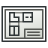 | ↳ TechDraw | `Std_Workbench` | Selects the 'TechDraw' workbench |
|  | ↳  | `Std_Workbench` | Select the ' ' workbench |
| 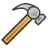 | ↳ Test Framework | `Std_Workbench` | Select the 'Test Framework' workbench |
|  | Blend Curve | `Surface_BlendCurve` | Joins 2 edges with continuity |
|  | Curve on Mesh | `Surface_CurveOnMesh` | Creates an approximated curve on top of a mesh. This command only works with a mesh object. |
|  | Extend Face | `Surface_ExtendFace` | Extrapolates the selected face or surface at its boundaries with its local U and V parameters |
|  | Filling | `Surface_Filling` | Creates a surface from a series of selected boundary edges. Additionally, the surface may be constrained by edges and vertices that are not on the boundary. |
|  | Fill Boundary Curves | `Surface_GeomFillSurface` | Creates a surface from 2, 3, or 4 boundary edges |
|  | Sections | `Surface_Sections` | Creates a surface from a series of sectional edges |
|  | Cosmetic Line Through 2 Points | `TechDraw_2PointCosmeticLine` | Adds a cosmetic line that passes through 2 selected points |
|  | Angle Dimension From 3 Points | `TechDraw_3PtAngleDimension` | Inserts an angle dimension between 3 selected points |
|  | Active View | `TechDraw_ActiveView` | Inserts an image of the open 3D view in the current page. If multiple 3D views are open, a selection dialog will be shown. |
|  | Angle Dimension | `TechDraw_AngleDimension` | Inserts an angle dimension between two edges |
|  | Area Annotation | `TechDraw_AreaDimension` | Inserts an annotation showing the area of a selected face |
|  | Axonometric Length Dimension | `TechDraw_AxoLengthDimension` | Creates a length dimension in with axonometric view, using selected edges or vertex pairs to define direction and measurement |
|  | Balloon Annotation | `TechDraw_Balloon` | Inserts a new balloon annotation in the selected view |
|  | Broken View | `TechDraw_BrokenView` | Inserts a new broken view for the selected objects or base view and break definition objects |
|  | Centerline on Face | `TechDraw_CenterLineGroup` | Adds a centerline to selected faces |
|  | ↳ Centerline Between 2 Lines | `TechDraw_CenterLineGroup` | Adds a centerline between 2 selected lines |
| 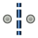 | ↳ Centerline Between 2 Points | `TechDraw_CenterLineGroup` | Adds a centerline between 2 selected points |
|  | Clip Group | `TechDraw_ClipGroup` | Inserts a new clip group for the selected view |
|  | Offset Vertex | `TechDraw_CommandAddOffsetVertex` | Creates an offset from one selected vertex |
|  | Cosmetic Intersection Vertices | `TechDraw_CommandVertexCreationGroup` | Cosmetic Intersection Vertices |
|  | ↳ Offset Vertex | `TechDraw_CommandVertexCreationGroup` | Creates an offset from one selected vertex |
|  | Dimension | `TechDraw_CompDimensionTools` | Inserts new contextual dimensions to the selection. Depending on your selection you might have several dimensions available. You can cycle through them using the M key. Left clicking on empty space will validate the current dimension. Right clicking or pressing Esc will cancel. |
| 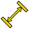 | ↳ Length Dimension | `TechDraw_CompDimensionTools` | Inserts a length dimension of an edge or distance between two points |
| 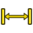 | ↳ Horizontal Length Dimension | `TechDraw_CompDimensionTools` | Inserts a horizontal length dimension of an edge or distance between two points |
| 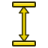 | ↳ Vertical Length Dimension | `TechDraw_CompDimensionTools` | Inserts a vertical length dimension of an edge or distance between two points |
|  | ↳ Radius Dimension | `TechDraw_CompDimensionTools` | Inserts a radius dimension of a circular edge or arc |
|  | ↳ Diameter Dimension | `TechDraw_CompDimensionTools` | Inserts a diameter dimension of a circular edge or arc |
|  | ↳ Angle Dimension | `TechDraw_CompDimensionTools` | Inserts an angle dimension between two edges |
| 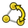 | ↳ Angle Dimension From 3 Points | `TechDraw_CompDimensionTools` | Inserts an angle dimension between 3 selected points |
| 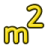 | ↳ Area Annotation | `TechDraw_CompDimensionTools` | Inserts an annotation showing the area of a selected face |
|  | ↳ Arc Length Dimension | `TechDraw_CompDimensionTools` | Arc Length Dimension |
|  | ↳ Horizontal Extent Dimension | `TechDraw_CompDimensionTools` | Inserts a dimension showing the horizontal extent (overall length) of an object or feature |
|  | ↳ Vertical Extent Dimension | `TechDraw_CompDimensionTools` | Inserts a dimension showing the vertical extent (overall length) of an object or feature |
|  | ↳ Horizontal Chain Dimension | `TechDraw_CompDimensionTools` | Horizontal Chain Dimension |
|  | ↳ Vertical Chain Dimension | `TechDraw_CompDimensionTools` | Vertical Chain Dimension |
|  | ↳ Oblique Chain Dimension | `TechDraw_CompDimensionTools` | Oblique Chain Dimension |
|  | ↳ Horizontal Coordinate Dimension | `TechDraw_CompDimensionTools` | Horizontal Coordinate Dimension |
|  | ↳ Vertical Coordinate Dimension | `TechDraw_CompDimensionTools` | Vertical Coordinate Dimension |
|  | ↳ Oblique Coordinate Dimension | `TechDraw_CompDimensionTools` | Oblique Coordinate Dimension |
|  | ↳ Horizontal Chamfer Dimension | `TechDraw_CompDimensionTools` | Horizontal Chamfer Dimension |
|  | ↳ Vertical Chamfer Dimension | `TechDraw_CompDimensionTools` | Vertical Chamfer Dimension |
|  | Cosmetic Vertex | `TechDraw_CosmeticVertexGroup` | Inserts a cosmetic vertex into a view |
|  | ↳ Midpoint Vertices | `TechDraw_CosmeticVertexGroup` | Inserts cosmetic vertices at the midpoint of the selected edges |
| 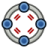 | ↳ Quadrant Vertices | `TechDraw_CosmeticVertexGroup` | Inserts cosmetic vertices at the quadrant points of the selected circles |
|  | Edit Line Appearance | `TechDraw_DecorateLine` | Opens the 'Line decoration' dialog to edit the selected lines |
|  | Detail View | `TechDraw_DetailView` | Inserts a new detail view based on the selected view in the current page |
|  | Diameter Dimension | `TechDraw_DiameterDimension` | Inserts a diameter dimension of a circular edge or arc |
|  | Dimension | `TechDraw_Dimension` | Inserts new contextual dimensions to the selection. Depending on your selection you might have several dimensions available. You can cycle through them using the M key. Left clicking on empty space will validate the current dimension. Right clicking or pressing Esc will cancel. |
|  | Repair Dimension References | `TechDraw_DimensionRepair` | Repairs broken or incorrect dimension references |
|  | Draft View | `TechDraw_DraftView` | Inserts a view of a Draft object |
|  | Export Page as DXF | `TechDraw_ExportPageDXF` | Exports the current page as a DXF |
|  | Export Page as SVG | `TechDraw_ExportPageSVG` | Exports the current page as an SVG |
|  | Arc Length Annotation | `TechDraw_ExtensionArcLengthAnnotation` | Inserts an annotation with the calculated arc length of the selected edges |
|  | Area Annotation | `TechDraw_ExtensionAreaAnnotation` | Calculates the area of multiple selected faces |
|  | Horizontal Chamfer Dimension | `TechDraw_ExtensionChamferDimensionGroup` | Horizontal Chamfer Dimension |
|  | ↳ Vertical Chamfer Dimension | `TechDraw_ExtensionChamferDimensionGroup` | Vertical Chamfer Dimension |
|  | Change Line Attributes | `TechDraw_ExtensionChangeLineAttributes` | Change Line Attributes |
|  | Circle Centerlines | `TechDraw_ExtensionCircleCenterLinesGroup` | Circle Centerlines |
|  | ↳ Bolt Circle Centerlines | `TechDraw_ExtensionCircleCenterLinesGroup` | Bolt Circle Centerlines |
|  | Horizontal Chain Dimension | `TechDraw_ExtensionCreateChainDimensionGroup` | Horizontal Chain Dimension |
|  | ↳ Vertical Chain Dimension | `TechDraw_ExtensionCreateChainDimensionGroup` | Vertical Chain Dimension |
|  | ↳ Oblique Chain Dimension | `TechDraw_ExtensionCreateChainDimensionGroup` | Oblique Chain Dimension |
|  | Horizontal Coordinate Dimension | `TechDraw_ExtensionCreateCoordDimensionGroup` | Horizontal Coordinate Dimension |
| 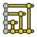 | ↳ Vertical Coordinate Dimension | `TechDraw_ExtensionCreateCoordDimensionGroup` | Vertical Coordinate Dimension |
|  | ↳ Oblique Coordinate Dimension | `TechDraw_ExtensionCreateCoordDimensionGroup` | Oblique Coordinate Dimension |
|  | Arc Length Dimension | `TechDraw_ExtensionCreateLengthArc` | Arc Length Dimension |
|  | Customize Format Label | `TechDraw_ExtensionCustomizeFormat` | Customizes the format label of a selected dimension or balloon |
|  | Cosmetic 1 Point Circle | `TechDraw_ExtensionDrawCirclesGroup` | Cosmetic 1 Point Circle |
|  | ↳ Cosmetic 2 Point Circle | `TechDraw_ExtensionDrawCirclesGroup` | Cosmetic 2 Point Circle |
| 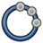 | ↳ Cosmetic 3 Point Circle | `TechDraw_ExtensionDrawCirclesGroup` | Cosmetic 3 Point Circle |
| 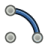 | ↳ Cosmetic Arc | `TechDraw_ExtensionDrawCirclesGroup` | Cosmetic Arc |
|  | Extend Line | `TechDraw_ExtensionExtendShortenLineGroup` | Extend Line |
|  | ↳ Shorten Line | `TechDraw_ExtensionExtendShortenLineGroup` | Shorten Line |
|  | Increase Decimal Places | `TechDraw_ExtensionIncreaseDecreaseGroup` | Increase Decimal Places |
|  | ↳ Decrease Decimal Places | `TechDraw_ExtensionIncreaseDecreaseGroup` | Decrease Decimal Places |
|  | Insert '⌀' Prefix | `TechDraw_ExtensionInsertPrefixGroup` | Insert '⌀' Prefix |
|  | ↳ Insert '□' Prefix | `TechDraw_ExtensionInsertPrefixGroup` | Insert '□' Prefix |
|  | ↳ Insert 'n×' Prefix | `TechDraw_ExtensionInsertPrefixGroup` | Insert 'n×' Prefix |
|  | ↳ Remove Prefix | `TechDraw_ExtensionInsertPrefixGroup` | Remove Prefix |
|  | Cosmetic Parallel Line | `TechDraw_ExtensionLinePPGroup` | Cosmetic Parallel Line |
|  | ↳ Cosmetic Perpendicular Line | `TechDraw_ExtensionLinePPGroup` | Cosmetic Perpendicular Line |
|  | Toggle View Lock | `TechDraw_ExtensionLockUnlockView` | Toggle View Lock |
|  | Position Section View | `TechDraw_ExtensionPositionSectionView` | Aligns the selected section view with its source view orthogonally or the selected edge in the section view to the selected vertex in the base view |
|  | Select Line Attributes, Cascade Spacing and Delta Distance | `TechDraw_ExtensionSelectLineAttributes` | Select Line Attributes, Cascade Spacing and Delta Distance |
|  | Cosmetic Thread Hole Side View | `TechDraw_ExtensionThreadsGroup` | Cosmetic Thread Hole Side View |
|  | ↳ Cosmetic Thread Hole Bottom View | `TechDraw_ExtensionThreadsGroup` | Cosmetic Thread Hole Bottom View |
| 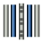 | ↳ Cosmetic Thread Bolt Side View | `TechDraw_ExtensionThreadsGroup` | Cosmetic Thread Bolt Side View |
|  | ↳ Cosmetic Thread Bolt Bottom View | `TechDraw_ExtensionThreadsGroup` | Cosmetic Thread Bolt Bottom View |
|  | Cosmetic Intersection Vertices | `TechDraw_ExtensionVertexAtIntersection` | Cosmetic Intersection Vertices |
|  | Horizontal extent | `TechDraw_ExtentGroup` | Insert horizontal extent dimension |
|  | ↳ Vertical extent | `TechDraw_ExtentGroup` | Insert vertical extent dimension |
|  | Update Template Fields | `TechDraw_FillTemplateFields` | Uses document info to populate the template fields |
|  | Geometric Hatch | `TechDraw_GeometricHatch` | Applies a geometric hatch pattern to the selected faces |
|  | Image Hatch | `TechDraw_Hatch` | Applies a hatch pattern to the selected faces using an image file |
|  | Hole/Shaft Fit | `TechDraw_HoleShaftFit` | Adds a hole or shaft fit to a selected length or diameter dimension |
|  | Horizontal Length Dimension | `TechDraw_HorizontalDimension` | Inserts a horizontal length dimension of an edge or distance between two points |
|  | Leader Line | `TechDraw_LeaderLine` | Adds a leader line |
|  | Length Dimension | `TechDraw_LengthDimension` | Inserts a length dimension of an edge or distance between two points |
|  | New Page | `TechDraw_PageDefault` | Creates a new page with the default template |
|  | New Page From Template | `TechDraw_PageTemplate` | Creates a new page from a custom template |
|  | Print All Pages | `TechDraw_PrintAll` | Prints all pages with the print dialog |
|  | Radius Dimension | `TechDraw_RadiusDimension` | Inserts a radius dimension of a circular edge or arc |
|  | Redraw Page | `TechDraw_RedrawPage` | Redraws the current page |
|  | Rich Text Annotation | `TechDraw_RichTextAnnotation` | Inserts a rich text annotation in the current page |
|  | Section View | `TechDraw_SectionGroup` | Inserts a simple section view |
|  | ↳ Complex Section View | `TechDraw_SectionGroup` | Inserts a complex section view |
|  | Toggle Edge Visibility | `TechDraw_ShowAll` | Toggles the visibility of the selected edges |
|  | Spreadsheet View | `TechDraw_SpreadsheetView` | Inserts a view of a spreadsheet in the current page |
|  | Stack Top | `TechDraw_StackGroup` | Moves the view to the top of the stack |
|  | ↳ Stack Bottom | `TechDraw_StackGroup` | Moves the view to the bottom of the stack |
|  | ↳ Stack Up | `TechDraw_StackGroup` | Moves the view up one level |
|  | ↳ Stack Down | `TechDraw_StackGroup` | Moves the view down one level |
|  | Surface Finish Symbol | `TechDraw_SurfaceFinishSymbols` | Adds a surface finish symbol in the selected view |
|  | Toggle View Frames | `TechDraw_ToggleFrame` | Toggles visibility of view frames and vertices |
|  | Vertical Length Dimension | `TechDraw_VerticalDimension` | Inserts a vertical length dimension of an edge or distance between two points |
|  | New View | `TechDraw_View` | Inserts a new view into the current page based on the selected object in the tree view or 3D view. If no object is selected, a file browser opens to select an SVG or image file. |
|  | Weld Symbol | `TechDraw_WeldSymbol` | Adds welding information to the selected leader line |
|  | Self-test... | `Test_Test` | Runs a self-test to check if the application works properly |
|  | Test all | `Test_TestAll` | Runs all tests at once (can take very long!) |
|  | Test base | `Test_TestBase` | Test the basic functions of FreeCAD |
|  | Test Document | `Test_TestDoc` | Test the document (creation, save, load and destruction) |
